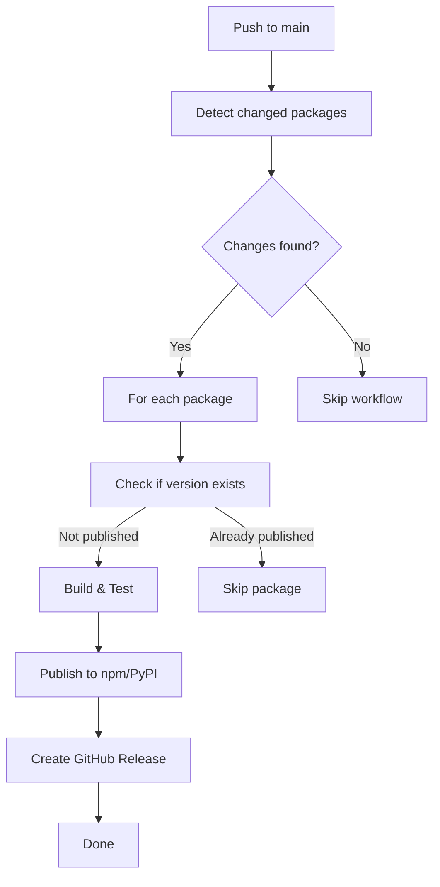

# Automated Publishing Setup Guide
**Auto-publish packages when merged to main branch**

---

## 🎯 Overview

The automated publishing workflow:
- ✅ Triggers on push to `main` branch
- ✅ Detects which packages changed
- ✅ Builds and tests each package
- ✅ Publishes to npm/PyPI automatically
- ✅ Creates GitHub releases
- ✅ Skips if version already published
- ✅ Runs in parallel for multiple packages

---

## 📋 Prerequisites

### 1. npm Access Token

**Create Token:**
1. Go to https://www.npmjs.com/settings/YOUR_USERNAME/tokens
2. Click "Generate New Token" → "Classic Token"
3. Select "Automation" (for CI/CD)
4. Copy the token (starts with `npm_...`)

**Add to GitHub Secrets:**
1. Go to your repo → Settings → Secrets and variables → Actions
2. Click "New repository secret"
3. Name: `NPM_TOKEN`
4. Value: Paste your npm token
5. Click "Add secret"

### 2. PyPI Access Token (for Python packages)

**Create Token:**
1. Go to https://pypi.org/manage/account/token/
2. Click "Add API token"
3. Token name: "GitHub Actions"
4. Scope: "Entire account" (or specific project)
5. Copy the token (starts with `pypi-...`)

**Add to GitHub Secrets:**
1. Go to your repo → Settings → Secrets and variables → Actions
2. Click "New repository secret"
3. Name: `PYPI_TOKEN`
4. Value: Paste your PyPI token
5. Click "Add secret"

### 3. Verify GitHub Token

The workflow uses `GITHUB_TOKEN` which is automatically provided by GitHub Actions.
No setup needed! ✅

---

## 🚀 How It Works

### Workflow Trigger

The workflow runs when:
1. **Code is pushed to `main` branch**
2. **Changes detected in `packages/` or `products/` directories**
3. **Manual trigger** via GitHub Actions UI

### Publishing Logic



### Version Management

**Important**: The workflow publishes the version in `package.json` or `pyproject.toml`.

**Before merging to main:**
1. Bump the version in the package
2. Commit the version change
3. Merge to main
4. Workflow auto-publishes

---

## 📝 Version Bumping Strategies

### Option 1: Manual Version Bump

```bash
# In the package directory
cd packages/performance

# Bump version (choose one)
npm version patch        # 0.1.0 → 0.1.1
npm version minor        # 0.1.0 → 0.2.0
npm version major        # 0.1.0 → 1.0.0
npm version prerelease --preid=alpha  # 0.1.0-alpha.1 → 0.1.0-alpha.2

# Commit and push
git add package.json
git commit -m "chore: bump performance to v0.1.1"
git push
```

### Option 2: Automated Version Bump (Recommended)

Create a version bump workflow that runs before publishing:

```yaml
# .github/workflows/version-bump.yml
name: Auto Version Bump

on:
  push:
    branches:
      - main
    paths:
      - 'packages/**'
      - 'products/**'

jobs:
  bump-version:
    runs-on: ubuntu-latest
    steps:
      - uses: actions/checkout@v4
        with:
          token: ${{ secrets.GITHUB_TOKEN }}

      - name: Setup Node.js
        uses: actions/setup-node@v4
        with:
          node-version: '20'

      - name: Bump versions
        run: |
          # Detect changed packages and bump their versions
          CHANGED_FILES=$(git diff --name-only HEAD^ HEAD)

          for pkg in packages/*/package.json products/*/package.json; do
            PKG_DIR=$(dirname "$pkg")
            if echo "$CHANGED_FILES" | grep -q "^$PKG_DIR/"; then
              cd "$PKG_DIR"
              npm version prerelease --preid=alpha --no-git-tag-version
              cd -
            fi
          done

      - name: Commit version bumps
        run: |
          git config user.name "github-actions[bot]"
          git config user.email "github-actions[bot]@users.noreply.github.com"
          git add .
          git commit -m "chore: auto-bump versions [skip ci]" || echo "No changes"
          git push
```

### Option 3: Semantic Release (Advanced)

Use semantic-release for automatic version management based on commit messages:

```bash
npm install --save-dev semantic-release @semantic-release/git @semantic-release/changelog
```

---

## 🔧 Configuration

### Workflow File Location

```
.github/workflows/auto-publish.yml
```

### Customize Trigger

**Publish only on specific tags:**
```yaml
on:
  push:
    tags:
      - 'v*.*.*'
```

**Publish only specific packages:**
```yaml
on:
  push:
    branches:
      - main
    paths:
      - 'packages/performance/**'
      - 'packages/security/**'
```

**Add manual approval:**
```yaml
jobs:
  approve:
    name: Approve Publication
    runs-on: ubuntu-latest
    steps:
      - uses: trstringer/manual-approval@v1
        with:
          secret: ${{ secrets.GITHUB_TOKEN }}
          approvers: your-github-username

  publish-npm:
    needs: approve
    # ... rest of job
```

---

## 🧪 Testing the Workflow

### 1. Test Without Publishing (Dry Run)

Modify workflow temporarily:
```yaml
- name: Publish to npm
  run: |
    npm publish --dry-run --access public --tag alpha
    echo "✅ Dry run successful"
```

### 2. Manual Trigger

1. Go to Actions tab in GitHub
2. Select "Auto-Publish Packages"
3. Click "Run workflow"
4. Select branch: `main`
5. Click "Run workflow"

### 3. Test with Feature Branch

```bash
# Create test branch
git checkout -b test-auto-publish

# Make a change to a package
cd packages/performance
npm version prerelease --preid=alpha

# Commit and push
git add package.json
git commit -m "test: trigger auto-publish"
git push origin test-auto-publish

# Create PR and merge to main
gh pr create --title "Test auto-publish" --body "Testing automated publishing"
gh pr merge --auto --squash
```

---

## 📊 Monitoring

### View Workflow Runs

1. Go to your repo → Actions tab
2. Select "Auto-Publish Packages" workflow
3. See all runs with status

### Check Published Packages

**npm packages:**
```bash
npm info @vipasane/agentscope-performance
npm info @vipasane/cli-startup-optimizer
```

**PyPI packages:**
```bash
pip search alpha-feedback-system
# Or visit: https://pypi.org/project/alpha-feedback-system/
```

### GitHub Releases

1. Go to your repo → Releases
2. See all auto-created releases
3. Each release is tagged with `package-name@version`

---

## 🚨 Troubleshooting

### Issue 1: "Version already exists"

**Cause**: Trying to publish a version that's already on npm/PyPI

**Solution**:
```bash
# Bump the version
cd packages/your-package
npm version patch
git commit -am "chore: bump version"
git push
```

### Issue 2: "npm token invalid"

**Cause**: NPM_TOKEN secret is missing or expired

**Solution**:
1. Create new token on npmjs.com
2. Update `NPM_TOKEN` secret in GitHub
3. Re-run workflow

### Issue 3: "Build failed"

**Cause**: TypeScript errors or missing dependencies

**Solution**:
```bash
# Test locally first
cd packages/your-package
npm ci
npm run build
npm test

# Fix errors and commit
git push
```

### Issue 4: "Permission denied"

**Cause**: Account doesn't have publish permissions for scope

**Solution**:
1. Verify you own the npm scope
2. Check package.json has correct scope
3. Ensure token has "Automation" permission

### Issue 5: Workflow doesn't trigger

**Cause**: Changes not in monitored paths

**Solution**: Check workflow `paths` filter includes your changes:
```yaml
paths:
  - 'packages/**'
  - 'products/**'
  - 'your-custom-path/**'
```

---

## 🔒 Security Best Practices

### 1. Restrict Token Permissions

**npm token:**
- Use "Automation" tokens (not "Publish" tokens)
- Scope to specific packages if possible

**PyPI token:**
- Scope to specific project, not entire account
- Rotate tokens every 90 days

### 2. Protect Main Branch

```bash
# GitHub Settings → Branches → Branch protection rules
✅ Require pull request reviews
✅ Require status checks (tests pass)
✅ Require approvals (1-2 people)
✅ Include administrators
```

### 3. Audit Workflow Runs

- Review workflow logs monthly
- Check for suspicious package changes
- Monitor npm download stats for anomalies

### 4. Use Provenance (npm)

Add to workflow:
```yaml
- name: Publish to npm
  run: |
    npm publish --provenance --access public --tag alpha
```

This creates verifiable link between package and source code.

---

## 📈 Advanced Features

### Publish to Different Tags

**Stable releases:**
```yaml
- name: Determine npm tag
  id: tag
  run: |
    if [[ "$VERSION" =~ alpha|beta ]]; then
      echo "tag=alpha" >> $GITHUB_OUTPUT
    else
      echo "tag=latest" >> $GITHUB_OUTPUT
    fi

- name: Publish to npm
  run: |
    npm publish --access public --tag ${{ steps.tag.outputs.tag }}
```

### Notify on Slack/Discord

Add to workflow:
```yaml
- name: Notify Slack
  uses: slackapi/slack-github-action@v1
  with:
    payload: |
      {
        "text": "📦 Published ${{ steps.pkg-info.outputs.name }}@${{ steps.pkg-info.outputs.version }}"
      }
  env:
    SLACK_WEBHOOK_URL: ${{ secrets.SLACK_WEBHOOK }}
```

### Multi-Registry Publishing

Publish to npm AND GitHub Packages:
```yaml
- name: Publish to npm
  run: npm publish --access public --tag alpha
  env:
    NODE_AUTH_TOKEN: ${{ secrets.NPM_TOKEN }}

- name: Setup for GitHub Packages
  uses: actions/setup-node@v4
  with:
    registry-url: 'https://npm.pkg.github.com'

- name: Publish to GitHub Packages
  run: npm publish --access public
  env:
    NODE_AUTH_TOKEN: ${{ secrets.GITHUB_TOKEN }}
```

---

## ✅ Setup Checklist

Before enabling automated publishing:

- [ ] NPM_TOKEN created and added to GitHub secrets
- [ ] PYPI_TOKEN created and added to GitHub secrets (if needed)
- [ ] Main branch protection enabled
- [ ] Workflow file added (`.github/workflows/auto-publish.yml`)
- [ ] All packages have correct versions in package.json/pyproject.toml
- [ ] All packages build successfully locally
- [ ] All tests pass locally
- [ ] Dry run tested successfully
- [ ] Team notified about automated publishing

---

## 🎯 Quick Start

1. **Add secrets** (npm token, PyPI token)
2. **Commit workflow** file to main branch
3. **Test** with a version bump
4. **Monitor** first automated publish
5. **Iterate** based on results

---

## 📞 Need Help?

- **Workflow issues**: Check Actions logs in GitHub
- **npm publishing**: https://docs.npmjs.com/cli/v8/commands/npm-publish
- **PyPI publishing**: https://packaging.python.org/tutorials/packaging-projects/
- **GitHub Actions**: https://docs.github.com/en/actions

---

**Ready to enable automated publishing?**

1. Add tokens to GitHub secrets
2. Commit the workflow file
3. Merge a version bump to main
4. Watch it publish automatically! 🚀
