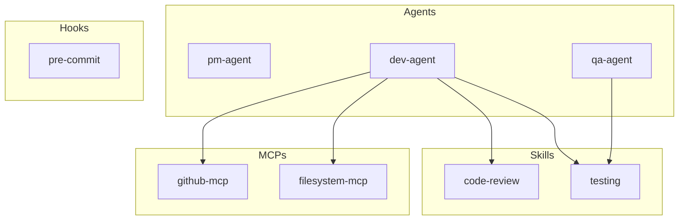
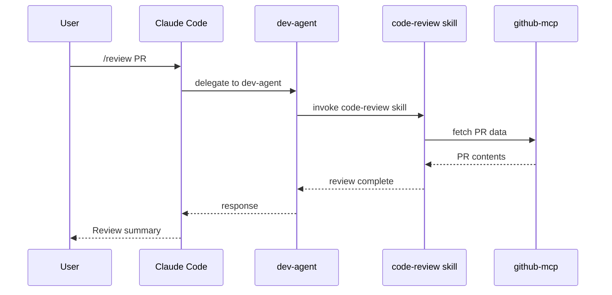

# AgentScope PRD v2.0

> **Agent Architecture Documentation & Visualization Tool**
> **Version**: 2.0 (Revised based on research findings)
> **Date**: January 2026

---

## 1. Executive Summary

AgentScope is an open-source CLI tool that automatically scans Claude Code agent configurations and generates Mermaid diagrams plus shareable documentation. It answers the fundamental question every developer has: "What agents, skills, hooks, and MCPs do I have?"

### What Changed from v1.0

| Aspect | v1.0 PRD | v2.0 PRD | Rationale |
|--------|----------|----------|-----------|
| **Timeline** | 20 weeks, 5 phases | 1-2 days MVP with agentic coding | Swarms build features rapidly |
| **Framework Support** | 5 frameworks (Claude Code, BMad, Gemini, Claude-flow, Spec-kit) | Claude Code + MCP only | Covers 90% of users |
| **Diagrams** | 6 diagram types | 2 smart defaults (Component Map, Workflow Sequence) | 80/20 rule |
| **Documentation** | 7 output files | README.md + AGENTS.md | Minimal viable docs |
| **Features** | Compare, Export, Optimize, Watch | Scan, Diagram only | Cut feature creep |
| **Bottleneck** | Development time | Human review time | Agentic coding shifts constraints |

### Core Value Proposition

> "Understand your agent setup in 30 seconds with auto-generated diagrams and shareable documentation."

---

## 2. Problem Statement

### Primary Problems

| Problem | Impact |
|---------|--------|
| **Configuration Sprawl** | Teams can't see all active agents, skills, hooks, MCPs. Steep onboarding. |
| **No Visualization** | Understanding requires reading scattered markdown files |
| **Stale Documentation** | Manual docs become outdated as agents evolve |

### Target User

**Primary**: Individual Developer using Claude Code
- Wants to understand their own agent setup
- Needs to share configuration with teammates
- Values quick, automated documentation

**Secondary** (Post-MVP): Team Lead / Tech Lead
- Wants overview of team's agent configurations
- Needs to compare against company workflows

### User Story (MVP)

> "As a developer using Claude Code, I want to run a single command and get a visual map of my entire agent setup so I can understand and share my configuration."

---

## 3. Solution Overview

### v1.0 Scope (MVP)

AgentScope v1.0 delivers:

1. **Claude Code Scanner** - Scans `.claude/`, `CLAUDE.md`, and user-level configs
2. **MCP Scanner** - Parses `.mcp.json` for server definitions
3. **Component Map Diagram** - Shows all agents, skills, hooks, commands, MCPs
4. **Workflow Sequence Diagram** - Shows request flow from user to agent to tools
5. **README.md** - Overview with embedded diagrams
6. **AGENTS.md** - Detailed agent documentation with code examples

### What's NOT in v1.0

| Feature | Status | Target Version |
|---------|--------|----------------|
| BMad Method scanner | Deferred | v1.2 |
| Gemini CLI scanner | Deferred | v2.0+ |
| Claude-flow scanner | Deferred | v2.0+ |
| Workflow Comparator | Deferred | v1.3 |
| Export feature | Deferred | v2.0+ (one-way only) |
| Plugin system | Deferred | v2.0+ |
| VS Code extension | Deferred | v2.0+ |
| Watch mode | Deferred | Use CI/Git hooks |
| GitHub Action | Deferred | v1.3 |
| Interactive web viewer | Deferred | v2.0+ |

---

## 4. Core Features v1.0

### 4.1 Scanner Module

Discovers configurations from Claude Code sources:

| Source | Paths | Components Extracted |
|--------|-------|---------------------|
| Claude Code Project | `.claude/`, `CLAUDE.md` | Agents, skills, commands, hooks, settings |
| Claude Code User | `~/.claude/` | Global agents, skills, settings |
| MCP Servers | `.mcp.json` | Server definitions, tool capabilities |

### 4.2 Diagram Generator

**Smart Defaults** (generated automatically):

| Diagram | Purpose | When Useful |
|---------|---------|-------------|
| **Component Map** | Shows all agents, skills, hooks, MCPs | Always - answers "what do I have?" |
| **Workflow Sequence** | Shows request flow | Always - answers "how does it work?" |

**On-Demand** (via `--diagram` flag):

| Diagram | Purpose | Command |
|---------|---------|---------|
| Agent Hierarchy | Parent/subagent relationships | `--diagram hierarchy` |
| Data Flow | Data movement through system | `--diagram dataflow` |
| Permission Matrix | Agent-to-tool permissions | `--diagram permissions` |
| Hook Lifecycle | Event trigger sequences | `--diagram hooks` |

### 4.3 Documentation Generator

Outputs to `docs/agent-architecture/`:

```
docs/agent-architecture/
├── README.md          # Overview with diagrams + TOC
├── AGENTS.md          # Detailed agent docs with code examples
└── raw/
    └── agentscope.json  # Raw unified config (for tooling)
```

**README.md Structure**:
- Summary statistics (X agents, Y skills, Z MCPs)
- Component Map diagram
- Workflow Sequence diagram
- Quick reference table
- Link to detailed AGENTS.md

**AGENTS.md Structure**:
- Per-agent documentation
- Configuration snippets (actual YAML/JSON from source)
- Skills used by each agent
- Hooks triggered by each agent

---

## 5. Quality Requirements

> **Critical**: Agentic coding produces changes rapidly. Quality gates ensure correctness.

### 5.1 Test-Driven Development (TDD)

**Requirement**: Tests MUST be written BEFORE implementation.

| Phase | Test Type | Coverage Target |
|-------|-----------|-----------------|
| Before coding | Unit tests for parser functions | 80%+ line coverage |
| Before coding | Integration tests for CLI commands | All commands covered |
| Before coding | Snapshot tests for diagram output | All diagram types |

**Test File Structure**:
```
tests/
├── unit/
│   ├── parsers/
│   │   ├── claude-code.test.ts
│   │   └── mcp.test.ts
│   ├── generators/
│   │   └── mermaid.test.ts
│   └── model/
│       └── unified-config.test.ts
├── integration/
│   ├── scan.test.ts
│   └── diagram.test.ts
├── snapshots/
│   └── diagrams/
│       ├── component-map.snap.md
│       └── workflow-sequence.snap.md
└── fixtures/
    ├── minimal/        # Basic happy path
    ├── complete/       # All features used
    └── edge-cases/     # Error conditions
```

### 5.2 Automated Quality Checks

| Check | Tool | Threshold | Blocks Merge |
|-------|------|-----------|--------------|
| Type checking | TypeScript strict | 0 errors | Yes |
| Linting | ESLint | 0 errors, 0 warnings | Yes |
| Code coverage | Vitest | 80% lines | Yes |
| Tests passing | Vitest | 100% pass | Yes |
| Mermaid validity | mermaid-cli | 100% valid | Yes |

### 5.3 Verifiable Outcomes

Every feature MUST have measurable acceptance criteria:

| Feature | Acceptance Test |
|---------|-----------------|
| Claude Code scanner | Parses all fixture configs without error |
| MCP scanner | Extracts all servers and tools from .mcp.json |
| Component Map | Renders valid Mermaid, includes all detected components |
| Workflow Sequence | Renders valid Mermaid, shows correct flow order |
| README generation | Contains all required sections, no broken links |
| AGENTS.md generation | Documents each agent with actual config snippets |
| CLI `scan` command | Exit code 0 on success, generates all outputs |

### 5.4 Review Gates

| Gate | Trigger | Reviewer | Action |
|------|---------|----------|--------|
| Pre-commit | `git commit` | Automated (lint, types) | Block if fails |
| PR created | `git push` | CI (tests, coverage) | Block merge if fails |
| PR review | CI passes | Human | Required approval |
| Pre-merge | Approval received | Automated (final check) | Block if tests fail |

---

## 6. Technical Architecture

### System Components

```
┌─────────────────────────────────────────────────────┐
│                  AgentScope CLI                      │
├─────────────────┬─────────────────┬─────────────────┤
│    Scanner      │   Visualizer    │   Documenter    │
├─────────────────┼─────────────────┼─────────────────┤
│ Claude Code     │    Mermaid      │    Markdown     │
│ Parser          │   Generator     │     Writer      │
│ MCP Parser      │                 │                 │
├─────────────────┴─────────────────┴─────────────────┤
│              Unified Config Model                    │
└─────────────────────────────────────────────────────┘
```

### Unified Config Model

```typescript
interface AgentScopeConfig {
  meta: {
    name: string;
    version: string;
    scanDate: string;
    projectPath: string;
  };
  agents: Agent[];
  skills: Skill[];
  hooks: Hook[];
  commands: Command[];
  mcpServers: MCPServer[];
  settings: Settings;
  errors: ScanError[];  // Categorized errors from scan
}

interface Agent {
  id: string;
  name: string;
  description: string;
  source: 'project' | 'user';  // Where config came from
  sourcePath: string;          // Actual file path
  allowedTools: string[];
  skills: string[];            // Skill IDs
  configSnippet: string;       // Raw YAML/MD for docs
}

interface ScanError {
  level: 'fatal' | 'warning' | 'info';
  message: string;
  file: string;
  suggestion?: string;
}
```

### Tech Stack

| Need | Package | Rationale |
|------|---------|-----------|
| CLI framework | Commander.js | 238M weekly downloads, battle-tested |
| YAML parsing | js-yaml | 119M downloads, standard choice |
| Frontmatter | gray-matter | 3M downloads, markdown frontmatter |
| File discovery | globby | 90M downloads, glob patterns |
| File I/O | fs-extra | 50M downloads, improved fs |
| Validation | Zod | 25M downloads, TypeScript-first |
| Markdown | unified/remark | 20M downloads, AST-based |
| Templates | Handlebars | 12M downloads, logic-less templates |

**Total**: ~11 runtime dependencies (~151KB gzipped)

---

## 7. Implementation Plan

### Timeline: 1-2 Days with Agentic Coding

> **Key Insight**: With agentic swarms, development is no longer the bottleneck. Human REVIEW is the bottleneck. Plan accordingly.

#### Day 1: Foundation + Scanner

| Task | Agent | Output | Review Gate |
|------|-------|--------|-------------|
| Write test fixtures | Researcher | `tests/fixtures/` | Human review structure |
| Write scanner tests | Tester | `tests/unit/parsers/` | Tests must pass |
| Implement Claude Code parser | Coder | `src/parsers/claude-code.ts` | Tests must pass |
| Implement MCP parser | Coder | `src/parsers/mcp.ts` | Tests must pass |
| Write unified model | Architect | `src/model/types.ts` | Human review types |
| Implement CLI skeleton | Coder | `src/cli/` | Runs without error |

#### Day 2: Visualization + Documentation

| Task | Agent | Output | Review Gate |
|------|-------|--------|-------------|
| Write diagram tests | Tester | `tests/unit/generators/` | Tests defined |
| Write snapshot tests | Tester | `tests/snapshots/` | Snapshots captured |
| Implement Mermaid generator | Coder | `src/generators/mermaid.ts` | Tests + snapshots pass |
| Write integration tests | Tester | `tests/integration/` | Tests defined |
| Implement doc generator | Coder | `src/generators/docs.ts` | Tests pass |
| Implement CLI commands | Coder | `src/cli/commands/` | Integration tests pass |
| Final review + fixes | Reviewer | All files | Human approval |

### Review-Driven Workflow

```
┌─────────────┐     ┌─────────────┐     ┌─────────────┐
│   Agent     │────▶│    CI       │────▶│   Human     │
│   Builds    │     │   Checks    │     │   Reviews   │
└─────────────┘     └─────────────┘     └─────────────┘
      │                   │                   │
      │ Fast              │ Automated         │ Bottleneck
      │ (minutes)         │ (seconds)         │ (hours)
      ▼                   ▼                   ▼
   Features            Pass/Fail           Approval
   Generated           Signal              or Feedback
```

**Principle**: Agents generate, CI validates, humans approve. Never ship without human review.

---

## 8. Future Roadmap

### v1.1 (Post-MVP Week 1)
- Add Agent Hierarchy diagram
- Add SKILLS.md output file
- Performance optimization (<3s scan)

### v1.2 (Post-MVP Week 2)
- BMad Method scanner
- Data Flow diagram
- Error recovery improvements

### v1.3 (Post-MVP Week 3-4)
- Workflow comparator (optional add-on)
- Claude Code skill package
- GitHub Action for CI/CD

### v2.0 (Future)
- Gemini CLI scanner
- Export feature (one-way with limitations)
- Plugin system for community extensions
- VS Code extension (if demand exists)

---

## 9. Success Metrics

| Metric | Target | Measurement |
|--------|--------|-------------|
| **Claude Code scan coverage** | >95% of config files | Automated test fixtures |
| **Mermaid validity** | 100% valid diagrams | mermaid-cli validation |
| **Test coverage** | >80% line coverage | Vitest coverage report |
| **Scan performance** | <3s for <50 components | Benchmark tests |
| **npm installs** | 100+ in month 1 | npm stats |
| **GitHub stars** | 50+ in month 1 | GitHub metrics |
| **User feedback** | Net positive | GitHub issues sentiment |

---

## 10. CLI Usage

### Installation

```bash
npm install -g agentscope
# or
npx agentscope <command>
```

### Commands (v1.0)

```bash
# Scan and generate docs (smart defaults)
agentscope scan

# Scan with custom output directory
agentscope scan --output ./docs/agents/

# Generate specific diagram only
agentscope scan --diagram hierarchy
agentscope scan --diagram dataflow

# Generate all diagram types
agentscope scan --all-diagrams

# Output raw JSON (for tooling)
agentscope scan --format json

# Strict mode (fail on any warning)
agentscope scan --strict

# Validate only (no doc generation)
agentscope validate

# Show version
agentscope --version

# Show help
agentscope --help
```

### Example Output

```bash
$ agentscope scan

AgentScope v1.0.0
Scanning: /Users/dev/my-project

Found:
  - 3 agents (2 project, 1 user)
  - 5 skills
  - 2 hooks
  - 4 MCP servers

Generated:
  ✓ docs/agent-architecture/README.md
  ✓ docs/agent-architecture/AGENTS.md
  ✓ docs/agent-architecture/raw/agentscope.json

Warnings (1):
  ⚠ agents/dev-agent.md: References skill 'code-review' not found

Scan completed in 1.2s
```

---

## 11. Diagram Examples

### Component Map (Default)



### Workflow Sequence (Default)



---

## 12. Error Handling

### Error Categories

| Category | Behavior | Example |
|----------|----------|---------|
| **Fatal** | Stop scan, exit code 1 | Invalid JSON in .mcp.json |
| **Warning** | Continue, include in report | Agent references missing skill |
| **Info** | Continue, optional display | Deprecated config format detected |

### Error Output

```markdown
## Scan Status

Scan completed with warnings.

### Errors (0)
None

### Warnings (2)
- `agents/dev-agent.md`: References skill `code-review` not found in skills/
- `.mcp.json`: Server `github-mcp` has no tools defined

### Info (1)
- `CLAUDE.md`: Using deprecated `allowed_tools` format, consider updating
```

---

## 13. Security Considerations

- **No code execution**: AgentScope only reads and parses files
- **No network access**: All operations are local
- **No secrets handling**: Does not parse or expose API keys
- **Path validation**: Prevents directory traversal attacks
- **Input sanitization**: All parsed content is sanitized before output

---

## 14. Contributing

This is an open-source project. Contributions welcome:

1. Fork the repository
2. Create a feature branch
3. Write tests FIRST (TDD required)
4. Implement feature
5. Ensure all quality gates pass
6. Submit a pull request

---

## Appendix: Decision Log

| Decision | Choice | Rationale |
|----------|--------|-----------|
| Target audience | Individual developer | Entry point for adoption |
| Framework priority | Claude Code only | 90% of target users |
| Output format | Mermaid markdown | GitHub-native rendering |
| Diagram philosophy | Smart defaults (2 diagrams) | 80/20 rule |
| Documentation style | README + AGENTS.md with code examples | Minimal viable docs |
| Distribution | npm + npx | Standard Node.js approach |
| Error handling | Categorized (fatal/warning/info) | Best of strict and lenient |
| Watch mode | Deferred | Use CI/Git hooks instead |
| Export feature | Deferred to v2.0+ | One-way only, with limitations |
| Plugin system | Deferred to v2.0+ | Validate core first |

---

*Document Version: 2.0 | January 2026 | Status: Ready for Implementation*
