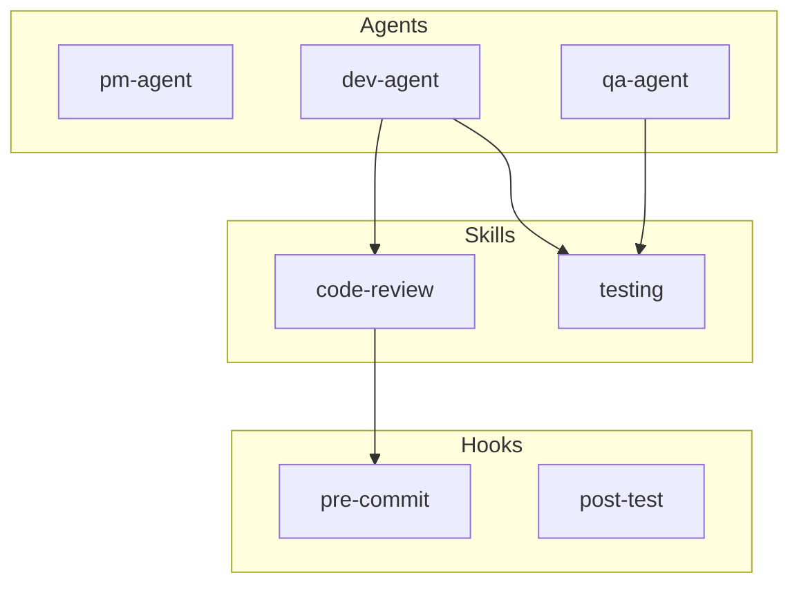
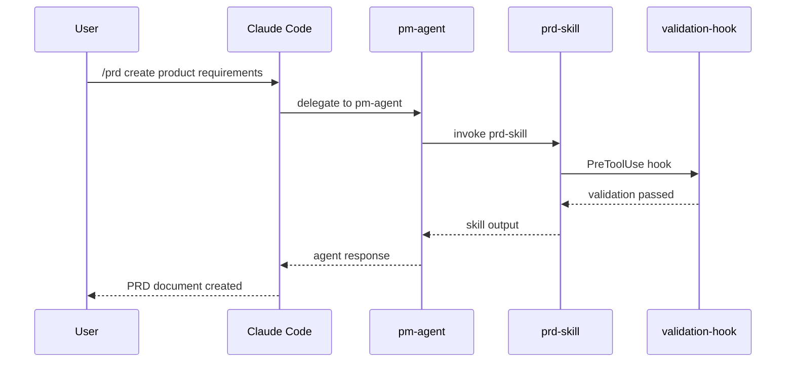
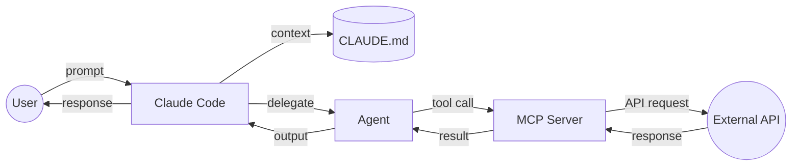
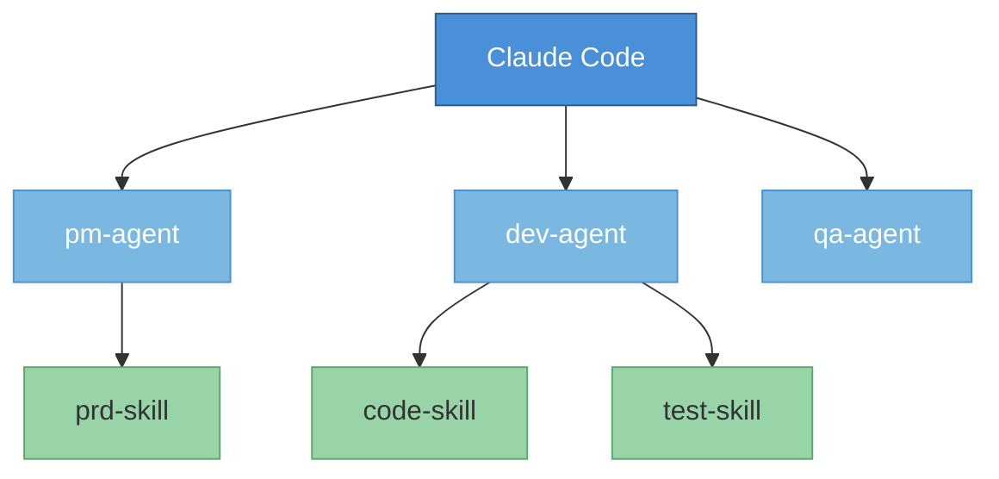
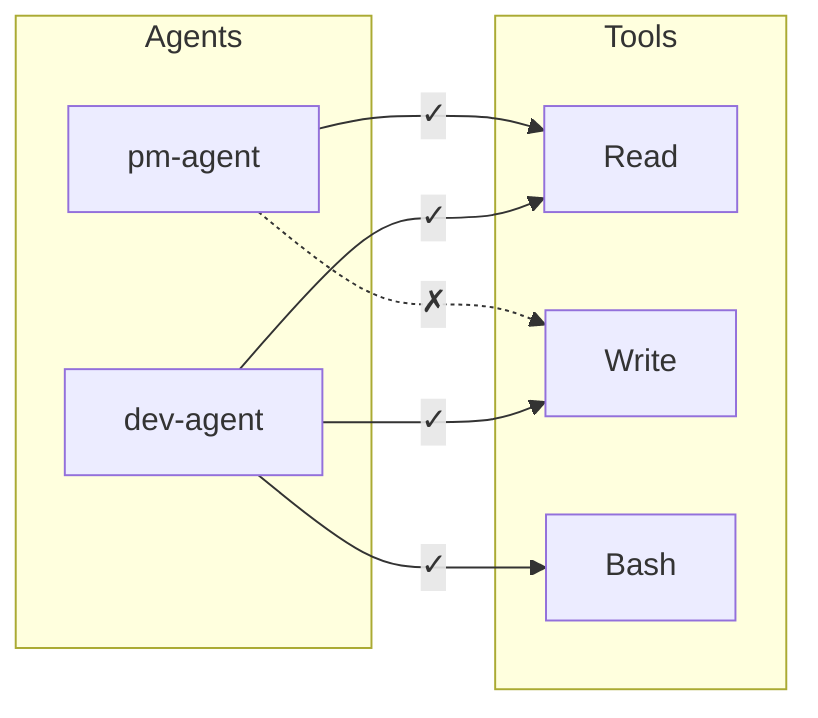
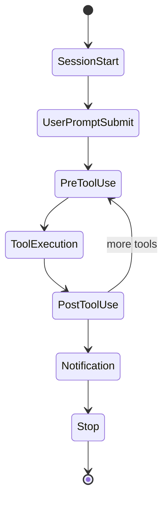

# AgentScope

> **Agent Architecture Documentation & Visualization Tool**

## Executive Summary

AgentScope is an open-source tool for reverse-engineering, documenting, and visualizing coding agent configurations. As agent setups grow complex with multiple frameworks (Claude Code, BMad, Claude-flow, spec-kit, etc.), hooks, skills, MCPs, and subagents, teams struggle to understand their own configurations.

AgentScope solves this by automatically scanning agent setups, generating Mermaid diagrams, producing shareable documentation, and enabling comparison against company development workflows.

---

## Table of Contents

1. [Research Findings](#1-research-findings)
2. [Problem Statement](#2-problem-statement)
3. [Solution Overview](#3-solution-overview)
4. [Core Features](#4-core-features)
5. [Technical Architecture](#5-technical-architecture)
6. [Diagram Examples](#6-diagram-examples)
7. [Implementation Phases](#7-implementation-phases)
8. [CLI Usage](#8-cli-usage)

---

## 1. Research Findings

### Current Landscape

Research conducted in January 2026 reveals a fragmented ecosystem of agent frameworks:

| Framework | Configuration Style | Key Components |
|-----------|-------------------|----------------|
| **Claude Code** | File-based (`.claude/`) | CLAUDE.md, agents/, skills/, commands/, hooks |
| **BMad Method** | YAML + Markdown (`_bmad/`) | Agents, workflows, checklists, templates |
| **Claude-flow** | TypeScript/YAML | Nodes, flows, state machines |
| **Spec-kit / OpenSpec** | Markdown specs | Specifications, requirements, stories |
| **Gemini CLI** | File-based (`GEMINI.md`) | System prompts, tools, extensions |

### Existing Tools Gap

| Tool | What It Does | Gap |
|------|-------------|-----|
| Mermaid MCP Server | Generates diagrams from prompts | Requires manual specification |
| Zencoder Repo Grokking | Auto-generates codebase diagrams | Doesn't understand agent configs |
| DeepWiki (BMad) | Documents single framework | No cross-reference or comparison |
| claude-code-templates | Installs templates | Doesn't document existing setups |

**Key Insight**: No tool exists that can reverse-engineer a scattered multi-framework agent setup and generate unified documentation.

---

## 2. Problem Statement

### Primary Problems

| Problem | Impact |
|---------|--------|
| **Configuration Sprawl** | Teams can't see all active agents, skills, hooks, MCPs. Steep onboarding. |
| **No Visualization** | Understanding requires reading scattered markdown files |
| **Cross-Framework Chaos** | No unified view for BMad + Claude Code + MCP servers |
| **No Workflow Alignment** | Can't verify agent setup aligns with company SDLC |
| **Stale Documentation** | Manual docs outdated as agents evolve |

### User Stories

- **As a developer**, I want to see a visual map of my entire agent setup
- **As a team lead**, I want to compare our agent config against our company workflow
- **As a new team member**, I want auto-generated documentation for quick onboarding
- **As an architect**, I want to export configs between frameworks to reduce lock-in

---

## 3. Solution Overview

### Core Value Proposition

> "Understand your agent setup in 30 seconds with auto-generated diagrams, shareable documentation, and workflow alignment checks."

### Key Capabilities

1. **Scan & Discover** - Detect all agent configurations across frameworks
2. **Visualize** - Generate Mermaid diagrams for workflows, data flows, hierarchies
3. **Document** - Produce GitHub-compatible markdown documentation
4. **Compare** - Align agent setup against company workflow definitions
5. **Optimize** - Identify redundancies, conflicts, and optimization opportunities
6. **Export** - Transform configurations between different frameworks

---

## 4. Core Features

### 4.1 Scanner Module

Discovers configurations from multiple sources:

| Source | Paths | Components Extracted |
|--------|-------|---------------------|
| Claude Code Project | `.claude/`, `CLAUDE.md` | Agents, skills, commands, hooks, settings |
| Claude Code User | `~/.claude/` | Global agents, skills, settings |
| BMad Method | `_bmad/`, `.bmad-core/` | Agent YAML, workflows, checklists |
| MCP Servers | `.mcp.json` | Server definitions, tool capabilities |
| Gemini CLI | `GEMINI.md`, `.gemini/` | System prompts, tools, extensions |

### 4.2 Diagram Generator

Produces multiple diagram types:

- **Workflow Diagram** - Lifecycle: User Input → Agent Selection → Tool Execution → Response
- **Agent Hierarchy** - Parent agents, subagents, delegation patterns
- **Data Flow** - User → Agent → MCP → External API → Agent → User
- **Component Map** - All active: agents, skills, hooks, commands, MCPs
- **Permission Matrix** - Which agents can use which tools
- **Hook Sequence** - Event triggers and lifecycle

### 4.3 Documentation Generator

Outputs to `docs/agent-architecture/`:

```
docs/agent-architecture/
├── README.md          # Overview with summary diagrams
├── AGENTS.md          # Detailed agent documentation
├── SKILLS.md          # Skill catalog with triggers
├── HOOKS.md           # Hook lifecycle documentation
├── MCPS.md            # MCP server inventory
├── WORKFLOWS.md       # Workflow diagrams
└── DATAFLOW.md        # Data flow diagrams
```

### 4.4 Workflow Comparator

Compares against company workflow definition:

```yaml
# company-workflow.yaml
phases:
  - name: Planning
    agents: [analyst, pm, architect]
    artifacts: [prd.md, architecture.md]
  - name: Development
    agents: [dev, qa]
    artifacts: [stories/*.md, tests/]
  - name: Review
    agents: [code-reviewer]
    hooks: [pre-commit, lint]
```

Output:
- ⚠️ Missing agents for Planning phase: `architect`
- ❌ Uncovered workflow step: `code-reviewer` agent not found
- ℹ️ Extra agents not in workflow: `exploration-agent`

---

## 5. Technical Architecture

### System Components

```
┌─────────────────────────────────────────────────────────────┐
│                      AgentScope CLI                         │
├──────────────┬──────────────┬──────────────┬───────────────┤
│   Scanner    │  Visualizer  │  Documenter  │   Exporter    │
├──────────────┼──────────────┼──────────────┼───────────────┤
│ Claude Code  │   Mermaid    │   Markdown   │  JSON Schema  │
│ BMad Parser  │  Generator   │   Writer     │  Transformer  │
│ MCP Parser   │              │              │               │
│ Gemini Parser│              │              │               │
├──────────────┴──────────────┴──────────────┴───────────────┤
│                   Unified Config Model                      │
└─────────────────────────────────────────────────────────────┘
```

### Unified Config Model

```typescript
interface AgentScopeConfig {
  meta: {
    name: string;
    version: string;
    frameworks: string[];
    scanDate: string;
  };
  agents: Agent[];
  skills: Skill[];
  hooks: Hook[];
  commands: Command[];
  mcpServers: MCPServer[];
  workflows: Workflow[];
  permissions: PermissionMatrix;
  settings: Settings;
}
```

---

## 6. Diagram Examples

### Component Map



### Workflow Sequence



### Data Flow



### Agent Hierarchy



### Permission Matrix



### Hook Lifecycle



---

## 7. Implementation Phases

### Phase 1: Foundation (Weeks 1-4)
- Claude Code scanner (agents, skills, hooks, commands)
- Unified config model schema
- Basic Mermaid diagram generation (component map)
- CLI skeleton with scan command

### Phase 2: Visualization (Weeks 5-8)
- Full diagram suite (workflow, hierarchy, data flow, permissions)
- Markdown documentation generator
- GitHub-compatible output structure

### Phase 3: Multi-Framework (Weeks 9-12)
- BMad Method scanner
- MCP server scanner
- Gemini CLI scanner
- Cross-framework unified view

### Phase 4: Advanced Features (Weeks 13-16)
- Workflow comparator
- Optimizer module
- Framework exporter (bidirectional transformation)
- Claude Code skill package

### Phase 5: Ecosystem (Weeks 17-20)
- GitHub Action for CI/CD integration
- VS Code extension
- Community template library
- Interactive web viewer

---

## 8. CLI Usage

### Installation

```bash
npm install -g agentscope
# or
npx agentscope <command>
```

### Commands

```bash
# Scan current directory and generate docs
agentscope scan

# Scan with custom output directory
agentscope scan --output ./docs/agent-architecture/

# Generate specific diagram type
agentscope diagram --type workflow
agentscope diagram --type hierarchy
agentscope diagram --type dataflow
agentscope diagram --type permissions

# Compare against company workflow
agentscope compare --workflow ./company-workflow.yaml

# Optimize and get suggestions
agentscope optimize

# Export to different framework format
agentscope export --from claude-code --to bmad
agentscope export --from bmad --to gemini
```

### Claude Code Skill Integration

Install as skill:

```markdown
<!-- ~/.claude/skills/agentscope/SKILL.md -->
---
name: agentscope
description: Document and visualize your agent configuration. Use when user asks to 'document my setup', 'show agent architecture', 'visualize my agents', or 'create agent docs'.
allowed-tools: Read, Bash, Write
---

# AgentScope Skill

## When invoked:
1. Run `npx agentscope scan --output ./docs/agent-architecture/`
2. Present the generated README.md
3. Offer to explain specific diagrams
```

### GitHub Action

```yaml
# .github/workflows/agentscope.yml
name: Update Agent Documentation
on:
  push:
    paths:
      - '.claude/**'
      - '_bmad/**'
      - '.mcp.json'
      - 'CLAUDE.md'

jobs:
  update-docs:
    runs-on: ubuntu-latest
    steps:
      - uses: actions/checkout@v4
      - run: npx agentscope scan
      - uses: stefanzweifel/git-auto-commit-action@v5
        with:
          commit_message: 'docs: update agent architecture'
```

---

## Success Metrics

| Metric | Target | Measurement |
|--------|--------|-------------|
| Scan Coverage | >95% of config files | Automated tests |
| Diagram Accuracy | 100% valid Mermaid | Mermaid validator |
| Onboarding Time | 50% reduction | User surveys |
| GitHub Stars | 1000+ in 6 months | GitHub metrics |
| Framework Support | 5+ by v1.0 | Feature checklist |
| Performance | <5s scan | Benchmarks |

---

## Contributing

This is an open-source project. Contributions welcome:

1. Fork the repository
2. Create a feature branch
3. Submit a pull request

## License

MIT License

---

*Document Version: 1.0 | January 2026 | Status: Draft for Review*
