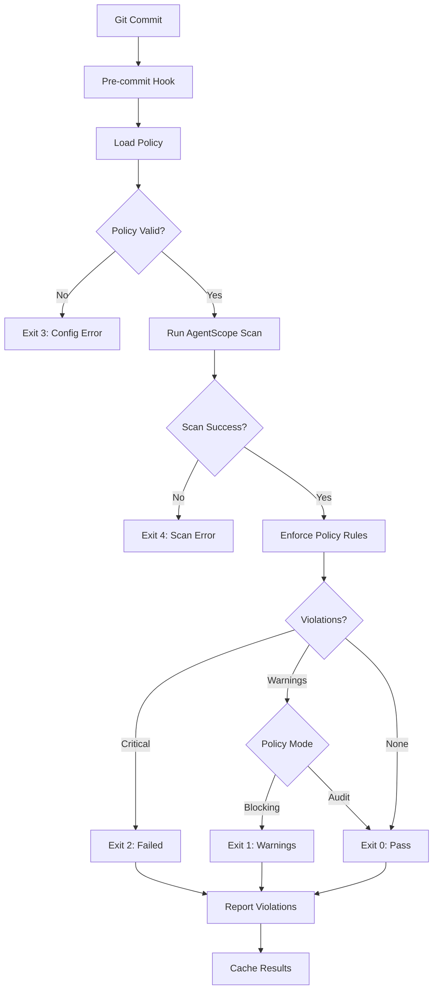

# AgentScope-CI Product Requirements Document

> **CI/CD Integration & Policy Enforcement for Agent Security**
> **Version**: 1.0
> **Date**: January 2026
> **Target Release**: v1.3 (After AgentScope Core is Stable)

---

## 1. Executive Summary

AgentScope-CI is a **CI/CD integration layer** for AgentScope that enables automated security scanning, policy enforcement, and quality gates in development pipelines. It wraps AgentScope's core scanning capabilities with CI/CD-friendly interfaces, exit code handling, and policy-as-code enforcement.

### Core Value Proposition

> "Shift-left security for AI agents: Catch configuration vulnerabilities, prompt injection, and policy violations before they reach production."

### Key Differentiator

AgentScope-CI is **platform-agnostic** - it works with any CI/CD system (GitHub Actions, GitLab CI, Jenkins, CircleCI, etc.) through standard CLI interfaces and exit codes. Platform-specific integrations (GitHub Apps, GitLab Merge Request widgets) are separate products.

### What AgentScope-CI IS

- ✅ Pre-commit hook integration (Husky, lint-staged)
- ✅ Git hooks templates (pre-commit, pre-push, commit-msg)
- ✅ Policy enforcement engine (fail on severity thresholds)
- ✅ Exit code handling for CI/CD pipelines
- ✅ Configuration validation before merge
- ✅ Dashboard/metrics collection (optional)
- ✅ Generic CI/CD integration (YAML examples for multiple platforms)

### What AgentScope-CI IS NOT

- ❌ Platform-specific (GitHub Actions integration is a separate product: AgentScope-GitHub)
- ❌ GitLab-specific (GitLab integration is a separate product: AgentScope-GitLab)
- ❌ A replacement for AgentScope core (it wraps and extends it)

---

## 2. Problem Statement

### 2.1 Primary Problems

| Problem | Impact | Frequency |
|---------|--------|-----------|
| **Manual Security Review** | Security vulnerabilities slip into production | Every merge |
| **Inconsistent Standards** | Teams use different agent configurations | Every new project |
| **Post-Merge Discovery** | Security issues found after code is merged | Weekly |
| **No Enforcement** | Developers can bypass security checks | Daily |
| **Tribal Knowledge** | Security policies exist only in people's heads | Onboarding |

### 2.2 User Pain Points

**DevOps Engineer:**
> "I need to enforce that all agents use approved MCP servers and don't have prompt injection vulnerabilities, but I can't manually review every commit."

**Security Team:**
> "We need to block commits that introduce critical security issues (hardcoded secrets, command injection), but AgentScope only reports - it doesn't enforce."

**Platform Team:**
> "We want a company-wide policy that all agents must pass DREAD risk scoring below 7.0, but we have no way to automatically enforce this."

**Developer:**
> "I want to know if my agent config has issues BEFORE I push, not after CI fails."

### 2.3 Target Users

| User Type | Primary Goal | Pain Point | Success Metric |
|-----------|--------------|------------|----------------|
| **DevOps Engineer** | Automate security validation | Manual reviews don't scale | 90% of issues caught pre-commit |
| **Security Team** | Enforce security policies | Can't block dangerous configs | Zero critical issues in production |
| **Platform Team** | Standardize agent configs | Inconsistent practices | 100% compliance with standards |
| **Developer** | Pass CI on first try | Wasting time on failed builds | CI pass rate >80% |

---

## 3. Solution Overview

### 3.1 Product Architecture

AgentScope-CI wraps AgentScope core with enforcement layers:

```
┌─────────────────────────────────────────────────────────────┐
│                    AgentScope-CI CLI                         │
├──────────────┬──────────────┬──────────────┬───────────────┤
│ Pre-commit   │   Policy     │    Exit      │   Reporting   │
│   Hooks      │  Enforcement │   Codes      │   Dashboard   │
├──────────────┴──────────────┴──────────────┴───────────────┤
│                    AgentScope Core                           │
│              (Scanner + Security Validation)                 │
└─────────────────────────────────────────────────────────────┘
```

### 3.2 Core Features (v1.0)

| Feature | Description | Priority |
|---------|-------------|----------|
| **Pre-commit Integration** | Hook templates for Husky, lint-staged | High |
| **Policy Engine** | Define and enforce security policies | High |
| **Exit Code Handler** | Proper exit codes for CI/CD (0, 1, 2) | High |
| **Severity Thresholds** | Fail builds on critical/high issues | High |
| **Git Hooks Templates** | Ready-to-use hooks for common workflows | Medium |
| **Configuration Validation** | Block merge if config is invalid | Medium |
| **Metrics Collection** | Optional dashboard for security trends | Low |

---

## 4. User Stories (v1.0)

### 4.1 Pre-Commit Workflow

**As a developer**, I want to validate my agent config before committing so I don't waste time on failed CI builds.

**Acceptance Criteria:**
- Pre-commit hook runs AgentScope-CI automatically
- Hook completes in <10 seconds for typical configs
- Clear error messages with remediation suggestions
- Can bypass with `--no-verify` for emergencies (logged)

### 4.2 Policy Enforcement

**As a security engineer**, I want to define policies (no hardcoded secrets, DREAD score <7) so unsafe configs are automatically rejected.

**Acceptance Criteria:**
- Policy defined in `agentscope-ci.yml` file
- Policy violations block commit/merge
- Clear explanation of which policy was violated
- Override mechanism for approved exceptions

### 4.3 CI/CD Integration

**As a DevOps engineer**, I want to integrate AgentScope-CI into our CI pipeline so every PR is automatically validated.

**Acceptance Criteria:**
- Works with GitHub Actions, GitLab CI, Jenkins, CircleCI
- Exit code 0 = pass, 1 = warnings, 2 = critical failure
- YAML examples for 5+ CI platforms
- Can generate security report artifacts

### 4.4 Gradual Adoption

**As a platform team**, I want to roll out enforcement gradually (warning → blocking) so we don't break existing workflows.

**Acceptance Criteria:**
- Policy can be in "audit mode" (report but don't fail)
- Can set different thresholds per repository
- Migration path from audit → warning → blocking
- Metrics show compliance over time

### 4.5 Dashboard Visibility

**As a security manager**, I want to see security trends across all repositories so I can identify systemic issues.

**Acceptance Criteria:**
- Dashboard shows aggregate metrics (optional feature)
- Can filter by team, repository, time range
- Export data as JSON/CSV
- Integration with security dashboards (optional)

---

## 5. Functional Requirements

### 5.1 Pre-Commit Hook Integration

**REQ-PC-001**: Provide pre-commit hook template that runs AgentScope-CI validation
**REQ-PC-002**: Support Husky, lint-staged, and manual Git hooks
**REQ-PC-003**: Hook execution time <10s for typical configs (0-50 agents)
**REQ-PC-004**: Cache scan results to avoid re-scanning unchanged files
**REQ-PC-005**: Clear error messages with file paths and line numbers

### 5.2 Policy Definition Format

**REQ-POL-001**: Policy defined in YAML format (`agentscope-ci.yml`)
**REQ-POL-002**: Support severity thresholds (critical, high, medium, low)
**REQ-POL-003**: Support DREAD score thresholds (0-10 scale)
**REQ-POL-004**: Support deny-list patterns (blocked MCP servers, dangerous tools)
**REQ-POL-005**: Support allow-list patterns (approved MCP servers only)
**REQ-POL-006**: Policy inheritance (repository → team → organization)

**Policy Schema Example:**
```yaml
# agentscope-ci.yml
version: 1.0
mode: blocking  # audit | warning | blocking

policies:
  security:
    maxDreadScore: 7.0
    blockCritical: true
    blockHigh: true
    blockMedium: false

  secrets:
    allowHardcodedSecrets: false
    scanFiles: [".claude/**", "CLAUDE.md"]

  mcpServers:
    mode: allowlist  # allowlist | denylist | disabled
    allowed:
      - "claude-flow"
      - "ruv-swarm"
    denied:
      - "untrusted-server"

  promptInjection:
    enabled: true
    confidence: 0.8  # 0.0-1.0

  permissions:
    requireDefaultMode: ask  # deny | ask | allow
    blockWildcardBash: true

overrides:
  - path: "legacy/**"
    mode: audit  # Don't block legacy configs
```

### 5.3 Exit Code Specification

**REQ-EXIT-001**: Exit code 0 = All checks passed
**REQ-EXIT-002**: Exit code 1 = Warnings present (configurable if should fail)
**REQ-EXIT-003**: Exit code 2 = Critical issues present (always fails)
**REQ-EXIT-004**: Exit code 3 = Configuration error (invalid agentscope-ci.yml)
**REQ-EXIT-005**: Exit code 4 = Scan error (AgentScope core failed)

### 5.4 Reporting & Output

**REQ-REP-001**: JSON output format for CI/CD parsing
**REQ-REP-002**: Human-readable console output with color
**REQ-REP-003**: Markdown report generation for PR comments (optional)
**REQ-REP-004**: JUnit XML format for CI/CD test reporters
**REQ-REP-005**: SARIF format for security tools integration

**JSON Output Example:**
```json
{
  "version": "1.0",
  "timestamp": "2026-01-26T10:30:00Z",
  "result": "failed",
  "exitCode": 2,
  "summary": {
    "critical": 2,
    "high": 3,
    "medium": 5,
    "low": 1
  },
  "violations": [
    {
      "severity": "critical",
      "type": "SECRET_EXPOSURE",
      "policy": "security.allowHardcodedSecrets",
      "file": "CLAUDE.md",
      "line": 42,
      "message": "Hardcoded API key detected",
      "remediation": "Replace with environment variable: ${ANTHROPIC_API_KEY}"
    }
  ],
  "dreadScore": 8.5,
  "passed": false
}
```

### 5.5 Configuration Validation

**REQ-VAL-001**: Validate agentscope-ci.yml schema before scanning
**REQ-VAL-002**: Validate AgentScope core config is parseable
**REQ-VAL-003**: Fail fast on configuration errors with clear messages
**REQ-VAL-004**: Support --dry-run to validate without enforcing
**REQ-VAL-005**: Validate policy file version compatibility

---

## 6. Non-Functional Requirements

### 6.1 Performance

| Requirement | Target | Measurement |
|-------------|--------|-------------|
| Pre-commit hook execution | <10s for 50 agents | CI benchmark |
| CI/CD scan execution | <30s for 100 agents | CI benchmark |
| Memory usage | <500MB for typical scan | Process monitor |
| Cache hit rate | >80% for unchanged files | Metrics |

### 6.2 Reliability

**REQ-REL-001**: Zero false negatives for critical security issues
**REQ-REL-002**: <5% false positive rate for prompt injection detection
**REQ-REL-003**: Graceful degradation if AgentScope core fails
**REQ-REL-004**: Retry logic for transient failures (network, file locks)
**REQ-REL-005**: Atomic operations (scan succeeds or fails completely)

### 6.3 Usability

**REQ-USE-001**: Installation via single npm command
**REQ-USE-002**: Zero-config setup with sensible defaults
**REQ-USE-003**: Clear error messages with actionable remediation
**REQ-USE-004**: Documentation with examples for 5+ CI platforms
**REQ-USE-005**: Interactive init command (`agentscope-ci init`)

### 6.4 Security

**REQ-SEC-001**: No secrets in logs or error messages
**REQ-SEC-002**: Secrets redacted in reports (show only first 4 chars)
**REQ-SEC-003**: Support for encrypted policy files (future)
**REQ-SEC-004**: Audit log of all policy violations (optional)
**REQ-SEC-005**: Role-based policy overrides (future)

### 6.5 Compatibility

**REQ-COMP-001**: Works on Linux, macOS, Windows
**REQ-COMP-002**: Node.js 18+, npm 9+
**REQ-COMP-003**: Compatible with AgentScope v1.2+
**REQ-COMP-004**: Works with Git 2.20+
**REQ-COMP-005**: CI/CD platform agnostic

---

## 7. Technical Architecture

### 7.1 System Components

```
agentscope-ci/
├── src/
│   ├── cli.ts                # CLI entry point
│   ├── policy/
│   │   ├── loader.ts         # Load agentscope-ci.yml
│   │   ├── validator.ts      # Validate policy schema
│   │   └── enforcer.ts       # Enforce policy rules
│   ├── hooks/
│   │   ├── pre-commit.ts     # Pre-commit hook logic
│   │   ├── pre-push.ts       # Pre-push hook logic
│   │   └── templates/        # Hook templates
│   ├── reporters/
│   │   ├── console.ts        # Human-readable output
│   │   ├── json.ts           # JSON output
│   │   ├── junit.ts          # JUnit XML
│   │   ├── sarif.ts          # SARIF format
│   │   └── markdown.ts       # Markdown for PRs
│   ├── cache/
│   │   ├── manager.ts        # Cache scan results
│   │   └── storage.ts        # File-based cache
│   └── types.ts              # TypeScript types
├── templates/
│   ├── husky/                # Husky integration templates
│   ├── lint-staged/          # lint-staged config
│   ├── gitlab-ci.yml         # GitLab CI example
│   ├── github-actions.yml    # GitHub Actions example
│   ├── jenkins.groovy        # Jenkins pipeline
│   └── circleci.yml          # CircleCI config
├── docs/
│   ├── getting-started.md
│   ├── policy-reference.md
│   ├── ci-examples/
│   │   ├── github-actions.md
│   │   ├── gitlab-ci.md
│   │   ├── jenkins.md
│   │   ├── circleci.md
│   │   └── azure-pipelines.md
│   └── migration-guide.md
└── tests/
    ├── policy/
    ├── hooks/
    ├── reporters/
    └── integration/
```

### 7.2 Integration with AgentScope Core

AgentScope-CI **wraps** AgentScope core, not duplicates:

```typescript
import { scan } from '@vipasane/agentscope';

// AgentScope-CI adds policy enforcement layer
async function scanWithPolicyEnforcement(policy: Policy) {
  // 1. Run AgentScope core scan
  const scanResult = await scan({
    directory: '.claude',
    security: { enabled: true }
  });

  // 2. Apply policy rules to scan result
  const violations = enforcePolicy(scanResult, policy);

  // 3. Determine exit code based on violations
  const exitCode = calculateExitCode(violations, policy);

  // 4. Generate reports
  const reports = generateReports(violations, policy);

  return { scanResult, violations, exitCode, reports };
}
```

### 7.3 Policy Enforcement Flow



### 7.4 Hook Lifecycle

**Pre-commit Hook:**
1. Check if AgentScope files changed (`.claude/`, `CLAUDE.md`, `.mcp.json`)
2. Load policy from `agentscope-ci.yml`
3. Check cache for unchanged files
4. Run scan on changed files only
5. Enforce policy
6. Report violations
7. Exit with appropriate code

**Pre-push Hook:**
1. Run full scan (all files, no cache)
2. Enforce stricter policy (if defined)
3. Generate comprehensive report
4. Exit with appropriate code

---

## 8. Integration Patterns

### 8.1 Pre-Commit Hooks

**Husky Integration:**

```bash
# Install
npm install --save-dev agentscope-ci husky

# Initialize
npx agentscope-ci init --hook husky

# Generated .husky/pre-commit
#!/usr/bin/env sh
. "$(dirname -- "$0")/_/husky.sh"

npx agentscope-ci check --mode=blocking
```

**lint-staged Integration:**

```json
{
  "lint-staged": {
    "{.claude/**,CLAUDE.md,.mcp.json}": [
      "agentscope-ci check --staged"
    ]
  }
}
```

### 8.2 CI/CD Pipeline Integration

**GitHub Actions Example:**

```yaml
name: AgentScope Security Check

on: [pull_request]

jobs:
  security:
    runs-on: ubuntu-latest
    steps:
      - uses: actions/checkout@v3
      - uses: actions/setup-node@v3
        with:
          node-version: 18
      - run: npm install -g agentscope-ci
      - name: Security Scan
        run: agentscope-ci check --mode=blocking --output=sarif
      - name: Upload SARIF
        uses: github/codeql-action/upload-sarif@v2
        if: always()
        with:
          sarif_file: agentscope-security.sarif
```

**GitLab CI Example:**

```yaml
agentscope-security:
  stage: test
  image: node:18
  script:
    - npm install -g agentscope-ci
    - agentscope-ci check --mode=blocking --output=junit
  artifacts:
    reports:
      junit: agentscope-junit.xml
  rules:
    - if: $CI_MERGE_REQUEST_ID
```

**Jenkins Pipeline:**

```groovy
pipeline {
  agent any
  stages {
    stage('AgentScope Security') {
      steps {
        sh 'npm install -g agentscope-ci'
        sh 'agentscope-ci check --mode=blocking --output=junit'
      }
      post {
        always {
          junit 'agentscope-junit.xml'
        }
      }
    }
  }
}
```

### 8.3 Policy as Code

**Repository-Level Policy:**
```yaml
# .agentscope-ci.yml (repository root)
version: 1.0
mode: blocking

policies:
  security:
    maxDreadScore: 7.0
  mcpServers:
    mode: allowlist
    allowed: ["claude-flow"]
```

**Organization-Level Policy:**
```yaml
# ~/.agentscope/policy.yml (user home)
# Applies to all repositories unless overridden

version: 1.0
mode: audit  # Default to audit for gradual adoption

policies:
  security:
    maxDreadScore: 8.0  # More lenient org-wide
  secrets:
    allowHardcodedSecrets: false  # Strict
```

**Policy Inheritance:**
```
Organization Policy (lenient, audit mode)
  ↓
Team Policy (stricter, warning mode)
  ↓
Repository Policy (strictest, blocking mode)
```

---

## 9. Success Metrics

### 9.1 Adoption Metrics

| Metric | Target | Measurement |
|--------|--------|-------------|
| Repositories using AgentScope-CI | 50+ in 3 months | Telemetry |
| Pre-commit adoption rate | >70% of teams | Survey |
| CI/CD integration rate | >80% of repos | Pipeline analysis |
| Policy compliance rate | >90% of commits pass | Metrics |

### 9.2 Security Metrics

| Metric | Target | Measurement |
|--------|--------|-------------|
| Critical issues blocked | 100% caught pre-merge | Audit log |
| False positive rate | <5% | Manual review |
| Vulnerabilities in production | 50% reduction | Incident tracking |
| Time to remediate issues | <1 day | Metrics |

### 9.3 Developer Experience Metrics

| Metric | Target | Measurement |
|--------|--------|-------------|
| Pre-commit hook execution time | <10s | CI benchmarks |
| CI pass rate (first try) | >80% | CI statistics |
| Developer satisfaction | >4.0/5.0 | Survey |
| Documentation clarity | >4.5/5.0 | Survey |

---

## 10. Roadmap

### 10.1 v1.0 (Initial Release - Target: v1.3)

**Duration**: 3-4 weeks

**Features:**
- Pre-commit hook templates (Husky, lint-staged)
- Policy definition schema (`agentscope-ci.yml`)
- Policy enforcement engine
- Exit code handling (0, 1, 2, 3, 4)
- Console reporter (human-readable)
- JSON reporter (machine-parseable)
- Git hooks templates (pre-commit, pre-push)
- Configuration validation
- Basic cache for performance

**Deliverables:**
- npm package `agentscope-ci`
- Documentation (getting started, policy reference)
- CI/CD examples (5+ platforms)
- Migration guide
- Test suite (>85% coverage)

### 10.2 v1.1 (Enhanced Reporting - Target: v1.4)

**Duration**: 2-3 weeks

**Features:**
- JUnit XML reporter
- SARIF reporter (for security tools)
- Markdown reporter (for PR comments)
- Metrics collection (optional)
- Dashboard API (optional, data only)
- Policy inheritance (org → team → repo)
- Audit log

**Deliverables:**
- Enhanced reporters
- Metrics API documentation
- Audit log specification

### 10.3 v2.0 (Advanced Features - Target: v2.x)

**Features:**
- Interactive policy builder (`agentscope-ci init --interactive`)
- Policy testing framework (`agentscope-ci test-policy`)
- Custom policy rules (plugin system)
- Encrypted policy files
- Role-based overrides
- Integration with SIEM/security tools
- Dashboard UI (separate package)

---

## 11. Dependencies

### 11.1 Internal Dependencies

| Dependency | Version | Purpose |
|------------|---------|---------|
| `@vipasane/agentscope` | v1.2+ | Core scanning and security validation |

### 11.2 External Dependencies

| Dependency | Version | Purpose |
|------------|---------|---------|
| `commander` | ^14.x | CLI framework |
| `zod` | ^3.x | Schema validation |
| `js-yaml` | ^4.x | YAML parsing |
| `chalk` | ^5.x | Console colors |
| `ora` | ^8.x | Spinners |

### 11.3 Development Dependencies

| Dependency | Version | Purpose |
|------------|---------|---------|
| `vitest` | ^3.x | Testing |
| `typescript` | ^5.x | Language |
| `@types/node` | ^20.x | Node types |

---

## 12. User Personas

### 12.1 DevOps Engineer (Primary)

**Name**: Alex
**Role**: DevOps Engineer at mid-size SaaS company
**Goals**: Automate security checks, enforce standards across 50+ repositories
**Pain Points**: Manual reviews don't scale, inconsistent agent configurations
**Success**: 90% of security issues caught before merge, zero manual intervention

**Workflow:**
1. Define organization-wide policy (`~/.agentscope/policy.yml`)
2. Roll out to repositories gradually (audit → warning → blocking)
3. Monitor compliance dashboard
4. Adjust policy based on metrics

### 12.2 Security Engineer (Primary)

**Name**: Jordan
**Role**: Application Security Engineer
**Goals**: Prevent vulnerabilities, enforce security policies
**Pain Points**: Security issues discovered too late, no enforcement mechanism
**Success**: Zero critical security issues in production, 100% policy compliance

**Workflow:**
1. Define security policies (no secrets, DREAD <7, approved MCPs only)
2. Enable blocking mode for critical issues
3. Review audit logs weekly
4. Update policies based on threat landscape

### 12.3 Platform Team Lead (Secondary)

**Name**: Casey
**Role**: Platform Team Lead
**Goals**: Standardize agent configurations, improve onboarding
**Pain Points**: Every team uses different patterns, tribal knowledge
**Success**: 100% of new projects use company templates, <1 day onboarding

**Workflow:**
1. Define team-level policy with approved patterns
2. Provide policy template to new projects
3. Track compliance across team repositories
4. Update policy based on lessons learned

### 12.4 Developer (Indirect User)

**Name**: Morgan
**Role**: Full-Stack Developer
**Goals**: Pass CI checks on first try, understand security issues quickly
**Pain Points**: Cryptic error messages, slow feedback loops
**Success**: >80% CI pass rate, clear remediation guidance

**Workflow:**
1. Pre-commit hook catches issues before push
2. Clear error messages with remediation steps
3. Fix issues, re-commit
4. CI passes on first try

---

## 13. Competitive Analysis

| Product | Focus | Strengths | Weaknesses |
|---------|-------|-----------|------------|
| **AgentScope-CI** | Agent config security + CI/CD | Platform-agnostic, policy-as-code, wraps AgentScope core | New product, no market presence |
| **pre-commit framework** | Generic pre-commit hooks | Language-agnostic, extensive plugin ecosystem | Not agent-specific, no policy enforcement |
| **Semgrep** | Static analysis | Powerful pattern matching, custom rules | Generic, not agent-focused |
| **SonarQube** | Code quality + security | Enterprise-grade, comprehensive reporting | Heavy, expensive, not agent-focused |
| **Snyk** | Dependency scanning | Excellent vulnerability database | Not config-focused |

**Unique Positioning**: AgentScope-CI is the **only tool focused on AI agent configuration security** with **policy-as-code enforcement** and **CI/CD integration**.

---

## 14. Risks & Mitigation

### 14.1 Technical Risks

| Risk | Probability | Impact | Mitigation |
|------|-------------|--------|------------|
| **False positives break workflows** | Medium | High | Extensive testing, clear override mechanism, gradual rollout (audit → blocking) |
| **Performance issues in CI** | Medium | High | Caching, incremental scanning, benchmarking |
| **Policy complexity** | Low | Medium | Simple YAML schema, good defaults, examples |
| **AgentScope core breaking changes** | Low | High | Semantic versioning, compatibility tests |

### 14.2 Adoption Risks

| Risk | Probability | Impact | Mitigation |
|------|-------------|--------|------------|
| **Developers bypass hooks** | High | High | CI/CD enforcement (can't bypass), audit logs, education |
| **Resistance to new tooling** | Medium | Medium | Clear value proposition, gradual rollout, developer experience focus |
| **Documentation insufficient** | Medium | High | 5+ CI platform examples, video tutorials, community support |

### 14.3 Business Risks

| Risk | Probability | Impact | Mitigation |
|------|-------------|--------|------------|
| **Low adoption** | Medium | High | Free and open-source, easy installation, clear ROI |
| **Platform lock-in perception** | Low | Medium | Emphasize platform-agnostic design, multiple CI examples |
| **Competing priorities** | Medium | Medium | Small scope, clear dependencies on AgentScope v1.2 |

---

## 15. Go-to-Market Strategy

### 15.1 Launch Plan (v1.0)

**Week 1-2: Development**
- Build core policy enforcement engine
- Implement pre-commit hooks
- Create CI/CD examples

**Week 3: Documentation**
- Getting started guide
- Policy reference
- CI platform examples (5+)
- Migration guide

**Week 4: Testing & Polish**
- Integration testing across platforms
- Performance benchmarking
- Documentation review

**Week 5: Launch**
- Publish to npm
- Announce on GitHub Discussions
- Blog post: "Shift-Left Security for AI Agents"
- Share on social media (Twitter, LinkedIn, Reddit)

### 15.2 Target Channels

| Channel | Audience | Content Type |
|---------|----------|--------------|
| **GitHub** | Developers using AgentScope | Release notes, documentation |
| **npm** | Node.js developers | Package listing, README |
| **Dev.to/Medium** | DevOps/Security engineers | Tutorial, use cases |
| **Twitter/LinkedIn** | AI/ML community | Announcement, value proposition |
| **Reddit** | r/devops, r/MachineLearning | Discussion, Q&A |

### 15.3 Success Criteria (3 Months)

- 50+ repositories using AgentScope-CI
- 100+ npm downloads per week
- 5+ GitHub stars per week
- 3+ community contributions (PRs, issues)
- 1+ blog post/tutorial from community

---

## 16. Open Questions

### 16.1 Policy Management

**Q**: Should policies be encrypted for sensitive organizations?
**A**: Defer to v2.0. Use environment variables for sensitive values in v1.0.

**Q**: How to handle policy conflicts (repo vs org)?
**A**: Repository policy always wins (principle of least surprise).

**Q**: Should policy files be committed to repository?
**A**: Yes, `.agentscope-ci.yml` in repo root. Org-wide policy in `~/.agentscope/policy.yml`.

### 16.2 Integration

**Q**: Should we provide a GitHub Action specifically?
**A**: No, that's a separate product (AgentScope-GitHub). v1.0 provides YAML examples only.

**Q**: How to handle monorepos with multiple agent configs?
**A**: Support `agentscope-ci.yml` per subdirectory with policy inheritance.

**Q**: Should cache be shared across CI runs?
**A**: Yes, use CI platform's cache mechanism (GitHub Actions cache, GitLab cache, etc.).

### 16.3 Metrics & Telemetry

**Q**: Should we collect anonymous usage metrics?
**A**: Optional opt-in telemetry in v1.1+. Respect user privacy.

**Q**: How to aggregate metrics across repositories?
**A**: Dashboard API in v1.1+ (data only, no UI).

---

## 17. Appendix

### 17.1 Policy Schema (Full Spec)

```yaml
version: "1.0"
mode: "blocking"  # audit | warning | blocking

# Exit behavior
exitCodes:
  critical: 2      # Exit 2 on critical violations
  warnings: 1      # Exit 1 on warnings (only if mode=blocking)

# Security policies
policies:
  security:
    maxDreadScore: 7.0
    blockCritical: true
    blockHigh: true
    blockMedium: false
    blockLow: false

  secrets:
    allowHardcodedSecrets: false
    scanFiles: [".claude/**", "CLAUDE.md", ".mcp.json"]

  promptInjection:
    enabled: true
    confidenceThreshold: 0.8

  commandInjection:
    enabled: true
    scanHooks: true
    scanMcpServers: true

  mcpServers:
    mode: "allowlist"  # allowlist | denylist | disabled
    allowed:
      - "claude-flow"
      - "ruv-swarm"
    denied:
      - "untrusted-*"

  permissions:
    requireDefaultMode: "ask"  # deny | ask | allow
    blockWildcardBash: true
    blockWildcardWrite: true

# Override rules for specific paths
overrides:
  - path: "legacy/**"
    mode: "audit"
    policies:
      security:
        maxDreadScore: 9.0
```

### 17.2 Exit Code Reference

| Code | Meaning | Description |
|------|---------|-------------|
| 0 | Success | All checks passed |
| 1 | Warnings | Non-critical issues found (fails if mode=blocking) |
| 2 | Critical | Critical security issues found (always fails) |
| 3 | Config Error | Invalid agentscope-ci.yml or policy file |
| 4 | Scan Error | AgentScope core scan failed |

### 17.3 CLI Commands

```bash
# Initialize AgentScope-CI in a repository
agentscope-ci init [--hook husky|lint-staged|manual]

# Run security check
agentscope-ci check [--mode audit|warning|blocking]

# Validate policy file
agentscope-ci validate-policy [--policy path/to/policy.yml]

# Generate report without enforcing
agentscope-ci report [--output json|junit|sarif|markdown]

# Test policy against scanned config (dry-run)
agentscope-ci test-policy [--policy path/to/policy.yml]

# Show version and configuration
agentscope-ci info
```

---

**Document Version**: 1.0
**Last Updated**: 2026-01-26
**Next Review**: After AgentScope v1.2 release
**Owner**: AgentScope Product Team
