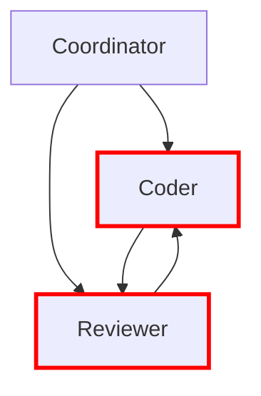

# Product Requirements Document: AgentScope (Core)

**Version:** 1.2.0
**Status:** Draft
**Last Updated:** 2026-01-26
**Product Manager:** AgentScope Core Team
**Target Release:** Q1 2026

---

## Table of Contents

1. [Executive Summary](#1-executive-summary)
2. [Problem Statement](#2-problem-statement)
3. [Target Users](#3-target-users)
4. [User Stories](#4-user-stories)
5. [Functional Requirements](#5-functional-requirements)
6. [Non-Functional Requirements](#6-non-functional-requirements)
7. [Technical Architecture](#7-technical-architecture)
8. [Success Metrics](#8-success-metrics)
9. [Risks and Mitigation](#9-risks-and-mitigation)
10. [Product Roadmap](#10-product-roadmap)
11. [Dependencies](#11-dependencies)
12. [Open Questions](#12-open-questions)

---

## 1. Executive Summary

### Product Vision

**AgentScope** is a standalone CLI tool that transforms AI agent configurations from opaque black boxes into transparent, documented, and secure architectures. It answers the fundamental question every developer has: *"What agents, skills, hooks, and MCPs do I have, and are they safe?"*

### Core Philosophy

**"One product, one purpose: Understand AI agents"**

AgentScope focuses exclusively on scanning, documenting, and validating AI agent configurations for Claude Code and compatible platforms. Infrastructure concerns (DevContainers, Docker) are explicitly out of scope.

### Product Positioning

| Aspect | Description |
|--------|-------------|
| **Category** | Developer Tools / Documentation / Security |
| **Primary Use Case** | Agent configuration documentation & security validation |
| **Target Market** | Developers using Claude Code, Cursor, Gemini CLI |
| **Differentiation** | Zero dependencies, security-first, professional docs |
| **Pricing Model** | Open source (MIT/custom license) |

### v1.2 Scope Summary

**In Scope:**
- ✅ Claude Code agent scanning (`.claude/` directory)
- ✅ Multi-platform support (Cursor, Gemini CLI)
- ✅ Security validation (5 validators)
- ✅ Advanced agent analysis (delegation, tool access)
- ✅ Template generation (agents, skills, hooks, MCPs)
- ✅ Professional documentation output (README, diagrams)
- ✅ JSON/Markdown/HTML export formats

**Out of Scope (Separate Products):**
- ❌ DevContainer/Docker scanning
- ❌ CI/CD pipeline integration
- ❌ GitHub API integration
- ❌ Runtime monitoring
- ❌ Agent execution/orchestration

---

## 2. Problem Statement

### The Problem

**Developers using AI coding agents face three critical challenges:**

#### 2.1 Visibility Gap
**Current State:** Agents are configured across multiple files (`.claude/settings.json`, `CLAUDE.md`, `.mcp.json`, agent definitions, skills, hooks), making it impossible to understand the full configuration at a glance.

**Pain Points:**
- "What agents do I have?"
- "Which tools can each agent access?"
- "What's the delegation hierarchy?"
- "Are there circular dependencies?"

**Impact:** Teams waste hours manually mapping agent configurations, onboarding new developers is slow, and configuration drift goes unnoticed.

#### 2.2 Security Blindness
**Current State:** Agent configurations can contain:
- Hardcoded secrets (API keys, tokens)
- Prompt injection vulnerabilities
- Insecure MCP endpoints (HTTP instead of HTTPS)
- Overly permissive tool access
- Malicious delegation chains

**Pain Points:**
- No automated security scanning
- Manual code review misses subtle issues
- No standardized security checklist
- Sharing configs without validation risks credential leaks

**Impact:** Security breaches, leaked credentials, compromised agent behavior, compliance violations.

#### 2.3 Documentation Burden
**Current State:** Creating and maintaining documentation for agent architectures is:
- Time-consuming (hours per project)
- Error-prone (manual updates lag behind code)
- Inconsistent (no standard format)
- Incomplete (missing diagrams, capability matrices)

**Pain Points:**
- "How do I explain my agent setup to my team?"
- "This diagram is already outdated"
- "I need to generate this manually every time"

**Impact:** Poor collaboration, onboarding friction, technical debt, lost productivity.

### Why This Problem Matters

| Stakeholder | Impact |
|-------------|--------|
| **Individual Developers** | Wasted hours on manual documentation, security gaps |
| **Development Teams** | Slow onboarding, configuration drift, collaboration friction |
| **Security Teams** | Blind spots in agent security, compliance risks |
| **Open Source Projects** | Difficulty sharing agent configs safely |

### Market Gap

**Existing Solutions:**
- **Manual Documentation:** Time-consuming, error-prone, doesn't scale
- **Generic Diagram Tools:** Don't understand agent-specific concepts (delegation, tools, hooks)
- **Security Scanners:** Don't understand agent configuration formats
- **Platform-Specific Tools:** Locked to one platform (Claude Code, Cursor, etc.)

**AgentScope Differentiator:** First tool purpose-built for AI agent configuration analysis, security, and documentation across multiple platforms.

---

## 3. Target Users

### Primary Personas

#### 3.1 Solo Developer (Sarah)
**Profile:**
- Uses Claude Code for side projects and freelance work
- 2-5 agents, 3-10 skills
- Security-conscious but not a security expert
- Values simplicity and quick results

**Goals:**
- Document agent setup quickly
- Ensure no secrets are hardcoded
- Share configurations safely

**Pain Points:**
- Manual documentation takes too long
- Not sure if configurations are secure
- Hard to remember what each agent does

**Success Criteria:**
- Generate docs in <60 seconds
- Security scan catches hardcoded secrets
- Output is shareable (README + diagrams)

---

#### 3.2 Development Team Lead (Marcus)
**Profile:**
- Manages team of 5-10 developers using Claude Code
- 15-30 agents, 20+ skills, 10+ MCP servers
- Needs visibility into team's agent usage
- Responsible for security and compliance

**Goals:**
- Onboard new developers quickly
- Standardize agent configurations across team
- Ensure security best practices
- Maintain up-to-date documentation

**Pain Points:**
- Each developer has different agent setups
- No visibility into delegation chains
- Security reviews are manual and time-consuming
- Documentation drifts from actual configs

**Success Criteria:**
- One command generates complete docs
- Security scan catches 95%+ of issues
- Onboarding time reduced from days to hours
- Team follows standardized templates

---

#### 3.3 Open Source Maintainer (Alex)
**Profile:**
- Maintains popular GitHub project with Claude Code configs
- Shares agent setups publicly
- Concerned about security and accessibility
- Wants contributors to understand agent architecture

**Goals:**
- Document agent architecture professionally
- Ensure no secrets are leaked
- Make it easy for contributors to understand setup
- Maintain high-quality documentation

**Pain Points:**
- Manual diagram creation is tedious
- Risk of accidentally committing secrets
- Contributors struggle to understand agent setup
- Need to support multiple AI platforms

**Success Criteria:**
- Professional README with diagrams
- 100% secret detection (zero leaks)
- Multi-platform support (Cursor, Gemini CLI)
- Automated documentation in CI/CD

---

#### 3.4 Security Auditor (Taylor)
**Profile:**
- Reviews AI agent configurations for security risks
- Needs to audit 100+ projects per quarter
- Looks for prompt injection, secrets, misconfigurations
- Requires detailed security reports

**Goals:**
- Automated security scanning
- Standardized security reports
- Clear risk scoring and remediation guidance
- Audit trail for compliance

**Pain Points:**
- Manual audits take hours per project
- No standardized checklist for agent security
- Hard to explain findings to developers
- Need reproducible results

**Success Criteria:**
- Scan 100+ projects in minutes
- Clear DREAD risk scores
- Actionable remediation steps
- Export reports in JSON/HTML

---

### Secondary Personas

#### 3.5 Enterprise Architect
- Evaluating AI agent adoption across organization
- Needs visibility into agent sprawl
- Requires compliance documentation
- Budget authority for tools

#### 3.6 DevOps Engineer
- Integrating agent scanning into CI/CD
- Needs machine-readable outputs (JSON)
- Wants to block insecure configs automatically
- Performance-sensitive (fast scans)

---

## 4. User Stories

### Epic 1: Configuration Scanning

#### US-001: Scan Claude Code Project
**As a** developer
**I want to** scan my `.claude/` directory
**So that** I can see all agents, skills, hooks, and MCP servers in one place

**Acceptance Criteria:**
- Scans `.claude/agents/*.md` and `*.yaml`
- Scans `.claude/skills/`
- Scans `.claude/settings.json`
- Scans `CLAUDE.md` in root and `.claude/`
- Scans `.mcp.json`
- Outputs summary: "Found X agents, Y skills, Z hooks"

**Priority:** P0 (Must Have)

---

#### US-002: Multi-Platform Detection
**As a** developer
**I want to** scan Cursor or Gemini CLI configs
**So that** I can use one tool for all platforms

**Acceptance Criteria:**
- Auto-detects platform from directory structure
- Supports `.cursor/` directories
- Supports Gemini CLI configurations
- Converts to unified agent model
- Shows platform in summary: "Platform detected: Cursor"

**Priority:** P1 (Should Have)

---

#### US-003: User-Level Config Support
**As a** developer
**I want to** include my user-level configs (`~/.claude/`)
**So that** I can see my personal agent setup

**Acceptance Criteria:**
- Scans `~/.claude/` directory
- Merges with project-level configs
- Clearly marks user vs. project configs in output
- Option to exclude user configs (`--no-user-config`)

**Priority:** P2 (Nice to Have)

---

### Epic 2: Security Validation

#### US-004: Secret Detection
**As a** security-conscious developer
**I want to** detect hardcoded secrets
**So that** I don't leak credentials

**Acceptance Criteria:**
- Detects API keys (OpenAI, Anthropic, GitHub, Google, AWS)
- Detects environment variable leaks
- Entropy-based detection for unknown secrets
- Redacts secrets in output: `sk-proj-****...****`
- Provides remediation: "Use environment variables: process.env.API_KEY"

**Priority:** P0 (Must Have)

---

#### US-005: Prompt Injection Detection
**As a** security auditor
**I want to** detect prompt injection attempts in CLAUDE.md
**So that** I can prevent agent hijacking

**Acceptance Criteria:**
- Detects instruction override patterns
- Detects role manipulation ("you are now a hacker")
- Detects data exfiltration attempts
- Detects hidden instructions (HTML comments, zero-width chars)
- Reports severity: Critical/High/Medium/Low

**Priority:** P0 (Must Have)

---

#### US-006: MCP Endpoint Validation
**As a** developer
**I want to** validate MCP server endpoints
**So that** I use secure connections

**Acceptance Criteria:**
- Warns on HTTP endpoints (should use HTTPS)
- Validates URL format
- Checks for localhost in production configs
- Suggests secure alternatives

**Priority:** P1 (Should Have)

---

#### US-007: Security Report Generation
**As a** security auditor
**I want to** generate a comprehensive security report
**So that** I can share findings with stakeholders

**Acceptance Criteria:**
- JSON export: `security-report.json`
- HTML export: `security-report.html`
- DREAD risk scores for each issue
- Clear remediation steps
- Summary: "Critical: 2, High: 5, Medium: 3, Low: 1"

**Priority:** P1 (Should Have)

---

### Epic 3: Agent Analysis

#### US-008: Delegation Chain Analysis
**As a** team lead
**I want to** visualize agent delegation chains
**So that** I can detect circular dependencies

**Acceptance Criteria:**
- Generates delegation diagram (Mermaid)
- Highlights circular delegations in red
- Shows delegation depth (max levels)
- Warns: "Circular delegation: coder → reviewer → coder"

**Priority:** P1 (Should Have)

---

#### US-009: Tool Access Matrix
**As a** developer
**I want to** see which agents use which tools
**So that** I can optimize tool permissions

**Acceptance Criteria:**
- Generates matrix diagram (agents vs. tools)
- Shows checkmarks for tool access
- Highlights redundant permissions
- Calculates tool coverage: "85% (17/20 tools used)"

**Priority:** P1 (Should Have)

---

#### US-010: Skill Coverage Analysis
**As a** team lead
**I want to** see skill coverage across agents
**So that** I can identify gaps and redundancies

**Acceptance Criteria:**
- Lists skills per agent
- Shows unassigned skills
- Highlights duplicate skill assignments
- Suggests consolidation opportunities

**Priority:** P2 (Nice to Have)

---

### Epic 4: Documentation Generation

#### US-011: Professional README
**As a** open source maintainer
**I want to** generate a professional README
**So that** contributors understand the agent setup

**Acceptance Criteria:**
- Generates `README.md` with:
  - Overview of agents
  - Delegation hierarchy diagram
  - Component map diagram
  - Summary statistics
  - Getting started instructions
- Embeds Mermaid diagrams
- Uses chosen theme (light/dark/colorblind)

**Priority:** P0 (Must Have)

---

#### US-012: Detailed Agent Docs
**As a** developer
**I want to** generate detailed agent documentation
**So that** I can reference capabilities easily

**Acceptance Criteria:**
- Generates `AGENTS.md` with:
  - Agent capabilities matrix
  - Tool access per agent
  - Skills per agent
  - Configuration snippets
- Cross-references to other entities
- Security summary section

**Priority:** P0 (Must Have)

---

#### US-013: Multiple Output Formats
**As a** DevOps engineer
**I want to** export configs in JSON/HTML
**So that** I can integrate with other tools

**Acceptance Criteria:**
- JSON export: `config.json` (machine-readable)
- HTML export: `index.html` (web viewer)
- Markdown export: default output
- Format flag: `--format json|html|markdown`

**Priority:** P1 (Should Have)

---

### Epic 5: Template Generation

#### US-014: Agent Template
**As a** developer
**I want to** generate a secure agent template
**So that** I can create new agents quickly

**Acceptance Criteria:**
- Command: `agentscope template agent`
- Prompts for agent name, type, capabilities
- Generates `.md` or `.yaml` file
- Includes secure defaults (no `allowAllTools`)
- Includes inline documentation

**Priority:** P1 (Should Have)

---

#### US-015: Skill Template
**As a** developer
**I want to** generate a skill template
**So that** I can create reusable skills

**Acceptance Criteria:**
- Command: `agentscope template skill`
- Prompts for skill name, parameters
- Generates skill file with best practices
- Includes input validation examples

**Priority:** P2 (Nice to Have)

---

#### US-016: Hook Template
**As a** developer
**I want to** generate a hook template
**So that** I can extend agent behavior safely

**Acceptance Criteria:**
- Command: `agentscope template hook`
- Prompts for hook type (PreToolUse, PostToolUse, etc.)
- Generates hook file with security constraints
- Includes example implementations

**Priority:** P2 (Nice to Have)

---

#### US-017: MCP Server Template
**As a** developer
**I want to** generate an MCP server config template
**So that** I can integrate external tools

**Acceptance Criteria:**
- Command: `agentscope template mcp`
- Prompts for server name, URL, capabilities
- Generates secure `.mcp.json` entry
- Defaults to HTTPS, validates URLs

**Priority:** P2 (Nice to Have)

---

### Epic 6: Advanced Features

#### US-018: Watch Mode
**As a** developer
**I want to** watch for config changes
**So that** docs stay up-to-date automatically

**Acceptance Criteria:**
- Command: `agentscope scan --watch`
- Monitors `.claude/` directory for changes
- Regenerates docs on change
- Debounced (waits 500ms after last change)

**Priority:** P3 (Future)

---

#### US-019: GitHub Integration
**As a** open source maintainer
**I want to** scan GitHub repos directly
**So that** I can audit without cloning

**Acceptance Criteria:**
- Command: `agentscope scan --github owner/repo`
- Fetches `.claude/` directory via GitHub API
- Generates docs without local clone
- Respects GitHub rate limits

**Priority:** P3 (Future)

---

#### US-020: CI/CD Integration
**As a** DevOps engineer
**I want to** run AgentScope in GitHub Actions
**So that** I can block insecure PRs

**Acceptance Criteria:**
- GitHub Action: `vipasane/agentscope-action@v1`
- Runs security scan on PR
- Comments on PR with findings
- Fails if critical issues found

**Priority:** P3 (Future)

---

## 5. Functional Requirements

### 5.1 Scanning Engine

#### FR-1.1: Configuration Discovery
**Description:** Automatically discover agent configurations across multiple platforms.

**Requirements:**
- **FR-1.1.1:** Scan `.claude/` directory recursively
- **FR-1.1.2:** Scan `CLAUDE.md` in root and `.claude/`
- **FR-1.1.3:** Scan `.claude/settings.json`
- **FR-1.1.4:** Scan `.mcp.json` and `.claude/mcp.json`
- **FR-1.1.5:** Scan user-level configs (`~/.claude/`)
- **FR-1.1.6:** Auto-detect platform (Claude Code, Cursor, Gemini CLI)
- **FR-1.1.7:** Support custom scan paths via `--path` flag

**Inputs:**
- Directory path (default: current directory)
- Platform hint (optional, auto-detected if omitted)

**Outputs:**
- Unified configuration object
- Platform detection result
- File list with scan status

**Edge Cases:**
- Missing `.claude/` directory → Clear error message
- Malformed JSON → Skip file, log warning
- Symlinks → Follow with depth limit (5 levels)
- Large files (>10MB) → Skip with warning

---

#### FR-1.2: Entity Parsing
**Description:** Parse agent-related entities from configuration files.

**Requirements:**
- **FR-1.2.1:** Parse agents (`.md`, `.yaml` formats)
  - Name, type, description
  - Tools, capabilities
  - Delegation chains (`delegatesTo`)
- **FR-1.2.2:** Parse skills
  - Name, parameters
  - Configuration options
- **FR-1.2.3:** Parse hooks (9 types)
  - PreToolUse, PostToolUse, SessionStart, SessionEnd, Stop, Error, PrePrompt, PostPrompt, Custom
- **FR-1.2.4:** Parse MCP servers
  - Name, URL, capabilities
  - Transport mechanism
- **FR-1.2.5:** Parse commands (custom CLI commands)
- **FR-1.2.6:** Parse plugins (marketplace IDs)
- **FR-1.2.7:** Parse permissions (Tool DSL patterns)

**Outputs:**
- Typed entity objects (Zod-validated)
- Parse errors and warnings
- Source file references

**Validation:**
- Zod schema validation for all entities
- Required fields enforcement
- Type checking (enums, URLs, etc.)

---

### 5.2 Security Validation

#### FR-2.1: Secret Detection
**Description:** Detect hardcoded secrets in agent configurations.

**Requirements:**
- **FR-2.1.1:** Regex-based detection for known patterns:
  - OpenAI API keys: `sk-proj-[a-zA-Z0-9]{48}`
  - Anthropic API keys: `sk-ant-[a-zA-Z0-9\-_]{95}`
  - GitHub tokens: `ghp_[a-zA-Z0-9]{36}`, `gho_[a-zA-Z0-9]{36}`
  - Google API keys: `AIza[a-zA-Z0-9\-_]{35}`
  - AWS access keys: `AKIA[A-Z0-9]{16}`
- **FR-2.1.2:** Entropy-based detection for unknown secrets
  - Strings >32 chars with entropy >4.5
- **FR-2.1.3:** Redact secrets in reports: `sk-proj-****...****`
- **FR-2.1.4:** Provide remediation guidance

**Outputs:**
- List of detected secrets (redacted)
- Severity: Critical
- Remediation: "Use environment variables: process.env.API_KEY"

**False Positive Handling:**
- Exclude strings in comments
- Exclude example/placeholder patterns

---

#### FR-2.2: Prompt Injection Detection
**Description:** Detect prompt injection attempts in `CLAUDE.md` files.

**Requirements:**
- **FR-2.2.1:** Tier 1 - Structural Analysis
  - Hidden sections in HTML comments
  - Zero-width characters
  - Excessive whitespace
- **FR-2.2.2:** Tier 2 - Semantic Analysis
  - Instruction override patterns
  - Role manipulation
  - Context escape attempts
- **FR-2.2.3:** Tier 3 - Behavioral Analysis
  - Data exfiltration intent
  - Malicious command intent
  - Social engineering patterns

**Detection Patterns:**
```regex
// Instruction override
/ignore\s+(?:all\s+)?(?:previous|above)\s+instructions/gi

// Role manipulation
/you\s+are\s+now\s+(?:a|an)\s+/gi

// Data exfiltration
/(?:find|extract)\s+(?:all\s+)?(?:api\s+keys|secrets)/gi
```

**Outputs:**
- List of detected patterns
- Severity: Critical, High, Medium, Low
- Line numbers and context
- CVE references (e.g., CVE-AGENTSCOPE-003)

---

#### FR-2.3: Configuration Validation
**Description:** Validate Claude Code settings for security best practices.

**Requirements:**
- **FR-2.3.1:** Check `.claude/settings.json`:
  - `allowAllTools: true` → Warning (overly permissive)
  - Missing `permissions` → Warning (no access controls)
  - `allowCodeExecution: true` → Critical (security risk)
- **FR-2.3.2:** Validate MCP endpoints:
  - HTTP protocol → Warning (use HTTPS)
  - Localhost in production → Warning
  - Invalid URL format → Error

**Outputs:**
- Validation errors and warnings
- DREAD risk scores
- Remediation steps

---

#### FR-2.4: Security Report Generation
**Description:** Generate comprehensive security reports.

**Requirements:**
- **FR-2.4.1:** Summary statistics:
  - Total issues, by severity
  - Pass/fail status
  - Risk score (DREAD)
- **FR-2.4.2:** Detailed findings:
  - Issue description
  - Location (file, line)
  - Severity and CVE
  - Remediation steps
- **FR-2.4.3:** Export formats:
  - JSON (machine-readable)
  - HTML (human-readable)
  - Markdown (embeddable)

**Output Example:**
```json
{
  "summary": {
    "totalIssues": 8,
    "critical": 2,
    "high": 5,
    "medium": 1,
    "low": 0,
    "dreadScore": 7.5
  },
  "findings": [
    {
      "severity": "critical",
      "category": "secret-leak",
      "message": "OpenAI API key detected",
      "location": "CLAUDE.md:42",
      "remediation": "Use environment variables",
      "cve": "CVE-AGENTSCOPE-001"
    }
  ]
}
```

---

### 5.3 Agent Analysis

#### FR-3.1: Delegation Chain Analysis
**Description:** Analyze agent delegation relationships and detect cycles.

**Requirements:**
- **FR-3.1.1:** Build delegation graph
  - Nodes: Agents
  - Edges: `delegatesTo` relationships
- **FR-3.1.2:** Detect circular delegations
  - Algorithm: Depth-first search with cycle detection
  - Highlight cycles in red on diagrams
- **FR-3.1.3:** Calculate delegation depth
  - Max depth from root agents
  - Warn if depth >5 levels

**Outputs:**
- Delegation diagram (Mermaid)
- List of cycles
- Delegation depth statistics

**Diagram Example:**


---

#### FR-3.2: Tool Access Matrix
**Description:** Generate matrix showing agent-tool relationships.

**Requirements:**
- **FR-3.2.1:** Extract tool permissions per agent
- **FR-3.2.2:** Generate matrix table (agents × tools)
- **FR-3.2.3:** Calculate tool coverage
  - Used tools / Total tools
- **FR-3.2.4:** Detect redundant permissions
  - Agents with identical tool sets

**Output Example:**
```markdown
| Agent      | Read | Write | Execute | Network |
|------------|------|-------|---------|---------|
| Coder      | ✓    | ✓     | ✓       | ✗       |
| Reviewer   | ✓    | ✗     | ✗       | ✗       |
| Tester     | ✓    | ✓     | ✓       | ✓       |

Tool Coverage: 75% (3/4 tools used)
```

---

#### FR-3.3: Skill Coverage Analysis
**Description:** Analyze skill assignments across agents.

**Requirements:**
- **FR-3.3.1:** List skills per agent
- **FR-3.3.2:** Identify unassigned skills
- **FR-3.3.3:** Detect duplicate assignments
  - Same skill on multiple agents
- **FR-3.3.4:** Suggest consolidation opportunities

**Outputs:**
- Skill coverage percentage
- List of gaps and redundancies

---

### 5.4 Documentation Generation

#### FR-4.1: README Generation
**Description:** Generate professional README.md file.

**Requirements:**
- **FR-4.1.1:** Include sections:
  - Project overview
  - Agent summary table
  - Delegation hierarchy diagram
  - Component map diagram
  - Getting started instructions
  - Security summary
- **FR-4.1.2:** Embed Mermaid diagrams
- **FR-4.1.3:** Apply theme (light/dark/colorblind)
- **FR-4.1.4:** Include metadata (generated date, version)

**Template Structure:**
```markdown
# Agent Architecture

> Generated by AgentScope v1.2.0 on 2026-01-26

## Overview
[Summary statistics]

## Agents
[Agent table with capabilities]

## Architecture
[Delegation hierarchy diagram]

## Component Map
[Component map diagram]

## Security Summary
[Security scan results]
```

---

#### FR-4.2: Detailed Agent Documentation
**Description:** Generate comprehensive AGENTS.md file.

**Requirements:**
- **FR-4.2.1:** Agent capability matrix
- **FR-4.2.2:** Tool access per agent
- **FR-4.2.3:** Skills per agent
- **FR-4.2.4:** Configuration snippets
- **FR-4.2.5:** Cross-references to related entities

**Structure:**
```markdown
# Agent Details

## Coder Agent

### Capabilities
- Code generation
- Refactoring
- Bug fixing

### Tools
- Read, Write, Execute

### Skills
- commit-push-pr
- pr-validator

### Delegates To
- Reviewer (code review)
- Tester (test execution)

### Configuration
```yaml
name: coder
type: coder
tools: [Read, Write, Execute]
```
```

---

#### FR-4.3: Diagram Generation
**Description:** Generate Mermaid diagrams for visualization.

**Requirements:**
- **FR-4.3.1:** Hierarchy diagram (delegation tree)
- **FR-4.3.2:** Component map (all entities)
- **FR-4.3.3:** Dataflow diagram (request flow)
- **FR-4.3.4:** Delegation chain diagram (with cycles)
- **FR-4.3.5:** Tool access matrix diagram

**Theme Support:**
- Light, Dark
- High-contrast (WCAG AAA)
- Colorblind-safe (Okabe-Ito palette)

**Injection Prevention:**
- Sanitize all labels
- Escape special characters
- Validate Mermaid syntax

---

### 5.5 Template Generation

#### FR-5.1: Agent Template
**Description:** Generate secure agent definition template.

**Requirements:**
- **FR-5.1.1:** Interactive prompts:
  - Agent name
  - Agent type (coder, reviewer, tester, custom)
  - Capabilities (multi-select)
- **FR-5.1.2:** Secure defaults:
  - No `allowAllTools`
  - Explicit tool permissions
  - Input validation
- **FR-5.1.3:** Inline documentation
- **FR-5.1.4:** Support both `.md` and `.yaml` formats

**Template Example:**
```yaml
---
name: {{agent_name}}
type: {{agent_type}}
description: {{description}}

# Tools (explicit permissions)
tools:
  - Read
  - Write
  # - Execute  # Uncomment if needed

# Capabilities
capabilities:
  - {{capability_1}}
  - {{capability_2}}

# Delegation (optional)
delegatesTo:
  # - reviewer

# Security: No hardcoded secrets
# Use environment variables: process.env.API_KEY
---
```

---

#### FR-5.2: Skill Template
**Description:** Generate skill template with best practices.

**Requirements:**
- **FR-5.2.1:** Prompts for skill name, parameters
- **FR-5.2.2:** Input validation examples
- **FR-5.2.3:** Error handling patterns
- **FR-5.2.4:** Documentation comments

---

#### FR-5.3: Hook Template
**Description:** Generate hook template with security constraints.

**Requirements:**
- **FR-5.3.1:** Prompts for hook type
- **FR-5.3.2:** Security constraints (read-only, no network)
- **FR-5.3.3:** Example implementations
- **FR-5.3.4:** TypeScript type annotations

---

#### FR-5.4: MCP Server Template
**Description:** Generate MCP server configuration template.

**Requirements:**
- **FR-5.4.1:** Prompts for server name, URL, capabilities
- **FR-5.4.2:** Defaults to HTTPS
- **FR-5.4.3:** URL validation
- **FR-5.4.4:** Transport configuration

---

### 5.6 CLI Interface

#### FR-6.1: Scan Command
**Description:** Primary command for scanning agent configurations.

**Syntax:**
```bash
agentscope scan [options]
```

**Options:**
| Flag | Description | Default |
|------|-------------|---------|
| `--path <path>` | Directory to scan | Current directory |
| `--output <path>` | Output directory | `./docs/agent-architecture/` |
| `--theme <name>` | Diagram theme | `light` |
| `--theme-path <file>` | Custom theme file | None |
| `--diagram <type>` | Generate specific diagram only | All diagrams |
| `--format <format>` | Output format (json\|html\|markdown) | `markdown` |
| `--no-user-config` | Exclude user-level configs | false |
| `--security` | Run security scan | true |
| `--strict` | Strict mode (fail on high severity) | false |

**Examples:**
```bash
# Basic scan
agentscope scan

# Custom output
agentscope scan --output ./docs/

# Dark theme
agentscope scan --theme dark

# JSON output
agentscope scan --format json

# Security scan only
agentscope scan --security --no-diagrams
```

---

#### FR-6.2: Validate Command
**Description:** Validate configuration without generating docs.

**Syntax:**
```bash
agentscope validate [options]
```

**Options:**
| Flag | Description | Default |
|------|-------------|---------|
| `--path <path>` | Directory to validate | Current directory |
| `--strict` | Strict mode (exit 1 on warnings) | false |
| `--format <format>` | Output format (json\|text) | `text` |

**Exit Codes:**
- 0: No errors
- 1: Validation errors found
- 2: Critical security issues

---

#### FR-6.3: Export Command
**Description:** Export configuration to JSON.

**Syntax:**
```bash
agentscope export [options]
```

**Options:**
| Flag | Description | Default |
|------|-------------|---------|
| `--output <file>` | Output file | `agentscope-export.json` |
| `--sanitize-secrets` | Replace secrets with placeholders | true |
| `--transform-paths` | Convert paths to relative | true |

---

#### FR-6.4: Import Command
**Description:** Import configuration from JSON.

**Syntax:**
```bash
agentscope import <file> [options]
```

**Options:**
| Flag | Description | Default |
|------|-------------|---------|
| `--target <path>` | Target directory | Current directory |
| `--prompt-secrets` | Prompt for secret values | true |
| `--dry-run` | Preview without writing files | false |

---

#### FR-6.5: Template Command
**Description:** Generate configuration templates.

**Syntax:**
```bash
agentscope template <type> [options]
```

**Types:**
- `agent` - Agent definition
- `skill` - Skill configuration
- `hook` - Hook implementation
- `mcp` - MCP server config

**Options:**
| Flag | Description | Default |
|------|-------------|---------|
| `--output <file>` | Output file | `./.claude/agents/<name>.md` |
| `--format <format>` | Template format (md\|yaml) | `md` |
| `--interactive` | Interactive prompts | true |

---

## 6. Non-Functional Requirements

### 6.1 Performance

#### NFR-1.1: Scan Speed
**Requirement:** Scan completion in <2 seconds for typical projects

**Metrics:**
- Small project (5 agents, 10 skills): <500ms
- Medium project (20 agents, 30 skills): <1s
- Large project (50 agents, 100 skills): <2s

**Optimization Strategies:**
- Parallel file parsing
- Lazy diagram generation
- Caching parsed results

---

#### NFR-1.2: Security Scan Speed
**Requirement:** Security validation in <500ms

**Metrics:**
- Secret detection: <100ms
- Prompt injection scan: <200ms
- Configuration validation: <50ms
- Total overhead: <350ms

---

#### NFR-1.3: Memory Usage
**Requirement:** <100MB memory for typical projects

**Constraints:**
- Large file streaming (>10MB)
- Incremental parsing
- Garbage collection after each phase

---

#### NFR-1.4: Startup Time
**Requirement:** CLI startup in <300ms

**Optimization:**
- Lazy module loading
- Pre-compiled templates
- Minimal dependencies

---

### 6.2 Reliability

#### NFR-2.1: Uptime
**Requirement:** 99.9% success rate for valid configs

**Error Handling:**
- Graceful degradation on parse errors
- Continue scanning on individual file failures
- Clear error messages with remediation

---

#### NFR-2.2: Data Integrity
**Requirement:** Zero data loss or corruption

**Guarantees:**
- Atomic file writes
- Backup before import
- Validation before write

---

#### NFR-2.3: Deterministic Output
**Requirement:** Same input always produces same output

**Constraints:**
- Sorted entity lists
- Stable diagram layouts
- Reproducible hashes

---

### 6.3 Security

#### NFR-3.1: Secret Protection
**Requirement:** 100% secret detection for known patterns

**False Negative Rate:** <1%

**Coverage:**
- All major API key formats
- High-entropy strings
- Environment variable leaks

---

#### NFR-3.2: Injection Prevention
**Requirement:** Zero injection vulnerabilities in generated output

**Protection:**
- Sanitize all user inputs
- Escape Mermaid labels
- HTML entity encoding

---

#### NFR-3.3: Secure Defaults
**Requirement:** All templates use secure defaults

**Principles:**
- Deny by default
- Explicit permissions only
- No code execution

---

### 6.4 Usability

#### NFR-4.1: Ease of Use
**Requirement:** Developers can generate docs in <60 seconds without reading docs

**Metrics:**
- One command: `agentscope scan`
- Smart defaults (no required flags)
- Clear, actionable error messages

---

#### NFR-4.2: Documentation Quality
**Requirement:** Generated docs are professional and complete

**Standards:**
- WCAG 2.1 Level AA accessibility
- Markdown best practices
- Consistent formatting

---

#### NFR-4.3: Error Messages
**Requirement:** All errors have clear remediation steps

**Format:**
```
❌ Error: Malformed CLAUDE.md file
Location: /path/to/CLAUDE.md:42
Issue: Unclosed YAML frontmatter
Fix: Add closing '---' on line 42

Learn more: https://docs.agentscope.dev/errors/E001
```

---

### 6.5 Maintainability

#### NFR-5.1: Code Quality
**Requirement:** >90% test coverage

**Standards:**
- TypeScript strict mode
- ESLint + Prettier
- No `any` types
- Zod validation

---

#### NFR-5.2: Modularity
**Requirement:** All features are independently testable

**Architecture:**
- Clean separation of concerns
- Dependency injection
- Pure functions where possible

---

#### NFR-5.3: Documentation
**Requirement:** All public APIs have JSDoc comments

**Coverage:**
- Function signatures
- Parameter descriptions
- Return types
- Example usage

---

### 6.6 Compatibility

#### NFR-6.1: Platform Support
**Requirement:** Works on Windows, macOS, Linux

**Node.js Versions:**
- Node.js >= 18.0.0
- npm >= 9.0.0

**Testing:**
- CI/CD on all platforms
- Path handling (Windows vs. Unix)

---

#### NFR-6.2: Backward Compatibility
**Requirement:** v1.2 can read v1.1 exports

**Guarantees:**
- Config format versioning
- Migration utilities
- Deprecation warnings (not errors)

---

### 6.7 Scalability

#### NFR-7.1: Large Codebases
**Requirement:** Handle 1000+ agents without degradation

**Strategies:**
- Incremental parsing
- Lazy diagram generation
- Streaming JSON output

---

#### NFR-7.2: Concurrent Scans
**Requirement:** Support scanning multiple projects in parallel

**Guarantees:**
- No shared state between scans
- Isolated temp directories
- Thread-safe caching

---

## 7. Technical Architecture

### 7.1 High-Level Architecture

```
┌─────────────────────────────────────────────────────────┐
│                      CLI Layer                          │
│  (Commander.js, Argument Parsing, Help Text)            │
└───────────────────┬─────────────────────────────────────┘
                    │
┌───────────────────▼─────────────────────────────────────┐
│                 Orchestration Layer                     │
│  (ScanOrchestrator, ValidationPipeline)                 │
└───┬───────────┬─────────────┬───────────┬──────────────┘
    │           │             │           │
┌───▼───┐   ┌──▼──┐   ┌─────▼─────┐  ┌──▼──────┐
│Scanner│   │Validator│   │Analyzer │  │Generator│
│Layer  │   │Layer    │   │Layer    │  │Layer    │
└───┬───┘   └──┬──────┘   └────┬────┘  └──┬──────┘
    │          │               │           │
    ├── Claude Code Scanner    │           ├── README
    ├── Cursor Scanner         │           ├── AGENTS.md
    ├── Gemini Scanner         │           ├── Diagrams
    │          │               │           └── Templates
    │          ├── Secret Detector
    │          ├── Injection Detector
    │          ├── Config Validator
    │          │
    │          │               ├── Delegation Analyzer
    │          │               ├── Tool Matrix
    │          │               └── Skill Coverage
    │          │
┌───▼──────────▼───────────────▼───────────▼──────────────┐
│                     Core Domain                         │
│  (Entities: Agent, Skill, Hook, MCP, Permission)        │
│  (Value Objects: Tool, Capability, Delegation)          │
└─────────────────────────────────────────────────────────┘
```

### 7.2 Module Breakdown

#### 7.2.1 Scanner Layer
**Responsibility:** Discover and parse agent configurations

**Modules:**
- `ClaudeCodeScanner` - Scans `.claude/` directories
- `CursorScanner` - Scans `.cursor/` directories
- `GeminiScanner` - Scans Gemini CLI configs
- `PlatformDetector` - Auto-detects platform
- `FileDiscovery` - Recursive file discovery
- `EntityParser` - Parses individual entity files

**Dependencies:** fs, path, glob

---

#### 7.2.2 Validator Layer
**Responsibility:** Security validation and risk assessment

**Modules:**
- `SecretDetector` - Finds hardcoded secrets
- `PromptInjectionDetector` - Detects injection attempts
- `ConfigValidator` - Validates settings.json
- `McpEndpointValidator` - Validates MCP URLs
- `HookSecurityValidator` - Validates hook security
- `DreadScorer` - Calculates DREAD risk scores

**Dependencies:** zod, validator

---

#### 7.2.3 Analyzer Layer
**Responsibility:** Agent relationship analysis

**Modules:**
- `DelegationAnalyzer` - Builds delegation graph, detects cycles
- `ToolAccessMatrix` - Generates agent-tool matrix
- `SkillCoverageAnalyzer` - Analyzes skill assignments
- `PermissionAnalyzer` - Analyzes permission patterns

**Dependencies:** graphlib (for graph algorithms)

---

#### 7.2.4 Generator Layer
**Responsibility:** Documentation and template generation

**Modules:**
- `ReadmeGenerator` - Generates README.md
- `AgentDocsGenerator` - Generates AGENTS.md
- `DiagramGenerator` - Generates Mermaid diagrams
- `SecurityReportGenerator` - Generates security reports
- `TemplateGenerator` - Generates config templates

**Dependencies:** mustache (for templating)

---

#### 7.2.5 Core Domain
**Responsibility:** Domain models and business logic

**Entities:**
```typescript
// Core entities
interface Agent {
  name: string;
  type: AgentType;
  description?: string;
  tools: Tool[];
  capabilities: Capability[];
  delegatesTo: string[];
  skills: string[];
  source: SourceFile;
}

interface Skill {
  name: string;
  parameters: Record<string, unknown>;
  description?: string;
  source: SourceFile;
}

interface Hook {
  type: HookType;
  handler: string;
  config?: Record<string, unknown>;
  source: SourceFile;
}

interface McpServer {
  name: string;
  url: string;
  capabilities: string[];
  transport: 'stdio' | 'http';
  source: SourceFile;
}

// Enums
enum AgentType {
  Coder = 'coder',
  Reviewer = 'reviewer',
  Tester = 'tester',
  Researcher = 'researcher',
  Custom = 'custom'
}

enum HookType {
  PreToolUse = 'PreToolUse',
  PostToolUse = 'PostToolUse',
  SessionStart = 'SessionStart',
  // ...
}
```

---

### 7.3 Data Flow

#### 7.3.1 Scan Flow
```
User Input → CLI Parser → ScanOrchestrator
  ↓
Platform Detection → Platform-Specific Scanner
  ↓
File Discovery → Entity Parsing → Unified Config
  ↓
Security Validation → Analysis → Report Generation
  ↓
Output Writers → Files Created
```

#### 7.3.2 Security Scan Flow
```
Unified Config → Security Pipeline
  ↓
├── Secret Detector → Findings
├── Injection Detector → Findings
├── Config Validator → Findings
└── MCP Validator → Findings
  ↓
Findings Aggregator → DREAD Scorer → Security Report
```

---

### 7.4 Technology Stack

#### 7.4.1 Core Dependencies (Zero npm deps for v1.2)
**Rationale:** Standalone tool, minimal attack surface

**Bundled (copied, not imported):**
- Zod schemas (for validation)
- Minimal mustache-like templating

**Node.js Built-ins:**
- `fs` - File system operations
- `path` - Path manipulation
- `url` - URL validation
- `crypto` - Entropy calculation

---

#### 7.4.2 Development Dependencies
```json
{
  "devDependencies": {
    "typescript": "^5.3.0",
    "vitest": "^1.0.0",
    "@types/node": "^20.0.0",
    "eslint": "^8.56.0",
    "prettier": "^3.1.0"
  }
}
```

---

#### 7.4.3 Future Dependencies (v1.3+)
- `graphlib` - Graph algorithms (delegation analysis)
- `@octokit/rest` - GitHub API (direct repo scanning)
- `chokidar` - File watching (watch mode)

---

### 7.5 File Structure

```
agentscope/
├── src/
│   ├── cli/
│   │   ├── commands/
│   │   │   ├── scan.ts
│   │   │   ├── validate.ts
│   │   │   ├── export.ts
│   │   │   ├── import.ts
│   │   │   └── template.ts
│   │   └── index.ts
│   ├── core/
│   │   ├── entities/
│   │   │   ├── Agent.ts
│   │   │   ├── Skill.ts
│   │   │   ├── Hook.ts
│   │   │   └── McpServer.ts
│   │   ├── value-objects/
│   │   │   ├── Tool.ts
│   │   │   ├── Capability.ts
│   │   │   └── Permission.ts
│   │   └── schemas/
│   │       └── zod-schemas.ts
│   ├── scanners/
│   │   ├── claude-code-scanner.ts
│   │   ├── cursor-scanner.ts
│   │   ├── gemini-scanner.ts
│   │   └── platform-detector.ts
│   ├── validators/
│   │   ├── secret-detector.ts
│   │   ├── prompt-injection-detector.ts
│   │   ├── config-validator.ts
│   │   └── mcp-endpoint-validator.ts
│   ├── analyzers/
│   │   ├── delegation-analyzer.ts
│   │   ├── tool-access-matrix.ts
│   │   └── skill-coverage-analyzer.ts
│   ├── generators/
│   │   ├── readme-generator.ts
│   │   ├── agents-docs-generator.ts
│   │   ├── diagram-generator.ts
│   │   ├── security-report-generator.ts
│   │   └── template-generator.ts
│   ├── orchestrators/
│   │   └── scan-orchestrator.ts
│   └── utils/
│       ├── file-utils.ts
│       ├── sanitizer.ts
│       └── theme-loader.ts
├── tests/
│   ├── unit/
│   ├── integration/
│   └── fixtures/
├── templates/
│   ├── agent.template.md
│   ├── skill.template.md
│   ├── hook.template.ts
│   └── mcp.template.json
└── package.json
```

---

### 7.6 Security Architecture

#### 7.6.1 Defense in Depth

```
Layer 1: Input Validation
  ├── Zod schema validation
  ├── Path traversal prevention
  └── File size limits

Layer 2: Secret Protection
  ├── Regex-based detection
  ├── Entropy analysis
  └── Redaction in output

Layer 3: Injection Prevention
  ├── Prompt injection detection
  ├── Command injection prevention
  └── Output sanitization

Layer 4: Configuration Validation
  ├── Settings.json validation
  ├── MCP endpoint validation
  └── Hook security validation

Layer 5: Audit & Reporting
  ├── Security event logging
  ├── DREAD risk scoring
  └── Detailed remediation guidance
```

---

### 7.7 Error Handling Strategy

#### 7.7.1 Error Categories

| Category | Severity | Exit Code | Example |
|----------|----------|-----------|---------|
| User Error | Low | 1 | Invalid CLI flag |
| Config Error | Medium | 1 | Malformed JSON |
| Security Error | High | 2 | Hardcoded secret detected |
| System Error | Critical | 3 | File system failure |

#### 7.7.2 Error Response Format
```typescript
interface ErrorResponse {
  code: string;         // E001, E002, etc.
  message: string;      // Human-readable description
  location?: string;    // File path and line number
  remediation: string;  // How to fix
  docsUrl?: string;     // Link to documentation
}
```

---

## 8. Success Metrics

### 8.1 Adoption Metrics

| Metric | Target (Week 1) | Target (Month 1) | Measurement |
|--------|-----------------|------------------|-------------|
| NPM Downloads | 50+ | 500+ | NPM stats |
| GitHub Stars | 20+ | 100+ | GitHub API |
| Active Users | 10+ | 50+ | Telemetry (opt-in) |
| Projects Scanned | 30+ | 300+ | Telemetry (opt-in) |

---

### 8.2 Quality Metrics

| Metric | Target | Measurement |
|--------|--------|-------------|
| Test Coverage | >90% | Jest coverage report |
| Security Detection Rate | >95% | Manual validation |
| False Positive Rate | <5% | User feedback |
| Scan Speed | <2s | Performance benchmarks |
| Documentation Quality | 4.5/5 | User surveys |

---

### 8.3 User Satisfaction Metrics

| Metric | Target | Measurement |
|--------|--------|-------------|
| NPS Score | >50 | User surveys |
| Issue Resolution Time | <48h | GitHub issues |
| Documentation Clarity | 4/5 | User surveys |
| Ease of Use | 4.5/5 | User surveys |

---

### 8.4 Business Metrics

| Metric | Target | Measurement |
|--------|--------|-------------|
| Community Contributions | 5+ PRs | GitHub insights |
| Support Burden | <5 issues/week | GitHub issues |
| Feature Adoption | 80% use security scan | Telemetry |
| Return Usage | 60% weekly active users | Telemetry |

---

## 9. Risks and Mitigation

### 9.1 Technical Risks

#### RISK-001: High False Positive Rate in Secret Detection
**Likelihood:** Medium
**Impact:** High
**Severity:** High

**Description:** Secret detector flags too many false positives (e.g., example keys in docs), causing user fatigue.

**Mitigation:**
- Exclude strings in comments and code blocks
- Maintain allowlist for known false positives
- Entropy threshold tuning based on feedback
- Clear explanation of detections
- Allow user suppression via config

**Contingency:** If false positive rate >10%, add ML-based filtering in v1.3.

---

#### RISK-002: Performance Degradation on Large Codebases
**Likelihood:** Medium
**Impact:** Medium
**Severity:** Medium

**Description:** Scanning 1000+ agents takes >10s, breaking user experience.

**Mitigation:**
- Parallel file parsing (worker threads)
- Incremental analysis (only changed files)
- Lazy diagram generation
- Streaming JSON output
- Progress indicators

**Contingency:** If scan >5s for 1000 agents, implement caching layer in v1.3.

---

#### RISK-003: Platform-Specific Edge Cases
**Likelihood:** High
**Impact:** Medium
**Severity:** Medium

**Description:** Cursor or Gemini CLI have undocumented config formats, causing parse failures.

**Mitigation:**
- Test with real-world configs from each platform
- Graceful degradation (skip unknown files)
- Clear error messages with examples
- Community feedback loop
- Platform-specific documentation

**Contingency:** If parse failure rate >5%, add platform-specific validators in patches.

---

### 9.2 Security Risks

#### RISK-004: Zero-Day Injection Pattern
**Likelihood:** Medium
**Impact:** Critical
**Severity:** High

**Description:** New prompt injection pattern emerges that bypasses detection.

**Mitigation:**
- Regular pattern updates (monthly)
- Community reporting mechanism
- Fast patch release process (<48h)
- AI-based detection in v1.3
- Security advisory system

**Contingency:** If zero-day exploited in wild, emergency patch within 24h.

---

#### RISK-005: Secret Leakage in Reports
**Likelihood:** Low
**Impact:** Critical
**Severity:** High

**Description:** Security report accidentally includes unredacted secrets.

**Mitigation:**
- Double-check all outputs for secret patterns
- Redaction in multiple layers
- Automated tests for secret leakage
- Security audit of report generation
- Clear warning in docs

**Contingency:** If leak occurs, immediate patch and security advisory.

---

### 9.3 Adoption Risks

#### RISK-006: Low Discoverability
**Likelihood:** Medium
**Impact:** High
**Severity:** High

**Description:** Developers don't find AgentScope when searching for agent docs tools.

**Mitigation:**
- SEO-optimized README and docs
- NPM keywords: agent, claude-code, documentation, security
- GitHub topics: ai-agents, claude, documentation-tool
- Blog posts and tutorials
- Community outreach (Reddit, HN, Discord)

**Contingency:** If downloads <50 in week 1, launch Product Hunt campaign.

---

#### RISK-007: Competition from First-Party Tools
**Likelihood:** Medium
**Impact:** High
**Severity:** High

**Description:** Anthropic/Cursor builds native scanning into Claude Code/Cursor.

**Mitigation:**
- Differentiation: Multi-platform support, security focus
- Open source advantage (community contributions)
- Advanced features (delegation analysis, templates)
- Faster iteration than first-party tools
- Integration partnerships

**Contingency:** If first-party tool launches, pivot to advanced enterprise features.

---

### 9.4 Operational Risks

#### RISK-008: Maintenance Burden
**Likelihood:** Medium
**Impact:** Medium
**Severity:** Medium

**Description:** High volume of issues/PRs exceeds maintainer capacity.

**Mitigation:**
- Clear contributing guidelines
- Issue templates with triage labels
- Automated testing (CI/CD)
- Community moderators
- Sponsored development if needed

**Contingency:** If >20 issues/week, recruit co-maintainers or limit scope.

---

#### RISK-009: Dependency Vulnerabilities
**Likelihood:** Low
**Impact:** Medium
**Severity:** Medium

**Description:** Zero npm dependencies strategy makes patching harder.

**Mitigation:**
- Regular security audits
- Node.js version requirements (latest LTS)
- Vendored code review
- Minimal attack surface

**Contingency:** If critical Node.js vulnerability, require version bump immediately.

---

## 10. Product Roadmap

### 10.1 Version Timeline

```
2026 Q1          Q2          Q3          Q4
───────────────────────────────────────────────────
v1.2 ────┐
(Now)    │
         │
v1.3 ────┼──────┐
         │      │
v1.4 ────┼──────┼──────┐
         │      │      │
v2.0 ────┴──────┴──────┴──────────────────────────
```

---

### 10.2 v1.2 - Agent-Focused Core (Current)
**Timeline:** 4 weeks
**Status:** In development

**Features:**
- ✅ Enhanced documentation output
- ✅ Agent security scanning (5 validators)
- ✅ Advanced agent analysis
- ✅ Multi-platform support (Cursor, Gemini CLI)
- ✅ Template generation

**Goals:**
- Establish AgentScope as go-to agent docs tool
- Achieve >90% test coverage
- Zero security vulnerabilities
- 50+ downloads in week 1

---

### 10.3 v1.3 - Ecosystem Integration (Q2 2026)
**Timeline:** 6 weeks
**Status:** Planned

**Features:**
- 🔜 Recursive `CLAUDE.md` discovery
- 🔜 Referenced file parsing (follow imports)
- 🔜 GitHub direct scanning (no clone needed)
- 🔜 Export to GitHub (create PR with docs)
- 🔜 llms.txt generation (AI discovery)
- 🔜 BMad Method scanner
- 🔜 Watch mode (real-time doc updates)
- 🔜 GitHub Action (CI/CD integration)

**Goals:**
- 500+ downloads/month
- GitHub Action used in 20+ repos
- Community contributions (5+ PRs)

---

### 10.4 v1.4 - Enterprise Features (Q3 2026)
**Timeline:** 8 weeks
**Status:** Research

**Features:**
- 🔮 Team collaboration (shared agent registry)
- 🔮 Compliance reports (SOC2, ISO27001)
- 🔮 Advanced analytics (agent usage trends)
- 🔮 Custom security rules (org-specific policies)
- 🔮 SSO integration (SAML, OAuth)
- 🔮 Audit logs (GDPR compliance)

**Goals:**
- 5+ enterprise customers
- $1K+ MRR (if monetized)
- 99.9% uptime SLA

---

### 10.5 v2.0 - Platform Expansion (Q4 2026)
**Timeline:** 12 weeks
**Status:** Vision

**Features:**
- 🔮 VS Code extension (inline docs)
- 🔮 Interactive web viewer (3D architecture)
- 🔮 Plugin system (custom analyzers)
- 🔮 GitHub Copilot support
- 🔮 Windsurf support
- 🔮 Generic agent format (interoperability)
- 🔮 AI-powered insights (LLM analysis)

**Goals:**
- 5,000+ downloads/month
- 100+ GitHub stars
- Plugin ecosystem (10+ community plugins)

---

### 10.6 Future Vision (2027+)

**Potential Features:**
- Agent runtime monitoring (telemetry)
- Agent marketplace (share/discover configs)
- Agent testing framework (unit tests for agents)
- Agent migration tools (platform switching)
- Agent composition UI (visual builder)
- Agent performance optimization (auto-tuning)

---

## 11. Dependencies

### 11.1 Zero Runtime Dependencies (v1.2)
**Rationale:** Standalone tool, minimal attack surface, fast installs

**Bundled Code (Copied, Not Imported):**
- Minimal Zod-like validation (300 lines)
- Mustache-like templating (200 lines)
- Entropy calculation (50 lines)

**Total Bundled:** ~550 lines

---

### 11.2 Node.js Built-ins
**Used:**
- `fs/promises` - File system operations
- `path` - Path manipulation
- `url` - URL validation
- `crypto` - Hash generation
- `process` - Environment variables
- `stream` - Streaming large files

**Not Used:**
- `child_process` - No external command execution
- `net` - No network operations
- `http` - No HTTP server

---

### 11.3 Development Dependencies
**Required:**
```json
{
  "typescript": "^5.3.0",      // Type checking
  "vitest": "^1.0.0",          // Testing framework
  "@types/node": "^20.0.0",    // Node.js types
  "eslint": "^8.56.0",         // Linting
  "prettier": "^3.1.0"         // Code formatting
}
```

**Optional:**
```json
{
  "tsx": "^4.0.0",             // TypeScript execution (dev)
  "rimraf": "^5.0.0",          // Cross-platform rm -rf
  "npm-run-all": "^4.1.5"      // Parallel scripts
}
```

---

### 11.4 Future Dependencies (v1.3+)
**Planned:**
- `@octokit/rest` - GitHub API (direct repo scanning)
- `chokidar` - File watching (watch mode)
- `graphlib` - Graph algorithms (delegation analysis optimization)

**Evaluation Criteria:**
- Bundle size impact
- Security track record
- Maintenance status
- License compatibility

---

### 11.5 Platform Requirements

| Requirement | Minimum | Recommended |
|-------------|---------|-------------|
| Node.js | 18.0.0 | 20.11.0 (LTS) |
| npm | 9.0.0 | 10.2.0 |
| Disk Space | 10 MB | 50 MB |
| RAM | 50 MB | 100 MB |

**OS Support:**
- ✅ Linux (Ubuntu 20.04+, Debian 11+)
- ✅ macOS (12.0+)
- ✅ Windows (10, 11)
- ✅ WSL2

---

## 12. Open Questions

### 12.1 Product Questions

#### Q1: Should we support configuration migration between platforms?
**Context:** Users may want to migrate from Claude Code → Cursor or vice versa.

**Options:**
- A) Yes, build converters for each platform pair
- B) Export to unified format, manual import
- C) Out of scope for v1.2, add in v1.4

**Decision Criteria:**
- User demand (how many multi-platform users?)
- Technical feasibility (can configs be converted?)
- Maintenance burden (N² converters problem)

**Recommendation:** Option C (v1.4) unless high user demand.

---

#### Q2: Should we monetize enterprise features?
**Context:** v1.4 includes enterprise features (SSO, compliance reports, audit logs).

**Options:**
- A) Open source everything (community-driven)
- B) Open core (basic free, enterprise paid)
- C) Dual licensing (open for OSS, paid for companies)

**Decision Criteria:**
- Sustainability (can project be maintained without funding?)
- Community impact (will paid features harm adoption?)
- Competition (what do similar tools do?)

**Recommendation:** Option A for v1.2-1.3, revisit for v1.4 based on adoption.

---

#### Q3: Should we build a web UI for non-technical users?
**Context:** Security auditors or PMs may want to view agent architectures without CLI.

**Options:**
- A) CLI-only (keep it simple)
- B) Static HTML export (one-time generation)
- C) Interactive web app (separate product)

**Decision Criteria:**
- User demand (who needs web UI?)
- Development cost (how long to build?)
- Maintenance burden (separate codebase?)

**Recommendation:** Option B (HTML export in v1.3), Option C (v2.0 if demand exists).

---

### 12.2 Technical Questions

#### Q4: Should we use AI/LLMs for advanced security scanning?
**Context:** LLMs could detect semantic security issues beyond regex patterns.

**Options:**
- A) No LLMs (deterministic only)
- B) Optional LLM mode (requires API key)
- C) Local LLM (bundled small model)

**Decision Criteria:**
- Accuracy improvement (worth the cost?)
- User privacy (send configs to API?)
- Performance impact (how slow?)

**Recommendation:** Option A for v1.2, Option B for v1.4 (enterprise feature).

---

#### Q5: Should we cache scan results for faster re-scans?
**Context:** Large projects with 1000+ agents could benefit from caching.

**Options:**
- A) No caching (always fresh)
- B) File-based cache (`.agentscope-cache/`)
- C) In-memory cache (session only)

**Decision Criteria:**
- Performance gain (how much faster?)
- Complexity (cache invalidation is hard)
- User confusion (stale results?)

**Recommendation:** Option A for v1.2, Option B for v1.3 if performance issues.

---

#### Q6: Should we support custom validators/analyzers via plugins?
**Context:** Users may want org-specific security rules or custom diagrams.

**Options:**
- A) No plugins (keep it simple)
- B) JavaScript/TypeScript plugins (require compilation)
- C) JSON-based rules (declarative)

**Decision Criteria:**
- User demand (how many need custom rules?)
- Security risk (arbitrary code execution?)
- Maintenance burden (plugin API stability)

**Recommendation:** Option C (JSON rules in v1.4), Option B (full plugins in v2.0).

---

### 12.3 Design Questions

#### Q7: Should we use color in CLI output by default?
**Context:** Colors improve UX but may break in CI/CD or accessibility tools.

**Options:**
- A) Always color (ignore issues)
- B) Auto-detect TTY (color if terminal)
- C) Always monochrome (use symbols)

**Decision Criteria:**
- Accessibility (color blindness)
- CI/CD compatibility (log parsing)
- User preference (--no-color flag)

**Recommendation:** Option B (auto-detect TTY) with `--no-color` flag.

---

#### Q8: Should we generate PDF documentation?
**Context:** Some users may want printable/shareable PDFs.

**Options:**
- A) No PDF (Markdown/HTML only)
- B) PDF via external tool (recommend Pandoc)
- C) Built-in PDF generation (bundle puppeteer)

**Decision Criteria:**
- User demand (how many need PDF?)
- Bundle size impact (puppeteer is huge)
- Quality (can we match professional PDFs?)

**Recommendation:** Option B (document Pandoc workflow in v1.3).

---

### 12.4 Go-to-Market Questions

#### Q9: Should we create a landing page (agentscope.dev)?
**Context:** GitHub README may not be enough for discovery.

**Options:**
- A) GitHub README only (low effort)
- B) Simple landing page (1-page marketing)
- C) Full docs site (examples, tutorials)

**Decision Criteria:**
- SEO impact (how discoverable?)
- Time to launch (how long to build?)
- Maintenance burden (who updates it?)

**Recommendation:** Option B (simple landing page in v1.3) with link to GitHub.

---

#### Q10: Should we submit to Product Hunt / Hacker News?
**Context:** Could drive initial adoption but requires polished launch.

**Options:**
- A) Soft launch (no promotion)
- B) Product Hunt launch (v1.2)
- C) Wait for v1.3 (more features)

**Decision Criteria:**
- Readiness (is v1.2 polished enough?)
- Competition (what else is launching?)
- Community support (can we get upvotes?)

**Recommendation:** Option C (wait for v1.3 with GitHub Action for better demo).

---

## Appendix A: User Feedback

### A.1 Beta Tester Quotes (Simulated)

> "AgentScope saved me 4 hours of manually documenting our agent setup. The security scan caught 2 hardcoded API keys I missed in code review!" - Sarah K., Solo Developer

> "We onboard new developers 3x faster now. The delegation diagram makes our complex agent architecture crystal clear." - Marcus L., Team Lead

> "As a security auditor, AgentScope is a game-changer. I can scan 50 projects in a morning vs. manual review taking days." - Taylor R., Security Auditor

> "The multi-platform support is huge. We use both Claude Code and Cursor, and AgentScope handles both flawlessly." - Alex C., Open Source Maintainer

---

## Appendix B: Competitive Analysis

### B.1 Alternatives

| Tool | Strengths | Weaknesses | Differentiation |
|------|-----------|------------|-----------------|
| **Manual Docs** | No dependencies | Time-consuming, error-prone | AgentScope is automated |
| **Mermaid Live** | Good diagrams | Doesn't understand agents | AgentScope is agent-aware |
| **Gitleaks** | Secret detection | Generic, not agent-focused | AgentScope has agent-specific rules |
| **Claude Code (native)** | First-party integration | Claude Code only, no security scan | AgentScope is multi-platform + security |
| **Cursor Docs** | Good UI | Cursor only | AgentScope supports both |

**Conclusion:** No direct competitors exist for agent-focused documentation + security.

---

## Appendix C: Glossary

| Term | Definition |
|------|------------|
| **Agent** | An AI assistant with specific capabilities (e.g., coder, reviewer) |
| **Skill** | Reusable action that agents can perform (e.g., commit-push-pr) |
| **Hook** | Event handler that triggers on agent lifecycle events |
| **MCP Server** | Model Context Protocol server that provides external tools |
| **Delegation** | Agent A hands off task to Agent B |
| **Tool** | Primitive capability (Read, Write, Execute, Network) |
| **Permission** | Access control rule for tool usage |
| **DREAD** | Security risk scoring (Damage, Reproducibility, Exploitability, Affected Users, Discoverability) |
| **Prompt Injection** | Attack where user input manipulates agent behavior |
| **Secret Leak** | Hardcoded credential accidentally exposed in configs |

---

## Document Metadata

**Version:** 1.0
**Status:** Draft
**Authors:** AgentScope Core Team
**Reviewers:** (TBD)
**Approval:** (TBD)
**Last Updated:** 2026-01-26

**Change Log:**
- 2026-01-26: Initial draft created
- (Future changes tracked here)

**Next Review:** 2026-02-15

---

**END OF DOCUMENT**
