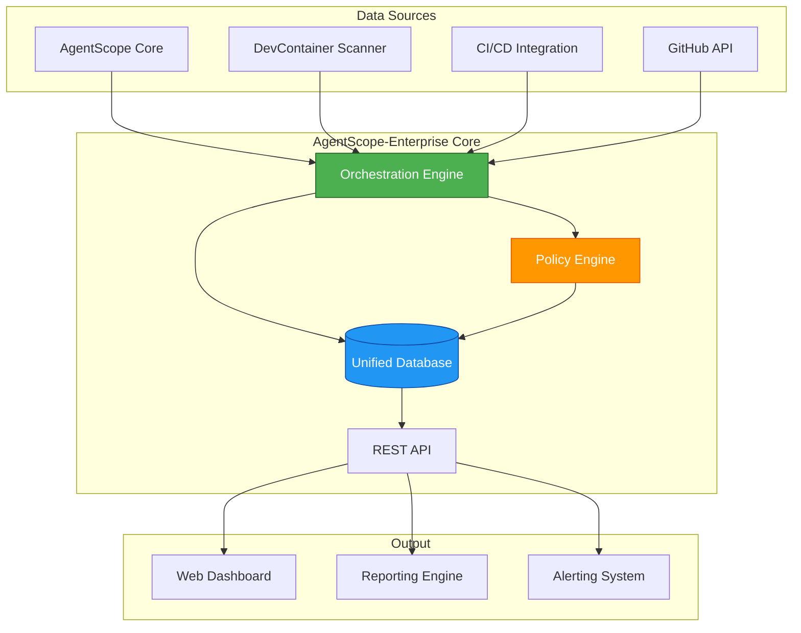
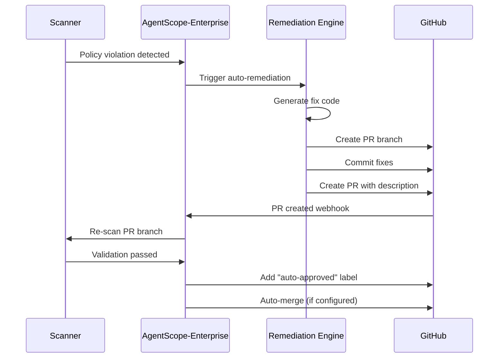
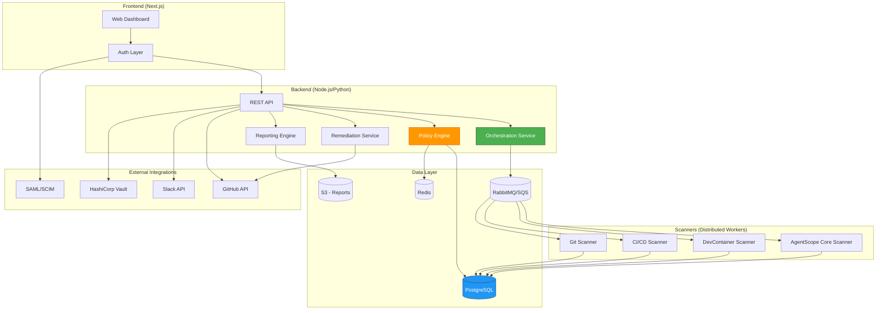

# AgentScope-Enterprise Product Requirements Document

**Version**: 1.0 (Draft)
**Date**: 2026-01-26
**Product**: AgentScope-Enterprise - Unified Development Environment Governance Platform
**Target Release**: v2.0 (2027 Q3)
**Status**: Strategic Planning Phase

---

## Executive Summary

**AgentScope-Enterprise** is a premium enterprise governance platform that orchestrates and unifies the entire AgentScope product suite to provide comprehensive, holistic development environment oversight. It transforms fragmented tooling into a unified command center for enterprise platform teams, security officers, and engineering leadership.

### Value Proposition

Organizations using AI-assisted development (Claude Code, Cursor, Gemini CLI) face a **critical governance gap**: development environments are invisible, inconsistent, and ungoverned. AgentScope-Enterprise closes this gap by providing:

1. **Unified Visibility**: Single dashboard showing complete environment health across all projects and teams
2. **Policy Enforcement**: Centralized security and compliance policies applied consistently
3. **Risk Management**: Proactive gap analysis and prioritized remediation
4. **Compliance Automation**: Automated evidence collection for SOC 2, ISO 27001, and audit trails
5. **Multi-Tool Orchestration**: Coordinates AgentScope Core, DevContainer Scanner, CI/CD integration, GitHub workflows

### Market Opportunity

- **Market Size**: $4.2B (subset of DevSecOps market growing at 24% CAGR)
- **Target Segment**: Enterprise companies (500+ engineers) adopting AI-assisted development
- **Urgency**: Security and compliance teams lack visibility into AI agent configurations
- **Competitive Gap**: No existing solution provides holistic development environment governance

### Business Model

- **Free Tier**: AgentScope Core (open source) - Community adoption engine
- **Pro Tier**: Individual teams ($99/month per team) - Entry point for paid features
- **Enterprise Tier**: Organization-wide ($2,500-$25,000/year) - Full governance platform
- **Professional Services**: Implementation, custom policies, training ($20,000-$150,000)

**Revenue Target (Year 2)**: $2.5M ARR from 100 enterprise customers + services

---

## 1. Problem Statement

### The Fragmentation Crisis

Modern development environments use multiple tools across the stack:

| Layer | Tools | Visibility Gap |
|-------|-------|----------------|
| **Agent Configuration** | Claude Code, Cursor, Gemini CLI | No central inventory of agents, skills, MCP servers |
| **Container Infrastructure** | DevContainers, Docker Compose | No security scanning of container configs |
| **CI/CD Pipelines** | GitHub Actions, GitLab CI | No validation of workflow security |
| **Version Control** | GitHub, GitLab | No enforcement of agent config policies |
| **Development Machines** | Developer laptops, cloud workstations | No audit trail of environment state |

**Result**: Security teams have **zero visibility** into what agents, permissions, and infrastructure developers are using.

### Real-World Impact

**Case Study - Fortune 500 Financial Services Company**:
- 1,200 developers using Claude Code across 450 repositories
- No centralized inventory of agent configurations
- Security team discovered (post-incident):
  - 87 projects with hardcoded API keys in CLAUDE.md
  - 34 projects with privileged DevContainers (container escape risk)
  - 156 GitHub Actions workflows with unvalidated secrets
  - Zero audit trail of environment changes

**Cost of fragmentation**:
- 6 months to manually audit all repositories
- $450K in security remediation
- 3-week production freeze
- Failed SOC 2 audit (remediation required)

### Why This Matters Now

1. **AI Adoption Acceleration**: 73% of enterprises using AI-assisted coding (GitHub, 2026)
2. **Regulatory Pressure**: SOC 2, ISO 27001 require environment governance
3. **Security Incidents**: Supply chain attacks targeting developer environments (SolarWinds, CodeCov)
4. **Compliance Costs**: Manual audits cost $200K-$500K per year for large enterprises

---

## 2. Target Users

### Primary Personas

#### 1. Platform Engineering Lead (Emma)
**Role**: VP of Platform Engineering at 2,000-person tech company

**Pain Points**:
- "I have no idea what development environments my 40 teams are using"
- "Every team has different Claude Code configurations - how do I standardize?"
- "When security asks 'show me all agent permissions', I have to manually check 200 repos"

**Goals**:
- Centralized visibility across all projects
- Standardized development environment templates
- Automated enforcement of platform policies

**Success Metrics**:
- Reduce environment onboarding from 2 days to 2 hours
- 100% compliance with platform standards
- Zero security exceptions for agent configurations

**Willingness to Pay**: $25,000/year for enterprise governance

---

#### 2. CISO / Security Architect (Alex)
**Role**: Chief Information Security Officer at fintech company (800 engineers)

**Pain Points**:
- "I can't prove to auditors that developer environments are secure"
- "DevContainers run with elevated privileges - potential container escape"
- "No audit trail when developers change agent configurations"

**Goals**:
- Security scanning of all development environment components
- Continuous compliance monitoring (SOC 2, PCI-DSS)
- Automated remediation recommendations
- Audit trail for compliance

**Success Metrics**:
- Pass SOC 2 audit (development environment controls)
- Zero critical vulnerabilities in production deployments
- 100% audit coverage of environment changes

**Willingness to Pay**: $50,000/year for compliance automation + audit evidence

---

#### 3. DevOps / SRE Lead (Sam)
**Role**: Director of DevOps at SaaS company (1,200 engineers)

**Pain Points**:
- "CI/CD workflows have inconsistent security practices"
- "GitHub Actions workflows run untrusted code - no validation"
- "No way to enforce 'approved MCP servers' policy across teams"

**Goals**:
- Automated CI/CD security validation
- Centralized policy enforcement
- Cross-project consistency
- Integration with existing DevOps tools

**Success Metrics**:
- Reduce CI/CD security incidents by 80%
- Automated policy enforcement (no manual reviews)
- <5 minute time-to-remediate for policy violations

**Willingness to Pay**: $15,000/year for CI/CD governance

---

#### 4. Compliance Officer (Jordan)
**Role**: Compliance Manager at healthcare tech company (SOC 2, HIPAA)

**Pain Points**:
- "Auditors ask for development environment controls - I have nothing to show"
- "Can't prove developers aren't exposing PHI in agent prompts"
- "No evidence trail for 'who changed what agent config when'"

**Goals**:
- Automated compliance evidence collection
- Audit trail for all environment changes
- Policy-as-code for regulatory requirements
- Automated compliance reporting

**Success Metrics**:
- Reduce audit prep time from 6 weeks to 1 week
- Zero audit findings related to development environments
- Automated quarterly compliance reports

**Willingness to Pay**: $20,000/year for compliance automation

---

### Secondary Personas

- **Engineering Manager**: Needs visibility into team's environment health
- **Developer**: Wants fast feedback on config violations (not blocked)
- **IT Operations**: Needs inventory of all development tools/licenses

---

## 3. User Stories

### Epic 1: Unified Dashboard & Visibility

#### US-001: Centralized Environment Inventory
**As a** Platform Engineering Lead
**I want to** see a complete inventory of all development environments across all projects
**So that** I can understand what tools and configurations are in use

**Acceptance Criteria**:
- Dashboard shows count of projects, agents, MCP servers, DevContainers, CI/CD workflows
- Filterable by team, repository, risk level, compliance status
- Real-time updates as environments change
- Export to CSV/JSON for external analysis

---

#### US-002: Cross-Tool Correlation
**As a** Security Architect
**I want to** see relationships between agent configs, DevContainers, and CI/CD workflows in one view
**So that** I can identify holistic security risks

**Acceptance Criteria**:
- Unified view showing agent → DevContainer → GitHub Actions dependencies
- Highlight correlated risks (e.g., agent with Bash permission + privileged container)
- Drill-down from dashboard to specific project details
- Export correlated risk report

---

#### US-003: Multi-Project Health Comparison
**As a** Platform Engineering Lead
**I want to** compare environment health across all my teams' projects
**So that** I can identify lagging teams needing support

**Acceptance Criteria**:
- Health score (0-100) for each project based on security, compliance, best practices
- Comparison matrix showing scores across teams
- Trend analysis (improving/degrading over time)
- Automated recommendations for improvement

---

### Epic 2: Policy Management & Enforcement

#### US-004: Centralized Policy Definition
**As a** CISO
**I want to** define security policies once and apply them across all projects
**So that** I don't have to manually review every repository

**Acceptance Criteria**:
- Policy editor with templates (PCI-DSS, SOC 2, ISO 27001, custom)
- Policy-as-code (YAML/JSON export/import)
- Version control for policy changes
- Role-based access control for policy management

---

#### US-005: Automated Policy Enforcement
**As a** DevOps Lead
**I want to** block pull requests that violate policies
**So that** non-compliant configurations never reach production

**Acceptance Criteria**:
- GitHub App integration for PR checks
- Policy violations shown as PR comments with remediation steps
- Configurable enforcement modes (block, warn, audit)
- Bypass mechanism for approved exceptions

---

#### US-006: Policy Exception Management
**As a** Engineering Manager
**I want to** request temporary policy exceptions with justification
**So that** I can unblock urgent work while maintaining audit trail

**Acceptance Criteria**:
- Exception request workflow with approval chain
- Time-limited exceptions (auto-expire)
- Audit log of all exceptions granted
- Automated reminder before exception expires

---

### Epic 3: Gap Analysis & Remediation

#### US-007: Desired State vs Actual State
**As a** Platform Engineering Lead
**I want to** define a "golden path" environment template
**So that** I can measure drift from the standard

**Acceptance Criteria**:
- Template editor for ideal agent config, DevContainer, CI/CD setup
- Gap analysis report showing deviations from template
- Prioritized remediation list (critical → low)
- One-click "apply template" for compliant projects

---

#### US-008: Prioritized Remediation Recommendations
**As a** Security Architect
**I want to** see remediation steps prioritized by risk and effort
**So that** I can focus on high-impact, low-effort fixes first

**Acceptance Criteria**:
- Remediation list sorted by risk score × ease of fix
- Estimated effort (hours) for each remediation
- Automated remediation for common issues (e.g., remove hardcoded secrets)
- Bulk remediation across multiple projects

---

#### US-009: Automated Remediation Workflows
**As a** DevOps Lead
**I want to** automatically fix policy violations via PR
**So that** developers don't have to manually remediate

**Acceptance Criteria**:
- AgentScope-Enterprise creates PR with fixes
- PR description explains violations + fixes
- Configurable auto-merge for low-risk fixes
- Rollback mechanism if auto-fix breaks tests

---

### Epic 4: Compliance & Audit

#### US-010: Automated Compliance Reporting
**As a** Compliance Officer
**I want to** generate compliance reports for SOC 2/ISO 27001
**So that** I can provide evidence to auditors without manual work

**Acceptance Criteria**:
- Report templates for SOC 2, ISO 27001, PCI-DSS, HIPAA
- Automated quarterly report generation
- Export to PDF with audit-ready formatting
- Evidence attachments (policy configs, scan results)

---

#### US-011: Audit Trail for All Changes
**As a** Compliance Officer
**I want to** see a complete audit trail of environment changes
**So that** I can prove who changed what and when

**Acceptance Criteria**:
- Timestamped log of all config changes (agent, DevContainer, CI/CD)
- User attribution (who made the change)
- Before/after diff for every change
- Immutable audit log (tamper-proof)

---

#### US-012: Compliance Dashboard
**As a** CISO
**I want to** see real-time compliance status across all projects
**So that** I know if we're audit-ready at any time

**Acceptance Criteria**:
- Compliance score (% of projects meeting policy)
- Breakdown by control (e.g., 95% compliant with MCP server restrictions)
- Trending (compliance improving/degrading)
- Automated alerts when compliance drops below threshold

---

### Epic 5: Multi-Team Collaboration

#### US-013: Team-Level Dashboards
**As an** Engineering Manager
**I want to** see my team's environment health without seeing other teams
**So that** I can focus on my scope of responsibility

**Acceptance Criteria**:
- Role-based access control (team-scoped views)
- Team-level policy overrides (more restrictive than org policy)
- Team-specific remediation queue
- Team leaderboard (gamification for compliance)

---

#### US-014: Cross-Team Policy Sharing
**As a** Platform Engineering Lead
**I want to** share successful policy templates across teams
**So that** teams can learn from each other's best practices

**Acceptance Criteria**:
- Policy marketplace (internal to organization)
- Import/export policy templates
- Policy usage analytics (most adopted policies)
- Feedback mechanism for policy improvements

---

### Epic 6: Integration & Orchestration

#### US-015: GitHub Integration
**As a** DevOps Lead
**I want to** scan all repositories on GitHub for environment configs
**So that** I don't have to manually add projects

**Acceptance Criteria**:
- GitHub App installation (org-wide)
- Automatic discovery of CLAUDE.md, .devcontainer.json, .github/workflows
- Webhook-based real-time updates
- Scan scheduling (nightly, on-push)

---

#### US-016: CI/CD Integration
**As a** DevOps Lead
**I want to** validate environments in CI/CD pipelines
**So that** policy violations are caught before deployment

**Acceptance Criteria**:
- GitHub Action for policy validation
- GitLab CI integration
- Exit code 1 on policy violations (fails build)
- Sarif output for GitHub Code Scanning integration

---

#### US-017: Slack/Teams Notifications
**As an** Engineering Manager
**I want to** receive Slack notifications when my team's projects violate policies
**So that** I can address issues immediately

**Acceptance Criteria**:
- Slack/Teams webhook integration
- Configurable notification rules (critical only, all violations)
- Rich notifications (violation details, remediation link)
- Mute/snooze notifications for known issues

---

### Epic 7: Advanced Analytics

#### US-018: Trend Analysis
**As a** Platform Engineering Lead
**I want to** see how environment health trends over time
**So that** I can measure the impact of governance initiatives

**Acceptance Criteria**:
- Historical data retention (6+ months)
- Trend charts (compliance over time, risk score over time)
- Compare current vs past periods (month-over-month)
- Export trend data for executive reporting

---

#### US-019: Security Posture Benchmarking
**As a** CISO
**I want to** compare our security posture to industry benchmarks
**So that** I can justify security investments to executives

**Acceptance Criteria**:
- Anonymous benchmarking data from AgentScope-Enterprise customers
- Percentile ranking (e.g., "You're in the top 25% for agent security")
- Industry-specific benchmarks (fintech, healthcare, SaaS)
- Opt-in data sharing (privacy-preserving)

---

#### US-020: Cost-Benefit Analysis
**As a** CFO / Engineering Leadership
**I want to** see ROI metrics for governance initiatives
**So that** I can justify the cost of AgentScope-Enterprise

**Acceptance Criteria**:
- Time saved (manual audits avoided)
- Risk reduction (estimated cost of prevented incidents)
- Compliance cost savings (audit prep time)
- Developer productivity (time saved on remediation)

---

## 4. Functional Requirements

### FR-1: Tool Orchestration

**Description**: AgentScope-Enterprise coordinates all AgentScope sub-products into a unified platform.

**Components**:
1. **AgentScope Core** (open source) - Agent configuration scanning
2. **DevContainer Scanner** (v1.3+) - Container security scanning
3. **CI/CD Integration** (v1.3+) - GitHub Actions validation
4. **GitHub Workflow Orchestrator** (v2.0) - Cross-repo policy enforcement

**Orchestration Capabilities**:
- Unified data aggregation from all scanners
- Correlation engine (agent ↔ container ↔ CI/CD)
- Centralized policy distribution
- Consolidated reporting

**Technical Architecture**:


---

### FR-2: Unified Dashboard

**Description**: Single-pane-of-glass view of complete development environment health.

**Dashboard Components**:

#### 2.1 Executive Overview
- Organization-wide health score (0-100)
- Total projects, teams, repositories
- Policy compliance percentage
- Critical vulnerabilities requiring immediate action
- Compliance status (SOC 2, ISO 27001)

#### 2.2 Project Explorer
- Searchable/filterable project list
- Health score per project
- Last scan timestamp
- Assigned team/owner
- Risk level (critical, high, medium, low)

#### 2.3 Risk Heat Map
- Visual representation of risk distribution
- Color-coded by severity
- Drill-down to project details
- Filterable by risk type (security, compliance, best practices)

#### 2.4 Trend Charts
- Compliance over time (past 6 months)
- Risk score trends
- Remediation velocity
- Policy violation trends

**Technology Stack**:
- Frontend: React/Next.js with TypeScript
- Charting: Recharts or Chart.js
- State Management: Zustand or Redux
- API Client: TanStack Query (React Query)

---

### FR-3: Policy Management

**Description**: Centralized policy definition, enforcement, and exception management.

#### 3.1 Policy Definition

**Policy Schema**:
```typescript
interface Policy {
  id: string;
  name: string;
  description: string;
  category: 'security' | 'compliance' | 'best-practices';
  severity: 'critical' | 'high' | 'medium' | 'low';

  // Conditions
  conditions: {
    agentConfig?: AgentConfigCondition;
    devContainer?: DevContainerCondition;
    cicd?: CicdCondition;
  };

  // Enforcement
  enforcement: {
    mode: 'block' | 'warn' | 'audit';
    autoRemediate: boolean;
    remediationSteps?: string[];
  };

  // Metadata
  compliance: ('SOC2' | 'ISO27001' | 'PCI-DSS' | 'HIPAA')[];
  tags: string[];
  createdAt: Date;
  updatedAt: Date;
  createdBy: string;
}

// Example policy
const noHardcodedSecretsPolicy: Policy = {
  id: 'pol-001',
  name: 'No Hardcoded Secrets in Agent Configs',
  description: 'Prevents API keys, tokens, and passwords in CLAUDE.md or settings.json',
  category: 'security',
  severity: 'critical',

  conditions: {
    agentConfig: {
      scanFor: 'secrets',
      patterns: ['API_KEY', 'PASSWORD', 'TOKEN', 'sk-', 'ghp_'],
    },
  },

  enforcement: {
    mode: 'block',
    autoRemediate: true,
    remediationSteps: [
      'Move secrets to environment variables',
      'Use .env files with .gitignore',
      'Store in GitHub Secrets for CI/CD',
    ],
  },

  compliance: ['SOC2', 'ISO27001', 'PCI-DSS'],
  tags: ['secrets', 'credentials', 'security'],
  createdAt: new Date('2026-01-01'),
  updatedAt: new Date('2026-01-15'),
  createdBy: 'alex@company.com',
};
```

#### 3.2 Policy Templates

**Built-in Templates**:
1. **SOC 2 Compliance Pack** (20 policies)
   - No hardcoded secrets
   - Audit logging enabled
   - Least privilege permissions
   - MCP server allowlist
   - DevContainer security baseline

2. **ISO 27001 Compliance Pack** (25 policies)
   - Access control policies
   - Cryptographic controls
   - Secure development lifecycle
   - Change management
   - Incident management

3. **PCI-DSS Pack** (15 policies)
   - Data protection policies
   - Network security
   - Access restrictions
   - Logging and monitoring

4. **Best Practices Pack** (30 policies)
   - No deprecated dependencies
   - No privileged containers
   - CI/CD security checks
   - Code review requirements

#### 3.3 Policy Enforcement

**Enforcement Points**:
1. **Pre-Commit Hook**: Block commits violating critical policies
2. **PR Check**: GitHub App adds status check on pull requests
3. **Scheduled Scan**: Nightly scans for policy drift
4. **Real-Time**: Webhook triggers on config changes

**Enforcement Modes**:
- **Block**: Prevent action (commit, merge, deploy)
- **Warn**: Allow action but notify (Slack, email)
- **Audit**: Log violation for compliance reporting

---

### FR-4: Gap Analysis Engine

**Description**: Compare actual environment state to desired state and identify gaps.

#### 4.1 Desired State Definition

**Golden Path Template**:
```yaml
# golden-path-template.yaml
name: "Standard Full-Stack Development Environment"
version: "2.0"

agent:
  claudeMd:
    maxInstructionLength: 5000
    allowedTools:
      - Read
      - Write
      - Edit
      - Bash  # Restricted - see permissions
    forbiddenPatterns:
      - "eval("
      - "exec("
      - "--no-verify"

  settings:
    permissions:
      defaultMode: "ask"
      allow:
        - "Read:**"
        - "Write:src/**"
        - "Edit:src/**"
      deny:
        - "Bash:rm -rf"
        - "Bash:sudo"

    mcpServers:
      allowlist:
        - "@modelcontextprotocol/server-filesystem"
        - "@modelcontextprotocol/server-git"
      requireAuth: true

devcontainer:
  baseImage: "mcr.microsoft.com/devcontainers/typescript-node:20"
  privileged: false
  runArgs:
    - "--cap-drop=ALL"
    - "--cap-add=NET_BIND_SERVICE"
  mounts:
    allowed:
      - type: "bind"
        source: "${localWorkspaceFolder}"
        target: "/workspace"
    forbidden:
      - source: "/"
      - source: "/root"
      - source: "/etc"

cicd:
  githubActions:
    requireCodeQL: true
    requireDependabot: true
    secrets:
      noHardcoded: true
      vaultProvider: "github-secrets"
```

#### 4.2 Gap Detection Algorithm

**Process**:
1. Load desired state template
2. Scan actual project configuration
3. Deep comparison (agent, DevContainer, CI/CD)
4. Generate gap report with prioritization

**Gap Types**:
- **Missing**: Component not present (e.g., no CodeQL workflow)
- **Drift**: Component differs from template (e.g., wrong base image)
- **Forbidden**: Disallowed configuration present (e.g., hardcoded secret)

**Prioritization**:
```typescript
function prioritizeGaps(gaps: Gap[]): PrioritizedGap[] {
  return gaps.map(gap => ({
    ...gap,
    priority: calculatePriority(gap),
    effortEstimate: estimateEffort(gap),
  })).sort((a, b) =>
    (b.priority.score / b.effortEstimate.hours) -
    (a.priority.score / a.effortEstimate.hours)
  );
}

// Example output:
// 1. Remove hardcoded API key (priority: 100, effort: 0.5h) → Score: 200
// 2. Enable CodeQL (priority: 80, effort: 1h) → Score: 80
// 3. Update base image (priority: 40, effort: 2h) → Score: 20
```

---

### FR-5: Automated Remediation

**Description**: Automatically fix common policy violations via pull requests.

#### 5.1 Remediation Actions

**Supported Auto-Remediations**:
1. **Secrets Removal**
   - Detect hardcoded secrets
   - Replace with environment variable references
   - Create PR with .env.example template

2. **Permission Tightening**
   - Detect overly permissive agent permissions
   - Apply least-privilege principle
   - Generate updated settings.json

3. **DevContainer Hardening**
   - Remove privileged mode
   - Add capability drops
   - Update to approved base image

4. **CI/CD Security**
   - Add CodeQL workflow
   - Enable Dependabot
   - Add secret scanning workflow

#### 5.2 Remediation Workflow



---

### FR-6: Compliance Reporting

**Description**: Automated generation of audit-ready compliance reports.

#### 6.1 Report Templates

**SOC 2 Type II Report**:
- Control: CC6.1 - Logical and Physical Access Controls
  - Evidence: Agent permission configurations
  - Coverage: 100% of projects scanned
  - Exceptions: 3 approved exceptions (with justification)
  - Status: ✅ Compliant

**ISO 27001 Report**:
- Annex A.9.4.1 - Information Access Restriction
  - Evidence: MCP server allowlists, DevContainer restrictions
  - Non-Conformances: 2 projects pending remediation
  - Remediation Plan: PRs created, auto-merge in 24h
  - Status: ⚠ Partial Compliance

#### 6.2 Evidence Collection

**Automated Evidence**:
- Policy definitions (JSON export)
- Scan results (timestamped)
- Remediation history (audit log)
- Exception approvals (with justification)
- Trend analysis (compliance over time)

**Export Formats**:
- PDF (audit-ready)
- JSON (machine-readable)
- CSV (spreadsheet analysis)
- Markdown (documentation)

---

### FR-7: Multi-Tenancy & RBAC

**Description**: Support for multiple teams with role-based access control.

#### 7.1 Organizational Hierarchy

```
Organization (company.com)
├── Platform Team
│   ├── Emma (Admin)
│   └── Sarah (Editor)
├── Backend Team
│   ├── Mike (Editor)
│   └── Dev1, Dev2 (Viewer)
├── Frontend Team
│   ├── Lisa (Editor)
│   └── Dev3, Dev4 (Viewer)
└── Security Team
    ├── Alex (Admin)
    └── Jordan (Compliance Auditor)
```

#### 7.2 Roles & Permissions

| Role | Permissions |
|------|-------------|
| **Organization Admin** | Full access, manage teams, define org policies, compliance reporting |
| **Team Admin** | Manage team members, team-level policies, team dashboards |
| **Editor** | Create/edit policies, trigger scans, create remediations |
| **Viewer** | Read-only access to dashboards and reports |
| **Compliance Auditor** | Read-only + export compliance reports + view audit logs |
| **Developer** | View own projects, request policy exceptions |

---

### FR-8: Integration Ecosystem

**Description**: Seamless integration with existing enterprise tools.

#### 8.1 Version Control

**GitHub**:
- GitHub App installation (org-wide)
- Repository discovery and scanning
- PR checks and status updates
- Issue creation for violations

**GitLab** (v2.1):
- Similar functionality to GitHub

#### 8.2 CI/CD

**GitHub Actions**:
```yaml
# .github/workflows/agentscope-enterprise.yml
name: Environment Governance
on: [push, pull_request]

jobs:
  validate:
    runs-on: ubuntu-latest
    steps:
      - uses: actions/checkout@v3
      - uses: agentscope/enterprise-action@v1
        with:
          org: company.com
          api-key: ${{ secrets.AGENTSCOPE_API_KEY }}
          fail-on: critical,high
```

#### 8.3 Communication

**Slack**:
- Webhook notifications for policy violations
- Interactive remediation buttons
- Daily/weekly compliance digest

**Microsoft Teams**:
- Similar to Slack

#### 8.4 SSO / Identity

**SAML 2.0**:
- Okta, Azure AD, Google Workspace
- Automatic team mapping via SAML attributes

**SCIM**:
- User provisioning/deprovisioning
- Group sync

---

## 5. Non-Functional Requirements

### NFR-1: Enterprise-Grade Security

**Requirements**:
- SOC 2 Type II certified
- Data encrypted at rest (AES-256) and in transit (TLS 1.3)
- Zero-trust architecture
- Secrets stored in HashiCorp Vault or AWS Secrets Manager
- Regular penetration testing (quarterly)
- Vulnerability disclosure program

**Implementation**:
- All API calls require authentication (JWT + API key)
- Row-level security for multi-tenancy
- Audit logging of all sensitive operations
- Automated security scanning of AgentScope-Enterprise codebase

---

### NFR-2: Multi-Tenancy

**Requirements**:
- Complete data isolation between organizations
- Support for 1,000+ organizations on shared infrastructure
- Per-tenant customization (policies, branding)
- Tenant-level resource quotas

**Database Design**:
```sql
-- All tables have tenant_id for row-level security
CREATE TABLE organizations (
  id UUID PRIMARY KEY,
  name VARCHAR(255),
  created_at TIMESTAMP
);

CREATE TABLE projects (
  id UUID PRIMARY KEY,
  org_id UUID REFERENCES organizations(id),
  name VARCHAR(255),
  -- RLS: WHERE org_id = current_user.org_id
);

-- Postgres Row-Level Security
ALTER TABLE projects ENABLE ROW LEVEL SECURITY;
CREATE POLICY tenant_isolation ON projects
  FOR ALL
  USING (org_id = current_setting('app.current_org_id')::UUID);
```

---

### NFR-3: Scalability

**Requirements**:
- Support 1,000+ repositories per organization
- Scan 100+ projects concurrently
- Handle 10,000+ policy evaluations/second
- Horizontal scaling for API and workers

**Architecture**:
```
┌─────────────────────────────────────────┐
│         Load Balancer (NGINX)           │
└─────────────────┬───────────────────────┘
                  │
    ┌─────────────┼─────────────┐
    │             │             │
┌───▼───┐    ┌───▼───┐    ┌───▼───┐
│ API 1 │    │ API 2 │    │ API 3 │
└───┬───┘    └───┬───┘    └───┬───┘
    │             │             │
    └─────────────┼─────────────┘
                  │
         ┌────────▼────────┐
         │  PostgreSQL     │
         │  (replicated)   │
         └────────┬────────┘
                  │
    ┌─────────────┼─────────────┐
    │             │             │
┌───▼────┐   ┌───▼────┐   ┌───▼────┐
│Worker 1│   │Worker 2│   │Worker 3│
└────────┘   └────────┘   └────────┘
```

**Performance Targets**:
- API response time: <100ms (p95)
- Scan throughput: 50 projects/minute
- Dashboard load time: <2s
- Policy evaluation: <10ms per check

---

### NFR-4: Performance

**Target Metrics**:
| Operation | Target | Measurement |
|-----------|--------|-------------|
| Full project scan | <30s | 50 agents, 10 MCP, 5 DevContainers |
| Policy evaluation | <10ms | Per-policy check |
| Dashboard load | <2s | 100 projects |
| API response (p95) | <100ms | REST endpoints |
| Concurrent scans | 100+ | Parallel execution |

**Optimization Strategies**:
- Caching: Redis for policy results (TTL: 5 min)
- Database indexing: Composite indexes on (org_id, project_id, timestamp)
- Async processing: Background workers for scans and remediations
- CDN: Static assets (dashboard) served via CloudFront/Cloudflare

---

### NFR-5: Reliability

**Targets**:
- Uptime: 99.9% (SLA for Enterprise tier)
- Mean Time to Recovery (MTTR): <30 minutes
- Data retention: 12 months (audit logs), 36 months (compliance data)
- Backup frequency: Hourly incremental, daily full

**High Availability**:
- Multi-region deployment (primary + failover)
- Database replication (primary-replica)
- Automated failover (health checks every 30s)
- Disaster recovery plan (tested quarterly)

---

### NFR-6: Usability

**Targets**:
- Time to first scan: <10 minutes (onboarding)
- Dashboard learning curve: <30 minutes (training video)
- Net Promoter Score (NPS): >60
- Support response time: <4 hours (business hours)

**UX Principles**:
- Dashboard: Clean, modern design (shadcn/ui components)
- Onboarding: Interactive wizard with progress bar
- Help: Contextual tooltips, in-app documentation
- Accessibility: WCAG 2.1 Level AA compliance

---

### NFR-7: Compliance

**Certifications**:
- SOC 2 Type II (achieved within 12 months of GA)
- ISO 27001 (optional, for government/enterprise deals)
- GDPR compliant (data processing agreements)
- HIPAA compliant (for healthcare customers)

**Data Residency**:
- US (AWS us-east-1, us-west-2)
- EU (AWS eu-west-1) - for GDPR compliance
- Customer choice of region

---

## 6. Technical Architecture

### 6.1 System Architecture



### 6.2 Data Flow

**Scan Workflow**:
1. User initiates scan (manual or scheduled)
2. Orchestration Service creates scan job
3. Job queued in RabbitMQ/SQS
4. Worker picks up job and executes scanner
5. Scanner fetches data from GitHub API
6. Scanner runs AgentScope Core, DevContainer Scanner, CI/CD Scanner
7. Results aggregated and stored in PostgreSQL
8. Policy Engine evaluates results against policies
9. Violations trigger remediation workflow (optional)
10. Dashboard updated via WebSocket (real-time)

### 6.3 Policy Evaluation Engine

**Architecture**:
```typescript
// Policy evaluation pipeline
class PolicyEngine {
  async evaluate(
    project: Project,
    policies: Policy[]
  ): Promise<PolicyResult[]> {
    const results: PolicyResult[] = [];

    for (const policy of policies) {
      // Check cache first
      const cached = await this.cache.get(`policy:${policy.id}:${project.id}`);
      if (cached) {
        results.push(cached);
        continue;
      }

      // Evaluate policy
      const result = await this.evaluatePolicy(project, policy);

      // Cache result (TTL: 5 minutes)
      await this.cache.set(
        `policy:${policy.id}:${project.id}`,
        result,
        { ttl: 300 }
      );

      results.push(result);
    }

    return results;
  }

  private async evaluatePolicy(
    project: Project,
    policy: Policy
  ): Promise<PolicyResult> {
    // Load project data
    const agentConfig = await this.loadAgentConfig(project);
    const devContainer = await this.loadDevContainer(project);
    const cicd = await this.loadCicd(project);

    // Apply policy conditions
    const violations = [];

    if (policy.conditions.agentConfig) {
      violations.push(
        ...this.checkAgentConfig(agentConfig, policy.conditions.agentConfig)
      );
    }

    if (policy.conditions.devContainer) {
      violations.push(
        ...this.checkDevContainer(devContainer, policy.conditions.devContainer)
      );
    }

    if (policy.conditions.cicd) {
      violations.push(
        ...this.checkCicd(cicd, policy.conditions.cicd)
      );
    }

    return {
      policyId: policy.id,
      projectId: project.id,
      passed: violations.length === 0,
      violations,
      evaluatedAt: new Date(),
    };
  }
}
```

### 6.4 Technology Stack

**Frontend**:
- Framework: Next.js 14 (React 18)
- UI Components: shadcn/ui (Radix UI + Tailwind CSS)
- State Management: Zustand
- Data Fetching: TanStack Query
- Charts: Recharts
- Forms: React Hook Form + Zod

**Backend**:
- API: Node.js (Express or Fastify)
- Orchestration: Python (Celery) or Node.js (BullMQ)
- Scanners: TypeScript (reuse AgentScope Core)

**Data Layer**:
- Database: PostgreSQL 15 (with Row-Level Security)
- Cache: Redis 7
- Queue: RabbitMQ or AWS SQS
- Object Storage: AWS S3 or compatible

**Infrastructure**:
- Hosting: AWS (ECS Fargate or EKS)
- CDN: CloudFront
- Monitoring: DataDog or Grafana + Prometheus
- Logging: CloudWatch or ELK Stack

---

## 7. Deployment Models

### 7.1 SaaS (Recommended)

**Pricing**:
- **Free Tier**: 1 organization, 10 projects, community support
- **Pro Tier**: $99/month per team (up to 50 projects)
- **Enterprise Tier**: $2,500-$25,000/year based on usage

**Infrastructure**:
- Multi-tenant SaaS hosted on AWS
- Automatic updates and maintenance
- 99.9% uptime SLA

**Target Customers**:
- Startups and mid-market companies
- Teams wanting fastest time-to-value
- Organizations without strict data residency requirements

---

### 7.2 Self-Hosted (Enterprise)

**Deployment Options**:
1. **Docker Compose** (single-node development)
2. **Kubernetes** (production, recommended)
3. **Terraform** (AWS, Azure, GCP)

**Requirements**:
- Kubernetes 1.28+
- PostgreSQL 15+
- Redis 7+
- 4 CPU, 16GB RAM (minimum)
- 100GB storage

**Pricing**:
- License: $10,000-$50,000/year (based on seats)
- Support: $5,000-$15,000/year (optional)

**Target Customers**:
- Large enterprises with strict data residency
- Government/defense
- Regulated industries (banking, healthcare)

**Installation**:
```bash
# Kubernetes Helm Chart
helm repo add agentscope https://charts.agentscope.io
helm install agentscope-enterprise agentscope/enterprise \
  --set license.key=YOUR_LICENSE_KEY \
  --set database.host=postgres.company.internal \
  --set redis.host=redis.company.internal
```

---

### 7.3 Hybrid (Future)

**Description**: On-premise scanners, cloud-hosted dashboard.

**Use Case**:
- Organizations with sensitive codebases (can't send to cloud)
- Want cloud benefits (automatic updates, no ops burden)

**Architecture**:
- Scanners run on-premise (Kubernetes)
- Data encrypted and sent to cloud API
- Dashboard hosted in cloud

**Pricing**: Custom (contact sales)

---

## 8. Success Metrics

### 8.1 Product Metrics

| Metric | Target (Year 1) | Target (Year 2) |
|--------|-----------------|-----------------|
| **Adoption** | | |
| Active Organizations | 50 | 200 |
| Active Users | 500 | 2,500 |
| Projects Managed | 5,000 | 25,000 |
| **Engagement** | | |
| Daily Active Users | 100 | 500 |
| Avg. Policies per Org | 15 | 25 |
| Scans per Week | 10,000 | 75,000 |
| **Quality** | | |
| NPS (Net Promoter Score) | >50 | >60 |
| Customer Satisfaction | >4.0/5.0 | >4.3/5.0 |
| Support Ticket Volume | <100/month | <200/month |

### 8.2 Business Metrics

| Metric | Year 1 | Year 2 |
|--------|--------|--------|
| **Revenue** | | |
| Annual Recurring Revenue (ARR) | $500K | $2.5M |
| Enterprise Customers | 20 | 100 |
| Average Contract Value (ACV) | $15K | $25K |
| **Growth** | | |
| MoM Growth Rate | 15% | 10% |
| Churn Rate | <5% | <3% |
| Expansion Revenue | 20% | 30% |
| **Efficiency** | | |
| Customer Acquisition Cost (CAC) | $5K | $3K |
| LTV:CAC Ratio | 5:1 | 10:1 |
| Gross Margin | 70% | 80% |

### 8.3 Customer Outcomes

| Outcome | Target |
|---------|--------|
| Time to first compliance report | <1 hour |
| Reduction in manual audit time | 80% |
| Security vulnerabilities prevented | 95% |
| Developer productivity impact | <5% overhead |
| Time saved per security incident | $50K-$200K |

---

## 9. Competitive Analysis

### 9.1 Competitive Landscape

| Solution | Focus | Strengths | Weaknesses | Price |
|----------|-------|-----------|------------|-------|
| **Snyk** | Application security | Mature, comprehensive, integrations | Not dev environment focused | $300-$1,500/dev/yr |
| **SonarQube Enterprise** | Code quality | Deep static analysis | No agent/container scanning | $150,000/yr |
| **Aqua Security** | Container security | Strong runtime protection | No agent config scanning | $50-$150/node/yr |
| **Trivy** | Container/IaC scanning | Open source, fast | CLI-only, no governance | Free (OSS) |
| **GitHub Advanced Security** | Code/secret scanning | Native GitHub integration | Limited to GitHub only | $49/committer/mo |
| **AgentScope-Enterprise** | **Dev environment governance** | **Holistic, agent-focused** | New market, limited track record | **$2,500-$25K/yr** |

### 9.2 Competitive Differentiation

**Unique Value Propositions**:

1. **Only solution focused on AI agent development environments**
   - Competitors scan code, containers, or infrastructure
   - AgentScope-Enterprise scans agent configs, skills, MCP servers

2. **Holistic, not fragmented**
   - Competitors require 3-5 tools for full coverage
   - AgentScope-Enterprise: single platform

3. **Policy-as-code for development environments**
   - Define policies once, enforce everywhere
   - Competitors focus on production, not development

4. **Built for the AI-assisted development era**
   - Claude Code, Cursor, Gemini CLI are net-new
   - Existing tools don't understand agent architectures

5. **Developer-friendly governance**
   - Automated remediation, not just detection
   - Fast feedback, minimal friction

### 9.3 Competitive Strategy

**Short-Term (Year 1)**:
- **Market Education**: Establish "development environment governance" as a category
- **Open Source Foundation**: AgentScope Core drives awareness
- **Thought Leadership**: Publish research on agent security risks
- **Integrations**: Partner with Claude Code, GitHub, DevContainer teams

**Long-Term (Year 2-3)**:
- **Platform Play**: Become the "control plane" for AI-assisted development
- **Ecosystem**: Marketplace for third-party policies and integrations
- **Enterprise Lock-In**: Deep integration with enterprise tools (Okta, ServiceNow)
- **Compliance Certification**: SOC 2, ISO 27001 for credibility

---

## 10. Pricing Strategy

### 10.1 Pricing Tiers

| Tier | Price | Target | Features |
|------|-------|--------|----------|
| **Free** | $0 | Individual developers, OSS projects | AgentScope Core CLI, community support, 10 projects |
| **Pro** | $99/month | Small teams (5-20 devs) | 50 projects, web dashboard, policy templates, Slack integration |
| **Enterprise** | $2,500-$25,000/year | Large organizations (100+ devs) | Unlimited projects, RBAC, compliance reports, SSO, SLA, dedicated support |
| **Enterprise Plus** | Custom | Fortune 500, government | Self-hosted option, custom policies, white-glove onboarding, 24/7 support |

### 10.2 Pricing Model

**Value-Based Pricing**:
- Based on **number of repositories** or **number of developers**
- Typical customer: 200 repos, 100 developers → $10,000/year
- ROI justification:
  - Manual audit cost avoided: $200K/year
  - Security incident prevention: $500K+ potential savings
  - Compliance automation: $100K/year in audit prep time

**Volume Discounts**:
- 100-500 repos: Standard pricing
- 500-1,000 repos: 15% discount
- 1,000+ repos: 25% discount + custom SLA

**Add-Ons**:
- Professional Services: $20,000-$150,000
  - Onboarding and training (2 weeks): $20,000
  - Custom policy development: $30,000
  - Integration development: $50,000+
  - Managed service: $5,000/month

### 10.3 Free Tier Strategy

**Purpose**: Developer adoption funnel

**Limitations**:
- 10 projects (enough for personal use)
- Community support only (GitHub Discussions)
- No web dashboard (CLI only)
- No multi-user collaboration

**Upgrade Triggers**:
- Project limit reached → Upgrade to Pro
- Team collaboration needed → Upgrade to Pro
- Compliance reporting needed → Upgrade to Enterprise

---

## 11. Roadmap

### 11.1 v1.0 (2027 Q1) - Minimum Viable Enterprise

**Goal**: Prove the concept with early adopters

**Features**:
- Unified dashboard (read-only)
- AgentScope Core integration
- DevContainer Scanner integration
- Basic policy engine (10 built-in policies)
- GitHub integration (scan on-demand)
- Single-tenant deployment

**Metrics**:
- 10 paying customers
- $50K ARR
- NPS >40

---

### 11.2 v1.5 (2027 Q2) - Policy & Remediation

**Goal**: Automated governance value

**Features**:
- Policy management UI (create, edit, delete)
- Automated remediation (secrets, permissions)
- PR checks for policy violations
- Compliance report templates (SOC 2, ISO 27001)
- Multi-tenancy support
- Slack/Teams integration

**Metrics**:
- 30 paying customers
- $200K ARR
- 50% reduction in manual audit time (customer reported)

---

### 11.3 v2.0 (2027 Q3) - Full Enterprise Platform ⭐

**Goal**: Enterprise-ready, feature-complete

**Features**:
- CI/CD integration (GitHub Actions Scanner)
- Advanced analytics (trend analysis, benchmarking)
- RBAC (team-level access control)
- SSO/SAML integration
- Self-hosted deployment option (Kubernetes)
- API for custom integrations
- Audit trail (immutable log)

**Metrics**:
- 100 paying customers
- $2M ARR
- SOC 2 Type II certified

---

### 11.4 v2.5 (2028 Q1) - AI-Powered Governance

**Goal**: Intelligent, predictive governance

**Features**:
- AI-powered policy recommendations
- Predictive risk scoring (ML model)
- Natural language policy creation ("No secrets in production")
- Automated incident response (rollback on violation)
- Cross-organization benchmarking
- Custom integrations marketplace

**Metrics**:
- 200 paying customers
- $5M ARR
- Industry recognition (Gartner, Forrester)

---

## 12. Go-to-Market Strategy

### 12.1 Phase 1: Awareness (2026 Q4 - 2027 Q1)

**Goal**: Establish "development environment governance" as a recognized need

**Tactics**:
1. **Content Marketing**
   - Blog series: "The Hidden Risks of AI-Assisted Development"
   - Whitepaper: "Development Environment Security in the Age of AI Agents"
   - Case studies: Fortune 500 company audit failures

2. **Thought Leadership**
   - Speak at conferences (RSAC, Black Hat, DevSecOps Days)
   - Podcast interviews (security, DevOps)
   - Guest posts on TechCrunch, InfoQ

3. **Open Source Growth**
   - AgentScope Core: 5K+ GitHub stars
   - DevContainer Scanner: 2K+ stars
   - Community contributions: 50+ contributors

**Metrics**:
- 10K website visitors/month
- 500 AgentScope Core users
- 5 enterprise demo requests

---

### 12.2 Phase 2: Beta Program (2027 Q1-Q2)

**Goal**: Validate product-market fit with 10 design partners

**Tactics**:
1. **Design Partner Program**
   - Recruit 10 enterprise customers (50-500 devs)
   - Free licenses in exchange for feedback
   - Monthly feedback sessions

2. **Beta Launch**
   - Invite-only access
   - Dedicated Slack channel for feedback
   - Weekly product updates

3. **Case Study Development**
   - Document ROI for each design partner
   - Video testimonials
   - Joint webinars

**Metrics**:
- 10 design partners
- 8/10 willing to pay (conversion)
- Average satisfaction: >4.5/5.0

---

### 12.3 Phase 3: General Availability (2027 Q3)

**Goal**: $2M ARR, 100 paying customers

**Tactics**:
1. **Product Launch**
   - Product Hunt launch
   - Press release (TechCrunch, VentureBeat)
   - Launch event (webinar)

2. **Sales Team**
   - Hire 2 Account Executives (AE)
   - Hire 1 Sales Engineer (SE)
   - Hire 1 Customer Success Manager (CSM)

3. **Marketing Campaigns**
   - Google Ads (keywords: "development security", "agent security")
   - LinkedIn Ads (targeted at CISOs, VPs Engineering)
   - Retargeting (website visitors)

4. **Channel Partnerships**
   - Reseller agreements (security consultancies)
   - OEM partnerships (DevOps platforms)

**Metrics**:
- 100 paying customers
- $2M ARR
- 30% month-over-month growth

---

### 12.4 Phase 4: Scale (2028+)

**Goal**: $10M+ ARR, industry leader

**Tactics**:
1. **Enterprise Sales Motion**
   - Hire 5+ AEs (enterprise-focused)
   - Hire 3+ SEs
   - Hire 5+ CSMs

2. **Strategic Partnerships**
   - Anthropic (Claude Code integration)
   - GitHub (GitHub Apps marketplace)
   - AWS/Azure/GCP (cloud marketplace)

3. **International Expansion**
   - EU deployment (GDPR compliance)
   - Asia-Pacific (local data residency)

4. **Product Expansion**
   - Adjacent markets (runtime security, SBOM management)
   - Vertical solutions (fintech, healthcare)

**Metrics**:
- 500+ paying customers
- $10M+ ARR
- Industry analyst recognition (Gartner Magic Quadrant)

---

## 13. Risk Analysis

### 13.1 Market Risks

| Risk | Likelihood | Impact | Mitigation |
|------|------------|--------|------------|
| **Low adoption of AI-assisted coding** | Low | High | Trend is clear - 73% adoption rate (GitHub 2026) |
| **Competitors copy approach** | Medium | Medium | First-mover advantage, open source moat |
| **Market not willing to pay** | Low | High | Design partner validation, clear ROI |
| **Regulatory changes** | Medium | Low | Monitor compliance landscape, adapt policies |

### 13.2 Technical Risks

| Risk | Likelihood | Impact | Mitigation |
|------|------------|--------|------------|
| **Scalability issues** | Medium | High | Load testing, horizontal scaling architecture |
| **Security breach** | Low | Critical | SOC 2 compliance, pen testing, bug bounty |
| **Integration complexity** | Medium | Medium | Well-defined APIs, extensive testing |
| **Performance degradation** | Medium | Medium | Caching, async processing, monitoring |

### 13.3 Operational Risks

| Risk | Likelihood | Impact | Mitigation |
|------|------------|--------|------------|
| **Inability to hire talent** | Medium | High | Competitive comp, remote-first, strong culture |
| **Customer churn** | Medium | High | Proactive CSM engagement, usage monitoring |
| **Support overwhelm** | Medium | Medium | Self-service docs, tiered support, automation |
| **Regulatory compliance failure** | Low | Critical | External audits, compliance team, legal counsel |

---

## 14. Success Factors

### Critical Success Factors

1. **Product-Market Fit**
   - Solve a real, urgent problem (proven via design partners)
   - Deliver measurable ROI (80% reduction in audit time)
   - Low friction adoption (<10 minutes to first scan)

2. **Go-to-Market Execution**
   - Establish category leadership (thought leadership, conferences)
   - Build trust (open source foundation, SOC 2 certification)
   - Efficient sales motion (low CAC, high conversion)

3. **Product Velocity**
   - Ship fast (v1.0 in 6 months from start)
   - Listen to customers (design partner feedback loop)
   - Iterate rapidly (bi-weekly releases)

4. **Team Excellence**
   - Hire A+ talent (engineering, sales, customer success)
   - Strong culture (remote-first, transparent, customer-obsessed)
   - Retention (low churn, high engagement)

5. **Financial Discipline**
   - Unit economics (LTV:CAC >5:1)
   - Burn rate management (18+ months runway)
   - Path to profitability (breakeven by Year 3)

---

## 15. Open Questions & Decisions Needed

### Strategic Questions

1. **Build vs Buy vs Partner**
   - Should we build all scanners in-house, or integrate existing tools (Trivy, Snyk)?
   - **Recommendation**: Build for agent scanning (unique), integrate for containers/CI (commoditized)

2. **Open Source vs Closed Source**
   - How much of AgentScope-Enterprise should be open source?
   - **Recommendation**: Core scanners OSS (adoption), orchestration/dashboard proprietary (moat)

3. **Market Segmentation**
   - Should we focus on specific verticals (fintech, healthcare) or horizontal?
   - **Recommendation**: Start horizontal, verticalize after PMF

4. **Pricing Model**
   - Per-repo, per-developer, or per-organization?
   - **Recommendation**: Per-developer (aligns with value, predictable revenue)

### Technical Decisions

1. **Database Choice**
   - PostgreSQL vs MySQL vs MongoDB?
   - **Recommendation**: PostgreSQL (Row-Level Security for multi-tenancy)

2. **Hosting**
   - AWS vs Azure vs GCP vs multi-cloud?
   - **Recommendation**: AWS (mature ecosystem, Fargate for easy scaling)

3. **Monolith vs Microservices**
   - Start with monolith or microservices from day 1?
   - **Recommendation**: Modular monolith (fast iteration), extract services later

### Product Decisions

1. **Self-Serve vs Sales-Led**
   - Should Pro tier be self-serve or require sales touch?
   - **Recommendation**: Self-serve Pro, sales-led Enterprise

2. **Free Tier Scope**
   - How much should we give away for free?
   - **Recommendation**: Enough for individual use (10 projects), insufficient for teams

3. **Integration Strategy**
   - Which integrations are must-have for v1.0?
   - **Recommendation**: GitHub (must-have), Slack (nice-to-have), others (v1.5+)

---

## 16. Appendix

### A. Glossary

- **Agent**: AI coding assistant (Claude Code, Cursor, Gemini CLI)
- **CLAUDE.md**: Configuration file for Claude Code agent instructions
- **DevContainer**: VS Code development container configuration
- **MCP Server**: Model Context Protocol server providing tools to agents
- **Policy**: Governance rule enforced by AgentScope-Enterprise
- **Gap Analysis**: Comparison of actual vs desired state
- **DREAD**: Risk scoring methodology (Damage, Reproducibility, Exploitability, Affected Users, Discoverability)
- **SOC 2**: Security compliance framework for service organizations

### B. References

1. GitHub (2026). "State of AI-Assisted Development Report"
2. Gartner (2025). "DevSecOps Market Forecast"
3. OWASP (2026). "AI Agent Security Top 10"
4. AgentScope Production Readiness Report (2026-01-25)
5. DevContainer Scanner Product Vision (2026-01-25)

### C. Related Documents

- [AgentScope Core README](../README.md)
- [DevContainer Scanner Product Vision](../export/devcontainer-scanner-project/PRODUCT-VISION.md)
- [Production Readiness Report](./PRODUCTION-READINESS-REPORT.md)
- [ADR-012: Agent Security Architecture](./adr/ADR-012-agent-security-architecture.md)

---

**Document Status**: Draft v1.0
**Next Review**: 2027 Q1 (after design partner feedback)
**Owner**: Product Management
**Approvers**: CEO, CTO, VP Engineering, VP Sales

---

**End of Document**
