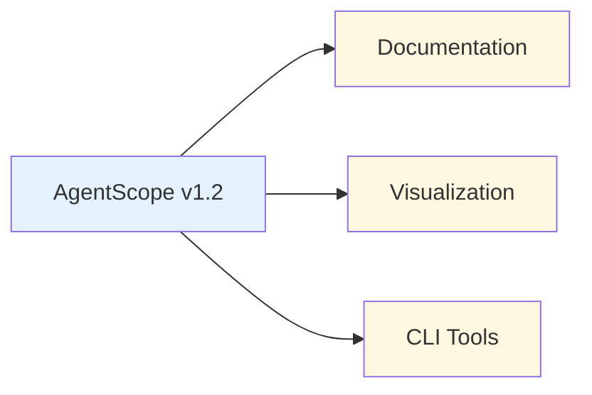
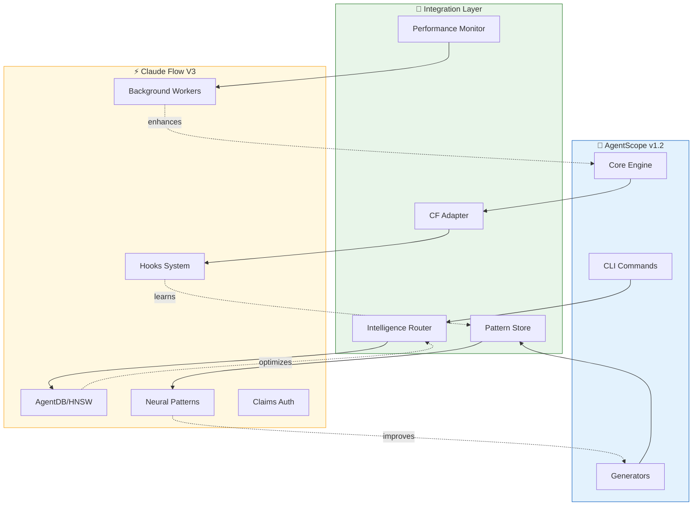
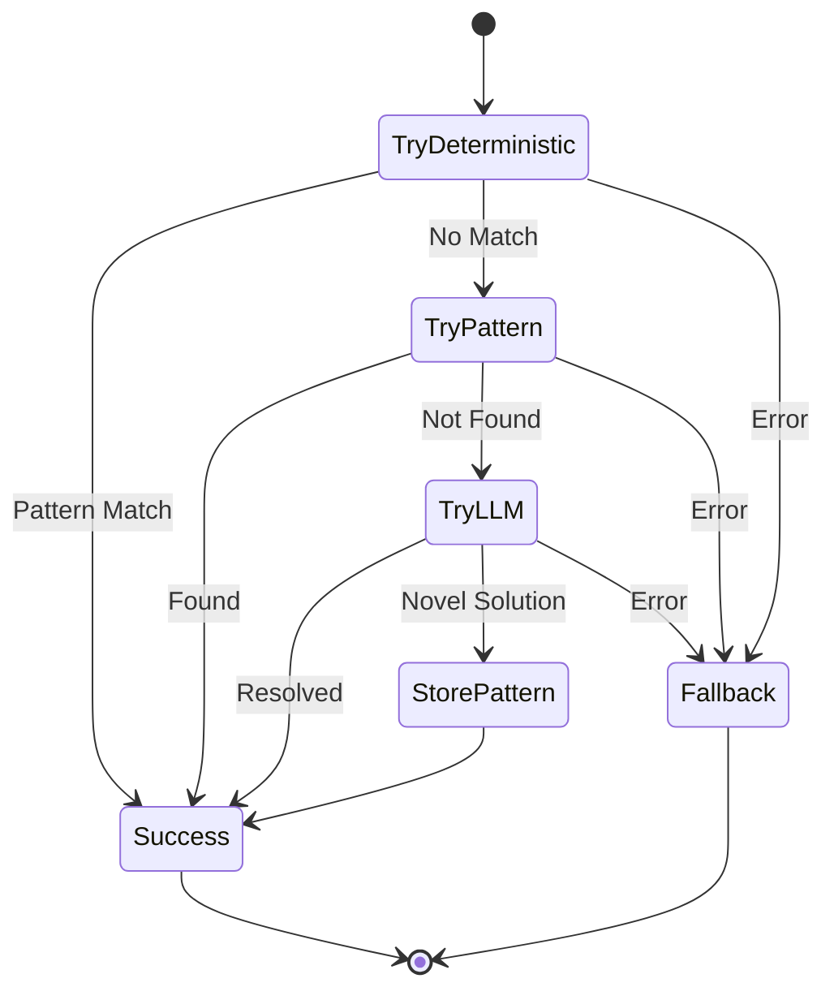
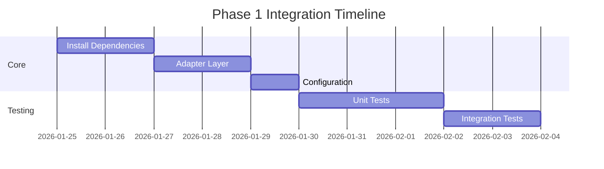
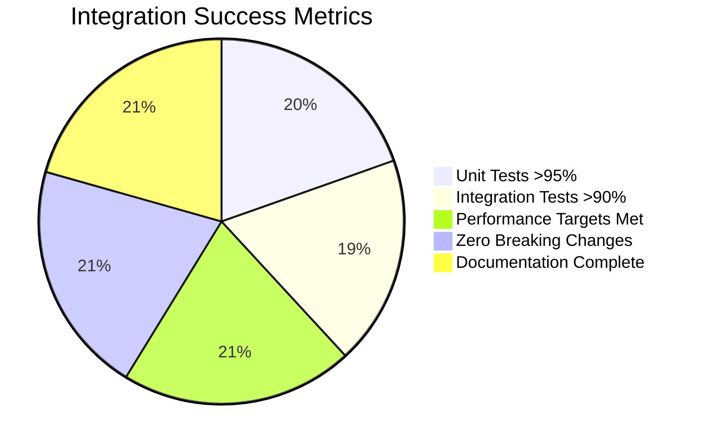
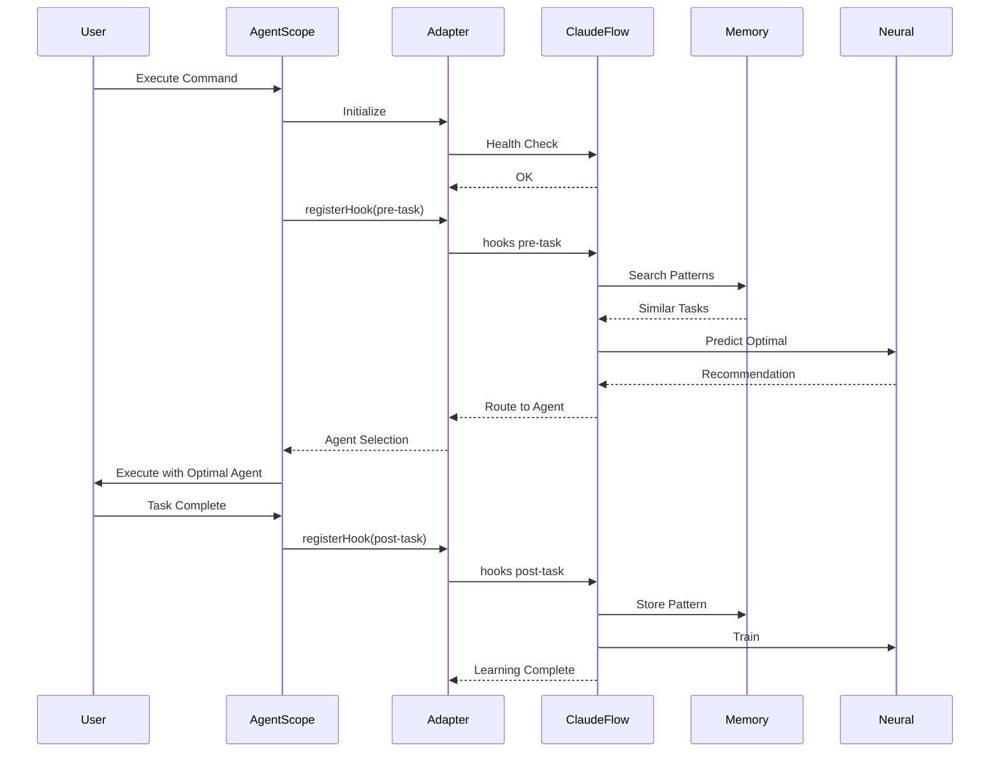

# ADR-001: Claude Flow V3 Core Integration

**Status:** Proposed
**Date:** 2026-01-25
**Decision Makers:** System Architecture Team
**Related:** ADR-002 (Hooks), ADR-003 (Memory), ADR-004 (Neural), ADR-005 (Performance), ADR-006 (Workers)

---

## Context

AgentScope v1.2 currently provides agent architecture documentation and visualization. To enhance its capabilities with self-learning, intelligent routing, and continuous improvement, we need to integrate claude-flow v3's advanced features including hooks system, AgentDB/HNSW memory, neural pattern training, and background workers.

### Current State



**Capabilities:**
- Agent architecture scanning
- Mermaid diagram generation
- Markdown documentation
- Theme support (colorblind-safe)
- Export/import functionality

**Limitations:**
- No self-learning from past operations
- No intelligent agent routing
- No pattern storage/retrieval
- No continuous optimization
- No multi-agent coordination memory

---

## Decision

Integrate claude-flow v3 as a **peer dependency** with the following architecture:



### Integration Strategy

| Component | Integration Type | Coupling | Data Flow |
|-----------|------------------|----------|-----------|
| **Hooks System** | Event-driven | Loose | Bidirectional |
| **Memory (AgentDB)** | Service | Loose | Read/Write |
| **Neural Patterns** | Service | Medium | Training/Inference |
| **Background Workers** | Async | Loose | Event-based |
| **Claims Auth** | Service | Loose | Query |

---

## Architecture Principles

### 1. Deterministic First

```typescript
// ALWAYS prefer deterministic solutions
if (canUseDeterministicApproach(task)) {
  return deterministicSolution(task);
} else if (hasLearnedPattern(task)) {
  return patternMatchedSolution(task);
} else {
  return llmAssistedSolution(task);
}
```

**Decision Hierarchy:**
1. **Deterministic** (regex, rules, templates) - 0ms, $0
2. **Pattern lookup** (memory search) - <10ms, $0
3. **LLM-assisted** (semantic reasoning) - 500-5000ms, $0.0002-$0.015

### 2. Atomic Operations

Every integration point must be atomic:
- Single responsibility
- Clear success/failure criteria
- Rollback capability
- Independent verification

### 3. Fail-Safe Design



---

## Integration Points

### Phase 1: Foundation (Week 1-2)



**Deliverables:**
1. `@claude-flow/cli` peer dependency
2. `ClaudeFlowAdapter` class
3. Configuration schema
4. Basic health checks

### Phase 2: Hooks Integration (Week 3)

See [ADR-002: Self-Learning Hooks Integration](./ADR-002-hooks-integration.md)

### Phase 3: Memory Integration (Week 4)

See [ADR-003: AgentDB Memory Integration](./ADR-003-memory-integration.md)

### Phase 4: Neural Patterns (Week 5)

See [ADR-004: Neural Pattern Training](./ADR-004-neural-patterns.md)

### Phase 5: Performance (Week 6)

See [ADR-005: Performance Optimization](./ADR-005-performance-optimization.md)

### Phase 6: Workers (Week 7)

See [ADR-006: Background Workers](./ADR-006-background-workers.md)

---

## Technical Design

### Dependency Management

```json
{
  "peerDependencies": {
    "@claude-flow/cli": "^3.0.0-alpha.12"
  },
  "optionalDependencies": {
    "@claude-flow/security": "^1.0.0",
    "@claude-flow/embeddings": "^3.0.0-alpha.12"
  }
}
```

**Rationale:**
- **Peer dependency**: Users control claude-flow version
- **Optional**: Graceful degradation if not installed
- **Version pinning**: Alpha stability requires careful pinning

### Adapter Interface

```typescript
// src/integrations/claude-flow/adapter.ts
export interface ClaudeFlowAdapter {
  // Hooks
  registerHook(hook: HookType, handler: HookHandler): Promise<void>;
  unregisterHook(hook: HookType): Promise<void>;

  // Memory
  storePattern(key: string, value: any, namespace?: string): Promise<void>;
  searchPatterns(query: string, options?: SearchOptions): Promise<Pattern[]>;

  // Neural
  trainPattern(data: TrainingData): Promise<TrainingResult>;
  predictOptimal(task: Task): Promise<Prediction>;

  // Workers
  dispatchWorker(trigger: WorkerTrigger, context?: any): Promise<WorkerId>;
  getWorkerStatus(id: WorkerId): Promise<WorkerStatus>;

  // Health
  checkHealth(): Promise<HealthStatus>;
}
```

### Configuration Schema

```typescript
// src/integrations/claude-flow/config.ts
export interface ClaudeFlowConfig {
  enabled: boolean;
  features: {
    hooks: boolean;
    memory: boolean;
    neural: boolean;
    workers: boolean;
    claims: boolean;
  };
  memory: {
    backend: 'hybrid' | 'agentdb' | 'sqlite';
    enableHNSW: boolean;
    cacheSize: number;
  };
  neural: {
    modelType: 'moe' | 'transformer' | 'embedding';
    epochs: number;
    learningRate: number;
  };
  workers: {
    enabled: WorkerTrigger[];
    autoDispatch: boolean;
    priority: 'low' | 'normal' | 'high' | 'critical';
  };
}
```

---

## Quality Metrics

### Performance Targets

| Metric | Target | Measurement |
|--------|--------|-------------|
| **Adapter Init** | <100ms | Time to initialize |
| **Hook Registration** | <50ms | Per hook |
| **Memory Search** | <10ms | With HNSW |
| **Pattern Retrieval** | <5ms | Cache hit |
| **Worker Dispatch** | <200ms | Async spawn |
| **Health Check** | <500ms | Full system |

### Success Criteria



**Requirements:**
- ✓ All tests pass
- ✓ Performance targets met
- ✓ Zero breaking changes to existing API
- ✓ Backward compatibility maintained
- ✓ Comprehensive documentation
- ✓ Graceful degradation if claude-flow unavailable

---

## Consequences

### Positive

✅ **Self-Learning:** AgentScope learns from every operation
✅ **Intelligent Routing:** Optimal agent selection based on patterns
✅ **Continuous Improvement:** Background workers optimize over time
✅ **Pattern Reuse:** Learned solutions applied to similar problems
✅ **Performance Gains:** 150x-12,500x faster pattern search with HNSW
✅ **Cost Reduction:** 75% fewer LLM calls via pattern matching

### Negative

⚠️ **Dependency:** Requires claude-flow v3 installation
⚠️ **Complexity:** Additional configuration and setup
⚠️ **Learning Curve:** Developers must understand hooks/memory/neural concepts
⚠️ **Alpha Stability:** v3 is alpha, may have breaking changes

### Mitigation Strategies

| Risk | Mitigation |
|------|------------|
| Claude-flow unavailable | Graceful fallback to v1.2 core features |
| Breaking changes | Pin to specific alpha version, test upgrades |
| Configuration complexity | Sensible defaults, wizard-based setup |
| Learning curve | Comprehensive docs, examples, tutorials |

---

## Alternatives Considered

### 1. Build Custom Learning System

**Pros:** Full control, no external dependencies
**Cons:** 6-12 months development, reinventing wheel, missing HNSW/neural features

**Decision:** ❌ Rejected - claude-flow v3 provides battle-tested solution

### 2. Minimal Integration (Hooks Only)

**Pros:** Simple, low risk
**Cons:** Misses 80% of value (memory, neural, workers)

**Decision:** ❌ Rejected - doesn't meet self-learning goals

### 3. Full Integration (All Features)

**Pros:** Maximum capability, future-proof
**Cons:** Higher complexity, longer timeline

**Decision:** ✅ **SELECTED** - Phased rollout manages complexity

### 4. Fork claude-flow

**Pros:** Custom modifications possible
**Cons:** Maintenance burden, divergence from upstream

**Decision:** ❌ Rejected - peer dependency maintains upstream sync

---

## Implementation Plan

### Week 1-2: Foundation

```bash
# Install dependencies
npm install --save-peer @claude-flow/cli@3.0.0-alpha.12
npm install --save-optional @claude-flow/security@1.0.0
npm install --save-optional @claude-flow/embeddings@3.0.0-alpha.12

# Create adapter structure
mkdir -p src/integrations/claude-flow/{hooks,memory,neural,workers,claims}

# Initialize configuration
npx @claude-flow/cli init --wizard
```

**Tasks:**
1. Create `ClaudeFlowAdapter` interface
2. Implement configuration schema validation
3. Add health check system
4. Write unit tests for adapter
5. Document integration API

### Week 3-7: Feature Integration

See individual ADRs for detailed implementation:
- Week 3: [ADR-002: Hooks](./ADR-002-hooks-integration.md)
- Week 4: [ADR-003: Memory](./ADR-003-memory-integration.md)
- Week 5: [ADR-004: Neural](./ADR-004-neural-patterns.md)
- Week 6: [ADR-005: Performance](./ADR-005-performance-optimization.md)
- Week 7: [ADR-006: Workers](./ADR-006-background-workers.md)

---

## References

- [Claude Flow V3 Documentation](https://github.com/ruvnet/claude-flow)
- [AgentDB HNSW Performance](https://github.com/ruvnet/agentdb)
- [CLAUDE.md Configuration](../../CLAUDE.md)
- [AgentScope v1.2 Architecture](../architecture/README.md)

---

## Appendix: Integration Architecture

### Directory Structure

```
src/integrations/claude-flow/
├── adapter.ts              # Main adapter implementation
├── config.ts               # Configuration schema
├── types.ts                # TypeScript interfaces
├── hooks/
│   ├── pre-edit.ts
│   ├── post-edit.ts
│   ├── pre-task.ts
│   ├── post-task.ts
│   └── route.ts
├── memory/
│   ├── store.ts
│   ├── search.ts
│   └── patterns.ts
├── neural/
│   ├── trainer.ts
│   ├── predictor.ts
│   └── optimizer.ts
├── workers/
│   ├── dispatcher.ts
│   ├── monitor.ts
│   └── triggers.ts
├── claims/
│   └── authorizer.ts
└── __tests__/
    ├── adapter.test.ts
    ├── hooks.test.ts
    ├── memory.test.ts
    └── integration.test.ts
```

### Data Flow Architecture



---

**Decision:** Approved for implementation
**Next Steps:** Proceed to ADR-002 for hooks integration details
