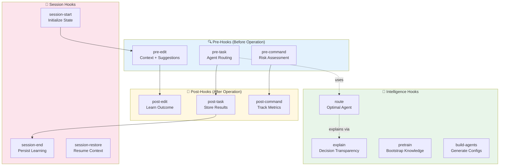
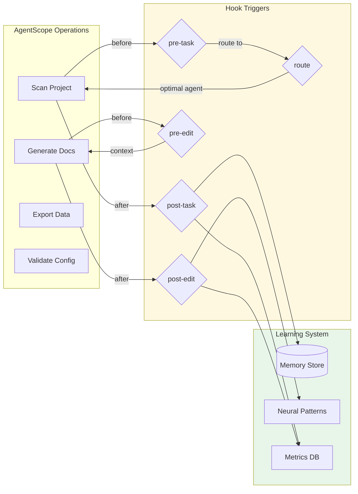
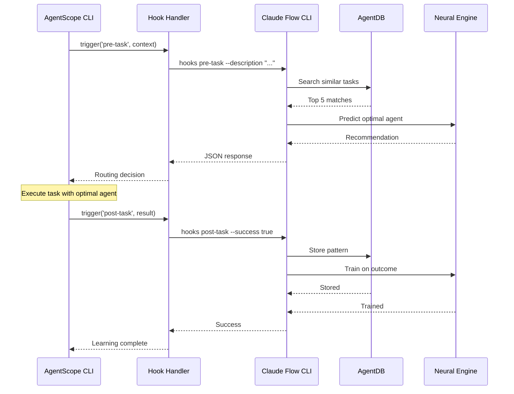
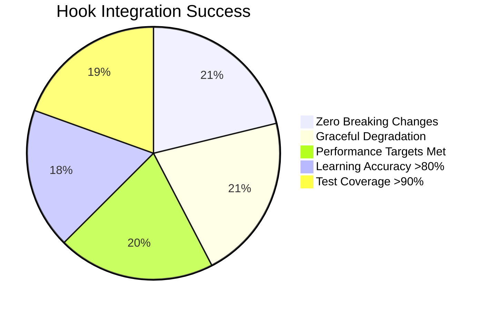

# ADR-002: Self-Learning Hooks Integration

**Status:** Proposed
**Date:** 2026-01-25
**Decision Makers:** System Architecture Team
**Related:** ADR-001 (Core Integration), ADR-003 (Memory)

---

## Context

AgentScope needs to learn from every operation to improve over time. Claude-flow v3's hooks system provides 27 hooks + 12 background workers for intelligent event-driven learning. We need to integrate these hooks to enable:

1. **Pre-operation intelligence** (routing, context, risk assessment)
2. **Post-operation learning** (pattern storage, metric collection)
3. **Continuous improvement** (background optimization)

### Hooks System Overview



---

## Decision

Implement **event-driven hooks integration** with the following architecture:

### Hook Registration System

```typescript
// src/integrations/claude-flow/hooks/registry.ts
export class HookRegistry {
  private hooks: Map<HookType, HookHandler[]> = new Map();

  async register(hook: HookType, handler: HookHandler): Promise<void> {
    if (!this.hooks.has(hook)) {
      this.hooks.set(hook, []);
    }
    this.hooks.get(hook)!.push(handler);
  }

  async trigger(hook: HookType, context: HookContext): Promise<HookResult> {
    const handlers = this.hooks.get(hook) || [];
    const results = await Promise.all(
      handlers.map(h => h.execute(context))
    );
    return this.aggregateResults(results);
  }
}
```

### Integration Points



---

## Priority Hooks for AgentScope

### Tier 1: Essential (Week 3)

| Hook | Trigger Point | Purpose | Output |
|------|---------------|---------|--------|
| **pre-task** | Before scan/generate | Get optimal agent routing | Agent type, model, context |
| **post-task** | After scan/generate | Store success patterns | Learning data |
| **route** | Agent selection | Find best agent for task | Agent recommendation |
| **session-start** | CLI invocation | Restore previous context | Session state |
| **session-end** | CLI exit | Persist learning | Saved state |

### Tier 2: Important (Week 4)

| Hook | Trigger Point | Purpose | Output |
|------|---------------|---------|--------|
| **pre-edit** | Before file write | Get context + suggestions | File analysis |
| **post-edit** | After file write | Train on outcomes | Pattern data |
| **metrics** | On-demand | View learning progress | Dashboard |
| **pretrain** | First run | Bootstrap intelligence | Trained models |

### Tier 3: Advanced (Week 5)

| Hook | Trigger Point | Purpose | Output |
|------|---------------|---------|--------|
| **worker** | Background | Continuous optimization | Worker status |
| **intelligence** | Pattern queries | SONA/MoE/HNSW | Intelligence status |
| **explain** | Debugging | Transparency | Decision reasoning |

---

## Implementation Design

### 1. Pre-Task Hook Integration

**Use Case:** Before scanning a project, get optimal agent routing

```typescript
// src/integrations/claude-flow/hooks/pre-task.ts
export class PreTaskHook implements HookHandler {
  async execute(context: PreTaskContext): Promise<PreTaskResult> {
    // 1. Call claude-flow CLI
    const result = await execAsync(
      `npx @claude-flow/cli hooks pre-task \\
        --description "${context.description}" \\
        --file "${context.filePath}" \\
        --coordinate-swarm true`
    );

    // 2. Parse response
    const parsed = this.parseOutput(result.stdout);

    // 3. Return routing recommendation
    return {
      agent: parsed.recommendedAgent,
      model: parsed.modelRecommendation, // haiku/sonnet/opus
      context: parsed.additionalContext,
      swarmRequired: parsed.shouldCoordinateSwarm,
      estimatedComplexity: parsed.complexity
    };
  }

  private parseOutput(output: string): ParsedPreTask {
    // Parse CLI output (JSON or structured text)
    if (output.includes('[TASK_MODEL_RECOMMENDATION]')) {
      return this.parseRecommendation(output);
    }
    return this.parseDefault(output);
  }
}
```

**Integration:**

```typescript
// src/cli/commands/scan.ts
import { PreTaskHook } from '../../integrations/claude-flow/hooks/pre-task';

export async function scanCommand(options: ScanOptions): Promise<void> {
  const hooks = new HookRegistry();
  const preTask = new PreTaskHook();

  // Register hook
  await hooks.register('pre-task', preTask);

  // Trigger before scan
  const routing = await hooks.trigger('pre-task', {
    description: 'Scan agent architecture',
    filePath: options.path,
    operation: 'scan'
  });

  // Use routing recommendation
  const agent = routing.agent || 'default-scanner';
  const model = routing.model || 'sonnet';

  console.log(`🎯 Routing to: ${agent} (${model})`);

  // Execute scan with optimal agent
  await executeWithAgent(agent, model, options);
}
```

### 2. Post-Task Hook Integration

**Use Case:** After completing a task, store the pattern for future learning

```typescript
// src/integrations/claude-flow/hooks/post-task.ts
export class PostTaskHook implements HookHandler {
  async execute(context: PostTaskContext): Promise<PostTaskResult> {
    // 1. Call claude-flow CLI to store results
    const result = await execAsync(
      `npx @claude-flow/cli hooks post-task \\
        --task-id "${context.taskId}" \\
        --success ${context.success} \\
        --quality ${context.quality} \\
        --store-results true \\
        --train-neural true`
    );

    // 2. Store metrics
    await this.storeMetrics({
      taskId: context.taskId,
      agent: context.agent,
      duration: context.duration,
      success: context.success,
      quality: context.quality
    });

    return {
      stored: true,
      patternId: this.extractPatternId(result.stdout)
    };
  }
}
```

**Integration:**

```typescript
// src/cli/commands/scan.ts (continued)
export async function scanCommand(options: ScanOptions): Promise<void> {
  const startTime = Date.now();
  const taskId = `scan-${Date.now()}`;

  try {
    // Execute scan
    const result = await executeWithAgent(agent, model, options);

    // Trigger post-task hook
    await hooks.trigger('post-task', {
      taskId,
      success: true,
      quality: result.quality,
      agent,
      duration: Date.now() - startTime
    });

    console.log(`✅ Scan complete. Pattern stored for future learning.`);
  } catch (error) {
    // Store failure for learning too
    await hooks.trigger('post-task', {
      taskId,
      success: false,
      quality: 0,
      agent,
      duration: Date.now() - startTime,
      error: error.message
    });
    throw error;
  }
}
```

### 3. Route Hook Integration

**Use Case:** Intelligent agent selection based on task description

```typescript
// src/integrations/claude-flow/hooks/route.ts
export class RouteHook implements HookHandler {
  async execute(context: RouteContext): Promise<RouteResult> {
    // 1. Search for similar past tasks
    const result = await execAsync(
      `npx @claude-flow/cli hooks route \\
        --task "${context.task}" \\
        --context "${context.context}" \\
        --top-k 5`
    );

    // 2. Parse routing decision
    const parsed = this.parseRouting(result.stdout);

    return {
      agent: parsed.recommendedAgent,
      confidence: parsed.confidence,
      reasoning: parsed.reasoning,
      alternatives: parsed.alternatives,
      similarTasks: parsed.similarTasks
    };
  }
}
```

**Integration:**

```typescript
// src/core/agent-router.ts
export class AgentRouter {
  private routeHook: RouteHook;

  async selectAgent(task: string, context?: any): Promise<AgentSelection> {
    // Try intelligent routing first
    try {
      const routing = await this.routeHook.execute({ task, context });

      if (routing.confidence > 0.7) {
        console.log(`🎯 Intelligent routing: ${routing.agent} (confidence: ${routing.confidence})`);
        console.log(`   Reasoning: ${routing.reasoning}`);
        return routing;
      }
    } catch (error) {
      console.warn('⚠️  Intelligent routing unavailable, using default logic');
    }

    // Fallback to deterministic routing
    return this.defaultRouting(task);
  }
}
```

### 4. Session Hooks Integration

**Use Case:** Restore context across CLI invocations

```typescript
// src/integrations/claude-flow/hooks/session.ts
export class SessionManager {
  async start(sessionId?: string): Promise<SessionState> {
    const result = await execAsync(
      `npx @claude-flow/cli hooks session-start \\
        --session-id "${sessionId || 'agentscope-' + Date.now()}" \\
        --auto-configure true`
    );

    return this.parseSessionState(result.stdout);
  }

  async end(exportMetrics: boolean = true): Promise<void> {
    await execAsync(
      `npx @claude-flow/cli hooks session-end \\
        --generate-summary true \\
        --export-metrics ${exportMetrics} \\
        --persist-state true`
    );
  }

  async restore(sessionId: string): Promise<SessionState> {
    const result = await execAsync(
      `npx @claude-flow/cli hooks session-restore \\
        --session-id "${sessionId}"`
    );

    return this.parseSessionState(result.stdout);
  }
}
```

**Integration:**

```typescript
// src/cli/index.ts
import { SessionManager } from '../integrations/claude-flow/hooks/session';

export async function main(): Promise<void> {
  const session = new SessionManager();

  // Start session
  const state = await session.start();
  console.log(`📦 Session restored: ${state.previousTasks} previous tasks`);

  try {
    // Execute command
    await program.parseAsync(process.argv);
  } finally {
    // End session and persist learning
    await session.end(true);
    console.log(`💾 Session saved. Learning persisted.`);
  }
}
```

---

## Hook Data Flow



---

## Configuration

### Hook Configuration Schema

```typescript
// src/integrations/claude-flow/config.ts
export interface HooksConfig {
  enabled: boolean;
  hooks: {
    'pre-task': {
      enabled: boolean;
      coordinateSwarm: boolean;
    };
    'post-task': {
      enabled: boolean;
      storeResults: boolean;
      trainNeural: boolean;
    };
    'route': {
      enabled: boolean;
      confidenceThreshold: number;
      topK: number;
    };
    'session-start': {
      enabled: boolean;
      autoConfigure: boolean;
    };
    'session-end': {
      enabled: boolean;
      exportMetrics: boolean;
      persistState: boolean;
    };
  };
  fallback: {
    onError: 'default' | 'fail' | 'warn';
    timeout: number; // ms
  };
}
```

### Configuration File

```json
// .agentscope/claude-flow.json
{
  "hooks": {
    "enabled": true,
    "hooks": {
      "pre-task": {
        "enabled": true,
        "coordinateSwarm": false
      },
      "post-task": {
        "enabled": true,
        "storeResults": true,
        "trainNeural": true
      },
      "route": {
        "enabled": true,
        "confidenceThreshold": 0.7,
        "topK": 5
      },
      "session-start": {
        "enabled": true,
        "autoConfigure": true
      },
      "session-end": {
        "enabled": true,
        "exportMetrics": true,
        "persistState": true
      }
    },
    "fallback": {
      "onError": "warn",
      "timeout": 5000
    }
  }
}
```

---

## Quality Metrics

### Performance Targets

| Hook | Target Latency | Timeout | Fallback |
|------|----------------|---------|----------|
| pre-task | <200ms | 5s | Default routing |
| post-task | <500ms | 10s | Log only |
| route | <100ms | 3s | Default agent |
| session-start | <1s | 10s | Empty state |
| session-end | <2s | 15s | Silent fail |

### Success Criteria



---

## Testing Strategy

### Unit Tests

```typescript
// src/integrations/claude-flow/hooks/__tests__/pre-task.test.ts
describe('PreTaskHook', () => {
  it('should parse model recommendation', async () => {
    const hook = new PreTaskHook();
    const result = await hook.execute({
      description: 'Scan agent architecture',
      filePath: '/path/to/project'
    });

    expect(result.model).toMatch(/haiku|sonnet|opus/);
    expect(result.agent).toBeDefined();
  });

  it('should handle CLI timeout gracefully', async () => {
    const hook = new PreTaskHook({ timeout: 100 });

    await expect(hook.execute({
      description: 'Long running task'
    })).rejects.toThrow('Timeout');
  });

  it('should fallback on CLI error', async () => {
    // Mock CLI failure
    jest.spyOn(child_process, 'exec').mockRejectedValue(new Error('CLI not found'));

    const hook = new PreTaskHook({ onError: 'default' });
    const result = await hook.execute({
      description: 'Test task'
    });

    expect(result.agent).toBe('default-agent');
  });
});
```

### Integration Tests

```typescript
// src/integrations/claude-flow/hooks/__tests__/integration.test.ts
describe('Hooks Integration', () => {
  it('should complete full learning cycle', async () => {
    const registry = new HookRegistry();
    const taskId = 'test-scan-001';

    // 1. Pre-task
    const preResult = await registry.trigger('pre-task', {
      description: 'Scan test project',
      taskId
    });

    // 2. Execute (mocked)
    const scanResult = await mockScan(preResult.agent);

    // 3. Post-task
    const postResult = await registry.trigger('post-task', {
      taskId,
      success: true,
      quality: 0.95
    });

    expect(postResult.stored).toBe(true);
    expect(postResult.patternId).toBeDefined();
  });
});
```

---

## Rollout Plan

### Week 3: Core Hooks

**Day 1-2:**
- ✓ Implement `HookRegistry`
- ✓ Create `PreTaskHook`
- ✓ Create `PostTaskHook`
- ✓ Write unit tests

**Day 3-4:**
- ✓ Integrate into `scan` command
- ✓ Integrate into `generate` command
- ✓ Add configuration schema
- ✓ Write integration tests

**Day 5:**
- ✓ Documentation
- ✓ Example configurations
- ✓ Performance testing

### Week 4: Advanced Hooks

**Day 1-2:**
- ✓ Implement `RouteHook`
- ✓ Implement `SessionManager`
- ✓ Add session persistence

**Day 3-4:**
- ✓ Integrate session hooks into CLI
- ✓ Add metrics dashboard
- ✓ Implement pretrain hook

**Day 5:**
- ✓ End-to-end testing
- ✓ Performance optimization
- ✓ Documentation updates

---

## Consequences

### Positive

✅ **Self-Learning:** AgentScope improves with every use
✅ **Intelligent Routing:** Optimal agent selection based on history
✅ **Context Persistence:** Sessions restore previous learning
✅ **Transparency:** Explain hook shows decision reasoning
✅ **Zero User Effort:** Learning happens automatically

### Negative

⚠️ **CLI Dependency:** Requires claude-flow CLI installed
⚠️ **Latency:** Hooks add 100-500ms per operation
⚠️ **Complexity:** More moving parts to maintain

### Mitigation

| Risk | Mitigation |
|------|------------|
| CLI unavailable | Graceful fallback to default logic |
| Hook timeout | Configurable timeout + fallback |
| Performance impact | Async execution, caching |
| Learning errors | Continue execution, log issues |

---

## References

- [Claude Flow Hooks Documentation](https://github.com/ruvnet/claude-flow#hooks)
- [ADR-001: Core Integration](./ADR-001-claude-flow-v3-integration.md)
- [ADR-003: Memory Integration](./ADR-003-memory-integration.md)

---

**Decision:** Approved for Week 3-4 implementation
**Next Steps:** Begin HookRegistry implementation, create unit tests
