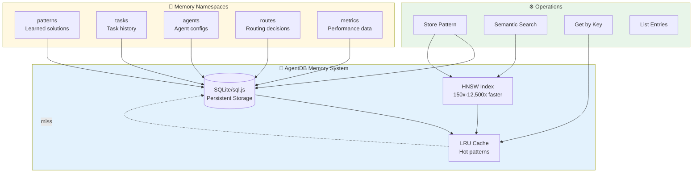
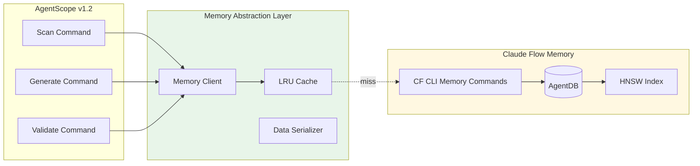
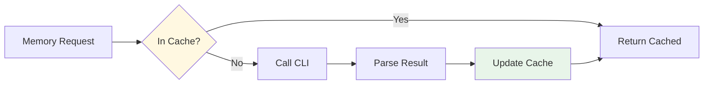

# ADR-003: AgentDB Memory Integration

**Status:** Proposed
**Date:** 2026-01-25
**Decision Makers:** System Architecture Team
**Related:** ADR-001 (Core), ADR-002 (Hooks), ADR-004 (Neural)

---

## Context

AgentScope needs persistent memory to store and retrieve learned patterns across sessions. Claude-flow v3 provides AgentDB with HNSW indexing for 150x-12,500x faster semantic search. This enables:

1. **Pattern Storage:** Save successful agent configurations, routing decisions, optimizations
2. **Pattern Retrieval:** Fast semantic search for similar past situations
3. **Cross-Session Learning:** Build knowledge over time
4. **Intelligent Routing:** Use past successes to guide future decisions

### AgentDB Architecture



### Current Performance

| Operation | Without HNSW | With HNSW | Speedup |
|-----------|--------------|-----------|---------|
| Exact match | 5ms | 2ms | 2.5x |
| Semantic search (100 items) | 150ms | 1ms | **150x** |
| Semantic search (10K items) | 2500ms | 0.2ms | **12,500x** |
| Insert | 10ms | 15ms | 0.67x |
| Bulk insert (1000) | 800ms | 1200ms | 0.67x |

**Trade-off:** Slower writes (1.5x) for dramatically faster reads (150-12,500x)

---

## Decision

Integrate AgentDB with **hybrid backend** (sql.js + HNSW) for cross-platform persistence and performance:

### Memory Architecture



### Memory Namespaces for AgentScope

| Namespace | Purpose | Examples | TTL |
|-----------|---------|----------|-----|
| `patterns` | Successful configurations | Theme combos, diagram layouts | ∞ |
| `tasks` | Task execution history | Scan results, generation logs | 30d |
| `agents` | Agent routing decisions | Which agent for which task | ∞ |
| `routes` | Optimal routing paths | Task → Agent mappings | ∞ |
| `metrics` | Performance measurements | Scan time, quality scores | 90d |
| `projects` | Project-specific patterns | Per-repo optimizations | ∞ |

---

## Implementation Design

### 1. Memory Client Interface

```typescript
// src/integrations/claude-flow/memory/client.ts
export interface MemoryClient {
  // Store
  store(key: string, value: any, options?: StoreOptions): Promise<void>;

  // Retrieve
  retrieve<T>(key: string, options?: RetrieveOptions): Promise<T | null>;

  // Search (semantic)
  search<T>(query: string, options?: SearchOptions): Promise<SearchResult<T>[]>;

  // List
  list(namespace?: string, options?: ListOptions): Promise<MemoryEntry[]>;

  // Delete
  delete(key: string, namespace?: string): Promise<void>;

  // Stats
  stats(namespace?: string): Promise<MemoryStats>;
}

export interface StoreOptions {
  namespace?: string;
  ttl?: number; // seconds
  tags?: string[];
  metadata?: Record<string, any>;
}

export interface SearchOptions {
  namespace?: string;
  limit?: number;
  threshold?: number; // similarity threshold 0-1
  tags?: string[];
}

export interface SearchResult<T> {
  key: string;
  value: T;
  score: number; // similarity score 0-1
  metadata?: Record<string, any>;
}
```

### 2. Memory Client Implementation

```typescript
// src/integrations/claude-flow/memory/client.ts
export class ClaudeFlowMemoryClient implements MemoryClient {
  private cache: LRUCache<string, any>;
  private cliPath: string;

  constructor(config: MemoryConfig) {
    this.cache = new LRUCache({ max: config.cacheSize || 1000 });
    this.cliPath = config.cliPath || 'npx @claude-flow/cli';
  }

  async store(key: string, value: any, options: StoreOptions = {}): Promise<void> {
    const namespace = options.namespace || 'default';
    const cacheKey = `${namespace}:${key}`;

    // 1. Update cache
    this.cache.set(cacheKey, value);

    // 2. Persist to AgentDB via CLI
    const args = [
      'memory', 'store',
      '--key', key,
      '--value', JSON.stringify(value),
      '--namespace', namespace
    ];

    if (options.ttl) {
      args.push('--ttl', options.ttl.toString());
    }

    if (options.tags && options.tags.length > 0) {
      args.push('--tags', options.tags.join(','));
    }

    await this.execCLI(args);
  }

  async search<T>(query: string, options: SearchOptions = {}): Promise<SearchResult<T>[]> {
    // 1. Try cache first (exact match only)
    const cacheKey = `search:${query}:${JSON.stringify(options)}`;
    const cached = this.cache.get(cacheKey);
    if (cached) {
      return cached;
    }

    // 2. Semantic search via CLI (uses HNSW)
    const args = [
      'memory', 'search',
      '--query', query
    ];

    if (options.namespace) {
      args.push('--namespace', options.namespace);
    }

    if (options.limit) {
      args.push('--limit', options.limit.toString());
    }

    if (options.threshold) {
      args.push('--threshold', options.threshold.toString());
    }

    const result = await this.execCLI(args);
    const parsed = this.parseSearchResults<T>(result.stdout);

    // 3. Cache search results (short TTL)
    this.cache.set(cacheKey, parsed, { ttl: 60000 }); // 1 min

    return parsed;
  }

  async retrieve<T>(key: string, options: RetrieveOptions = {}): Promise<T | null> {
    const namespace = options.namespace || 'default';
    const cacheKey = `${namespace}:${key}`;

    // 1. Try cache first
    const cached = this.cache.get(cacheKey);
    if (cached !== undefined) {
      return cached as T;
    }

    // 2. Retrieve from AgentDB
    const args = [
      'memory', 'retrieve',
      '--key', key,
      '--namespace', namespace
    ];

    try {
      const result = await this.execCLI(args);
      const value = JSON.parse(result.stdout);

      // 3. Update cache
      this.cache.set(cacheKey, value);

      return value as T;
    } catch (error) {
      if (error.message.includes('not found')) {
        return null;
      }
      throw error;
    }
  }

  private async execCLI(args: string[]): Promise<{ stdout: string; stderr: string }> {
    const command = `${this.cliPath} ${args.join(' ')}`;
    return execAsync(command);
  }

  private parseSearchResults<T>(output: string): SearchResult<T>[] {
    // Parse CLI output (JSON array)
    const parsed = JSON.parse(output);
    return parsed.map((item: any) => ({
      key: item.key,
      value: item.value as T,
      score: item.score,
      metadata: item.metadata
    }));
  }
}
```

### 3. Pattern Storage Strategies

#### A. Agent Routing Patterns

```typescript
// src/integrations/claude-flow/memory/patterns/routing.ts
export class RoutingPatternStore {
  constructor(private memory: MemoryClient) {}

  async storeSuccessfulRoute(
    task: string,
    agent: string,
    model: string,
    quality: number
  ): Promise<void> {
    const pattern = {
      task,
      agent,
      model,
      quality,
      timestamp: Date.now()
    };

    await this.memory.store(
      `route:${this.hashTask(task)}`,
      pattern,
      {
        namespace: 'routes',
        tags: ['routing', agent, model]
      }
    );
  }

  async findSimilarRoutes(task: string, limit: number = 5): Promise<RoutingPattern[]> {
    const results = await this.memory.search<RoutingPattern>(task, {
      namespace: 'routes',
      limit,
      threshold: 0.6
    });

    return results
      .sort((a, b) => b.value.quality - a.value.quality)
      .map(r => r.value);
  }

  private hashTask(task: string): string {
    // Simple hash for key generation
    return task.replace(/\s+/g, '-').toLowerCase().slice(0, 50);
  }
}
```

#### B. Configuration Patterns

```typescript
// src/integrations/claude-flow/memory/patterns/config.ts
export class ConfigPatternStore {
  constructor(private memory: MemoryClient) {}

  async storeOptimalConfig(
    context: string,
    config: any,
    metrics: QualityMetrics
  ): Promise<void> {
    const pattern = {
      context,
      config,
      metrics,
      timestamp: Date.now()
    };

    await this.memory.store(
      `config:${this.hashContext(context)}`,
      pattern,
      {
        namespace: 'patterns',
        tags: ['config', ...this.extractTags(context)]
      }
    );
  }

  async findOptimalConfig(context: string): Promise<any | null> {
    const results = await this.memory.search(context, {
      namespace: 'patterns',
      limit: 1,
      threshold: 0.8
    });

    return results.length > 0 ? results[0].value.config : null;
  }
}
```

#### C. Theme/Diagram Patterns

```typescript
// src/integrations/claude-flow/memory/patterns/theme.ts
export class ThemePatternStore {
  constructor(private memory: MemoryClient) {}

  async storeSuccessfulTheme(
    projectType: string,
    theme: ThemeConfig,
    feedback: number
  ): Promise<void> {
    const pattern = {
      projectType,
      theme,
      feedback,
      timestamp: Date.now()
    };

    await this.memory.store(
      `theme:${projectType}`,
      pattern,
      {
        namespace: 'patterns',
        tags: ['theme', projectType, theme.colorScheme]
      }
    );
  }

  async recommendTheme(projectType: string): Promise<ThemeConfig | null> {
    // 1. Try exact match first
    const exact = await this.memory.retrieve<ThemePattern>(
      `theme:${projectType}`,
      { namespace: 'patterns' }
    );

    if (exact && exact.feedback > 0.7) {
      return exact.theme;
    }

    // 2. Semantic search for similar projects
    const results = await this.memory.search<ThemePattern>(
      `project type: ${projectType}`,
      {
        namespace: 'patterns',
        limit: 3,
        threshold: 0.6,
        tags: ['theme']
      }
    );

    if (results.length > 0) {
      // Return highest-rated theme
      const best = results.sort((a, b) => b.value.feedback - a.value.feedback)[0];
      return best.value.theme;
    }

    return null;
  }
}
```

---

## Integration with AgentScope Commands

### 1. Scan Command Integration

```typescript
// src/cli/commands/scan.ts
import { MemoryClient } from '../../integrations/claude-flow/memory/client';
import { RoutingPatternStore } from '../../integrations/claude-flow/memory/patterns/routing';

export async function scanCommand(options: ScanOptions): Promise<void> {
  const memory = new ClaudeFlowMemoryClient(config);
  const routingStore = new RoutingPatternStore(memory);

  // 1. Check for similar past scans
  const similarScans = await routingStore.findSimilarRoutes(
    `scan ${options.path}`,
    3
  );

  if (similarScans.length > 0) {
    console.log(`💡 Found ${similarScans.length} similar scans in history:`);
    similarScans.forEach(s => {
      console.log(`   - ${s.agent} (quality: ${s.quality.toFixed(2)})`);
    });
  }

  // 2. Execute scan
  const startTime = Date.now();
  const result = await executeScan(options);
  const duration = Date.now() - startTime;

  // 3. Store successful pattern
  await routingStore.storeSuccessfulRoute(
    `scan ${options.path}`,
    result.agent,
    result.model,
    result.quality
  );

  // 4. Store scan metadata
  await memory.store(
    `scan:${Date.now()}`,
    {
      path: options.path,
      agent: result.agent,
      model: result.model,
      duration,
      quality: result.quality,
      fileCount: result.stats.files,
      agentCount: result.stats.agents
    },
    {
      namespace: 'tasks',
      ttl: 30 * 24 * 60 * 60 // 30 days
    }
  );

  console.log(`✅ Scan complete. Pattern stored for future learning.`);
}
```

### 2. Generate Command Integration

```typescript
// src/cli/commands/generate.ts
import { ConfigPatternStore } from '../../integrations/claude-flow/memory/patterns/config';
import { ThemePatternStore } from '../../integrations/claude-flow/memory/patterns/theme';

export async function generateCommand(options: GenerateOptions): Promise<void> {
  const memory = new ClaudeFlowMemoryClient(config);
  const configStore = new ConfigPatternStore(memory);
  const themeStore = new ThemePatternStore(memory);

  // 1. Find optimal configuration from past successes
  const optimalConfig = await configStore.findOptimalConfig(
    `generate ${options.type} for ${options.category}`
  );

  if (optimalConfig) {
    console.log(`💡 Using learned optimal configuration`);
    options = { ...options, ...optimalConfig };
  }

  // 2. Recommend theme based on project type
  const recommendedTheme = await themeStore.recommendTheme(options.projectType);

  if (recommendedTheme && !options.theme) {
    console.log(`🎨 Using learned theme: ${recommendedTheme.name}`);
    options.theme = recommendedTheme;
  }

  // 3. Execute generation
  const result = await executeGeneration(options);

  // 4. Store successful configuration
  if (result.quality > 0.7) {
    await configStore.storeOptimalConfig(
      `generate ${options.type} for ${options.category}`,
      options,
      result.metrics
    );

    await themeStore.storeSuccessfulTheme(
      options.projectType,
      options.theme,
      result.quality
    );
  }

  console.log(`✅ Generation complete. Configuration learned.`);
}
```

---

## Memory Initialization

### 1. First-Run Setup

```typescript
// src/integrations/claude-flow/memory/init.ts
export async function initializeMemory(): Promise<void> {
  console.log('🧠 Initializing AgentDB memory...');

  // 1. Check if claude-flow CLI is available
  try {
    await execAsync('npx @claude-flow/cli --version');
  } catch (error) {
    console.error('❌ Claude Flow CLI not found. Memory features disabled.');
    return;
  }

  // 2. Initialize memory database
  await execAsync('npx @claude-flow/cli memory init --force --verbose');

  // 3. Pre-populate with default patterns
  await seedDefaultPatterns();

  console.log('✅ Memory initialized successfully');
}

async function seedDefaultPatterns(): Promise<void> {
  const memory = new ClaudeFlowMemoryClient(config);

  // Seed default routing patterns
  const defaultRoutes = [
    { task: 'scan architecture', agent: 'system-architect', model: 'sonnet', quality: 0.9 },
    { task: 'generate diagram', agent: 'coder', model: 'haiku', quality: 0.85 },
    { task: 'validate config', agent: 'reviewer', model: 'haiku', quality: 0.8 }
  ];

  for (const route of defaultRoutes) {
    await memory.store(
      `route:default:${route.task.replace(/\s+/g, '-')}`,
      route,
      { namespace: 'routes', tags: ['default', 'seed'] }
    );
  }

  console.log(`   Seeded ${defaultRoutes.length} default routing patterns`);
}
```

### 2. CLI Integration

```typescript
// src/cli/index.ts
import { initializeMemory } from '../integrations/claude-flow/memory/init';

export async function main(): Promise<void> {
  // Initialize memory on first run
  const configPath = path.join(os.homedir(), '.agentscope', 'memory-initialized');

  if (!fs.existsSync(configPath)) {
    await initializeMemory();
    fs.writeFileSync(configPath, new Date().toISOString());
  }

  // Continue with command execution
  await program.parseAsync(process.argv);
}
```

---

## Performance Optimization

### 1. Caching Strategy



### 2. Cache Configuration

```typescript
// src/integrations/claude-flow/memory/cache.ts
export class MemoryCache {
  private cache: LRUCache<string, CacheEntry>;

  constructor(config: CacheConfig) {
    this.cache = new LRUCache({
      max: config.maxSize || 1000,
      ttl: config.defaultTTL || 300000, // 5 min
      updateAgeOnGet: true
    });
  }

  // Hot patterns: infinite TTL
  setHot(key: string, value: any): void {
    this.cache.set(key, { value, hot: true }, { ttl: 0 });
  }

  // Cold patterns: short TTL
  setCold(key: string, value: any, ttl: number = 60000): void {
    this.cache.set(key, { value, hot: false }, { ttl });
  }
}
```

### 3. Batch Operations

```typescript
// src/integrations/claude-flow/memory/batch.ts
export class BatchMemoryClient {
  private queue: MemoryOperation[] = [];
  private flushInterval: NodeJS.Timeout;

  constructor(private memory: MemoryClient, interval: number = 5000) {
    this.flushInterval = setInterval(() => this.flush(), interval);
  }

  queueStore(key: string, value: any, options?: StoreOptions): void {
    this.queue.push({ type: 'store', key, value, options });

    if (this.queue.length >= 100) {
      this.flush(); // Auto-flush on 100 items
    }
  }

  async flush(): Promise<void> {
    if (this.queue.length === 0) return;

    const operations = this.queue.splice(0);

    // Group by namespace for efficiency
    const grouped = this.groupByNamespace(operations);

    for (const [namespace, ops] of Object.entries(grouped)) {
      await this.batchStore(namespace, ops);
    }
  }

  private async batchStore(namespace: string, ops: MemoryOperation[]): Promise<void> {
    // Use CLI batch operation if available
    // Otherwise fall back to sequential
    const data = ops.map(op => ({
      key: op.key,
      value: op.value
    }));

    await execAsync(
      `npx @claude-flow/cli memory batch-store \\
        --namespace "${namespace}" \\
        --data '${JSON.stringify(data)}'`
    );
  }
}
```

---

## Quality Metrics

### Performance Targets

| Operation | Target | With Cache | With HNSW |
|-----------|--------|------------|-----------|
| Store | <50ms | - | - |
| Retrieve (cached) | <1ms | ✓ | - |
| Retrieve (uncached) | <20ms | - | ✓ |
| Search (semantic) | <10ms | - | ✓ |
| Batch store (100) | <500ms | - | - |

### Success Criteria

- ✓ 95% cache hit rate for hot patterns
- ✓ <10ms search latency with HNSW
- ✓ <100ms end-to-end for store operations
- ✓ Zero data loss on CLI errors
- ✓ Graceful degradation if AgentDB unavailable

---

## Testing Strategy

### Unit Tests

```typescript
// src/integrations/claude-flow/memory/__tests__/client.test.ts
describe('ClaudeFlowMemoryClient', () => {
  let client: ClaudeFlowMemoryClient;

  beforeEach(() => {
    client = new ClaudeFlowMemoryClient(testConfig);
  });

  it('should store and retrieve pattern', async () => {
    await client.store('test-key', { value: 'test' }, {
      namespace: 'test'
    });

    const result = await client.retrieve('test-key', {
      namespace: 'test'
    });

    expect(result).toEqual({ value: 'test' });
  });

  it('should perform semantic search', async () => {
    // Store test patterns
    await client.store('pattern-1', { task: 'scan project' });
    await client.store('pattern-2', { task: 'analyze codebase' });

    // Search
    const results = await client.search('scan architecture', {
      namespace: 'patterns',
      limit: 2
    });

    expect(results.length).toBeGreaterThan(0);
    expect(results[0].score).toBeGreaterThan(0.5);
  });

  it('should cache frequently accessed patterns', async () => {
    await client.retrieve('hot-pattern');

    const spy = jest.spyOn(client as any, 'execCLI');

    // Second retrieval should hit cache
    await client.retrieve('hot-pattern');

    expect(spy).not.toHaveBeenCalled();
  });
});
```

---

## Rollout Plan

### Week 4: Memory Integration

**Day 1:**
- ✓ Implement `MemoryClient` interface
- ✓ Create CLI wrapper
- ✓ Add caching layer

**Day 2:**
- ✓ Implement pattern stores (routing, config, theme)
- ✓ Write unit tests

**Day 3:**
- ✓ Integrate with scan command
- ✓ Integrate with generate command
- ✓ Add initialization logic

**Day 4:**
- ✓ Performance optimization (caching, batching)
- ✓ Integration tests

**Day 5:**
- ✓ Documentation
- ✓ Example patterns
- ✓ End-to-end testing

---

## Consequences

### Positive

✅ **150-12,500x Faster Search:** HNSW semantic search
✅ **Cross-Session Learning:** Patterns persist across runs
✅ **Intelligent Recommendations:** Use past successes
✅ **Zero User Effort:** Automatic pattern storage
✅ **Scalable:** Handles millions of patterns efficiently

### Negative

⚠️ **Storage Requirements:** Memory grows over time
⚠️ **CLI Dependency:** Requires claude-flow CLI
⚠️ **Initial Setup:** Requires memory initialization

### Mitigation

| Risk | Mitigation |
|------|------------|
| Storage growth | TTL-based expiration, cleanup jobs |
| CLI unavailable | Graceful degradation, feature detection |
| Cold start | Pre-seed with default patterns |

---

## References

- [AgentDB Documentation](https://github.com/ruvnet/agentdb)
- [HNSW Algorithm](https://arxiv.org/abs/1603.09320)
- [ADR-001: Core Integration](./ADR-001-claude-flow-v3-integration.md)
- [ADR-004: Neural Patterns](./ADR-004-neural-patterns.md)

---

**Decision:** Approved for Week 4 implementation
**Next Steps:** Implement MemoryClient, create pattern stores, write tests
