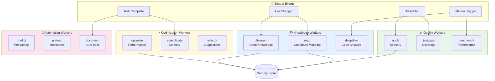
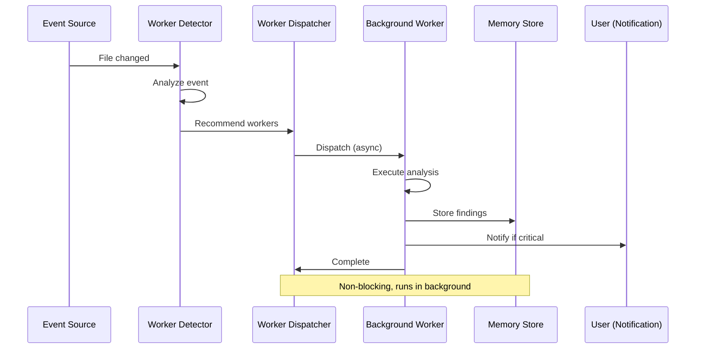

# ADR-006: Background Workers Integration

**Status:** Proposed
**Date:** 2026-01-25
**Decision Makers:** System Architecture Team
**Related:** ADR-001 (Core), ADR-002 (Hooks), ADR-003 (Memory)

---

## Context

AgentScope needs continuous improvement capabilities that run in the background without user intervention. Claude-flow v3 provides 12 specialized background workers that analyze, optimize, and enhance the system automatically.

### Background Workers Overview



### 12 Background Workers

| Worker | Priority | Trigger | Purpose | Output |
|--------|----------|---------|---------|--------|
| **ultralearn** | normal | file-change | Deep knowledge acquisition | Patterns |
| **optimize** | high | performance-issue | Performance optimization | Optimizations |
| **consolidate** | low | scheduled | Memory consolidation | Cleaned memory |
| **predict** | normal | task-start | Predictive preloading | Cache warmup |
| **audit** | critical | security-change | Security analysis | Vulnerabilities |
| **map** | normal | file-change (5+) | Codebase mapping | Architecture map |
| **preload** | low | scheduled | Resource preloading | Warmed cache |
| **deepdive** | normal | manual | Deep code analysis | Insights |
| **document** | normal | API-change | Auto-documentation | Updated docs |
| **refactor** | normal | code-smell | Refactoring suggestions | Recommendations |
| **benchmark** | normal | scheduled | Performance benchmarking | Metrics |
| **testgaps** | normal | test-change | Test coverage analysis | Gap report |

---

## Decision

Implement **event-driven background worker system** with automatic triggering:

### Worker Architecture



---

## Implementation Design

### 1. Worker Detector

```typescript
// src/integrations/claude-flow/workers/detector.ts
export class WorkerDetector {
  async detectFromEvent(event: WorkerEvent): Promise<WorkerRecommendation[]> {
    // Use claude-flow CLI to detect which workers to trigger
    const result = await execAsync(
      `npx @claude-flow/cli hooks worker-detect \\
        --prompt "${event.description}" \\
        --auto-dispatch false \\
        --min-confidence 0.7`
    );

    const detected = JSON.parse(result.stdout);

    return detected.workers.map((w: any) => ({
      trigger: w.trigger as WorkerTrigger,
      confidence: w.confidence,
      reasoning: w.reasoning,
      priority: w.priority
    }));
  }

  detectFromFileChanges(files: string[]): WorkerTrigger[] {
    const triggers: WorkerTrigger[] = [];

    // Map: 5+ file changes
    if (files.length >= 5) {
      triggers.push('map');
    }

    // Ultralearn: New patterns detected
    if (files.some(f => f.includes('src/'))) {
      triggers.push('ultralearn');
    }

    // Audit: Security-related files
    if (files.some(f => f.includes('security') || f.includes('auth'))) {
      triggers.push('audit');
    }

    // Document: API changes
    if (files.some(f => f.includes('api') || f.includes('interface'))) {
      triggers.push('document');
    }

    // Testgaps: Test files changed
    if (files.some(f => f.includes('.test.') || f.includes('.spec.'))) {
      triggers.push('testgaps');
    }

    return triggers;
  }
}
```

### 2. Worker Dispatcher

```typescript
// src/integrations/claude-flow/workers/dispatcher.ts
export class WorkerDispatcher {
  private activeWorkers: Map<string, WorkerStatus> = new Map();

  async dispatch(
    trigger: WorkerTrigger,
    context?: any,
    options: DispatchOptions = {}
  ): Promise<string> {
    // Dispatch worker via CLI (runs in background)
    const result = await execAsync(
      `npx @claude-flow/cli hooks worker-dispatch \\
        --trigger ${trigger} \\
        --context '${JSON.stringify(context || {})}' \\
        --background ${options.background !== false} \\
        --priority ${options.priority || 'normal'}`
    );

    const parsed = JSON.parse(result.stdout);
    const workerId = parsed.workerId;

    this.activeWorkers.set(workerId, {
      id: workerId,
      trigger,
      status: 'running',
      startTime: Date.now()
    });

    // If background, don't wait for completion
    if (options.background !== false) {
      this.monitorWorker(workerId);
    }

    return workerId;
  }

  async batchDispatch(
    workers: WorkerRecommendation[]
  ): Promise<string[]> {
    // Dispatch multiple workers in parallel
    const workerIds = await Promise.all(
      workers.map(w => this.dispatch(w.trigger, {}, {
        priority: w.priority,
        background: true
      }))
    );

    return workerIds;
  }

  async getStatus(workerId: string): Promise<WorkerStatus | null> {
    // Check cache first
    const cached = this.activeWorkers.get(workerId);
    if (cached) return cached;

    // Query CLI
    const result = await execAsync(
      `npx @claude-flow/cli hooks worker-status --worker-id "${workerId}"`
    );

    const status = JSON.parse(result.stdout);
    return status;
  }

  private async monitorWorker(workerId: string): Promise<void> {
    // Poll worker status until complete
    const checkInterval = 5000; // 5 seconds

    const interval = setInterval(async () => {
      const status = await this.getStatus(workerId);

      if (status && status.status === 'completed') {
        clearInterval(interval);
        this.activeWorkers.delete(workerId);
        await this.handleCompletion(workerId, status);
      } else if (status && status.status === 'failed') {
        clearInterval(interval);
        this.activeWorkers.delete(workerId);
        await this.handleFailure(workerId, status);
      }
    }, checkInterval);
  }

  private async handleCompletion(workerId: string, status: WorkerStatus): Promise<void> {
    console.log(`✅ Worker ${workerId} completed: ${status.result?.summary}`);

    // Notify user if important findings
    if (status.result?.priority === 'critical') {
      console.log(`🚨 CRITICAL: ${status.result.message}`);
    }
  }

  private async handleFailure(workerId: string, status: WorkerStatus): Promise<void> {
    console.warn(`⚠️  Worker ${workerId} failed: ${status.error}`);
  }
}
```

### 3. Worker Integration Points

#### A. File Change Detection

```typescript
// src/integrations/claude-flow/workers/file-watcher.ts
import chokidar from 'chokidar';

export class FileWatcher {
  private detector: WorkerDetector;
  private dispatcher: WorkerDispatcher;
  private changedFiles: string[] = [];
  private debounceTimer: NodeJS.Timeout | null = null;

  constructor(
    detector: WorkerDetector,
    dispatcher: WorkerDispatcher
  ) {
    this.detector = detector;
    this.dispatcher = dispatcher;
  }

  watch(paths: string[]): void {
    const watcher = chokidar.watch(paths, {
      ignored: /(^|[\/\\])\../, // Ignore dotfiles
      persistent: true
    });

    watcher.on('change', (path) => this.handleFileChange(path));
  }

  private handleFileChange(path: string): void {
    this.changedFiles.push(path);

    // Debounce: wait 2 seconds after last change
    if (this.debounceTimer) {
      clearTimeout(this.debounceTimer);
    }

    this.debounceTimer = setTimeout(() => {
      this.triggerWorkers();
      this.changedFiles = [];
    }, 2000);
  }

  private async triggerWorkers(): Promise<void> {
    const triggers = this.detector.detectFromFileChanges(this.changedFiles);

    if (triggers.length === 0) return;

    console.log(`🤖 Detected ${this.changedFiles.length} file changes, triggering ${triggers.length} workers...`);

    await this.dispatcher.batchDispatch(
      triggers.map(trigger => ({
        trigger,
        confidence: 1.0,
        reasoning: 'File change detected',
        priority: this.getPriority(trigger)
      }))
    );
  }

  private getPriority(trigger: WorkerTrigger): WorkerPriority {
    const priorities: Record<WorkerTrigger, WorkerPriority> = {
      'audit': 'critical',
      'optimize': 'high',
      'ultralearn': 'normal',
      'map': 'normal',
      'deepdive': 'normal',
      'consolidate': 'low',
      'predict': 'normal',
      'preload': 'low',
      'document': 'normal',
      'refactor': 'normal',
      'benchmark': 'normal',
      'testgaps': 'normal'
    };

    return priorities[trigger] || 'normal';
  }
}
```

#### B. Task Completion Triggers

```typescript
// src/integrations/claude-flow/workers/task-triggers.ts
export class TaskTriggers {
  private dispatcher: WorkerDispatcher;

  async onTaskComplete(task: Task, result: TaskResult): Promise<void> {
    const workers: WorkerRecommendation[] = [];

    // After major refactor → optimize
    if (task.type === 'refactor' && result.filesChanged > 5) {
      workers.push({
        trigger: 'optimize',
        confidence: 0.9,
        reasoning: 'Major refactor completed',
        priority: 'high'
      });
    }

    // After adding features → testgaps
    if (task.type === 'feature' && result.success) {
      workers.push({
        trigger: 'testgaps',
        confidence: 0.8,
        reasoning: 'New feature added',
        priority: 'normal'
      });
    }

    // After security changes → audit
    if (task.tags?.includes('security')) {
      workers.push({
        trigger: 'audit',
        confidence: 1.0,
        reasoning: 'Security-related changes',
        priority: 'critical'
      });
    }

    // After API changes → document
    if (task.type === 'api' || task.tags?.includes('api')) {
      workers.push({
        trigger: 'document',
        confidence: 0.9,
        reasoning: 'API changes detected',
        priority: 'normal'
      });
    }

    // After any successful task → consolidate
    if (result.success) {
      workers.push({
        trigger: 'consolidate',
        confidence: 0.7,
        reasoning: 'Task completed successfully',
        priority: 'low'
      });
    }

    if (workers.length > 0) {
      await this.dispatcher.batchDispatch(workers);
    }
  }
}
```

#### C. Scheduled Workers

```typescript
// src/integrations/claude-flow/workers/scheduler.ts
export class WorkerScheduler {
  private dispatcher: WorkerDispatcher;
  private schedules: Map<WorkerTrigger, string> = new Map();

  constructor(dispatcher: WorkerDispatcher) {
    this.dispatcher = dispatcher;

    // Default schedules (cron format)
    this.schedules.set('audit', '0 2 * * *'); // Daily at 2am
    this.schedules.set('benchmark', '0 0 * * 0'); // Weekly on Sunday
    this.schedules.set('consolidate', '0 */6 * * *'); // Every 6 hours
    this.schedules.set('preload', '0 8 * * *'); // Daily at 8am
  }

  start(): void {
    for (const [trigger, schedule] of this.schedules.entries()) {
      this.scheduleWorker(trigger, schedule);
    }
  }

  private scheduleWorker(trigger: WorkerTrigger, cron: string): void {
    // Use node-cron or similar
    const job = nodeCron.schedule(cron, async () => {
      console.log(`⏰ Scheduled worker: ${trigger}`);

      await this.dispatcher.dispatch(trigger, {
        scheduled: true,
        timestamp: Date.now()
      }, {
        background: true,
        priority: 'low'
      });
    });

    console.log(`📅 Scheduled ${trigger}: ${cron}`);
  }
}
```

---

## Integration with AgentScope

### 1. Initialize Workers on Startup

```typescript
// src/cli/index.ts
import { WorkerDetector } from '../integrations/claude-flow/workers/detector';
import { WorkerDispatcher } from '../integrations/claude-flow/workers/dispatcher';
import { FileWatcher } from '../integrations/claude-flow/workers/file-watcher';
import { WorkerScheduler } from '../integrations/claude-flow/workers/scheduler';

export async function main(): Promise<void> {
  const detector = new WorkerDetector();
  const dispatcher = new WorkerDispatcher();

  // 1. Start daemon (if not running)
  try {
    await execAsync('npx @claude-flow/cli daemon start');
    console.log('🤖 Worker daemon started');
  } catch (error) {
    console.warn('⚠️  Worker daemon unavailable, background workers disabled');
  }

  // 2. Setup file watcher
  if (config.workers?.fileWatch) {
    const watcher = new FileWatcher(detector, dispatcher);
    watcher.watch(['./src/**/*.ts', './docs/**/*.md']);
    console.log('👀 File watcher active');
  }

  // 3. Setup scheduler
  if (config.workers?.scheduled) {
    const scheduler = new WorkerScheduler(dispatcher);
    scheduler.start();
    console.log('📅 Worker scheduler active');
  }

  // Execute command
  await program.parseAsync(process.argv);
}
```

### 2. Trigger Workers After Commands

```typescript
// src/cli/commands/scan.ts
import { TaskTriggers } from '../../integrations/claude-flow/workers/task-triggers';

export async function scanCommand(options: ScanOptions): Promise<void> {
  const triggers = new TaskTriggers(dispatcher);

  // Execute scan
  const result = await executeScan(options);

  // Trigger background workers based on result
  await triggers.onTaskComplete({
    type: 'scan',
    id: `scan-${Date.now()}`,
    tags: ['analysis']
  }, {
    success: result.success,
    filesChanged: result.fileCount,
    quality: result.quality
  });

  console.log('🤖 Background workers triggered for post-scan optimization');
}
```

### 3. Manual Worker Triggering

```typescript
// src/cli/commands/worker.ts
export async function workerCommand(options: WorkerOptions): Promise<void> {
  const dispatcher = new WorkerDispatcher();

  if (options.list) {
    // List available workers
    const result = await execAsync('npx @claude-flow/cli hooks worker-list');
    console.log(result.stdout);
    return;
  }

  if (options.trigger) {
    // Manually trigger worker
    const workerId = await dispatcher.dispatch(options.trigger as WorkerTrigger, {
      manual: true,
      context: options.context
    }, {
      background: !options.wait,
      priority: options.priority as WorkerPriority || 'normal'
    });

    console.log(`🤖 Worker ${options.trigger} dispatched: ${workerId}`);

    if (options.wait) {
      // Wait for completion
      let status = await dispatcher.getStatus(workerId);

      while (status && status.status === 'running') {
        await sleep(2000);
        status = await dispatcher.getStatus(workerId);
      }

      console.log(`✅ Worker completed: ${status?.result?.summary}`);
    }
  }

  if (options.status) {
    // Show all active workers
    const result = await execAsync('npx @claude-flow/cli hooks worker-status');
    console.log(result.stdout);
  }
}
```

---

## Worker Use Cases for AgentScope

### 1. Ultralearn Worker

**Trigger:** After scanning new project
**Purpose:** Deep knowledge acquisition

```typescript
async function onProjectScan(projectPath: string): Promise<void> {
  await dispatcher.dispatch('ultralearn', {
    projectPath,
    depth: 'deep',
    focus: ['architecture', 'patterns', 'agents']
  }, {
    background: true,
    priority: 'normal'
  });

  // Worker learns:
  // - Agent interaction patterns
  // - Common configurations
  // - Successful diagram layouts
  // - Theme preferences
}
```

### 2. Map Worker

**Trigger:** After 5+ file changes
**Purpose:** Update codebase architecture map

```typescript
async function onFileChanges(files: string[]): Promise<void> {
  if (files.length >= 5) {
    await dispatcher.dispatch('map', {
      files,
      outputPath: './docs/agent-architecture/component-map.md'
    }, {
      background: true,
      priority: 'normal'
    });

    // Worker generates:
    // - Updated component map
    // - New agent relationships
    // - Architecture diagrams
  }
}
```

### 3. Testgaps Worker

**Trigger:** After adding new feature
**Purpose:** Find missing test coverage

```typescript
async function onFeatureAdd(feature: string): Promise<void> {
  await dispatcher.dispatch('testgaps', {
    feature,
    threshold: 80 // Target 80% coverage
  }, {
    background: true,
    priority: 'normal'
  });

  // Worker identifies:
  // - Uncovered code paths
  // - Missing edge cases
  // - Test recommendations
}
```

### 4. Audit Worker

**Trigger:** After security-related changes
**Purpose:** Security analysis

```typescript
async function onSecurityChange(files: string[]): Promise<void> {
  await dispatcher.dispatch('audit', {
    files,
    depth: 'full',
    scanTypes: ['secrets', 'vulnerabilities', 'permissions']
  }, {
    background: false, // Wait for results
    priority: 'critical'
  });

  // Worker checks:
  // - Exposed secrets
  // - Known vulnerabilities
  // - Permission issues
  // - Injection risks
}
```

### 5. Document Worker

**Trigger:** After API changes
**Purpose:** Auto-generate documentation

```typescript
async function onAPIChange(apiFiles: string[]): Promise<void> {
  await dispatcher.dispatch('document', {
    files: apiFiles,
    format: 'markdown',
    outputDir: './docs/api'
  }, {
    background: true,
    priority: 'normal'
  });

  // Worker generates:
  // - API documentation
  // - Usage examples
  // - Type definitions
}
```

---

## Worker Results Handling

### 1. Result Notification System

```typescript
// src/integrations/claude-flow/workers/notifications.ts
export class WorkerNotifications {
  async notify(workerId: string, result: WorkerResult): Promise<void> {
    // Critical findings: show immediately
    if (result.priority === 'critical') {
      console.log(`\n🚨 CRITICAL WORKER RESULT: ${workerId}`);
      console.log(`   ${result.summary}`);
      console.log(`   Action required: ${result.actions.join(', ')}\n`);
      return;
    }

    // High priority: show summary
    if (result.priority === 'high') {
      console.log(`\n⚠️  WORKER RESULT: ${workerId}`);
      console.log(`   ${result.summary}\n`);
      return;
    }

    // Normal/low: log only
    console.log(`✅ Worker ${workerId}: ${result.summary}`);
  }

  async saveResults(workerId: string, result: WorkerResult): Promise<void> {
    // Save detailed results to file
    const resultsDir = path.join(os.homedir(), '.agentscope', 'worker-results');
    fs.mkdirSync(resultsDir, { recursive: true });

    const resultFile = path.join(resultsDir, `${workerId}.json`);
    fs.writeFileSync(resultFile, JSON.stringify(result, null, 2));

    console.log(`📄 Detailed results: ${resultFile}`);
  }
}
```

---

## Quality Metrics

### Performance Targets

| Metric | Target | Notes |
|--------|--------|-------|
| Worker dispatch | <200ms | Async spawn |
| Status check | <100ms | Query status |
| Background overhead | <5% CPU | When idle |
| Memory usage | <50MB | Per worker |
| Notification latency | <1s | Critical findings |

### Success Criteria

- ✓ Zero blocking during worker execution
- ✓ Automatic triggering based on events
- ✓ Critical findings surfaced within 1s
- ✓ <5% CPU overhead when idle
- ✓ Workers complete within 5 minutes

---

## Testing Strategy

```typescript
// src/integrations/claude-flow/workers/__tests__/dispatcher.test.ts
describe('WorkerDispatcher', () => {
  it('should dispatch worker in background', async () => {
    const dispatcher = new WorkerDispatcher();

    const workerId = await dispatcher.dispatch('ultralearn', {
      test: true
    }, {
      background: true
    });

    expect(workerId).toBeDefined();

    // Should not block
    const status = await dispatcher.getStatus(workerId);
    expect(status?.status).toBe('running');
  });

  it('should detect workers from file changes', () => {
    const detector = new WorkerDetector();

    const triggers = detector.detectFromFileChanges([
      'src/auth/security.ts',
      'src/auth/permissions.ts'
    ]);

    expect(triggers).toContain('audit');
  });

  it('should batch dispatch multiple workers', async () => {
    const dispatcher = new WorkerDispatcher();

    const workerIds = await dispatcher.batchDispatch([
      { trigger: 'map', confidence: 1.0, reasoning: 'Test', priority: 'normal' },
      { trigger: 'audit', confidence: 1.0, reasoning: 'Test', priority: 'critical' }
    ]);

    expect(workerIds).toHaveLength(2);
  });
});
```

---

## Rollout Plan

### Week 7: Workers Integration

**Day 1:**
- ✓ Implement WorkerDetector
- ✓ Implement WorkerDispatcher
- ✓ Write unit tests

**Day 2:**
- ✓ Create FileWatcher
- ✓ Create TaskTriggers
- ✓ Create WorkerScheduler

**Day 3:**
- ✓ Integrate with CLI
- ✓ Add manual worker commands
- ✓ Create notification system

**Day 4:**
- ✓ Integration testing
- ✓ Performance testing
- ✓ End-to-end scenarios

**Day 5:**
- ✓ Documentation
- ✓ Examples
- ✓ Final optimization

---

## Consequences

### Positive

✅ **Continuous Improvement:** System learns and optimizes 24/7
✅ **Zero User Effort:** Workers trigger automatically
✅ **Proactive:** Finds issues before they become problems
✅ **Non-Blocking:** Background execution doesn't slow CLI
✅ **Intelligent:** Learns which workers to trigger when

### Negative

⚠️ **Daemon Dependency:** Requires background daemon
⚠️ **Resource Usage:** Background workers consume CPU/memory
⚠️ **Complexity:** More background processes to manage

### Mitigation

| Risk | Mitigation |
|------|------------|
| Daemon crash | Auto-restart on next CLI invocation |
| High resource usage | Configurable worker limits, priorities |
| Complexity | Clear logging, status commands |

---

## References

- [Claude Flow Workers Documentation](https://github.com/ruvnet/claude-flow#workers)
- [ADR-002: Hooks Integration](./ADR-002-hooks-integration.md)
- [ADR-003: Memory Integration](./ADR-003-memory-integration.md)

---

**Decision:** Approved for Week 7 implementation
**Next Steps:** Implement WorkerDispatcher, integrate file watcher, add scheduler
