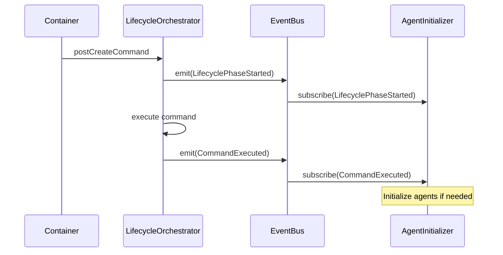
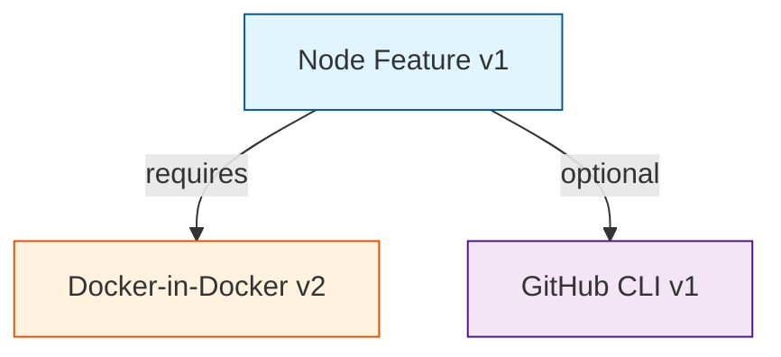

# ADR-008: DevContainer Scanning & Documentation System

## Status

**REJECTED - OUT OF SCOPE**

> **Decision Date**: January 2026
> **Reason**: DevContainer scanning is infrastructure configuration, not agent configuration. AgentScope scope is limited to agent architecture documentation. See [SCOPE.md](../../SCOPE.md) for details.
> **Alternative**: DevContainer Scanner (separate project) for container configuration documentation.

| Field | Value |
|-------|-------|
| Date | 2026-01-25 |
| Author | V3 DDD Domain Expert Agent |
| Deciders | Core Maintainers, DevOps Team |
| Consulted | Container Platform Engineers, Documentation Team |
| Informed | All Contributors, End Users |

---

## Context

### Problem Statement

AgentScope currently focuses on agent architecture visualization from `.claude` configurations. However, modern development workflows increasingly rely on **DevContainers** for reproducible development environments. Key gaps exist:

1. **No DevContainer Analysis**: Cannot scan `.devcontainer/devcontainer.json` configurations
2. **Missing Container Insights**: No visibility into container features, extensions, lifecycle commands
3. **Documentation Gap**: No automated documentation for DevContainer setups
4. **Security Blind Spot**: Cannot detect security issues in container configurations
5. **Integration Opportunity**: DevContainers often contain agent initialization commands that should integrate with agent architecture docs

### Current State

AgentScope v1.1 provides:
- Agent scanning from `.claude/skills/`, `.claude/agents/`
- MCP server detection from `.mcp.json`
- Hook parsing from `.claude/settings.json`
- Diagram generation (component maps, hierarchies, dataflows)

**What's Missing:**
```
.devcontainer/
  └── devcontainer.json  ← NO SCANNING
      ├── features       ← NO ANALYSIS
      ├── customizations ← NO DOCUMENTATION
      └── postCreateCommand ← NO INTEGRATION
```

### Real-World Use Cases

**Use Case 1: Claude Flow Development Environment**
```json
{
  "name": "Claude Flow Dev",
  "features": {
    "ghcr.io/devcontainers/features/node:1": { "version": "lts" },
    "ghcr.io/devcontainers/features/docker-in-docker:2": {}
  },
  "postCreateCommand": "npm install -g @anthropic-ai/claude-code",
  "postStartCommand": "npx @claude-flow/cli@latest init"
}
```

**Questions Users Have:**
- What features are installed in this container?
- What agents are initialized on container start?
- Are there security issues with this configuration?
- How does the container setup relate to agent architecture?

**Use Case 2: Multi-Project Container Comparison**

A team manages 5 different projects, each with DevContainers. They need:
- Comparative analysis of feature usage
- Consistency checking across projects
- Security vulnerability detection
- Centralized documentation

---

## Decision

### Overview

We will implement a **DevContainer Scanning & Documentation System** in AgentScope v1.2 with:

1. **Full DevContainer.json Parsing**: Type-safe parsing with schema validation
2. **Feature Analysis**: Dependency graph, security scanning, update detection
3. **Lifecycle Integration**: Connect container commands to agent initialization
4. **Documentation Generation**: Automated DevContainer documentation with diagrams
5. **Multi-Config Comparison**: Compare multiple DevContainer configurations

### Architecture Decisions

#### AD-1: Domain-Driven Design Architecture

**Decision:** Use DDD with bounded contexts for DevContainer scanning.

**Rationale:**
- Clear separation of concerns (parsing vs scanning vs documentation)
- Testable in isolation
- Extensible for future features (e.g., Dockerfile analysis)
- Aligns with existing AgentScope DDD patterns

**Bounded Contexts:**
```
ConfigurationParsing  → Parse devcontainer.json
DevContainerScanning  → Analyze features, detect issues
DocumentationGeneration → Generate docs and diagrams
LifecycleHooks        → Integrate with agent lifecycle
DependencyAnalysis    → Feature dependency graphs
```

See: [DDD-002: DevContainer Domain Model](./DDD-002-devcontainer-domain.md)

---

#### AD-2: JSON Schema Validation with Anti-Corruption Layer

**Decision:** Use JSON schema validation with an ACL to translate to domain types.

**Rationale:**
- DevContainer spec is external and may change
- ACL protects domain from schema changes
- Type safety in domain layer
- Can support multiple schema versions

```typescript
// External schema (VS Code DevContainer spec)
interface DevContainerSchema {
  name?: string;
  image?: string;
  features?: Record<string, string | object>;
}

// Internal domain type (our model)
interface DevContainerConfig {
  readonly id: ConfigurationId;
  readonly name?: string;
  readonly image?: string;
  readonly features: Feature[];
}

// ACL: Adapter
class DevContainerSchemaAdapter {
  toDomain(external: DevContainerSchema): DevContainerConfig;
  toSchema(domain: DevContainerConfig): DevContainerSchema;
}
```

**Alternatives Considered:**
- ❌ **Direct mapping**: Couples domain to external schema changes
- ❌ **Manual validation**: Error-prone, hard to maintain
- ✅ **ACL with JSON schema**: Best of both worlds

---

#### AD-3: Feature URI-Based Identity

**Decision:** Use Feature URI as entity identity (e.g., `ghcr.io/devcontainers/features/node:1`).

**Rationale:**
- Globally unique identifier
- Follows DevContainer spec convention
- Enables feature lookup and comparison
- Supports version tracking

```typescript
interface Feature {
  readonly id: string; // "ghcr.io/devcontainers/features/node:1"
  readonly version: FeatureVersion;
  readonly options: FeatureOptions;
}

// Example usage
const nodeFeature = Feature.parse("ghcr.io/devcontainers/features/node:1");
nodeFeature.id // "ghcr.io/devcontainers/features/node"
nodeFeature.version // { major: 1, minor: 0, patch: 0 }
```

**Benefits:**
- Natural key (no synthetic IDs needed)
- URL-based, can fetch metadata
- Version comparison built-in

---

#### AD-4: Aggregate Roots as Consistency Boundaries

**Decision:** Define 4 aggregate roots with clear invariants.

| Aggregate | Responsibility | Key Invariant |
|-----------|----------------|---------------|
| `DevContainerConfig` | Configuration data | Must have image XOR build |
| `ScanResult` | Scan output | Metrics must match config |
| `DevContainerDocument` | Generated docs | Links must be valid |
| `LifecycleExecution` | Command execution | Commands execute in order |

**Rationale:**
- Clear transactional boundaries
- Enforce business rules at aggregate level
- Prevent invalid states
- Support concurrent access

**Example Invariant Enforcement:**
```typescript
class DevContainerConfig {
  constructor(
    readonly image?: string,
    readonly build?: BuildConfiguration
  ) {
    // Invariant: Must have image XOR build (not both, not neither)
    if (!image && !build) {
      throw new InvariantViolation('Must provide image or build');
    }
    if (image && build) {
      throw new InvariantViolation('Cannot provide both image and build');
    }
  }
}
```

---

#### AD-5: Domain Events for Lifecycle Integration

**Decision:** Use domain events to integrate DevContainer lifecycle with agent initialization.

**Event Flow:**


**Example Events:**
```typescript
interface LifecyclePhaseStarted {
  type: 'LifecyclePhaseStarted';
  phase: 'postCreate' | 'postStart' | 'postAttach';
  timestamp: Date;
}

interface CommandExecuted {
  type: 'CommandExecuted';
  command: string;
  success: boolean;
  duration: number;
}
```

**Benefits:**
- Loose coupling between container lifecycle and agent system
- Can subscribe to events from multiple contexts
- Supports async processing
- Event sourcing ready (future)

---

#### AD-6: Security Scanning as First-Class Concern

**Decision:** Integrate security scanning into core scanning flow (not optional).

**Security Checks:**
1. **Credential Exposure**: Detect API keys, tokens in environment variables
2. **Insecure Features**: Flag features with known vulnerabilities
3. **Privilege Escalation**: Detect `privileged: true` or unsafe capabilities
4. **Network Exposure**: Warn on excessive port forwarding
5. **Deprecated Features**: Identify features with newer replacements

```typescript
interface SecurityIssue {
  severity: 'critical' | 'high' | 'medium' | 'low';
  category: SecurityCategory;
  message: string;
  remediation?: string;
  cveId?: string;
}

// Example detection
class SecurityScanner {
  detectCredentialExposure(env: EnvironmentVariables): SecurityIssue[] {
    const issues: SecurityIssue[] = [];
    for (const [key, value] of env.variables) {
      if (this.looksLikeSecret(value)) {
        issues.push({
          severity: 'high',
          category: 'credential-exposure',
          message: `Environment variable "${key}" appears to contain a secret`,
          remediation: 'Use GitHub Codespace secrets or .env files'
        });
      }
    }
    return issues;
  }

  private looksLikeSecret(value: string): boolean {
    return /^(sk-|ghp_|gho_|ghu_|AKIA|AIza)/.test(value);
  }
}
```

**Rationale:**
- Container security is critical (containers often have elevated privileges)
- Shift-left security (catch issues in development)
- Automated detection prevents manual review burden
- Aligns with industry best practices (DevSecOps)

---

#### AD-7: Dependency Graph Analysis

**Decision:** Build feature dependency graph for analysis and visualization.

**Graph Structure:**
```typescript
interface DependencyGraph {
  nodes: DependencyNode[];  // Features
  edges: DependencyEdge[];  // Dependencies

  detectCircular(): CircularDependency[];
  getTopologicalOrder(): Feature[];
}

interface DependencyNode {
  id: string;              // Feature URI
  feature: Feature;
  depth: number;           // Distance from root
}

interface DependencyEdge {
  from: string;            // Source feature URI
  to: string;              // Target feature URI
  type: 'required' | 'optional' | 'peer';
}
```

**Example Visualization:**


**Analysis Capabilities:**
- Detect circular dependencies (install failures)
- Calculate install order (topological sort)
- Identify unused features
- Find optimization opportunities

---

#### AD-8: Multi-Config Comparison Support

**Decision:** Enable comparison of multiple DevContainer configurations.

**Use Cases:**
- Compare dev vs production containers
- Analyze team consistency across projects
- Detect configuration drift
- Migration planning (old → new setups)

**Comparison Output:**
```typescript
interface ComparisonResult {
  configs: DevContainerConfig[];
  differences: Difference[];
  commonFeatures: Feature[];
  uniqueFeatures: Map<ConfigurationId, Feature[]>;
  recommendations: ComparisonRecommendation[];
}

interface Difference {
  type: 'feature-added' | 'feature-removed' | 'feature-version-changed' | 'config-changed';
  configId: ConfigurationId;
  description: string;
  impact: 'breaking' | 'minor' | 'patch';
}
```

**Example Table:**
```markdown
| Feature | Project A | Project B | Project C |
|---------|-----------|-----------|-----------|
| node    | 18        | 20        | ❌        |
| docker  | ✅ v2     | ✅ v2     | ✅ v2     |
| gh-cli  | ❌        | ✅ latest | ✅ latest |
```

---

#### AD-9: CLI Commands & User Interface

**Decision:** Add 4 new CLI commands with progressive disclosure.

```bash
# Scan single DevContainer
agentscope scan-devcontainer [path]

# Generate documentation
agentscope devcontainer-docs [path] --output docs/

# Compare multiple configurations
agentscope compare-devcontainers <path1> <path2> <path3>

# Validate DevContainer security
agentscope validate-devcontainer [path] --security-only
```

**Output Examples:**

**1. Scan Command:**
```bash
$ agentscope scan-devcontainer .devcontainer

✓ DevContainer Configuration Scanned

  Name: Claude Flow Dev
  Base Image: mcr.microsoft.com/devcontainers/base:bookworm

  Features (3):
    ✓ docker-in-docker v2
    ✓ github-cli v1
    ✓ node v1 (lts)

  Customizations:
    VS Code Extensions (4)
    Settings (2)

  Lifecycle Commands:
    postCreateCommand ✓
    postStartCommand ✓

  Security: ✓ No issues detected
  Complexity Score: 42/100 (Medium)
```

**2. Documentation Generation:**
```bash
$ agentscope devcontainer-docs .devcontainer --output docs/

✓ Generated documentation:
  ├── docs/devcontainer/README.md
  ├── docs/devcontainer/features.md
  ├── docs/devcontainer/architecture.md
  └── docs/devcontainer/diagrams/
      ├── feature-dependencies.mermaid
      └── lifecycle-flow.mermaid
```

**3. Comparison:**
```bash
$ agentscope compare-devcontainers project-a project-b

Comparing 2 DevContainer configurations:

Common Features:
  ✓ node (both use lts)
  ✓ docker-in-docker (both use v2)

Differences:
  ⚠️ project-a: github-cli v1 → project-b: missing
  ⚠️ project-a: 2 extensions → project-b: 5 extensions

Recommendations:
  • Standardize github-cli usage
  • Align VS Code extensions
```

---

#### AD-10: Repository Pattern for Persistence

**Decision:** Use repository pattern for configuration and scan result storage.

**Repositories:**
```typescript
interface DevContainerConfigRepository {
  findById(id: ConfigurationId): Promise<DevContainerConfig | undefined>;
  findByPath(path: string): Promise<DevContainerConfig | undefined>;
  save(config: DevContainerConfig): Promise<void>;
}

interface ScanResultRepository {
  findLatest(configId: ConfigurationId): Promise<ScanResult | undefined>;
  findAll(configId: ConfigurationId): Promise<ScanResult[]>;
  save(result: ScanResult): Promise<void>;
  getHistoricalMetrics(configId: ConfigurationId): Promise<MetricsTimeseries>;
}
```

**Storage Strategy:**
- **Configurations**: JSON files in `.agentscope/devcontainers/`
- **Scan Results**: JSON files with timestamp: `scan-{configId}-{timestamp}.json`
- **Metrics**: Time-series data for trend analysis

**Benefits:**
- Abstraction over storage mechanism
- Easy to test (in-memory implementation)
- Can swap storage backends (file → database)
- Historical tracking of configuration changes

---

## Consequences

### Positive

✅ **Enhanced Developer Experience**
- Users get comprehensive DevContainer insights
- Automated documentation reduces manual effort
- Security issues caught early

✅ **Better Architecture Visibility**
- See how containers relate to agent architecture
- Understand full development environment stack
- Detect inconsistencies across projects

✅ **Security Improvements**
- Automated security scanning
- Credential exposure detection
- Vulnerability identification

✅ **Cross-Project Analysis**
- Compare configurations easily
- Identify best practices
- Standardize team setups

✅ **Clean Architecture**
- DDD provides clear boundaries
- Anti-corruption layers protect from external changes
- Testable, maintainable code

### Negative

⚠️ **Increased Complexity**
- More code to maintain
- Additional testing required
- Learning curve for contributors

⚠️ **Performance Considerations**
- Dependency graph analysis can be slow for large configs
- Need caching for repeated scans

⚠️ **External Dependencies**
- Relies on DevContainer spec stability
- Feature metadata may require network calls
- Schema migrations needed for spec updates

### Mitigation Strategies

**For Complexity:**
- Comprehensive documentation
- Progressive disclosure in CLI (simple → advanced)
- Clear module boundaries with DDD

**For Performance:**
- Cache dependency graphs
- Lazy load feature metadata
- Background scanning option

**For External Dependencies:**
- Version ACL to handle schema changes
- Offline mode with cached metadata
- Graceful degradation if network unavailable

---

## Alternatives Considered

### Alternative 1: Simple JSON Parser (No DDD)

**Approach:** Just parse devcontainer.json and display fields.

**Pros:**
- Simpler implementation
- Faster to build
- Less code to maintain

**Cons:**
- No domain logic encapsulation
- Hard to extend
- No security analysis
- No dependency graph
- Coupled to external schema

**Decision:** ❌ Rejected - too limited, doesn't provide enough value

---

### Alternative 2: External Tool Integration

**Approach:** Shell out to `devcontainer` CLI or similar tools.

**Pros:**
- Leverage existing tools
- Less custom code
- Maintained by others

**Cons:**
- External dependency required
- Less control over output
- Harder to integrate with AgentScope
- Can't customize analysis

**Decision:** ❌ Rejected - loss of control, integration friction

---

### Alternative 3: Hybrid Approach (Parser + External Tools)

**Approach:** Use our parser for structure, external tools for advanced analysis.

**Pros:**
- Balance of control and functionality
- Can leverage specialized tools (e.g., Trivy for security)
- Gradual feature expansion

**Cons:**
- Complexity of managing external tools
- Dependency installation burden
- Inconsistent behavior across environments

**Decision:** 🤔 **Possible future enhancement** - start with full internal implementation, integrate external tools later for specialized analysis (e.g., CVE scanning)

---

## Implementation Plan

### Phase 1: Core Parsing (Week 1-2)
- [ ] Implement ConfigurationParsing bounded context
- [ ] JSON schema validation
- [ ] DevContainerSchemaAdapter (ACL)
- [ ] Feature URI parsing and validation
- [ ] Unit tests (90%+ coverage)

**Deliverable:** Can parse devcontainer.json into domain types

### Phase 2: Scanning & Analysis (Week 3-4)
- [ ] Implement DevContainerScanning bounded context
- [ ] Feature extractor
- [ ] Security scanner
- [ ] Dependency graph builder
- [ ] Metrics calculator
- [ ] Integration tests

**Deliverable:** Can scan and analyze DevContainer configurations

### Phase 3: Documentation Generation (Week 5-6)
- [ ] Implement DocumentationGeneration bounded context
- [ ] Feature diagram generator (Mermaid)
- [ ] Summary generator
- [ ] README template
- [ ] Architecture template
- [ ] E2E tests

**Deliverable:** Generate comprehensive DevContainer documentation

### Phase 4: CLI Integration (Week 7)
- [ ] Add CLI commands: `scan-devcontainer`, `devcontainer-docs`, `compare-devcontainers`
- [ ] Output formatting (tables, colors)
- [ ] Error handling and user-friendly messages
- [ ] Help documentation

**Deliverable:** Fully functional CLI

### Phase 5: Lifecycle Hooks (Week 8)
- [ ] Implement LifecycleHooks bounded context
- [ ] Event emitter
- [ ] Command executor
- [ ] Integration with existing agent hooks
- [ ] Optional feature flag

**Deliverable:** DevContainer lifecycle integrated with agent system

### Phase 6: Polish & Documentation (Week 9-10)
- [ ] Comprehensive README
- [ ] API documentation
- [ ] Usage examples
- [ ] Video tutorial
- [ ] Blog post announcement

**Deliverable:** Production-ready v1.2 release

---

## Success Metrics

| Metric | Target | Measurement |
|--------|--------|-------------|
| **Adoption** | 30% of users scan DevContainers | Analytics on CLI usage |
| **Security Issues Detected** | 5+ issues per 100 scans | Aggregated scan results |
| **Documentation Quality** | 80%+ user satisfaction | User survey |
| **Performance** | <500ms for typical scan | Benchmark suite |
| **Test Coverage** | 85%+ across all contexts | Coverage reports |

---

## Future Enhancements (v1.3+)

### Dockerfile Analysis
Extend scanning to analyze `Dockerfile` when using `build` instead of `image`.

### Feature Recommendation Engine
Suggest features based on:
- Project type (Node.js → suggest node feature)
- Existing setup (missing common tools)
- Team standards

### Visual Configuration Editor
Web UI for editing devcontainer.json with:
- Live preview
- Feature catalog browser
- Guided setup wizard

### CI/CD Integration
GitHub Action to:
- Scan DevContainers in PRs
- Block merge if security issues found
- Comment with analysis results

### Container Registry Integration
Fetch feature metadata from:
- GitHub Container Registry
- Docker Hub
- Custom registries

---

## References

- [DDD-002: DevContainer Domain Model](./DDD-002-devcontainer-domain.md)
- [DevContainer Specification](https://containers.dev/implementors/json_reference/)
- [DevContainer Features](https://containers.dev/features)
- [VS Code DevContainer Extension](https://code.visualstudio.com/docs/devcontainers/containers)
- [GitHub Codespaces DevContainer Support](https://docs.github.com/en/codespaces/setting-up-your-project-for-codespaces/adding-a-dev-container-configuration)
- [Domain-Driven Design (Evans, 2003)](https://www.domainlanguage.com/ddd/)
- [Clean Architecture (Martin, 2017)](https://blog.cleancoder.com/uncle-bob/2012/08/13/the-clean-architecture.html)

---

*Document Version: 1.0*
*Last Updated: 2026-01-25*
*Next Review: 2026-02-25*
