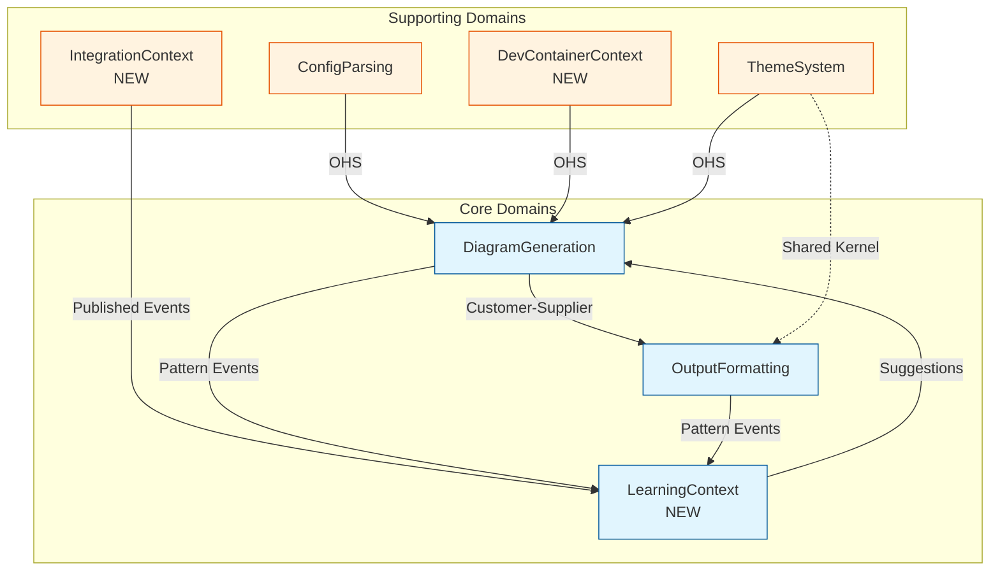
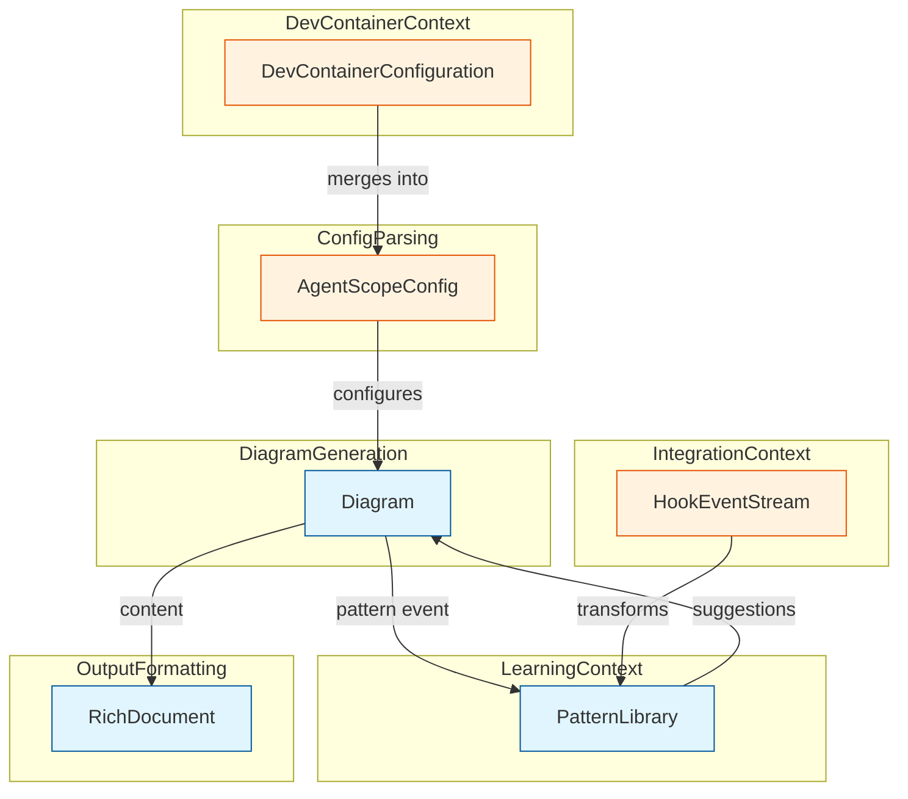
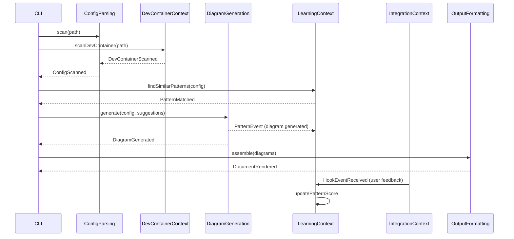
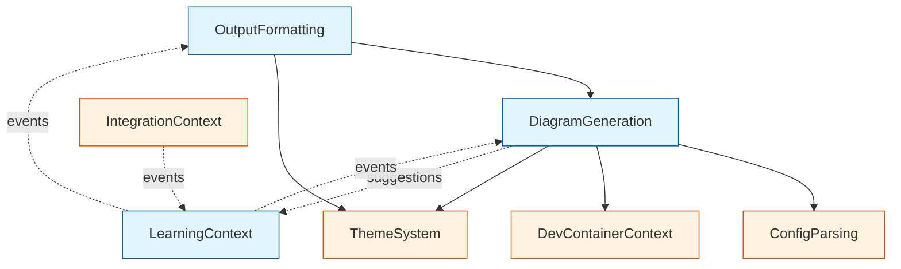

# ADR-009: DDD Bounded Contexts and Aggregates for v1.2

## Status

**Proposed**

| Field | Value |
|-------|-------|
| Date | 2026-01-25 |
| Author | ADR Architect Agent |
| Deciders | Core Maintainers, DDD Domain Expert |
| Consulted | Architecture Team |
| Informed | All Contributors |

---

## Context

### Problem Statement

AgentScope v1.2 introduces:
1. **DevContainer Scanner** (ADR-008) - New bounded context
2. **Self-Learning System** - Neural pattern storage and retrieval
3. **Enhanced Documentation** - Multi-file output with navigation
4. **Claude-flow Hooks Integration** - External system integration

The existing DDD model (DDD-001) defines 4 bounded contexts for v1.1:
- ConfigParsing
- DiagramGeneration
- ThemeSystem
- OutputFormatting

**Challenge**: v1.2 features introduce new domain concepts that don't cleanly fit existing boundaries. We need to:
- Define new bounded contexts for v1.2 features
- Maintain clear aggregate boundaries
- Ensure proper context relationships
- Support self-learning without creating circular dependencies

### Strategic Considerations

| Aspect | v1.1 Model | v1.2 Requirements |
|--------|------------|-------------------|
| **Contexts** | 4 bounded contexts | Need 2-3 new contexts |
| **Aggregates** | 4 aggregate roots | Need 3-4 new roots |
| **Integration** | Simple upstream/downstream | Complex multi-context patterns |
| **Learning** | Static configuration | Dynamic neural patterns |
| **Hooks** | None | External system events |

---

## Decision

### Overview

We will extend the DDD model with **3 new bounded contexts** while maintaining existing boundaries:

1. **DevContainerContext** (Supporting) - DevContainer configuration parsing
2. **LearningContext** (Core - New) - Neural pattern storage and self-learning
3. **IntegrationContext** (Supporting) - External system hooks and events

### Updated Context Map



---

## Bounded Context Definitions

### 1. DevContainerContext (Supporting - New)

**Purpose**: Parse and validate DevContainer configurations.

**Responsibilities**:
- Scan `.devcontainer/devcontainer.json` files
- Extract Claude Code customizations
- Validate DevContainer schema
- Provide configs to DiagramGeneration

**Aggregate Root**: `DevContainerConfiguration`

```typescript
/**
 * Aggregate Root: DevContainerConfiguration
 * Invariant: Must have valid JSON schema
 * Invariant: Paths must be container-relative
 */
interface DevContainerConfiguration {
  readonly id: string;
  readonly filePath: string;
  readonly name?: string;
  readonly image?: string;
  readonly customizations: DevContainerCustomizations;
  readonly features: Map<string, unknown>;
  readonly metadata: DevContainerMetadata;

  // Aggregate behavior
  extractClaudeAgents(): Agent[];
  extractMcpServers(): MCPServer[];
  validateSchema(): ValidationResult;
  mergeWithProjectConfig(projectConfig: AgentScopeConfig): AgentScopeConfig;
}
```

**Value Objects**:

```typescript
interface DevContainerCustomizations {
  readonly vscode?: {
    readonly extensions?: string[];
    readonly settings?: Record<string, unknown>;
    readonly claudeAgents?: Agent[];
    readonly claudeMcpServers?: Record<string, MCPServer>;
  };
}

interface DevContainerMetadata {
  readonly detected: boolean;
  readonly configPath: string;
  readonly containerName?: string;
  readonly claudeFeatures: string[];
}
```

**Domain Events**:

```typescript
interface DevContainerScanned {
  readonly type: 'DevContainerScanned';
  readonly timestamp: Date;
  readonly configPath: string;
  readonly agentCount: number;
  readonly mcpServerCount: number;
}

interface DevContainerValidationFailed {
  readonly type: 'DevContainerValidationFailed';
  readonly timestamp: Date;
  readonly configPath: string;
  readonly errors: ValidationError[];
}
```

**Language**:
- DevContainer, Customization, Feature, VSCodeSetting, ContainerImage, Mount

---

### 2. LearningContext (Core - New)

**Purpose**: Store, retrieve, and learn from diagram generation patterns.

**Responsibilities**:
- Store successful diagram patterns
- Learn from user preferences
- Suggest diagram types based on config
- Track pattern usage and effectiveness
- Provide ReasoningBank integration

**Aggregate Root**: `PatternLibrary`

```typescript
/**
 * Aggregate Root: PatternLibrary
 * Invariant: All patterns must have unique identifiers
 * Invariant: Pattern confidence scores must be 0-1
 */
interface PatternLibrary {
  readonly id: string;
  readonly patterns: DiagramPattern[];
  readonly metadata: PatternLibraryMetadata;

  // Aggregate behavior
  storePattern(pattern: DiagramPattern): void;
  findSimilarPatterns(config: AgentScopeConfig, k: number): DiagramPattern[];
  updatePatternScore(patternId: string, feedback: PatternFeedback): void;
  suggestDiagramTypes(config: AgentScopeConfig): DiagramTypeSuggestion[];
  pruneStalePatterns(threshold: Date): void;
}
```

**Entities**:

```typescript
/**
 * Entity: DiagramPattern
 * Identity: id (unique pattern identifier)
 */
interface DiagramPattern {
  readonly id: string;
  readonly configSignature: ConfigSignature;
  readonly suggestedDiagrams: DiagramType[];
  readonly confidence: number;
  readonly usageCount: number;
  readonly successRate: number;
  readonly lastUsed: Date;
  readonly embedding?: number[]; // Vector for similarity search
}

interface ConfigSignature {
  readonly agentCount: number;
  readonly categoryDistribution: Map<AgentCategory, number>;
  readonly hasHooks: boolean;
  readonly hasMcpServers: boolean;
  readonly hasDevContainer: boolean;
}
```

**Value Objects**:

```typescript
interface DiagramTypeSuggestion {
  readonly type: DiagramType;
  readonly confidence: number;
  readonly reasoning: string;
}

interface PatternFeedback {
  readonly helpful: boolean;
  readonly diagramsGenerated: DiagramType[];
  readonly userSatisfaction: number; // 0-1
}

interface PatternLibraryMetadata {
  readonly totalPatterns: number;
  readonly averageConfidence: number;
  readonly lastPruned: Date;
}
```

**Domain Events**:

```typescript
interface PatternStored {
  readonly type: 'PatternStored';
  readonly timestamp: Date;
  readonly patternId: string;
  readonly configSignature: ConfigSignature;
}

interface PatternMatched {
  readonly type: 'PatternMatched';
  readonly timestamp: Date;
  readonly patternId: string;
  readonly similarity: number;
  readonly suggestions: DiagramTypeSuggestion[];
}

interface PatternFeedbackReceived {
  readonly type: 'PatternFeedbackReceived';
  readonly timestamp: Date;
  readonly patternId: string;
  readonly feedback: PatternFeedback;
}
```

**Domain Services**:

```typescript
/**
 * Service: PatternMatcher
 * Responsibility: Find similar patterns using vector similarity
 */
interface PatternMatcher {
  computeSignature(config: AgentScopeConfig): ConfigSignature;
  computeEmbedding(signature: ConfigSignature): number[];
  findSimilar(embedding: number[], k: number): DiagramPattern[];
}

/**
 * Service: PatternLearner
 * Responsibility: Update pattern confidence based on feedback
 */
interface PatternLearner {
  updateConfidence(pattern: DiagramPattern, feedback: PatternFeedback): number;
  pruneStalePatterns(library: PatternLibrary, threshold: Date): number;
}
```

**Language**:
- Pattern, Signature, Embedding, Confidence, Similarity, Feedback, Learning, Pruning

---

### 3. IntegrationContext (Supporting - New)

**Purpose**: Handle integration with external systems (Claude-flow hooks, MCP events).

**Responsibilities**:
- Subscribe to claude-flow hook events
- Transform external events to domain events
- Publish domain events to LearningContext
- Handle external system failures gracefully

**Aggregate Root**: `HookEventStream`

```typescript
/**
 * Aggregate Root: HookEventStream
 * Invariant: Events must be ordered by timestamp
 * Invariant: Must handle duplicate events
 */
interface HookEventStream {
  readonly id: string;
  readonly events: HookEvent[];
  readonly subscriptions: HookSubscription[];
  readonly metadata: HookStreamMetadata;

  // Aggregate behavior
  subscribe(subscription: HookSubscription): void;
  publishEvent(event: HookEvent): void;
  transformToPatternEvent(event: HookEvent): PatternEvent;
  handleFailure(error: IntegrationError): void;
}
```

**Entities**:

```typescript
/**
 * Entity: HookEvent
 * Identity: eventId (unique event identifier)
 */
interface HookEvent {
  readonly eventId: string;
  readonly hookType: HookType;
  readonly timestamp: Date;
  readonly payload: HookPayload;
  readonly source: string; // e.g., "claude-flow", "mcp-server"
}

type HookType =
  | 'PreToolUse'
  | 'PostToolUse'
  | 'PreEdit'
  | 'PostEdit'
  | 'DiagramGenerated'
  | 'PatternStored';

interface HookPayload {
  readonly data: Record<string, unknown>;
  readonly metadata?: Record<string, unknown>;
}
```

**Value Objects**:

```typescript
interface HookSubscription {
  readonly hookTypes: HookType[];
  readonly callback: (event: HookEvent) => void;
  readonly filter?: (event: HookEvent) => boolean;
}

interface HookStreamMetadata {
  readonly totalEvents: number;
  readonly lastEventTime: Date;
  readonly activeSubscriptions: number;
}

interface IntegrationError {
  readonly type: 'connection' | 'timeout' | 'invalid_event' | 'unknown';
  readonly message: string;
  readonly retryable: boolean;
}
```

**Domain Events**:

```typescript
interface HookEventReceived {
  readonly type: 'HookEventReceived';
  readonly timestamp: Date;
  readonly hookType: HookType;
  readonly source: string;
}

interface IntegrationFailed {
  readonly type: 'IntegrationFailed';
  readonly timestamp: Date;
  readonly error: IntegrationError;
  readonly retryAttempt: number;
}
```

**Anti-Corruption Layer**:

```typescript
/**
 * ACL: ClaudeFlowAdapter
 * Translates claude-flow events to domain events
 */
interface ClaudeFlowAdapter {
  translateHookEvent(claudeFlowEvent: unknown): HookEvent;
  transformToPatternEvent(hookEvent: HookEvent): PatternEvent;
  validateEvent(event: unknown): boolean;
}
```

**Language**:
- Hook, Event, Subscription, Stream, Integration, Adapter, Transformation

---

## Updated Aggregate Relationships

### Aggregate Collaboration



---

## Context Relationships

### Detailed Context Map

| Upstream | Downstream | Pattern | Description |
|----------|------------|---------|-------------|
| ConfigParsing | DiagramGeneration | Open Host Service | Standard config API |
| DevContainerContext | DiagramGeneration | Open Host Service | DevContainer config API |
| ThemeSystem | DiagramGeneration | Open Host Service | Theme palette API |
| DiagramGeneration | OutputFormatting | Customer-Supplier | Diagram strings |
| ThemeSystem | OutputFormatting | Shared Kernel | Color definitions |
| IntegrationContext | LearningContext | Published Events | Hook events transformed |
| DiagramGeneration | LearningContext | Published Events | Pattern events |
| OutputFormatting | LearningContext | Published Events | Usage feedback |
| LearningContext | DiagramGeneration | Published Events | Diagram suggestions |

### Event Flow



---

## Consequences

### Positive

1. **Clear Boundaries**: Each new context has well-defined responsibilities
2. **Scalability**: Learning system can evolve independently
3. **Testability**: Contexts can be tested in isolation
4. **Event-Driven**: Loose coupling via domain events
5. **Extensibility**: Easy to add new integration sources
6. **ReasoningBank Ready**: Learning context prepared for neural integration

### Negative

1. **Increased Complexity**: 7 bounded contexts vs 4 in v1.1 (+75%)
2. **More Aggregates**: 7 aggregate roots vs 4 in v1.1 (+75%)
3. **Event Overhead**: Event transformation adds latency (~5-10ms)
4. **Testing Matrix**: More context interactions to test
5. **Documentation Burden**: More domain concepts to document

### Neutral

1. **Event Sourcing**: Future option for audit trail
2. **CQRS**: Possible for read-heavy pattern matching
3. **Microservices**: Contexts map to potential service boundaries

### Risks

| Risk | Likelihood | Impact | Mitigation |
|------|------------|--------|------------|
| Context boundaries blur over time | Medium | High | Enforce via architecture tests |
| Circular dependencies | Low | High | Dependency graph validation in CI |
| Event storm (too many events) | Medium | Medium | Event throttling, batching |
| Learning context becomes bloated | Medium | Medium | Periodic aggregate refactoring |
| Integration failures cascade | Low | High | Circuit breaker pattern |

---

## Alternatives Considered

### Alternative 1: Single Monolithic Context

**Description**: Keep all new features in existing ConfigParsing or DiagramGeneration contexts.

**Pros**:
- Simpler model
- Fewer abstractions
- Faster development

**Cons**:
- Violates Single Responsibility Principle
- Contexts become "god objects"
- Hard to test and maintain
- Circular dependencies inevitable

**Decision**: Rejected - Defeats DDD purpose.

### Alternative 2: Fine-Grained Microservices

**Description**: Split each aggregate into its own context (12+ contexts).

**Pros**:
- Maximum separation of concerns
- True microservice architecture
- Independent deployment

**Cons**:
- Over-engineered for CLI tool
- Communication overhead
- Operational complexity
- Performance degradation

**Decision**: Rejected - Too complex for v1.2 scope.

### Alternative 3: Shared Database Model

**Description**: All contexts read/write to shared database without boundaries.

**Pros**:
- Simple data access
- No event overhead
- Direct queries

**Cons**:
- Tight coupling
- No clear ownership
- Merge conflicts
- Impossible to evolve independently

**Decision**: Rejected - Anti-pattern in DDD.

### Alternative 4: CQRS from the Start

**Description**: Implement Command Query Responsibility Segregation now.

**Pros**:
- Optimized reads (pattern matching)
- Event sourcing ready
- Scalable architecture

**Cons**:
- Overkill for v1.2
- Adds complexity
- Longer development time
- Harder to debug

**Decision**: Deferred - Consider for v2.0.

---

## Implementation Guidelines

### Directory Structure

```
src/core/
  model/
    types.ts              # Shared type definitions

  scanners/               # ConfigParsing + DevContainerContext
    config-scanner.ts
    devcontainer/
      devcontainer-scanner.ts
      schema.ts
      parser.ts

  generators/             # DiagramGeneration context
    diagrams/
      component-map.ts
      hierarchy.ts
    services/
      diagram-service.ts

  learning/               # LearningContext (NEW)
    pattern-library.ts
    pattern-matcher.ts
    pattern-learner.ts
    storage/
      memory-store.ts
      reasoning-bank-adapter.ts

  integration/            # IntegrationContext (NEW)
    hook-event-stream.ts
    claude-flow-adapter.ts
    mcp-adapter.ts
    acl/

  themes/                 # ThemeSystem context
    types.ts
    generator.ts
    registry.ts

  formatters/             # OutputFormatting context
    document-assembler.ts
    navigation-generator.ts
```

### Dependency Rules

1. **ConfigParsing**: No dependencies
2. **DevContainerContext**: No dependencies
3. **ThemeSystem**: No dependencies
4. **IntegrationContext**: No dependencies on other contexts
5. **DiagramGeneration**: Depends on ConfigParsing, DevContainerContext, ThemeSystem, LearningContext (suggestions only)
6. **LearningContext**: Receives events from DiagramGeneration, OutputFormatting, IntegrationContext
7. **OutputFormatting**: Depends on DiagramGeneration, ThemeSystem



### Testing Strategy

| Context | Test Type | Coverage Target |
|---------|-----------|-----------------|
| DevContainerContext | Unit | 90%+ |
| LearningContext | Unit + Integration | 85%+ |
| IntegrationContext | Unit + Mock External | 80%+ |
| Cross-Context | E2E | Key user flows |

### Architecture Tests

```typescript
describe('DDD Architecture Compliance', () => {
  it('should not have circular dependencies', () => {
    const graph = analyzeDependencies('./src/core');
    expect(graph.hasCycles()).toBe(false);
  });

  it('should respect context boundaries', () => {
    const violations = checkContextBoundaries('./src/core');
    expect(violations).toHaveLength(0);
  });

  it('should use events for cross-context communication', () => {
    const directCalls = findDirectCrossContextCalls('./src/core');
    expect(directCalls).toHaveLength(0);
  });
});
```

---

## Migration Path

### From v1.1 to v1.2

| Step | Action | Impact |
|------|--------|--------|
| 1 | Create new context directories | Low - no code changes |
| 2 | Move DevContainer scanner to DevContainerContext | Medium - file moves |
| 3 | Implement LearningContext (new code) | High - new features |
| 4 | Implement IntegrationContext (new code) | High - new features |
| 5 | Update DiagramGeneration to consume suggestions | Medium - behavior change |
| 6 | Add event publishing to existing contexts | Low - additive change |
| 7 | Add architecture tests | Low - test only |

### Backward Compatibility

```typescript
// v1.1 API still works
generateDiagram(config, { theme: 'dark' });

// v1.2 adds optional suggestions
generateDiagram(config, {
  theme: 'dark',
  suggestions: patternLibrary.suggestDiagramTypes(config), // Optional
});
```

---

## Related Decisions

- **ADR-008**: DevContainer Scanner (defines DevContainerContext needs)
- **DDD-001**: Generator Domains (v1.1 baseline)
- **ADR-007**: Export/Import System (impacts all contexts)

---

## References

- [Domain-Driven Design (Evans)](https://domainlanguage.com/ddd/)
- [Implementing Domain-Driven Design (Vernon)](https://vaughnvernon.com/iddd/)
- [DDD Reference (Evans)](https://www.domainlanguage.com/ddd/reference/)
- [Bounded Context (Fowler)](https://martinfowler.com/bliki/BoundedContext.html)
- [Event Storming](https://www.eventstorming.com/)

---

## Appendix: Ubiquitous Language Updates

### New Terms (v1.2)

| Term | Definition | Context |
|------|------------|---------|
| **Pattern** | Learned diagram generation strategy | LearningContext |
| **Signature** | Fingerprint of a configuration | LearningContext |
| **Embedding** | Vector representation for similarity | LearningContext |
| **Confidence** | Pattern success probability (0-1) | LearningContext |
| **Hook** | External system event handler | IntegrationContext |
| **EventStream** | Ordered sequence of hook events | IntegrationContext |
| **DevContainer** | Container-based development environment | DevContainerContext |
| **Customization** | VSCode-specific configuration | DevContainerContext |

### Updated Context Glossary

**ConfigParsing**: Agent, Coordinator, Worker, Specialist, Reviewer, Delegation, MCP Server, Skill, Hook, Permission

**DevContainerContext**: DevContainer, Customization, Feature, VSCodeSetting, ContainerImage, Mount

**DiagramGeneration**: Diagram, ZoomLevel, ComponentMap, Hierarchy, Subgraph, Node, Edge, Category

**ThemeSystem**: Theme, Palette, ColorScheme, AccessibilityLevel, ClassDef, ThemeVariables

**LearningContext**: Pattern, Signature, Embedding, Confidence, Similarity, Feedback, Learning, Pruning

**IntegrationContext**: Hook, Event, Subscription, Stream, Integration, Adapter, Transformation

**OutputFormatting**: Document, Section, Legend, Navigation, Summary, Statistics, Anchor

---

*Generated by AgentScope ADR Architect*
*Last Updated: 2026-01-25*
