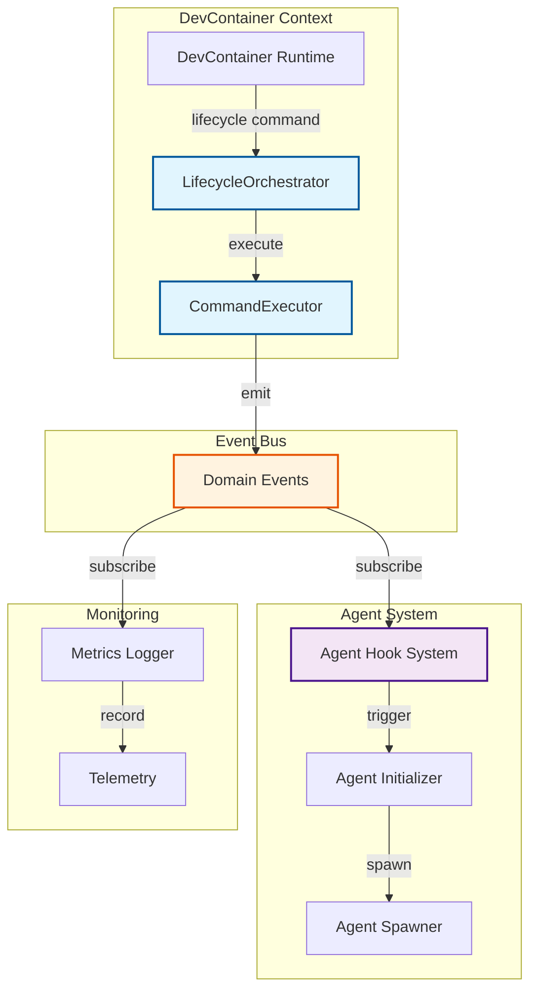
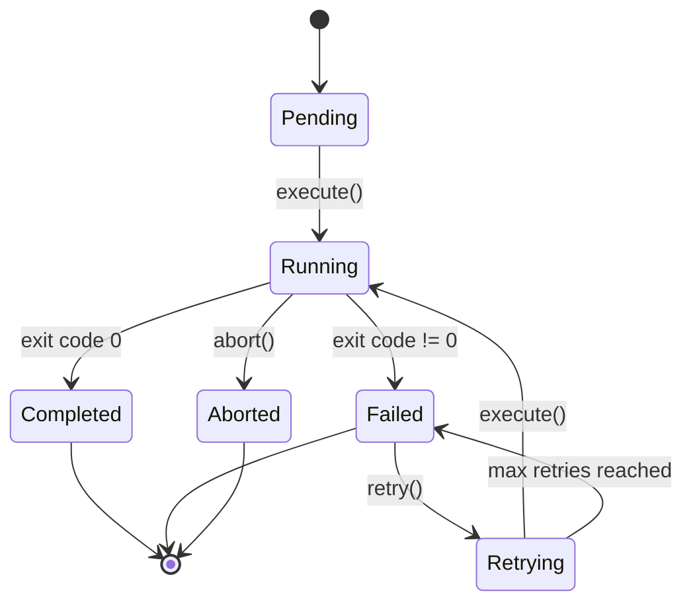
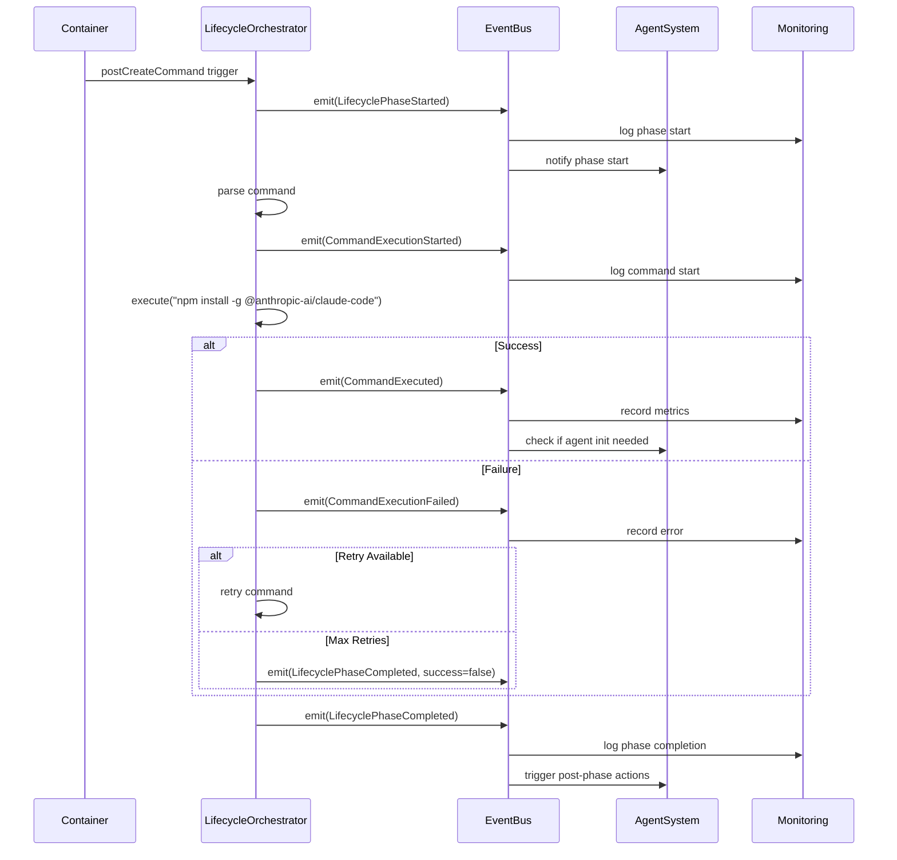
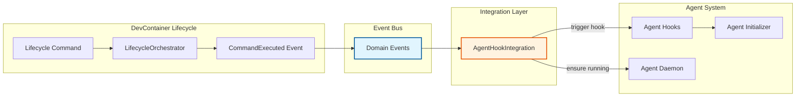

# ADR-009: DevContainer Lifecycle Hooks Integration

## Status

**Proposed**

| Field | Value |
|-------|-------|
| Date | 2026-01-25 |
| Author | V3 DDD Domain Expert Agent |
| Deciders | Core Maintainers, Integration Team |
| Consulted | DevOps Engineers, Agent System Architects |
| Informed | All Contributors |
| Related ADRs | [ADR-008: DevContainer Scanning](./ADR-008-devcontainer-scanning.md) |

---

## Context

### Problem Statement

DevContainer configurations include **lifecycle commands** that execute at specific phases (postCreate, postStart, postAttach). These commands often perform critical initialization tasks like:

- Installing global tools (`npm install -g @anthropic-ai/claude-code`)
- Initializing agent systems (`npx @claude-flow/cli@latest init`)
- Starting background services (`npx @claude-flow/cli@latest daemon start`)

**Current Issues:**

1. **No Visibility**: Cannot track when/if lifecycle commands execute
2. **No Integration**: Lifecycle commands are isolated from agent system
3. **No Error Handling**: Failures in lifecycle commands are silent
4. **No Orchestration**: Cannot coordinate container lifecycle with agent initialization
5. **No Monitoring**: No metrics or logging for command execution

### Real-World Example

From AgentScope's own `.devcontainer/devcontainer.json`:

```json
{
  "postCreateCommand": "npm install -g @anthropic-ai/claude-code",
  "postStartCommand": "npx @claude-flow/cli@latest init --force && npx @claude-flow/cli@latest daemon start --quiet || true"
}
```

**Questions We Can't Answer:**
- Did Claude Code install successfully?
- How long did initialization take?
- Did the daemon start?
- What if initialization fails?
- How does this relate to agent configuration in `.claude/`?

### Goals

1. **Track Execution**: Monitor lifecycle command execution with timing and results
2. **Integrate with Agent System**: Connect container lifecycle to agent initialization
3. **Error Handling**: Gracefully handle failures with retry logic
4. **Event-Driven**: Use domain events to loosely couple container lifecycle and agents
5. **Observable**: Provide metrics and logs for debugging

---

## Decision

### Overview

We will implement a **Lifecycle Hooks System** that:

1. Detects lifecycle commands from DevContainer configuration
2. Executes commands with timeout and retry support
3. Emits domain events for lifecycle phases and command execution
4. Integrates with existing agent hook system
5. Provides monitoring and observability

### Architecture

#### Component Overview



---

### AD-1: Lifecycle Phases as First-Class Domain Concept

**Decision:** Model DevContainer lifecycle phases as domain value objects.

```typescript
/**
 * Lifecycle phases from DevContainer spec
 * @see https://containers.dev/implementors/json_reference/#lifecycle-scripts
 */
type LifecyclePhase =
  | 'initializeCommand'      // Before anything else
  | 'onCreateCommand'        // After container is created (one-time)
  | 'updateContentCommand'   // After content updates
  | 'postCreateCommand'      // After onCreateCommand (one-time)
  | 'postStartCommand'       // Every time container starts
  | 'postAttachCommand';     // Every time user attaches

interface LifecycleCommand {
  readonly phase: LifecyclePhase;
  readonly command: string;
  readonly workingDirectory?: string;
  readonly timeout?: number;
  readonly continueOnError: boolean;
}
```

**Rationale:**
- Clear semantic meaning for each phase
- Type safety prevents using invalid phases
- Self-documenting code
- Aligns with DevContainer spec

**Execution Order:**
```
initializeCommand
  ↓
onCreateCommand
  ↓
updateContentCommand (if content changed)
  ↓
postCreateCommand
  ↓
postStartCommand (every start)
  ↓
postAttachCommand (every attach)
```

---

### AD-2: Command Execution as Aggregate Root

**Decision:** Model command execution as an aggregate root with identity and lifecycle.

```typescript
/**
 * Aggregate Root: CommandExecution
 * Identity: Unique execution ID
 * Invariant: Commands must complete or fail (no hanging)
 * Invariant: Exit code must be set when status is completed/failed
 */
interface CommandExecution {
  readonly id: CommandId;              // Unique execution instance
  readonly command: string;
  readonly phase: LifecyclePhase;
  readonly startTime: Date;
  readonly endTime?: Date;
  readonly exitCode?: number;
  readonly stdout?: string;
  readonly stderr?: string;
  readonly status: ExecutionStatus;
  readonly retryCount: number;
  readonly maxRetries: number;

  // Aggregate behavior
  execute(): Promise<ExecutionResult>;
  retry(): Promise<ExecutionResult>;
  abort(): void;
  getDuration(): number;
  isSuccessful(): boolean;
  canRetry(): boolean;
}

type ExecutionStatus =
  | 'pending'
  | 'running'
  | 'completed'
  | 'failed'
  | 'aborted'
  | 'retrying';
```

**State Machine:**


**Invariants Enforced:**
1. Status must follow valid state machine transitions
2. `exitCode` must be set when status is `completed` or `failed`
3. `endTime` must be set when execution finishes
4. `retryCount` cannot exceed `maxRetries`

---

### AD-3: Domain Events for Lifecycle Integration

**Decision:** Emit domain events at each lifecycle phase and command execution point.

**Event Catalog:**

```typescript
/**
 * Raised when a lifecycle phase starts
 * Subscribers: Monitoring, Logging, Agent System
 */
interface LifecyclePhaseStarted {
  readonly type: 'LifecyclePhaseStarted';
  readonly timestamp: Date;
  readonly executionId: ExecutionId;
  readonly phase: LifecyclePhase;
  readonly commandCount: number;
  readonly estimatedDuration?: number;
}

/**
 * Raised when a command starts executing
 * Subscribers: Monitoring, UI Progress Indicators
 */
interface CommandExecutionStarted {
  readonly type: 'CommandExecutionStarted';
  readonly timestamp: Date;
  readonly executionId: ExecutionId;
  readonly commandId: CommandId;
  readonly command: string;
  readonly phase: LifecyclePhase;
}

/**
 * Raised when a command completes successfully
 * Subscribers: Agent System (may trigger agent initialization)
 */
interface CommandExecuted {
  readonly type: 'CommandExecuted';
  readonly timestamp: Date;
  readonly executionId: ExecutionId;
  readonly commandId: CommandId;
  readonly success: boolean;
  readonly duration: number;
  readonly exitCode: number;
  readonly output?: string;
}

/**
 * Raised when a command fails
 * Subscribers: Error Handling, Retry Logic, Alerting
 */
interface CommandExecutionFailed {
  readonly type: 'CommandExecutionFailed';
  readonly timestamp: Date;
  readonly executionId: ExecutionId;
  readonly commandId: CommandId;
  readonly error: ExecutionError;
  readonly willRetry: boolean;
  readonly retriesRemaining: number;
}

/**
 * Raised when a lifecycle phase completes
 * Subscribers: Agent System, Workflow Coordination
 */
interface LifecyclePhaseCompleted {
  readonly type: 'LifecyclePhaseCompleted';
  readonly timestamp: Date;
  readonly executionId: ExecutionId;
  readonly phase: LifecyclePhase;
  readonly success: boolean;
  readonly duration: number;
  readonly commandsExecuted: number;
  readonly commandsFailed: number;
}
```

**Event Flow Example:**



---

### AD-4: LifecycleOrchestrator as Domain Service

**Decision:** Create a `LifecycleOrchestrator` domain service to coordinate execution.

```typescript
/**
 * Domain Service: LifecycleOrchestrator
 * Responsibility: Coordinate lifecycle command execution and emit events
 */
interface LifecycleOrchestrator {
  /**
   * Execute all commands for a specific lifecycle phase
   */
  executePhase(
    phase: LifecyclePhase,
    config: DevContainerConfig
  ): Promise<LifecycleExecution>;

  /**
   * Execute all lifecycle phases in order
   */
  executeAll(config: DevContainerConfig): Promise<LifecycleExecution[]>;

  /**
   * Subscribe to lifecycle events
   */
  on<T extends DomainEvent>(
    eventType: T['type'],
    handler: (event: T) => void
  ): Subscription;

  /**
   * Get execution history for a configuration
   */
  getHistory(configId: ConfigurationId): Promise<LifecycleExecution[]>;
}

/**
 * Aggregate Root: LifecycleExecution
 * Represents a complete execution of a lifecycle phase
 */
interface LifecycleExecution {
  readonly id: ExecutionId;
  readonly configurationId: ConfigurationId;
  readonly phase: LifecyclePhase;
  readonly commands: CommandExecution[];
  readonly startTime: Date;
  readonly endTime?: Date;
  readonly status: ExecutionStatus;

  // Aggregate behavior
  getFailedCommands(): CommandExecution[];
  getTotalDuration(): number;
  wasSuccessful(): boolean;
}
```

**Implementation Example:**

```typescript
class LifecycleOrchestratorImpl implements LifecycleOrchestrator {
  constructor(
    private readonly commandExecutor: CommandExecutor,
    private readonly eventBus: EventBus,
    private readonly config: OrchestratorConfig
  ) {}

  async executePhase(
    phase: LifecyclePhase,
    config: DevContainerConfig
  ): Promise<LifecycleExecution> {
    // Get command for this phase
    const lifecycleCommand = config.getLifecycleCommand(phase);
    if (!lifecycleCommand) {
      // No command for this phase
      return LifecycleExecution.empty(phase);
    }

    // Create execution instance
    const executionId = ExecutionId.generate();
    const execution = LifecycleExecution.create(executionId, phase);

    // Emit phase started event
    this.eventBus.publish({
      type: 'LifecyclePhaseStarted',
      timestamp: new Date(),
      executionId,
      phase,
      commandCount: 1
    });

    // Execute command
    const commandExecution = await this.commandExecutor.execute(
      lifecycleCommand,
      {
        timeout: this.config.timeout,
        maxRetries: this.config.retryAttempts,
        onProgress: (progress) => this.handleProgress(executionId, progress)
      }
    );

    execution.addCommandExecution(commandExecution);

    // Emit phase completed event
    this.eventBus.publish({
      type: 'LifecyclePhaseCompleted',
      timestamp: new Date(),
      executionId,
      phase,
      success: commandExecution.isSuccessful(),
      duration: commandExecution.getDuration(),
      commandsExecuted: 1,
      commandsFailed: commandExecution.isSuccessful() ? 0 : 1
    });

    return execution;
  }

  private handleProgress(executionId: ExecutionId, progress: ExecutionProgress): void {
    // Emit progress events for long-running commands
    this.eventBus.publish({
      type: 'CommandExecutionProgress',
      timestamp: new Date(),
      executionId,
      progress
    });
  }
}
```

---

### AD-5: Integration with Existing Agent Hook System

**Decision:** Bridge DevContainer lifecycle events to existing agent hook system via event subscribers.

**Integration Points:**

```typescript
/**
 * Agent Hook Integration Service
 * Subscribes to lifecycle events and triggers agent system actions
 */
class AgentHookIntegration {
  constructor(
    private readonly eventBus: EventBus,
    private readonly agentSystem: AgentSystem
  ) {
    this.subscribeToLifecycleEvents();
  }

  private subscribeToLifecycleEvents(): void {
    // When postCreateCommand completes, check if agent init is needed
    this.eventBus.subscribe<CommandExecuted>(
      'CommandExecuted',
      async (event) => {
        if (event.success && this.isAgentInitCommand(event.command)) {
          await this.initializeAgents(event);
        }
      }
    );

    // When postStartCommand completes, ensure agent daemon is running
    this.eventBus.subscribe<LifecyclePhaseCompleted>(
      'LifecyclePhaseCompleted',
      async (event) => {
        if (event.phase === 'postStartCommand' && event.success) {
          await this.ensureAgentDaemonRunning();
        }
      }
    );

    // On any lifecycle failure, log to agent system
    this.eventBus.subscribe<CommandExecutionFailed>(
      'CommandExecutionFailed',
      async (event) => {
        await this.logLifecycleFailure(event);
      }
    );
  }

  private isAgentInitCommand(command: string): boolean {
    return (
      command.includes('claude-flow init') ||
      command.includes('claude-code') ||
      command.includes('mcp')
    );
  }

  private async initializeAgents(event: CommandExecuted): Promise<void> {
    // Trigger agent initialization via existing hook system
    await this.agentSystem.hooks.trigger('PostContainerCreate', {
      executionId: event.executionId,
      timestamp: event.timestamp
    });
  }

  private async ensureAgentDaemonRunning(): Promise<void> {
    const isDaemonRunning = await this.agentSystem.daemon.isRunning();
    if (!isDaemonRunning) {
      console.warn('Agent daemon not running after postStartCommand');
      // Attempt to start daemon
      await this.agentSystem.daemon.start();
    }
  }

  private async logLifecycleFailure(event: CommandExecutionFailed): Promise<void> {
    // Log lifecycle failure to agent memory system
    await this.agentSystem.memory.store({
      namespace: 'lifecycle-errors',
      key: `error-${event.executionId}`,
      value: {
        command: event.commandId,
        error: event.error,
        timestamp: event.timestamp
      }
    });
  }
}
```

**Integration Flow:**



---

### AD-6: Retry Logic with Exponential Backoff

**Decision:** Implement retry logic with exponential backoff for transient failures.

```typescript
interface RetryPolicy {
  readonly maxRetries: number;
  readonly initialDelayMs: number;
  readonly maxDelayMs: number;
  readonly backoffMultiplier: number;
  readonly retryableExitCodes: number[];
}

class RetryableCommandExecutor {
  constructor(
    private readonly executor: CommandExecutor,
    private readonly policy: RetryPolicy
  ) {}

  async executeWithRetry(
    command: LifecycleCommand
  ): Promise<CommandExecution> {
    let retryCount = 0;
    let lastError: ExecutionError | undefined;

    while (retryCount <= this.policy.maxRetries) {
      try {
        const execution = await this.executor.execute(command);

        if (execution.isSuccessful()) {
          return execution;
        }

        // Check if error is retryable
        if (!this.isRetryable(execution)) {
          return execution;
        }

        lastError = {
          code: 'COMMAND_FAILED',
          message: execution.stderr || 'Command failed',
          command: command.command
        };

        retryCount++;

        if (retryCount <= this.policy.maxRetries) {
          const delay = this.calculateBackoff(retryCount);
          console.log(`Retrying in ${delay}ms... (attempt ${retryCount}/${this.policy.maxRetries})`);
          await this.sleep(delay);
        }

      } catch (error) {
        lastError = {
          code: 'EXECUTION_ERROR',
          message: error.message,
          command: command.command
        };

        retryCount++;
        if (retryCount > this.policy.maxRetries) {
          throw error;
        }

        const delay = this.calculateBackoff(retryCount);
        await this.sleep(delay);
      }
    }

    throw new MaxRetriesExceededError(lastError!, retryCount);
  }

  private isRetryable(execution: CommandExecution): boolean {
    // Retry if exit code is in retryable list (e.g., network errors)
    return this.policy.retryableExitCodes.includes(execution.exitCode ?? -1);
  }

  private calculateBackoff(retryCount: number): number {
    const delay = Math.min(
      this.policy.initialDelayMs * Math.pow(this.policy.backoffMultiplier, retryCount - 1),
      this.policy.maxDelayMs
    );
    // Add jitter to prevent thundering herd
    return delay + Math.random() * 1000;
  }

  private sleep(ms: number): Promise<void> {
    return new Promise(resolve => setTimeout(resolve, ms));
  }
}

// Example configuration
const retryPolicy: RetryPolicy = {
  maxRetries: 3,
  initialDelayMs: 1000,      // Start with 1 second
  maxDelayMs: 30000,         // Cap at 30 seconds
  backoffMultiplier: 2,      // Double each time
  retryableExitCodes: [
    1,   // General error (may be transient)
    137, // SIGKILL (OOM or timeout)
    143  // SIGTERM
  ]
};

// Retry sequence: 1s, 2s, 4s, then fail
```

---

### AD-7: Timeout Handling

**Decision:** Implement configurable timeouts with graceful termination.

```typescript
interface TimeoutConfig {
  readonly defaultTimeoutMs: number;
  readonly phaseTimeouts: Map<LifecyclePhase, number>;
  readonly gracefulShutdownMs: number;
}

class TimeoutCommandExecutor {
  constructor(
    private readonly executor: CommandExecutor,
    private readonly config: TimeoutConfig
  ) {}

  async executeWithTimeout(
    command: LifecycleCommand
  ): Promise<CommandExecution> {
    const timeout = this.getTimeout(command.phase);
    const abortController = new AbortController();

    // Start timeout timer
    const timeoutId = setTimeout(() => {
      console.warn(`Command timeout after ${timeout}ms: ${command.command}`);
      abortController.abort();
    }, timeout);

    try {
      const execution = await this.executor.execute(command, {
        signal: abortController.signal
      });

      clearTimeout(timeoutId);
      return execution;

    } catch (error) {
      clearTimeout(timeoutId);

      if (abortController.signal.aborted) {
        // Timeout occurred
        return CommandExecution.failed({
          command: command.command,
          error: {
            code: 'TIMEOUT',
            message: `Command exceeded timeout of ${timeout}ms`,
            suggestion: 'Increase timeout or optimize command'
          }
        });
      }

      throw error;
    }
  }

  private getTimeout(phase: LifecyclePhase): number {
    return this.config.phaseTimeouts.get(phase) ?? this.config.defaultTimeoutMs;
  }
}

// Example configuration
const timeoutConfig: TimeoutConfig = {
  defaultTimeoutMs: 300000,  // 5 minutes default
  phaseTimeouts: new Map([
    ['initializeCommand', 60000],     // 1 minute
    ['onCreateCommand', 600000],      // 10 minutes (can install large deps)
    ['postCreateCommand', 300000],    // 5 minutes
    ['postStartCommand', 120000],     // 2 minutes
    ['postAttachCommand', 30000]      // 30 seconds
  ]),
  gracefulShutdownMs: 5000  // 5 seconds to clean up
};
```

---

### AD-8: Observability and Monitoring

**Decision:** Provide comprehensive metrics and logs for lifecycle execution.

**Metrics to Track:**

```typescript
interface LifecycleMetrics {
  // Execution metrics
  readonly executionCount: number;
  readonly successCount: number;
  readonly failureCount: number;
  readonly retryCount: number;

  // Timing metrics
  readonly averageDurationMs: number;
  readonly p50DurationMs: number;
  readonly p95DurationMs: number;
  readonly p99DurationMs: number;

  // By phase
  readonly byPhase: Map<LifecyclePhase, PhaseMetrics>;
}

interface PhaseMetrics {
  readonly executionCount: number;
  readonly averageDurationMs: number;
  readonly failureRate: number;
  readonly commonErrors: Map<string, number>;
}

/**
 * Metrics Collector Service
 */
class LifecycleMetricsCollector {
  constructor(
    private readonly eventBus: EventBus,
    private readonly storage: MetricsStorage
  ) {
    this.subscribeToEvents();
  }

  private subscribeToEvents(): void {
    this.eventBus.subscribe<CommandExecuted>(
      'CommandExecuted',
      (event) => this.recordExecution(event)
    );

    this.eventBus.subscribe<CommandExecutionFailed>(
      'CommandExecutionFailed',
      (event) => this.recordFailure(event)
    );
  }

  private async recordExecution(event: CommandExecuted): Promise<void> {
    await this.storage.record({
      timestamp: event.timestamp,
      phase: event.phase,
      duration: event.duration,
      success: event.success,
      exitCode: event.exitCode
    });
  }

  private async recordFailure(event: CommandExecutionFailed): Promise<void> {
    await this.storage.record({
      timestamp: event.timestamp,
      phase: event.phase,
      error: event.error.code,
      willRetry: event.willRetry
    });
  }

  async getMetrics(
    startTime?: Date,
    endTime?: Date
  ): Promise<LifecycleMetrics> {
    const data = await this.storage.query({ startTime, endTime });
    return this.calculateMetrics(data);
  }
}
```

**Logging Example:**

```typescript
class LifecycleLogger {
  constructor(
    private readonly eventBus: EventBus,
    private readonly logger: Logger
  ) {
    this.subscribeToEvents();
  }

  private subscribeToEvents(): void {
    this.eventBus.subscribe<LifecyclePhaseStarted>(
      'LifecyclePhaseStarted',
      (event) => {
        this.logger.info(`[${event.phase}] Phase started`, {
          executionId: event.executionId,
          commandCount: event.commandCount,
          timestamp: event.timestamp
        });
      }
    );

    this.eventBus.subscribe<CommandExecuted>(
      'CommandExecuted',
      (event) => {
        this.logger.info(`[✓] Command completed in ${event.duration}ms`, {
          command: event.commandId,
          exitCode: event.exitCode,
          success: event.success
        });
      }
    );

    this.eventBus.subscribe<CommandExecutionFailed>(
      'CommandExecutionFailed',
      (event) => {
        this.logger.error(`[✗] Command failed: ${event.error.message}`, {
          command: event.commandId,
          error: event.error,
          willRetry: event.willRetry,
          retriesRemaining: event.retriesRemaining
        });
      }
    );
  }
}
```

---

## Consequences

### Positive

✅ **Visibility**: Full visibility into lifecycle command execution
✅ **Integration**: Seamless integration with agent system via events
✅ **Reliability**: Retry logic and timeout handling improve reliability
✅ **Observability**: Comprehensive metrics and logging for debugging
✅ **Loose Coupling**: Event-driven architecture keeps systems decoupled
✅ **Testability**: Easy to test with mock event bus and executors

### Negative

⚠️ **Complexity**: More moving parts (orchestrator, events, subscribers)
⚠️ **Latency**: Event bus adds slight latency overhead
⚠️ **State Management**: Need to track execution state carefully

### Mitigation Strategies

- **For Complexity**: Clear documentation and examples
- **For Latency**: Use in-memory event bus (minimal overhead)
- **For State**: Use aggregate patterns with strong invariants

---

## Implementation Plan

### Phase 1: Core Lifecycle Execution (Week 1-2)
- [ ] Implement `LifecycleCommand` value object
- [ ] Implement `CommandExecution` aggregate
- [ ] Build `CommandExecutor` with timeout support
- [ ] Unit tests

### Phase 2: Orchestration (Week 3)
- [ ] Implement `LifecycleOrchestrator` service
- [ ] Build event bus integration
- [ ] Add retry logic
- [ ] Integration tests

### Phase 3: Agent System Integration (Week 4)
- [ ] Build `AgentHookIntegration` subscriber
- [ ] Connect to existing agent hook system
- [ ] Test end-to-end workflows

### Phase 4: Observability (Week 5)
- [ ] Implement metrics collector
- [ ] Add structured logging
- [ ] Build monitoring dashboard
- [ ] Performance benchmarks

---

## References

- [ADR-008: DevContainer Scanning](./ADR-008-devcontainer-scanning.md)
- [DDD-002: DevContainer Domain Model](./DDD-002-devcontainer-domain.md)
- [DevContainer Lifecycle Scripts](https://containers.dev/implementors/json_reference/#lifecycle-scripts)
- [Event-Driven Architecture Patterns](https://martinfowler.com/articles/201701-event-driven.html)

---

*Document Version: 1.0*
*Last Updated: 2026-01-25*
