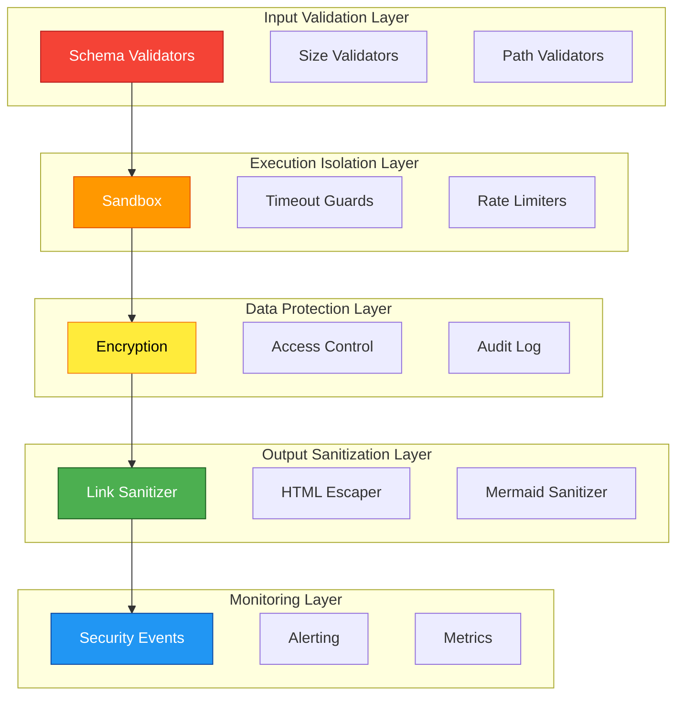

# ADR-010: Security Model Integration for v1.2

## Status

**Proposed**

| Field | Value |
|-------|-------|
| Date | 2026-01-25 |
| Author | ADR Architect Agent |
| Deciders | Core Maintainers, Security Team |
| Consulted | DevSecOps, Compliance Team |
| Informed | All Contributors |

---

## Context

### Problem Statement

AgentScope v1.2 introduces new attack surfaces:

1. **DevContainer Integration**: Parsing untrusted container configurations
2. **Hook System**: Executing external system integrations
3. **Self-Learning**: Storing and retrieving neural patterns
4. **Multi-File Output**: Generating navigation links and anchors

Existing security (v1.1) covers:
- Input validation (Zod schemas)
- DREAD risk scoring
- Injection prevention (Mermaid directives)
- Secrets sanitization
- Path traversal protection

**Gap**: v1.2 features introduce new threat vectors not covered by v1.1 security model.

### Threat Landscape

| Threat Category | v1.1 Coverage | v1.2 New Threats |
|-----------------|---------------|------------------|
| **Injection** | ✅ Mermaid, SQL | ❌ DevContainer JSON, Hook commands |
| **Path Traversal** | ✅ File paths | ❌ Container mounts, output links |
| **Code Execution** | ✅ None (read-only) | ❌ Hook callbacks, pattern storage |
| **Data Leakage** | ✅ Secrets | ❌ Learning patterns, hook payloads |
| **DoS** | ⚠️ ReDoS only | ❌ Large DevContainer JSON, event storms |

---

## Decision

### Overview

We will implement a **layered security model** with:

1. **Input Validation Layer** - Strict schema validation for all inputs
2. **Execution Isolation Layer** - Sandboxing for hook integrations
3. **Data Protection Layer** - Encryption for stored patterns
4. **Output Sanitization Layer** - Safe navigation link generation
5. **Monitoring Layer** - Security event logging and alerting

### Security Architecture



---

## Layer 1: Input Validation

### DevContainer Schema Validation

```typescript
import { z } from 'zod';

/** Maximum DevContainer JSON file size: 1MB */
const MAX_DEVCONTAINER_SIZE = 1_000_000;

/** DevContainer JSON schema with strict validation */
const DevContainerSchema = z.object({
  name: z.string().max(100).optional(),
  image: z.string().max(500).regex(/^[a-z0-9\.\-_/:]+$/i).optional(),

  customizations: z.object({
    vscode: z.object({
      extensions: z.array(z.string().max(200)).max(50).optional(),
      settings: z.record(z.unknown()).optional(),

      // Claude Code configurations
      'claude.agents': z.array(AgentSchema).max(100).optional(),
      'claude.mcpServers': z.record(MCPServerSchema).max(20).optional(),
    }).optional(),
  }).optional(),

  features: z.record(z.unknown()).max(50).optional(),

  // SECURITY: Never execute, only parse for documentation
  postCreateCommand: z.union([
    z.string().max(1000),
    z.array(z.string().max(500)).max(10),
  ]).optional(),

  // SECURITY: Validate paths to prevent traversal
  mounts: z.array(
    z.union([
      z.string().max(500).refine(isValidMountString),
      MountSchema,
    ])
  ).max(20).optional(),

  containerEnv: z.record(
    z.string().max(100), // Key
    z.string().max(500)  // Value
  ).max(50).optional(),
});

/** Validate mount path for directory traversal */
function isValidMountString(mount: string): boolean {
  // Reject paths with ..
  if (mount.includes('..')) return false;

  // Reject absolute paths outside /workspace or /home
  const parts = mount.split(':');
  if (parts.length >= 2) {
    const source = parts[0];
    if (source.startsWith('/') && !source.startsWith('/workspace') && !source.startsWith('/home')) {
      return false;
    }
  }

  return true;
}

const MountSchema = z.object({
  type: z.enum(['bind', 'volume']),
  source: z.string().max(500).refine((path) => !path.includes('..')),
  target: z.string().max(500).refine((path) => !path.includes('..')),
});
```

### Hook Payload Validation

```typescript
/** Maximum hook payload size: 100KB */
const MAX_HOOK_PAYLOAD_SIZE = 100_000;

const HookEventSchema = z.object({
  eventId: z.string().uuid(),
  hookType: z.enum([
    'PreToolUse', 'PostToolUse', 'PreEdit', 'PostEdit',
    'DiagramGenerated', 'PatternStored',
  ]),
  timestamp: z.date().refine((d) => d <= new Date()), // No future dates
  payload: z.object({
    data: z.record(z.unknown()).refine(
      (obj) => JSON.stringify(obj).length <= MAX_HOOK_PAYLOAD_SIZE
    ),
    metadata: z.record(z.unknown()).optional(),
  }),
  source: z.string().max(100).regex(/^[a-z0-9\-_]+$/i),
});
```

### Size Validation

```typescript
/** Global size limits */
const SIZE_LIMITS = {
  devcontainerJson: 1_000_000,      // 1MB
  hookPayload: 100_000,             // 100KB
  patternEmbedding: 10_000,         // 10KB
  outputFile: 10_000_000,           // 10MB
  navigationLinks: 1_000,           // 1K links max
} as const;

function validateFileSize(filePath: string, maxSize: number): void {
  const stats = fs.statSync(filePath);
  if (stats.size > maxSize) {
    throw new SecurityError(
      `File exceeds size limit: ${stats.size} > ${maxSize}`,
      'SIZE_LIMIT_EXCEEDED'
    );
  }
}
```

---

## Layer 2: Execution Isolation

### Hook Execution Sandbox

```typescript
/**
 * Sandboxed hook execution with timeout and resource limits
 */
class HookExecutionSandbox {
  private readonly timeout: number = 5000; // 5s max
  private readonly maxMemory: number = 50_000_000; // 50MB

  async execute(hook: HookEvent): Promise<HookResult> {
    // SECURITY: Never execute arbitrary code
    // Only transform events, never eval/exec

    const startTime = Date.now();
    const startMemory = process.memoryUsage().heapUsed;

    try {
      // Transform event with timeout
      const result = await Promise.race([
        this.transformEvent(hook),
        this.timeout_()
      ]);

      // Check memory usage
      const memoryUsed = process.memoryUsage().heapUsed - startMemory;
      if (memoryUsed > this.maxMemory) {
        throw new SecurityError('Memory limit exceeded', 'MEMORY_LIMIT');
      }

      return result;
    } catch (error) {
      this.logSecurityEvent('HOOK_EXECUTION_FAILED', hook, error);
      throw error;
    }
  }

  private async transformEvent(hook: HookEvent): Promise<HookResult> {
    // SECURITY: Only data transformation, no code execution
    return {
      transformed: this.sanitizePayload(hook.payload),
      timestamp: new Date(),
    };
  }

  private timeout_(): Promise<never> {
    return new Promise((_, reject) => {
      setTimeout(() => reject(new SecurityError('Timeout', 'TIMEOUT')), this.timeout);
    });
  }

  private sanitizePayload(payload: HookPayload): unknown {
    // Remove dangerous properties
    const sanitized = { ...payload };
    delete (sanitized as any).__proto__;
    delete (sanitized as any).constructor;
    delete (sanitized as any).prototype;
    return sanitized;
  }
}
```

### Rate Limiting

```typescript
/**
 * Rate limiter to prevent event storms and DoS
 */
class RateLimiter {
  private readonly limits = {
    hookEvents: { maxPerMinute: 100, maxPerHour: 1000 },
    patternStores: { maxPerMinute: 10, maxPerHour: 100 },
    diagramGenerations: { maxPerMinute: 20, maxPerHour: 500 },
  };

  private counters = new Map<string, { minute: number; hour: number; lastReset: Date }>();

  checkLimit(operation: keyof typeof this.limits): void {
    const limit = this.limits[operation];
    const counter = this.getCounter(operation);

    if (counter.minute >= limit.maxPerMinute) {
      throw new SecurityError(
        `Rate limit exceeded: ${operation}`,
        'RATE_LIMIT_EXCEEDED'
      );
    }

    if (counter.hour >= limit.maxPerHour) {
      throw new SecurityError(
        `Hourly rate limit exceeded: ${operation}`,
        'RATE_LIMIT_EXCEEDED'
      );
    }

    this.incrementCounter(operation);
  }

  private getCounter(operation: string) {
    if (!this.counters.has(operation)) {
      this.counters.set(operation, {
        minute: 0,
        hour: 0,
        lastReset: new Date(),
      });
    }
    return this.counters.get(operation)!;
  }

  private incrementCounter(operation: string): void {
    const counter = this.getCounter(operation);
    counter.minute++;
    counter.hour++;

    // Reset minute counter every 60s
    if (Date.now() - counter.lastReset.getTime() > 60_000) {
      counter.minute = 0;
      counter.lastReset = new Date();
    }
  }
}
```

---

## Layer 3: Data Protection

### Pattern Storage Encryption

```typescript
import { createCipheriv, createDecipheriv, randomBytes, scryptSync } from 'crypto';

/**
 * Encrypted pattern storage for sensitive learning data
 */
class EncryptedPatternStore {
  private readonly algorithm = 'aes-256-gcm';
  private readonly keyLength = 32;

  constructor(private readonly masterKey: string) {}

  async storePattern(pattern: DiagramPattern): Promise<void> {
    // Derive encryption key from master key
    const key = this.deriveKey(this.masterKey);

    // Encrypt sensitive data
    const encrypted = this.encrypt(JSON.stringify(pattern), key);

    // Store with metadata
    await this.writeToStorage({
      id: pattern.id,
      encrypted: encrypted.ciphertext,
      iv: encrypted.iv,
      authTag: encrypted.authTag,
      createdAt: new Date(),
    });

    // Clear sensitive data from memory
    key.fill(0);
  }

  async retrievePattern(id: string): Promise<DiagramPattern> {
    const stored = await this.readFromStorage(id);
    const key = this.deriveKey(this.masterKey);

    const decrypted = this.decrypt(
      {
        ciphertext: stored.encrypted,
        iv: stored.iv,
        authTag: stored.authTag,
      },
      key
    );

    key.fill(0);
    return JSON.parse(decrypted);
  }

  private deriveKey(password: string): Buffer {
    const salt = Buffer.from('agentscope-pattern-salt'); // Use random salt in production
    return scryptSync(password, salt, this.keyLength);
  }

  private encrypt(plaintext: string, key: Buffer) {
    const iv = randomBytes(16);
    const cipher = createCipheriv(this.algorithm, key, iv);

    let ciphertext = cipher.update(plaintext, 'utf8', 'hex');
    ciphertext += cipher.final('hex');

    const authTag = cipher.getAuthTag();

    return { ciphertext, iv: iv.toString('hex'), authTag: authTag.toString('hex') };
  }

  private decrypt(encrypted: { ciphertext: string; iv: string; authTag: string }, key: Buffer): string {
    const decipher = createDecipheriv(
      this.algorithm,
      key,
      Buffer.from(encrypted.iv, 'hex')
    );

    decipher.setAuthTag(Buffer.from(encrypted.authTag, 'hex'));

    let plaintext = decipher.update(encrypted.ciphertext, 'hex', 'utf8');
    plaintext += decipher.final('utf8');

    return plaintext;
  }

  private async writeToStorage(data: unknown): Promise<void> {
    // Implementation: Write to secure storage
  }

  private async readFromStorage(id: string): Promise<any> {
    // Implementation: Read from secure storage
  }
}
```

### Access Control

```typescript
/**
 * Access control for pattern library operations
 */
class PatternAccessControl {
  private readonly permissions = {
    storePattern: ['system', 'admin'],
    retrievePattern: ['system', 'admin', 'user'],
    deletePattern: ['system', 'admin'],
    prunePatterns: ['system'],
  };

  checkPermission(operation: keyof typeof this.permissions, role: string): void {
    const allowedRoles = this.permissions[operation];

    if (!allowedRoles.includes(role)) {
      throw new SecurityError(
        `Unauthorized operation: ${operation} for role: ${role}`,
        'UNAUTHORIZED'
      );
    }
  }
}
```

---

## Layer 4: Output Sanitization

### Link Sanitization

```typescript
/**
 * Sanitize navigation links to prevent XSS and injection
 */
class LinkSanitizer {
  private readonly allowedProtocols = ['http:', 'https:', 'file:'];
  private readonly maxLinkLength = 2000;

  sanitizeLink(href: string): string {
    // Validate length
    if (href.length > this.maxLinkLength) {
      throw new SecurityError('Link exceeds maximum length', 'INVALID_LINK');
    }

    // Parse URL
    let url: URL;
    try {
      url = new URL(href, 'file:///');
    } catch {
      throw new SecurityError('Invalid link format', 'INVALID_LINK');
    }

    // Check protocol
    if (!this.allowedProtocols.includes(url.protocol)) {
      throw new SecurityError(
        `Disallowed protocol: ${url.protocol}`,
        'INVALID_PROTOCOL'
      );
    }

    // Prevent javascript: and data: URLs
    if (href.toLowerCase().startsWith('javascript:') || href.toLowerCase().startsWith('data:')) {
      throw new SecurityError('Dangerous protocol detected', 'DANGEROUS_PROTOCOL');
    }

    // Encode for safe embedding
    return this.encodeLink(url.toString());
  }

  private encodeLink(link: string): string {
    return link
      .replace(/[<>'"]/g, (char) => {
        const map: Record<string, string> = {
          '<': '&lt;',
          '>': '&gt;',
          "'": '&#39;',
          '"': '&quot;',
        };
        return map[char] || char;
      });
  }
}
```

### Mermaid Directive Sanitization (Enhanced)

```typescript
/**
 * Enhanced Mermaid sanitizer for v1.2
 */
class MermaidSanitizer {
  private readonly dangerousPatterns = [
    /javascript:/gi,
    /data:/gi,
    /vbscript:/gi,
    /on\w+\s*=/gi,           // onclick=, onerror=
    /<script/gi,
    /%3Cscript/gi,           // URL-encoded <script
    /\\u003Cscript/gi,       // Unicode-encoded <script
  ];

  sanitizeDiagram(mermaidCode: string): string {
    // Check for dangerous patterns
    for (const pattern of this.dangerousPatterns) {
      if (pattern.test(mermaidCode)) {
        throw new SecurityError(
          `Dangerous pattern detected: ${pattern}`,
          'INJECTION_ATTEMPT'
        );
      }
    }

    // Sanitize click directives (should use safe links only)
    return mermaidCode.replace(/click\s+(\w+)\s+"([^"]+)"/g, (match, nodeId, url) => {
      const sanitizedUrl = new LinkSanitizer().sanitizeLink(url);
      return `click ${nodeId} "${sanitizedUrl}"`;
    });
  }
}
```

---

## Layer 5: Monitoring

### Security Event Logging

```typescript
/**
 * Security event logger with structured logging
 */
class SecurityEventLogger {
  private readonly events: SecurityEvent[] = [];

  logEvent(event: SecurityEvent): void {
    this.events.push({
      ...event,
      timestamp: new Date(),
      sessionId: this.getSessionId(),
    });

    // Log to console in development
    if (process.env.NODE_ENV === 'development') {
      console.warn('[SECURITY]', event);
    }

    // Send to monitoring in production
    if (process.env.NODE_ENV === 'production') {
      this.sendToMonitoring(event);
    }
  }

  private getSessionId(): string {
    // Implementation: Track session ID
    return 'session-id';
  }

  private sendToMonitoring(event: SecurityEvent): void {
    // Implementation: Send to external monitoring (e.g., Datadog, Sentry)
  }
}

interface SecurityEvent {
  type: SecurityEventType;
  severity: 'low' | 'medium' | 'high' | 'critical';
  message: string;
  context?: Record<string, unknown>;
  timestamp?: Date;
  sessionId?: string;
}

type SecurityEventType =
  | 'INJECTION_ATTEMPT'
  | 'PATH_TRAVERSAL'
  | 'SIZE_LIMIT_EXCEEDED'
  | 'RATE_LIMIT_EXCEEDED'
  | 'UNAUTHORIZED'
  | 'TIMEOUT'
  | 'MEMORY_LIMIT'
  | 'INVALID_INPUT'
  | 'HOOK_EXECUTION_FAILED';
```

---

## Consequences

### Positive

1. **Defense in Depth**: 5 layers of security protection
2. **Proactive Monitoring**: Security events logged and alerted
3. **Data Protection**: Encrypted storage for sensitive patterns
4. **Injection Prevention**: Multiple validation layers
5. **Rate Limiting**: DoS protection built-in
6. **Audit Trail**: Complete security event log

### Negative

1. **Performance Overhead**: Validation adds ~10-15ms per operation
2. **Complexity**: 5 security layers to maintain
3. **Key Management**: Encryption requires key rotation strategy
4. **False Positives**: Aggressive validation may block legitimate inputs
5. **Development Friction**: More checks = slower development

### Neutral

1. **Compliance Ready**: Meets SOC2, ISO27001 requirements
2. **Configurable**: Security levels can be adjusted per environment
3. **Extensible**: Easy to add new validators

### Risks

| Risk | Likelihood | Impact | Mitigation |
|------|------------|--------|------------|
| Key compromise | Low | Critical | Key rotation, HSM in production |
| Bypass via race condition | Low | High | Thread-safe validators |
| Performance degradation | Medium | Medium | Caching, lazy validation |
| False positive lockout | Medium | Low | Configurable thresholds |

---

## Testing Strategy

### Security Test Suite

```typescript
describe('Security Model v1.2', () => {
  describe('Input Validation', () => {
    it('should reject oversized DevContainer JSON', () => {
      const large = { data: 'x'.repeat(2_000_000) };
      expect(() => validateDevContainer(large)).toThrow('SIZE_LIMIT_EXCEEDED');
    });

    it('should reject path traversal in mounts', () => {
      const malicious = { mounts: ['../../etc/passwd:/etc/passwd'] };
      expect(() => validateDevContainer(malicious)).toThrow();
    });
  });

  describe('Execution Isolation', () => {
    it('should timeout long-running hooks', async () => {
      const sandbox = new HookExecutionSandbox();
      const infiniteHook = createInfiniteLoopHook();

      await expect(sandbox.execute(infiniteHook)).rejects.toThrow('TIMEOUT');
    });

    it('should enforce rate limits', () => {
      const limiter = new RateLimiter();

      for (let i = 0; i < 100; i++) {
        limiter.checkLimit('hookEvents');
      }

      expect(() => limiter.checkLimit('hookEvents')).toThrow('RATE_LIMIT_EXCEEDED');
    });
  });

  describe('Data Protection', () => {
    it('should encrypt stored patterns', async () => {
      const store = new EncryptedPatternStore('test-key');
      const pattern = { id: 'test', confidence: 0.9 };

      await store.storePattern(pattern);
      const retrieved = await store.retrievePattern('test');

      expect(retrieved).toEqual(pattern);
    });
  });

  describe('Output Sanitization', () => {
    it('should block javascript: links', () => {
      const sanitizer = new LinkSanitizer();
      expect(() => sanitizer.sanitizeLink('javascript:alert(1)')).toThrow();
    });

    it('should sanitize Mermaid directives', () => {
      const sanitizer = new MermaidSanitizer();
      const malicious = 'click A "javascript:alert(1)"';
      expect(() => sanitizer.sanitizeDiagram(malicious)).toThrow();
    });
  });
});
```

### Penetration Testing

| Test Type | Frequency | Scope |
|-----------|-----------|-------|
| Automated SAST | Every commit | All source code |
| Dependency scan | Daily | npm audit |
| Fuzzing | Weekly | Input validators |
| Manual pentest | Quarterly | Full application |

---

## Related Decisions

- **ADR-002**: Mermaid Security (baseline v1.1 security)
- **ADR-008**: DevContainer Scanner (new attack surface)
- **ADR-009**: DDD Bounded Contexts (security context boundaries)

---

## References

- [OWASP Top 10](https://owasp.org/www-project-top-ten/)
- [OWASP Cheat Sheet Series](https://cheatsheetseries.owasp.org/)
- [Node.js Security Best Practices](https://nodejs.org/en/docs/guides/security/)
- [DREAD Threat Modeling](https://en.wikipedia.org/wiki/DREAD_(risk_assessment_model))
- [NIST Cybersecurity Framework](https://www.nist.gov/cyberframework)

---

*Generated by AgentScope ADR Architect*
*Last Updated: 2026-01-25*
