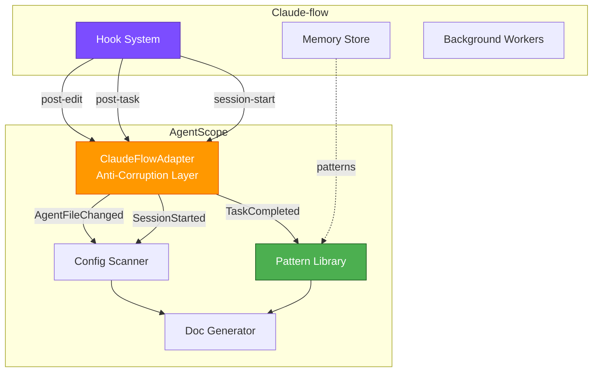

# ADR-011: Claude-flow Hooks Integration

## Status

**Proposed**

| Field | Value |
|-------|-------|
| Date | 2026-01-25 |
| Author | ADR Architect Agent |
| Deciders | Core Maintainers |
| Consulted | Integration Team, Claude-flow Maintainers |
| Informed | All Contributors |

---

## Context

### Problem Statement

AgentScope v1.2 needs to integrate with claude-flow's hooks system to enable:

1. **Real-time Documentation Updates**: Auto-update docs when agents change
2. **Usage Pattern Learning**: Learn from actual agent usage in development
3. **Configuration Validation**: Validate configs before claude-flow executes
4. **Event-Driven Architecture**: React to claude-flow lifecycle events

Claude-flow provides 27 hooks + 12 background workers:

| Hook Category | Hooks | Relevant to AgentScope |
|---------------|-------|------------------------|
| **File Operations** | `pre-edit`, `post-edit` | ✅ Agent file changes |
| **Task Management** | `pre-task`, `post-task` | ✅ Learning patterns |
| **Session** | `session-start`, `session-end`, `session-restore` | ✅ Config discovery |
| **Intelligence** | `route`, `explain`, `pretrain`, `build-agents` | ✅ Pattern suggestions |
| **Workers** | 12 background workers | ⚠️ Selective integration |

**Challenge**: AgentScope is a CLI tool that needs to:
- Subscribe to claude-flow hooks when available
- Work standalone when claude-flow not present
- Avoid becoming dependent on claude-flow internals
- Maintain security boundaries

---

## Decision

### Overview

We will implement a **loosely-coupled integration** using:

1. **Hook Adapter Pattern** - Anti-Corruption Layer for claude-flow events
2. **Optional Integration** - Works with or without claude-flow
3. **Event-Driven Updates** - Real-time doc generation on file changes
4. **Pattern Learning** - Learn from actual usage via `post-task` events
5. **Graceful Degradation** - Fall back to polling if hooks unavailable

### Integration Architecture



### Hook Subscriptions

#### 1. File Change Detection (`post-edit`)

**Purpose**: Auto-regenerate docs when agent files change.

```typescript
/**
 * Subscribe to post-edit hook to detect agent file changes
 */
async function subscribePostEdit(adapter: ClaudeFlowAdapter): Promise<void> {
  await adapter.subscribe('post-edit', async (event) => {
    const filePath = event.payload.filePath;

    // Check if it's an agent-related file
    if (isAgentFile(filePath)) {
      // Trigger incremental doc update
      await updateDocumentation(filePath);

      // Log to learning system
      await logFileChange(filePath, event.payload.success);
    }
  });
}

function isAgentFile(filePath: string): boolean {
  return (
    filePath.includes('/.claude/agents/') ||
    filePath.endsWith('.claude/settings.json') ||
    filePath.endsWith('.mcp.json') ||
    filePath === 'CLAUDE.md'
  );
}
```

#### 2. Task Pattern Learning (`post-task`)

**Purpose**: Learn diagram preferences from actual task completions.

```typescript
/**
 * Subscribe to post-task to learn successful patterns
 */
async function subscribePostTask(adapter: ClaudeFlowAdapter): Promise<void> {
  await adapter.subscribe('post-task', async (event) => {
    const { taskId, success, agent } = event.payload;

    if (success) {
      // Extract config signature
      const config = await scanCurrentConfig();
      const signature = computeConfigSignature(config);

      // Store successful pattern
      await patternLibrary.storePattern({
        id: generatePatternId(),
        configSignature: signature,
        suggestedDiagrams: inferDiagramTypes(agent, config),
        confidence: 0.7, // Initial confidence
        usageCount: 1,
        successRate: 1.0,
        lastUsed: new Date(),
      });
    }
  });
}

function inferDiagramTypes(agent: string, config: AgentScopeConfig): DiagramType[] {
  // Heuristics based on agent type
  const diagrams: DiagramType[] = ['component-map']; // Always include

  if (config.agents.length > 10) {
    diagrams.push('hierarchy');
  }

  if (config.mcpServers.length > 0) {
    diagrams.push('dataflow');
  }

  return diagrams;
}
```

#### 3. Session Discovery (`session-start`)

**Purpose**: Auto-scan config on claude-flow session start.

```typescript
/**
 * Subscribe to session-start to auto-discover configs
 */
async function subscribeSessionStart(adapter: ClaudeFlowAdapter): Promise<void> {
  await adapter.subscribe('session-start', async (event) => {
    const sessionId = event.payload.sessionId;

    // Auto-scan project on session start
    const config = await scanProject(process.cwd());

    // Store in memory for quick access
    await adapter.storeInMemory('agentscope:config', config);

    // Log discovery
    console.log(`[AgentScope] Discovered ${config.agents.length} agents in session ${sessionId}`);
  });
}
```

### Anti-Corruption Layer

```typescript
/**
 * ClaudeFlowAdapter - Anti-Corruption Layer
 * Translates claude-flow events to AgentScope domain events
 */
class ClaudeFlowAdapter {
  private readonly hooks: HookClient;
  private readonly memory: MemoryClient;

  constructor(
    private readonly config: {
      cliPath: string;
      enabled: boolean;
    }
  ) {
    if (config.enabled) {
      this.hooks = new HookClient(config.cliPath);
      this.memory = new MemoryClient(config.cliPath);
    }
  }

  /**
   * Subscribe to a claude-flow hook
   */
  async subscribe(
    hookType: ClaudeFlowHookType,
    handler: (event: AgentScopeEvent) => Promise<void>
  ): Promise<void> {
    if (!this.config.enabled) {
      return; // Graceful no-op if disabled
    }

    await this.hooks.subscribe(hookType, async (rawEvent: unknown) => {
      try {
        // SECURITY: Validate event before processing
        const validated = ClaudeFlowEventSchema.parse(rawEvent);

        // Transform to domain event
        const domainEvent = this.transformEvent(validated);

        // Execute handler
        await handler(domainEvent);
      } catch (error) {
        // Log but don't throw (resilient integration)
        console.error('[AgentScope] Hook handler error:', error);
      }
    });
  }

  /**
   * Transform claude-flow event to AgentScope domain event
   */
  private transformEvent(event: ClaudeFlowEvent): AgentScopeEvent {
    switch (event.hookType) {
      case 'post-edit':
        return {
          type: 'AgentFileChanged',
          timestamp: new Date(event.timestamp),
          filePath: event.payload.filePath as string,
          success: event.payload.success as boolean,
        };

      case 'post-task':
        return {
          type: 'TaskCompleted',
          timestamp: new Date(event.timestamp),
          taskId: event.payload.taskId as string,
          agent: event.payload.agent as string,
          success: event.payload.success as boolean,
        };

      case 'session-start':
        return {
          type: 'SessionStarted',
          timestamp: new Date(event.timestamp),
          sessionId: event.payload.sessionId as string,
        };

      default:
        throw new Error(`Unsupported hook type: ${event.hookType}`);
    }
  }

  /**
   * Store data in claude-flow memory
   */
  async storeInMemory(key: string, value: unknown): Promise<void> {
    if (!this.config.enabled) {
      return;
    }

    await this.memory.store(key, value, { namespace: 'agentscope' });
  }

  /**
   * Retrieve data from claude-flow memory
   */
  async retrieveFromMemory(key: string): Promise<unknown | undefined> {
    if (!this.config.enabled) {
      return undefined;
    }

    return await this.memory.retrieve(key, { namespace: 'agentscope' });
  }

  /**
   * Check if claude-flow is available
   */
  async isAvailable(): Promise<boolean> {
    if (!this.config.enabled) {
      return false;
    }

    try {
      await this.hooks.ping();
      return true;
    } catch {
      return false;
    }
  }
}
```

### Hook Client Implementation

```typescript
/**
 * Low-level hook client (spawns claude-flow CLI)
 */
class HookClient {
  constructor(private readonly cliPath: string) {}

  async subscribe(
    hookType: ClaudeFlowHookType,
    handler: (event: unknown) => Promise<void>
  ): Promise<void> {
    // IMPLEMENTATION: Spawn claude-flow CLI in watch mode
    // This is a simplified example; actual implementation uses IPC

    const process = spawn(this.cliPath, [
      'hooks',
      'watch',
      '--event',
      hookType,
      '--json',
    ]);

    process.stdout.on('data', async (data) => {
      try {
        const event = JSON.parse(data.toString());
        await handler(event);
      } catch (error) {
        console.error('[HookClient] Parse error:', error);
      }
    });

    process.on('error', (error) => {
      console.error('[HookClient] Process error:', error);
    });
  }

  async ping(): Promise<void> {
    // Check if claude-flow CLI is available
    await execAsync(`${this.cliPath} --version`);
  }
}

class MemoryClient {
  constructor(private readonly cliPath: string) {}

  async store(key: string, value: unknown, options?: { namespace?: string }): Promise<void> {
    const args = ['memory', 'store', '--key', key, '--value', JSON.stringify(value)];

    if (options?.namespace) {
      args.push('--namespace', options.namespace);
    }

    await execAsync(`${this.cliPath} ${args.join(' ')}`);
  }

  async retrieve(key: string, options?: { namespace?: string }): Promise<unknown> {
    const args = ['memory', 'retrieve', '--key', key];

    if (options?.namespace) {
      args.push('--namespace', options.namespace);
    }

    const { stdout } = await execAsync(`${this.cliPath} ${args.join(' ')}`);
    return JSON.parse(stdout);
  }
}
```

### Configuration

```typescript
/**
 * AgentScope config with claude-flow integration
 */
interface AgentScopeConfig {
  // ... existing config

  /** Claude-flow integration settings */
  claudeFlow?: {
    /** Enable claude-flow integration */
    enabled: boolean;

    /** Path to claude-flow CLI */
    cliPath: string;

    /** Hooks to subscribe to */
    hooks: ClaudeFlowHookType[];

    /** Auto-regenerate docs on file changes */
    autoRegenerate: boolean;

    /** Store patterns in claude-flow memory */
    storePatterns: boolean;
  };
}
```

Example configuration:

```json
{
  "agentScope": {
    "claudeFlow": {
      "enabled": true,
      "cliPath": "npx @claude-flow/cli@latest",
      "hooks": ["post-edit", "post-task", "session-start"],
      "autoRegenerate": true,
      "storePatterns": true
    }
  }
}
```

### CLI Integration

```bash
# Enable claude-flow integration
agentscope scan --enable-claude-flow

# Disable claude-flow integration
agentscope scan --no-claude-flow

# Watch mode (requires claude-flow)
agentscope watch --enable-claude-flow

# Store current config in claude-flow memory
agentscope sync-to-claude-flow
```

---

## Consequences

### Positive

1. **Real-time Updates**: Docs auto-regenerate on agent changes
2. **Usage Learning**: Learns from actual development patterns
3. **Seamless Integration**: Works naturally with claude-flow workflows
4. **Optional Dependency**: Works standalone if claude-flow not installed
5. **Memory Sharing**: Leverage claude-flow's AgentDB for pattern storage
6. **Future-Proof**: Easy to add more hook subscriptions

### Negative

1. **Added Complexity**: Hook subscription and event transformation
2. **Dependency Risk**: Breaking changes in claude-flow hooks API
3. **Process Overhead**: Spawning CLI processes adds latency (~50ms)
4. **Testing Difficulty**: Need to mock claude-flow CLI
5. **Version Compatibility**: Must support multiple claude-flow versions

### Neutral

1. **Hook Proliferation**: More hooks = more integration points
2. **Memory Overhead**: Event queue can grow in long sessions
3. **Documentation Burden**: Need to document integration setup

### Risks

| Risk | Likelihood | Impact | Mitigation |
|------|------------|--------|------------|
| Claude-flow API changes | High | Medium | Version detection, adapter pattern |
| Hook event storm | Medium | High | Rate limiting, debouncing |
| Process spawn failures | Low | Medium | Retry logic, fallback to polling |
| Memory leaks from subscriptions | Low | Medium | Cleanup on shutdown |

---

## Alternatives Considered

### Alternative 1: Direct Library Import

**Description**: Import claude-flow as npm dependency.

**Pros**:
- Faster integration (in-process)
- Type safety
- No process spawning

**Cons**:
- Tight coupling
- Forces users to install claude-flow
- Version conflicts

**Decision**: Rejected - Too tightly coupled.

### Alternative 2: Webhook Server

**Description**: Run AgentScope as HTTP server, subscribe to webhooks.

**Pros**:
- Language-agnostic
- Standard integration pattern
- Scalable

**Cons**:
- AgentScope is a CLI tool, not a server
- Port conflicts
- Security (open port)

**Decision**: Rejected - Wrong architecture for CLI tool.

### Alternative 3: File Watching

**Description**: Watch agent files with `fs.watch()`, no claude-flow needed.

**Pros**:
- No external dependency
- Simple implementation
- Fast

**Cons**:
- Misses task completion events
- No access to claude-flow memory
- Duplicate functionality

**Decision**: Deferred - Use as fallback.

### Alternative 4: MCP Server Integration

**Description**: Implement AgentScope as MCP server, integrate via MCP protocol.

**Pros**:
- Standard protocol
- Natural fit for claude-flow
- Tool-based interaction

**Cons**:
- MCP is for Claude Code, not inter-CLI
- Overengineered for doc generation
- Added complexity

**Decision**: Deferred - Consider for v2.0.

---

## Implementation Notes

### Detection Logic

```typescript
/**
 * Detect if claude-flow is available
 */
async function detectClaudeFlow(): Promise<boolean> {
  try {
    await execAsync('npx @claude-flow/cli@latest --version');
    return true;
  } catch {
    return false;
  }
}

/**
 * Auto-configure claude-flow integration
 */
async function autoConfigureClaudeFlow(): Promise<void> {
  const available = await detectClaudeFlow();

  if (available) {
    console.log('[AgentScope] Claude-flow detected, enabling integration');

    // Initialize adapter
    const adapter = new ClaudeFlowAdapter({
      cliPath: 'npx @claude-flow/cli@latest',
      enabled: true,
    });

    // Subscribe to relevant hooks
    await subscribePostEdit(adapter);
    await subscribePostTask(adapter);
    await subscribeSessionStart(adapter);
  } else {
    console.log('[AgentScope] Claude-flow not found, running standalone');
  }
}
```

### Graceful Degradation

```typescript
/**
 * Fallback to file watching if claude-flow unavailable
 */
async function fallbackToFileWatch(): Promise<void> {
  const agentDirs = [
    '.claude/agents',
    '.claude/skills',
    '.claude',
  ];

  for (const dir of agentDirs) {
    fs.watch(dir, { recursive: true }, async (eventType, filename) => {
      if (eventType === 'change' && filename) {
        await updateDocumentation(path.join(dir, filename));
      }
    });
  }
}
```

---

## Testing Strategy

### Unit Tests

```typescript
describe('ClaudeFlowAdapter', () => {
  it('should transform post-edit events', () => {
    const adapter = new ClaudeFlowAdapter({ cliPath: 'mock', enabled: true });

    const claudeFlowEvent = {
      hookType: 'post-edit',
      timestamp: '2026-01-25T00:00:00Z',
      payload: { filePath: '.claude/agents/test.md', success: true },
    };

    const domainEvent = adapter['transformEvent'](claudeFlowEvent);

    expect(domainEvent.type).toBe('AgentFileChanged');
    expect(domainEvent.filePath).toBe('.claude/agents/test.md');
  });

  it('should gracefully handle unavailable claude-flow', async () => {
    const adapter = new ClaudeFlowAdapter({ cliPath: 'nonexistent', enabled: true });

    const available = await adapter.isAvailable();
    expect(available).toBe(false);
  });
});
```

### Integration Tests

```typescript
describe('Claude-flow Integration', () => {
  it('should auto-regenerate docs on agent file change', async () => {
    const adapter = new ClaudeFlowAdapter({ cliPath: 'mock', enabled: true });

    // Simulate file change
    await adapter['transformEvent']({
      hookType: 'post-edit',
      timestamp: new Date().toISOString(),
      payload: { filePath: '.claude/agents/test.md', success: true },
    });

    // Check docs updated
    const docs = await readFile('docs/agent-architecture/README.md', 'utf8');
    expect(docs).toContain('test');
  });
});
```

---

## Related Decisions

- **ADR-009**: DDD Bounded Contexts (IntegrationContext defined)
- **ADR-010**: Security Model (hook event validation)
- **ADR-012**: Self-Learning System (pattern learning from hooks)

---

## References

- [Claude-flow Hooks Documentation](https://github.com/ruvnet/claude-flow)
- [Event-Driven Architecture](https://martinfowler.com/articles/201701-event-driven.html)
- [Anti-Corruption Layer Pattern](https://docs.microsoft.com/en-us/azure/architecture/patterns/anti-corruption-layer)
- [Observer Pattern](https://refactoring.guru/design-patterns/observer)

---

*Generated by AgentScope ADR Architect*
*Last Updated: 2026-01-25*
