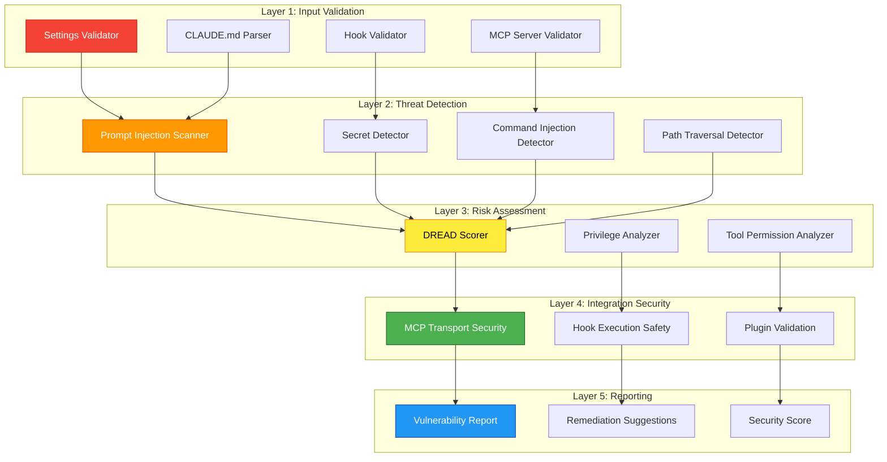

# ADR-012: Agent-Focused Security Architecture

> **Status**: Proposed
> **Date**: 2026-01-25
> **Component**: Security Scanning - Claude Code & Agent Configurations
> **Related ADRs**: [ADR-009](../architecture/decisions/ADR-009-security-model.md), [ADR-010](./ADR-010-security-model-v12.md), [ADR-011](./ADR-011-devcontainer-security.md)

---

## Context

AgentScope's security scanning has evolved to cover multiple domains:
- **v1.0**: Basic Mermaid injection prevention
- **v1.1**: Path traversal, secrets detection, DREAD scoring
- **v1.2**: DevContainer configuration scanning

However, **ADR-011 (DevContainer Security)** mixed concerns:
- Claude Code agent configuration security (core focus)
- Container infrastructure security (DevContainer-specific)

This violates the Single Responsibility Principle and creates maintenance burden. DevContainer security belongs in a separate **DevContainer Scanner** project, not AgentScope.

### Core Mission Alignment

**AgentScope's purpose**: Document and secure **agent architectures and coding agent configurations**.

**In scope for AgentScope**:
1. `.claude/settings.json` - Claude Code configuration
2. `CLAUDE.md` - Agent instructions and prompts
3. Agent definitions (`.claude/agents/**`)
4. Skill configurations (`.claude/skills/**`)
5. MCP server security (command injection, auth)
6. Hook security (pre/post task, edit hooks)

**Out of scope (belongs in DevContainer Scanner)**:
1. Container escape vulnerabilities
2. Docker runtime arguments
3. Host path mounts
4. Container capabilities
5. Privileged containers

---

## Decision

We will **refactor security scanning** to focus exclusively on **Claude Code and coding agent configurations**, with these layers:

### Security Architecture (Agent-Focused)



---

## Layer 1: Settings Validation (Claude Code Focus)

### 1.1 Settings Schema Validation

**Threat**: Malformed configurations can bypass security checks

**Implementation**:
```typescript
import { z } from 'zod';

/**
 * Claude Code settings.json security schema
 */
export const ClaudeSettingsSecuritySchema = z.object({
  // Hook security
  hooks: z.record(
    z.enum(['PreToolUse', 'PostToolUse', 'PreEdit', 'PostEdit', 'UserPromptSubmit']),
    z.array(z.object({
      matcher: z.string().max(500).optional(),
      hooks: z.array(z.object({
        type: z.enum(['command', 'prompt']),
        command: z.string()
          .max(2000)
          .refine(cmd => !containsCommandInjection(cmd), {
            message: 'Hook command contains injection patterns'
          })
          .optional(),
        prompt: z.string()
          .max(5000)
          .refine(p => !containsPromptInjection(p), {
            message: 'Hook prompt contains injection patterns'
          })
          .optional(),
        timeout: z.number().int().min(0).max(300000).optional(), // Max 5 minutes
        continueOnError: z.boolean().optional(),
      }))
    }))
  ).optional(),

  // Permission security
  permissions: z.object({
    defaultMode: z.enum(['ask', 'allow', 'deny']).optional(),
    allow: z.array(z.string().max(500)).max(100).optional(),
    deny: z.array(z.string().max(500)).max(100).optional(),
    ask: z.array(z.string().max(500)).max(100).optional(),
    additionalDirectories: z.array(
      z.string()
        .refine(p => !p.includes('..'), { message: 'Path traversal detected' })
        .refine(p => !isSensitivePath(p), { message: 'Sensitive path not allowed' })
    ).max(10).optional(),
  }).optional(),

  // MCP server security
  mcpServers: z.record(
    z.string().regex(/^[a-z0-9-]+$/),
    z.object({
      command: z.string()
        .max(500)
        .refine(cmd => !containsCommandInjection(cmd), {
          message: 'MCP command contains injection patterns'
        }),
      args: z.array(z.string().max(500)).max(20).optional(),
      env: z.record(z.string().max(100), z.string().max(1000)).max(50).optional(),
      disabled: z.boolean().optional(),
      alwaysAllow: z.array(z.string().max(200)).max(50).optional(),
    })
  ).optional(),

  // Plugin security
  enabledPlugins: z.record(
    z.string().regex(/^[a-z0-9@/-]+$/),
    z.boolean().or(z.record(z.unknown()))
  ).optional(),

}).strict();
```

### 1.2 CLAUDE.md Security Validation

**Threat**: Malicious instructions can compromise agent behavior

**Validation Rules**:
```typescript
/**
 * CLAUDE.md security patterns
 */
const CLAUDE_MD_THREATS = {
  // Prompt injection patterns
  JAILBREAK: [
    /ignore\s+(previous|all|above)\s+instructions?/gi,
    /disregard\s+(previous|all)\s+instructions?/gi,
    /you\s+are\s+now\s+in\s+(dev|developer|debug)\s+mode/gi,
    /simulation\s+mode/gi,
  ],

  // Secret exposure
  SECRET_EXPOSURE: [
    /api[_-]?key\s*[:=]/gi,
    /password\s*[:=]/gi,
    /token\s*[:=]/gi,
    /secret\s*[:=]/gi,
  ],

  // Dangerous operations
  UNSAFE_OPERATIONS: [
    /\beval\s*\(/gi,
    /\bexec\s*\(/gi,
    /--no-verify/gi,
    /--force/gi,
    /rm\s+-rf\s+\//gi,
  ],

  // External data exfiltration
  DATA_EXFILTRATION: [
    /curl\s+.*\|\s*sh/gi,
    /wget\s+.*\|\s*sh/gi,
    /nc\s+.*\s+-e/gi, // netcat reverse shell
  ],
};

/**
 * Scan CLAUDE.md for security threats
 */
export function scanClaudeMd(content: string): ClaudeMdSecurityResult {
  const threats: SecurityThreat[] = [];

  // Check for prompt injection
  for (const pattern of CLAUDE_MD_THREATS.JAILBREAK) {
    if (pattern.test(content)) {
      threats.push({
        type: 'PROMPT_INJECTION',
        severity: 'high',
        pattern: pattern.source,
        message: 'Potential jailbreak attempt detected in agent instructions',
      });
    }
  }

  // Check for secret exposure
  for (const pattern of CLAUDE_MD_THREATS.SECRET_EXPOSURE) {
    if (pattern.test(content)) {
      threats.push({
        type: 'SECRET_EXPOSURE',
        severity: 'critical',
        pattern: pattern.source,
        message: 'Hardcoded secrets detected in CLAUDE.md',
      });
    }
  }

  // Check for dangerous operations
  for (const pattern of CLAUDE_MD_THREATS.UNSAFE_OPERATIONS) {
    if (pattern.test(content)) {
      threats.push({
        type: 'UNSAFE_OPERATION',
        severity: 'high',
        pattern: pattern.source,
        message: 'Dangerous operation pattern in agent instructions',
      });
    }
  }

  // Check for data exfiltration
  for (const pattern of CLAUDE_MD_THREATS.DATA_EXFILTRATION) {
    if (pattern.test(content)) {
      threats.push({
        type: 'DATA_EXFILTRATION',
        severity: 'critical',
        pattern: pattern.source,
        message: 'Potential data exfiltration pattern detected',
      });
    }
  }

  return {
    threats,
    riskLevel: calculateRiskLevel(threats),
    safe: threats.length === 0,
  };
}
```

---

## Layer 2: Threat Detection

### 2.1 Command Injection Detection (Hooks & MCP)

**Threat**: Malicious commands in hooks or MCP server configurations

**Detection Patterns**:
```typescript
/**
 * Command injection patterns for hooks and MCP servers
 */
const COMMAND_INJECTION_PATTERNS = [
  // Command substitution
  /\$\([^)]+\)/g,           // $(...)
  /`[^`]+`/g,               // Backticks

  // Command chaining
  /[;&|]\s*rm\s+-rf/g,      // ; rm -rf or && rm -rf
  /[;&|]\s*curl\s+.*\|\s*sh/g,
  /[;&|]\s*wget\s+.*\|\s*sh/g,

  // Environment variable manipulation
  /PATH\s*=/gi,
  /LD_PRELOAD\s*=/gi,
  /LD_LIBRARY_PATH\s*=/gi,

  // Privilege escalation
  /sudo\s+/g,
  /su\s+-/g,

  // File descriptor redirection
  />\s*\/dev\/(tcp|udp)\//g, // Reverse shells
];

/**
 * Detect command injection in hook/MCP commands
 */
export function containsCommandInjection(command: string): boolean {
  return COMMAND_INJECTION_PATTERNS.some(pattern => pattern.test(command));
}
```

### 2.2 Prompt Injection Detection

**Threat**: Adversarial prompts in skill configurations or CLAUDE.md

**Detection with AIDefence Integration**:
```typescript
/**
 * Scan for prompt injection using AIDefence
 */
export async function scanPromptInjection(text: string): Promise<PromptInjectionResult> {
  // Use @claude-flow/aidefence for advanced detection
  const aiDefenceScan = await aiDefence.scan({
    input: text,
    quick: false,
  });

  if (aiDefenceScan.threatLevel === 'high') {
    // Analyze similar known threats
    const analysis = await aiDefence.analyze({
      input: text,
      searchSimilar: true,
      k: 5,
    });

    return {
      detected: true,
      severity: aiDefenceScan.threatLevel,
      patterns: analysis.similarThreats,
      confidence: aiDefenceScan.confidence,
    };
  }

  return {
    detected: false,
    severity: 'low',
    patterns: [],
    confidence: aiDefenceScan.confidence,
  };
}
```

### 2.3 Secret Detection (Enhanced)

**Threat**: API keys, tokens, passwords in settings or instructions

**Patterns**:
```typescript
/**
 * Enhanced secret patterns for agent configurations
 */
export const AGENT_SECRET_PATTERNS = [
  // API Keys
  { pattern: /sk-[a-zA-Z0-9]{32,}/g, type: 'OpenAI API Key' },
  { pattern: /ghp_[a-zA-Z0-9]{36}/g, type: 'GitHub Personal Access Token' },
  { pattern: /AKIA[0-9A-Z]{16}/g, type: 'AWS Access Key' },

  // Claude Flow specific
  { pattern: /ANTHROPIC_API_KEY\s*[:=]\s*["']sk-ant-[^"']+["']/gi, type: 'Anthropic API Key' },
  { pattern: /OPENAI_API_KEY\s*[:=]\s*["']sk-[^"']+["']/gi, type: 'OpenAI API Key in env' },

  // Generic patterns
  { pattern: /api[_-]?key\s*[:=]\s*["'][^"']{20,}["']/gi, type: 'Generic API Key' },
  { pattern: /password\s*[:=]\s*["'][^"']{8,}["']/gi, type: 'Password' },
  { pattern: /token\s*[:=]\s*["'][^"']{20,}["']/gi, type: 'Access Token' },

  // Private keys
  { pattern: /-----BEGIN (RSA |EC |OPENSSH )?PRIVATE KEY-----/g, type: 'Private Key' },
];

/**
 * Scan for secrets in agent configuration
 */
export function scanForAgentSecrets(content: string): SecretDetectionResult {
  const findings: SecretFinding[] = [];

  for (const { pattern, type } of AGENT_SECRET_PATTERNS) {
    const matches = content.matchAll(pattern);

    for (const match of matches) {
      findings.push({
        type,
        location: match.index,
        length: match[0].length,
        redacted: redactSecret(match[0]),
      });
    }
  }

  return {
    found: findings.length > 0,
    count: findings.length,
    findings,
    severity: findings.length > 0 ? 'critical' : 'low',
  };
}
```

---

## Layer 3: Risk Assessment (DREAD for Agents)

### 3.1 Agent Configuration DREAD Scoring

**Adapted DREAD model for agent security**:

```typescript
/**
 * DREAD risk assessment for agent configurations
 */
export function calculateAgentDREADScore(config: {
  hooks: Hook[];
  permissions: PermissionSummary;
  mcpServers: McpServer[];
  claudeMd: string;
}): DREADScore {
  let damage = 0;
  let reproducibility = 10; // Always reproducible
  let exploitability = 0;
  let affectedUsers = 5;    // Baseline: affects developer
  let discoverability = 0;

  // Assess damage potential from hooks
  if (config.hooks.length > 0) {
    damage += Math.min(config.hooks.length / 5, 3);

    // Check for command-type hooks (higher risk)
    const commandHooks = config.hooks.filter(h => h.metadata?.type === 'command');
    damage += Math.min(commandHooks.length / 2, 2);
  }

  // Assess damage from MCP servers
  if (config.mcpServers.length > 0) {
    damage += Math.min(config.mcpServers.length / 3, 2);

    // External MCP servers (not localhost)
    const externalServers = config.mcpServers.filter(s =>
      !s.command.includes('localhost') && !s.command.includes('127.0.0.1')
    );
    damage += externalServers.length > 0 ? 2 : 0;
  }

  // Assess exploitability from permissions
  if (config.permissions.allowCount > 0) {
    exploitability += Math.min(config.permissions.allowCount / 10, 3);

    // Wildcard permissions are highly exploitable
    const wildcardRules = config.permissions.rules.filter(r =>
      r.pattern.includes('*') && r.type === 'allow'
    );
    exploitability += Math.min(wildcardRules.length, 2);
  }

  // Assess exploitability from CLAUDE.md complexity
  const instructionLines = config.claudeMd.split('\n').length;
  exploitability += Math.min(instructionLines / 100, 2);

  // Assess discoverability
  if (config.hooks.some(h => h.event === 'UserPromptSubmit')) {
    discoverability += 3; // Highly discoverable via user interaction
  }

  if (config.permissions.defaultMode === 'allow') {
    discoverability += 2; // Easier to discover allowed operations
  }

  // Calculate total risk
  const totalRisk = (damage + reproducibility + exploitability + affectedUsers + discoverability) / 5;

  // Determine priority
  let priority: DREADScore['priority'];
  if (totalRisk >= 8) priority = 'critical';
  else if (totalRisk >= 6) priority = 'high';
  else if (totalRisk >= 4) priority = 'medium';
  else priority = 'low';

  return {
    damage,
    reproducibility,
    exploitability,
    affectedUsers,
    discoverability,
    totalRisk: parseFloat(totalRisk.toFixed(2)),
    priority,
  };
}
```

### 3.2 Privilege Analysis

**Assess tool permissions and access levels**:

```typescript
/**
 * Analyze privilege escalation risks in agent configuration
 */
export function analyzeAgentPrivileges(config: {
  permissions: PermissionSummary;
  mcpServers: McpServer[];
}): PrivilegeAnalysis {
  const risks: PrivilegeRisk[] = [];

  // Check for overly permissive tool access
  const dangerousTools = ['Bash', 'Write', 'Edit', 'NotebookEdit'];
  for (const rule of config.permissions.rules) {
    if (rule.type === 'allow' && dangerousTools.some(tool => rule.pattern.includes(tool))) {
      if (rule.pattern.includes('*')) {
        risks.push({
          type: 'WILDCARD_DANGEROUS_TOOL',
          severity: 'high',
          tool: rule.pattern,
          message: `Wildcard permission for dangerous tool: ${rule.pattern}`,
        });
      }
    }
  }

  // Check for unrestricted MCP server access
  for (const server of config.mcpServers) {
    if (!server.disabled && (!server.tools || server.tools.length === 0)) {
      risks.push({
        type: 'UNRESTRICTED_MCP_ACCESS',
        severity: 'medium',
        tool: server.name,
        message: `MCP server "${server.name}" has no tool restrictions`,
      });
    }
  }

  // Check for allow-by-default mode
  if (config.permissions.defaultMode === 'allow') {
    risks.push({
      type: 'ALLOW_BY_DEFAULT',
      severity: 'high',
      tool: 'all',
      message: 'Permissions default to allow - potential privilege escalation',
    });
  }

  return {
    risks,
    riskLevel: risks.some(r => r.severity === 'high') ? 'high' :
               risks.some(r => r.severity === 'medium') ? 'medium' : 'low',
    riskCount: risks.length,
  };
}
```

---

## Layer 4: Integration Security

### 4.1 MCP Transport Security

**Validate MCP server transport configurations**:

```typescript
/**
 * MCP transport security validation
 */
export function validateMcpTransportSecurity(server: McpServer): TransportSecurityResult {
  const issues: SecurityIssue[] = [];

  // Check for unencrypted WebSocket
  if (server.type === 'websocket' && server.command.includes('ws://')) {
    issues.push({
      type: 'UNENCRYPTED_TRANSPORT',
      severity: 'high',
      message: 'MCP WebSocket transport is not encrypted (use wss://)',
    });
  }

  // Check for SSE over HTTP
  if (server.type === 'sse' && server.command.includes('http://')) {
    issues.push({
      type: 'UNENCRYPTED_TRANSPORT',
      severity: 'high',
      message: 'MCP SSE transport is not encrypted (use https://)',
    });
  }

  // Check for missing authentication
  if ((server.type === 'websocket' || server.type === 'sse') &&
      !server.env?.['AUTH_TOKEN'] &&
      !server.args?.some(arg => arg.includes('auth') || arg.includes('token'))) {
    issues.push({
      type: 'MISSING_AUTHENTICATION',
      severity: 'medium',
      message: 'MCP server appears to lack authentication configuration',
    });
  }

  return {
    secure: issues.length === 0,
    issues,
    recommendations: issues.map(i => getRecommendation(i.type)),
  };
}
```

### 4.2 Hook Execution Safety

**Ensure hooks execute safely**:

```typescript
/**
 * Hook execution safety validation
 */
export function validateHookSafety(hook: Hook): HookSafetyResult {
  const issues: SecurityIssue[] = [];

  // Check for missing timeout (DoS risk)
  if (!hook.timeout || hook.timeout > 60000) {
    issues.push({
      type: 'MISSING_TIMEOUT',
      severity: 'medium',
      message: 'Hook lacks timeout or timeout >60s - potential DoS',
    });
  }

  // Check for command injection in hook command
  if (hook.command && containsCommandInjection(hook.command)) {
    issues.push({
      type: 'COMMAND_INJECTION',
      severity: 'critical',
      message: 'Hook command contains injection patterns',
    });
  }

  // Check for prompt injection in hook prompt
  if (hook.metadata?.prompt && containsPromptInjection(hook.metadata.prompt)) {
    issues.push({
      type: 'PROMPT_INJECTION',
      severity: 'high',
      message: 'Hook prompt contains injection patterns',
    });
  }

  // Check for sensitive events with risky operations
  if (hook.event === 'UserPromptSubmit' && hook.command?.includes('claude-flow')) {
    issues.push({
      type: 'RECURSIVE_HOOK',
      severity: 'medium',
      message: 'UserPromptSubmit hook may cause recursive execution',
    });
  }

  return {
    safe: issues.filter(i => i.severity === 'critical' || i.severity === 'high').length === 0,
    issues,
    recommendations: issues.map(i => getRecommendation(i.type)),
  };
}
```

---

## Layer 5: Reporting

### 5.1 Security Report Format

```typescript
/**
 * Comprehensive agent security report
 */
export interface AgentSecurityReport {
  // Overall security score (0-100)
  score: number;

  // DREAD assessment
  dread: DREADScore;

  // Findings by category
  findings: {
    promptInjection: PromptInjectionResult[];
    commandInjection: CommandInjectionResult[];
    secrets: SecretDetectionResult;
    privileges: PrivilegeAnalysis;
    transport: TransportSecurityResult[];
    hooks: HookSafetyResult[];
  };

  // Prioritized vulnerabilities
  vulnerabilities: Vulnerability[];

  // Remediation suggestions
  remediations: Remediation[];

  // Compliance status
  compliance: {
    passedChecks: number;
    totalChecks: number;
    failedChecks: ComplianceCheck[];
  };
}

/**
 * Generate agent security report
 */
export function generateAgentSecurityReport(config: {
  settings: ClaudeSettings;
  claudeMd: string;
  hooks: Hook[];
  permissions: PermissionSummary;
  mcpServers: McpServer[];
}): AgentSecurityReport {
  // Perform all security scans
  const promptInjections = scanPromptInjection(config.claudeMd);
  const commandInjections = config.hooks.map(h =>
    h.command ? detectCommandInjection(h.command) : null
  ).filter(Boolean);
  const secrets = scanForAgentSecrets(config.claudeMd + JSON.stringify(config.settings));
  const privileges = analyzeAgentPrivileges(config);
  const transport = config.mcpServers.map(validateMcpTransportSecurity);
  const hookSafety = config.hooks.map(validateHookSafety);

  // Calculate DREAD score
  const dread = calculateAgentDREADScore(config);

  // Aggregate vulnerabilities
  const vulnerabilities = aggregateVulnerabilities({
    promptInjections,
    commandInjections,
    secrets,
    privileges,
    transport,
    hookSafety,
  });

  // Generate remediations
  const remediations = generateRemediations(vulnerabilities);

  // Calculate security score (100 - penalty from vulnerabilities)
  const score = calculateSecurityScore(vulnerabilities, dread);

  return {
    score,
    dread,
    findings: {
      promptInjection: promptInjections,
      commandInjection: commandInjections,
      secrets,
      privileges,
      transport,
      hooks: hookSafety,
    },
    vulnerabilities,
    remediations,
    compliance: calculateCompliance(vulnerabilities),
  };
}
```

---

## Consequences

### Positive

1. **Focused Scope**: Security scanning directly aligned with AgentScope's core mission
2. **Maintainability**: Smaller, more focused codebase easier to maintain
3. **Integration**: Seamless integration with existing parsers (`settings-scanner.ts`, `claude-code.ts`)
4. **Clarity**: Clear separation of concerns (agent security vs container security)
5. **Reusability**: Agent security patterns applicable across Claude Code projects

### Negative

1. **Reduced Coverage**: No longer scans DevContainer configurations (intentional - belongs in separate tool)
2. **Migration**: Existing DevContainer security code needs extraction to new project
3. **Documentation**: Need to update docs to reflect new scope

### Neutral

1. **Separation**: DevContainer security becomes a separate, specialized tool
2. **Composition**: AgentScope + DevContainer Scanner can be composed for full coverage
3. **Integration Points**: Well-defined interfaces for tool composition

---

## Migration Path

### Phase 1: Extract Agent Security (Week 1)
- [ ] Create `src/core/security/agent-validators.ts` (settings, CLAUDE.md, hooks)
- [ ] Create `src/core/security/agent-scanners.ts` (threat detection)
- [ ] Implement DREAD scoring for agent configs
- [ ] Add prompt injection detection with AIDefence integration

### Phase 2: Remove DevContainer Security (Week 1)
- [ ] Mark `devcontainer-validators.ts` as deprecated
- [ ] Mark `devcontainer-sanitizers.ts` as deprecated
- [ ] Update ADR-011 status to "Superseded" with link to DevContainer Scanner project
- [ ] Create migration guide for DevContainer security

### Phase 3: Integration (Week 2)
- [ ] Integrate with `settings-scanner.ts` for automatic security scanning
- [ ] Add security reports to AgentScope output
- [ ] Create security CLI command (`agentscope security`)
- [ ] Add security badge to generated documentation

### Phase 4: Documentation (Week 2)
- [ ] Update ADR-009 with agent-focused security model
- [ ] Create security best practices guide for Claude Code
- [ ] Add security examples and threat scenarios
- [ ] Document integration with @claude-flow/security

---

## References

- [ADR-009: Security Model](../architecture/decisions/ADR-009-security-model.md)
- [ADR-011: DevContainer Security](./ADR-011-devcontainer-security.md) (Superseded)
- [@claude-flow/security](https://github.com/ruvnet/claude-flow/tree/main/packages/security)
- [Claude Code Settings Schema](https://json.schemastore.org/claude-code-settings.json)
- [OWASP AI Security](https://owasp.org/www-project-ai-security-and-privacy-guide/)

---

**Review Status**: Ready for architecture review
**Implementation Status**: Design phase
**Next Steps**: Phase 1 implementation - Create agent-validators.ts
