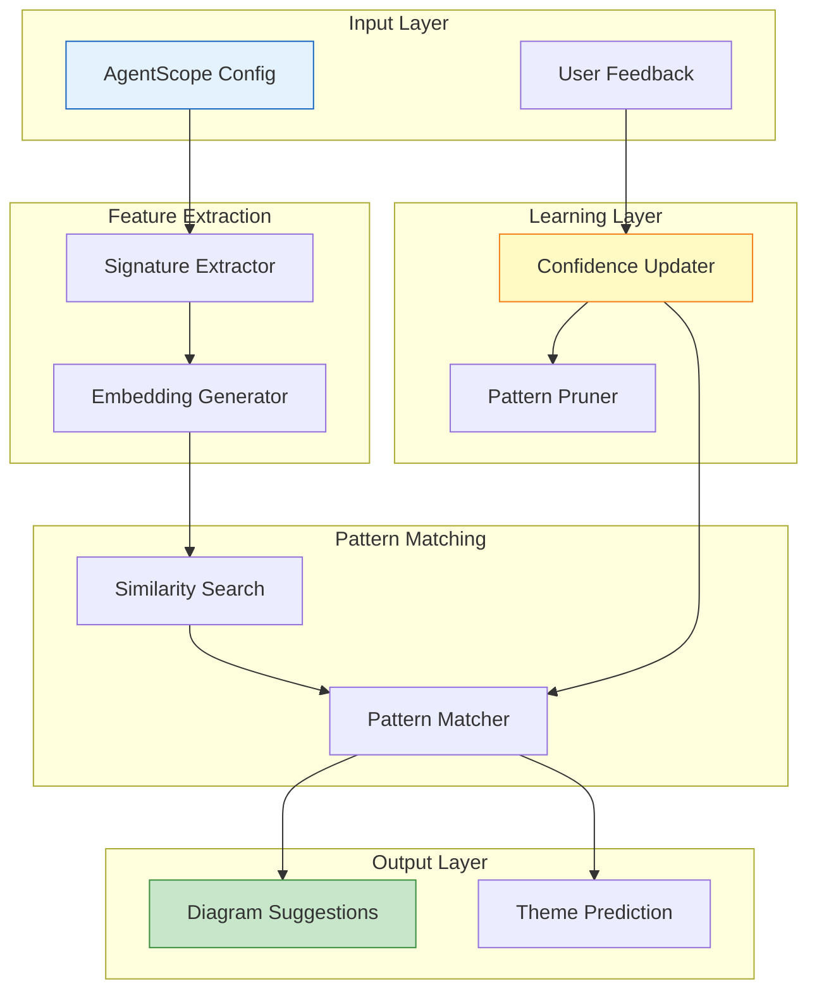

# ADR-012: Self-Learning System Design

## Status

**Proposed**

| Field | Value |
|-------|-------|
| Date | 2026-01-25 |
| Author | ADR Architect Agent |
| Deciders | Core Maintainers, ML Team |
| Consulted | Data Science, ReasoningBank Team |
| Informed | All Contributors |

---

## Context

### Problem Statement

AgentScope v1.2 aims to learn from user behavior to improve diagram suggestions:

1. **Static Diagrams**: Currently generates same diagrams for similar configs
2. **No Personalization**: Doesn't adapt to user preferences
3. **Missed Patterns**: Can't recognize config patterns over time
4. **Manual Selection**: Users must manually choose diagram types

**Example**: A user with 50+ agents always wants hierarchy+dataflow, but AgentScope generates component-map by default.

### Learning Objectives

| Objective | Input | Output | Success Metric |
|-----------|-------|--------|----------------|
| **Diagram Type Suggestion** | Config signature | Recommended diagram types | 80% acceptance rate |
| **Theme Preference** | User selections | Predicted theme | 90% accuracy |
| **Output Format** | Config size | Optimal format (single/multi-file) | 85% satisfaction |
| **Category Grouping** | Agent names/types | Inferred categories | 75% accuracy |

### Constraints

| Constraint | Rationale |
|------------|-----------|
| **No Network Calls** | Privacy, offline support |
| **No User Data Upload** | Privacy by design |
| **Lightweight Model** | CLI tool, not ML service |
| **Fast Inference** | <100ms prediction time |
| **Small Storage** | <10MB pattern storage |

---

## Decision

### Overview

We will implement a **local, lightweight learning system** using:

1. **Pattern Matching** - Store successful config→diagram mappings
2. **Similarity Search** - Find similar past configs using vector embeddings
3. **Confidence Scoring** - Track pattern success rates
4. **Feedback Loop** - Learn from explicit and implicit user feedback
5. **Pruning Strategy** - Remove stale patterns to bound storage

### Learning Architecture



---

## Core Components

### 1. Signature Extractor

```typescript
/**
 * Extract meaningful features from config
 */
interface ConfigSignature {
  // Agent metrics
  agentCount: number;
  agentTypes: Map<AgentType, number>;
  categoryDistribution: Map<AgentCategory, number>;
  maxDelegationDepth: number;

  // Component metrics
  skillCount: number;
  hookCount: number;
  mcpServerCount: number;
  commandCount: number;

  // Structure metrics
  hasDevContainer: boolean;
  hasHierarchy: boolean;
  hasMultipleCategories: boolean;

  // Computed hash for quick comparison
  hash: string;
}

class SignatureExtractor {
  extract(config: AgentScopeConfig): ConfigSignature {
    return {
      agentCount: config.agents.length,
      agentTypes: this.countByType(config.agents),
      categoryDistribution: this.countByCategory(config.agents),
      maxDelegationDepth: this.computeMaxDepth(config.agents),

      skillCount: config.skills.length,
      hookCount: config.hooks.length,
      mcpServerCount: config.mcpServers.length,
      commandCount: config.commands.length,

      hasDevContainer: config.meta.devContainer?.detected ?? false,
      hasHierarchy: this.hasHierarchicalStructure(config.agents),
      hasMultipleCategories: this.countCategories(config.agents) > 1,

      hash: this.computeHash(config),
    };
  }

  private countByType(agents: Agent[]): Map<AgentType, number> {
    const counts = new Map<AgentType, number>();
    for (const agent of agents) {
      const type = agent.type ?? 'custom';
      counts.set(type, (counts.get(type) ?? 0) + 1);
    }
    return counts;
  }

  private countByCategory(agents: Agent[]): Map<AgentCategory, number> {
    const counts = new Map<AgentCategory, number>();
    for (const agent of agents) {
      const category = inferCategory(agent);
      counts.set(category, (counts.get(category) ?? 0) + 1);
    }
    return counts;
  }

  private computeMaxDepth(agents: Agent[]): number {
    // BFS to find max delegation depth
    const graph = buildDelegationGraph(agents);
    return computeGraphDepth(graph);
  }

  private hasHierarchicalStructure(agents: Agent[]): boolean {
    return agents.some(a => a.delegatesTo && a.delegatesTo.length > 0);
  }

  private countCategories(agents: Agent[]): number {
    const categories = new Set(agents.map(inferCategory));
    return categories.size;
  }

  private computeHash(config: AgentScopeConfig): string {
    // Simple hash for quick comparison
    const str = JSON.stringify({
      agentCount: config.agents.length,
      mcpCount: config.mcpServers.length,
      hasHooks: config.hooks.length > 0,
    });
    return createHash('md5').update(str).digest('hex');
  }
}
```

### 2. Embedding Generator

```typescript
/**
 * Generate vector embeddings for similarity search
 */
class EmbeddingGenerator {
  /**
   * Convert signature to fixed-size vector (64 dimensions)
   */
  generate(signature: ConfigSignature): number[] {
    const embedding = new Array(64).fill(0);

    // Encode agent count (normalized)
    embedding[0] = Math.min(signature.agentCount / 100, 1.0);

    // Encode agent types (one-hot)
    let idx = 1;
    for (const [type, count] of signature.agentTypes) {
      embedding[idx++] = Math.min(count / 20, 1.0);
    }

    // Encode categories (one-hot)
    idx = 10;
    for (const [category, count] of signature.categoryDistribution) {
      embedding[idx++] = Math.min(count / 20, 1.0);
    }

    // Encode component counts
    idx = 30;
    embedding[idx++] = Math.min(signature.skillCount / 50, 1.0);
    embedding[idx++] = Math.min(signature.hookCount / 20, 1.0);
    embedding[idx++] = Math.min(signature.mcpServerCount / 10, 1.0);

    // Encode structure (binary features)
    idx = 40;
    embedding[idx++] = signature.hasDevContainer ? 1.0 : 0.0;
    embedding[idx++] = signature.hasHierarchy ? 1.0 : 0.0;
    embedding[idx++] = signature.hasMultipleCategories ? 1.0 : 0.0;

    // Encode delegation depth
    idx = 50;
    embedding[idx++] = Math.min(signature.maxDelegationDepth / 10, 1.0);

    // Fill remaining with zeros
    return embedding;
  }

  /**
   * Compute cosine similarity between two embeddings
   */
  similarity(a: number[], b: number[]): number {
    if (a.length !== b.length) {
      throw new Error('Embedding dimensions must match');
    }

    let dotProduct = 0;
    let normA = 0;
    let normB = 0;

    for (let i = 0; i < a.length; i++) {
      dotProduct += a[i] * b[i];
      normA += a[i] * a[i];
      normB += b[i] * b[i];
    }

    if (normA === 0 || normB === 0) {
      return 0;
    }

    return dotProduct / (Math.sqrt(normA) * Math.sqrt(normB));
  }
}
```

### 3. Pattern Matcher

```typescript
/**
 * Find similar patterns and make predictions
 */
class PatternMatcher {
  constructor(
    private readonly library: PatternLibrary,
    private readonly embeddingGen: EmbeddingGenerator
  ) {}

  /**
   * Find k most similar patterns
   */
  async findSimilar(
    signature: ConfigSignature,
    k: number = 5
  ): Promise<ScoredPattern[]> {
    const queryEmbedding = this.embeddingGen.generate(signature);
    const allPatterns = await this.library.getPatterns();

    // Compute similarities
    const scored = allPatterns.map(pattern => ({
      pattern,
      similarity: this.embeddingGen.similarity(
        queryEmbedding,
        pattern.embedding!
      ),
    }));

    // Sort by similarity (descending)
    scored.sort((a, b) => b.similarity - a.similarity);

    // Return top k
    return scored.slice(0, k);
  }

  /**
   * Suggest diagram types based on similar patterns
   */
  async suggestDiagrams(
    config: AgentScopeConfig
  ): Promise<DiagramTypeSuggestion[]> {
    const signature = new SignatureExtractor().extract(config);
    const similar = await this.findSimilar(signature, 5);

    if (similar.length === 0) {
      // No patterns yet, use heuristics
      return this.heuristicSuggestions(signature);
    }

    // Aggregate suggestions from similar patterns
    const votes = new Map<DiagramType, number>();
    const confidences = new Map<DiagramType, number>();

    for (const { pattern, similarity } of similar) {
      for (const diagramType of pattern.suggestedDiagrams) {
        // Weight by similarity and pattern confidence
        const weight = similarity * pattern.confidence * pattern.successRate;

        votes.set(diagramType, (votes.get(diagramType) ?? 0) + weight);
        confidences.set(
          diagramType,
          Math.max(confidences.get(diagramType) ?? 0, pattern.confidence)
        );
      }
    }

    // Convert to suggestions
    const suggestions: DiagramTypeSuggestion[] = [];

    for (const [type, weight] of votes) {
      suggestions.push({
        type,
        confidence: Math.min(weight / similar.length, 1.0),
        reasoning: this.explainSuggestion(type, similar),
      });
    }

    // Sort by confidence (descending)
    suggestions.sort((a, b) => b.confidence - a.confidence);

    return suggestions;
  }

  /**
   * Heuristic suggestions when no patterns available
   */
  private heuristicSuggestions(signature: ConfigSignature): DiagramTypeSuggestion[] {
    const suggestions: DiagramTypeSuggestion[] = [
      {
        type: 'component-map',
        confidence: 1.0,
        reasoning: 'Always useful for overview',
      },
    ];

    if (signature.hasHierarchy) {
      suggestions.push({
        type: 'hierarchy',
        confidence: 0.8,
        reasoning: 'Delegation structure detected',
      });
    }

    if (signature.mcpServerCount > 0) {
      suggestions.push({
        type: 'dataflow',
        confidence: 0.7,
        reasoning: 'MCP servers detected',
      });
    }

    return suggestions;
  }

  private explainSuggestion(
    type: DiagramType,
    similar: ScoredPattern[]
  ): string {
    const count = similar.filter(s => s.pattern.suggestedDiagrams.includes(type)).length;
    return `${count}/${similar.length} similar configs used this diagram`;
  }
}

interface ScoredPattern {
  pattern: DiagramPattern;
  similarity: number;
}
```

### 4. Confidence Updater

```typescript
/**
 * Update pattern confidence based on feedback
 */
class ConfidenceUpdater {
  /**
   * Update pattern after user feedback
   */
  async updateFromFeedback(
    patternId: string,
    feedback: PatternFeedback
  ): Promise<void> {
    const pattern = await this.library.getPattern(patternId);

    // Update usage count
    pattern.usageCount++;

    // Update success rate (exponential moving average)
    const alpha = 0.2; // Learning rate
    const newSuccess = feedback.helpful ? 1.0 : 0.0;
    pattern.successRate = alpha * newSuccess + (1 - alpha) * pattern.successRate;

    // Update confidence (combine success rate and usage count)
    pattern.confidence = this.computeConfidence(pattern);

    // Update last used timestamp
    pattern.lastUsed = new Date();

    // Persist
    await this.library.updatePattern(pattern);
  }

  /**
   * Compute confidence score
   * Confidence = successRate * min(usageCount / 10, 1.0)
   * More usage = higher confidence (up to 10 usages)
   */
  private computeConfidence(pattern: DiagramPattern): number {
    const usageBonus = Math.min(pattern.usageCount / 10, 1.0);
    return pattern.successRate * usageBonus;
  }

  /**
   * Update pattern from implicit feedback (diagram generation)
   */
  async updateFromImplicitFeedback(
    signature: ConfigSignature,
    generatedDiagrams: DiagramType[]
  ): Promise<void> {
    // Find matching pattern or create new one
    let pattern = await this.findOrCreatePattern(signature);

    // Update suggested diagrams
    pattern.suggestedDiagrams = generatedDiagrams;

    // Assume helpful (implicit positive feedback)
    await this.updateFromFeedback(pattern.id, {
      helpful: true,
      diagramsGenerated: generatedDiagrams,
      userSatisfaction: 0.7, // Neutral implicit feedback
    });
  }

  private async findOrCreatePattern(
    signature: ConfigSignature
  ): Promise<DiagramPattern> {
    // Try to find existing pattern with same hash
    const existing = await this.library.findByHash(signature.hash);

    if (existing) {
      return existing;
    }

    // Create new pattern
    const pattern: DiagramPattern = {
      id: generatePatternId(),
      configSignature: signature,
      suggestedDiagrams: [],
      confidence: 0.5, // Start neutral
      usageCount: 0,
      successRate: 0.5, // Start neutral
      lastUsed: new Date(),
      embedding: new EmbeddingGenerator().generate(signature),
    };

    await this.library.storePattern(pattern);
    return pattern;
  }
}
```

### 5. Pattern Pruner

```typescript
/**
 * Remove stale patterns to bound storage
 */
class PatternPruner {
  private readonly maxPatterns = 1000;
  private readonly staleDays = 90; // 3 months

  /**
   * Prune old patterns
   */
  async prune(): Promise<number> {
    const patterns = await this.library.getPatterns();

    // Compute cutoff date
    const cutoff = new Date();
    cutoff.setDate(cutoff.getDate() - this.staleDays);

    // Find stale patterns (low confidence + old)
    const stale = patterns.filter(
      p => p.lastUsed < cutoff && p.confidence < 0.3
    );

    // Remove stale patterns
    for (const pattern of stale) {
      await this.library.deletePattern(pattern.id);
    }

    // If still too many, remove lowest confidence
    const remaining = patterns.length - stale.length;

    if (remaining > this.maxPatterns) {
      const toRemove = remaining - this.maxPatterns;
      const sorted = patterns
        .filter(p => !stale.includes(p))
        .sort((a, b) => a.confidence - b.confidence);

      for (let i = 0; i < toRemove; i++) {
        await this.library.deletePattern(sorted[i].id);
      }

      return stale.length + toRemove;
    }

    return stale.length;
  }
}
```

---

## Feedback Mechanisms

### Explicit Feedback

```bash
# User provides explicit feedback after generation
agentscope scan
# ... generates docs ...

agentscope feedback --helpful
# or
agentscope feedback --not-helpful --reason "Too many diagrams"
```

```typescript
async function recordFeedback(
  helpful: boolean,
  reason?: string
): Promise<void> {
  const lastPattern = await getLastUsedPattern();

  await updater.updateFromFeedback(lastPattern.id, {
    helpful,
    diagramsGenerated: lastPattern.suggestedDiagrams,
    userSatisfaction: helpful ? 1.0 : 0.0,
  });

  if (!helpful && reason) {
    // Store reason for analysis
    await storeNegativeFeedback(lastPattern.id, reason);
  }
}
```

### Implicit Feedback

```typescript
/**
 * Implicit feedback from user actions
 */
async function recordImplicitFeedback(
  config: AgentScopeConfig,
  generatedDiagrams: DiagramType[]
): Promise<void> {
  const signature = new SignatureExtractor().extract(config);

  // Assume user is satisfied if they generated docs
  await updater.updateFromImplicitFeedback(signature, generatedDiagrams);
}
```

---

## Consequences

### Positive

1. **Personalized Suggestions**: Learns user preferences over time
2. **Improved Accuracy**: Confidence scores improve with usage
3. **Offline Learning**: No network calls, privacy-preserving
4. **Fast Inference**: <100ms prediction time
5. **Bounded Storage**: Pruning keeps storage <10MB
6. **Explainable**: Can explain why suggestions were made

### Negative

1. **Cold Start Problem**: Poor suggestions initially
2. **Storage Overhead**: ~10KB per pattern, max 1000 patterns = 10MB
3. **Computation Overhead**: Embedding generation + similarity search adds ~50ms
4. **Maintenance**: Pattern library needs periodic pruning
5. **Limited Context**: Only learns from local usage, not global patterns

### Neutral

1. **Learning Rate**: Adaptive learning rate balances stability vs plasticity
2. **Feedback Loop**: Requires user engagement (explicit feedback)
3. **Generalization**: May overfit to specific workflows

### Risks

| Risk | Likelihood | Impact | Mitigation |
|------|------------|--------|------------|
| Poor initial suggestions | High | Medium | Use heuristics as fallback |
| Storage growth unbounded | Low | Medium | Aggressive pruning |
| Stale patterns never pruned | Medium | Low | Scheduled pruning job |
| Overfitting to recent patterns | Medium | Medium | EMA-based updates |

---

## Testing Strategy

### Unit Tests

```typescript
describe('Self-Learning System', () => {
  describe('SignatureExtractor', () => {
    it('should extract meaningful features', () => {
      const config = createMockConfig({ agentCount: 50 });
      const signature = extractor.extract(config);

      expect(signature.agentCount).toBe(50);
      expect(signature.hash).toMatch(/^[a-f0-9]{32}$/);
    });
  });

  describe('EmbeddingGenerator', () => {
    it('should generate fixed-size embeddings', () => {
      const signature = createMockSignature();
      const embedding = generator.generate(signature);

      expect(embedding).toHaveLength(64);
      expect(Math.max(...embedding)).toBeLessThanOrEqual(1.0);
    });

    it('should compute cosine similarity correctly', () => {
      const a = [1, 0, 0];
      const b = [0, 1, 0];
      expect(generator.similarity(a, b)).toBe(0);

      const c = [1, 0, 0];
      const d = [1, 0, 0];
      expect(generator.similarity(c, d)).toBe(1);
    });
  });

  describe('PatternMatcher', () => {
    it('should suggest diagrams based on similar patterns', async () => {
      const suggestions = await matcher.suggestDiagrams(mockConfig);

      expect(suggestions.length).toBeGreaterThan(0);
      expect(suggestions[0].confidence).toBeLessThanOrEqual(1.0);
    });
  });

  describe('ConfidenceUpdater', () => {
    it('should increase confidence on positive feedback', async () => {
      const pattern = await library.getPattern('test-id');
      const initialConfidence = pattern.confidence;

      await updater.updateFromFeedback('test-id', {
        helpful: true,
        diagramsGenerated: ['component-map'],
        userSatisfaction: 1.0,
      });

      const updated = await library.getPattern('test-id');
      expect(updated.confidence).toBeGreaterThan(initialConfidence);
    });
  });

  describe('PatternPruner', () => {
    it('should remove stale patterns', async () => {
      const initialCount = (await library.getPatterns()).length;
      await pruner.prune();
      const finalCount = (await library.getPatterns()).length;

      expect(finalCount).toBeLessThanOrEqual(initialCount);
    });
  });
});
```

---

## Related Decisions

- **ADR-009**: DDD Bounded Contexts (LearningContext defined)
- **ADR-011**: Claude-flow Hooks Integration (learning from events)
- **ADR-013**: Memory and Neural Pattern Storage (persistence layer)

---

## References

- [Collaborative Filtering](https://en.wikipedia.org/wiki/Collaborative_filtering)
- [Vector Similarity Search](https://www.pinecone.io/learn/vector-similarity/)
- [Cosine Similarity](https://en.wikipedia.org/wiki/Cosine_similarity)
- [Exponential Moving Average](https://en.wikipedia.org/wiki/Moving_average#Exponential_moving_average)

---

*Generated by AgentScope ADR Architect*
*Last Updated: 2026-01-25*
