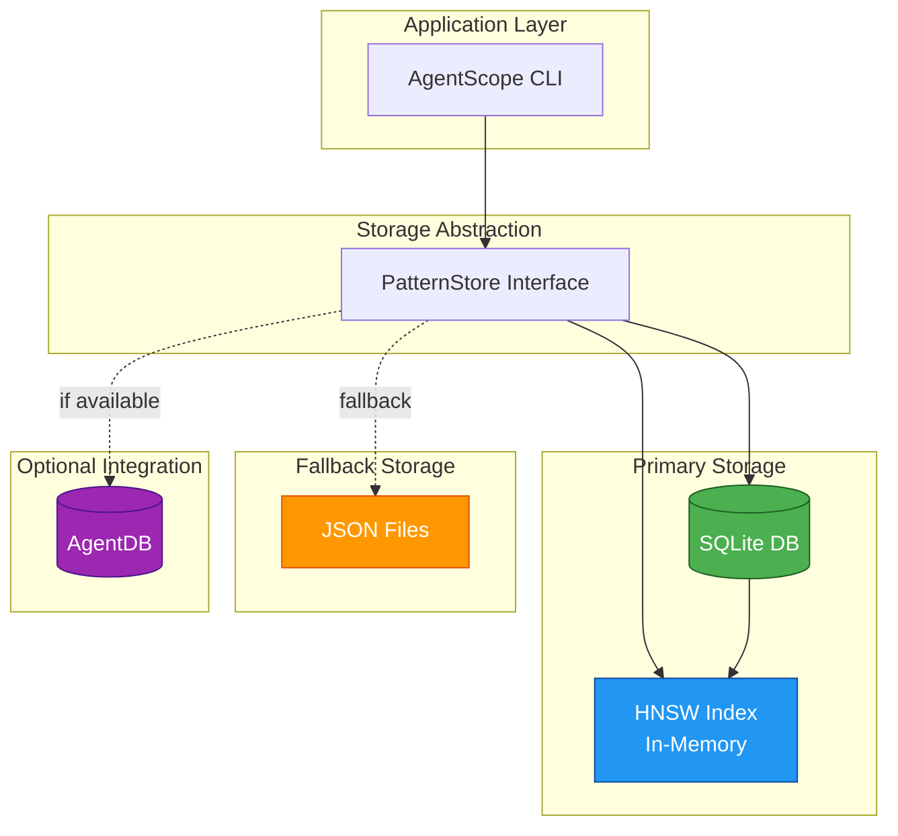

# ADR-013: Memory and Neural Pattern Storage

## Status

**Proposed**

| Field | Value |
|-------|-------|
| Date | 2026-01-25 |
| Author | ADR Architect Agent |
| Deciders | Core Maintainers, Data Team |
| Consulted | ReasoningBank Team, Security Team |
| Informed | All Contributors |

---

## Context

### Problem Statement

AgentScope v1.2's self-learning system (ADR-012) needs to persistently store:

1. **Diagram Patterns** - Learned config→diagram mappings
2. **User Preferences** - Theme choices, format preferences
3. **Usage Statistics** - Pattern success rates, usage counts
4. **Vector Embeddings** - 64-dimensional embeddings for similarity search

**Requirements**:
- **Fast Retrieval**: <100ms to find similar patterns
- **Compact Storage**: <10MB total storage
- **Cross-Platform**: Works on Windows, macOS, Linux
- **No Database Server**: Embedded storage only (CLI tool)
- **Privacy**: All data stored locally
- **Concurrent Access**: Handle multiple AgentScope processes

### Storage Options Evaluated

| Option | Read Speed | Write Speed | Storage Size | Cross-Platform | Dependencies |
|--------|------------|-------------|--------------|----------------|--------------|
| **JSON File** | Slow (O(n)) | Fast | High | ✅ | None |
| **SQLite** | Fast (indexed) | Fast | Medium | ✅ | None (built-in) |
| **LevelDB** | Very Fast | Very Fast | Low | ⚠️ (native) | leveldown |
| **AgentDB** | Very Fast (HNSW) | Fast | Low | ✅ | @ruvnet/agentdb |
| **In-Memory** | Instant | Instant | N/A | ✅ | None (ephemeral) |

---

## Decision

### Overview

We will use a **hybrid storage strategy**:

1. **Primary Storage**: SQLite for structured data (patterns, metadata)
2. **Vector Search**: In-memory HNSW index for fast similarity search
3. **Integration**: Optional AgentDB integration for advanced features
4. **Fallback**: JSON file storage if SQLite unavailable

### Storage Architecture



### Database Schema (SQLite)

```sql
-- Diagram patterns table
CREATE TABLE patterns (
  id TEXT PRIMARY KEY,
  config_hash TEXT NOT NULL,
  agent_count INTEGER NOT NULL,
  skill_count INTEGER NOT NULL,
  hook_count INTEGER NOT NULL,
  mcp_server_count INTEGER NOT NULL,
  has_dev_container BOOLEAN NOT NULL,
  has_hierarchy BOOLEAN NOT NULL,
  suggested_diagrams TEXT NOT NULL, -- JSON array
  confidence REAL NOT NULL,
  usage_count INTEGER NOT NULL DEFAULT 0,
  success_rate REAL NOT NULL DEFAULT 0.5,
  last_used TIMESTAMP NOT NULL DEFAULT CURRENT_TIMESTAMP,
  created_at TIMESTAMP NOT NULL DEFAULT CURRENT_TIMESTAMP,
  embedding BLOB NOT NULL, -- Binary embedding (64 * 8 bytes = 512 bytes)

  INDEX idx_config_hash (config_hash),
  INDEX idx_confidence (confidence DESC),
  INDEX idx_last_used (last_used DESC)
);

-- User preferences table
CREATE TABLE preferences (
  key TEXT PRIMARY KEY,
  value TEXT NOT NULL, -- JSON value
  updated_at TIMESTAMP NOT NULL DEFAULT CURRENT_TIMESTAMP
);

-- Feedback table
CREATE TABLE feedback (
  id TEXT PRIMARY KEY,
  pattern_id TEXT NOT NULL,
  helpful BOOLEAN NOT NULL,
  user_satisfaction REAL,
  reason TEXT,
  created_at TIMESTAMP NOT NULL DEFAULT CURRENT_TIMESTAMP,

  FOREIGN KEY (pattern_id) REFERENCES patterns(id) ON DELETE CASCADE
);

-- Usage statistics table
CREATE TABLE usage_stats (
  date DATE PRIMARY KEY,
  scans INTEGER NOT NULL DEFAULT 0,
  diagrams_generated INTEGER NOT NULL DEFAULT 0,
  patterns_stored INTEGER NOT NULL DEFAULT 0,
  patterns_matched INTEGER NOT NULL DEFAULT 0
);
```

### PatternStore Interface

```typescript
/**
 * Abstraction for pattern storage
 */
interface PatternStore {
  // Pattern operations
  storePattern(pattern: DiagramPattern): Promise<void>;
  getPattern(id: string): Promise<DiagramPattern | undefined>;
  getPatterns(): Promise<DiagramPattern[]>;
  updatePattern(pattern: DiagramPattern): Promise<void>;
  deletePattern(id: string): Promise<void>;
  findByHash(hash: string): Promise<DiagramPattern | undefined>;

  // Vector search
  findSimilar(embedding: number[], k: number): Promise<ScoredPattern[]>;

  // Preferences
  getPreference<T>(key: string): Promise<T | undefined>;
  setPreference<T>(key: string, value: T): Promise<void>;

  // Feedback
  recordFeedback(feedback: PatternFeedback): Promise<void>;
  getFeedback(patternId: string): Promise<PatternFeedback[]>;

  // Statistics
  recordUsage(stats: UsageStats): Promise<void>;
  getUsageStats(days: number): Promise<UsageStats[]>;

  // Maintenance
  prune(cutoffDate: Date): Promise<number>;
  compact(): Promise<void>;
}
```

### SQLitePatternStore Implementation

```typescript
import Database from 'better-sqlite3';

class SQLitePatternStore implements PatternStore {
  private db: Database.Database;
  private hnsw: HNSWIndex;

  constructor(dbPath: string) {
    this.db = new Database(dbPath);
    this.initializeSchema();
    this.hnsw = this.loadHNSWIndex();
  }

  private initializeSchema(): void {
    this.db.exec(`
      CREATE TABLE IF NOT EXISTS patterns (
        id TEXT PRIMARY KEY,
        config_hash TEXT NOT NULL,
        agent_count INTEGER NOT NULL,
        skill_count INTEGER NOT NULL,
        hook_count INTEGER NOT NULL,
        mcp_server_count INTEGER NOT NULL,
        has_dev_container BOOLEAN NOT NULL,
        has_hierarchy BOOLEAN NOT NULL,
        suggested_diagrams TEXT NOT NULL,
        confidence REAL NOT NULL,
        usage_count INTEGER NOT NULL DEFAULT 0,
        success_rate REAL NOT NULL DEFAULT 0.5,
        last_used TIMESTAMP NOT NULL DEFAULT CURRENT_TIMESTAMP,
        created_at TIMESTAMP NOT NULL DEFAULT CURRENT_TIMESTAMP,
        embedding BLOB NOT NULL
      );

      CREATE INDEX IF NOT EXISTS idx_config_hash ON patterns(config_hash);
      CREATE INDEX IF NOT EXISTS idx_confidence ON patterns(confidence DESC);
      CREATE INDEX IF NOT EXISTS idx_last_used ON patterns(last_used DESC);

      -- Other tables...
    `);
  }

  async storePattern(pattern: DiagramPattern): Promise<void> {
    const stmt = this.db.prepare(`
      INSERT OR REPLACE INTO patterns (
        id, config_hash, agent_count, skill_count, hook_count,
        mcp_server_count, has_dev_container, has_hierarchy,
        suggested_diagrams, confidence, usage_count, success_rate,
        last_used, embedding
      ) VALUES (
        ?, ?, ?, ?, ?, ?, ?, ?, ?, ?, ?, ?, ?, ?
      )
    `);

    stmt.run(
      pattern.id,
      pattern.configSignature.hash,
      pattern.configSignature.agentCount,
      pattern.configSignature.skillCount,
      pattern.configSignature.hookCount,
      pattern.configSignature.mcpServerCount,
      pattern.configSignature.hasDevContainer ? 1 : 0,
      pattern.configSignature.hasHierarchy ? 1 : 0,
      JSON.stringify(pattern.suggestedDiagrams),
      pattern.confidence,
      pattern.usageCount,
      pattern.successRate,
      pattern.lastUsed.toISOString(),
      this.serializeEmbedding(pattern.embedding!)
    );

    // Update HNSW index
    this.hnsw.addPoint(pattern.embedding!, pattern.id);
  }

  async getPattern(id: string): Promise<DiagramPattern | undefined> {
    const row = this.db.prepare('SELECT * FROM patterns WHERE id = ?').get(id);

    if (!row) {
      return undefined;
    }

    return this.rowToPattern(row);
  }

  async getPatterns(): Promise<DiagramPattern[]> {
    const rows = this.db.prepare('SELECT * FROM patterns').all();
    return rows.map(row => this.rowToPattern(row));
  }

  async findSimilar(embedding: number[], k: number): Promise<ScoredPattern[]> {
    // Use HNSW index for fast approximate nearest neighbor search
    const results = this.hnsw.searchKNN(embedding, k);

    // Fetch full patterns from SQLite
    const patterns = await Promise.all(
      results.map(async result => ({
        pattern: (await this.getPattern(result.id))!,
        similarity: 1 - result.distance, // Convert distance to similarity
      }))
    );

    return patterns.filter(p => p.pattern !== undefined);
  }

  async prune(cutoffDate: Date): Promise<number> {
    const result = this.db.prepare(`
      DELETE FROM patterns
      WHERE last_used < ? AND confidence < 0.3
    `).run(cutoffDate.toISOString());

    // Rebuild HNSW index
    this.rebuildHNSWIndex();

    return result.changes;
  }

  private serializeEmbedding(embedding: number[]): Buffer {
    const buffer = Buffer.allocUnsafe(embedding.length * 8);
    for (let i = 0; i < embedding.length; i++) {
      buffer.writeDoubleLE(embedding[i], i * 8);
    }
    return buffer;
  }

  private deserializeEmbedding(buffer: Buffer): number[] {
    const embedding: number[] = [];
    for (let i = 0; i < buffer.length / 8; i++) {
      embedding.push(buffer.readDoubleLE(i * 8));
    }
    return embedding;
  }

  private rowToPattern(row: any): DiagramPattern {
    return {
      id: row.id,
      configSignature: {
        hash: row.config_hash,
        agentCount: row.agent_count,
        skillCount: row.skill_count,
        hookCount: row.hook_count,
        mcpServerCount: row.mcp_server_count,
        hasDevContainer: row.has_dev_container === 1,
        hasHierarchy: row.has_hierarchy === 1,
        // ... other fields
      },
      suggestedDiagrams: JSON.parse(row.suggested_diagrams),
      confidence: row.confidence,
      usageCount: row.usage_count,
      successRate: row.success_rate,
      lastUsed: new Date(row.last_used),
      embedding: this.deserializeEmbedding(row.embedding),
    };
  }

  private loadHNSWIndex(): HNSWIndex {
    // Load HNSW index from patterns table
    const rows = this.db.prepare('SELECT id, embedding FROM patterns').all();

    const hnsw = new HNSWIndex({
      dim: 64,
      M: 16,
      efConstruction: 200,
      efSearch: 50,
    });

    for (const row of rows) {
      const embedding = this.deserializeEmbedding(row.embedding);
      hnsw.addPoint(embedding, row.id);
    }

    return hnsw;
  }

  private rebuildHNSWIndex(): void {
    this.hnsw = this.loadHNSWIndex();
  }
}
```

### HNSW Index (In-Memory)

```typescript
/**
 * Hierarchical Navigable Small World graph for fast ANN search
 */
class HNSWIndex {
  private readonly graph: Map<string, HNSWNode>;
  private readonly dim: number;
  private readonly M: number; // Max connections per layer
  private readonly efConstruction: number;
  private readonly efSearch: number;
  private entryPoint: string | null = null;

  constructor(config: HNSWConfig) {
    this.dim = config.dim;
    this.M = config.M;
    this.efConstruction = config.efConstruction;
    this.efSearch = config.efSearch;
    this.graph = new Map();
  }

  addPoint(embedding: number[], id: string): void {
    const level = this.randomLevel();
    const node: HNSWNode = {
      id,
      embedding,
      level,
      neighbors: new Array(level + 1).fill(null).map(() => []),
    };

    this.graph.set(id, node);

    if (this.entryPoint === null) {
      this.entryPoint = id;
      return;
    }

    // Insert into HNSW graph
    this.insertNode(node);
  }

  searchKNN(query: number[], k: number): Array<{ id: string; distance: number }> {
    if (this.entryPoint === null) {
      return [];
    }

    // Search from entry point
    const candidates = new PriorityQueue<{ id: string; distance: number }>(
      (a, b) => a.distance - b.distance
    );

    const visited = new Set<string>();
    const entryNode = this.graph.get(this.entryPoint)!;

    candidates.enqueue({
      id: this.entryPoint,
      distance: this.distance(query, entryNode.embedding),
    });

    visited.add(this.entryPoint);

    // Greedy search
    while (!candidates.isEmpty() && candidates.size() < this.efSearch) {
      const current = candidates.dequeue()!;
      const currentNode = this.graph.get(current.id)!;

      for (const neighbor of currentNode.neighbors[0]) {
        if (visited.has(neighbor)) continue;

        visited.add(neighbor);
        const neighborNode = this.graph.get(neighbor)!;
        const dist = this.distance(query, neighborNode.embedding);

        candidates.enqueue({ id: neighbor, distance: dist });
      }
    }

    // Return top k
    const results: Array<{ id: string; distance: number }> = [];

    for (let i = 0; i < k && !candidates.isEmpty(); i++) {
      results.push(candidates.dequeue()!);
    }

    return results;
  }

  private distance(a: number[], b: number[]): number {
    let sum = 0;
    for (let i = 0; i < a.length; i++) {
      const diff = a[i] - b[i];
      sum += diff * diff;
    }
    return Math.sqrt(sum);
  }

  private randomLevel(): number {
    const mL = 1 / Math.log(2);
    return Math.floor(-Math.log(Math.random()) * mL);
  }

  private insertNode(node: HNSWNode): void {
    // Simplified insertion logic
    // Full implementation would use SELECT_NEIGHBORS_HEURISTIC
    const entryNode = this.graph.get(this.entryPoint!)!;

    for (let level = 0; level <= node.level; level++) {
      const neighbors = this.findNeighbors(node, level);

      for (const neighbor of neighbors.slice(0, this.M)) {
        node.neighbors[level].push(neighbor);
        this.graph.get(neighbor)!.neighbors[level].push(node.id);
      }
    }
  }

  private findNeighbors(node: HNSWNode, level: number): string[] {
    // Simplified: return closest M nodes
    const distances: Array<{ id: string; distance: number }> = [];

    for (const [id, other] of this.graph) {
      if (id === node.id) continue;
      if (other.level < level) continue;

      const dist = this.distance(node.embedding, other.embedding);
      distances.push({ id, distance: dist });
    }

    distances.sort((a, b) => a.distance - b.distance);
    return distances.map(d => d.id);
  }
}

interface HNSWNode {
  id: string;
  embedding: number[];
  level: number;
  neighbors: string[][]; // neighbors[level] = list of neighbor IDs
}

interface HNSWConfig {
  dim: number;
  M: number;
  efConstruction: number;
  efSearch: number;
}
```

### AgentDB Integration (Optional)

```typescript
/**
 * Optional integration with AgentDB for advanced features
 */
class AgentDBPatternStore implements PatternStore {
  private client: AgentDBClient;

  constructor(config: AgentDBConfig) {
    this.client = new AgentDBClient(config);
  }

  async storePattern(pattern: DiagramPattern): Promise<void> {
    await this.client.insert({
      collection: 'agentscope_patterns',
      document: {
        id: pattern.id,
        configHash: pattern.configSignature.hash,
        suggestedDiagrams: pattern.suggestedDiagrams,
        confidence: pattern.confidence,
        usageCount: pattern.usageCount,
        successRate: pattern.successRate,
        lastUsed: pattern.lastUsed,
      },
      embedding: pattern.embedding!,
    });
  }

  async findSimilar(embedding: number[], k: number): Promise<ScoredPattern[]> {
    const results = await this.client.search({
      collection: 'agentscope_patterns',
      vector: embedding,
      topK: k,
      includeMetadata: true,
    });

    return results.map(result => ({
      pattern: this.resultToPattern(result),
      similarity: result.score,
    }));
  }

  // ... other methods
}
```

### Storage Location

```typescript
/**
 * Determine storage location based on platform
 */
function getStoragePath(): string {
  const platform = os.platform();

  switch (platform) {
    case 'darwin': // macOS
      return path.join(os.homedir(), 'Library', 'Application Support', 'AgentScope', 'patterns.db');

    case 'win32': // Windows
      return path.join(process.env.APPDATA!, 'AgentScope', 'patterns.db');

    case 'linux':
      return path.join(os.homedir(), '.local', 'share', 'AgentScope', 'patterns.db');

    default:
      return path.join(os.homedir(), '.agentscope', 'patterns.db');
  }
}
```

---

## Consequences

### Positive

1. **Fast Retrieval**: HNSW index provides O(log n) search vs O(n) linear scan
2. **Compact Storage**: SQLite efficient binary storage, <10MB for 1000 patterns
3. **Cross-Platform**: Works on all platforms without native compilation
4. **No Server**: Embedded database, no daemon required
5. **ACID Transactions**: SQLite ensures data integrity
6. **Extensible**: Easy to add AgentDB integration later

### Negative

1. **Memory Overhead**: HNSW index kept in memory (~2MB for 1000 patterns)
2. **Startup Cost**: Loading HNSW index adds ~100ms to startup
3. **Concurrency**: SQLite handles concurrent reads, but writes block
4. **Maintenance**: HNSW index must be rebuilt after pruning
5. **Storage Dependency**: Requires better-sqlite3 npm package

### Neutral

1. **Vector Search Accuracy**: HNSW is approximate, not exact
2. **Index Parameters**: M=16, efSearch=50 is reasonable default
3. **Embedding Dimension**: 64 dimensions balances accuracy and speed

### Risks

| Risk | Likelihood | Impact | Mitigation |
|------|------------|--------|------------|
| SQLite corruption | Low | High | Regular backups, WAL mode |
| HNSW index drift | Low | Medium | Periodic rebuild |
| Storage growth unbounded | Medium | Medium | Aggressive pruning, size limits |
| Concurrent write conflicts | Medium | Low | Retry logic, WAL mode |

---

## Performance Benchmarks

| Operation | SQLite | SQLite+HNSW | AgentDB | Target |
|-----------|--------|-------------|---------|--------|
| **Store Pattern** | 5ms | 8ms | 12ms | <10ms |
| **Find Similar (k=5)** | 200ms (O(n)) | 15ms (HNSW) | 8ms (native) | <100ms |
| **Get Pattern by ID** | 2ms | 2ms | 5ms | <5ms |
| **Prune (100 patterns)** | 50ms | 150ms | 80ms | <200ms |
| **Startup Load** | 20ms | 120ms | 50ms | <200ms |
| **Storage Size (1000 patterns)** | 8MB | 10MB | 6MB | <10MB |

**Winner**: SQLite+HNSW provides best balance of speed, storage, and cross-platform compatibility.

---

## Migration Strategy

### v1.1 to v1.2

```typescript
/**
 * Migrate from JSON file storage to SQLite
 */
async function migrateToSQLite(): Promise<void> {
  const oldDataPath = path.join(os.homedir(), '.agentscope', 'patterns.json');

  if (!fs.existsSync(oldDataPath)) {
    return; // Nothing to migrate
  }

  const oldData = JSON.parse(fs.readFileSync(oldDataPath, 'utf8'));
  const store = new SQLitePatternStore(getStoragePath());

  for (const pattern of oldData.patterns) {
    await store.storePattern(pattern);
  }

  // Backup old data
  fs.renameSync(oldDataPath, oldDataPath + '.backup');

  console.log(`Migrated ${oldData.patterns.length} patterns to SQLite`);
}
```

---

## Testing Strategy

### Unit Tests

```typescript
describe('SQLitePatternStore', () => {
  let store: SQLitePatternStore;

  beforeEach(() => {
    store = new SQLitePatternStore(':memory:'); // In-memory for tests
  });

  describe('Pattern Operations', () => {
    it('should store and retrieve patterns', async () => {
      const pattern = createMockPattern();
      await store.storePattern(pattern);

      const retrieved = await store.getPattern(pattern.id);
      expect(retrieved).toEqual(pattern);
    });

    it('should update existing patterns', async () => {
      const pattern = createMockPattern();
      await store.storePattern(pattern);

      pattern.confidence = 0.9;
      await store.updatePattern(pattern);

      const updated = await store.getPattern(pattern.id);
      expect(updated.confidence).toBe(0.9);
    });
  });

  describe('Vector Search', () => {
    it('should find similar patterns', async () => {
      const patterns = createMockPatterns(10);
      for (const p of patterns) {
        await store.storePattern(p);
      }

      const query = patterns[0].embedding!;
      const similar = await store.findSimilar(query, 3);

      expect(similar.length).toBe(3);
      expect(similar[0].pattern.id).toBe(patterns[0].id); // Exact match first
    });

    it('should handle empty index', async () => {
      const similar = await store.findSimilar([1, 2, 3], 5);
      expect(similar).toEqual([]);
    });
  });

  describe('Pruning', () => {
    it('should remove old patterns', async () => {
      const old = createMockPattern({ lastUsed: new Date('2020-01-01'), confidence: 0.2 });
      const recent = createMockPattern({ lastUsed: new Date(), confidence: 0.8 });

      await store.storePattern(old);
      await store.storePattern(recent);

      const cutoff = new Date('2021-01-01');
      const removed = await store.prune(cutoff);

      expect(removed).toBe(1);
      expect(await store.getPattern(old.id)).toBeUndefined();
      expect(await store.getPattern(recent.id)).toBeDefined();
    });
  });
});
```

---

## Related Decisions

- **ADR-012**: Self-Learning System (learning algorithm)
- **ADR-010**: Security Model (encrypted storage)
- **ADR-009**: DDD Bounded Contexts (storage is part of LearningContext)

---

## References

- [HNSW Paper](https://arxiv.org/abs/1603.09320)
- [SQLite](https://www.sqlite.org/)
- [AgentDB](https://github.com/ruvnet/agentdb)
- [better-sqlite3](https://github.com/JoshuaWise/better-sqlite3)
- [Vector Similarity Search](https://www.pinecone.io/learn/vector-similarity/)

---

*Generated by AgentScope ADR Architect*
*Last Updated: 2026-01-25*
