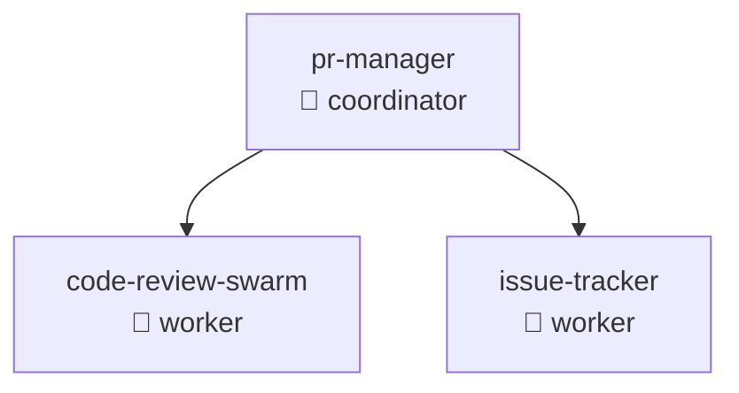

# ADR-014: Example Documentation Format Compliance

## Status

**Proposed**

| Field | Value |
|-------|-------|
| Date | 2026-01-25 |
| Author | ADR Architect Agent |
| Deciders | Core Maintainers, Documentation Team |
| Consulted | Technical Writers, Example Authors |
| Informed | All Contributors |

---

## Context

### Problem Statement

AgentScope v1.2 generates documentation that must align with the examples in `/workspaces/agentscope/examples/`. The examples demonstrate:

1. **Multi-File Structure** - Main README with category-specific sub-files
2. **Dense Tables** - 1 row per agent instead of verbose sections
3. **Navigation Links** - Bidirectional linking between parent and child docs
4. **Visual Hierarchy** - Emojis, symbols, and clear categorization
5. **Comparison Tables** - Capability matrices and cross-cutting concerns

**Current Gap**: Generated docs use verbose section-based format (8 lines per agent) instead of example's dense table format (1 row per agent).

### Example Documents

| Example | Key Features | Location |
|---------|--------------|----------|
| **Multi-file Plan** | File structure, linking patterns | `examples/PLAN-multi-file-diagrams.md` |
| **Component Map** | Dense tables, emoji categories | `examples/component-map-example.md` |
| **Hierarchy** | Tree structure, delegation chains | `examples/hierarchy-example.md` |
| **Comparison Tables** | Capability matrices | `examples/comparison-tables-example.md` |
| **Category Examples** | Per-category detail files | `examples/categories/*.md` |

### User Expectations

Users expect AgentScope-generated docs to:
- Match the polished examples
- Be navigable via links
- Use compact formatting
- Support quick scanning
- Enable drill-down for details

---

## Decision

### Overview

We will implement **example-compliant documentation generation** with:

1. **Multi-File Output** - README + per-category files + comparisons
2. **Dense Table Format** - 1 row per entity with all key info
3. **Bidirectional Links** - Parent↔Child navigation
4. **Visual Hierarchy** - Emojis, symbols, formatting
5. **Comparison Views** - Capability matrices, cross-cutting tables

### Output Structure

```
docs/agent-architecture/
├── README.md                    # Main index with summary + links
├── component-map.md             # Full component map diagram
├── hierarchy.md                 # Full hierarchy diagram
├── dataflow.md                  # Data flow diagram (if applicable)
├── categories/                  # Per-category detail files
│   ├── github.md               # GitHub agents (14 agents)
│   ├── security.md             # Security agents (10 agents)
│   ├── sparc.md                # SPARC agents (7 agents)
│   ├── consensus.md            # Consensus agents (8 agents)
│   ├── coordination.md         # Coordination agents (6 agents)
│   ├── v3-core.md              # V3 core agents (5 agents)
│   ├── performance.md          # Performance agents (4 agents)
│   ├── memory.md               # Memory agents (3 agents)
│   ├── development.md          # Development agents (12 agents)
│   ├── testing.md              # Testing agents (5 agents)
│   └── other.md                # Uncategorized agents
├── comparisons/                 # Dense comparison tables
│   ├── agents-by-type.md       # All agents grouped by type
│   ├── agents-by-category.md   # All agents by category
│   ├── capabilities-matrix.md  # Capability cross-reference
│   └── delegation-chains.md    # Delegation relationships
└── raw/
    └── agentscope.json         # Raw unified config
```

### README.md Format

```markdown
# Agent Architecture

> **Generated**: 2026-01-25 | **Agents**: 74 | **Categories**: 11 | **MCP Servers**: 4

## Quick Navigation

| Section | Description |
|---------|-------------|
| [📊 Overview](#overview) | High-level summary and statistics |
| [📂 Categories](#categories) | Agents grouped by function |
| [📈 Diagrams](#diagrams) | Visual architecture maps |
| [📋 Comparisons](#comparisons) | Comparison tables and matrices |
| [🔍 Search](#search) | Find agents by capability |

---

## Overview

This project uses 74 agents across 11 categories:

| Metric | Value |
|--------|-------|
| **Total Agents** | 74 |
| **Coordinators** | 12 |
| **Workers** | 48 |
| **Specialists** | 10 |
| **Reviewers** | 4 |
| **Skills** | 32 |
| **Hooks** | 8 |
| **MCP Servers** | 4 |
| **Commands** | 6 |

---

## Categories

| Category | Agents | Description | View Details |
|----------|--------|-------------|--------------|
| 🐙 **GitHub** | 14 | Pull requests, code review, issue tracking | [→ details](./categories/github.md) |
| 🔒 **Security** | 10 | Security scanning, auditing, compliance | [→ details](./categories/security.md) |
| ⚡ **SPARC** | 7 | SPARC methodology implementation | [→ details](./categories/sparc.md) |
| 🤝 **Consensus** | 8 | Byzantine, Raft, CRDT coordination | [→ details](./categories/consensus.md) |
| 🎯 **Coordination** | 6 | Swarm orchestration, load balancing | [→ details](./categories/coordination.md) |
| 🚀 **V3 Core** | 5 | V3 implementation agents | [→ details](./categories/v3-core.md) |
| ⚡ **Performance** | 4 | Performance analysis and optimization | [→ details](./categories/performance.md) |
| 🧠 **Memory** | 3 | AgentDB, ReasoningBank integration | [→ details](./categories/memory.md) |
| 💻 **Development** | 12 | Coding, testing, refactoring | [→ details](./categories/development.md) |
| 🧪 **Testing** | 5 | Test generation, TDD, validation | [→ details](./categories/testing.md) |

---

## Diagrams

| Diagram | Purpose | View |
|---------|---------|------|
| Component Map | All agents, skills, hooks, MCPs | [→ view](./component-map.md) |
| Hierarchy | Delegation chains and structure | [→ view](./hierarchy.md) |
| Data Flow | Data movement through system | [→ view](./dataflow.md) |

---

## Comparisons

| View | Description | View |
|------|-------------|------|
| By Type | All agents grouped by type (coordinator, worker, etc.) | [→ view](./comparisons/agents-by-type.md) |
| By Category | All agents grouped by category | [→ view](./comparisons/agents-by-category.md) |
| Capabilities | What each agent can do | [→ view](./comparisons/capabilities-matrix.md) |
| Delegations | Who delegates to whom | [→ view](./comparisons/delegation-chains.md) |

---

*Generated by [AgentScope](https://github.com/vipasane/agentscope) v1.2*
```

### Category File Format (categories/github.md)

```markdown
# 🐙 GitHub Agents

[← Back to Overview](../README.md) | [↑ Component Map](../component-map.md) | [Comparisons →](../comparisons/)

---

## Summary

14 agents for GitHub integration:
- Pull request management
- Code review orchestration
- Issue tracking and triage
- Release automation
- Workflow automation

---

## Agents

| Agent | Type | Description | Tools | Path |
|-------|------|-------------|-------|------|
| pr-manager | 👑 coordinator | Complete PR lifecycle management | github, git | [→](../../../.claude/agents/github/pr-manager.md) |
| code-review-swarm | 👷 worker | Multi-agent code review with swarm | github, git, eslint | [→](../../../.claude/agents/github/code-review-swarm.md) |
| issue-tracker | 👷 worker | GitHub issue tracking and triage | github | [→](../../../.claude/agents/github/issue-tracker.md) |
| release-manager | 🎓 specialist | Release orchestration and automation | github, git, npm | [→](../../../.claude/agents/github/release-manager.md) |
| workflow-automation | 🎓 specialist | GitHub Actions workflow management | github, yaml | [→](../../../.claude/agents/github/workflow-automation.md) |
| ... | ... | ... | ... | ... |

**Legend**: 👑=Coordinator | 👷=Worker | 🎓=Specialist | 👀=Reviewer

---

## Delegation Chains



---

## Capabilities

| Agent | Read | Write | Execute | Review | Deploy |
|-------|:----:|:-----:|:-------:|:------:|:------:|
| pr-manager | ✓ | ✓ | ✓ | ✓ | |
| code-review-swarm | ✓ | | | ✓ | |
| release-manager | ✓ | ✓ | ✓ | ✓ | ✓ |

---

[← Back to Overview](../README.md) | [Next: Security Agents →](./security.md)
```

### Comparison File Format (comparisons/agents-by-type.md)

```markdown
# Agents by Type

[← Back to Overview](../README.md)

---

## Coordinators (12)

| Agent | Category | Description | Delegates To |
|-------|----------|-------------|--------------|
| pr-manager | GitHub | PR lifecycle management | code-review-swarm, issue-tracker |
| hierarchical-coordinator | Coordination | Hierarchical swarm orchestration | worker-pool |
| ... | ... | ... | ... |

---

## Workers (48)

| Agent | Category | Description | Reports To |
|-------|----------|-------------|------------|
| coder | Development | Code implementation | tech-lead |
| tester | Testing | Test writing and execution | qa-lead |
| ... | ... | ... | ... |

---

## Specialists (10)

| Agent | Category | Specialization | Description |
|-------|----------|----------------|-------------|
| security-auditor | Security | Security scanning | CVE detection, SAST analysis |
| performance-engineer | Performance | Performance optimization | Profiling, benchmarking |
| ... | ... | ... | ... |

---

## Reviewers (4)

| Agent | Category | Review Focus | Checks |
|-------|----------|--------------|--------|
| code-reviewer | Development | Code quality | Style, tests, security |
| security-reviewer | Security | Security review | Vulnerabilities, compliance |
| ... | ... | ... | ... |

---

*Total: 74 agents across 4 types*
```

### Capability Matrix Format (comparisons/capabilities-matrix.md)

```markdown
# Capabilities Matrix

[← Back to Overview](../README.md)

---

## Agent Capabilities

| Agent | 📖 Read | ✏️ Write | ⚙️ Execute | 👀 Review | 🚀 Deploy | 🔒 Security |
|-------|:------:|:-------:|:--------:|:--------:|:--------:|:---------:|
| pr-manager | ✓ | ✓ | ✓ | ✓ | | |
| coder | ✓ | ✓ | | | | |
| security-auditor | ✓ | | | ✓ | | ✓ |
| release-manager | ✓ | ✓ | ✓ | ✓ | ✓ | |
| ... | ... | ... | ... | ... | ... | ... |

---

## Tool Usage

| Agent | Git | GitHub | NPM | Docker | ESLint | Prettier |
|-------|:---:|:------:|:---:|:------:|:------:|:--------:|
| pr-manager | ✓ | ✓ | | | | |
| coder | ✓ | | | | ✓ | ✓ |
| release-manager | ✓ | ✓ | ✓ | ✓ | | |
| ... | ... | ... | ... | ... | ... | ... |

---

*Legend: ✓ = Capability supported*
```

---

## Implementation

### DocumentAssembler Service

```typescript
/**
 * Assemble multi-file documentation following examples
 */
class ExampleCompliantDocumentAssembler implements DocumentAssembler {
  async assemble(
    config: AgentScopeConfig,
    diagrams: Diagram[],
    options: AssemblyOptions
  ): Promise<RichDocument> {
    const sections: Section[] = [];

    // Generate README.md
    sections.push(await this.generateREADME(config, diagrams));

    // Generate category files
    const categories = this.categorizeAgents(config.agents);
    for (const [category, agents] of categories) {
      sections.push(await this.generateCategoryFile(category, agents, config));
    }

    // Generate comparison files
    sections.push(await this.generateAgentsByType(config.agents));
    sections.push(await this.generateCapabilityMatrix(config.agents));
    sections.push(await this.generateDelegationChains(config.agents));

    return {
      id: generateId(),
      title: 'Agent Architecture',
      navigation: this.generateNavigation(sections),
      sections,
      legend: this.generateLegend(),
      summary: this.generateSummary(config),
      metadata: {
        generatedAt: new Date(),
        agentCount: config.agents.length,
        categoryCount: categories.size,
      },
    };
  }

  private async generateREADME(
    config: AgentScopeConfig,
    diagrams: Diagram[]
  ): Promise<Section> {
    const content = `
# Agent Architecture

> **Generated**: ${new Date().toISOString()} | **Agents**: ${config.agents.length} | **Categories**: ${this.countCategories(config.agents)}

## Quick Navigation

${this.generateQuickNav()}

---

## Overview

${this.generateOverviewTable(config)}

---

## Categories

${this.generateCategoryTable(config)}

---

## Diagrams

${this.generateDiagramLinks(diagrams)}

---

## Comparisons

${this.generateComparisonLinks()}

---

*Generated by [AgentScope](https://github.com/vipasane/agentscope) v1.2*
    `.trim();

    return {
      id: 'readme',
      title: 'README',
      anchor: { id: 'readme', label: 'README' },
      content: { type: 'markdown', value: content },
      order: 0,
    };
  }

  private generateCategoryTable(config: AgentScopeConfig): string {
    const categories = this.categorizeAgents(config.agents);
    const rows: string[] = [];

    for (const [category, agents] of categories) {
      const emoji = this.getCategoryEmoji(category);
      const description = this.getCategoryDescription(category);
      const link = `[→ details](./categories/${category}.md)`;

      rows.push(`| ${emoji} **${category}** | ${agents.length} | ${description} | ${link} |`);
    }

    return `
| Category | Agents | Description | View Details |
|----------|--------|-------------|--------------|
${rows.join('\n')}
    `.trim();
  }

  private async generateCategoryFile(
    category: AgentCategory,
    agents: Agent[],
    config: AgentScopeConfig
  ): Promise<Section> {
    const emoji = this.getCategoryEmoji(category);
    const description = this.getCategoryDescription(category);

    const agentRows = agents.map(agent => {
      const type = this.getTypeEmoji(agent.type);
      const tools = agent.tools?.join(', ') || '';
      const path = `[→](../../../${agent.path})`;

      return `| ${agent.name} | ${type} ${agent.type} | ${agent.description} | ${tools} | ${path} |`;
    });

    const content = `
# ${emoji} ${category} Agents

[← Back to Overview](../README.md) | [↑ Component Map](../component-map.md) | [Comparisons →](../comparisons/)

---

## Summary

${agents.length} agents for ${description}

---

## Agents

| Agent | Type | Description | Tools | Path |
|-------|------|-------------|-------|------|
${agentRows.join('\n')}

**Legend**: 👑=Coordinator | 👷=Worker | 🎓=Specialist | 👀=Reviewer

---

${this.generateCategoryDiagram(agents)}

---

[← Back to Overview](../README.md)
    `.trim();

    return {
      id: `category-${category}`,
      title: `${emoji} ${category} Agents`,
      anchor: { id: category, label: category },
      content: { type: 'markdown', value: content },
      order: 1,
    };
  }

  private getCategoryEmoji(category: AgentCategory): string {
    const emojis: Record<AgentCategory, string> = {
      github: '🐙',
      security: '🔒',
      sparc: '⚡',
      consensus: '🤝',
      coordination: '🎯',
      'v3-core': '🚀',
      performance: '⚡',
      memory: '🧠',
      development: '💻',
      testing: '🧪',
      analysis: '📊',
      documentation: '📚',
      'flow-nexus': '🔗',
      other: '📦',
    };

    return emojis[category] || '📦';
  }

  private getTypeEmoji(type: AgentType): string {
    const emojis: Record<AgentType, string> = {
      coordinator: '👑',
      worker: '👷',
      specialist: '🎓',
      reviewer: '👀',
      custom: '🔧',
    };

    return emojis[type] || '🔧';
  }
}
```

---

## Consequences

### Positive

1. **Consistent Format**: Matches polished examples exactly
2. **Scannable**: Dense tables easier to scan than verbose sections
3. **Navigable**: Bidirectional links enable drill-down
4. **Visual Hierarchy**: Emojis and symbols improve readability
5. **Multi-View**: Comparison tables show cross-cutting concerns

### Negative

1. **Generation Complexity**: Multi-file output more complex than single file
2. **Link Maintenance**: Relative links must be correct
3. **File Count**: More files to manage (1 main + 11 categories + 4 comparisons = 16 files)
4. **Emoji Dependency**: Requires emoji support in terminal/browser

### Neutral

1. **File Size**: Individual files smaller, total size similar
2. **Backward Compatibility**: Can still generate single-file output

### Risks

| Risk | Likelihood | Impact | Mitigation |
|------|------------|--------|------------|
| Broken links | Medium | Medium | Validate all links in tests |
| Emoji rendering issues | Low | Low | Provide text fallback |
| File organization confusion | Low | Low | Clear documentation |

---

## Testing Strategy

### Validation Tests

```typescript
describe('Example Compliance', () => {
  it('should match README format from examples', async () => {
    const generated = await assembler.generateREADME(config, diagrams);
    const example = await readFile('examples/README-example.md', 'utf8');

    expect(generated).toMatchFormat(example);
  });

  it('should generate dense agent tables', async () => {
    const categoryFile = await assembler.generateCategoryFile('github', agents, config);

    // Should have table header
    expect(categoryFile.content.value).toContain('| Agent | Type | Description | Tools | Path |');

    // Should have 1 row per agent (not 8 lines per agent)
    const rows = categoryFile.content.value.split('\n').filter(line => line.startsWith('|'));
    expect(rows.length).toBe(agents.length + 2); // +2 for header and separator
  });

  it('should have bidirectional navigation links', async () => {
    const categoryFile = await assembler.generateCategoryFile('github', agents, config);

    // Should link back to parent
    expect(categoryFile.content.value).toContain('[← Back to Overview](../README.md)');

    // Should link to sibling
    expect(categoryFile.content.value).toContain('[↑ Component Map](../component-map.md)');
  });
});
```

### Link Validation

```typescript
describe('Link Validation', () => {
  it('should have valid relative links', async () => {
    const doc = await assembler.assemble(config, diagrams, {});

    for (const section of doc.sections) {
      const links = extractLinks(section.content);

      for (const link of links) {
        const resolved = path.resolve(path.dirname(section.filePath), link.href);
        expect(fs.existsSync(resolved)).toBe(true);
      }
    }
  });
});
```

---

## Related Decisions

- **ADR-001**: Mermaid Theme System (visual hierarchy)
- **ADR-009**: DDD Bounded Contexts (OutputFormatting context)
- **DDD-001**: Generator Domains (document assembly)

---

## References

- [PLAN-multi-file-diagrams.md](../examples/PLAN-multi-file-diagrams.md)
- [component-map-example.md](../examples/component-map-example.md)
- [comparison-tables-example.md](../examples/comparison-tables-example.md)
- [Markdown Guide](https://www.markdownguide.org/)
- [GitHub Emoji](https://github.com/ikatyang/emoji-cheat-sheet)

---

*Generated by AgentScope ADR Architect*
*Last Updated: 2026-01-25*
