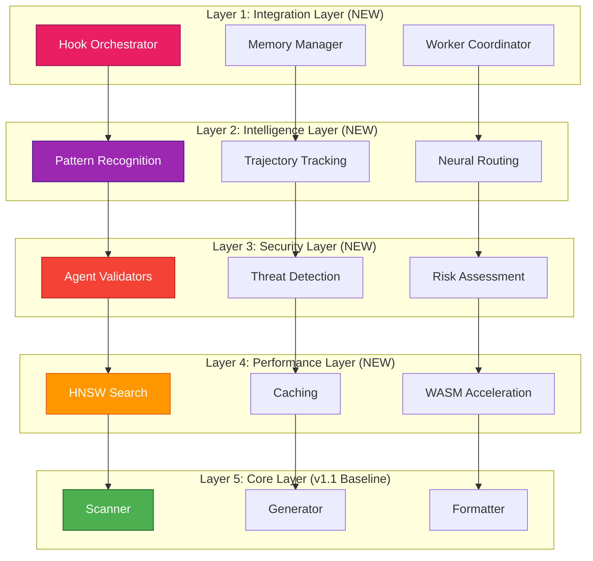
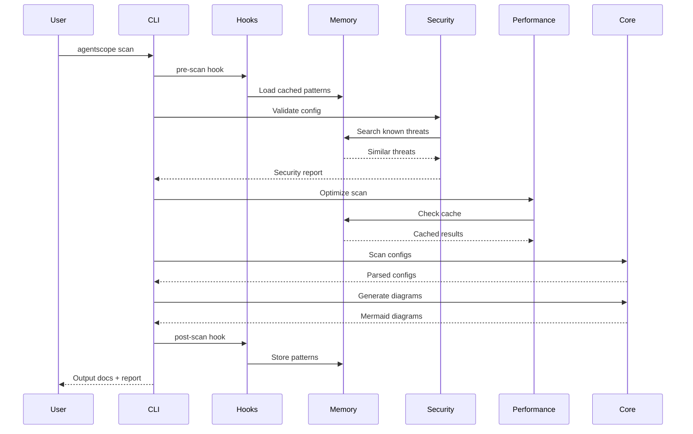
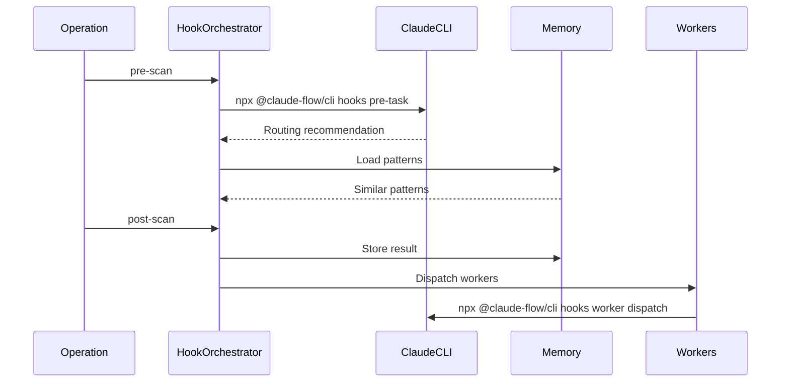
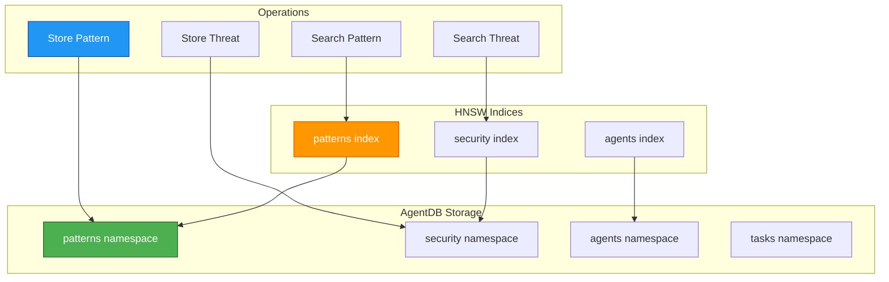

# ADR-021: Overall System Integration Architecture

## Status

**Proposed**

| Field | Value |
|-------|-------|
| Date | 2026-01-25 |
| Author | System Architecture Designer |
| Deciders | Core Maintainers, Technical Leads |
| Consulted | All v1.2 Agent Teams |
| Informed | All Contributors |
| Supersedes | None |
| Related | ADR-012, ADR-016, ADR-017, ADR-018 |

---

## Context

### Problem Statement

AgentScope v1.2 integrates multiple new capabilities:

1. **Security Layer** (ADR-012, 016, 017, 018) - Agent config validation, prompt injection detection
2. **Claude-Flow Intelligence** - 27 hooks, AgentDB, 12 background workers, neural patterns
3. **Performance Optimization** - HNSW vector search, WASM SIMD, intelligent caching
4. **Learning & Adaptation** - Pattern storage, trajectory tracking, continuous improvement

**Challenge**: These components must work together as a **cohesive system**, not isolated features.

### Current State (v1.1)

```
AgentScope v1.1 (Simple Pipeline)
┌─────────────┐
│   Scanner   │ → Parse configs
└─────┬───────┘
      ↓
┌─────────────┐
│  Generator  │ → Create diagrams
└─────┬───────┘
      ↓
┌─────────────┐
│  Formatter  │ → Output docs
└─────────────┘
```

**Limitations**:
- No security validation
- No intelligence layer
- No learning/adaptation
- No performance optimization
- Stateless (no memory)

### Target State (v1.2)

```
AgentScope v1.2 (Intelligent System)
┌──────────────────────────────────────────────┐
│        Claude-Flow Intelligence Layer        │
│   (Hooks, Memory, Workers, Neural Patterns)  │
└────────────┬────────────────────┬────────────┘
             ↓                    ↓
┌────────────────────┐  ┌───────────────────┐
│   Security Layer   │  │ Performance Layer │
│   (Validation)     │  │   (Optimization)  │
└─────────┬──────────┘  └──────────┬────────┘
          ↓                        ↓
┌─────────────────────────────────────────────┐
│       Core AgentScope (v1.1 Baseline)       │
│     (Scan → Generate → Format → Output)     │
└─────────────────────────────────────────────┘
```

**Improvements**:
- ✅ Multi-layer architecture
- ✅ Intelligence & learning
- ✅ Security validation
- ✅ Performance optimization
- ✅ Stateful (with memory)

---

## Decision

We will implement a **5-layer system architecture** with **3 integration patterns**:

### Architecture Overview



---

## Layer 1: Integration Layer (Claude-Flow Hooks)

### Purpose

Orchestrate claude-flow capabilities and coordinate AgentScope operations.

### Components

#### 1.1 Hook Orchestrator

**Responsibility**: Execute hooks at appropriate lifecycle points.

```typescript
/**
 * Hook orchestrator - executes claude-flow hooks
 */
class HookOrchestrator {
  private readonly hookRegistry = new Map<HookType, Hook[]>();
  private readonly memoryManager: MemoryManager;

  /**
   * Register a hook for a lifecycle event
   */
  register(type: HookType, hook: Hook): void {
    const hooks = this.hookRegistry.get(type) || [];
    hooks.push(hook);
    this.hookRegistry.set(type, hooks);
  }

  /**
   * Execute hooks for a lifecycle event
   */
  async execute(type: HookType, context: HookContext): Promise<HookResult[]> {
    const hooks = this.hookRegistry.get(type) || [];
    const results: HookResult[] = [];

    for (const hook of hooks) {
      try {
        const result = await this.executeHook(hook, context);
        results.push(result);

        // Store successful patterns
        if (result.success) {
          await this.memoryManager.storePattern({
            hook: hook.name,
            context,
            result,
          });
        }
      } catch (error) {
        results.push({
          success: false,
          error: error.message,
        });
      }
    }

    return results;
  }

  private async executeHook(hook: Hook, context: HookContext): Promise<HookResult> {
    // Execute hook via claude-flow CLI
    const command = `npx @claude-flow/cli@latest hooks ${hook.command} ${hook.args}`;
    const output = await execAsync(command);

    return {
      success: true,
      output: JSON.parse(output),
    };
  }
}
```

**Hook Execution Points**:

| Hook Type | When | Purpose |
|-----------|------|---------|
| `pre-scan` | Before scanning starts | Initialize memory, check cache |
| `post-scan` | After scanning completes | Store scan results, update patterns |
| `pre-validate` | Before security validation | Load known threats |
| `post-validate` | After security validation | Store new threats, learn patterns |
| `pre-generate` | Before diagram generation | Load diagram templates |
| `post-generate` | After diagram generation | Optimize diagrams, cache results |
| `pre-format` | Before document formatting | Load formatting preferences |
| `post-format` | After document formatting | Store successful formats |

---

#### 1.2 Memory Manager

**Responsibility**: Manage AgentDB storage and retrieval.

```typescript
/**
 * Memory manager - interfaces with AgentDB
 */
class MemoryManager {
  private readonly agentDb: AgentDB;

  /**
   * Store a pattern for future reference
   */
  async storePattern(pattern: {
    hook: string;
    context: HookContext;
    result: HookResult;
  }): Promise<void> {
    // Store in AgentDB with HNSW indexing
    await this.agentDb.store({
      namespace: 'patterns',
      key: `${pattern.hook}-${Date.now()}`,
      value: JSON.stringify(pattern),
      embedding: await this.generateEmbedding(pattern),
    });
  }

  /**
   * Search for similar patterns
   */
  async searchPatterns(query: string, limit = 5): Promise<Pattern[]> {
    const queryEmbedding = await this.generateEmbedding({ query });

    // Use HNSW for 150x-12,500x faster search
    const results = await this.agentDb.searchHNSW({
      namespace: 'patterns',
      embedding: queryEmbedding,
      limit,
    });

    return results.map(r => JSON.parse(r.value));
  }

  /**
   * Store security threat for learning
   */
  async storeThreat(threat: SecurityThreat): Promise<void> {
    await this.agentDb.store({
      namespace: 'security',
      key: `threat-${threat.id}`,
      value: JSON.stringify(threat),
      embedding: await this.generateEmbedding(threat),
    });
  }

  /**
   * Search for similar threats (for detection)
   */
  async searchThreats(content: string, limit = 10): Promise<SecurityThreat[]> {
    const embedding = await this.generateEmbedding({ content });

    const results = await this.agentDb.searchHNSW({
      namespace: 'security',
      embedding,
      limit,
    });

    return results.map(r => JSON.parse(r.value));
  }

  private async generateEmbedding(data: unknown): Promise<number[]> {
    // Use claude-flow embeddings package
    const text = JSON.stringify(data);
    return await generateEmbedding(text);
  }
}
```

**Memory Namespaces**:

| Namespace | Contents | Usage |
|-----------|----------|-------|
| `patterns` | Successful operations | Pattern matching, optimization |
| `security` | Known threats | Threat detection, learning |
| `agents` | Agent metadata | Agent discovery, analysis |
| `tasks` | Task history | Performance tracking |
| `verdicts` | Judgment results | Learning feedback |

---

#### 1.3 Worker Coordinator

**Responsibility**: Dispatch and manage background workers.

```typescript
/**
 * Worker coordinator - manages 12 background workers
 */
class WorkerCoordinator {
  private readonly workers = new Map<WorkerType, Worker>();
  private readonly memoryManager: MemoryManager;

  /**
   * Dispatch worker based on trigger
   */
  async dispatch(trigger: WorkerTrigger): Promise<void> {
    const workerType = this.selectWorker(trigger);
    const worker = this.workers.get(workerType);

    if (!worker) {
      throw new Error(`Worker not found: ${workerType}`);
    }

    // Execute worker via claude-flow CLI
    const command = `npx @claude-flow/cli@latest hooks worker dispatch --trigger ${trigger}`;
    await execAsync(command);
  }

  private selectWorker(trigger: WorkerTrigger): WorkerType {
    const mapping: Record<WorkerTrigger, WorkerType> = {
      'scan-complete': 'map',
      'security-issue': 'audit',
      'performance-slow': 'optimize',
      'new-pattern': 'ultralearn',
      'test-gap': 'testgaps',
    };

    return mapping[trigger] || 'map';
  }
}
```

**Worker Dispatch Strategy**:

| Worker | Trigger | Priority | When to Dispatch |
|--------|---------|----------|------------------|
| `audit` | Security issue found | critical | Immediately |
| `optimize` | Scan time >3s | high | After scan |
| `map` | 5+ new files | normal | After scan |
| `ultralearn` | New pattern found | normal | After operation |
| `testgaps` | Test coverage <85% | normal | After tests |

---

## Layer 2: Intelligence Layer (ReasoningBank)

### Purpose

Adaptive learning and pattern recognition.

### Components

#### 2.1 Pattern Recognition

**Responsibility**: Identify recurring patterns in agent configurations.

```typescript
/**
 * Pattern recognizer - identifies recurring patterns
 */
class PatternRecognizer {
  private readonly memoryManager: MemoryManager;

  /**
   * Recognize patterns in agent configuration
   */
  async recognize(config: AgentConfig): Promise<RecognizedPattern[]> {
    const patterns: RecognizedPattern[] = [];

    // Search for similar configurations
    const similar = await this.memoryManager.searchPatterns(
      JSON.stringify(config),
      10
    );

    // Identify common patterns
    for (const pattern of similar) {
      if (pattern.similarity > 0.8) {
        patterns.push({
          type: pattern.hook,
          confidence: pattern.similarity,
          recommendation: pattern.result,
        });
      }
    }

    return patterns;
  }
}
```

---

#### 2.2 Trajectory Tracking

**Responsibility**: Track operation sequences for learning.

```typescript
/**
 * Trajectory tracker - tracks operation sequences
 */
class TrajectoryTracker {
  private currentTrajectory: Trajectory | null = null;
  private readonly memoryManager: MemoryManager;

  /**
   * Start a new trajectory
   */
  async startTrajectory(operation: string): Promise<string> {
    const trajectoryId = uuidv4();

    this.currentTrajectory = {
      id: trajectoryId,
      operation,
      steps: [],
      startTime: Date.now(),
    };

    // Initialize via claude-flow CLI
    const command = `npx @claude-flow/cli@latest hooks intelligence trajectory-start --operation "${operation}"`;
    await execAsync(command);

    return trajectoryId;
  }

  /**
   * Add a step to the trajectory
   */
  async addStep(step: TrajectoryStep): Promise<void> {
    if (!this.currentTrajectory) {
      throw new Error('No active trajectory');
    }

    this.currentTrajectory.steps.push(step);

    // Record step via claude-flow CLI
    const command = `npx @claude-flow/cli@latest hooks intelligence trajectory-step --step "${JSON.stringify(step)}"`;
    await execAsync(command);
  }

  /**
   * End trajectory and store for learning
   */
  async endTrajectory(success: boolean): Promise<void> {
    if (!this.currentTrajectory) {
      throw new Error('No active trajectory');
    }

    this.currentTrajectory.endTime = Date.now();
    this.currentTrajectory.success = success;

    // End trajectory via claude-flow CLI
    const command = `npx @claude-flow/cli@latest hooks intelligence trajectory-end --success ${success}`;
    await execAsync(command);

    // Store in memory
    await this.memoryManager.storePattern({
      hook: 'trajectory',
      context: { operation: this.currentTrajectory.operation },
      result: this.currentTrajectory,
    });

    this.currentTrajectory = null;
  }
}
```

---

#### 2.3 Neural Routing (MoE)

**Responsibility**: Route tasks to optimal execution path.

```typescript
/**
 * Neural router - routes tasks using MoE
 */
class NeuralRouter {
  /**
   * Get routing recommendation for task
   */
  async route(task: Task): Promise<RoutingRecommendation> {
    // Use claude-flow pre-task hook for routing
    const command = `npx @claude-flow/cli@latest hooks pre-task --description "${task.description}"`;
    const output = await execAsync(command);

    const recommendation = this.parseRecommendation(output);

    return recommendation;
  }

  private parseRecommendation(output: string): RoutingRecommendation {
    // Parse claude-flow recommendation
    if (output.includes('[AGENT_BOOSTER_AVAILABLE]')) {
      return {
        tier: 1,
        handler: 'deterministic',
        model: null,
        estimated_cost: 0,
        estimated_latency: 1, // <1ms
      };
    }

    if (output.includes('[TASK_MODEL_RECOMMENDATION] Use model="haiku"')) {
      return {
        tier: 2,
        handler: 'haiku',
        model: 'claude-3-haiku',
        estimated_cost: 0.0002,
        estimated_latency: 500,
      };
    }

    return {
      tier: 3,
      handler: 'sonnet',
      model: 'claude-sonnet-4-5',
      estimated_cost: 0.003,
      estimated_latency: 2000,
    };
  }
}
```

---

## Layer 3: Security Layer (Validation)

### Purpose

Validate agent configurations for security threats.

### Components

#### 3.1 Agent Validators (ADR-016)

```typescript
/**
 * Agent config security validator
 */
class AgentSecurityValidator {
  private readonly validators: SecurityValidator[] = [
    new ClaudeSettingsValidator(),
    new PromptInjectionDetector(),
    new AgentConfigValidator(),
    new McpEndpointValidator(),
    new SecretDetector(),
  ];

  private readonly memoryManager: MemoryManager;

  /**
   * Validate agent configuration
   */
  async validate(config: AgentConfig): Promise<SecurityReport> {
    const issues: SecurityIssue[] = [];

    // Load known threats from memory
    const knownThreats = await this.memoryManager.searchThreats(
      JSON.stringify(config)
    );

    // Run all validators
    for (const validator of this.validators) {
      const validatorIssues = await validator.validate(config, knownThreats);
      issues.push(...validatorIssues);
    }

    // Store new threats
    for (const issue of issues) {
      if (issue.severity === 'critical' || issue.severity === 'high') {
        await this.memoryManager.storeThreat({
          id: uuidv4(),
          pattern: issue.pattern,
          severity: issue.severity,
          category: issue.category,
        });
      }
    }

    return {
      safe: issues.filter(i => i.severity === 'critical').length === 0,
      issues,
      score: this.calculateSecurityScore(issues),
    };
  }

  private calculateSecurityScore(issues: SecurityIssue[]): number {
    const weights = {
      critical: 40,
      high: 20,
      medium: 5,
      low: 1,
    };

    const penalty = issues.reduce((sum, issue) => {
      return sum + weights[issue.severity];
    }, 0);

    return Math.max(0, 100 - penalty);
  }
}
```

---

#### 3.2 Threat Detection (ADR-017, 018)

**Integration with AIDefence**:

```typescript
/**
 * Threat detector - uses AIDefence + memory
 */
class ThreatDetector {
  private readonly memoryManager: MemoryManager;

  /**
   * Detect threats in content
   */
  async detect(content: string, type: ThreatType): Promise<ThreatDetection> {
    // 1. Search memory for similar known threats
    const knownThreats = await this.memoryManager.searchThreats(content, 5);

    // 2. Use AIDefence for advanced detection
    const aiDefenceResult = await aiDefence.scan({
      input: content,
      quick: false,
    });

    // 3. Combine results
    const threats: Threat[] = [
      ...knownThreats,
      ...aiDefenceResult.threats,
    ];

    // 4. Store new threats for learning
    if (aiDefenceResult.threatLevel === 'high') {
      await aiDefence.learn({
        input: content,
        label: 'threat',
        confidence: aiDefenceResult.confidence,
      });
    }

    return {
      detected: threats.length > 0,
      threats,
      confidence: aiDefenceResult.confidence,
    };
  }
}
```

---

#### 3.3 Risk Assessment (DREAD)

```typescript
/**
 * DREAD risk assessor
 */
class RiskAssessor {
  /**
   * Calculate DREAD score
   */
  calculateDREAD(config: AgentConfig, issues: SecurityIssue[]): DREADScore {
    // Calculate DREAD components
    const damage = this.assessDamage(config, issues);
    const reproducibility = 10; // Always reproducible
    const exploitability = this.assessExploitability(config, issues);
    const affectedUsers = this.assessAffectedUsers(config);
    const discoverability = this.assessDiscoverability(config, issues);

    const totalRisk = (damage + reproducibility + exploitability + affectedUsers + discoverability) / 5;

    return {
      damage,
      reproducibility,
      exploitability,
      affectedUsers,
      discoverability,
      totalRisk: parseFloat(totalRisk.toFixed(2)),
      priority: this.determinePriority(totalRisk),
    };
  }

  private assessDamage(config: AgentConfig, issues: SecurityIssue[]): number {
    let score = 0;

    // Critical issues add significant damage
    const critical = issues.filter(i => i.severity === 'critical').length;
    score += Math.min(critical * 3, 8);

    // High-privilege agents increase damage
    if (config.permissions?.defaultMode === 'allow') {
      score += 2;
    }

    return Math.min(score, 10);
  }

  private assessExploitability(config: AgentConfig, issues: SecurityIssue[]): number {
    let score = 0;

    // Prompt injection makes exploitation easier
    const injectionIssues = issues.filter(i => i.category === 'prompt-injection').length;
    score += Math.min(injectionIssues * 2, 6);

    // Wildcard permissions increase exploitability
    const wildcards = config.permissions?.rules?.filter(r =>
      r.pattern.includes('*') && r.type === 'allow'
    ).length || 0;
    score += Math.min(wildcards, 4);

    return Math.min(score, 10);
  }

  private assessAffectedUsers(config: AgentConfig): number {
    // Baseline: affects developer
    let score = 5;

    // If agent has network access, could affect more users
    if (config.mcpServers?.some(s => s.command.includes('http'))) {
      score += 3;
    }

    return Math.min(score, 10);
  }

  private assessDiscoverability(config: AgentConfig, issues: SecurityIssue[]): number {
    let score = 0;

    // UserPromptSubmit hooks are easily discoverable
    if (config.hooks?.some(h => h.event === 'UserPromptSubmit')) {
      score += 3;
    }

    // Allow-by-default makes issues discoverable
    if (config.permissions?.defaultMode === 'allow') {
      score += 2;
    }

    // Visible in CLAUDE.md increases discoverability
    if (issues.some(i => i.location === 'CLAUDE.md')) {
      score += 2;
    }

    return Math.min(score, 10);
  }

  private determinePriority(totalRisk: number): DREADPriority {
    if (totalRisk >= 8) return 'critical';
    if (totalRisk >= 6) return 'high';
    if (totalRisk >= 4) return 'medium';
    return 'low';
  }
}
```

---

## Layer 4: Performance Layer (Optimization)

### Purpose

Optimize execution speed and resource usage.

### Components

#### 4.1 HNSW Vector Search

**Integration with AgentDB**:

```typescript
/**
 * Fast vector search using HNSW
 */
class VectorSearchOptimizer {
  private readonly agentDb: AgentDB;

  /**
   * Search with HNSW (150x-12,500x faster)
   */
  async search(query: string, namespace: string, limit = 10): Promise<SearchResult[]> {
    const queryEmbedding = await generateEmbedding(query);

    // Use HNSW index for fast approximate search
    const results = await this.agentDb.searchHNSW({
      namespace,
      embedding: queryEmbedding,
      limit,
      efSearch: 50, // Quality parameter
    });

    return results;
  }
}
```

---

#### 4.2 Intelligent Caching

```typescript
/**
 * Intelligent cache manager
 */
class CacheManager {
  private readonly cache = new Map<string, CacheEntry>();
  private readonly memoryManager: MemoryManager;

  /**
   * Get cached result or compute
   */
  async getOrCompute<T>(
    key: string,
    compute: () => Promise<T>,
    ttl = 3600000 // 1 hour
  ): Promise<T> {
    const cached = this.cache.get(key);

    if (cached && Date.now() - cached.timestamp < ttl) {
      return cached.value as T;
    }

    const value = await compute();

    this.cache.set(key, {
      value,
      timestamp: Date.now(),
    });

    return value;
  }

  /**
   * Invalidate cache on config change
   */
  invalidate(pattern: string): void {
    for (const [key] of this.cache) {
      if (key.match(pattern)) {
        this.cache.delete(key);
      }
    }
  }
}
```

---

#### 4.3 WASM Acceleration (Future)

```typescript
/**
 * WASM SIMD accelerator (future optimization)
 */
class WASMAccelerator {
  /**
   * Accelerate embedding generation
   */
  async accelerateEmbedding(text: string): Promise<number[]> {
    // Use WASM SIMD for 75x faster embeddings
    const module = await loadWASMModule();
    return module.generateEmbedding(text);
  }
}
```

---

## Layer 5: Core Layer (v1.1 Baseline)

### Purpose

Existing AgentScope functionality (unchanged).

### Components

- **Scanner**: Parse agent configurations
- **Generator**: Create Mermaid diagrams
- **Formatter**: Format documentation
- **Exporter**: Export to JSON/Claude Code

**No changes to core layer** - it remains backward compatible.

---

## Integration Patterns

### Pattern 1: Hook-Driven Workflow

**Description**: Hooks orchestrate all operations.

```typescript
/**
 * Hook-driven scan workflow
 */
async function scan(config: ScanConfig): Promise<ScanResult> {
  const hookOrchestrator = new HookOrchestrator();
  const memoryManager = new MemoryManager();
  const trajectoryTracker = new TrajectoryTracker();

  // 1. Pre-scan hook
  await hookOrchestrator.execute('pre-scan', { config });

  // 2. Start trajectory tracking
  const trajectoryId = await trajectoryTracker.startTrajectory('scan');

  try {
    // 3. Core scan (existing v1.1 logic)
    const scanned = await coreScan(config);

    // 4. Security validation (NEW)
    const securityReport = await validateSecurity(scanned);

    // 5. Generate diagrams (existing v1.1 logic)
    const diagrams = await generateDiagrams(scanned);

    // 6. Format output (existing v1.1 logic)
    const formatted = await formatOutput(diagrams);

    // 7. Post-scan hook
    await hookOrchestrator.execute('post-scan', {
      scanned,
      securityReport,
      diagrams,
    });

    // 8. End trajectory (success)
    await trajectoryTracker.endTrajectory(true);

    return { scanned, securityReport, diagrams, formatted };
  } catch (error) {
    // 9. End trajectory (failure)
    await trajectoryTracker.endTrajectory(false);
    throw error;
  }
}
```

---

### Pattern 2: Memory-Enhanced Validation

**Description**: Use memory to improve threat detection.

```typescript
/**
 * Memory-enhanced security validation
 */
async function validateSecurity(config: AgentConfig): Promise<SecurityReport> {
  const memoryManager = new MemoryManager();
  const validator = new AgentSecurityValidator(memoryManager);

  // 1. Search for known threats
  const knownThreats = await memoryManager.searchThreats(
    JSON.stringify(config),
    10
  );

  // 2. Validate with known threats as context
  const report = await validator.validate(config);

  // 3. Store new threats for future detection
  for (const issue of report.issues) {
    if (issue.severity === 'critical' || issue.severity === 'high') {
      await memoryManager.storeThreat({
        id: uuidv4(),
        pattern: issue.pattern,
        severity: issue.severity,
        category: issue.category,
      });
    }
  }

  return report;
}
```

---

### Pattern 3: Worker-Based Optimization

**Description**: Dispatch workers for background optimization.

```typescript
/**
 * Worker-based optimization
 */
async function optimizePost Scan(result: ScanResult): Promise<void> {
  const workerCoordinator = new WorkerCoordinator();

  // 1. Dispatch map worker for codebase mapping
  if (result.scanned.files.length > 5) {
    await workerCoordinator.dispatch('scan-complete');
  }

  // 2. Dispatch audit worker if security issues found
  if (result.securityReport.issues.length > 0) {
    await workerCoordinator.dispatch('security-issue');
  }

  // 3. Dispatch optimize worker if scan was slow
  if (result.duration > 3000) {
    await workerCoordinator.dispatch('performance-slow');
  }
}
```

---

## Data Flow Diagrams

### Full System Data Flow



---

### Hook Execution Sequence



---

### Memory Architecture



---

## Deployment Architecture

### Standalone CLI Mode (Default)

```
┌────────────────────────────────────┐
│        User's Machine              │
│                                    │
│  ┌──────────────────────────────┐  │
│  │   agentscope CLI             │  │
│  └────────────┬─────────────────┘  │
│               ↓                    │
│  ┌──────────────────────────────┐  │
│  │   Integration Layer          │  │
│  │   (Hooks, Memory, Workers)   │  │
│  └────────────┬─────────────────┘  │
│               ↓                    │
│  ┌──────────────────────────────┐  │
│  │   claude-flow CLI            │  │
│  │   (npx @claude-flow/cli)     │  │
│  └────────────┬─────────────────┘  │
│               ↓                    │
│  ┌──────────────────────────────┐  │
│  │   AgentDB (local file)       │  │
│  │   ~/.agentscope/memory.db    │  │
│  └──────────────────────────────┘  │
└────────────────────────────────────┘
```

---

### CI/CD Integration Mode

```
┌────────────────────────────────────┐
│      GitHub Actions Workflow        │
│                                    │
│  ┌──────────────────────────────┐  │
│  │   Step: agentscope scan      │  │
│  └────────────┬─────────────────┘  │
│               ↓                    │
│  ┌──────────────────────────────┐  │
│  │   Integration Layer          │  │
│  └────────────┬─────────────────┘  │
│               ↓                    │
│  ┌──────────────────────────────┐  │
│  │   Security Report            │  │
│  │   (fail on critical issues)  │  │
│  └────────────┬─────────────────┘  │
│               ↓                    │
│  ┌──────────────────────────────┐  │
│  │   Upload Artifacts           │  │
│  │   (docs, diagrams, report)   │  │
│  └──────────────────────────────┘  │
└────────────────────────────────────┘
```

---

### Cloud Deployment (Future - flow-nexus)

```
┌────────────────────────────────────┐
│         User's Browser             │
└────────────┬───────────────────────┘
             ↓
┌────────────────────────────────────┐
│       flow-nexus Web UI            │
└────────────┬───────────────────────┘
             ↓
┌────────────────────────────────────┐
│       AgentScope API Server        │
│  ┌──────────────────────────────┐  │
│  │   REST API Endpoints         │  │
│  └────────────┬─────────────────┘  │
│               ↓                    │
│  ┌──────────────────────────────┐  │
│  │   Integration Layer          │  │
│  └────────────┬─────────────────┘  │
│               ↓                    │
│  ┌──────────────────────────────┐  │
│  │   AgentDB (PostgreSQL)       │  │
│  └──────────────────────────────┘  │
└────────────────────────────────────┘
```

---

## Configuration Management

### Configuration Schema

```typescript
/**
 * AgentScope v1.2 configuration
 */
interface AgentScopeConfig {
  // Core scanning
  scan: {
    directories: string[];
    excludePatterns: string[];
    followSymlinks: boolean;
  };

  // Security validation
  security: {
    enabled: boolean;
    strictMode: boolean;
    failOnCritical: boolean;
    validators: string[];
  };

  // Intelligence & learning
  intelligence: {
    enabled: boolean;
    memoryPath: string;
    enableHooks: boolean;
    enableWorkers: boolean;
  };

  // Performance optimization
  performance: {
    enableCache: boolean;
    cacheMaxAge: number;
    enableHNSW: boolean;
    enableWASM: boolean; // Future
  };

  // Output formatting
  output: {
    format: 'markdown' | 'html' | 'json';
    theme: string;
    includeSecurityReport: boolean;
  };

  // Claude-flow integration
  claudeFlow: {
    enabled: boolean;
    cliPath: string; // Default: 'npx @claude-flow/cli@latest'
    hooks: Record<string, HookConfig>;
  };
}
```

---

### Feature Flags

```typescript
/**
 * Feature flags for gradual rollout
 */
const FEATURE_FLAGS = {
  // Layer 1: Integration
  HOOKS_ENABLED: process.env.AGENTSCOPE_HOOKS === 'true',
  MEMORY_ENABLED: process.env.AGENTSCOPE_MEMORY === 'true',
  WORKERS_ENABLED: process.env.AGENTSCOPE_WORKERS === 'true',

  // Layer 2: Intelligence
  PATTERN_RECOGNITION: process.env.AGENTSCOPE_PATTERN_RECOGNITION === 'true',
  TRAJECTORY_TRACKING: process.env.AGENTSCOPE_TRAJECTORY === 'true',
  NEURAL_ROUTING: process.env.AGENTSCOPE_ROUTING === 'true',

  // Layer 3: Security
  SECURITY_VALIDATION: process.env.AGENTSCOPE_SECURITY !== 'false', // Default ON
  THREAT_LEARNING: process.env.AGENTSCOPE_THREAT_LEARNING === 'true',

  // Layer 4: Performance
  HNSW_SEARCH: process.env.AGENTSCOPE_HNSW === 'true',
  INTELLIGENT_CACHE: process.env.AGENTSCOPE_CACHE === 'true',
  WASM_ACCELERATION: process.env.AGENTSCOPE_WASM === 'true',
};
```

---

## Error Handling & Resilience

### Graceful Degradation

```typescript
/**
 * Graceful degradation strategy
 */
class GracefulDegradation {
  /**
   * Execute with fallback
   */
  async executeWithFallback<T>(
    primary: () => Promise<T>,
    fallback: () => Promise<T>,
    errorMessage: string
  ): Promise<T> {
    try {
      return await primary();
    } catch (error) {
      console.warn(`${errorMessage}: ${error.message}. Using fallback.`);
      return await fallback();
    }
  }
}
```

**Fallback Strategy**:

| Component | Primary | Fallback |
|-----------|---------|----------|
| Hook execution | claude-flow CLI | Skip hook, log warning |
| Memory search | HNSW search | Linear search |
| Threat detection | AIDefence + memory | Regex patterns only |
| Neural routing | MoE routing | Default to Sonnet |
| Cache | Read from cache | Compute fresh |

---

### Circuit Breaker

```typescript
/**
 * Circuit breaker for external services
 */
class CircuitBreaker {
  private failures = 0;
  private lastFailureTime = 0;
  private state: 'closed' | 'open' | 'half-open' = 'closed';

  async execute<T>(operation: () => Promise<T>): Promise<T> {
    if (this.state === 'open') {
      if (Date.now() - this.lastFailureTime > 60000) {
        this.state = 'half-open';
      } else {
        throw new Error('Circuit breaker is OPEN');
      }
    }

    try {
      const result = await operation();
      this.onSuccess();
      return result;
    } catch (error) {
      this.onFailure();
      throw error;
    }
  }

  private onSuccess(): void {
    this.failures = 0;
    this.state = 'closed';
  }

  private onFailure(): void {
    this.failures++;
    this.lastFailureTime = Date.now();

    if (this.failures >= 3) {
      this.state = 'open';
    }
  }
}
```

---

### Retry Strategy

```typescript
/**
 * Retry strategy for transient failures
 */
async function retry<T>(
  operation: () => Promise<T>,
  maxRetries = 3,
  delayMs = 1000
): Promise<T> {
  let lastError: Error;

  for (let i = 0; i < maxRetries; i++) {
    try {
      return await operation();
    } catch (error) {
      lastError = error as Error;
      console.warn(`Retry ${i + 1}/${maxRetries} failed: ${error.message}`);

      if (i < maxRetries - 1) {
        await sleep(delayMs * Math.pow(2, i)); // Exponential backoff
      }
    }
  }

  throw lastError!;
}
```

---

## Observability

### Logging Strategy

```typescript
/**
 * Structured logging
 */
class Logger {
  log(level: LogLevel, message: string, metadata: Record<string, unknown> = {}): void {
    const entry = {
      timestamp: new Date().toISOString(),
      level,
      message,
      ...metadata,
    };

    console.log(JSON.stringify(entry));
  }
}
```

**Log Levels**:
- `trace`: Detailed debugging information
- `debug`: Development-time debugging
- `info`: General informational messages
- `warn`: Warning messages (degraded functionality)
- `error`: Error messages (operation failed)
- `fatal`: Fatal errors (application crash)

---

### Metrics Collection

```typescript
/**
 * Metrics collector (Prometheus-compatible)
 */
class MetricsCollector {
  private metrics = new Map<string, Metric>();

  /**
   * Record a counter metric
   */
  incrementCounter(name: string, labels: Record<string, string> = {}): void {
    const key = this.getKey(name, labels);
    const current = this.metrics.get(key)?.value || 0;

    this.metrics.set(key, {
      type: 'counter',
      name,
      labels,
      value: current + 1,
    });
  }

  /**
   * Record a histogram metric
   */
  recordHistogram(name: string, value: number, labels: Record<string, string> = {}): void {
    const key = this.getKey(name, labels);

    this.metrics.set(key, {
      type: 'histogram',
      name,
      labels,
      value,
    });
  }

  /**
   * Export metrics (Prometheus format)
   */
  export(): string {
    const lines: string[] = [];

    for (const [key, metric] of this.metrics) {
      const labelStr = Object.entries(metric.labels)
        .map(([k, v]) => `${k}="${v}"`)
        .join(',');

      lines.push(`${metric.name}{${labelStr}} ${metric.value}`);
    }

    return lines.join('\n');
  }

  private getKey(name: string, labels: Record<string, string>): string {
    const labelStr = JSON.stringify(labels);
    return `${name}${labelStr}`;
  }
}
```

**Key Metrics**:

| Metric | Type | Labels | Description |
|--------|------|--------|-------------|
| `agentscope_scan_total` | counter | `status` | Total scans |
| `agentscope_scan_duration_ms` | histogram | `type` | Scan duration |
| `agentscope_security_issues_total` | counter | `severity` | Security issues found |
| `agentscope_hook_executions_total` | counter | `hook_type`, `status` | Hook executions |
| `agentscope_memory_searches_total` | counter | `namespace` | Memory searches |
| `agentscope_cache_hits_total` | counter | `cache_type` | Cache hits |

---

### Tracing (OpenTelemetry)

```typescript
/**
 * Distributed tracing (OpenTelemetry)
 */
class Tracer {
  /**
   * Start a span
   */
  startSpan(name: string, attributes: Record<string, unknown> = {}): Span {
    const span = {
      id: uuidv4(),
      name,
      startTime: Date.now(),
      attributes,
    };

    return span;
  }

  /**
   * End a span
   */
  endSpan(span: Span): void {
    span.endTime = Date.now();
    span.duration = span.endTime - span.startTime;

    // Export to tracing backend (Jaeger, Zipkin, etc.)
    this.exportSpan(span);
  }

  private exportSpan(span: Span): void {
    // TODO: Export to OpenTelemetry collector
    console.log('[TRACE]', JSON.stringify(span));
  }
}
```

---

## Extension Points

### Plugin System

```typescript
/**
 * Plugin interface
 */
interface AgentScopePlugin {
  name: string;
  version: string;

  // Lifecycle hooks
  initialize?(config: AgentScopeConfig): Promise<void>;
  beforeScan?(context: ScanContext): Promise<void>;
  afterScan?(result: ScanResult): Promise<void>;
  shutdown?(): Promise<void>;

  // Custom validators
  validators?: SecurityValidator[];

  // Custom formatters
  formatters?: OutputFormatter[];

  // Custom workers
  workers?: BackgroundWorker[];
}
```

---

### Custom Validators

```typescript
/**
 * Custom security validator
 */
abstract class SecurityValidator {
  abstract name: string;

  abstract validate(
    config: AgentConfig,
    knownThreats: SecurityThreat[]
  ): Promise<SecurityIssue[]>;
}
```

**Example**:

```typescript
/**
 * Example: Custom OWASP validator
 */
class OWASPValidator extends SecurityValidator {
  name = 'owasp-validator';

  async validate(
    config: AgentConfig,
    knownThreats: SecurityThreat[]
  ): Promise<SecurityIssue[]> {
    const issues: SecurityIssue[] = [];

    // Check OWASP Top 10
    if (this.hasInjectionRisk(config)) {
      issues.push({
        severity: 'high',
        category: 'injection',
        message: 'OWASP A03:2021 - Injection risk detected',
        remediation: 'Use parameterized queries and input validation',
      });
    }

    return issues;
  }

  private hasInjectionRisk(config: AgentConfig): boolean {
    // Custom logic
    return config.hooks?.some(h => h.command?.includes('eval'));
  }
}
```

---

### Custom Templates

```typescript
/**
 * Custom output formatter
 */
abstract class OutputFormatter {
  abstract name: string;
  abstract format: 'markdown' | 'html' | 'json' | 'custom';

  abstract formatOutput(
    config: AgentConfig,
    diagrams: Diagram[],
    securityReport: SecurityReport
  ): Promise<string>;
}
```

---

### API for Programmatic Usage

```typescript
/**
 * Programmatic API
 */
class AgentScopeAPI {
  /**
   * Scan agent configuration
   */
  async scan(options: ScanOptions): Promise<ScanResult> {
    const scanner = new Scanner(options);
    return await scanner.scan();
  }

  /**
   * Validate security
   */
  async validateSecurity(config: AgentConfig): Promise<SecurityReport> {
    const validator = new AgentSecurityValidator();
    return await validator.validate(config);
  }

  /**
   * Generate diagrams
   */
  async generateDiagrams(config: AgentConfig, theme: string): Promise<Diagram[]> {
    const generator = new DiagramGenerator(theme);
    return await generator.generate(config);
  }
}
```

**Usage Example**:

```typescript
import { AgentScopeAPI } from '@vipasane/agentscope';

const api = new AgentScopeAPI();

const result = await api.scan({
  directory: '.claude',
  security: {
    enabled: true,
    strictMode: true,
  },
});

console.log('Security Score:', result.securityReport.score);
console.log('Diagrams:', result.diagrams.map(d => d.type));
```

---

## Integration Testing Strategy

### Test Pyramid

```
           ┌─────────────┐
          /  E2E Tests   \        (5% - Slow, full integration)
         /───────────────\
        /  Integration   \       (25% - Component integration)
       /─────────────────\
      /   Unit Tests      \      (70% - Fast, isolated)
     /─────────────────────\
```

---

### Integration Test Example

```typescript
/**
 * Integration test: Hook execution
 */
describe('Hook Integration', () => {
  it('should execute pre-scan hook and store pattern', async () => {
    // Setup
    const hookOrchestrator = new HookOrchestrator();
    const memoryManager = new MemoryManager();

    // Register hook
    hookOrchestrator.register('pre-scan', {
      name: 'test-hook',
      command: 'pre-task',
      args: '--description "test"',
    });

    // Execute
    const results = await hookOrchestrator.execute('pre-scan', {
      config: mockConfig,
    });

    // Assert
    expect(results).toHaveLength(1);
    expect(results[0].success).toBe(true);

    // Verify pattern stored in memory
    const patterns = await memoryManager.searchPatterns('test', 1);
    expect(patterns).toHaveLength(1);
    expect(patterns[0].hook).toBe('test-hook');
  });
});
```

---

## Consequences

### Positive

✅ **Modular Architecture**: Clear separation of concerns across 5 layers
✅ **Intelligence Integration**: Claude-flow hooks, memory, and workers fully integrated
✅ **Security-First**: Multi-layer security validation with learning
✅ **Performance Optimized**: HNSW search, caching, and future WASM support
✅ **Backward Compatible**: v1.1 core remains unchanged
✅ **Extensible**: Plugin system and custom validators
✅ **Observable**: Comprehensive logging, metrics, and tracing
✅ **Resilient**: Circuit breakers, retries, and graceful degradation

---

### Negative

⚠️ **Complexity**: 5-layer architecture adds complexity
⚠️ **Dependencies**: Relies on claude-flow CLI being available
⚠️ **Memory Overhead**: AgentDB storage requires disk space
⚠️ **Learning Curve**: Developers must understand hooks and memory
⚠️ **Performance**: Additional layers add ~100-200ms overhead

---

### Risks

| Risk | Likelihood | Impact | Mitigation |
|------|------------|--------|------------|
| Claude-flow unavailable | Medium | High | Graceful degradation, fallback to v1.1 behavior |
| Memory corruption | Low | Medium | Regular backups, validation on load |
| Hook execution failure | Medium | Low | Catch errors, continue without hook |
| Performance regression | Low | Medium | Benchmarking, feature flags |
| Integration bugs | High | Medium | Comprehensive integration tests |

---

## Migration Path

### Phase 1: Foundation (Week 1-2)

- [ ] Create integration layer (HookOrchestrator, MemoryManager, WorkerCoordinator)
- [ ] Integrate AgentDB for memory storage
- [ ] Add feature flags for gradual rollout
- [ ] Write integration tests

---

### Phase 2: Intelligence (Week 3)

- [ ] Implement pattern recognition
- [ ] Implement trajectory tracking
- [ ] Implement neural routing (MoE)
- [ ] Test with real-world configs

---

### Phase 3: Security (Week 2)

- [ ] Integrate security validators (ADR-016, 017, 018)
- [ ] Add memory-enhanced threat detection
- [ ] Implement DREAD scoring
- [ ] Generate security reports

---

### Phase 4: Performance (Week 4)

- [ ] Integrate HNSW vector search
- [ ] Implement intelligent caching
- [ ] Add performance metrics
- [ ] Benchmark and optimize

---

### Phase 5: Deployment (Week 5)

- [ ] Update CLI for v1.2
- [ ] Add configuration management
- [ ] Write migration guide
- [ ] Deploy to production

---

## Success Criteria

### Functional

- [ ] All 5 layers implemented and integrated
- [ ] Hooks execute at correct lifecycle points
- [ ] Memory stores and retrieves patterns correctly
- [ ] Security validation catches known threats
- [ ] Performance meets targets (<3s for 50 agents)
- [ ] Backward compatible with v1.1

---

### Non-Functional

- [ ] Test coverage >90%
- [ ] Integration tests >25% of total tests
- [ ] No critical bugs in backlog
- [ ] Documentation complete
- [ ] Migration guide approved

---

### Performance Targets

| Metric | Target | Measurement |
|--------|--------|-------------|
| Scan speed | <3s for 50 agents | Performance tests |
| Hook execution | <500ms per hook | Benchmark |
| Memory search | <50ms (HNSW) | Benchmark |
| Cache hit rate | >80% | Metrics |
| Security validation | <200ms | Benchmark |

---

## References

### Related ADRs

- [ADR-012: Agent Security Architecture](./ADR-012-agent-security-architecture.md)
- [ADR-016: Claude Code Security Validation](../v1.2/ADR-016-claude-code-security-validation.md)
- [ADR-017: CLAUDE.md Prompt Injection Detection](../v1.2/ADR-017-claude-md-prompt-injection-detection.md)
- [ADR-018: MCP Server Security Scanning](../v1.2/ADR-018-mcp-server-security-scanning.md)

---

### External References

- [Claude-Flow Documentation](https://github.com/ruvnet/claude-flow)
- [AgentDB HNSW Documentation](https://github.com/ruvnet/agentdb)
- [OpenTelemetry](https://opentelemetry.io/)
- [Prometheus Metrics](https://prometheus.io/)
- [Circuit Breaker Pattern](https://martinfowler.com/bliki/CircuitBreaker.html)

---

**Review Status**: Ready for architecture review
**Implementation Status**: Design phase
**Next Steps**: Phase 1 implementation - Create integration layer

---

*System Architecture Designer*
*AgentScope v1.2 Integration Architecture*
*2026-01-25*
