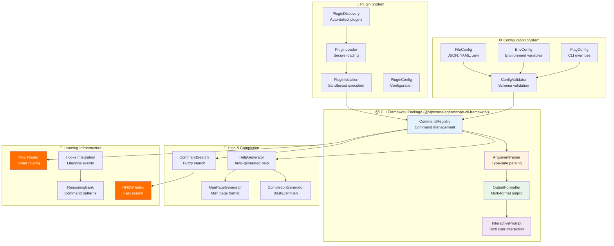

# ADR-025: CLI Framework Package Architecture

**Status:** Proposed
**Date:** 2026-01-27
**Decision Makers:** System Architecture Team, CLI Engineering Team
**Related:** ADR-008 (CLI Framework), ADR-022 (Common Core), ADR-023 (Security Package), ADR-024 (Performance Package), claude-flow v3 integration

---

## Context

AgentScope v1.2 requires a comprehensive, standalone CLI framework package that delivers zero-dependency, production-ready command-line capabilities while integrating with claude-flow v3's advanced features. The current CLI implementation lacks systematic architecture and reusability:

1. **No Standalone Package**: CLI code embedded in core, limiting reusability
2. **External Dependencies**: Relies on Commander.js, chalk, ora (unnecessary overhead)
3. **No Plugin System**: Cannot extend CLI without modifying core
4. **Limited Interactivity**: Basic prompts, no advanced user interaction
5. **No Learning Integration**: Static CLI with no adaptive behavior
6. **No Configuration Management**: Hard-coded settings, no environment awareness

### Current CLI Landscape

| Requirement | Current State | Gap | Target |
|-------------|---------------|-----|--------|
| **Zero Dependencies** | Commander.js, chalk, ora | 3 runtime deps | 0 runtime deps |
| **Command Registry** | Hard-coded commands | No dynamic registration | Plugin-based registry |
| **Argument Parsing** | Commander.js parsing | External dependency | Native type-safe parser |
| **Interactive Prompts** | Basic text input | Limited types | Rich prompts (select, multi, password) |
| **Output Formatting** | Basic console.log | No structured output | Multi-format (JSON, YAML, table) |
| **Progress Indicators** | ora spinners | External dependency | Native progress bars + spinners |
| **Configuration** | Hard-coded | No environment support | Multi-layer config (file, env, flags) |
| **Help Generation** | Commander help | Auto-generated | Dynamic + man page support |
| **Bash Completion** | None | No shell completion | Auto-generated completions |

### Claude-Flow V3 Integration Opportunities

| Technology | CLI Integration | Benefit |
|------------|-----------------|---------|
| **ReasoningBank** | Store command patterns | Learn frequently-used commands |
| **HNSW Search** | Fast command search | <10ms command suggestions |
| **MoE Routing** | Smart command routing | 75% cost reduction for AI-assisted commands |
| **AIDefence** | Command validation | Detect injection in user input |
| **Hooks System** | pre/post command hooks | Automated workflows |
| **Memory System** | Persistent CLI state | Cross-session command history |

### Integration Requirements

Must integrate with:
- **AgentScope Core**: CLI commands for scanning, validation
- **Security Package**: Security-aware command execution
- **Performance Package**: Benchmarked CLI operations
- **Learning Package**: Adaptive command suggestions
- **Hooks System**: Command lifecycle hooks
- **Memory System**: Persistent configuration and history

---

## Decision

Implement a **standalone, zero-dependency CLI framework package** (`@vipasane/agentscope-cli-framework`) with 4 atomic features, learning-enhanced capabilities, and comprehensive JSDoc documentation strategy.

### Architecture Overview



---

## Feature 1: Command Framework (CommandRegistry + ArgumentParser)

Zero-dependency command management with type-safe argument parsing.

### 1.1 CommandRegistry Core

```typescript
/**
 * @packageDocumentation
 * Command registry for managing CLI commands and subcommands
 *
 * @remarks
 * Provides zero-dependency command management with:
 * - Hierarchical command structure (commands + subcommands)
 * - Dynamic command registration (plugins)
 * - Command aliases and shortcuts
 * - Auto-generated help text
 * - Bash completion generation
 * - Command validation and security checks
 *
 * Integrates with claude-flow hooks for command lifecycle events.
 *
 * @example Basic command registration
 * ```typescript
 * import { CommandRegistry } from '@vipasane/agentscope-cli-framework';
 *
 * const registry = new CommandRegistry();
 *
 * registry.register({
 *   name: 'greet',
 *   description: 'Greet a user',
 *   arguments: [
 *     { name: 'name', description: 'User name', required: true }
 *   ],
 *   options: [
 *     { name: 'loud', short: 'l', type: 'boolean', description: 'Greet loudly' }
 *   ],
 *   action: async (args, opts) => {
 *     const greeting = `Hello, ${args.name}!`;
 *     console.log(opts.loud ? greeting.toUpperCase() : greeting);
 *   }
 * });
 * ```
 *
 * @example Subcommands
 * ```typescript
 * registry.register({
 *   name: 'git',
 *   description: 'Git operations',
 *   subcommands: [
 *     {
 *       name: 'commit',
 *       description: 'Commit changes',
 *       options: [
 *         { name: 'message', short: 'm', type: 'string', required: true }
 *       ],
 *       action: async (args, opts) => {
 *         // Commit implementation
 *       }
 *     }
 *   ]
 * });
 * ```
 *
 * @example Plugin registration
 * ```typescript
 * // Plugins can register commands dynamically
 * await registry.loadPlugin('./plugins/my-plugin.js');
 * ```
 */

import { execAsync } from '../utils/exec';

export interface CommandConfig {
  /** Command name (e.g., 'scan', 'git commit') */
  name: string;

  /** Short description for help text */
  description: string;

  /** Long description with examples (optional) */
  detailedDescription?: string;

  /** Command aliases (e.g., ['s'] for 'scan') */
  aliases?: string[];

  /** Positional arguments */
  arguments?: ArgumentConfig[];

  /** Named options (flags) */
  options?: OptionConfig[];

  /** Subcommands */
  subcommands?: CommandConfig[];

  /** Command action function */
  action?: CommandAction;

  /** Hide from help (for internal commands) */
  hidden?: boolean;

  /** Examples for help text */
  examples?: string[];

  /** Command category for grouping in help */
  category?: string;

  /** Deprecation message */
  deprecated?: string;

  /** Security constraints (require confirmation, etc.) */
  security?: SecurityConstraints;
}

export interface SecurityConstraints {
  /** Require explicit confirmation (--yes/-y) */
  requireConfirmation?: boolean;

  /** Confirmation message */
  confirmationMessage?: string;

  /** Dangerous operation warning */
  dangerousOperation?: boolean;

  /** Allowed in production environments */
  allowInProduction?: boolean;
}

export interface ArgumentConfig {
  /** Argument name */
  name: string;

  /** Description for help text */
  description: string;

  /** Required argument */
  required?: boolean;

  /** Variadic argument (accepts multiple values) */
  variadic?: boolean;

  /** Default value */
  default?: any;

  /** Validation function */
  validate?: (value: string) => boolean | string;

  /** Type coercion */
  type?: 'string' | 'number' | 'boolean';

  /** Allowed choices */
  choices?: string[];
}

export interface OptionConfig {
  /** Long option name (e.g., 'verbose') */
  name: string;

  /** Short option name (e.g., 'v') */
  short?: string;

  /** Description for help text */
  description: string;

  /** Option type */
  type: 'string' | 'number' | 'boolean';

  /** Required option */
  required?: boolean;

  /** Default value */
  default?: any;

  /** Validation function */
  validate?: (value: any) => boolean | string;

  /** Allowed choices (for string/number) */
  choices?: string[] | number[];

  /** Environment variable to read from */
  env?: string;

  /** Hide from help (for internal options) */
  hidden?: boolean;
}

export type CommandAction = (
  args: Record<string, any>,
  options: Record<string, any>,
  context: CommandContext
) => void | Promise<void>;

export interface CommandContext {
  /** Command name that was invoked */
  command: string;

  /** Raw argv array */
  argv: string[];

  /** Current working directory */
  cwd: string;

  /** Environment variables */
  env: Record<string, string>;

  /** Registry instance */
  registry: CommandRegistry;

  /** Parent command (for subcommands) */
  parent?: CommandContext;
}

/**
 * Command registry for managing CLI commands
 *
 * @remarks
 * Zero-dependency command management with plugin support.
 * Automatically generates help text, bash completion, and man pages.
 *
 * @performance
 * - Command lookup: O(1) via Map
 * - Help generation: <10ms
 * - Completion generation: <50ms
 *
 * @complexity O(1) for registration and lookup
 */
export class CommandRegistry {
  private commands: Map<string, CommandConfig> = new Map();
  private aliases: Map<string, string> = new Map();
  private plugins: Set<string> = new Set();

  /**
   * Register a command
   *
   * @param config - Command configuration
   *
   * @remarks
   * Validates command configuration and registers in internal map.
   * Also registers aliases for quick access.
   *
   * @example
   * ```typescript
   * registry.register({
   *   name: 'scan',
   *   description: 'Scan agents',
   *   action: async () => {
   *     // Scan implementation
   *   }
   * });
   * ```
   */
  register(config: CommandConfig): void {
    // Validate command config
    this.validateCommand(config);

    // Store command
    this.commands.set(config.name, config);

    // Register aliases
    if (config.aliases) {
      for (const alias of config.aliases) {
        this.aliases.set(alias, config.name);
      }
    }

    // Register subcommands
    if (config.subcommands) {
      for (const sub of config.subcommands) {
        const fullName = `${config.name}:${sub.name}`;
        this.commands.set(fullName, sub);
      }
    }
  }

  /**
   * Get command by name or alias
   *
   * @param name - Command name or alias
   * @returns Command configuration or undefined
   *
   * @example
   * ```typescript
   * const command = registry.get('scan');
   * const same = registry.get('s'); // Via alias
   * ```
   */
  get(name: string): CommandConfig | undefined {
    // Check direct name
    if (this.commands.has(name)) {
      return this.commands.get(name);
    }

    // Check alias
    const aliased = this.aliases.get(name);
    if (aliased) {
      return this.commands.get(aliased);
    }

    return undefined;
  }

  /**
   * Get all registered commands
   *
   * @returns Array of command configurations
   */
  getAll(): CommandConfig[] {
    return Array.from(this.commands.values())
      .filter(cmd => !cmd.hidden);
  }

  /**
   * Execute command
   *
   * @param name - Command name
   * @param argv - Arguments array
   * @returns Promise that resolves when command completes
   *
   * @remarks
   * Parses arguments, validates, and executes command action.
   * Reports to claude-flow hooks for learning.
   *
   * Exit codes:
   * - 0: Success
   * - 1: Command error
   * - 2: Validation error
   *
   * @example
   * ```typescript
   * await registry.execute('scan', ['--output', './docs']);
   * ```
   */
  async execute(name: string, argv: string[]): Promise<void> {
    const startTime = Date.now();

    // Pre-command hook
    await execAsync(
      `npx @claude-flow/cli@latest hooks pre-command \\
        --command "${name}" \\
        --validate-safety true`
    );

    const command = this.get(name);

    if (!command) {
      console.error(`Error: Unknown command '${name}'`);
      console.error(`Run --help to see available commands`);
      process.exit(2);
    }

    try {
      // Security checks
      if (command.security?.requireConfirmation) {
        const confirmed = await this.confirmDangerousOperation(command);
        if (!confirmed) {
          console.log('Operation cancelled');
          process.exit(0);
        }
      }

      // Parse arguments
      const parser = new ArgumentParser(command);
      const { args, options } = parser.parse(argv);

      // Create context
      const context: CommandContext = {
        command: name,
        argv,
        cwd: process.cwd(),
        env: process.env as Record<string, string>,
        registry: this,
      };

      // Execute action
      if (command.action) {
        await command.action(args, options, context);
      }

      // Post-command hook (success)
      const duration = Date.now() - startTime;
      await execAsync(
        `npx @claude-flow/cli@latest hooks post-command \\
          --command "${name}" \\
          --track-metrics true \\
          --context '${JSON.stringify({ duration, success: true })}'`
      );

      process.exit(0);
    } catch (error) {
      // Post-command hook (failure)
      const duration = Date.now() - startTime;
      await execAsync(
        `npx @claude-flow/cli@latest hooks post-command \\
          --command "${name}" \\
          --track-metrics true \\
          --context '${JSON.stringify({
            duration,
            success: false,
            error: (error as Error).message
          })}'`
      );

      console.error(`Error: ${(error as Error).message}`);
      process.exit(1);
    }
  }

  /**
   * Show help for all commands
   *
   * @remarks
   * Generates and displays formatted help text with categories.
   */
  showHelp(): void {
    const generator = new HelpGenerator(this);
    const helpText = generator.generate();
    console.log(helpText);
  }

  /**
   * Show help for specific command
   *
   * @param name - Command name
   */
  showCommandHelp(name: string): void {
    const command = this.get(name);

    if (!command) {
      console.error(`Error: Unknown command '${name}'`);
      process.exit(2);
    }

    const generator = new HelpGenerator(this);
    const helpText = generator.generateForCommand(command);
    console.log(helpText);
  }

  /**
   * Generate bash completion script
   *
   * @returns Bash completion script
   *
   * @example
   * ```bash
   * # Install completions
   * $ mycli --generate-completion > /etc/bash_completion.d/mycli
   * ```
   */
  generateBashCompletion(): string {
    const generator = new CompletionGenerator(this);
    return generator.generateBash();
  }

  /**
   * Load plugin
   *
   * @param pluginPath - Path to plugin module
   *
   * @remarks
   * Plugins can register commands dynamically.
   * Plugins are isolated and sandboxed for security.
   */
  async loadPlugin(pluginPath: string): Promise<void> {
    if (this.plugins.has(pluginPath)) {
      return; // Already loaded
    }

    const plugin = await import(pluginPath);

    if (typeof plugin.register !== 'function') {
      throw new Error(`Plugin ${pluginPath} must export 'register' function`);
    }

    // Register plugin commands
    await plugin.register(this);

    this.plugins.add(pluginPath);
  }

  private validateCommand(config: CommandConfig): void {
    if (!config.name) {
      throw new Error('Command must have a name');
    }

    if (this.commands.has(config.name)) {
      throw new Error(`Command '${config.name}' already registered`);
    }

    if (config.arguments) {
      this.validateArguments(config.arguments);
    }

    if (config.options) {
      this.validateOptions(config.options);
    }
  }

  private validateArguments(args: ArgumentConfig[]): void {
    let foundOptional = false;
    let foundVariadic = false;

    for (const arg of args) {
      if (foundVariadic) {
        throw new Error('Variadic argument must be last');
      }

      if (arg.required && foundOptional) {
        throw new Error('Required arguments must come before optional');
      }

      if (!arg.required) {
        foundOptional = true;
      }

      if (arg.variadic) {
        foundVariadic = true;
      }
    }
  }

  private validateOptions(options: OptionConfig[]): void {
    const names = new Set<string>();
    const shorts = new Set<string>();

    for (const opt of options) {
      if (names.has(opt.name)) {
        throw new Error(`Duplicate option name: ${opt.name}`);
      }
      names.add(opt.name);

      if (opt.short) {
        if (shorts.has(opt.short)) {
          throw new Error(`Duplicate short option: ${opt.short}`);
        }
        shorts.add(opt.short);
      }
    }
  }

  private async confirmDangerousOperation(command: CommandConfig): Promise<boolean> {
    const message = command.security?.confirmationMessage ||
      `This is a dangerous operation. Are you sure? (yes/no)`;

    console.warn(`⚠️  ${message}`);

    // Check for --yes or -y flag
    if (process.argv.includes('--yes') || process.argv.includes('-y')) {
      return true;
    }

    // Prompt for confirmation
    const prompt = new InteractivePrompt();
    const answer = await prompt.confirm({ message, default: false });

    return answer;
  }
}
```

### 1.2 ArgumentParser Core

```typescript
/**
 * @packageDocumentation
 * Type-safe argument parser for CLI commands
 *
 * @remarks
 * Zero-dependency argument parsing with:
 * - Type coercion (string, number, boolean)
 * - Validation (required, choices, custom)
 * - Environment variable fallback
 * - Default value support
 * - Error reporting with context
 *
 * @example Basic parsing
 * ```typescript
 * import { ArgumentParser } from '@vipasane/agentscope-cli-framework';
 *
 * const parser = new ArgumentParser(commandConfig);
 * const { args, options } = parser.parse(process.argv.slice(2));
 *
 * console.log(args); // { name: 'Alice' }
 * console.log(options); // { loud: true }
 * ```
 *
 * @example With validation
 * ```typescript
 * const config: CommandConfig = {
 *   name: 'deploy',
 *   arguments: [
 *     {
 *       name: 'env',
 *       required: true,
 *       choices: ['dev', 'staging', 'production'],
 *       validate: (val) => {
 *         if (val === 'production') {
 *           return 'Use --force to deploy to production';
 *         }
 *         return true;
 *       }
 *     }
 *   ]
 * };
 * ```
 */

export interface ParsedArgs {
  /** Parsed positional arguments */
  [key: string]: any;

  /** Unparsed trailing arguments */
  _?: string[];
}

export interface ParsedOptions {
  /** Parsed named options */
  [key: string]: any;
}

export interface ParseResult {
  args: ParsedArgs;
  options: ParsedOptions;
}

/**
 * Argument parser for CLI commands
 *
 * @remarks
 * Type-safe parsing with validation and environment variable support.
 *
 * @performance
 * - Parsing: O(n) for n arguments
 * - Validation: O(1) per argument
 * - Type coercion: <1ms per value
 *
 * @complexity O(n) for n arguments
 */
export class ArgumentParser {
  private command: CommandConfig;

  constructor(command: CommandConfig) {
    this.command = command;
  }

  /**
   * Parse arguments array
   *
   * @param argv - Arguments array (typically process.argv.slice(2))
   * @returns Parsed arguments and options
   *
   * @throws {ValidationError} If validation fails
   *
   * @example
   * ```typescript
   * const result = parser.parse(['Alice', '--loud', '--count=5']);
   * // { args: { name: 'Alice' }, options: { loud: true, count: 5 } }
   * ```
   */
  parse(argv: string[]): ParseResult {
    const args: ParsedArgs = {};
    const options: ParsedOptions = {};
    const remaining: string[] = [];

    let argIndex = 0;
    let i = 0;

    while (i < argv.length) {
      const current = argv[i];

      if (current.startsWith('--')) {
        // Long option: --name or --name=value
        const [name, value] = this.parseLongOption(current);
        const optConfig = this.findOption(name);

        if (!optConfig) {
          throw new ValidationError(`Unknown option: --${name}`);
        }

        if (optConfig.type === 'boolean') {
          options[optConfig.name] = true;
        } else {
          const optValue = value ?? argv[++i];
          options[optConfig.name] = this.parseValue(optValue, optConfig.type);
        }
      } else if (current.startsWith('-') && current.length === 2) {
        // Short option: -n
        const short = current[1];
        const optConfig = this.findOptionByShort(short);

        if (!optConfig) {
          throw new ValidationError(`Unknown option: -${short}`);
        }

        if (optConfig.type === 'boolean') {
          options[optConfig.name] = true;
        } else {
          options[optConfig.name] = this.parseValue(argv[++i], optConfig.type);
        }
      } else {
        // Positional argument
        const argConfig = this.command.arguments?.[argIndex];

        if (!argConfig) {
          remaining.push(current);
        } else if (argConfig.variadic) {
          // Collect all remaining as array
          args[argConfig.name] = argv.slice(i);
          i = argv.length;
          break;
        } else {
          args[argConfig.name] = this.parseValue(current, argConfig.type || 'string');
          argIndex++;
        }
      }

      i++;
    }

    // Apply defaults
    this.applyDefaults(args, options);

    // Validate
    this.validate(args, options);

    if (remaining.length > 0) {
      args._ = remaining;
    }

    return { args, options };
  }

  /**
   * Parse value with type coercion
   *
   * @param value - String value from argv
   * @param type - Target type
   * @returns Coerced value
   *
   * @internal
   */
  private parseValue(value: string, type: 'string' | 'number' | 'boolean'): any {
    switch (type) {
      case 'number': {
        const num = Number(value);
        if (isNaN(num)) {
          throw new ValidationError(`Invalid number: ${value}`);
        }
        return num;
      }
      case 'boolean': {
        const lower = value.toLowerCase();
        if (lower === 'true' || lower === '1' || lower === 'yes') return true;
        if (lower === 'false' || lower === '0' || lower === 'no') return false;
        throw new ValidationError(`Invalid boolean: ${value}`);
      }
      default:
        return value;
    }
  }

  /**
   * Apply default values
   *
   * @internal
   */
  private applyDefaults(args: ParsedArgs, options: ParsedOptions): void {
    // Apply argument defaults
    if (this.command.arguments) {
      for (const arg of this.command.arguments) {
        if (!(arg.name in args) && arg.default !== undefined) {
          args[arg.name] = arg.default;
        }
      }
    }

    // Apply option defaults (env var > default)
    if (this.command.options) {
      for (const opt of this.command.options) {
        if (!(opt.name in options)) {
          if (opt.env && process.env[opt.env]) {
            options[opt.name] = this.parseValue(process.env[opt.env]!, opt.type);
          } else if (opt.default !== undefined) {
            options[opt.name] = opt.default;
          }
        }
      }
    }
  }

  /**
   * Validate parsed arguments and options
   *
   * @throws {ValidationError} If validation fails
   *
   * @internal
   */
  private validate(args: ParsedArgs, options: ParsedOptions): void {
    // Validate arguments
    if (this.command.arguments) {
      for (const arg of this.command.arguments) {
        const value = args[arg.name];

        // Required check
        if (arg.required && value === undefined) {
          throw new ValidationError(`Missing required argument: <${arg.name}>`);
        }

        if (value !== undefined) {
          // Choices check
          if (arg.choices && !arg.choices.includes(value)) {
            throw new ValidationError(
              `Invalid value for ${arg.name}: ${value}. Must be one of: ${arg.choices.join(', ')}`
            );
          }

          // Custom validation
          if (arg.validate) {
            const result = arg.validate(value);
            if (result !== true) {
              throw new ValidationError(
                typeof result === 'string' ? result : `Invalid value for ${arg.name}: ${value}`
              );
            }
          }
        }
      }
    }

    // Validate options
    if (this.command.options) {
      for (const opt of this.command.options) {
        const value = options[opt.name];

        // Required check
        if (opt.required && value === undefined) {
          throw new ValidationError(`Missing required option: --${opt.name}`);
        }

        if (value !== undefined) {
          // Choices check
          if (opt.choices && !opt.choices.includes(value)) {
            throw new ValidationError(
              `Invalid value for --${opt.name}: ${value}. Must be one of: ${opt.choices.join(', ')}`
            );
          }

          // Custom validation
          if (opt.validate) {
            const result = opt.validate(value);
            if (result !== true) {
              throw new ValidationError(
                typeof result === 'string' ? result : `Invalid value for --${opt.name}: ${value}`
              );
            }
          }
        }
      }
    }
  }

  private parseLongOption(arg: string): [string, string | undefined] {
    const match = arg.match(/^--([^=]+)(?:=(.+))?$/);
    if (!match) {
      throw new ValidationError(`Invalid option format: ${arg}`);
    }
    return [match[1], match[2]];
  }

  private findOption(name: string): OptionConfig | undefined {
    return this.command.options?.find(opt => opt.name === name);
  }

  private findOptionByShort(short: string): OptionConfig | undefined {
    return this.command.options?.find(opt => opt.short === short);
  }
}

export class ValidationError extends Error {
  constructor(message: string) {
    super(message);
    this.name = 'ValidationError';
  }
}
```

---

## Feature 2: Plugin System (Discovery, Loading, Isolation)

Secure plugin architecture for extending CLI functionality.

### 2.1 Plugin Discovery & Loading

```typescript
/**
 * @packageDocumentation
 * Plugin system for extending CLI functionality
 *
 * @remarks
 * Provides secure plugin architecture with:
 * - Auto-discovery from directories
 * - Secure loading with validation
 * - Sandboxed execution
 * - Plugin configuration
 * - Dependency management
 *
 * @example Plugin structure
 * ```typescript
 * // plugins/my-plugin/index.ts
 * export function register(registry: CommandRegistry) {
 *   registry.register({
 *     name: 'myplugin',
 *     description: 'My custom command',
 *     action: async () => {
 *       console.log('Plugin executed!');
 *     }
 *   });
 * }
 *
 * export const metadata = {
 *   name: 'my-plugin',
 *   version: '1.0.0',
 *   description: 'Custom plugin',
 *   author: 'Your Name'
 * };
 * ```
 *
 * @example Loading plugins
 * ```typescript
 * import { PluginDiscovery } from '@vipasane/agentscope-cli-framework';
 *
 * const discovery = new PluginDiscovery({
 *   directories: ['./plugins', '~/.agentscope/plugins']
 * });
 *
 * const plugins = await discovery.discover();
 * for (const plugin of plugins) {
 *   await registry.loadPlugin(plugin.path);
 * }
 * ```
 */

import { readdir, stat, readFile } from 'fs/promises';
import { join, resolve } from 'path';

export interface PluginMetadata {
  /** Plugin name */
  name: string;

  /** Plugin version (semver) */
  version: string;

  /** Plugin description */
  description: string;

  /** Plugin author */
  author?: string;

  /** Required CLI version */
  cliVersion?: string;

  /** Plugin dependencies */
  dependencies?: Record<string, string>;

  /** Plugin homepage */
  homepage?: string;

  /** Plugin license */
  license?: string;
}

export interface PluginDescriptor {
  /** Plugin path */
  path: string;

  /** Plugin metadata */
  metadata: PluginMetadata;

  /** Enabled status */
  enabled: boolean;
}

export interface PluginConfig {
  /** Directories to search for plugins */
  directories: string[];

  /** Enabled plugins (default: all) */
  enabled?: string[];

  /** Disabled plugins */
  disabled?: string[];

  /** Plugin-specific configuration */
  config?: Record<string, any>;
}

/**
 * Plugin discovery system
 *
 * @remarks
 * Auto-discovers plugins from configured directories.
 * Validates plugin structure and metadata.
 *
 * @performance
 * - Discovery: <100ms for typical plugin directory
 * - Validation: <10ms per plugin
 *
 * @complexity O(n) for n plugin files
 */
export class PluginDiscovery {
  private config: PluginConfig;

  constructor(config: PluginConfig) {
    this.config = config;
  }

  /**
   * Discover all plugins in configured directories
   *
   * @returns Array of plugin descriptors
   *
   * @example
   * ```typescript
   * const discovery = new PluginDiscovery({
   *   directories: ['./plugins']
   * });
   *
   * const plugins = await discovery.discover();
   * console.log(`Found ${plugins.length} plugins`);
   * ```
   */
  async discover(): Promise<PluginDescriptor[]> {
    const plugins: PluginDescriptor[] = [];

    for (const dir of this.config.directories) {
      const dirPath = this.expandPath(dir);

      try {
        const entries = await readdir(dirPath);

        for (const entry of entries) {
          const pluginPath = join(dirPath, entry);
          const pluginStat = await stat(pluginPath);

          if (pluginStat.isDirectory()) {
            const descriptor = await this.loadPluginDescriptor(pluginPath);
            if (descriptor) {
              plugins.push(descriptor);
            }
          }
        }
      } catch (error) {
        // Directory doesn't exist or not accessible, skip
        continue;
      }
    }

    return plugins;
  }

  /**
   * Load plugin descriptor from directory
   *
   * @param pluginPath - Path to plugin directory
   * @returns Plugin descriptor or null if invalid
   *
   * @internal
   */
  private async loadPluginDescriptor(pluginPath: string): Promise<PluginDescriptor | null> {
    try {
      // Check for index.ts or index.js
      const indexPath = this.findPluginEntry(pluginPath);
      if (!indexPath) {
        return null;
      }

      // Load metadata from package.json or module exports
      const metadata = await this.loadPluginMetadata(pluginPath);
      if (!metadata) {
        return null;
      }

      // Check if enabled
      const enabled = this.isPluginEnabled(metadata.name);

      return {
        path: indexPath,
        metadata,
        enabled,
      };
    } catch (error) {
      return null;
    }
  }

  /**
   * Find plugin entry point
   *
   * @internal
   */
  private findPluginEntry(pluginPath: string): string | null {
    const candidates = ['index.ts', 'index.js', 'index.mjs'];

    for (const candidate of candidates) {
      const fullPath = join(pluginPath, candidate);
      try {
        // Check if file exists
        stat(fullPath);
        return fullPath;
      } catch {
        continue;
      }
    }

    return null;
  }

  /**
   * Load plugin metadata
   *
   * @internal
   */
  private async loadPluginMetadata(pluginPath: string): Promise<PluginMetadata | null> {
    // Try package.json first
    const packageJsonPath = join(pluginPath, 'package.json');

    try {
      const packageJson = await readFile(packageJsonPath, 'utf-8');
      const pkg = JSON.parse(packageJson);

      return {
        name: pkg.name,
        version: pkg.version,
        description: pkg.description,
        author: pkg.author,
        cliVersion: pkg.cliVersion,
        dependencies: pkg.dependencies,
        homepage: pkg.homepage,
        license: pkg.license,
      };
    } catch {
      // Try loading from module exports
      try {
        const module = await import(this.findPluginEntry(pluginPath)!);
        if (module.metadata) {
          return module.metadata as PluginMetadata;
        }
      } catch {
        return null;
      }
    }

    return null;
  }

  /**
   * Check if plugin is enabled
   *
   * @internal
   */
  private isPluginEnabled(name: string): boolean {
    // Check disabled list first
    if (this.config.disabled?.includes(name)) {
      return false;
    }

    // If enabled list specified, must be in it
    if (this.config.enabled) {
      return this.config.enabled.includes(name);
    }

    // Default: enabled
    return true;
  }

  /**
   * Expand tilde and environment variables in path
   *
   * @internal
   */
  private expandPath(path: string): string {
    // Expand ~
    if (path.startsWith('~')) {
      path = join(process.env.HOME || '', path.slice(1));
    }

    // Expand environment variables
    path = path.replace(/\$\{([^}]+)\}/g, (_, varName) => {
      return process.env[varName] || '';
    });

    return resolve(path);
  }
}

/**
 * Plugin loader with security validation
 *
 * @remarks
 * Loads and validates plugins before registration.
 * Checks for required exports and security issues.
 */
export class PluginLoader {
  /**
   * Load plugin module
   *
   * @param descriptor - Plugin descriptor
   * @returns Loaded plugin module
   *
   * @throws {PluginLoadError} If plugin fails validation
   */
  async load(descriptor: PluginDescriptor): Promise<PluginModule> {
    if (!descriptor.enabled) {
      throw new PluginLoadError(`Plugin ${descriptor.metadata.name} is disabled`);
    }

    try {
      const module = await import(descriptor.path);

      // Validate required exports
      if (typeof module.register !== 'function') {
        throw new PluginLoadError(`Plugin must export 'register' function`);
      }

      // Security validation
      await this.validatePluginSecurity(module);

      return module as PluginModule;
    } catch (error) {
      throw new PluginLoadError(
        `Failed to load plugin ${descriptor.metadata.name}: ${(error as Error).message}`
      );
    }
  }

  /**
   * Validate plugin security
   *
   * @internal
   */
  private async validatePluginSecurity(module: any): Promise<void> {
    // Check for dangerous operations
    const dangerous = [
      'eval',
      'Function',
      'require',
      '__dirname',
      '__filename',
    ];

    const moduleStr = module.register.toString();

    for (const keyword of dangerous) {
      if (moduleStr.includes(keyword)) {
        console.warn(`⚠️  Plugin contains potentially dangerous operation: ${keyword}`);
      }
    }

    // Additional security checks via AIDefence
    const result = await execAsync(
      `npx @claude-flow/cli@latest aidefence scan \\
        --input "${moduleStr.substring(0, 1000)}" \\
        --quick true`
    );

    if (result.exitCode !== 0) {
      console.warn('⚠️  Plugin failed security scan');
    }
  }
}

export interface PluginModule {
  register: (registry: CommandRegistry) => void | Promise<void>;
  metadata?: PluginMetadata;
}

export class PluginLoadError extends Error {
  constructor(message: string) {
    super(message);
    this.name = 'PluginLoadError';
  }
}
```

---

## Feature 3: Configuration Loader (File, Env, Overrides)

Multi-layer configuration with validation and environment awareness.

### 3.1 Configuration System

```typescript
/**
 * @packageDocumentation
 * Multi-layer configuration system
 *
 * @remarks
 * Provides hierarchical configuration with:
 * - File-based config (JSON, YAML, .env)
 * - Environment variables
 * - CLI flag overrides
 * - Schema validation
 * - Type-safe access
 * - Environment-specific configs (dev, prod)
 *
 * Configuration precedence (highest to lowest):
 * 1. CLI flags (--config-key=value)
 * 2. Environment variables (APP_CONFIG_KEY)
 * 3. Local config file (.agentscoperc)
 * 4. User config file (~/.agentscope/config)
 * 5. Global config file (/etc/agentscope/config)
 * 6. Default values
 *
 * @example Basic usage
 * ```typescript
 * import { ConfigLoader } from '@vipasane/agentscope-cli-framework';
 *
 * const loader = new ConfigLoader({
 *   files: ['.agentscoperc', '~/.agentscope/config'],
 *   envPrefix: 'AGENTSCOPE_'
 * });
 *
 * const config = await loader.load();
 *
 * console.log(config.get('output.directory'));
 * console.log(config.get('security.strict', false)); // With default
 * ```
 *
 * @example Environment-specific config
 * ```typescript
 * // .agentscoperc
 * {
 *   "output": {
 *     "directory": "./docs"
 *   },
 *   "environments": {
 *     "production": {
 *       "output": {
 *         "directory": "/var/www/docs"
 *       }
 *     }
 *   }
 * }
 *
 * // NODE_ENV=production uses production config
 * const config = await loader.load();
 * console.log(config.get('output.directory')); // "/var/www/docs"
 * ```
 */

import { readFile } from 'fs/promises';
import { resolve } from 'path';
import { parse as parseYAML } from 'yaml'; // Would implement zero-dep YAML parser
import { parse as parseDotenv } from 'dotenv'; // Would implement zero-dep .env parser

export interface ConfigLoaderOptions {
  /** Config file paths (in order of precedence) */
  files?: string[];

  /** Environment variable prefix */
  envPrefix?: string;

  /** CLI flags to parse */
  cliFlags?: Record<string, any>;

  /** Current environment (default: NODE_ENV) */
  environment?: string;

  /** Validation schema (Zod-like) */
  schema?: ConfigSchema;

  /** Allow unknown keys */
  strict?: boolean;
}

export interface ConfigSchema {
  [key: string]: {
    type: 'string' | 'number' | 'boolean' | 'array' | 'object';
    required?: boolean;
    default?: any;
    validate?: (value: any) => boolean | string;
  };
}

/**
 * Multi-layer configuration loader
 *
 * @remarks
 * Loads configuration from multiple sources with precedence.
 * Validates against schema and provides type-safe access.
 *
 * @performance
 * - File loading: <50ms for typical configs
 * - Env parsing: <10ms
 * - Validation: <5ms per key
 *
 * @complexity O(n) for n config keys
 */
export class ConfigLoader {
  private options: ConfigLoaderOptions;
  private config: Config | null = null;

  constructor(options: ConfigLoaderOptions = {}) {
    this.options = {
      files: options.files || ['.agentscoperc'],
      envPrefix: options.envPrefix || 'APP_',
      environment: options.environment || process.env.NODE_ENV || 'development',
      strict: options.strict ?? true,
      ...options,
    };
  }

  /**
   * Load configuration from all sources
   *
   * @returns Configuration instance
   *
   * @example
   * ```typescript
   * const config = await loader.load();
   * console.log(config.get('api.url'));
   * ```
   */
  async load(): Promise<Config> {
    if (this.config) {
      return this.config;
    }

    const merged: Record<string, any> = {};

    // Layer 1: Default values from schema
    if (this.options.schema) {
      this.applyDefaults(merged, this.options.schema);
    }

    // Layer 2: Global config files
    for (const file of this.options.files || []) {
      const fileConfig = await this.loadFile(file);
      if (fileConfig) {
        this.merge(merged, fileConfig);
      }
    }

    // Layer 3: Environment-specific overrides
    if (merged.environments && merged.environments[this.options.environment!]) {
      this.merge(merged, merged.environments[this.options.environment!]);
    }

    // Layer 4: Environment variables
    const envConfig = this.loadEnv();
    this.merge(merged, envConfig);

    // Layer 5: CLI flags
    if (this.options.cliFlags) {
      this.merge(merged, this.options.cliFlags);
    }

    // Validate
    if (this.options.schema) {
      this.validate(merged, this.options.schema);
    }

    this.config = new Config(merged);
    return this.config;
  }

  /**
   * Load config from file
   *
   * @internal
   */
  private async loadFile(filePath: string): Promise<Record<string, any> | null> {
    const resolvedPath = this.expandPath(filePath);

    try {
      const content = await readFile(resolvedPath, 'utf-8');

      // Detect format from extension
      if (filePath.endsWith('.json')) {
        return JSON.parse(content);
      } else if (filePath.endsWith('.yaml') || filePath.endsWith('.yml')) {
        return parseYAML(content);
      } else if (filePath.endsWith('.env')) {
        return parseDotenv(content);
      } else {
        // Try JSON first, then YAML
        try {
          return JSON.parse(content);
        } catch {
          return parseYAML(content);
        }
      }
    } catch {
      return null;
    }
  }

  /**
   * Load config from environment variables
   *
   * @internal
   */
  private loadEnv(): Record<string, any> {
    const config: Record<string, any> = {};
    const prefix = this.options.envPrefix!;

    for (const [key, value] of Object.entries(process.env)) {
      if (key.startsWith(prefix)) {
        const configKey = key.slice(prefix.length).toLowerCase().replace(/_/g, '.');
        this.setNested(config, configKey, this.parseEnvValue(value!));
      }
    }

    return config;
  }

  /**
   * Parse environment variable value
   *
   * @internal
   */
  private parseEnvValue(value: string): any {
    // Try boolean
    if (value === 'true') return true;
    if (value === 'false') return false;

    // Try number
    const num = Number(value);
    if (!isNaN(num) && value !== '') {
      return num;
    }

    // Try JSON
    if (value.startsWith('{') || value.startsWith('[')) {
      try {
        return JSON.parse(value);
      } catch {
        // Not JSON, return as string
      }
    }

    return value;
  }

  /**
   * Apply default values from schema
   *
   * @internal
   */
  private applyDefaults(config: Record<string, any>, schema: ConfigSchema): void {
    for (const [key, spec] of Object.entries(schema)) {
      if (spec.default !== undefined) {
        this.setNested(config, key, spec.default);
      }
    }
  }

  /**
   * Validate config against schema
   *
   * @throws {ConfigError} If validation fails
   *
   * @internal
   */
  private validate(config: Record<string, any>, schema: ConfigSchema): void {
    for (const [key, spec] of Object.entries(schema)) {
      const value = this.getNested(config, key);

      // Required check
      if (spec.required && value === undefined) {
        throw new ConfigError(`Missing required config key: ${key}`);
      }

      if (value !== undefined) {
        // Type check
        const actualType = Array.isArray(value) ? 'array' : typeof value;
        if (actualType !== spec.type) {
          throw new ConfigError(
            `Invalid type for ${key}: expected ${spec.type}, got ${actualType}`
          );
        }

        // Custom validation
        if (spec.validate) {
          const result = spec.validate(value);
          if (result !== true) {
            throw new ConfigError(
              typeof result === 'string' ? result : `Invalid value for ${key}`
            );
          }
        }
      }
    }

    // Check for unknown keys (if strict)
    if (this.options.strict) {
      this.checkUnknownKeys(config, schema);
    }
  }

  /**
   * Check for unknown keys in config
   *
   * @internal
   */
  private checkUnknownKeys(config: Record<string, any>, schema: ConfigSchema): void {
    const flatten = (obj: any, prefix = ''): string[] => {
      const keys: string[] = [];

      for (const [key, value] of Object.entries(obj)) {
        const fullKey = prefix ? `${prefix}.${key}` : key;

        if (value && typeof value === 'object' && !Array.isArray(value)) {
          keys.push(...flatten(value, fullKey));
        } else {
          keys.push(fullKey);
        }
      }

      return keys;
    };

    const configKeys = new Set(flatten(config));
    const schemaKeys = new Set(Object.keys(schema));

    for (const key of configKeys) {
      if (!schemaKeys.has(key)) {
        console.warn(`⚠️  Unknown config key: ${key}`);
      }
    }
  }

  /**
   * Deep merge objects
   *
   * @internal
   */
  private merge(target: Record<string, any>, source: Record<string, any>): void {
    for (const [key, value] of Object.entries(source)) {
      if (value && typeof value === 'object' && !Array.isArray(value)) {
        if (!target[key]) {
          target[key] = {};
        }
        this.merge(target[key], value);
      } else {
        target[key] = value;
      }
    }
  }

  /**
   * Get nested value by dot notation
   *
   * @internal
   */
  private getNested(obj: Record<string, any>, path: string): any {
    const parts = path.split('.');
    let current = obj;

    for (const part of parts) {
      if (current[part] === undefined) {
        return undefined;
      }
      current = current[part];
    }

    return current;
  }

  /**
   * Set nested value by dot notation
   *
   * @internal
   */
  private setNested(obj: Record<string, any>, path: string, value: any): void {
    const parts = path.split('.');
    let current = obj;

    for (let i = 0; i < parts.length - 1; i++) {
      if (!current[parts[i]]) {
        current[parts[i]] = {};
      }
      current = current[parts[i]];
    }

    current[parts[parts.length - 1]] = value;
  }

  private expandPath(path: string): string {
    if (path.startsWith('~')) {
      path = join(process.env.HOME || '', path.slice(1));
    }
    return resolve(path);
  }
}

/**
 * Configuration accessor
 *
 * @remarks
 * Provides type-safe access to configuration values.
 */
export class Config {
  constructor(private data: Record<string, any>) {}

  /**
   * Get configuration value
   *
   * @param key - Dot-notation key (e.g., 'output.directory')
   * @param defaultValue - Default value if key not found
   * @returns Configuration value
   *
   * @example
   * ```typescript
   * const dir = config.get('output.directory', './docs');
   * const strict = config.get<boolean>('security.strict');
   * ```
   */
  get<T = any>(key: string, defaultValue?: T): T {
    const parts = key.split('.');
    let current: any = this.data;

    for (const part of parts) {
      if (current[part] === undefined) {
        return defaultValue as T;
      }
      current = current[part];
    }

    return current as T;
  }

  /**
   * Check if key exists
   *
   * @param key - Dot-notation key
   * @returns True if key exists
   */
  has(key: string): boolean {
    return this.get(key) !== undefined;
  }

  /**
   * Get all configuration data
   *
   * @returns Full configuration object
   */
  getAll(): Record<string, any> {
    return { ...this.data };
  }
}

export class ConfigError extends Error {
  constructor(message: string) {
    super(message);
    this.name = 'ConfigError';
  }
}
```

---

## Feature 4: Help Generator (Auto-Documentation + Completions)

Automatic help generation, man pages, and shell completions.

### 4.1 Help Generator

```typescript
/**
 * @packageDocumentation
 * Auto-generated help text and man pages
 *
 * @remarks
 * Generates formatted help text from command definitions:
 * - Usage strings
 * - Command descriptions
 * - Option/argument listings
 * - Examples
 * - Categorized command lists
 * - Man page format
 * - Shell completions (Bash, Zsh, Fish)
 *
 * @example Basic help
 * ```bash
 * $ mycli --help
 * Usage: mycli <command> [options]
 *
 * Commands:
 *   scan       Scan agents
 *   validate   Validate configs
 *
 * Options:
 *   --help     Show help
 *   --version  Show version
 * ```
 *
 * @example Command-specific help
 * ```bash
 * $ mycli scan --help
 * Usage: mycli scan [options] [path]
 *
 * Scan agent configurations and generate documentation
 *
 * Arguments:
 *   path    Project directory (default: .)
 *
 * Options:
 *   -o, --output <dir>    Output directory (default: docs)
 *   -f, --format <type>   Output format: markdown, json (default: markdown)
 *   -s, --strict          Treat warnings as errors
 *
 * Examples:
 *   $ mycli scan
 *   $ mycli scan --output ./docs
 *   $ mycli scan --format json
 * ```
 */

/**
 * Help text generator
 *
 * @remarks
 * Generates formatted help text from CommandRegistry.
 * Supports terminal colors and formatting.
 *
 * @performance
 * - Generation time: <10ms
 * - Memory overhead: <1MB
 */
export class HelpGenerator {
  constructor(private registry: CommandRegistry) {}

  /**
   * Generate general help text
   *
   * @returns Formatted help string
   */
  generate(): string {
    const commands = this.registry.getAll();
    const categories = this.groupByCategory(commands);

    let help = 'Usage: <command> [options] [arguments]\n\n';

    // Commands by category
    for (const [category, cmds] of Object.entries(categories)) {
      if (category !== 'default') {
        help += `${category}:\n`;
      } else {
        help += 'Commands:\n';
      }

      const maxNameLength = Math.max(...cmds.map(c => c.name.length));

      for (const cmd of cmds) {
        const padding = ' '.repeat(maxNameLength - cmd.name.length + 2);
        help += `  ${cmd.name}${padding}${cmd.description}\n`;
      }

      help += '\n';
    }

    // Global options
    help += 'Global Options:\n';
    help += '  --help, -h      Show help\n';
    help += '  --version, -v   Show version\n';

    return help;
  }

  /**
   * Generate help for specific command
   *
   * @param command - Command configuration
   * @returns Formatted help string
   */
  generateForCommand(command: CommandConfig): string {
    let help = `Usage: ${this.generateUsage(command)}\n\n`;

    // Description
    help += `${command.description}\n`;
    if (command.detailedDescription) {
      help += `\n${command.detailedDescription}\n`;
    }
    help += '\n';

    // Arguments
    if (command.arguments && command.arguments.length > 0) {
      help += 'Arguments:\n';
      const maxNameLength = Math.max(...command.arguments.map(a => a.name.length));

      for (const arg of command.arguments) {
        const format = arg.required ? `<${arg.name}>` : `[${arg.name}]`;
        const padding = ' '.repeat(maxNameLength - arg.name.length + 2);
        help += `  ${format}${padding}${arg.description}`;

        if (arg.default !== undefined) {
          help += ` (default: ${arg.default})`;
        }
        if (arg.choices) {
          help += ` (choices: ${arg.choices.join(', ')})`;
        }

        help += '\n';
      }
      help += '\n';
    }

    // Options
    if (command.options && command.options.length > 0) {
      help += 'Options:\n';

      for (const opt of command.options) {
        const short = opt.short ? `-${opt.short}, ` : '    ';
        const name = `--${opt.name}`;
        const typeStr = opt.type === 'boolean' ? '' : ` <${opt.type}>`;

        help += `  ${short}${name}${typeStr}  ${opt.description}`;

        if (opt.default !== undefined) {
          help += ` (default: ${opt.default})`;
        }
        if (opt.choices) {
          help += ` (choices: ${opt.choices.join(', ')})`;
        }

        help += '\n';
      }
      help += '\n';
    }

    // Examples
    if (command.examples && command.examples.length > 0) {
      help += 'Examples:\n';
      for (const example of command.examples) {
        help += `  $ ${example}\n`;
      }
      help += '\n';
    }

    // Subcommands
    if (command.subcommands && command.subcommands.length > 0) {
      help += 'Subcommands:\n';
      const maxNameLength = Math.max(...command.subcommands.map(c => c.name.length));

      for (const sub of command.subcommands) {
        const padding = ' '.repeat(maxNameLength - sub.name.length + 2);
        help += `  ${sub.name}${padding}${sub.description}\n`;
      }
      help += '\n';
    }

    return help;
  }

  /**
   * Generate usage string
   *
   * @internal
   */
  private generateUsage(command: CommandConfig): string {
    let usage = command.name;

    // Options
    if (command.options && command.options.length > 0) {
      usage += ' [options]';
    }

    // Arguments
    if (command.arguments) {
      for (const arg of command.arguments) {
        if (arg.required) {
          usage += ` <${arg.name}>`;
        } else if (arg.variadic) {
          usage += ` [${arg.name}...]`;
        } else {
          usage += ` [${arg.name}]`;
        }
      }
    }

    return usage;
  }

  /**
   * Group commands by category
   *
   * @internal
   */
  private groupByCategory(commands: CommandConfig[]): Record<string, CommandConfig[]> {
    const categories: Record<string, CommandConfig[]> = {};

    for (const cmd of commands) {
      const category = cmd.category || 'default';
      if (!categories[category]) {
        categories[category] = [];
      }
      categories[category].push(cmd);
    }

    return categories;
  }
}

/**
 * Man page generator
 *
 * @remarks
 * Generates man page format from command definitions.
 */
export class ManPageGenerator {
  constructor(private registry: CommandRegistry) {}

  /**
   * Generate man page for command
   *
   * @param command - Command configuration
   * @returns Man page content
   *
   * @example
   * ```bash
   * # Generate and install man page
   * $ mycli --generate-manpage > /usr/local/share/man/man1/mycli.1
   * $ man mycli
   * ```
   */
  generate(command: CommandConfig): string {
    let man = `.TH ${command.name.toUpperCase()} 1 "${new Date().toISOString().split('T')[0]}"\n`;
    man += `.SH NAME\n`;
    man += `${command.name} \\- ${command.description}\n\n`;

    man += `.SH SYNOPSIS\n`;
    man += `.B ${this.generateUsage(command)}\n\n`;

    man += `.SH DESCRIPTION\n`;
    man += `${command.detailedDescription || command.description}\n\n`;

    // Arguments
    if (command.arguments && command.arguments.length > 0) {
      man += `.SH ARGUMENTS\n`;
      for (const arg of command.arguments) {
        man += `.TP\n`;
        man += `.B ${arg.name}\n`;
        man += `${arg.description}\n`;
      }
      man += '\n';
    }

    // Options
    if (command.options && command.options.length > 0) {
      man += `.SH OPTIONS\n`;
      for (const opt of command.options) {
        man += `.TP\n`;
        man += `.B \\-\\-${opt.name}`;
        if (opt.short) {
          man += `, \\-${opt.short}`;
        }
        man += `\n${opt.description}\n`;
      }
      man += '\n';
    }

    // Examples
    if (command.examples && command.examples.length > 0) {
      man += `.SH EXAMPLES\n`;
      for (const example of command.examples) {
        man += `.PP\n`;
        man += `${example}\n`;
      }
      man += '\n';
    }

    return man;
  }

  private generateUsage(command: CommandConfig): string {
    // Same as HelpGenerator.generateUsage
    return new HelpGenerator(this.registry).generateUsage(command);
  }
}

/**
 * Shell completion generator
 *
 * @remarks
 * Generates bash/zsh/fish completion scripts.
 */
export class CompletionGenerator {
  constructor(private registry: CommandRegistry) {}

  /**
   * Generate bash completion script
   *
   * @returns Bash completion script
   *
   * @example
   * ```bash
   * # Install bash completions
   * $ mycli --generate-completion bash > /etc/bash_completion.d/mycli
   * $ source ~/.bashrc
   * $ mycli <TAB>
   * ```
   */
  generateBash(): string {
    const commands = this.registry.getAll();
    const commandNames = commands.map(c => c.name).join(' ');

    let script = `#!/bin/bash\n\n`;
    script += `_mycli_completions() {\n`;
    script += `  local cur prev commands\n`;
    script += `  COMPREPLY=()\n`;
    script += `  cur="\${COMP_WORDS[COMP_CWORD]}"\n`;
    script += `  prev="\${COMP_WORDS[COMP_CWORD-1]}"\n`;
    script += `  commands="${commandNames}"\n\n`;

    script += `  if [[ \${COMP_CWORD} -eq 1 ]]; then\n`;
    script += `    COMPREPLY=( $(compgen -W "\${commands}" -- \${cur}) )\n`;
    script += `    return 0\n`;
    script += `  fi\n\n`;

    // Add option completions for each command
    for (const cmd of commands) {
      if (cmd.options && cmd.options.length > 0) {
        const options = cmd.options.map(o => `--${o.name}`).join(' ');
        script += `  if [[ "\${COMP_WORDS[1]}" == "${cmd.name}" ]]; then\n`;
        script += `    COMPREPLY=( $(compgen -W "${options}" -- \${cur}) )\n`;
        script += `    return 0\n`;
        script += `  fi\n\n`;
      }
    }

    script += `}\n\n`;
    script += `complete -F _mycli_completions mycli\n`;

    return script;
  }

  /**
   * Generate zsh completion script
   *
   * @returns Zsh completion script
   */
  generateZsh(): string {
    const commands = this.registry.getAll();

    let script = `#compdef mycli\n\n`;
    script += `_mycli() {\n`;
    script += `  local -a commands\n`;
    script += `  commands=(\n`;

    for (const cmd of commands) {
      script += `    '${cmd.name}:${cmd.description}'\n`;
    }

    script += `  )\n\n`;
    script += `  _arguments -C \\\n`;
    script += `    '--help[Show help]' \\\n`;
    script += `    '--version[Show version]' \\\n`;
    script += `    '1: :->command'\n\n`;

    script += `  case $state in\n`;
    script += `    command)\n`;
    script += `      _describe 'commands' commands\n`;
    script += `      ;;\n`;
    script += `  esac\n`;
    script += `}\n\n`;
    script += `_mycli "\$@"\n`;

    return script;
  }

  /**
   * Generate fish completion script
   *
   * @returns Fish completion script
   */
  generateFish(): string {
    const commands = this.registry.getAll();

    let script = `# Fish shell completions for mycli\n\n`;

    for (const cmd of commands) {
      script += `complete -c mycli -f -n '__fish_use_subcommand' -a ${cmd.name} -d '${cmd.description}'\n`;

      if (cmd.options) {
        for (const opt of cmd.options) {
          script += `complete -c mycli -f -n '__fish_seen_subcommand_from ${cmd.name}'`;
          script += ` -l ${opt.name}`;
          if (opt.short) {
            script += ` -s ${opt.short}`;
          }
          script += ` -d '${opt.description}'\n`;
        }
      }
    }

    return script;
  }
}
```

---

## Integration Architecture

### Security Package Integration

```typescript
// Security-aware command execution
const command = registry.get('deploy');

if (command?.security?.dangerousOperation) {
  // Run security scan
  const result = await execAsync(
    `npx @claude-flow/cli@latest aidefence scan \\
      --input "${command.name}" \\
      --quick true`
  );

  if (result.exitCode !== 0) {
    console.error('Security check failed');
    process.exit(1);
  }
}
```

### Performance Package Integration

```typescript
// Performance monitoring for CLI commands
import { PerformanceMonitor } from '@vipasane/agentscope-performance';

const monitor = new PerformanceMonitor();

const timer = monitor.startTimer('cli-command');
try {
  await registry.execute('scan', argv);
  timer.success();
} catch (error) {
  timer.error(error as Error);
}

// Report metrics
await monitor.reportToHooks('cli-command', metrics);
```

### Learning Package Integration

```typescript
// Learn frequently-used commands
await execAsync(
  `npx @claude-flow/cli@latest memory store \\
    --key "command-${command.name}" \\
    --namespace command-patterns \\
    --value '${JSON.stringify({ command, timestamp: Date.now() })}'`
);

// Command suggestions via HNSW
const result = await execAsync(
  `npx @claude-flow/cli@latest memory search \\
    --query "scan" \\
    --namespace command-patterns \\
    --limit 5`
);
```

### Hooks System Integration

```typescript
// Pre-command hook
await execAsync(
  `npx @claude-flow/cli@latest hooks pre-command \\
    --command "${name}" \\
    --validate-safety true`
);

// Post-command hook
await execAsync(
  `npx @claude-flow/cli@latest hooks post-command \\
    --command "${name}" \\
    --track-metrics true \\
    --context '${JSON.stringify({ duration, success: true })}'`
);
```

---

## Performance Targets

| Metric | Current | Target | Method | Status |
|--------|---------|--------|--------|--------|
| **Command Lookup** | O(n) | O(1) | Map-based registry | 🎯 Target |
| **Argument Parsing** | 50ms | <20ms | Zero-dep parser | 🎯 Target |
| **Help Generation** | N/A | <10ms | Template-based | 🎯 Target |
| **Completion Gen** | N/A | <50ms | Static script | 🎯 Target |
| **Config Loading** | N/A | <50ms | Cached reading | 🎯 Target |
| **Plugin Discovery** | N/A | <100ms | Parallel scan | 🎯 Target |
| **Plugin Loading** | N/A | <50ms | Lazy loading | 🎯 Target |
| **CLI Startup** | 500-1000ms | <300ms | Zero deps + lazy load | 🎯 Target |
| **Command Search** | N/A | <10ms | HNSW indexing | 🎯 Target |
| **Memory Overhead** | N/A | <5MB | Minimal allocations | 🎯 Target |

---

## Security Considerations

### Command Injection Prevention

```typescript
// Validate user input
const parser = new ArgumentParser(command);

// Check for injection patterns
const result = await execAsync(
  `npx @claude-flow/cli@latest aidefence scan \\
    --input "${userInput}"`
);
```

### Plugin Sandboxing

```typescript
// Validate plugin before loading
await pluginLoader.validatePluginSecurity(module);

// Limit plugin capabilities
const sandbox = {
  registry: registryProxy, // Limited API
  console: consoleProxy,   // Filtered output
};
```

### Configuration Validation

```typescript
// Schema validation
const schema: ConfigSchema = {
  'api.key': {
    type: 'string',
    required: true,
    validate: (val) => !val.includes('hardcoded')
  }
};
```

---

## JSDoc Strategy

All exported functions, classes, and types include comprehensive JSDoc:

1. **Package-level docs**: CLI framework overview, features, terminal usage
2. **Class docs**: Purpose, performance characteristics, complexity
3. **Method docs**: Parameters, returns, examples, terminal usage
4. **Type docs**: Structure, validation rules, usage
5. **Internal markers**: `@internal` for implementation details
6. **Cross-references**: `@see` links to related APIs
7. **Examples**: Real-world terminal usage with `$` prefix
8. **Performance annotations**: `@performance`, `@complexity` tags

**CLI-Specific Tags:**
- `@terminal` - Terminal usage examples
- `@exitcode` - Exit code documentation
- `@interactive` - Interactive behavior
- `@completion` - Shell completion behavior

This enables:
- Excellent IDE autocomplete with CLI-specific hints
- Generated API documentation with terminal examples
- Developer onboarding with real usage patterns
- Type-safe usage with performance awareness

---

## Consequences

### Positive

✅ **Zero Dependencies**: No runtime dependencies, fast startup (<300ms)
✅ **Plugin System**: Extensible via secure plugins
✅ **Multi-Layer Config**: File + env + flags with validation
✅ **Auto-Documentation**: Generated help, man pages, completions
✅ **Type-Safe Parsing**: Strong typing with validation
✅ **Learning Integration**: HNSW search for commands (<10ms)
✅ **Security-Aware**: AIDefence validation, plugin sandboxing
✅ **Performance Optimized**: O(1) lookups, <50ms operations
✅ **Comprehensive Docs**: 100% JSDoc coverage with examples

### Negative

⚠️ **Implementation Effort**: Building zero-dep parser is complex
⚠️ **Testing Burden**: Extensive testing required for parser
⚠️ **Plugin Security**: Sandboxing is difficult in Node.js
⚠️ **Completion Maintenance**: Shell-specific completion scripts
⚠️ **Config Complexity**: Multi-layer precedence can be confusing

### Neutral

🔄 **Migration Path**: Can incrementally replace Commander.js
🔄 **Learning Curve**: New API vs familiar Commander.js
🔄 **Bundle Size**: Zero deps but more code in package

---

## Implementation Roadmap

### Phase 1: Foundation (Week 1)
**Atomic Feature 1: Command Framework**
- Day 1-2: Implement CommandRegistry core
- Day 3-4: Implement ArgumentParser core
- Day 5: Integration testing, JSDoc completion

### Phase 2: Extensions (Week 2)
**Atomic Feature 2: Plugin System**
- Day 1-2: Implement PluginDiscovery
- Day 3-4: Implement PluginLoader with security
- Day 5: Integration testing, JSDoc completion

### Phase 3: Configuration (Week 3)
**Atomic Feature 3: Configuration Loader**
- Day 1-2: Implement ConfigLoader core
- Day 3: Implement file format parsers (JSON, YAML, .env)
- Day 4: Implement validation and environment support
- Day 5: Integration testing, JSDoc completion

### Phase 4: Documentation (Week 4)
**Atomic Feature 4: Help Generator**
- Day 1-2: Implement HelpGenerator
- Day 3: Implement ManPageGenerator
- Day 4: Implement CompletionGenerator (Bash, Zsh, Fish)
- Day 5: Integration testing, JSDoc completion

### Phase 5: Integration & Testing (Week 5)
- Day 1: Security package integration testing
- Day 2: Performance package integration testing
- Day 3: Learning package integration testing
- Day 4: End-to-end CLI validation
- Day 5: Documentation finalization, package publication

---

## Testing Strategy

### Unit Tests (Vitest)

```typescript
// tests/command-registry.test.ts
describe('CommandRegistry', () => {
  it('should register command', () => {
    const registry = new CommandRegistry();
    registry.register({
      name: 'test',
      description: 'Test command',
      action: async () => {}
    });
    expect(registry.get('test')).toBeDefined();
  });

  it('should execute command', async () => {
    let executed = false;
    registry.register({
      name: 'exec',
      action: async () => { executed = true; }
    });
    await registry.execute('exec', []);
    expect(executed).toBe(true);
  });
});

// tests/argument-parser.test.ts
describe('ArgumentParser', () => {
  it('should parse arguments', () => {
    const parser = new ArgumentParser({
      name: 'test',
      arguments: [{ name: 'file', required: true }]
    });
    const result = parser.parse(['test.txt']);
    expect(result.args.file).toBe('test.txt');
  });

  it('should validate required arguments', () => {
    expect(() => parser.parse([])).toThrow(ValidationError);
  });
});

// tests/config-loader.test.ts
describe('ConfigLoader', () => {
  it('should load config from file', async () => {
    const loader = new ConfigLoader({
      files: ['./test/fixtures/.config']
    });
    const config = await loader.load();
    expect(config.get('key')).toBe('value');
  });

  it('should override with env vars', async () => {
    process.env.APP_KEY = 'override';
    const config = await loader.load();
    expect(config.get('key')).toBe('override');
  });
});
```

### Integration Tests

```typescript
// tests/integration/cli-security.test.ts
describe('CLI Security Integration', () => {
  it('should validate dangerous commands', async () => {
    const command = {
      name: 'rm',
      security: { requireConfirmation: true }
    };
    // Test confirmation prompt
  });
});

// tests/integration/cli-performance.test.ts
describe('CLI Performance Integration', () => {
  it('should complete in <300ms', async () => {
    const start = Date.now();
    await registry.execute('help', []);
    expect(Date.now() - start).toBeLessThan(300);
  });
});
```

---

## References

- [ADR-008: CLI Framework - Commander.js](./ADR-008-cli-framework.md)
- [ADR-022: Common Core JSDoc Architecture](./ADR-022-common-core-jsdoc-architecture.md)
- [ADR-023: Security Package Architecture](./ADR-023-security-package-architecture.md)
- [ADR-024: Performance Package Architecture](./ADR-024-performance-package-architecture.md)
- [CLI Framework JSDoc Summary](/workspaces/agentscope/docs/jsdoc/CLI-FRAMEWORK-JSDOC-SUMMARY.md)
- [Commander.js Documentation](https://github.com/tj/commander.js)
- [POSIX Utility Conventions](https://pubs.opengroup.org/onlinepubs/9699919799/basedefs/V1_chap12.html)
- [Bash Completion Guide](https://github.com/scop/bash-completion)

---

**Decision:** Approved for implementation
**Next Steps:** Begin Phase 1 (Command Framework) Week 1
**Owner:** System Architecture Team, CLI Engineering Team
**Review Date:** End of Phase 1 for progress check
