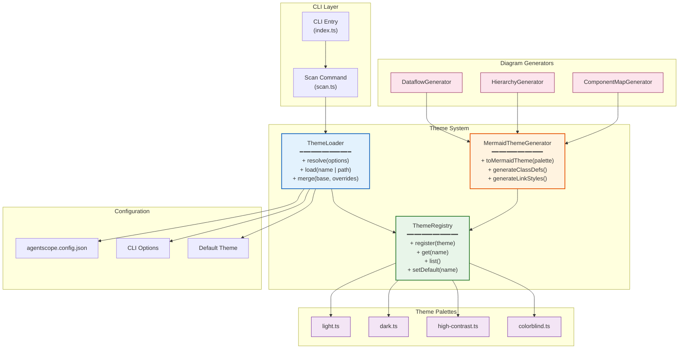
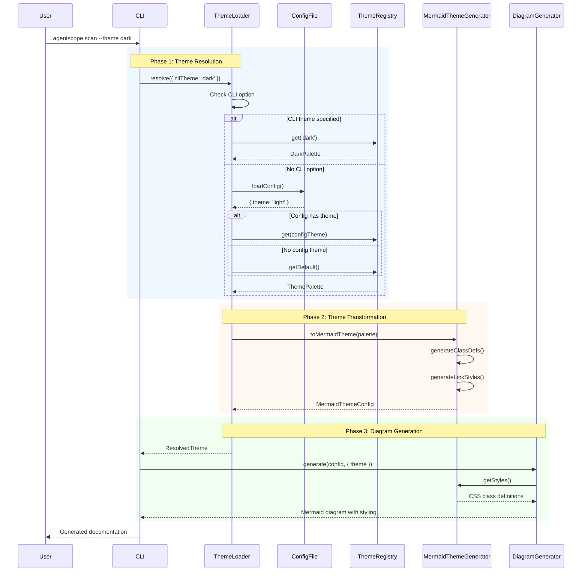
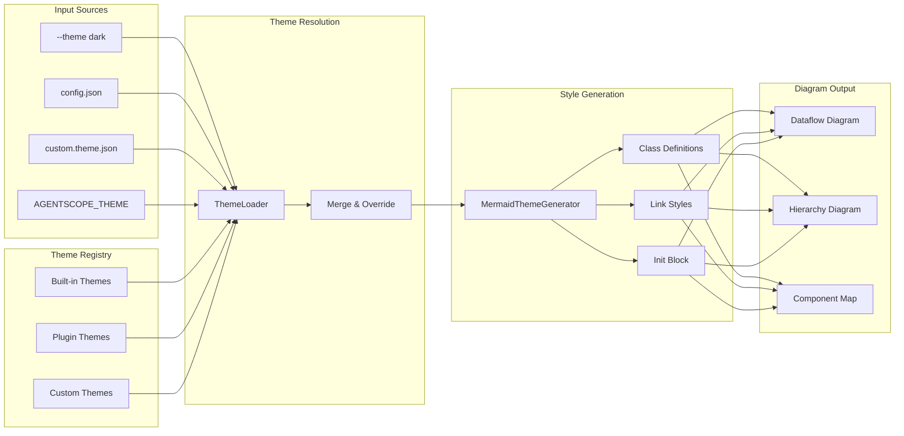
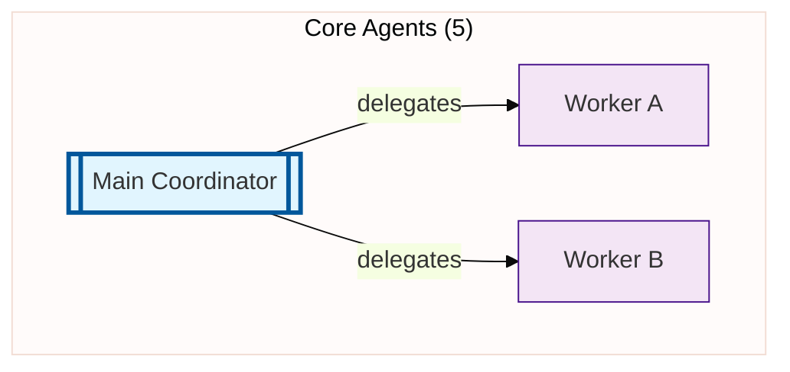

# Architecture Decision Record: Theme System

**Status**: Proposed
**Date**: 2026-01-22
**Author**: System Architecture Designer
**ADR Number**: ADR-001

## Context

AgentScope generates Mermaid diagrams for visualizing agent architectures. Currently, diagram styling is hardcoded within each generator (`dataflow.ts`, `hierarchy.ts`, `component-map.ts`). This creates several challenges:

1. **Inconsistent styling** across diagram types
2. **Difficulty supporting** accessibility requirements (colorblind, high-contrast)
3. **No user customization** of diagram appearance
4. **Duplication** of color definitions across generators
5. **Tight coupling** between diagram logic and presentation

## Decision

Implement a modular theme system with the following components:

1. **ThemeLoader** - Resolves and loads theme configuration
2. **ThemeRegistry** - Stores and manages available themes
3. **MermaidThemeGenerator** - Transforms themes into Mermaid-compatible styling
4. **Theme Palettes** - Predefined color palettes for different use cases

---

## Component Architecture

### Component Diagram



### Sequence Diagram: Theme Resolution Flow



---

## File Structure

```
src/core/
├── themes/
│   ├── index.ts              # Public API exports
│   ├── types.ts              # TypeScript interfaces
│   ├── palettes/
│   │   ├── index.ts          # Palette registry
│   │   ├── light.ts          # Default light theme
│   │   ├── dark.ts           # Dark mode theme
│   │   ├── high-contrast.ts  # WCAG AAA compliant
│   │   └── colorblind.ts     # Deuteranopia-safe palette
│   ├── loader.ts             # Theme resolution logic
│   ├── registry.ts           # Theme storage and management
│   └── generator.ts          # Mermaid style generation
```

---

## Type Definitions

```typescript
// src/core/themes/types.ts

/**
 * Color definition with accessibility metadata
 */
export interface ThemeColor {
  /** Primary color (hex) */
  fill: string;
  /** Border/stroke color (hex) */
  stroke: string;
  /** Text color (hex) */
  text?: string;
  /** Stroke width in pixels */
  strokeWidth?: number;
  /** Optional stroke dash array */
  strokeDasharray?: string;
}

/**
 * Complete theme palette
 */
export interface ThemePalette {
  /** Unique theme identifier */
  id: string;
  /** Human-readable name */
  name: string;
  /** Theme description */
  description?: string;
  /** Color scheme type */
  scheme: 'light' | 'dark' | 'high-contrast';
  /** Accessibility compliance level */
  accessibility?: 'AA' | 'AAA' | 'colorblind-safe';

  /** Agent type colors */
  agents: {
    coordinator: ThemeColor;
    worker: ThemeColor;
    specialist: ThemeColor;
    reviewer: ThemeColor;
    custom: ThemeColor;
  };

  /** Diagram element colors */
  elements: {
    input: ThemeColor;
    output: ThemeColor;
    hook: ThemeColor;
    mcp: ThemeColor;
    skill: ThemeColor;
    subgraph: ThemeColor;
  };

  /** Connection/link styles */
  links: {
    delegation: ThemeColor;
    tool: ThemeColor;
    data: ThemeColor;
  };

  /** Background and chrome */
  chrome: {
    background: string;
    border: string;
    text: string;
    muted: string;
  };
}

/**
 * Theme resolution options
 */
export interface ThemeResolveOptions {
  /** Theme name from CLI */
  cliTheme?: string;
  /** Path to custom theme file */
  themePath?: string;
  /** Override specific colors */
  overrides?: Partial<ThemePalette>;
}

/**
 * Mermaid-specific theme configuration
 */
export interface MermaidThemeConfig {
  /** Theme name for Mermaid init */
  theme: 'base' | 'default' | 'dark' | 'forest' | 'neutral';
  /** Theme variables for customization */
  themeVariables: Record<string, string>;
  /** Generated class definitions */
  classDefs: string[];
  /** Link style definitions */
  linkStyles: string[];
}

/**
 * Theme plugin interface for extensibility
 */
export interface ThemePlugin {
  /** Plugin identifier */
  id: string;
  /** Plugin name */
  name: string;
  /** Themes provided by this plugin */
  themes: ThemePalette[];
  /** Optional initialization */
  init?: () => Promise<void>;
}
```

---

## Integration Points

### 1. CLI to Theme Loader

The CLI passes theme options through the existing `ScanCommandOptions`:

```typescript
// src/cli/commands/scan.ts

export interface ScanCommandOptions {
  // ... existing options ...
  theme?: string;           // Theme name (e.g., 'dark', 'colorblind')
  themePath?: string;       // Path to custom theme JSON
}

// In registerScanCommand:
.option('--theme <name>', 'Color theme (light, dark, high-contrast, colorblind)')
.option('--theme-path <path>', 'Path to custom theme JSON file')
```

### 2. Config File Loading

Support theme configuration in `agentscope.config.json`:

```json
{
  "theme": "dark",
  "themeOverrides": {
    "agents": {
      "coordinator": {
        "fill": "#custom-color"
      }
    }
  }
}
```

Resolution order (highest to lowest priority):
1. CLI `--theme` option
2. CLI `--theme-path` custom file
3. Config file `theme` property
4. Environment variable `AGENTSCOPE_THEME`
5. Default theme (`light`)

### 3. Generator Theme Consumption

Diagram generators receive theme through `DiagramOptions`:

```typescript
// src/core/model/types.ts

export interface DiagramOptions {
  // ... existing options ...
  theme?: ThemePalette;        // Resolved theme palette
  mermaidTheme?: MermaidThemeConfig;  // Pre-generated Mermaid config
}
```

Generators use the `MermaidThemeGenerator` to produce styling:

```typescript
// Example usage in dataflow.ts

import { MermaidThemeGenerator } from '../themes/generator.js';

export function generateDataflow(
  config: AgentScopeConfig,
  options: DataflowOptions = {}
): string {
  const themeGenerator = new MermaidThemeGenerator(options.theme);

  const lines: string[] = [
    '```mermaid',
    themeGenerator.getInit(),  // %%{init: {...}}%%
    'flowchart LR',
    // ... diagram content ...
  ];

  // Add styling at the end
  lines.push('');
  lines.push(...themeGenerator.getClassDefs());
  lines.push(...themeGenerator.getAppliedClasses(config));

  lines.push('```');
  return lines.join('\n');
}
```

---

## Extension Points

### 1. Custom Theme Registration

Users can register custom themes programmatically:

```typescript
import { ThemeRegistry } from 'agentscope';

// Register a custom theme
ThemeRegistry.register({
  id: 'corporate',
  name: 'Corporate Brand',
  scheme: 'light',
  agents: {
    coordinator: { fill: '#1a5276', stroke: '#0e3a5c' },
    worker: { fill: '#2874a6', stroke: '#1a5276' },
    // ... other colors
  },
  // ... complete palette
});

// Use the custom theme
await scan({ theme: 'corporate' });
```

### 2. Plugin System for Palettes

Support for theme plugins via package discovery:

```typescript
// src/core/themes/plugins.ts

export interface ThemePluginLoader {
  /**
   * Discover and load theme plugins from node_modules
   */
  discoverPlugins(): Promise<ThemePlugin[]>;

  /**
   * Load a specific plugin by package name
   */
  loadPlugin(packageName: string): Promise<ThemePlugin>;

  /**
   * Register all themes from discovered plugins
   */
  registerDiscoveredThemes(registry: ThemeRegistry): Promise<void>;
}
```

Example plugin package structure:

```
agentscope-theme-monokai/
├── package.json          # { "agentscope-theme": true }
├── index.ts              # Exports ThemePlugin
└── palettes/
    ├── monokai.ts
    └── monokai-pro.ts
```

Plugin discovery in `package.json`:

```json
{
  "name": "agentscope-theme-monokai",
  "agentscope": {
    "type": "theme-plugin",
    "themes": ["monokai", "monokai-pro"]
  }
}
```

### 3. Runtime Theme Switching

For interactive environments:

```typescript
import { ThemeLoader, ThemeRegistry } from 'agentscope';

// Switch theme at runtime
const newTheme = ThemeRegistry.get('dark');
diagram.applyTheme(newTheme);
```

---

## Data Flow Diagram



---

## Sample Theme Palette

### Light Theme (Default)

```typescript
// src/core/themes/palettes/light.ts

import type { ThemePalette } from '../types.js';

export const lightTheme: ThemePalette = {
  id: 'light',
  name: 'Light',
  description: 'Default light theme with high readability',
  scheme: 'light',
  accessibility: 'AA',

  agents: {
    coordinator: {
      fill: '#e1f5fe',
      stroke: '#01579b',
      strokeWidth: 3,
    },
    worker: {
      fill: '#f3e5f5',
      stroke: '#4a148c',
      strokeWidth: 1,
    },
    specialist: {
      fill: '#e8f5e9',
      stroke: '#1b5e20',
      strokeWidth: 1,
    },
    reviewer: {
      fill: '#fff3e0',
      stroke: '#e65100',
      strokeWidth: 1,
    },
    custom: {
      fill: '#f5f5f5',
      stroke: '#616161',
      strokeWidth: 1,
    },
  },

  elements: {
    input: {
      fill: '#bbdefb',
      stroke: '#1976d2',
    },
    output: {
      fill: '#c8e6c9',
      stroke: '#388e3c',
    },
    hook: {
      fill: '#fff9c4',
      stroke: '#f9a825',
    },
    mcp: {
      fill: '#fce4ec',
      stroke: '#880e4f',
    },
    skill: {
      fill: '#e3f2fd',
      stroke: '#0d47a1',
      strokeDasharray: '5 5',
    },
    subgraph: {
      fill: '#fafafa',
      stroke: '#bdbdbd',
    },
  },

  links: {
    delegation: {
      fill: 'none',
      stroke: '#1976d2',
      strokeWidth: 2,
    },
    tool: {
      fill: 'none',
      stroke: '#7b1fa2',
      strokeDasharray: '3 3',
    },
    data: {
      fill: 'none',
      stroke: '#388e3c',
    },
  },

  chrome: {
    background: '#ffffff',
    border: '#e0e0e0',
    text: '#212121',
    muted: '#757575',
  },
};
```

### Colorblind-Safe Theme

```typescript
// src/core/themes/palettes/colorblind.ts

import type { ThemePalette } from '../types.js';

export const colorblindTheme: ThemePalette = {
  id: 'colorblind',
  name: 'Colorblind Safe',
  description: 'Optimized for deuteranopia and protanopia',
  scheme: 'light',
  accessibility: 'colorblind-safe',

  agents: {
    coordinator: {
      fill: '#4477AA',  // Blue
      stroke: '#223366',
      strokeWidth: 3,
    },
    worker: {
      fill: '#CCBB44',  // Yellow
      stroke: '#665522',
      strokeWidth: 1,
    },
    specialist: {
      fill: '#228833',  // Green (distinguishable)
      stroke: '#114411',
      strokeWidth: 1,
    },
    reviewer: {
      fill: '#EE6677',  // Red (shifted for visibility)
      stroke: '#771133',
      strokeWidth: 1,
    },
    custom: {
      fill: '#BBBBBB',  // Gray
      stroke: '#555555',
      strokeWidth: 1,
    },
  },

  elements: {
    input: {
      fill: '#66CCEE',  // Cyan
      stroke: '#2288AA',
    },
    output: {
      fill: '#AADDCC',  // Pale green
      stroke: '#448866',
    },
    hook: {
      fill: '#EEDD88',  // Gold
      stroke: '#AA9944',
    },
    mcp: {
      fill: '#AA3377',  // Purple-pink
      stroke: '#661144',
    },
    skill: {
      fill: '#99DDFF',  // Light blue
      stroke: '#4499CC',
      strokeDasharray: '5 5',
    },
    subgraph: {
      fill: '#EEEEEE',
      stroke: '#888888',
    },
  },

  links: {
    delegation: {
      fill: 'none',
      stroke: '#4477AA',
      strokeWidth: 2,
    },
    tool: {
      fill: 'none',
      stroke: '#AA3377',
      strokeDasharray: '3 3',
    },
    data: {
      fill: 'none',
      stroke: '#228833',
    },
  },

  chrome: {
    background: '#ffffff',
    border: '#cccccc',
    text: '#000000',
    muted: '#666666',
  },
};
```

---

## Implementation Notes

### Generated Mermaid Output Example



### Performance Considerations

1. **Theme Caching**: Resolved themes are cached per session
2. **Lazy Loading**: Plugin themes loaded on-demand
3. **Pre-computed Styles**: Mermaid class definitions generated once per theme

### Migration Path

1. **Phase 1**: Extract hardcoded styles to light theme palette
2. **Phase 2**: Implement ThemeLoader with CLI support
3. **Phase 3**: Add built-in theme palettes
4. **Phase 4**: Implement plugin system

---

## Consequences

### Positive

- Consistent styling across all diagram types
- Accessibility compliance for diverse users
- User customization without code changes
- Clean separation of concerns
- Extensible via plugin system

### Negative

- Additional complexity in diagram generation
- Theme resolution adds minor overhead
- Plugin discovery requires file system operations

### Risks

- Breaking changes to existing diagram output
- Theme compatibility across Mermaid versions

### Mitigation

- Provide migration guide for existing users
- Test themes against multiple Mermaid versions
- Maintain backward compatibility mode

---

## References

- [Mermaid Theming Documentation](https://mermaid.js.org/config/theming.html)
- [WCAG 2.1 Contrast Guidelines](https://www.w3.org/WAI/WCAG21/Understanding/contrast-minimum.html)
- [Colorblind-Safe Color Palettes](https://personal.sron.nl/~pault/)
- [Material Design Color System](https://material.io/design/color/)
