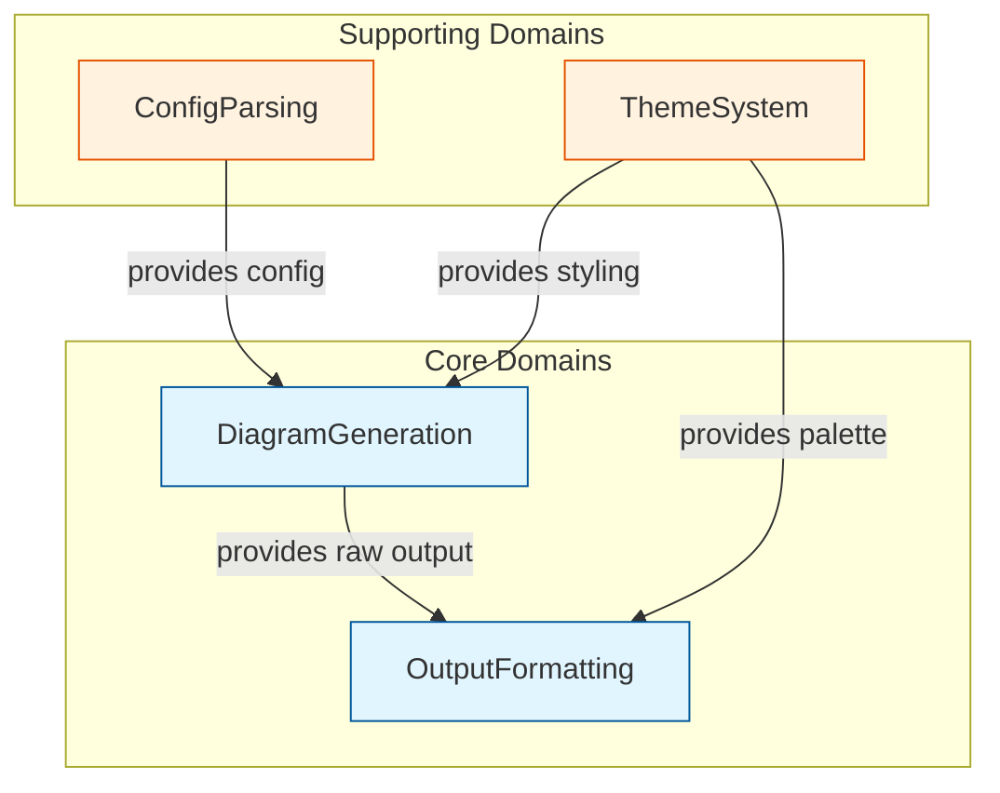
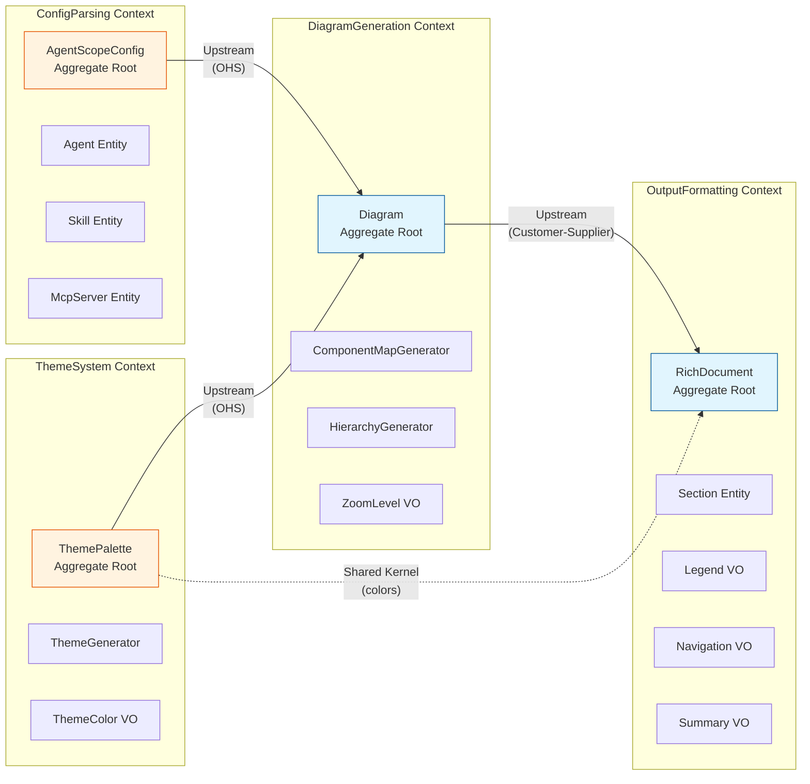
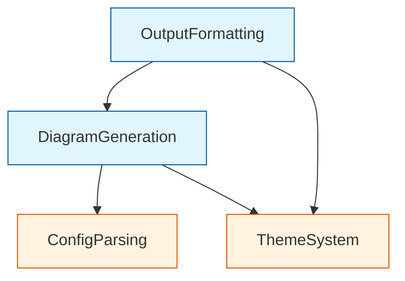
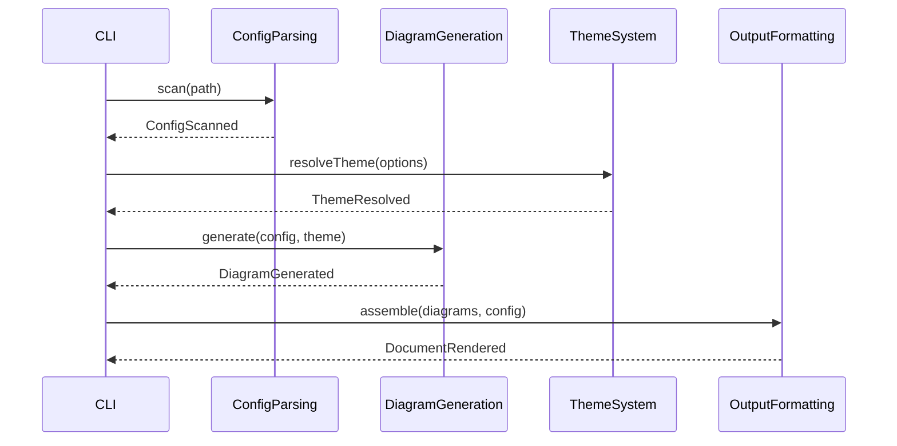

# DDD-001: Generator Enhancement Domain Model

**Status:** Proposed
**Created:** 2026-01-22
**Author:** Architecture Team
**Domain:** DiagramGeneration, ConfigParsing, ThemeSystem, OutputFormatting

---

## Executive Summary

This document defines the Domain-Driven Design specification for enhancing AgentScope's generator system. The goal is to produce rich, example-style output with navigation, legends, and summaries while maintaining clean domain boundaries and a ubiquitous language throughout the codebase.

---

## Table of Contents

1. [Strategic Design](#1-strategic-design)
2. [Bounded Contexts](#2-bounded-contexts)
3. [Context Map](#3-context-map)
4. [Aggregate Roots](#4-aggregate-roots)
5. [Value Objects](#5-value-objects)
6. [Entities](#6-entities)
7. [Domain Events](#7-domain-events)
8. [Domain Services](#8-domain-services)
9. [Ubiquitous Language](#9-ubiquitous-language)
10. [Anti-Corruption Layers](#10-anti-corruption-layers)
11. [Implementation Guidelines](#11-implementation-guidelines)

---

## 1. Strategic Design

### 1.1 Domain Classification

| Domain | Type | Strategic Importance |
|--------|------|---------------------|
| **DiagramGeneration** | Core | Primary value proposition - generates visual architecture maps |
| **ConfigParsing** | Supporting | Enables core domain by extracting agent configurations |
| **ThemeSystem** | Supporting | Enhances output quality with visual consistency |
| **OutputFormatting** | Core (New) | Transforms raw diagrams into rich, navigable documentation |

### 1.2 Domain Relationships



---

## 2. Bounded Contexts

### 2.1 DiagramGeneration Context (Core)

**Purpose:** Generate Mermaid diagrams representing agent architectures.

**Responsibilities:**
- Transform agent configurations into diagram structures
- Apply zoom levels (summary, category, detail)
- Generate Mermaid syntax with proper node relationships
- Apply filtering by category, type, and pattern

**Key Files:**
- [`../src/core/generators/diagrams/component-map.ts`](../../src/core/generators/diagrams/component-map.ts)
- [`../src/core/generators/diagrams/hierarchy.ts`](../../src/core/generators/diagrams/hierarchy.ts)
- [`../src/core/generators/diagrams/categories.ts`](../../src/core/generators/diagrams/categories.ts)

**Language:**
- Diagram, ZoomLevel, ComponentMap, Hierarchy, Delegation, Subgraph

---

### 2.2 ConfigParsing Context (Supporting)

**Purpose:** Parse and validate agent configurations from multiple sources.

**Responsibilities:**
- Scan file system for configuration files
- Parse YAML/JSON/Markdown configurations
- Extract agent, skill, hook, and MCP server definitions
- Validate configuration integrity

**Key Files:**
- [`../src/core/model/types.ts`](../../src/core/model/types.ts)
- [`../src/core/scanners/`](../../src/core/scanners/)

**Language:**
- Config, Agent, Skill, Hook, McpServer, ScanResult, ValidationError

---

### 2.3 ThemeSystem Context (Supporting)

**Purpose:** Provide visual theming for diagram output.

**Responsibilities:**
- Manage theme palettes (light, dark, high-contrast, colorblind)
- Generate Mermaid styling directives
- Support custom theme loading
- Ensure accessibility compliance

**Key Files:**
- [`../src/core/themes/types.ts`](../../src/core/themes/types.ts)
- [`../src/core/themes/generator.ts`](../../src/core/themes/generator.ts)
- [`../src/core/themes/registry.ts`](../../src/core/themes/registry.ts)

**Language:**
- Theme, Palette, ColorScheme, AccessibilityLevel, ClassDef, ThemeVariables

---

### 2.4 OutputFormatting Context (Core - New)

**Purpose:** Transform raw diagrams into rich, navigable documentation.

**Responsibilities:**
- Generate navigation sections with table of contents
- Create legends explaining diagram symbols
- Produce executive summaries and statistics
- Add interactive elements (links, anchors)
- Format timestamps and metadata

**Proposed Location:**
- `../src/core/formatters/`

**Language:**
- Document, Section, Legend, Navigation, Summary, Statistics, Anchor

---

## 3. Context Map

### 3.1 Visual Context Map



### 3.2 Context Relationships

| Upstream | Downstream | Pattern | Description |
|----------|------------|---------|-------------|
| ConfigParsing | DiagramGeneration | Open Host Service | ConfigParsing exposes `AgentScopeConfig` as standard API |
| ThemeSystem | DiagramGeneration | Open Host Service | ThemeSystem exposes `ThemePalette` and `MermaidThemeGenerator` |
| DiagramGeneration | OutputFormatting | Customer-Supplier | OutputFormatting consumes diagram strings and metadata |
| ThemeSystem | OutputFormatting | Shared Kernel | Both share color definitions for consistent styling |

---

## 4. Aggregate Roots

### 4.1 AgentScopeConfig (ConfigParsing)

The root aggregate for all parsed configuration data.

```typescript
/**
 * Aggregate Root: AgentScopeConfig
 * Invariant: All agents must have unique names
 * Invariant: All delegation targets must reference existing agents
 */
interface AgentScopeConfig {
  readonly agents: Agent[];
  readonly skills: Skill[];
  readonly hooks: Hook[];
  readonly commands: Command[];
  readonly mcpServers: McpServer[];
  readonly metadata: ScanMetadata;

  // Aggregate behavior
  findAgentByName(name: string): Agent | undefined;
  validateDelegations(): ValidationResult;
  getAgentsByCategory(category: AgentCategory): Agent[];
}
```

**Invariants:**
1. Agent names must be unique within the configuration
2. Delegation targets must reference existing agents
3. Metadata must include valid scan timestamp

---

### 4.2 Diagram (DiagramGeneration)

The root aggregate for a generated diagram.

```typescript
/**
 * Aggregate Root: Diagram
 * Invariant: Must have at least one node
 * Invariant: All edges must reference existing nodes
 */
interface Diagram {
  readonly id: DiagramId;
  readonly type: DiagramType;
  readonly title: string;
  readonly zoomLevel: ZoomLevel;
  readonly nodes: DiagramNode[];
  readonly edges: DiagramEdge[];
  readonly subgraphs: Subgraph[];
  readonly styling: DiagramStyling;
  readonly metadata: DiagramMetadata;

  // Aggregate behavior
  render(): string;
  applyFilter(filter: DiagramFilter): Diagram;
  changeZoomLevel(level: ZoomLevel): Diagram;
}
```

**Invariants:**
1. Diagram must contain at least one node
2. All edge endpoints must reference existing nodes
3. Subgraph members must exist in nodes collection

---

### 4.3 ThemePalette (ThemeSystem)

The root aggregate for theme configuration.

```typescript
/**
 * Aggregate Root: ThemePalette
 * Invariant: All colors must be valid hex or 'none'
 * Invariant: Text colors must meet accessibility contrast ratios
 */
interface ThemePalette {
  readonly id: string;
  readonly name: string;
  readonly description?: string;
  readonly scheme: ColorScheme;
  readonly accessibility?: AccessibilityLevel;
  readonly agents: AgentColors;
  readonly elements: ElementColors;
  readonly links: LinkColors;
  readonly chrome: ChromeColors;

  // Aggregate behavior
  validate(): ThemeValidationResult;
  deriveContrastColor(background: HexColor): HexColor;
  createGenerator(): MermaidThemeGenerator;
}
```

**Invariants:**
1. All color values must be valid hex format or 'none'
2. High-contrast themes must meet WCAG AA/AAA ratios
3. Colorblind themes must use distinguishable hues

---

### 4.4 RichDocument (OutputFormatting - New)

The root aggregate for enhanced output.

```typescript
/**
 * Aggregate Root: RichDocument
 * Invariant: Must have at least one section
 * Invariant: Navigation anchors must reference existing sections
 */
interface RichDocument {
  readonly id: DocumentId;
  readonly title: string;
  readonly navigation: Navigation;
  readonly sections: Section[];
  readonly legend: Legend;
  readonly summary: Summary;
  readonly metadata: DocumentMetadata;

  // Aggregate behavior
  render(format: OutputFormat): string;
  addSection(section: Section): void;
  reorderSections(order: SectionId[]): void;
  generateTableOfContents(): Navigation;
}
```

**Invariants:**
1. Document must contain at least one section
2. Navigation links must reference existing section anchors
3. Summary statistics must be accurate to content

---

## 5. Value Objects

### 5.1 DiagramGeneration Value Objects

```typescript
/** Immutable zoom level configuration */
type ZoomLevel = 'summary' | 'category' | 'detail';

/** Filter criteria for diagram generation */
interface DiagramFilter {
  readonly categories?: AgentCategory[];
  readonly types?: string[];
  readonly pattern?: string;
  readonly maxPerCategory?: number;
}

/** Diagram direction */
type Direction = 'TB' | 'BT' | 'LR' | 'RL';

/** Diagram type classification */
type DiagramType = 'component-map' | 'hierarchy' | 'dataflow';
```

### 5.2 ConfigParsing Value Objects

```typescript
/** Agent type classification */
type AgentType = 'coordinator' | 'worker' | 'specialist' | 'reviewer' | 'custom';

/** Agent category for grouping */
type AgentCategory =
  | 'github' | 'security' | 'sparc' | 'flow-nexus'
  | 'consensus' | 'coordination' | 'v3-core' | 'performance'
  | 'memory' | 'development' | 'testing' | 'analysis'
  | 'documentation' | 'other';

/** Scan error with context */
interface ScanError {
  readonly severity: 'fatal' | 'warning' | 'info';
  readonly code: string;
  readonly message: string;
  readonly file?: string;
  readonly line?: number;
  readonly suggestion?: string;
}
```

### 5.3 ThemeSystem Value Objects

```typescript
/** Hex color string */
type HexColor = `#${string}`;

/** Color with stroke and fill */
interface ThemeColor {
  readonly fill: HexColor | 'none';
  readonly stroke: HexColor;
  readonly text?: HexColor;
  readonly strokeWidth?: number;
  readonly strokeDasharray?: string;
}

/** Color scheme type */
type ColorScheme = 'light' | 'dark' | 'high-contrast';

/** Accessibility compliance level */
type AccessibilityLevel = 'AA' | 'AAA' | 'colorblind-safe';
```

### 5.4 OutputFormatting Value Objects (New)

```typescript
/** Navigation table of contents */
interface Navigation {
  readonly title: string;
  readonly items: NavigationItem[];
  readonly depth: number;
}

interface NavigationItem {
  readonly label: string;
  readonly anchor: string;
  readonly level: number;
  readonly children?: NavigationItem[];
}

/** Legend explaining diagram symbols */
interface Legend {
  readonly title: string;
  readonly entries: LegendEntry[];
}

interface LegendEntry {
  readonly symbol: string;
  readonly label: string;
  readonly description: string;
  readonly color?: HexColor;
}

/** Document summary with statistics */
interface Summary {
  readonly description: string;
  readonly statistics: Statistics;
  readonly highlights: string[];
}

interface Statistics {
  readonly totalAgents: number;
  readonly byCategory: Map<AgentCategory, number>;
  readonly byType: Map<AgentType, number>;
  readonly totalConnections: number;
  readonly mcpServers: number;
  readonly skills: number;
}

/** Section anchor for navigation */
interface Anchor {
  readonly id: string;
  readonly label: string;
}
```

---

## 6. Entities

### 6.1 Agent (ConfigParsing)

```typescript
/**
 * Entity: Agent
 * Identity: name (unique within config)
 */
interface Agent {
  readonly name: string;           // Identity
  readonly path: string;
  readonly description?: string;
  readonly tools?: string[];
  readonly delegatesTo?: string[];
  readonly type?: AgentType;
  readonly metadata?: Record<string, unknown>;
}
```

### 6.2 DiagramNode (DiagramGeneration)

```typescript
/**
 * Entity: DiagramNode
 * Identity: id (unique within diagram)
 */
interface DiagramNode {
  readonly id: string;             // Identity
  readonly label: string;
  readonly shape: NodeShape;
  readonly styleClass: string;
  readonly subgraphId?: string;
}
```

### 6.3 Section (OutputFormatting - New)

```typescript
/**
 * Entity: Section
 * Identity: id (unique within document)
 */
interface Section {
  readonly id: SectionId;          // Identity
  readonly title: string;
  readonly anchor: Anchor;
  readonly content: SectionContent;
  readonly order: number;
  readonly children?: Section[];
}

type SectionContent =
  | { type: 'diagram'; value: string }
  | { type: 'legend'; value: Legend }
  | { type: 'summary'; value: Summary }
  | { type: 'navigation'; value: Navigation }
  | { type: 'markdown'; value: string };
```

---

## 7. Domain Events

### 7.1 ConfigParsing Events

```typescript
/** Raised when configuration scan completes */
interface ConfigScanned {
  readonly type: 'ConfigScanned';
  readonly timestamp: Date;
  readonly rootPath: string;
  readonly agentCount: number;
  readonly duration: number;
  readonly errors: ScanError[];
}

/** Raised when validation detects issues */
interface ConfigValidationFailed {
  readonly type: 'ConfigValidationFailed';
  readonly timestamp: Date;
  readonly errors: ScanError[];
}
```

### 7.2 DiagramGeneration Events

```typescript
/** Raised when diagram generation starts */
interface DiagramGenerationStarted {
  readonly type: 'DiagramGenerationStarted';
  readonly timestamp: Date;
  readonly diagramType: DiagramType;
  readonly zoomLevel: ZoomLevel;
  readonly agentCount: number;
}

/** Raised when diagram generation completes */
interface DiagramGenerated {
  readonly type: 'DiagramGenerated';
  readonly timestamp: Date;
  readonly diagramId: string;
  readonly diagramType: DiagramType;
  readonly nodeCount: number;
  readonly edgeCount: number;
}

/** Raised when filter is applied */
interface DiagramFiltered {
  readonly type: 'DiagramFiltered';
  readonly timestamp: Date;
  readonly diagramId: string;
  readonly filter: DiagramFilter;
  readonly originalCount: number;
  readonly filteredCount: number;
}
```

### 7.3 ThemeSystem Events

```typescript
/** Raised when theme is resolved */
interface ThemeResolved {
  readonly type: 'ThemeResolved';
  readonly timestamp: Date;
  readonly themeId: string;
  readonly source: 'builtin' | 'custom' | 'default';
}

/** Raised when custom theme loading fails */
interface ThemeLoadFailed {
  readonly type: 'ThemeLoadFailed';
  readonly timestamp: Date;
  readonly path: string;
  readonly error: string;
  readonly fallbackTheme: string;
}
```

### 7.4 OutputFormatting Events (New)

```typescript
/** Raised when document assembly starts */
interface DocumentAssemblyStarted {
  readonly type: 'DocumentAssemblyStarted';
  readonly timestamp: Date;
  readonly documentId: string;
  readonly format: OutputFormat;
}

/** Raised when section is added to document */
interface SectionAdded {
  readonly type: 'SectionAdded';
  readonly timestamp: Date;
  readonly documentId: string;
  readonly sectionId: string;
  readonly sectionType: SectionContent['type'];
}

/** Raised when document is fully rendered */
interface DocumentRendered {
  readonly type: 'DocumentRendered';
  readonly timestamp: Date;
  readonly documentId: string;
  readonly format: OutputFormat;
  readonly size: number;
  readonly sectionCount: number;
}
```

---

## 8. Domain Services

### 8.1 Diagram Generation Services

```typescript
/**
 * Service: ComponentMapGenerator
 * Responsibility: Generate component map diagrams from config
 */
interface ComponentMapGenerator {
  generate(config: AgentScopeConfig, options: ComponentMapOptions): Diagram;
}

/**
 * Service: HierarchyGenerator
 * Responsibility: Generate hierarchy diagrams showing delegation chains
 */
interface HierarchyGenerator {
  generate(config: AgentScopeConfig, options: HierarchyOptions): Diagram;
}

/**
 * Service: CategoryService
 * Responsibility: Categorize and filter agents
 */
interface CategoryService {
  categorize(agents: Agent[]): CategorizedAgents[];
  filterByCategory(agents: Agent[], categories: AgentCategory[]): Agent[];
  filterByType(agents: Agent[], types: string[]): Agent[];
  filterByPattern(agents: Agent[], pattern: string): Agent[];
}
```

### 8.2 Theme Services

```typescript
/**
 * Service: ThemeResolver
 * Responsibility: Resolve theme from various sources
 */
interface ThemeResolver {
  resolve(options: ThemeResolveOptions): ThemePalette;
  loadCustomTheme(path: string): ThemePalette;
  validateTheme(palette: ThemePalette): ThemeValidationResult;
}

/**
 * Service: MermaidThemeGenerator
 * Responsibility: Transform palette to Mermaid syntax
 */
interface MermaidThemeGenerator {
  getInit(): string;
  getClassDefs(): string[];
  getLinkStyles(): string[];
  getAgentClass(agentType: string): string;
}
```

### 8.3 Output Formatting Services (New)

```typescript
/**
 * Service: DocumentAssembler
 * Responsibility: Assemble rich documents from diagrams and metadata
 */
interface DocumentAssembler {
  assemble(
    diagrams: Diagram[],
    config: AgentScopeConfig,
    options: AssemblyOptions
  ): RichDocument;
}

/**
 * Service: NavigationGenerator
 * Responsibility: Generate table of contents and navigation
 */
interface NavigationGenerator {
  generateToc(sections: Section[]): Navigation;
  generateBreadcrumbs(section: Section, ancestors: Section[]): Navigation;
  generateAnchors(content: string): Anchor[];
}

/**
 * Service: LegendGenerator
 * Responsibility: Generate legends for diagram symbols
 */
interface LegendGenerator {
  generateAgentLegend(palette: ThemePalette): Legend;
  generateCategoryLegend(categories: CategorizedAgents[]): Legend;
  generateConnectionLegend(): Legend;
}

/**
 * Service: SummaryGenerator
 * Responsibility: Generate executive summaries and statistics
 */
interface SummaryGenerator {
  generateSummary(config: AgentScopeConfig): Summary;
  generateStatistics(config: AgentScopeConfig): Statistics;
  generateHighlights(config: AgentScopeConfig): string[];
}

/**
 * Service: MarkdownRenderer
 * Responsibility: Render document to Markdown format
 */
interface MarkdownRenderer {
  render(document: RichDocument): string;
  renderSection(section: Section): string;
  renderNavigation(navigation: Navigation): string;
  renderLegend(legend: Legend): string;
}
```

---

## 9. Ubiquitous Language

### 9.1 Core Terms

| Term | Definition | Context |
|------|------------|---------|
| **Agent** | An autonomous unit that performs tasks, may delegate to other agents | ConfigParsing |
| **Diagram** | A visual representation of architecture components and relationships | DiagramGeneration |
| **Theme** | A consistent set of colors and styles for visual output | ThemeSystem |
| **Document** | A rich output containing diagrams, navigation, legends, and summaries | OutputFormatting |

### 9.2 Configuration Terms

| Term | Definition | Context |
|------|------------|---------|
| **Coordinator** | An agent that orchestrates other agents | ConfigParsing |
| **Worker** | A basic task-executing agent | ConfigParsing |
| **Specialist** | An agent with domain-specific expertise | ConfigParsing |
| **Reviewer** | An agent that validates work of others | ConfigParsing |
| **Delegation** | The relationship where one agent assigns work to another | ConfigParsing |
| **MCP Server** | Model Context Protocol server providing tools | ConfigParsing |
| **Skill** | A reusable capability that can be invoked | ConfigParsing |
| **Hook** | An event handler triggered by specific actions | ConfigParsing |

### 9.3 Diagram Terms

| Term | Definition | Context |
|------|------------|---------|
| **Zoom Level** | The granularity of detail (summary, category, detail) | DiagramGeneration |
| **Component Map** | Diagram showing all components and relationships | DiagramGeneration |
| **Hierarchy** | Diagram showing delegation chains and structure | DiagramGeneration |
| **Subgraph** | A grouped section of nodes within a diagram | DiagramGeneration |
| **Node** | A single element in a diagram (agent, server, skill) | DiagramGeneration |
| **Edge** | A connection between nodes representing relationships | DiagramGeneration |
| **Category** | A logical grouping of agents by function | DiagramGeneration |

### 9.4 Theme Terms

| Term | Definition | Context |
|------|------------|---------|
| **Palette** | A complete set of colors for a theme | ThemeSystem |
| **Color Scheme** | The base mode (light, dark, high-contrast) | ThemeSystem |
| **ClassDef** | A Mermaid CSS class definition | ThemeSystem |
| **Accessibility Level** | WCAG compliance (AA, AAA, colorblind-safe) | ThemeSystem |
| **Chrome** | Background and border colors | ThemeSystem |

### 9.5 Output Terms (New)

| Term | Definition | Context |
|------|------------|---------|
| **Section** | A distinct part of a document with its own content | OutputFormatting |
| **Navigation** | Table of contents and links between sections | OutputFormatting |
| **Legend** | Explanation of symbols and colors used in diagrams | OutputFormatting |
| **Summary** | Executive overview with statistics and highlights | OutputFormatting |
| **Anchor** | A linkable reference point within a document | OutputFormatting |
| **Statistics** | Quantitative metrics about the architecture | OutputFormatting |

---

## 10. Anti-Corruption Layers

### 10.1 Mermaid ACL

The ThemeSystem uses an Anti-Corruption Layer to translate domain concepts to Mermaid syntax.

```typescript
/**
 * ACL: MermaidAdapter
 * Translates ThemePalette to Mermaid-specific format
 */
interface MermaidAdapter {
  // Translate domain color to Mermaid CSS
  translateColor(color: ThemeColor): string;

  // Translate domain scheme to Mermaid base theme
  translateScheme(scheme: ColorScheme): MermaidBaseTheme;

  // Translate domain node shape to Mermaid syntax
  translateShape(shape: NodeShape): { open: string; close: string };
}
```

### 10.2 File System ACL

ConfigParsing uses an ACL to abstract file system operations.

```typescript
/**
 * ACL: FileSystemAdapter
 * Abstracts file system for testability and portability
 */
interface FileSystemAdapter {
  readFile(path: string): Promise<string>;
  exists(path: string): Promise<boolean>;
  glob(pattern: string, options: GlobOptions): Promise<string[]>;
}
```

### 10.3 External Format ACL (New)

OutputFormatting may need to support multiple output formats.

```typescript
/**
 * ACL: OutputFormatAdapter
 * Adapts RichDocument to various output formats
 */
interface OutputFormatAdapter {
  toMarkdown(document: RichDocument): string;
  toHtml(document: RichDocument): string;
  toJson(document: RichDocument): string;
}
```

---

## 11. Implementation Guidelines

### 11.1 Directory Structure

```
src/core/
  model/
    types.ts              # Shared type definitions

  scanners/               # ConfigParsing context
    config-scanner.ts
    agent-parser.ts
    validators/

  generators/             # DiagramGeneration context
    diagrams/
      component-map.ts
      hierarchy.ts
      categories.ts
    services/
      diagram-service.ts

  themes/                 # ThemeSystem context
    types.ts
    generator.ts
    registry.ts
    loader.ts
    palettes/

  formatters/             # OutputFormatting context (NEW)
    document-assembler.ts
    navigation-generator.ts
    legend-generator.ts
    summary-generator.ts
    renderers/
      markdown-renderer.ts
      html-renderer.ts
```

### 11.2 Dependency Rules

1. **ConfigParsing** has no dependencies on other contexts
2. **ThemeSystem** has no dependencies on other contexts
3. **DiagramGeneration** depends on ConfigParsing and ThemeSystem
4. **OutputFormatting** depends on DiagramGeneration and ThemeSystem



### 11.3 Event Flow



### 11.4 Testing Strategy

| Context | Test Type | Focus |
|---------|-----------|-------|
| ConfigParsing | Unit | Parser correctness, validation rules |
| DiagramGeneration | Unit + Integration | Mermaid syntax, filter logic |
| ThemeSystem | Unit | Color calculations, accessibility |
| OutputFormatting | Unit + E2E | Document structure, rendering |

---

## References

- [ADR-001: Mermaid Theme System](./ADR-001-mermaid-theme-system.md)
- [Architecture: Theme System](./ARCHITECTURE-theme-system.md)
- [DDD: Theme System](./DDD-theme-system.md)
- [Source: Component Map Generator](../../src/core/generators/diagrams/component-map.ts)
- [Source: Hierarchy Generator](../../src/core/generators/diagrams/hierarchy.ts)
- [Source: Categories](../../src/core/generators/diagrams/categories.ts)
- [Source: Model Types](../../src/core/model/types.ts)
- [Source: Theme Types](../../src/core/themes/types.ts)

---

*Generated by AgentScope Architecture Team*
*Last Updated: 2026-01-22*
