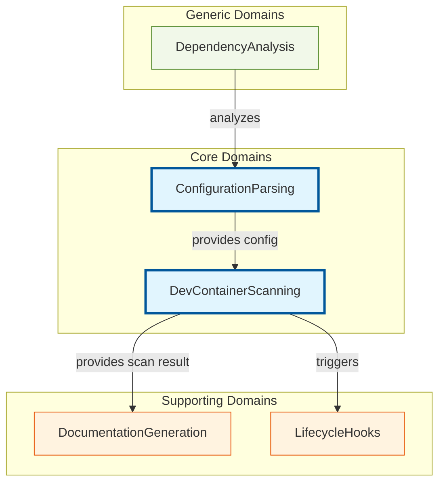
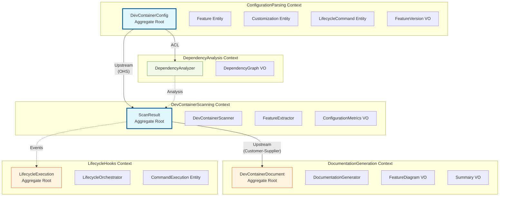
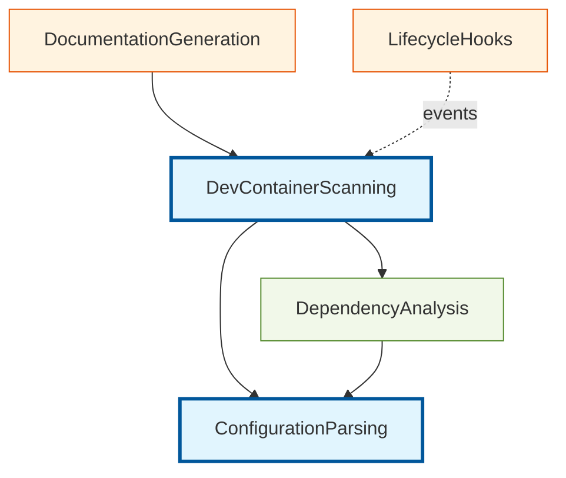
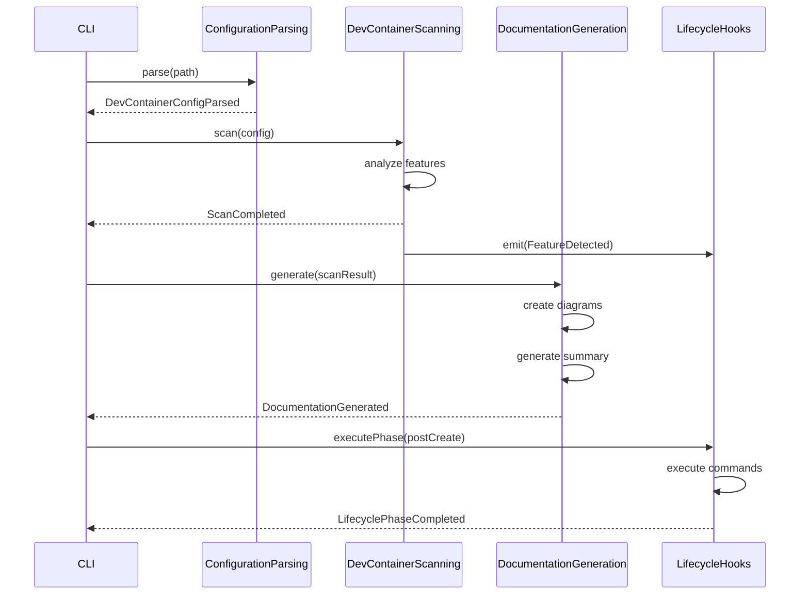

# DDD-002: DevContainer Scanning & Documentation Domain Model

**Status:** Proposed
**Created:** 2026-01-25
**Author:** V3 DDD Domain Expert Agent
**Domain:** DevContainerScanning, ConfigurationParsing, DocumentationGeneration, LifecycleHooks
**Version:** v1.2

---

## Executive Summary

This document defines the Domain-Driven Design specification for AgentScope v1.2's DevContainer scanning and documentation system. The goal is to analyze `.devcontainer/devcontainer.json` configurations, extract architectural insights, generate comprehensive documentation, and provide lifecycle hooks for container orchestration while maintaining clean domain boundaries and ubiquitous language.

---

## Table of Contents

1. [Strategic Design](#1-strategic-design)
2. [Bounded Contexts](#2-bounded-contexts)
3. [Context Map](#3-context-map)
4. [Aggregate Roots](#4-aggregate-roots)
5. [Value Objects](#5-value-objects)
6. [Entities](#6-entities)
7. [Domain Events](#7-domain-events)
8. [Domain Services](#8-domain-services)
9. [Ubiquitous Language](#9-ubiquitous-language)
10. [Anti-Corruption Layers](#10-anti-corruption-layers)
11. [Repository Patterns](#11-repository-patterns)
12. [Implementation Guidelines](#12-implementation-guidelines)

---

## 1. Strategic Design

### 1.1 Domain Classification

| Domain | Type | Strategic Importance |
|--------|------|---------------------|
| **DevContainerScanning** | Core | Primary value proposition - extracts container configuration |
| **ConfigurationParsing** | Core | Parse devcontainer.json and validate structure |
| **DocumentationGeneration** | Supporting | Transforms scan results into readable documentation |
| **LifecycleHooks** | Supporting | Orchestrates container lifecycle events |
| **DependencyAnalysis** | Generic | Analyzes features, extensions, and dependencies |

### 1.2 Business Context



### 1.3 Domain Relationships

| Upstream | Downstream | Pattern | Integration Method |
|----------|------------|---------|-------------------|
| ConfigurationParsing | DevContainerScanning | Open Host Service | Exposes `DevContainerConfig` |
| DevContainerScanning | DocumentationGeneration | Customer-Supplier | Provides `ScanResult` |
| DevContainerScanning | LifecycleHooks | Published Language | Emits domain events |
| DependencyAnalysis | ConfigurationParsing | Anti-Corruption Layer | Graph analysis wrapper |

---

## 2. Bounded Contexts

### 2.1 DevContainerScanning Context (Core)

**Purpose:** Scan and analyze DevContainer configurations to extract architectural insights.

**Responsibilities:**
- Locate and read `.devcontainer/devcontainer.json` files
- Extract features, customizations, and lifecycle commands
- Detect agent configurations in container setup
- Calculate configuration complexity metrics
- Validate container schema compliance

**Proposed Location:**
```
src/core/scanners/devcontainer/
  ├── devcontainer-scanner.ts      # Main scanner service
  ├── feature-extractor.ts         # Feature analysis
  ├── customization-parser.ts      # VS Code customization parsing
  ├── lifecycle-detector.ts        # Command lifecycle detection
  └── validators/
      ├── schema-validator.ts      # JSON schema validation
      └── security-validator.ts    # Security best practice checks
```

**Language:**
- DevContainer, Feature, Customization, LifecycleCommand, ScanResult, ConfigurationGraph

**Invariants:**
1. DevContainer must have a valid `image` or `build` configuration
2. Feature versions must follow semver format
3. All port forwards must be valid port numbers (1-65535)
4. Environment variables must not contain sensitive data patterns

---

### 2.2 ConfigurationParsing Context (Core)

**Purpose:** Parse and validate devcontainer.json structure with type safety.

**Responsibilities:**
- Parse JSON with comprehensive error handling
- Validate against DevContainer JSON schema
- Extract typed configuration objects
- Detect schema version and migrate if needed
- Normalize configuration variations

**Proposed Location:**
```
src/core/parsers/devcontainer/
  ├── json-parser.ts               # JSON parsing with validation
  ├── schema-mapper.ts             # Map to internal types
  ├── version-detector.ts          # Detect schema version
  └── migration/
      ├── v1-to-v2.ts              # Schema migration strategies
      └── legacy-adapter.ts        # Handle legacy formats
```

**Language:**
- Schema, ConfigurationNode, FeatureReference, CustomizationBlock, ValidationResult

**Invariants:**
1. JSON must be well-formed and parseable
2. Required fields (`name` or `image`/`build`) must be present
3. Feature URIs must follow the devcontainer spec format
4. VS Code extension IDs must be valid marketplace identifiers

---

### 2.3 DocumentationGeneration Context (Supporting)

**Purpose:** Transform scan results into comprehensive, navigable documentation.

**Responsibilities:**
- Generate markdown documentation with diagrams
- Create feature dependency graphs
- Produce configuration summaries
- Generate comparison tables
- Create visual architecture diagrams

**Proposed Location:**
```
src/core/generators/devcontainer/
  ├── doc-generator.ts             # Main documentation generator
  ├── feature-diagram.ts           # Feature relationship diagrams
  ├── summary-generator.ts         # Configuration summaries
  ├── comparison-generator.ts      # Multi-config comparisons
  └── templates/
      ├── readme-template.md       # README structure template
      └── architecture-template.md # Architecture doc template
```

**Language:**
- Document, Section, FeatureDiagram, Summary, ComparisonTable

---

### 2.4 LifecycleHooks Context (Supporting)

**Purpose:** Orchestrate container lifecycle events and automation.

**Responsibilities:**
- Detect lifecycle commands (postCreate, postStart, etc.)
- Emit events for container state changes
- Provide hook points for custom automation
- Track command execution and timing
- Handle command failures and retries

**Proposed Location:**
```
src/core/hooks/devcontainer/
  ├── lifecycle-orchestrator.ts    # Main orchestration service
  ├── command-executor.ts          # Command execution with timeout
  ├── event-emitter.ts             # Domain event publishing
  └── handlers/
      ├── post-create-handler.ts   # postCreateCommand handler
      ├── post-start-handler.ts    # postStartCommand handler
      └── post-attach-handler.ts   # postAttachCommand handler
```

**Language:**
- LifecyclePhase, HookEvent, CommandResult, ExecutionContext

---

### 2.5 DependencyAnalysis Context (Generic)

**Purpose:** Analyze feature dependencies and create dependency graphs.

**Responsibilities:**
- Build dependency graph from features
- Detect circular dependencies
- Calculate dependency metrics
- Identify security vulnerabilities in features
- Suggest optimization opportunities

**Proposed Location:**
```
src/core/analysis/devcontainer/
  ├── dependency-analyzer.ts       # Graph-based analysis
  ├── circular-detector.ts         # Circular dependency detection
  ├── security-scanner.ts          # Vulnerability scanning
  └── optimizer.ts                 # Configuration optimization
```

**Language:**
- DependencyGraph, DependencyNode, CircularDependency, Vulnerability

---

## 3. Context Map

### 3.1 Visual Context Map



### 3.2 Context Relationships Detail

| Upstream Context | Downstream Context | Pattern | Integration |
|-----------------|-------------------|---------|-------------|
| ConfigurationParsing | DevContainerScanning | **Open Host Service** | Exposes well-defined `DevContainerConfig` API with strong typing |
| DevContainerScanning | DocumentationGeneration | **Customer-Supplier** | DocumentationGeneration consumes `ScanResult` and shapes its requirements |
| DevContainerScanning | LifecycleHooks | **Published Language** | Emits domain events (`ConfigScanned`, `FeatureDetected`) |
| ConfigurationParsing | DependencyAnalysis | **Anti-Corruption Layer** | Adapter translates config to graph structure |

---

## 4. Aggregate Roots

### 4.1 DevContainerConfig (ConfigurationParsing)

The root aggregate for all DevContainer configuration data.

```typescript
/**
 * Aggregate Root: DevContainerConfig
 * Invariant: Must have either 'image' or 'build' configuration
 * Invariant: All feature URIs must be valid and resolvable
 * Invariant: Port forwards must be unique and valid
 */
interface DevContainerConfig {
  readonly id: ConfigurationId;
  readonly name?: string;
  readonly image?: string;
  readonly build?: BuildConfiguration;
  readonly features: Feature[];
  readonly customizations: Customization[];
  readonly forwardPorts: PortMapping[];
  readonly lifecycleCommands: LifecycleCommand[];
  readonly containerEnv: EnvironmentVariables;
  readonly metadata: ConfigurationMetadata;

  // Aggregate behavior
  validate(): ValidationResult;
  getFeaturesByProvider(provider: string): Feature[];
  hasFeature(featureId: string): boolean;
  addFeature(feature: Feature): DevContainerConfig;
  removeFeature(featureId: string): DevContainerConfig;
  getLifecycleCommand(phase: LifecyclePhase): LifecycleCommand | undefined;
}

interface BuildConfiguration {
  readonly dockerfile?: string;
  readonly context?: string;
  readonly args?: Record<string, string>;
  readonly target?: string;
}

interface PortMapping {
  readonly containerPort: number;
  readonly hostPort?: number;
  readonly protocol?: 'tcp' | 'udp';
  readonly label?: string;
}

interface EnvironmentVariables {
  readonly variables: Map<string, string>;

  // Behavior
  validate(): SecurityValidationResult;
  hasSensitiveData(): boolean;
}
```

**Invariants:**
1. Configuration must have either `image` XOR `build` (not both, not neither)
2. All feature URIs must match pattern: `ghcr.io/{owner}/{feature}:{version}`
3. Port numbers must be in range [1, 65535] and unique
4. Environment variables must not contain patterns matching secrets (API keys, tokens)

---

### 4.2 ScanResult (DevContainerScanning)

The root aggregate for scan results and analysis.

```typescript
/**
 * Aggregate Root: ScanResult
 * Invariant: Must reference a valid DevContainerConfig
 * Invariant: Metrics must be calculated from actual configuration
 * Invariant: All detected features must exist in configuration
 */
interface ScanResult {
  readonly id: ScanResultId;
  readonly configurationId: ConfigurationId;
  readonly path: string;
  readonly timestamp: Date;
  readonly config: DevContainerConfig;
  readonly features: FeatureAnalysis[];
  readonly metrics: ConfigurationMetrics;
  readonly securityIssues: SecurityIssue[];
  readonly recommendations: Recommendation[];

  // Aggregate behavior
  calculateComplexity(): number;
  detectSecurityIssues(): SecurityIssue[];
  generateRecommendations(): Recommendation[];
  hasFeature(featureId: string): boolean;
  getFeaturesByCategory(category: string): FeatureAnalysis[];
}

interface FeatureAnalysis {
  readonly feature: Feature;
  readonly dependencies: Feature[];
  readonly usageCount: number;
  readonly securityRating: SecurityRating;
  readonly updateAvailable?: string;
}

interface ConfigurationMetrics {
  readonly featureCount: number;
  readonly customizationCount: number;
  readonly extensionCount: number;
  readonly portCount: number;
  readonly complexityScore: number;
  readonly securityScore: number;
}

type SecurityRating = 'safe' | 'low-risk' | 'medium-risk' | 'high-risk';
```

**Invariants:**
1. `ScanResult` must reference a valid `DevContainerConfig`
2. Metrics must be derived from actual configuration data (no stale data)
3. All `FeatureAnalysis` entries must correspond to features in the config
4. Security score must be in range [0, 100]

---

### 4.3 DevContainerDocument (DocumentationGeneration)

The root aggregate for generated documentation.

```typescript
/**
 * Aggregate Root: DevContainerDocument
 * Invariant: Must have at least one section
 * Invariant: All internal links must reference existing anchors
 * Invariant: Diagrams must be valid Mermaid syntax
 */
interface DevContainerDocument {
  readonly id: DocumentId;
  readonly title: string;
  readonly scanResult: ScanResult;
  readonly sections: DocumentSection[];
  readonly diagrams: FeatureDiagram[];
  readonly tableOfContents: TableOfContents;
  readonly metadata: DocumentMetadata;

  // Aggregate behavior
  render(): string;
  addSection(section: DocumentSection): void;
  reorderSections(order: SectionId[]): void;
  generateTableOfContents(): TableOfContents;
  validateLinks(): LinkValidationResult;
}

interface DocumentSection {
  readonly id: SectionId;
  readonly title: string;
  readonly anchor: string;
  readonly content: SectionContent;
  readonly order: number;
}

type SectionContent =
  | { type: 'summary'; value: ConfigurationSummary }
  | { type: 'features'; value: FeatureTable }
  | { type: 'diagram'; value: string }
  | { type: 'recommendations'; value: Recommendation[] }
  | { type: 'markdown'; value: string };
```

**Invariants:**
1. Document must contain at least one section
2. All anchor links must reference existing section IDs
3. Mermaid diagrams must pass syntax validation
4. Table of contents must be in sync with actual sections

---

### 4.4 LifecycleExecution (LifecycleHooks)

The root aggregate for lifecycle command execution tracking.

```typescript
/**
 * Aggregate Root: LifecycleExecution
 * Invariant: Commands must execute in defined order
 * Invariant: Failed commands must be recorded with reason
 * Invariant: Execution duration must be measured accurately
 */
interface LifecycleExecution {
  readonly id: ExecutionId;
  readonly configurationId: ConfigurationId;
  readonly phase: LifecyclePhase;
  readonly commands: CommandExecution[];
  readonly startTime: Date;
  readonly endTime?: Date;
  readonly status: ExecutionStatus;

  // Aggregate behavior
  execute(): Promise<ExecutionResult>;
  retry(commandId: CommandId): Promise<ExecutionResult>;
  abort(): void;
  getDuration(): number;
  getFailedCommands(): CommandExecution[];
}

type LifecyclePhase =
  | 'initializeCommand'
  | 'onCreateCommand'
  | 'updateContentCommand'
  | 'postCreateCommand'
  | 'postStartCommand'
  | 'postAttachCommand';

type ExecutionStatus =
  | 'pending'
  | 'running'
  | 'completed'
  | 'failed'
  | 'aborted';
```

**Invariants:**
1. Commands in a phase must execute sequentially (unless parallelized)
2. Failed command must record exit code and error message
3. Execution duration must be >= 0
4. Status transitions must follow valid state machine

---

## 5. Value Objects

### 5.1 ConfigurationParsing Value Objects

```typescript
/** Feature reference with version */
interface Feature {
  readonly id: string;                    // e.g., "ghcr.io/devcontainers/features/docker-in-docker"
  readonly version: FeatureVersion;
  readonly options?: FeatureOptions;
  readonly provider: FeatureProvider;
}

/** Semantic version with comparison */
class FeatureVersion {
  constructor(
    readonly major: number,
    readonly minor: number,
    readonly patch: number,
    readonly prerelease?: string
  ) {}

  toString(): string;
  compare(other: FeatureVersion): number;
  isCompatibleWith(other: FeatureVersion): boolean;
}

type FeatureOptions = Record<string, string | number | boolean>;

type FeatureProvider =
  | 'ghcr.io/devcontainers/features'
  | 'ghcr.io/devcontainers-contrib'
  | 'custom';

/** VS Code customization */
interface Customization {
  readonly vscode?: VsCodeCustomization;
}

interface VsCodeCustomization {
  readonly extensions: ExtensionId[];
  readonly settings: Record<string, unknown>;
}

type ExtensionId = string; // e.g., "ms-vscode.vscode-typescript-next"

/** Lifecycle command */
interface LifecycleCommand {
  readonly phase: LifecyclePhase;
  readonly command: string;
  readonly workingDirectory?: string;
  readonly timeout?: number;
}

/** Configuration metadata */
interface ConfigurationMetadata {
  readonly schemaVersion: string;
  readonly parsedAt: Date;
  readonly source: string;
  readonly warnings: ValidationWarning[];
}
```

### 5.2 DevContainerScanning Value Objects

```typescript
/** Security issue detected in configuration */
interface SecurityIssue {
  readonly severity: 'critical' | 'high' | 'medium' | 'low' | 'info';
  readonly category: SecurityCategory;
  readonly message: string;
  readonly location: ConfigurationLocation;
  readonly remediation?: string;
  readonly cveId?: string;
}

type SecurityCategory =
  | 'credential-exposure'
  | 'insecure-feature'
  | 'privilege-escalation'
  | 'network-exposure'
  | 'deprecated-feature';

interface ConfigurationLocation {
  readonly path: string;       // JSON path, e.g., "features[0].options.version"
  readonly line?: number;
  readonly column?: number;
}

/** Configuration recommendation */
interface Recommendation {
  readonly type: RecommendationType;
  readonly priority: 'high' | 'medium' | 'low';
  readonly title: string;
  readonly description: string;
  readonly action?: string;
  readonly impact?: string;
}

type RecommendationType =
  | 'performance'
  | 'security'
  | 'maintainability'
  | 'compatibility'
  | 'best-practice';

/** Feature dependency graph */
interface DependencyGraph {
  readonly nodes: DependencyNode[];
  readonly edges: DependencyEdge[];

  // Behavior
  detectCircular(): CircularDependency[];
  getTopologicalOrder(): DependencyNode[];
  getDependenciesOf(nodeId: string): DependencyNode[];
}

interface DependencyNode {
  readonly id: string;
  readonly feature: Feature;
  readonly depth: number;
}

interface DependencyEdge {
  readonly from: string;
  readonly to: string;
  readonly type: 'required' | 'optional' | 'peer';
}
```

### 5.3 DocumentationGeneration Value Objects

```typescript
/** Feature relationship diagram */
interface FeatureDiagram {
  readonly title: string;
  readonly type: 'dependency-graph' | 'component-map' | 'lifecycle-flow';
  readonly mermaidSyntax: string;
  readonly legend: DiagramLegend;
}

interface DiagramLegend {
  readonly entries: LegendEntry[];
}

interface LegendEntry {
  readonly symbol: string;
  readonly label: string;
  readonly description: string;
  readonly color?: string;
}

/** Configuration summary */
interface ConfigurationSummary {
  readonly overview: string;
  readonly featureCount: number;
  readonly extensionCount: number;
  readonly highlights: string[];
  readonly statistics: ConfigurationStatistics;
}

interface ConfigurationStatistics {
  readonly totalFeatures: number;
  readonly byProvider: Map<FeatureProvider, number>;
  readonly totalExtensions: number;
  readonly totalPorts: number;
  readonly complexityScore: number;
  readonly securityScore: number;
}

/** Feature comparison table */
interface FeatureTable {
  readonly headers: string[];
  readonly rows: FeatureRow[];
  readonly sortBy?: string;
  readonly groupBy?: string;
}

interface FeatureRow {
  readonly featureId: string;
  readonly version: string;
  readonly provider: string;
  readonly status: 'active' | 'deprecated' | 'experimental';
  readonly securityRating: SecurityRating;
}

/** Table of contents */
interface TableOfContents {
  readonly title: string;
  readonly entries: TocEntry[];
  readonly depth: number;
}

interface TocEntry {
  readonly label: string;
  readonly anchor: string;
  readonly level: number;
  readonly children?: TocEntry[];
}
```

### 5.4 LifecycleHooks Value Objects

```typescript
/** Command execution result */
interface CommandExecution {
  readonly id: CommandId;
  readonly command: string;
  readonly phase: LifecyclePhase;
  readonly startTime: Date;
  readonly endTime?: Date;
  readonly exitCode?: number;
  readonly stdout?: string;
  readonly stderr?: string;
  readonly status: ExecutionStatus;
}

type CommandId = string;

interface ExecutionResult {
  readonly success: boolean;
  readonly duration: number;
  readonly output?: string;
  readonly error?: ExecutionError;
}

interface ExecutionError {
  readonly code: string;
  readonly message: string;
  readonly command: string;
  readonly suggestion?: string;
}
```

---

## 6. Entities

### 6.1 Feature (ConfigurationParsing)

```typescript
/**
 * Entity: Feature
 * Identity: id (unique feature URI)
 */
interface Feature {
  readonly id: string;              // Identity: "ghcr.io/devcontainers/features/node:1"
  readonly name: string;
  readonly version: FeatureVersion;
  readonly options: FeatureOptions;
  readonly provider: FeatureProvider;
  readonly description?: string;
  readonly dependencies?: string[]; // Other feature IDs
  readonly metadata?: FeatureMetadata;
}

interface FeatureMetadata {
  readonly installsAfter?: string[];
  readonly containerEnv?: Record<string, string>;
  readonly customizations?: Record<string, unknown>;
  readonly deprecated?: boolean;
  readonly replacedBy?: string;
}
```

### 6.2 CommandExecution (LifecycleHooks)

```typescript
/**
 * Entity: CommandExecution
 * Identity: id (unique execution instance)
 */
interface CommandExecution {
  readonly id: CommandId;           // Identity
  readonly command: string;
  readonly phase: LifecyclePhase;
  readonly startTime: Date;
  readonly endTime?: Date;
  readonly exitCode?: number;
  readonly status: ExecutionStatus;
  readonly retryCount: number;
  readonly maxRetries: number;

  // Entity behavior
  retry(): Promise<ExecutionResult>;
  abort(): void;
  getDuration(): number;
}
```

### 6.3 DocumentSection (DocumentationGeneration)

```typescript
/**
 * Entity: DocumentSection
 * Identity: id (unique section identifier)
 */
interface DocumentSection {
  readonly id: SectionId;          // Identity
  readonly title: string;
  readonly anchor: string;
  readonly content: SectionContent;
  readonly order: number;
  readonly parent?: SectionId;
  readonly children: SectionId[];

  // Entity behavior
  render(): string;
  addChild(childId: SectionId): void;
  reorder(newOrder: number): void;
}
```

---

## 7. Domain Events

### 7.1 ConfigurationParsing Events

```typescript
/** Raised when DevContainer config is parsed */
interface DevContainerConfigParsed {
  readonly type: 'DevContainerConfigParsed';
  readonly timestamp: Date;
  readonly configurationId: ConfigurationId;
  readonly path: string;
  readonly featureCount: number;
  readonly valid: boolean;
}

/** Raised when validation detects issues */
interface ConfigurationValidationFailed {
  readonly type: 'ConfigurationValidationFailed';
  readonly timestamp: Date;
  readonly configurationId: ConfigurationId;
  readonly errors: ValidationError[];
  readonly warnings: ValidationWarning[];
}

/** Raised when feature is added to configuration */
interface FeatureAdded {
  readonly type: 'FeatureAdded';
  readonly timestamp: Date;
  readonly configurationId: ConfigurationId;
  readonly featureId: string;
  readonly version: string;
}
```

### 7.2 DevContainerScanning Events

```typescript
/** Raised when scan starts */
interface ScanStarted {
  readonly type: 'ScanStarted';
  readonly timestamp: Date;
  readonly path: string;
  readonly scanId: ScanResultId;
}

/** Raised when scan completes */
interface ScanCompleted {
  readonly type: 'ScanCompleted';
  readonly timestamp: Date;
  readonly scanId: ScanResultId;
  readonly featureCount: number;
  readonly issueCount: number;
  readonly duration: number;
}

/** Raised when feature is detected */
interface FeatureDetected {
  readonly type: 'FeatureDetected';
  readonly timestamp: Date;
  readonly scanId: ScanResultId;
  readonly featureId: string;
  readonly provider: FeatureProvider;
}

/** Raised when security issue is found */
interface SecurityIssueDetected {
  readonly type: 'SecurityIssueDetected';
  readonly timestamp: Date;
  readonly scanId: ScanResultId;
  readonly severity: 'critical' | 'high' | 'medium' | 'low';
  readonly category: SecurityCategory;
  readonly message: string;
}
```

### 7.3 DocumentationGeneration Events

```typescript
/** Raised when documentation generation starts */
interface DocumentationGenerationStarted {
  readonly type: 'DocumentationGenerationStarted';
  readonly timestamp: Date;
  readonly documentId: DocumentId;
  readonly scanId: ScanResultId;
}

/** Raised when section is added */
interface SectionAdded {
  readonly type: 'SectionAdded';
  readonly timestamp: Date;
  readonly documentId: DocumentId;
  readonly sectionId: SectionId;
  readonly sectionType: SectionContent['type'];
}

/** Raised when document is fully rendered */
interface DocumentationGenerated {
  readonly type: 'DocumentationGenerated';
  readonly timestamp: Date;
  readonly documentId: DocumentId;
  readonly sectionCount: number;
  readonly size: number;
  readonly outputPath: string;
}
```

### 7.4 LifecycleHooks Events

```typescript
/** Raised when lifecycle phase starts */
interface LifecyclePhaseStarted {
  readonly type: 'LifecyclePhaseStarted';
  readonly timestamp: Date;
  readonly executionId: ExecutionId;
  readonly phase: LifecyclePhase;
  readonly commandCount: number;
}

/** Raised when command execution completes */
interface CommandExecuted {
  readonly type: 'CommandExecuted';
  readonly timestamp: Date;
  readonly executionId: ExecutionId;
  readonly commandId: CommandId;
  readonly success: boolean;
  readonly duration: number;
  readonly exitCode?: number;
}

/** Raised when lifecycle phase completes */
interface LifecyclePhaseCompleted {
  readonly type: 'LifecyclePhaseCompleted';
  readonly timestamp: Date;
  readonly executionId: ExecutionId;
  readonly phase: LifecyclePhase;
  readonly success: boolean;
  readonly duration: number;
}

/** Raised when command execution fails */
interface CommandExecutionFailed {
  readonly type: 'CommandExecutionFailed';
  readonly timestamp: Date;
  readonly executionId: ExecutionId;
  readonly commandId: CommandId;
  readonly error: ExecutionError;
  readonly willRetry: boolean;
}
```

---

## 8. Domain Services

### 8.1 DevContainerScanning Services

```typescript
/**
 * Service: DevContainerScanner
 * Responsibility: Orchestrate full DevContainer configuration scan
 */
interface DevContainerScanner {
  scan(path: string): Promise<ScanResult>;
  scanMultiple(paths: string[]): Promise<ScanResult[]>;
  validateConfiguration(config: DevContainerConfig): ValidationResult;
}

/**
 * Service: FeatureExtractor
 * Responsibility: Extract and analyze features from configuration
 */
interface FeatureExtractor {
  extract(config: DevContainerConfig): FeatureAnalysis[];
  analyzeFeature(feature: Feature): FeatureAnalysis;
  detectDependencies(feature: Feature): Feature[];
  checkForUpdates(feature: Feature): UpdateInfo | undefined;
}

/**
 * Service: SecurityScanner
 * Responsibility: Detect security issues in DevContainer configuration
 */
interface SecurityScanner {
  scan(config: DevContainerConfig): SecurityIssue[];
  checkFeatureSecurity(feature: Feature): SecurityIssue[];
  detectCredentialExposure(env: EnvironmentVariables): SecurityIssue[];
  validatePrivileges(config: DevContainerConfig): SecurityIssue[];
}

/**
 * Service: MetricsCalculator
 * Responsibility: Calculate configuration complexity and quality metrics
 */
interface MetricsCalculator {
  calculateComplexity(config: DevContainerConfig): number;
  calculateSecurityScore(issues: SecurityIssue[]): number;
  calculateMetrics(config: DevContainerConfig): ConfigurationMetrics;
}
```

### 8.2 ConfigurationParsing Services

```typescript
/**
 * Service: DevContainerParser
 * Responsibility: Parse JSON and create typed configuration objects
 */
interface DevContainerParser {
  parse(json: string): Result<DevContainerConfig, ParseError>;
  parseFile(path: string): Promise<Result<DevContainerConfig, ParseError>>;
  validate(config: DevContainerConfig): ValidationResult;
}

/**
 * Service: SchemaValidator
 * Responsibility: Validate against DevContainer JSON schema
 */
interface SchemaValidator {
  validate(json: unknown): ValidationResult;
  validateVersion(version: string): boolean;
  getSchemaErrors(json: unknown): ValidationError[];
}

/**
 * Service: ConfigurationNormalizer
 * Responsibility: Normalize various configuration formats
 */
interface ConfigurationNormalizer {
  normalize(config: Partial<DevContainerConfig>): DevContainerConfig;
  migrateSchema(config: unknown, fromVersion: string): DevContainerConfig;
  resolveDefaults(config: Partial<DevContainerConfig>): DevContainerConfig;
}
```

### 8.3 DocumentationGeneration Services

```typescript
/**
 * Service: DocumentationGenerator
 * Responsibility: Generate comprehensive DevContainer documentation
 */
interface DocumentationGenerator {
  generate(scanResult: ScanResult, options: GenerationOptions): DevContainerDocument;
  generateReadme(scanResult: ScanResult): string;
  generateArchitectureDocs(scanResult: ScanResult): string;
}

/**
 * Service: DiagramGenerator
 * Responsibility: Create visual diagrams from configuration
 */
interface DiagramGenerator {
  generateFeatureDependencyGraph(features: Feature[]): FeatureDiagram;
  generateLifecycleFlow(commands: LifecycleCommand[]): FeatureDiagram;
  generateComponentMap(config: DevContainerConfig): FeatureDiagram;
}

/**
 * Service: SummaryGenerator
 * Responsibility: Generate configuration summaries and statistics
 */
interface SummaryGenerator {
  generateSummary(scanResult: ScanResult): ConfigurationSummary;
  generateStatistics(config: DevContainerConfig): ConfigurationStatistics;
  generateHighlights(scanResult: ScanResult): string[];
}

/**
 * Service: ComparisonGenerator
 * Responsibility: Compare multiple DevContainer configurations
 */
interface ComparisonGenerator {
  compare(configs: DevContainerConfig[]): ComparisonResult;
  generateComparisonTable(configs: DevContainerConfig[]): FeatureTable;
  detectDifferences(config1: DevContainerConfig, config2: DevContainerConfig): Difference[];
}
```

### 8.4 LifecycleHooks Services

```typescript
/**
 * Service: LifecycleOrchestrator
 * Responsibility: Orchestrate DevContainer lifecycle command execution
 */
interface LifecycleOrchestrator {
  executePhase(phase: LifecyclePhase, config: DevContainerConfig): Promise<LifecycleExecution>;
  executeAll(config: DevContainerConfig): Promise<LifecycleExecution[]>;
  onPhaseComplete(callback: (phase: LifecyclePhase) => void): void;
}

/**
 * Service: CommandExecutor
 * Responsibility: Execute individual commands with timeout and retry
 */
interface CommandExecutor {
  execute(command: LifecycleCommand): Promise<CommandExecution>;
  executeWithRetry(command: LifecycleCommand, maxRetries: number): Promise<CommandExecution>;
  abort(executionId: ExecutionId): void;
}
```

### 8.5 DependencyAnalysis Services

```typescript
/**
 * Service: DependencyAnalyzer
 * Responsibility: Analyze feature dependency graph
 */
interface DependencyAnalyzer {
  buildGraph(features: Feature[]): DependencyGraph;
  detectCircularDependencies(graph: DependencyGraph): CircularDependency[];
  getTopologicalOrder(graph: DependencyGraph): Feature[];
  calculateDepth(graph: DependencyGraph): Map<string, number>;
}

/**
 * Service: VulnerabilityScanner
 * Responsibility: Scan features for known vulnerabilities
 */
interface VulnerabilityScanner {
  scanFeatures(features: Feature[]): Promise<Vulnerability[]>;
  checkFeature(feature: Feature): Promise<Vulnerability[]>;
  getAdvisories(featureId: string): Promise<SecurityAdvisory[]>;
}
```

---

## 9. Ubiquitous Language

### 9.1 Core Terms

| Term | Definition | Context |
|------|------------|---------|
| **DevContainer** | A containerized development environment configuration | ConfigurationParsing |
| **Feature** | A reusable, installable component that adds capabilities to a container | ConfigurationParsing |
| **Scan Result** | The output of analyzing a DevContainer configuration | DevContainerScanning |
| **Lifecycle Command** | A command executed at a specific phase of container creation/startup | LifecycleHooks |
| **Configuration Metrics** | Quantitative measurements of configuration complexity and quality | DevContainerScanning |

### 9.2 Configuration Terms

| Term | Definition | Context |
|------|------------|---------|
| **Feature URI** | Unique identifier for a feature (e.g., `ghcr.io/devcontainers/features/node:1`) | ConfigurationParsing |
| **Feature Version** | Semantic version specifying exact feature release | ConfigurationParsing |
| **Feature Options** | Key-value configuration parameters for a feature | ConfigurationParsing |
| **Feature Provider** | The source/publisher of a feature (GitHub Container Registry, etc.) | ConfigurationParsing |
| **Customization** | Environment-specific configuration (VS Code settings, extensions) | ConfigurationParsing |
| **Port Mapping** | Configuration exposing container ports to host | ConfigurationParsing |

### 9.3 Scanning Terms

| Term | Definition | Context |
|------|------------|---------|
| **Feature Analysis** | Detailed examination of a feature's properties and dependencies | DevContainerScanning |
| **Security Issue** | A detected security vulnerability or misconfiguration | DevContainerScanning |
| **Recommendation** | Suggested improvement or optimization | DevContainerScanning |
| **Complexity Score** | Numeric measure of configuration complexity (0-100) | DevContainerScanning |
| **Security Rating** | Classification of security risk (safe, low, medium, high) | DevContainerScanning |

### 9.4 Documentation Terms

| Term | Definition | Context |
|------|------------|---------|
| **Feature Diagram** | Visual representation of feature relationships | DocumentationGeneration |
| **Configuration Summary** | High-level overview of DevContainer setup | DocumentationGeneration |
| **Feature Table** | Tabular listing of features with details | DocumentationGeneration |
| **Comparison Result** | Analysis of differences between configurations | DocumentationGeneration |

### 9.5 Lifecycle Terms

| Term | Definition | Context |
|------|------------|---------|
| **Lifecycle Phase** | A specific stage in container initialization (postCreate, postStart, etc.) | LifecycleHooks |
| **Command Execution** | The running instance of a lifecycle command | LifecycleHooks |
| **Execution Status** | Current state of command execution (pending, running, completed, failed) | LifecycleHooks |
| **Execution Context** | Environment and metadata for command execution | LifecycleHooks |

---

## 10. Anti-Corruption Layers

### 10.1 DevContainer Schema ACL

The ConfigurationParsing context uses an ACL to translate between DevContainer JSON schema and internal domain model.

```typescript
/**
 * ACL: DevContainerSchemaAdapter
 * Translates external DevContainer schema to internal domain types
 */
interface DevContainerSchemaAdapter {
  // Translate external schema to domain model
  toDomain(externalConfig: DevContainerSchema): DevContainerConfig;

  // Translate domain model to external schema
  toSchema(domainConfig: DevContainerConfig): DevContainerSchema;

  // Handle schema version differences
  migrateSchema(schema: unknown, version: string): DevContainerSchema;

  // Validate against external schema
  validateExternal(schema: unknown): SchemaValidationResult;
}

// External schema types (from VS Code DevContainer spec)
interface DevContainerSchema {
  name?: string;
  image?: string;
  build?: {
    dockerfile?: string;
    context?: string;
    args?: Record<string, string>;
  };
  features?: Record<string, string | FeatureOptions>;
  customizations?: {
    vscode?: {
      extensions?: string[];
      settings?: Record<string, unknown>;
    };
  };
  forwardPorts?: (number | string)[];
  postCreateCommand?: string | string[];
  // ... other schema properties
}
```

### 10.2 File System ACL

DevContainerScanning uses an ACL to abstract file system operations for testability.

```typescript
/**
 * ACL: FileSystemAdapter
 * Abstracts file system for cross-platform compatibility and testing
 */
interface FileSystemAdapter {
  readFile(path: string): Promise<string>;
  exists(path: string): Promise<boolean>;
  resolve(path: string): string;
  glob(pattern: string, options?: GlobOptions): Promise<string[]>;
  watch(path: string, callback: (event: FileChangeEvent) => void): FileWatcher;
}

// Test implementation
class InMemoryFileSystem implements FileSystemAdapter {
  private files: Map<string, string>;

  async readFile(path: string): Promise<string> {
    const content = this.files.get(path);
    if (!content) throw new Error(`File not found: ${path}`);
    return content;
  }
  // ... other implementations
}
```

### 10.3 External Diagram Renderer ACL

DocumentationGeneration may need to support multiple diagram formats beyond Mermaid.

```typescript
/**
 * ACL: DiagramRendererAdapter
 * Adapts internal diagram model to various rendering engines
 */
interface DiagramRendererAdapter {
  renderMermaid(diagram: FeatureDiagram): string;
  renderGraphviz(diagram: FeatureDiagram): string;
  renderPlantUML(diagram: FeatureDiagram): string;
  renderD2(diagram: FeatureDiagram): string;

  // Detect best renderer for environment
  detectRenderer(): DiagramRenderer;
}

type DiagramRenderer = 'mermaid' | 'graphviz' | 'plantuml' | 'd2';
```

### 10.4 Command Execution ACL

LifecycleHooks uses an ACL to abstract command execution for different environments.

```typescript
/**
 * ACL: CommandExecutionAdapter
 * Abstracts command execution across different shells and platforms
 */
interface CommandExecutionAdapter {
  execute(command: string, options: ExecutionOptions): Promise<ExecutionResult>;
  detectShell(): Shell;
  sanitizeCommand(command: string): string;
  validateCommand(command: string): ValidationResult;
}

type Shell = 'bash' | 'sh' | 'zsh' | 'fish' | 'powershell' | 'cmd';

interface ExecutionOptions {
  readonly workingDirectory?: string;
  readonly timeout?: number;
  readonly env?: Record<string, string>;
  readonly shell?: Shell;
  readonly abortSignal?: AbortSignal;
}
```

---

## 11. Repository Patterns

### 11.1 DevContainerConfigRepository

```typescript
/**
 * Repository: DevContainerConfigRepository
 * Responsibility: Persist and retrieve DevContainer configurations
 */
interface DevContainerConfigRepository {
  // Query
  findById(id: ConfigurationId): Promise<DevContainerConfig | undefined>;
  findByPath(path: string): Promise<DevContainerConfig | undefined>;
  findAll(): Promise<DevContainerConfig[]>;

  // Command
  save(config: DevContainerConfig): Promise<void>;
  delete(id: ConfigurationId): Promise<void>;

  // Search
  findByFeature(featureId: string): Promise<DevContainerConfig[]>;
  findByProvider(provider: FeatureProvider): Promise<DevContainerConfig[]>;
}
```

### 11.2 ScanResultRepository

```typescript
/**
 * Repository: ScanResultRepository
 * Responsibility: Store and retrieve scan results
 */
interface ScanResultRepository {
  // Query
  findById(id: ScanResultId): Promise<ScanResult | undefined>;
  findByConfigurationId(configId: ConfigurationId): Promise<ScanResult[]>;
  findLatest(configId: ConfigurationId): Promise<ScanResult | undefined>;

  // Command
  save(result: ScanResult): Promise<void>;
  delete(id: ScanResultId): Promise<void>;

  // Analytics
  findWithIssues(severity: 'critical' | 'high'): Promise<ScanResult[]>;
  getHistoricalMetrics(configId: ConfigurationId): Promise<MetricsTimeseries>;
}

interface MetricsTimeseries {
  readonly configurationId: ConfigurationId;
  readonly dataPoints: MetricsDataPoint[];
}

interface MetricsDataPoint {
  readonly timestamp: Date;
  readonly metrics: ConfigurationMetrics;
}
```

### 11.3 DocumentRepository

```typescript
/**
 * Repository: DocumentRepository
 * Responsibility: Manage generated documentation
 */
interface DocumentRepository {
  // Query
  findById(id: DocumentId): Promise<DevContainerDocument | undefined>;
  findByScanResult(scanId: ScanResultId): Promise<DevContainerDocument | undefined>;

  // Command
  save(document: DevContainerDocument): Promise<void>;
  delete(id: DocumentId): Promise<void>;

  // Export
  exportToMarkdown(id: DocumentId, path: string): Promise<void>;
  exportToHtml(id: DocumentId, path: string): Promise<void>;
}
```

---

## 12. Implementation Guidelines

### 12.1 Directory Structure

```
src/core/
  scanners/
    devcontainer/
      devcontainer-scanner.ts        # Main scanner service
      feature-extractor.ts           # Feature analysis
      customization-parser.ts        # VS Code customization parsing
      lifecycle-detector.ts          # Command lifecycle detection
      validators/
        schema-validator.ts          # JSON schema validation
        security-validator.ts        # Security checks

  parsers/
    devcontainer/
      json-parser.ts                 # JSON parsing with validation
      schema-mapper.ts               # Map to internal types
      version-detector.ts            # Detect schema version
      migration/
        v1-to-v2.ts                  # Schema migration strategies
        legacy-adapter.ts            # Handle legacy formats

  generators/
    devcontainer/
      doc-generator.ts               # Main documentation generator
      feature-diagram.ts             # Feature relationship diagrams
      summary-generator.ts           # Configuration summaries
      comparison-generator.ts        # Multi-config comparisons
      templates/
        readme-template.md           # README structure
        architecture-template.md     # Architecture doc template

  hooks/
    devcontainer/
      lifecycle-orchestrator.ts      # Main orchestration service
      command-executor.ts            # Command execution
      event-emitter.ts               # Domain event publishing
      handlers/
        post-create-handler.ts       # postCreateCommand handler
        post-start-handler.ts        # postStartCommand handler
        post-attach-handler.ts       # postAttachCommand handler

  analysis/
    devcontainer/
      dependency-analyzer.ts         # Graph-based analysis
      circular-detector.ts           # Circular dependency detection
      security-scanner.ts            # Vulnerability scanning
      optimizer.ts                   # Configuration optimization

  model/
    devcontainer/
      types.ts                       # Domain types
      aggregates.ts                  # Aggregate roots
      value-objects.ts               # Value objects
      events.ts                      # Domain events

  repositories/
    devcontainer/
      config-repository.ts           # Configuration persistence
      scan-result-repository.ts      # Scan result storage
      document-repository.ts         # Document management
```

### 12.2 Dependency Rules



**Rules:**
1. **ConfigurationParsing** has no dependencies on other contexts (foundational)
2. **DependencyAnalysis** depends only on ConfigurationParsing
3. **DevContainerScanning** depends on ConfigurationParsing and DependencyAnalysis
4. **DocumentationGeneration** depends on DevContainerScanning
5. **LifecycleHooks** communicates via events (loose coupling)

### 12.3 Event Flow



### 12.4 Testing Strategy

| Context | Test Type | Focus | Coverage Target |
|---------|-----------|-------|-----------------|
| ConfigurationParsing | Unit | Parser correctness, schema validation | 90%+ |
| DevContainerScanning | Unit + Integration | Feature extraction, security scanning | 85%+ |
| DocumentationGeneration | Unit + E2E | Document structure, diagram rendering | 80%+ |
| LifecycleHooks | Integration | Command execution, event emission | 75%+ |
| DependencyAnalysis | Unit | Graph algorithms, circular detection | 90%+ |

**Test Scenarios:**

```typescript
// Example: ConfigurationParsing unit tests
describe('DevContainerParser', () => {
  it('should parse valid devcontainer.json', async () => {
    const json = `{ "image": "node:18", "features": { "ghcr.io/devcontainers/features/node:1": {} } }`;
    const result = await parser.parse(json);
    expect(result.isOk()).toBe(true);
    expect(result.unwrap().features).toHaveLength(1);
  });

  it('should reject invalid feature URIs', async () => {
    const json = `{ "image": "node:18", "features": { "invalid-uri": {} } }`;
    const result = await parser.parse(json);
    expect(result.isErr()).toBe(true);
    expect(result.unwrapErr().code).toBe('INVALID_FEATURE_URI');
  });
});

// Example: DevContainerScanning integration tests
describe('DevContainerScanner', () => {
  it('should detect security issues in configuration', async () => {
    const config = createTestConfig({
      containerEnv: { API_KEY: 'sk-1234567890' } // Exposed credential
    });
    const result = await scanner.scan('/test/path');
    expect(result.securityIssues).toContainEqual(
      expect.objectContaining({
        category: 'credential-exposure',
        severity: 'high'
      })
    );
  });
});
```

### 12.5 Migration Strategy

For existing codebases, introduce this architecture incrementally:

**Phase 1: Introduce Core Types**
- Add domain types to `src/core/model/devcontainer/types.ts`
- Create basic aggregates and value objects
- No breaking changes to existing code

**Phase 2: Implement Parsers**
- Build ConfigurationParsing context
- Test with existing devcontainer.json files
- Parallel implementation (old code still works)

**Phase 3: Add Scanner**
- Implement DevContainerScanning context
- Integrate with existing agent scanners
- CLI command: `agentscope scan-devcontainer`

**Phase 4: Documentation Generation**
- Build DocumentationGeneration context
- Add to existing generators
- CLI command: `agentscope devcontainer-docs`

**Phase 5: Lifecycle Hooks**
- Implement LifecycleHooks context
- Integrate with existing hooks system
- Optional feature (can be disabled)

---

## References

- [DevContainer Specification](https://containers.dev/implementors/json_reference/)
- [DevContainer Features](https://containers.dev/features)
- [ADR-001: Mermaid Theme System](./ADR-001-mermaid-theme-system.md)
- [DDD-001: Generator Domains](./DDD-001-generator-domains.md)
- [VS Code DevContainer Extension](https://code.visualstudio.com/docs/devcontainers/containers)
- [GitHub Codespaces DevContainer Support](https://docs.github.com/en/codespaces/setting-up-your-project-for-codespaces/adding-a-dev-container-configuration)

---

*Generated by V3 DDD Domain Expert Agent*
*Last Updated: 2026-01-25*
*Domain Version: v1.2*
