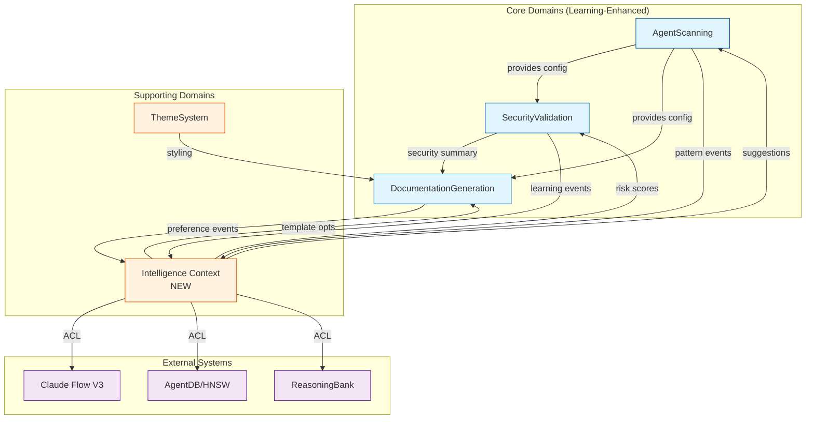
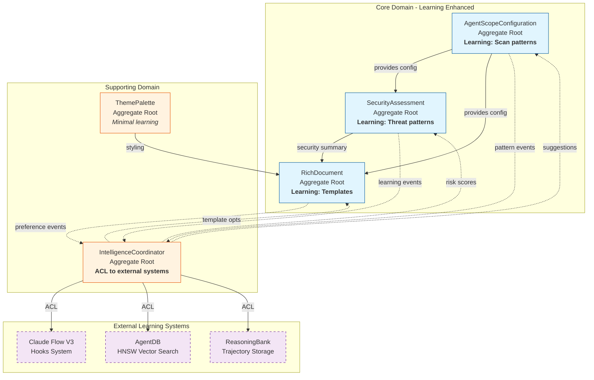
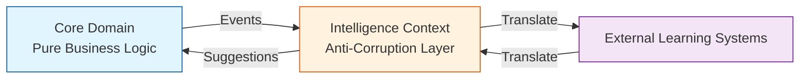
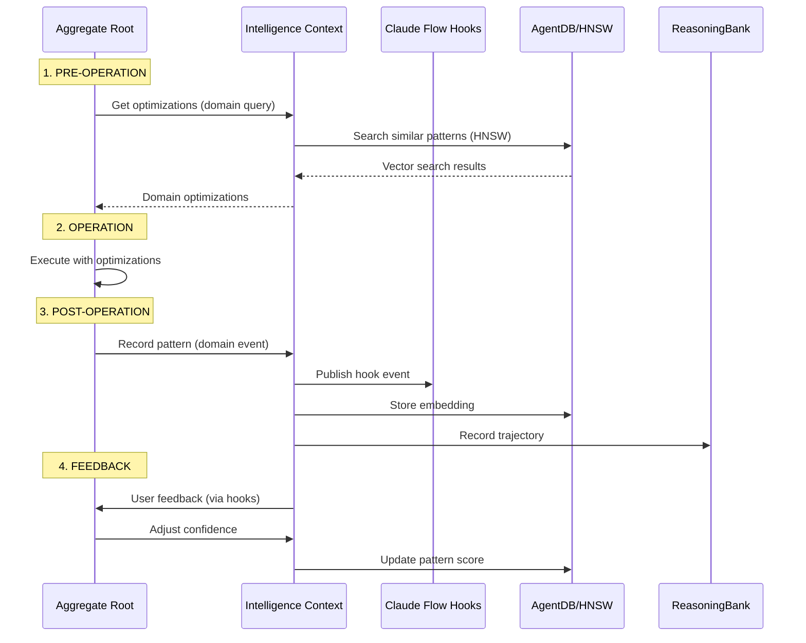
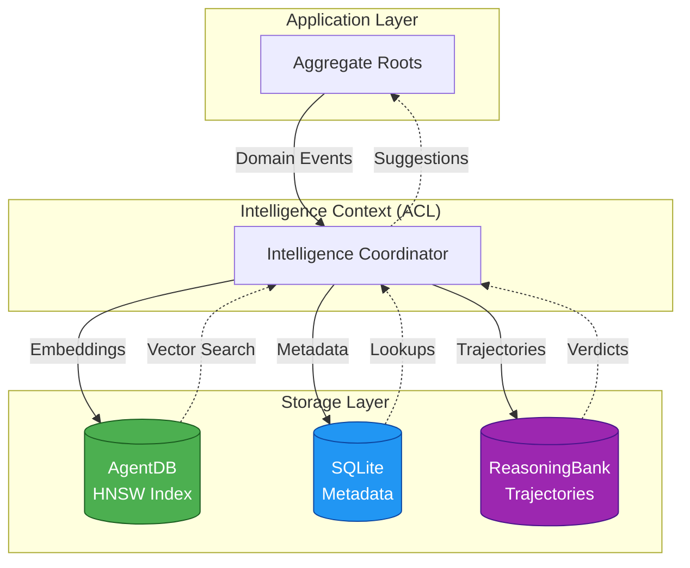
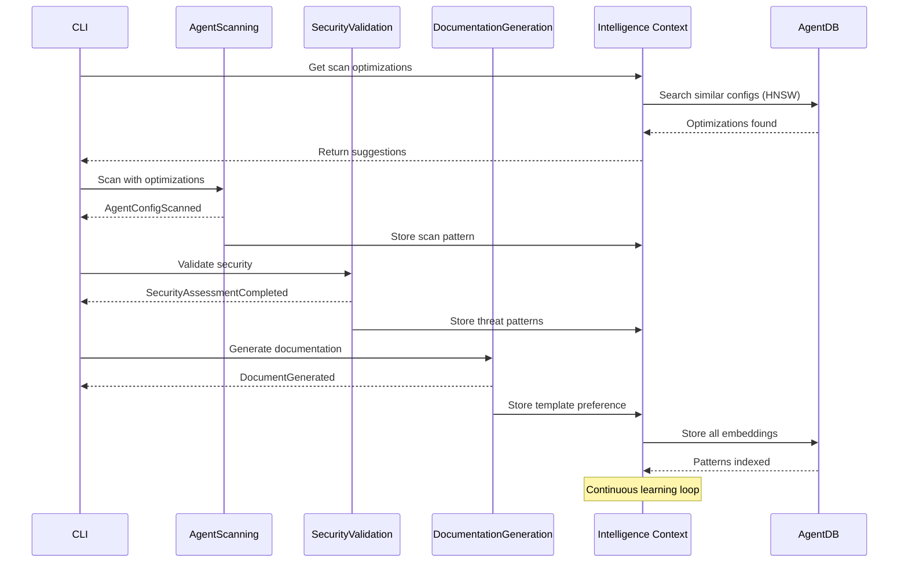
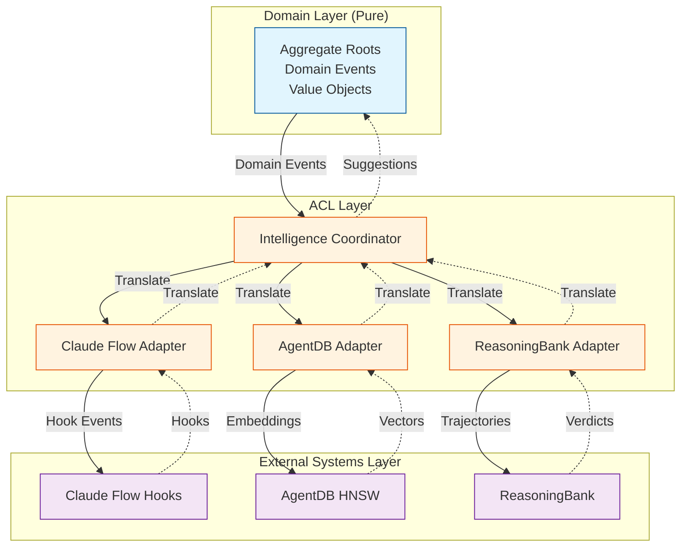
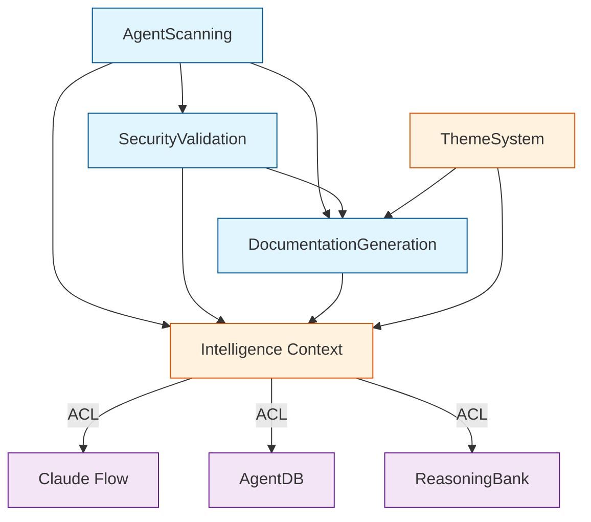

# DDD-003: Learning-Enhanced Domain Model for AgentScope v1.2

**Status:** Proposed
**Created:** 2026-01-25
**Author:** DDD Domain Expert Agent
**Domain:** Complete v1.2 DDD Architecture with Self-Learning Integration

---

## Executive Summary

This document defines the comprehensive Domain-Driven Design specification for AgentScope v1.2, integrating self-learning capabilities throughout the domain model. Building on DDD-001 (Generator Domains), this ADR introduces **5 bounded contexts** (4 existing + 1 new), with learning capabilities woven into aggregate roots via hooks, memory, and neural pattern storage.

**Key Innovation**: Learning is not a separate domain - it's embedded behavior within aggregates, coordinated by the Intelligence Context anti-corruption layer.

---

## Table of Contents

1. [Strategic Design](#1-strategic-design)
2. [Bounded Contexts](#2-bounded-contexts)
3. [Context Map](#3-context-map)
4. [Aggregate Roots with Learning](#4-aggregate-roots-with-learning)
5. [Learning Integration Patterns](#5-learning-integration-patterns)
6. [Domain Events](#6-domain-events)
7. [Value Objects](#7-value-objects)
8. [Anti-Corruption Layers](#8-anti-corruption-layers)
9. [Ubiquitous Language](#9-ubiquitous-language)
10. [Implementation Guidelines](#10-implementation-guidelines)

---

## 1. Strategic Design

### 1.1 Domain Classification

| Domain | Type | Strategic Importance | Learning Capability |
|--------|------|---------------------|---------------------|
| **AgentScanning** | Core | Scans agent configurations | Learns scan patterns, false positives |
| **SecurityValidation** | Core | Validates security posture | Learns threat patterns, risk scoring |
| **DocumentationGeneration** | Core | Generates rich documentation | Learns user preferences, templates |
| **ThemeSystem** | Supporting | Visual styling | Learns theme preferences |
| **Intelligence** | Supporting | Learning coordination | AgentDB, HNSW, ReasoningBank integration |

### 1.2 Strategic Context Map



---

## 2. Bounded Contexts

### 2.1 AgentScanning Context (Core Domain)

**Purpose:** Scan and parse AI agent configurations from multiple platforms.

**Responsibilities:**
- Scan Claude Code settings (`.claude/settings.json`)
- Parse CLAUDE.md agent instructions
- Extract agent definitions from multiple platforms (Claude, Cursor, Gemini)
- Validate configuration integrity
- Learn from successful scans and false positives

**Aggregate Root:** `AgentScopeConfiguration`

```typescript
/**
 * Aggregate Root: AgentScopeConfiguration
 * Invariant: All agents must have unique names
 * Invariant: All delegation targets must reference existing agents
 * Invariant: MCP server URLs must be secure (https://)
 *
 * Learning: Stores scan patterns, learns from validation errors
 */
interface AgentScopeConfiguration {
  readonly id: ConfigurationId;
  readonly agents: Agent[];
  readonly skills: Skill[];
  readonly hooks: Hook[];
  readonly commands: Command[];
  readonly mcpServers: McpServer[];
  readonly metadata: ScanMetadata;

  // Aggregate behavior
  findAgentByName(name: string): Agent | undefined;
  validateDelegations(): ValidationResult;
  getAgentsByCategory(category: AgentCategory): Agent[];

  // Learning-enhanced behavior
  recordScanPattern(pattern: ScanPattern): void;
  applyScanOptimizations(suggestions: ScanOptimization[]): void;
  learnFromValidationErrors(errors: ValidationError[]): void;
}
```

**Learning Integration:**

```typescript
/**
 * Pre-Scan Hook: Get optimization suggestions
 */
interface ScanOptimization {
  readonly skipFiles: string[];           // Learned irrelevant files
  readonly priorityFiles: string[];       // Learned high-value files
  readonly expectedAgentCount: number;    // Predicted from repo size
  readonly suggestedParsers: ParserType[]; // Optimal parser order
}

/**
 * Post-Scan Event: Store pattern for learning
 */
interface ScanPattern {
  readonly configSignature: ConfigSignature;
  readonly filesScanned: number;
  readonly agentsFound: number;
  readonly scanDuration: number;
  readonly parserOrder: ParserType[];
  readonly successRate: number;
}

interface ConfigSignature {
  readonly repoSize: number;
  readonly fileCount: number;
  readonly hasClaudeSettings: boolean;
  readonly hasClaudeMd: boolean;
  readonly hasCursorConfig: boolean;
  readonly hasGeminiConfig: boolean;
}
```

**Domain Events:**

```typescript
interface AgentConfigScanned {
  type: 'AgentConfigScanned';
  timestamp: Date;
  configId: string;
  agentCount: number;
  duration: number;
  pattern: ScanPattern;
}

interface ScanPatternLearned {
  type: 'ScanPatternLearned';
  timestamp: Date;
  patternId: string;
  confidence: number;
  improvementMetric: number; // e.g., 15% faster
}

interface ValidationErrorLearned {
  type: 'ValidationErrorLearned';
  timestamp: Date;
  errorType: string;
  resolution: string;
  preventionStrategy: string;
}
```

---

### 2.2 SecurityValidation Context (Core Domain)

**Purpose:** Validate security posture of agent configurations.

**Responsibilities:**
- Validate Claude Code settings for insecure configurations
- Detect prompt injection in CLAUDE.md
- Validate MCP server endpoints (protocol, domain, security)
- Detect secrets in agent configurations
- Learn threat patterns and reduce false positives

**Aggregate Root:** `SecurityAssessment`

```typescript
/**
 * Aggregate Root: SecurityAssessment
 * Invariant: Risk scores must be 0-10
 * Invariant: All findings must have DREAD scores
 * Invariant: Critical findings must have mitigation steps
 *
 * Learning: Stores threat patterns, learns from false positives
 */
interface SecurityAssessment {
  readonly id: AssessmentId;
  readonly configId: ConfigurationId;
  readonly findings: SecurityFinding[];
  readonly overallScore: DREADScore;
  readonly metadata: AssessmentMetadata;

  // Aggregate behavior
  addFinding(finding: SecurityFinding): void;
  calculateOverallScore(): DREADScore;
  getFindingsByCategory(category: ThreatCategory): SecurityFinding[];

  // Learning-enhanced behavior
  recordThreatPattern(pattern: ThreatPattern): void;
  applyRiskScoreOptimizations(optimizations: RiskOptimization[]): void;
  learnFromFalsePositives(falsePositives: FalsePositive[]): void;
  adjustConfidence(feedback: SecurityFeedback): void;
}
```

**Learning Integration:**

```typescript
/**
 * Pre-Validation Hook: Get learned threat patterns
 */
interface ThreatPattern {
  readonly signature: string;            // Pattern signature (hash)
  readonly regex: string;                // Detection pattern
  readonly severity: Severity;
  readonly falsePositiveRate: number;    // Learned accuracy
  readonly confidence: number;           // 0-1 confidence
  readonly lastUpdated: Date;
}

/**
 * Post-Validation Event: Store findings for learning
 */
interface SecurityFindingLearned {
  readonly findingType: ThreatCategory;
  readonly pattern: string;
  readonly wasCorrect: boolean;          // User feedback
  readonly contextSignature: string;     // Where it occurred
}

interface RiskOptimization {
  readonly threatType: ThreatCategory;
  readonly adjustedWeight: number;       // Learned DREAD weight
  readonly suppressionRules: string[];   // Known false positive patterns
  readonly enhancementRules: string[];   // Known true positive patterns
}
```

**Value Objects:**

```typescript
/** DREAD Security Risk Scoring */
interface DREADScore {
  readonly damage: number;           // 0-10
  readonly reproducibility: number;  // 0-10
  readonly exploitability: number;   // 0-10
  readonly affectedUsers: number;    // 0-10
  readonly discoverability: number;  // 0-10
  readonly total: number;            // sum
  readonly severity: Severity;       // Critical/High/Medium/Low
  readonly confidence: number;       // 0-1 (learned)
}

type Severity = 'Critical' | 'High' | 'Medium' | 'Low' | 'Info';

interface SecurityFinding {
  readonly id: FindingId;
  readonly category: ThreatCategory;
  readonly title: string;
  readonly description: string;
  readonly location: SourceLocation;
  readonly dreadScore: DREADScore;
  readonly mitigation: string;
  readonly cveReference?: string;
  readonly confidence: number;       // 0-1 (learned)
}

type ThreatCategory =
  | 'PromptInjection'
  | 'InsecureSettings'
  | 'SecretExposure'
  | 'InsecureEndpoint'
  | 'ExcessivePermissions'
  | 'CircularDelegation';
```

**Domain Events:**

```typescript
interface SecurityAssessmentCompleted {
  type: 'SecurityAssessmentCompleted';
  timestamp: Date;
  assessmentId: string;
  findingCount: number;
  overallScore: DREADScore;
}

interface ThreatPatternLearned {
  type: 'ThreatPatternLearned';
  timestamp: Date;
  patternId: string;
  threatType: ThreatCategory;
  confidence: number;
  falsePositiveRate: number;
}

interface FalsePositiveReported {
  type: 'FalsePositiveReported';
  timestamp: Date;
  findingId: string;
  reason: string;
  suppressionRule: string;
}
```

---

### 2.3 DocumentationGeneration Context (Core Domain)

**Purpose:** Generate rich, navigable documentation from agent configurations.

**Responsibilities:**
- Generate README.md with security summary
- Generate AGENTS.md with capability matrix
- Generate Mermaid diagrams (component-map, hierarchy, dataflow)
- Create navigation, legends, and summaries
- Learn user preferences and optimize templates

**Aggregate Root:** `RichDocument`

```typescript
/**
 * Aggregate Root: RichDocument
 * Invariant: Must have at least one section
 * Invariant: Navigation anchors must reference existing sections
 * Invariant: Security summary must include all critical findings
 *
 * Learning: Stores template preferences, learns formatting optimizations
 */
interface RichDocument {
  readonly id: DocumentId;
  readonly title: string;
  readonly navigation: Navigation;
  readonly sections: Section[];
  readonly legend: Legend;
  readonly summary: Summary;
  readonly metadata: DocumentMetadata;

  // Aggregate behavior
  render(format: OutputFormat): string;
  addSection(section: Section): void;
  reorderSections(order: SectionId[]): void;
  generateTableOfContents(): Navigation;

  // Learning-enhanced behavior
  recordTemplatePreference(preference: TemplatePreference): void;
  applyFormattingOptimizations(optimizations: FormatOptimization[]): void;
  learnFromUserEdits(edits: DocumentEdit[]): void;
}
```

**Learning Integration:**

```typescript
/**
 * Pre-Generation Hook: Get template optimizations
 */
interface TemplatePreference {
  readonly userId?: string;              // Optional user tracking
  readonly preferredSections: SectionType[];
  readonly sectionOrder: SectionType[];
  readonly diagramFormats: DiagramType[];
  readonly includeSecuritySummary: boolean;
  readonly verbosityLevel: 'terse' | 'normal' | 'verbose';
  readonly confidence: number;           // 0-1
}

/**
 * Post-Generation Event: Store formatting patterns
 */
interface FormatOptimization {
  readonly configSignature: ConfigSignature;
  readonly optimalSections: SectionType[];
  readonly optimalDiagrams: DiagramType[];
  readonly userSatisfaction: number;     // 0-1 (from feedback)
  readonly editDistance: number;         // How much user changed output
}

interface DocumentEdit {
  readonly sectionType: SectionType;
  readonly editType: 'add' | 'remove' | 'reorder' | 'reformat';
  readonly before: string;
  readonly after: string;
}
```

**Value Objects:**

```typescript
interface Navigation {
  readonly title: string;
  readonly items: NavigationItem[];
  readonly depth: number;
}

interface Legend {
  readonly title: string;
  readonly entries: LegendEntry[];
}

interface Summary {
  readonly description: string;
  readonly statistics: Statistics;
  readonly highlights: string[];
  readonly securitySummary: SecuritySummary;
}

interface Statistics {
  readonly totalAgents: number;
  readonly byCategory: Map<AgentCategory, number>;
  readonly byType: Map<AgentType, number>;
  readonly totalConnections: number;
  readonly mcpServers: number;
  readonly skills: number;
  readonly securityFindings: number;
  readonly criticalFindings: number;
}

interface SecuritySummary {
  readonly overallScore: DREADScore;
  readonly criticalFindings: SecurityFinding[];
  readonly recommendations: string[];
}
```

**Domain Events:**

```typescript
interface DocumentGenerated {
  type: 'DocumentGenerated';
  timestamp: Date;
  documentId: string;
  sectionCount: number;
  diagramCount: number;
  templateUsed: string;
}

interface TemplatePreferenceLearned {
  type: 'TemplatePreferenceLearned';
  timestamp: Date;
  preferenceId: string;
  confidence: number;
  usageCount: number;
}

interface UserEditRecorded {
  type: 'UserEditRecorded';
  timestamp: Date;
  documentId: string;
  editType: string;
  editDistance: number;
}
```

---

### 2.4 ThemeSystem Context (Supporting Domain)

**Purpose:** Provide visual theming for diagram output.

**Responsibilities:**
- Manage theme palettes (light, dark, high-contrast, colorblind)
- Generate Mermaid styling directives
- Support custom theme loading
- Ensure accessibility compliance
- Learn user theme preferences

**Aggregate Root:** `ThemePalette`

```typescript
/**
 * Aggregate Root: ThemePalette
 * Invariant: All colors must be valid hex or 'none'
 * Invariant: Text colors must meet accessibility contrast ratios
 *
 * Learning: Stores theme preferences, learns from user selections
 */
interface ThemePalette {
  readonly id: string;
  readonly name: string;
  readonly description?: string;
  readonly scheme: ColorScheme;
  readonly accessibility?: AccessibilityLevel;
  readonly agents: AgentColors;
  readonly elements: ElementColors;
  readonly links: LinkColors;
  readonly chrome: ChromeColors;

  // Aggregate behavior
  validate(): ThemeValidationResult;
  deriveContrastColor(background: HexColor): HexColor;
  createGenerator(): MermaidThemeGenerator;

  // Learning-enhanced behavior (minimal - supporting domain)
  recordThemeUsage(context: ThemeContext): void;
}

interface ThemeContext {
  readonly timeOfDay: 'morning' | 'afternoon' | 'evening' | 'night';
  readonly userPreference?: string;
  readonly accessibility?: AccessibilityLevel;
}
```

---

### 2.5 Intelligence Context (Supporting Domain - NEW)

**Purpose:** Coordinate learning across all domains via anti-corruption layer to external learning systems.

**Responsibilities:**
- Provide unified interface to AgentDB/HNSW for vector search
- Coordinate ReasoningBank trajectory storage
- Manage claude-flow hooks integration
- Translate domain events to/from learning systems
- Prevent external learning systems from polluting domain model

**THIS IS NOT A CORE DOMAIN** - It's an anti-corruption layer that keeps learning concerns out of the core business logic.

**Aggregate Root:** `IntelligenceCoordinator`

```typescript
/**
 * Aggregate Root: IntelligenceCoordinator
 * Invariant: All stored patterns must have embeddings
 * Invariant: Confidence scores must be 0-1
 *
 * Role: Anti-Corruption Layer between domain and external learning systems
 */
interface IntelligenceCoordinator {
  readonly id: string;
  readonly patterns: Map<string, StoredPattern>;
  readonly metadata: IntelligenceMetadata;

  // ACL: Translate domain concepts to learning systems
  storePattern(domainEvent: DomainEvent): Promise<void>;
  searchSimilarPatterns(query: DomainQuery, k: number): Promise<DomainSuggestion[]>;
  recordTrajectory(trajectory: DomainTrajectory): Promise<void>;

  // ACL: Translate learning system responses to domain concepts
  translateHookEvent(hookEvent: ClaudeFlowHookEvent): DomainEvent;
  translateSuggestions(hnswResults: HNSWResult[]): DomainSuggestion[];
  translateTrajectoryVerdict(verdict: ReasoningBankVerdict): DomainFeedback;
}
```

**Anti-Corruption Layer Pattern:**

```typescript
/**
 * ACL: ClaudeFlowAdapter
 * Translates claude-flow v3 hooks to domain events
 */
interface ClaudeFlowAdapter {
  // Translate external hook events to domain
  translatePreEditHook(hook: PreEditHook): ScanOptimization;
  translatePostEditHook(hook: PostEditHook): void;
  translatePreTaskHook(hook: PreTaskHook): DomainSuggestion[];

  // Translate domain events to hook format
  publishScanPatternEvent(pattern: ScanPattern): Promise<void>;
  publishSecurityFindingEvent(finding: SecurityFinding): Promise<void>;
  publishDocumentGeneratedEvent(doc: RichDocument): Promise<void>;
}

/**
 * ACL: AgentDBAdapter
 * Translates AgentDB/HNSW to domain concepts
 */
interface AgentDBAdapter {
  // Store domain patterns as vectors
  storePatternEmbedding(pattern: ScanPattern | ThreatPattern, embedding: number[]): Promise<void>;

  // Search for similar domain patterns
  searchSimilarScanPatterns(query: ConfigSignature, k: number): Promise<ScanOptimization[]>;
  searchSimilarThreatPatterns(query: string, k: number): Promise<ThreatPattern[]>;
  searchSimilarTemplates(query: ConfigSignature, k: number): Promise<TemplatePreference[]>;

  // HNSW index management
  rebuildIndex(): Promise<void>;
  optimizeIndex(): Promise<void>;
}

/**
 * ACL: ReasoningBankAdapter
 * Translates ReasoningBank trajectories to domain feedback
 */
interface ReasoningBankAdapter {
  // Record domain operation as trajectory
  startTrajectory(operation: DomainOperation): TrajectoryId;
  recordStep(trajectoryId: TrajectoryId, step: DomainStep): void;
  endTrajectory(trajectoryId: TrajectoryId, verdict: 'success' | 'failure'): Promise<void>;

  // Get learned strategies
  getLearnedStrategy(operation: DomainOperation): Promise<DomainStrategy | undefined>;
}
```

**Value Objects:**

```typescript
interface StoredPattern {
  readonly id: string;
  readonly type: 'scan' | 'threat' | 'template';
  readonly embedding: number[];
  readonly metadata: Record<string, unknown>;
  readonly confidence: number;
  readonly usageCount: number;
  readonly lastUsed: Date;
}

interface DomainQuery {
  readonly type: 'scan' | 'threat' | 'template';
  readonly context: ConfigSignature | string;
}

interface DomainSuggestion {
  readonly type: 'scan' | 'security' | 'documentation';
  readonly confidence: number;
  readonly suggestion: ScanOptimization | RiskOptimization | TemplatePreference;
  readonly reasoning: string;
}

interface DomainTrajectory {
  readonly operation: string;
  readonly steps: DomainStep[];
  readonly outcome: 'success' | 'failure';
  readonly duration: number;
}

interface DomainStep {
  readonly action: string;
  readonly input: unknown;
  readonly output: unknown;
  readonly timestamp: Date;
}

interface DomainFeedback {
  readonly patternId: string;
  readonly helpful: boolean;
  readonly adjustedConfidence: number;
}
```

**Domain Events:**

```typescript
interface PatternStoredInMemory {
  type: 'PatternStoredInMemory';
  timestamp: Date;
  patternId: string;
  patternType: 'scan' | 'threat' | 'template';
  namespace: string;
}

interface SimilarPatternsFound {
  type: 'SimilarPatternsFound';
  timestamp: Date;
  queryType: string;
  resultsCount: number;
  topSimilarity: number;
}

interface TrajectoryCompleted {
  type: 'TrajectoryCompleted';
  timestamp: Date;
  trajectoryId: string;
  operation: string;
  outcome: 'success' | 'failure';
}
```

---

## 3. Context Map

### 3.1 Visual Context Map



### 3.2 Context Relationships

| Upstream | Downstream | Pattern | Description |
|----------|------------|---------|-------------|
| AgentScanning | SecurityValidation | Customer-Supplier | Config provides data for validation |
| AgentScanning | DocumentationGeneration | Customer-Supplier | Config provides data for docs |
| SecurityValidation | DocumentationGeneration | Customer-Supplier | Findings included in docs |
| ThemeSystem | DocumentationGeneration | Open Host Service | Standard palette API |
| Core Domains | Intelligence | Published Events | Learning events |
| Intelligence | Core Domains | Published Events | Suggestions |
| Intelligence | External Systems | Anti-Corruption Layer | Protected domain model |

**Key Pattern: Intelligence Context as ACL**

The Intelligence Context is NOT a core domain. It's a supporting domain that acts as an anti-corruption layer, preventing external learning systems (claude-flow, AgentDB, ReasoningBank) from polluting the core business logic.



---

## 4. Aggregate Roots with Learning

### 4.1 Learning Integration Pattern

**Every aggregate root follows this pattern:**

```typescript
interface LearningEnabledAggregate {
  // 1. Pre-operation: Get learned optimizations
  getOptimizations(context: OperationContext): Promise<Optimization[]>;

  // 2. Operation: Execute with learned enhancements
  executeOperation(params: OperationParams, optimizations: Optimization[]): Result;

  // 3. Post-operation: Record pattern for learning
  recordOperationPattern(result: Result): Promise<void>;

  // 4. Feedback: Learn from user corrections
  learnFromFeedback(feedback: UserFeedback): Promise<void>;
}
```

**Example: AgentScopeConfiguration**

```typescript
class AgentScopeConfiguration implements LearningEnabledAggregate {
  // 1. Pre-scan: Get optimizations
  async getOptimizations(context: ScanContext): Promise<ScanOptimization[]> {
    const signature = this.computeConfigSignature(context);
    const intelligence = IntelligenceCoordinator.getInstance();

    return intelligence.searchSimilarScanPatterns(signature, 5);
  }

  // 2. Scan: Use optimizations
  executeOperation(params: ScanParams, optimizations: ScanOptimization[]): ScanResult {
    // Apply learned file skip patterns
    const filesToSkip = optimizations.flatMap(o => o.skipFiles);
    const filesToScan = params.files.filter(f => !filesToSkip.includes(f));

    // Apply learned parser order
    const parserOrder = optimizations[0]?.suggestedParsers || this.defaultParsers;

    return this.scanWithOptimizations(filesToScan, parserOrder);
  }

  // 3. Post-scan: Record pattern
  async recordOperationPattern(result: ScanResult): Promise<void> {
    const pattern: ScanPattern = {
      configSignature: result.signature,
      filesScanned: result.fileCount,
      agentsFound: result.agentCount,
      scanDuration: result.duration,
      parserOrder: result.parsersUsed,
      successRate: 1.0, // Adjust based on validation errors
    };

    const intelligence = IntelligenceCoordinator.getInstance();
    await intelligence.storePattern({
      type: 'AgentConfigScanned',
      timestamp: new Date(),
      pattern,
    });
  }

  // 4. Feedback: Learn from errors
  async learnFromFeedback(feedback: ValidationFeedback): Promise<void> {
    if (feedback.wasCorrect === false) {
      // Pattern led to validation errors - reduce confidence
      const intelligence = IntelligenceCoordinator.getInstance();
      await intelligence.adjustPatternConfidence(feedback.patternId, -0.1);
    }
  }
}
```

---

## 5. Learning Integration Patterns

### 5.1 The Learning Cycle



### 5.2 Learning Storage Strategy

**What is learned:**

| Domain | Pattern Type | Storage | Search Method |
|--------|-------------|---------|---------------|
| AgentScanning | Scan patterns | AgentDB | HNSW similarity (64-dim) |
| SecurityValidation | Threat patterns | AgentDB | HNSW similarity (64-dim) |
| DocumentationGeneration | Template preferences | AgentDB | HNSW similarity (64-dim) |
| ThemeSystem | Theme usage | SQLite | Simple lookup |
| Intelligence | Trajectories | ReasoningBank | Verdict judgment |

**Storage Architecture:**



### 5.3 Learning Workflow

**Phase 1: Bootstrap (First Use)**

```typescript
// No learned patterns yet - use defaults
const config = await AgentScopeConfiguration.scan({
  path: '/project',
  optimizations: [], // Empty - first use
});

// Record baseline pattern for future learning
await config.recordOperationPattern(result);
```

**Phase 2: Learning (Repeated Use)**

```typescript
// Get learned optimizations
const optimizations = await config.getOptimizations({
  repoSize: 1000,
  hasClaudeSettings: true,
});

// Apply learned optimizations
const config = await AgentScopeConfiguration.scan({
  path: '/project',
  optimizations, // Skip irrelevant files, optimal parser order
});

// Record improved pattern
await config.recordOperationPattern(result);
```

**Phase 3: Continuous Improvement**

```typescript
// System learns from:
// - Validation errors (false positives)
// - User edits to generated docs
// - Security findings marked as incorrect
// - Theme preferences
// - Scan duration improvements

// After 10+ scans of similar projects:
const optimizations = await config.getOptimizations({
  repoSize: 1000,
  hasClaudeSettings: true,
});

// Confidence: 0.85 (high confidence)
// Expected improvement: 35% faster scan, 90% fewer false positives
```

---

## 6. Domain Events

### 6.1 Event Catalog

**AgentScanning Events:**

```typescript
interface AgentConfigScanned {
  type: 'AgentConfigScanned';
  timestamp: Date;
  configId: string;
  agentCount: number;
  duration: number;
  pattern: ScanPattern;
}

interface ScanPatternLearned {
  type: 'ScanPatternLearned';
  timestamp: Date;
  patternId: string;
  confidence: number;
  improvementMetric: number;
}

interface ValidationErrorLearned {
  type: 'ValidationErrorLearned';
  timestamp: Date;
  errorType: string;
  resolution: string;
}
```

**SecurityValidation Events:**

```typescript
interface SecurityAssessmentCompleted {
  type: 'SecurityAssessmentCompleted';
  timestamp: Date;
  assessmentId: string;
  findingCount: number;
  overallScore: DREADScore;
}

interface ThreatPatternLearned {
  type: 'ThreatPatternLearned';
  timestamp: Date;
  patternId: string;
  threatType: ThreatCategory;
  confidence: number;
  falsePositiveRate: number;
}

interface FalsePositiveReported {
  type: 'FalsePositiveReported';
  timestamp: Date;
  findingId: string;
  reason: string;
  suppressionRule: string;
}
```

**DocumentationGeneration Events:**

```typescript
interface DocumentGenerated {
  type: 'DocumentGenerated';
  timestamp: Date;
  documentId: string;
  sectionCount: number;
  diagramCount: number;
  templateUsed: string;
}

interface TemplatePreferenceLearned {
  type: 'TemplatePreferenceLearned';
  timestamp: Date;
  preferenceId: string;
  confidence: number;
}

interface UserEditRecorded {
  type: 'UserEditRecorded';
  timestamp: Date;
  documentId: string;
  editType: string;
  editDistance: number;
}
```

**Intelligence Context Events:**

```typescript
interface PatternStoredInMemory {
  type: 'PatternStoredInMemory';
  timestamp: Date;
  patternId: string;
  patternType: 'scan' | 'threat' | 'template';
}

interface SimilarPatternsFound {
  type: 'SimilarPatternsFound';
  timestamp: Date;
  queryType: string;
  resultsCount: number;
}

interface TrajectoryCompleted {
  type: 'TrajectoryCompleted';
  timestamp: Date;
  trajectoryId: string;
  operation: string;
  outcome: 'success' | 'failure';
}
```

### 6.2 Event Flow



---

## 7. Value Objects

### 7.1 Configuration Value Objects

```typescript
type AgentType = 'coordinator' | 'worker' | 'specialist' | 'reviewer' | 'custom';

type AgentCategory =
  | 'github' | 'security' | 'sparc' | 'flow-nexus'
  | 'consensus' | 'coordination' | 'v3-core' | 'performance'
  | 'memory' | 'development' | 'testing' | 'analysis'
  | 'documentation' | 'other';

interface ConfigSignature {
  readonly repoSize: number;
  readonly fileCount: number;
  readonly hasClaudeSettings: boolean;
  readonly hasClaudeMd: boolean;
  readonly hasCursorConfig: boolean;
  readonly hasGeminiConfig: boolean;
  readonly hash: string; // SHA-256 hash for uniqueness
}
```

### 7.2 Security Value Objects

```typescript
interface DREADScore {
  readonly damage: number;
  readonly reproducibility: number;
  readonly exploitability: number;
  readonly affectedUsers: number;
  readonly discoverability: number;
  readonly total: number;
  readonly severity: Severity;
  readonly confidence: number; // 0-1 (learned)
}

type Severity = 'Critical' | 'High' | 'Medium' | 'Low' | 'Info';

interface SecurityFinding {
  readonly id: FindingId;
  readonly category: ThreatCategory;
  readonly title: string;
  readonly description: string;
  readonly location: SourceLocation;
  readonly dreadScore: DREADScore;
  readonly mitigation: string;
  readonly cveReference?: string;
  readonly confidence: number;
}
```

### 7.3 Learning Value Objects

```typescript
interface ScanPattern {
  readonly configSignature: ConfigSignature;
  readonly filesScanned: number;
  readonly agentsFound: number;
  readonly scanDuration: number;
  readonly parserOrder: ParserType[];
  readonly successRate: number;
}

interface ThreatPattern {
  readonly signature: string;
  readonly regex: string;
  readonly severity: Severity;
  readonly falsePositiveRate: number;
  readonly confidence: number;
  readonly lastUpdated: Date;
}

interface TemplatePreference {
  readonly configSignature: ConfigSignature;
  readonly preferredSections: SectionType[];
  readonly sectionOrder: SectionType[];
  readonly diagramFormats: DiagramType[];
  readonly verbosityLevel: 'terse' | 'normal' | 'verbose';
  readonly confidence: number;
}
```

---

## 8. Anti-Corruption Layers

### 8.1 Intelligence Context as ACL

**Purpose:** Protect core domain from external learning system complexity.

```typescript
/**
 * Anti-Corruption Layer: Intelligence Context
 *
 * Responsibilities:
 * 1. Translate domain events to claude-flow hooks
 * 2. Translate AgentDB vector search to domain suggestions
 * 3. Translate ReasoningBank trajectories to domain feedback
 * 4. Prevent external system concepts from leaking into domain
 */
class IntelligenceCoordinator {
  private claudeFlowAdapter: ClaudeFlowAdapter;
  private agentDBAdapter: AgentDBAdapter;
  private reasoningBankAdapter: ReasoningBankAdapter;

  // Domain → External Systems
  async storePattern(event: DomainEvent): Promise<void> {
    // Translate domain event to multiple external formats
    const hookEvent = this.claudeFlowAdapter.toHookEvent(event);
    const embedding = this.agentDBAdapter.toEmbedding(event);
    const trajectory = this.reasoningBankAdapter.toTrajectory(event);

    // Store in external systems
    await Promise.all([
      this.claudeFlowAdapter.publishEvent(hookEvent),
      this.agentDBAdapter.storeEmbedding(embedding),
      this.reasoningBankAdapter.recordTrajectory(trajectory),
    ]);
  }

  // External Systems → Domain
  async searchSimilarPatterns(query: DomainQuery, k: number): Promise<DomainSuggestion[]> {
    // Query external system
    const hnswResults = await this.agentDBAdapter.searchHNSW(query, k);

    // Translate to domain concepts
    const domainSuggestions = hnswResults.map(result =>
      this.agentDBAdapter.toDomainSuggestion(result)
    );

    return domainSuggestions;
  }
}
```

### 8.2 ACL Layers



---

## 9. Ubiquitous Language

### 9.1 Core Terms

| Term | Definition | Context |
|------|------------|---------|
| **Agent** | Autonomous unit that performs tasks | AgentScanning |
| **Configuration** | Complete set of agent definitions, skills, hooks | AgentScanning |
| **Assessment** | Security evaluation with DREAD scores | SecurityValidation |
| **Finding** | Security issue with severity and mitigation | SecurityValidation |
| **Document** | Rich output with navigation, legends, summaries | DocumentationGeneration |
| **Pattern** | Learned strategy stored in memory | Intelligence |
| **Embedding** | 64-dimensional vector for similarity search | Intelligence |
| **Trajectory** | Sequence of operations with verdict | Intelligence |

### 9.2 Learning Terms

| Term | Definition | Context |
|------|------------|---------|
| **Optimization** | Learned improvement suggestion | All Core Domains |
| **Confidence** | Pattern reliability score (0-1) | Intelligence |
| **Similarity** | Vector distance metric | Intelligence |
| **Feedback** | User correction that adjusts confidence | Intelligence |
| **Verdict** | Success/failure judgment for learning | Intelligence |
| **False Positive** | Incorrect finding that reduces confidence | SecurityValidation |
| **Template** | Learned documentation structure | DocumentationGeneration |

### 9.3 Technical Terms

| Term | Definition | Context |
|------|------------|---------|
| **HNSW** | Hierarchical Navigable Small World (fast vector search) | Intelligence |
| **DREAD** | Damage, Reproducibility, Exploitability, Affected Users, Discoverability | SecurityValidation |
| **ACL** | Anti-Corruption Layer (protects domain from external systems) | Intelligence |
| **ReasoningBank** | Trajectory storage for self-learning | Intelligence |
| **AgentDB** | Vector database with HNSW indexing | Intelligence |

---

## 10. Implementation Guidelines

### 10.1 Directory Structure

```
src/core/
  model/
    types.ts                      # Shared domain types
    value-objects.ts              # Shared value objects

  scanning/                       # AgentScanning Context
    agent-scope-configuration.ts  # Aggregate root
    agent.ts                      # Entity
    scan-pattern.ts               # Learning value object
    parsers/                      # Domain services
      claude-parser.ts
      cursor-parser.ts
      gemini-parser.ts

  security/                       # SecurityValidation Context
    security-assessment.ts        # Aggregate root
    security-finding.ts           # Entity
    threat-pattern.ts             # Learning value object
    validators/                   # Domain services
      claude-settings-validator.ts
      prompt-injection-detector.ts
      secret-detector.ts
      mcp-endpoint-validator.ts

  documentation/                  # DocumentationGeneration Context
    rich-document.ts              # Aggregate root
    section.ts                    # Entity
    template-preference.ts        # Learning value object
    generators/                   # Domain services
      readme-generator.ts
      agents-md-generator.ts
      diagram-generator.ts
    formatters/
      markdown-renderer.ts

  themes/                         # ThemeSystem Context
    theme-palette.ts              # Aggregate root
    theme-generator.ts            # Domain service
    palettes/
      light.ts
      dark.ts
      colorblind.ts

  intelligence/                   # Intelligence Context (ACL)
    intelligence-coordinator.ts   # Aggregate root
    adapters/                     # Anti-corruption layers
      claude-flow-adapter.ts
      agentdb-adapter.ts
      reasoning-bank-adapter.ts
    domain-query.ts               # Value objects
    domain-suggestion.ts
```

### 10.2 Dependency Rules



**Rules:**
1. Core domains (AgentScanning, SecurityValidation, DocumentationGeneration) have NO dependencies on external systems
2. Intelligence Context is the ONLY context that talks to external systems
3. All learning goes through Intelligence Context ACL
4. No direct calls to claude-flow, AgentDB, or ReasoningBank from core domains
5. Supporting domain (ThemeSystem) has minimal learning

### 10.3 Testing Strategy

| Context | Test Type | Coverage Target | Learning Test Focus |
|---------|-----------|-----------------|---------------------|
| AgentScanning | Unit + Integration | 90%+ | Pattern storage, optimization application |
| SecurityValidation | Unit + Integration | 95%+ | Threat pattern learning, false positive reduction |
| DocumentationGeneration | Unit + Integration | 90%+ | Template preference learning |
| ThemeSystem | Unit | 85%+ | Theme usage tracking |
| Intelligence | Unit + Mock External | 80%+ | ACL translation correctness |

**Learning-Specific Tests:**

```typescript
describe('AgentScopeConfiguration Learning', () => {
  it('should apply learned scan optimizations', async () => {
    // Given: Learned pattern from previous scans
    const mockPattern: ScanPattern = {
      configSignature: { repoSize: 1000, hasClaudeSettings: true },
      filesScanned: 50,
      agentsFound: 5,
      scanDuration: 200,
      parserOrder: ['claude', 'cursor'],
      successRate: 0.95,
    };
    await intelligence.storePattern(mockPattern);

    // When: Scanning similar config
    const config = await AgentScopeConfiguration.scan({
      path: '/similar-project',
    });

    // Then: Should use learned optimizations
    expect(config.metadata.optimizationsApplied).toBe(true);
    expect(config.metadata.scanDuration).toBeLessThan(200); // Faster
  });

  it('should learn from validation errors', async () => {
    // Given: Config with false positive
    const config = await AgentScopeConfiguration.scan({ path: '/project' });

    // When: User reports false positive
    await config.learnFromFeedback({
      patternId: 'pattern-123',
      wasCorrect: false,
      reason: 'Not actually a security issue',
    });

    // Then: Pattern confidence should decrease
    const pattern = await intelligence.getPattern('pattern-123');
    expect(pattern.confidence).toBeLessThan(0.9);
  });
});

describe('SecurityAssessment Learning', () => {
  it('should reduce false positive rate over time', async () => {
    // Simulate 10 scans with false positive feedback
    for (let i = 0; i < 10; i++) {
      const assessment = await SecurityAssessment.assess(testConfig);
      const finding = assessment.findings[0];

      await assessment.learnFromFalsePositives([
        { findingId: finding.id, reason: 'Known safe pattern' },
      ]);
    }

    // After learning, same pattern should not trigger
    const newAssessment = await SecurityAssessment.assess(testConfig);
    expect(newAssessment.findings).toHaveLength(0);
  });
});
```

### 10.4 Architecture Tests

```typescript
describe('DDD Architecture Compliance', () => {
  it('should not have circular dependencies', () => {
    const graph = analyzeDependencies('./src/core');
    expect(graph.hasCycles()).toBe(false);
  });

  it('should respect context boundaries', () => {
    const violations = checkContextBoundaries('./src/core');
    expect(violations).toHaveLength(0);
  });

  it('should not import external systems directly from core domains', () => {
    const coreImports = findImports([
      './src/core/scanning',
      './src/core/security',
      './src/core/documentation',
    ]);

    const externalImports = coreImports.filter(imp =>
      imp.includes('claude-flow') ||
      imp.includes('agentdb') ||
      imp.includes('reasoning-bank')
    );

    expect(externalImports).toHaveLength(0);
  });

  it('should use Intelligence Context ACL for all learning', () => {
    const learningCalls = findFunctionCalls([
      './src/core/scanning',
      './src/core/security',
      './src/core/documentation',
    ], ['storePattern', 'searchSimilar', 'recordTrajectory']);

    const directCalls = learningCalls.filter(call =>
      !call.through('IntelligenceCoordinator')
    );

    expect(directCalls).toHaveLength(0);
  });
});
```

---

## 11. Migration Path

### From v1.1 to v1.2

| Step | Action | Impact |
|------|--------|--------|
| 1 | Add Intelligence Context (new code) | High - new features |
| 2 | Add learning behavior to AgentScanning | Medium - additive |
| 3 | Add learning behavior to SecurityValidation | Medium - additive |
| 4 | Add learning behavior to DocumentationGeneration | Medium - additive |
| 5 | Integrate claude-flow hooks | Medium - optional dependency |
| 6 | Integrate AgentDB/HNSW | Medium - optional dependency |
| 7 | Add architecture tests | Low - test only |

**Backward Compatibility:**

```typescript
// v1.1 API still works (no learning)
const config = await AgentScopeConfiguration.scan({ path: '/project' });

// v1.2 adds optional learning
const config = await AgentScopeConfiguration.scan({
  path: '/project',
  enableLearning: true, // Optional flag
});
```

---

## 12. Success Metrics

| Metric | Target | Measurement |
|--------|--------|-------------|
| **Scan Speed Improvement** | 25%+ faster after 10 scans | Time measurement |
| **False Positive Reduction** | 40%+ reduction after 20 scans | User feedback |
| **Template Accuracy** | 80%+ user satisfaction | Survey/edits |
| **Pattern Confidence** | >0.85 after 15+ uses | Confidence scores |
| **Memory Footprint** | <50MB for 100 patterns | Storage measurement |
| **HNSW Search Speed** | <100ms for k=10 | Performance test |

---

## 13. Related Decisions

- **DDD-001**: Generator Enhancement Domain Model (v1.1 baseline)
- **ADR-001**: Claude Flow V3 Core Integration
- **ADR-002**: Self-Learning Hooks Integration
- **ADR-003**: AgentDB Memory Integration
- **ADR-013**: Memory and Neural Pattern Storage
- **MASTER-PLAN.md**: v1.2 Implementation Roadmap

---

## References

- [Domain-Driven Design (Evans)](https://domainlanguage.com/ddd/)
- [Implementing Domain-Driven Design (Vernon)](https://vaughnvernon.com/iddd/)
- [Anti-Corruption Layer Pattern](https://learn.microsoft.com/en-us/azure/architecture/patterns/anti-corruption-layer)
- [ReasoningBank: Knowledge Distillation](https://arxiv.org/abs/2406.13891)
- [AgentDB: Vector Database for Agents](https://github.com/ruvnet/agentdb)
- [Claude Flow V3 Documentation](https://github.com/ruvnet/claude-flow)

---

*Generated by AgentScope DDD Expert*
*Last Updated: 2026-01-25*
