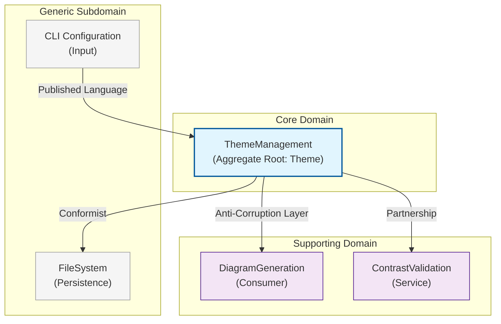

# ADR: Domain-Driven Design Model for Theme System

**Status**: Proposed
**Date**: 2026-01-22
**Author**: DDD Domain Expert Agent
**Context**: AgentScope Mermaid Diagram Generation

## Overview

This ADR defines the Domain-Driven Design model for the Theme System in AgentScope. The system generates Mermaid diagrams with configurable color themes, supporting accessibility requirements and multiple visual styles.

---

## 1. Bounded Context: ThemeManagement

### 1.1 Core Domain Concepts

| Concept | Description |
|---------|-------------|
| **Theme** | A complete visual styling configuration for diagrams |
| **ColorPalette** | A collection of colors organized by semantic meaning |
| **ThemeVariables** | CSS-like variables that map to Mermaid classDef |
| **AccessibilityLevel** | WCAG compliance requirements |
| **ContrastRatio** | Calculated luminance ratio between colors |

### 1.2 Ubiquitous Language

| Term | Definition |
|------|------------|
| **Theme** | A named collection of color palettes and styling rules |
| **Palette** | A set of harmonious colors for a specific purpose |
| **ClassDef** | Mermaid syntax for defining node styles |
| **Contrast Ratio** | WCAG luminance ratio (minimum 4.5:1 for AA) |
| **Semantic Color** | Color assigned by meaning (primary, success, warning) |

### 1.3 Context Map



### 1.4 Context Relationships

| Relationship | Pattern | Description |
|--------------|---------|-------------|
| ThemeManagement -> DiagramGeneration | Anti-Corruption Layer | Theme translates to classDef statements |
| CLI -> ThemeManagement | Published Language | CLI options map to theme selection |
| ThemeManagement <-> ContrastValidation | Partnership | Bidirectional validation during theme application |
| ThemeManagement -> FileSystem | Conformist | Themes stored as JSON following FS conventions |

---

## 2. Entities

### 2.1 Theme (Aggregate Root)

The Theme entity is the aggregate root that maintains consistency across color palettes and variables.

```typescript
/**
 * Theme - Aggregate Root
 *
 * Represents a complete visual styling configuration for Mermaid diagrams.
 * Enforces invariants:
 * - All palettes must have valid hex colors
 * - Contrast ratios must meet accessibility level requirements
 * - Theme name must be unique within repository
 */
interface Theme {
  /** Unique identifier for the theme */
  readonly id: ThemeId;

  /** Human-readable theme name */
  readonly name: ThemeName;

  /** Theme description for documentation */
  readonly description: string;

  /** Color palette collection */
  readonly palette: ColorPalette;

  /** Mermaid-specific variables */
  readonly variables: ThemeVariables;

  /** Accessibility compliance level */
  readonly accessibilityLevel: AccessibilityLevel;

  /** Theme version for cache invalidation */
  readonly version: number;

  /** Timestamp of last modification */
  readonly updatedAt: Date;

  /** Whether this is a built-in or custom theme */
  readonly isBuiltIn: boolean;

  /** Domain events raised by this aggregate */
  readonly domainEvents: DomainEvent[];
}

/**
 * Theme Aggregate Root Implementation
 */
class ThemeAggregate implements Theme {
  readonly id: ThemeId;
  readonly name: ThemeName;
  readonly description: string;
  readonly palette: ColorPalette;
  readonly variables: ThemeVariables;
  readonly accessibilityLevel: AccessibilityLevel;
  readonly version: number;
  readonly updatedAt: Date;
  readonly isBuiltIn: boolean;
  readonly domainEvents: DomainEvent[] = [];

  private constructor(props: ThemeProps) {
    this.id = props.id;
    this.name = props.name;
    this.description = props.description;
    this.palette = props.palette;
    this.variables = props.variables;
    this.accessibilityLevel = props.accessibilityLevel;
    this.version = props.version;
    this.updatedAt = props.updatedAt;
    this.isBuiltIn = props.isBuiltIn;
  }

  /**
   * Factory method - enforces all invariants at creation
   */
  static create(props: CreateThemeProps): Result<ThemeAggregate, ThemeError> {
    // Validate palette colors
    const paletteResult = ColorPalette.create(props.palette);
    if (paletteResult.isFailure) {
      return Result.fail(paletteResult.error);
    }

    // Validate name
    const nameResult = ThemeName.create(props.name);
    if (nameResult.isFailure) {
      return Result.fail(nameResult.error);
    }

    const theme = new ThemeAggregate({
      id: ThemeId.create(),
      name: nameResult.value,
      description: props.description,
      palette: paletteResult.value,
      variables: ThemeVariables.fromPalette(paletteResult.value),
      accessibilityLevel: props.accessibilityLevel ?? 'standard',
      version: 1,
      updatedAt: new Date(),
      isBuiltIn: false,
    });

    theme.domainEvents.push(new ThemeCreatedEvent(theme.id, theme.name));
    return Result.ok(theme);
  }

  /**
   * Apply theme to diagram - generates classDef statements
   */
  applyToGraph(): ClassDefStatement[] {
    const statements = this.variables.toClassDefs();
    this.domainEvents.push(new ThemeAppliedEvent(this.id, statements.length));
    return statements;
  }

  /**
   * Validate contrast ratios against accessibility level
   */
  validateAccessibility(): ContrastValidationResult {
    const validator = new ContrastValidator(this.accessibilityLevel);
    return validator.validate(this.palette);
  }
}

interface ThemeProps {
  id: ThemeId;
  name: ThemeName;
  description: string;
  palette: ColorPalette;
  variables: ThemeVariables;
  accessibilityLevel: AccessibilityLevel;
  version: number;
  updatedAt: Date;
  isBuiltIn: boolean;
}

interface CreateThemeProps {
  name: string;
  description: string;
  palette: ColorPaletteInput;
  accessibilityLevel?: AccessibilityLevel;
}
```

### 2.2 ColorPalette (Entity)

```typescript
/**
 * ColorPalette - Entity
 *
 * A collection of semantically organized colors.
 * Identity is based on the combination of colors.
 */
interface ColorPalette {
  /** Unique identifier */
  readonly id: PaletteId;

  /** Primary brand colors */
  readonly primary: ColorSet;

  /** Semantic colors for status */
  readonly semantic: SemanticColorSet;

  /** Node type colors */
  readonly nodeTypes: NodeTypeColorSet;

  /** Edge/connection colors */
  readonly edges: EdgeColorSet;

  /** Background colors */
  readonly backgrounds: BackgroundColorSet;

  /** Text colors */
  readonly text: TextColorSet;
}

interface ColorSet {
  main: HexColor;
  light: HexColor;
  dark: HexColor;
  contrast: HexColor; // Text color for main background
}

interface SemanticColorSet {
  success: ColorSet;
  warning: ColorSet;
  error: ColorSet;
  info: ColorSet;
  neutral: ColorSet;
}

interface NodeTypeColorSet {
  coordinator: ColorSet;
  worker: ColorSet;
  reviewer: ColorSet;
  specialist: ColorSet;
  skill: ColorSet;
  hook: ColorSet;
  mcp: ColorSet;
}

interface EdgeColorSet {
  default: HexColor;
  delegation: HexColor;
  dataflow: HexColor;
  trigger: HexColor;
  dependency: HexColor;
}

interface BackgroundColorSet {
  canvas: HexColor;
  subgraph: HexColor;
  highlight: HexColor;
}

interface TextColorSet {
  primary: HexColor;
  secondary: HexColor;
  disabled: HexColor;
  inverse: HexColor;
}

/**
 * ColorPalette Implementation
 */
class ColorPaletteEntity implements ColorPalette {
  readonly id: PaletteId;
  readonly primary: ColorSet;
  readonly semantic: SemanticColorSet;
  readonly nodeTypes: NodeTypeColorSet;
  readonly edges: EdgeColorSet;
  readonly backgrounds: BackgroundColorSet;
  readonly text: TextColorSet;

  private constructor(props: ColorPaletteProps) {
    this.id = props.id;
    this.primary = props.primary;
    this.semantic = props.semantic;
    this.nodeTypes = props.nodeTypes;
    this.edges = props.edges;
    this.backgrounds = props.backgrounds;
    this.text = props.text;
  }

  static create(input: ColorPaletteInput): Result<ColorPaletteEntity, PaletteError> {
    // Validate all colors are valid hex
    const allColors = this.extractAllColors(input);
    for (const [path, color] of allColors) {
      const result = HexColor.create(color);
      if (result.isFailure) {
        return Result.fail(new InvalidColorError(path, color));
      }
    }

    return Result.ok(new ColorPaletteEntity({
      id: PaletteId.create(),
      ...input,
    }));
  }

  private static extractAllColors(input: ColorPaletteInput): [string, string][] {
    const colors: [string, string][] = [];
    // Recursively extract all color values with their paths
    const extract = (obj: unknown, path: string) => {
      if (typeof obj === 'string') {
        colors.push([path, obj]);
      } else if (typeof obj === 'object' && obj !== null) {
        for (const [key, value] of Object.entries(obj)) {
          extract(value, `${path}.${key}`);
        }
      }
    };
    extract(input, 'palette');
    return colors;
  }

  /**
   * Get all color pairs that need contrast validation
   */
  getContrastPairs(): ContrastPair[] {
    return [
      // Primary on backgrounds
      { foreground: this.text.primary, background: this.backgrounds.canvas, context: 'text-on-canvas' },
      { foreground: this.text.primary, background: this.backgrounds.subgraph, context: 'text-on-subgraph' },

      // Node contrast
      { foreground: this.nodeTypes.coordinator.contrast, background: this.nodeTypes.coordinator.main, context: 'coordinator-node' },
      { foreground: this.nodeTypes.worker.contrast, background: this.nodeTypes.worker.main, context: 'worker-node' },
      { foreground: this.nodeTypes.reviewer.contrast, background: this.nodeTypes.reviewer.main, context: 'reviewer-node' },
      { foreground: this.nodeTypes.specialist.contrast, background: this.nodeTypes.specialist.main, context: 'specialist-node' },

      // Semantic contrast
      { foreground: this.semantic.success.contrast, background: this.semantic.success.main, context: 'success-status' },
      { foreground: this.semantic.warning.contrast, background: this.semantic.warning.main, context: 'warning-status' },
      { foreground: this.semantic.error.contrast, background: this.semantic.error.main, context: 'error-status' },
    ];
  }
}

interface ContrastPair {
  foreground: HexColor;
  background: HexColor;
  context: string;
}
```

### 2.3 ThemeVariables (Entity)

```typescript
/**
 * ThemeVariables - Entity
 *
 * Mermaid-specific styling variables derived from ColorPalette.
 * Translates semantic colors to Mermaid classDef syntax.
 */
interface ThemeVariables {
  /** Unique identifier */
  readonly id: VariablesId;

  /** Node class definitions */
  readonly nodeClasses: Map<string, ClassDefConfig>;

  /** Edge styles */
  readonly edgeStyles: Map<string, EdgeStyleConfig>;

  /** Subgraph styles */
  readonly subgraphStyles: SubgraphStyleConfig;

  /** Global diagram settings */
  readonly globalSettings: GlobalStyleConfig;
}

interface ClassDefConfig {
  fill: HexColor;
  stroke: HexColor;
  strokeWidth: number;
  strokeDasharray?: string;
  color: HexColor; // Text color
}

interface EdgeStyleConfig {
  stroke: HexColor;
  strokeWidth: number;
  strokeDasharray?: string;
}

interface SubgraphStyleConfig {
  fill: HexColor;
  stroke: HexColor;
  strokeWidth: number;
  opacity: number;
}

interface GlobalStyleConfig {
  fontFamily: string;
  fontSize: number;
  lineColor: HexColor;
  textColor: HexColor;
}

/**
 * ThemeVariables Implementation
 */
class ThemeVariablesEntity implements ThemeVariables {
  readonly id: VariablesId;
  readonly nodeClasses: Map<string, ClassDefConfig>;
  readonly edgeStyles: Map<string, EdgeStyleConfig>;
  readonly subgraphStyles: SubgraphStyleConfig;
  readonly globalSettings: GlobalStyleConfig;

  private constructor(props: ThemeVariablesProps) {
    this.id = props.id;
    this.nodeClasses = props.nodeClasses;
    this.edgeStyles = props.edgeStyles;
    this.subgraphStyles = props.subgraphStyles;
    this.globalSettings = props.globalSettings;
  }

  /**
   * Create ThemeVariables from a ColorPalette
   */
  static fromPalette(palette: ColorPalette): ThemeVariablesEntity {
    const nodeClasses = new Map<string, ClassDefConfig>([
      ['coordinator', {
        fill: palette.nodeTypes.coordinator.main,
        stroke: palette.nodeTypes.coordinator.dark,
        strokeWidth: 3,
        color: palette.nodeTypes.coordinator.contrast,
      }],
      ['worker', {
        fill: palette.nodeTypes.worker.main,
        stroke: palette.nodeTypes.worker.dark,
        strokeWidth: 2,
        color: palette.nodeTypes.worker.contrast,
      }],
      ['reviewer', {
        fill: palette.nodeTypes.reviewer.main,
        stroke: palette.nodeTypes.reviewer.dark,
        strokeWidth: 2,
        color: palette.nodeTypes.reviewer.contrast,
      }],
      ['specialist', {
        fill: palette.nodeTypes.specialist.main,
        stroke: palette.nodeTypes.specialist.dark,
        strokeWidth: 2,
        color: palette.nodeTypes.specialist.contrast,
      }],
      ['skill', {
        fill: palette.nodeTypes.skill.main,
        stroke: palette.nodeTypes.skill.dark,
        strokeWidth: 1,
        strokeDasharray: '5 5',
        color: palette.nodeTypes.skill.contrast,
      }],
      ['hook', {
        fill: palette.nodeTypes.hook.main,
        stroke: palette.nodeTypes.hook.dark,
        strokeWidth: 1,
        strokeDasharray: '3 3',
        color: palette.nodeTypes.hook.contrast,
      }],
      ['mcp', {
        fill: palette.nodeTypes.mcp.main,
        stroke: palette.nodeTypes.mcp.dark,
        strokeWidth: 2,
        color: palette.nodeTypes.mcp.contrast,
      }],
      ['success', {
        fill: palette.semantic.success.main,
        stroke: palette.semantic.success.dark,
        strokeWidth: 2,
        color: palette.semantic.success.contrast,
      }],
      ['warning', {
        fill: palette.semantic.warning.main,
        stroke: palette.semantic.warning.dark,
        strokeWidth: 2,
        color: palette.semantic.warning.contrast,
      }],
      ['error', {
        fill: palette.semantic.error.main,
        stroke: palette.semantic.error.dark,
        strokeWidth: 2,
        color: palette.semantic.error.contrast,
      }],
    ]);

    const edgeStyles = new Map<string, EdgeStyleConfig>([
      ['default', { stroke: palette.edges.default, strokeWidth: 1 }],
      ['delegation', { stroke: palette.edges.delegation, strokeWidth: 2 }],
      ['dataflow', { stroke: palette.edges.dataflow, strokeWidth: 2, strokeDasharray: '5 5' }],
      ['trigger', { stroke: palette.edges.trigger, strokeWidth: 1, strokeDasharray: '3 3' }],
      ['dependency', { stroke: palette.edges.dependency, strokeWidth: 1 }],
    ]);

    return new ThemeVariablesEntity({
      id: VariablesId.create(),
      nodeClasses,
      edgeStyles,
      subgraphStyles: {
        fill: palette.backgrounds.subgraph,
        stroke: palette.primary.dark,
        strokeWidth: 1,
        opacity: 0.1,
      },
      globalSettings: {
        fontFamily: 'system-ui, -apple-system, sans-serif',
        fontSize: 14,
        lineColor: palette.edges.default,
        textColor: palette.text.primary,
      },
    });
  }

  /**
   * Generate Mermaid classDef statements
   */
  toClassDefs(): ClassDefStatement[] {
    const statements: ClassDefStatement[] = [];

    for (const [name, config] of this.nodeClasses) {
      const parts = [
        `fill:${config.fill.value}`,
        `stroke:${config.stroke.value}`,
        `stroke-width:${config.strokeWidth}px`,
        `color:${config.color.value}`,
      ];

      if (config.strokeDasharray) {
        parts.push(`stroke-dasharray:${config.strokeDasharray}`);
      }

      statements.push({
        className: name,
        styles: parts.join(','),
        raw: `classDef ${name} ${parts.join(',')}`,
      });
    }

    return statements;
  }
}

interface ClassDefStatement {
  className: string;
  styles: string;
  raw: string;
}
```

---

## 3. Value Objects

### 3.1 HexColor

```typescript
/**
 * HexColor - Value Object
 *
 * Represents a valid hexadecimal color value.
 * Immutable and validated at creation.
 */
class HexColor {
  private static readonly HEX_PATTERN = /^#([A-Fa-f0-9]{6}|[A-Fa-f0-9]{3})$/;

  private constructor(
    /** The normalized hex value (always 6 digits with #) */
    public readonly value: string,
    /** RGB components */
    public readonly rgb: { r: number; g: number; b: number }
  ) {}

  /**
   * Create a HexColor from a string
   */
  static create(value: string): Result<HexColor, InvalidColorError> {
    const normalized = value.trim();

    if (!this.HEX_PATTERN.test(normalized)) {
      return Result.fail(new InvalidColorError('hex', normalized));
    }

    // Normalize 3-digit to 6-digit
    let hex = normalized;
    if (hex.length === 4) {
      hex = `#${hex[1]}${hex[1]}${hex[2]}${hex[2]}${hex[3]}${hex[3]}`;
    }

    const rgb = {
      r: parseInt(hex.slice(1, 3), 16),
      g: parseInt(hex.slice(3, 5), 16),
      b: parseInt(hex.slice(5, 7), 16),
    };

    return Result.ok(new HexColor(hex.toLowerCase(), rgb));
  }

  /**
   * Create from RGB values
   */
  static fromRgb(r: number, g: number, b: number): Result<HexColor, InvalidColorError> {
    if (r < 0 || r > 255 || g < 0 || g > 255 || b < 0 || b > 255) {
      return Result.fail(new InvalidColorError('rgb', `rgb(${r},${g},${b})`));
    }

    const hex = `#${r.toString(16).padStart(2, '0')}${g.toString(16).padStart(2, '0')}${b.toString(16).padStart(2, '0')}`;
    return Result.ok(new HexColor(hex, { r, g, b }));
  }

  /**
   * Calculate relative luminance (WCAG 2.1)
   */
  get luminance(): number {
    const { r, g, b } = this.rgb;
    const [rs, gs, bs] = [r, g, b].map(c => {
      const srgb = c / 255;
      return srgb <= 0.03928
        ? srgb / 12.92
        : Math.pow((srgb + 0.055) / 1.055, 2.4);
    });
    return 0.2126 * rs + 0.7152 * gs + 0.0722 * bs;
  }

  /**
   * Check equality
   */
  equals(other: HexColor): boolean {
    return this.value === other.value;
  }

  /**
   * Lighten color by percentage
   */
  lighten(percent: number): HexColor {
    const { r, g, b } = this.rgb;
    const factor = 1 + percent / 100;
    return HexColor.fromRgb(
      Math.min(255, Math.round(r * factor)),
      Math.min(255, Math.round(g * factor)),
      Math.min(255, Math.round(b * factor))
    ).value;
  }

  /**
   * Darken color by percentage
   */
  darken(percent: number): HexColor {
    const { r, g, b } = this.rgb;
    const factor = 1 - percent / 100;
    return HexColor.fromRgb(
      Math.max(0, Math.round(r * factor)),
      Math.max(0, Math.round(g * factor)),
      Math.max(0, Math.round(b * factor))
    ).value;
  }
}
```

### 3.2 ContrastRatio

```typescript
/**
 * ContrastRatio - Value Object
 *
 * Represents the WCAG contrast ratio between two colors.
 * Range: 1:1 (same color) to 21:1 (black on white)
 */
class ContrastRatio {
  private constructor(
    /** The calculated ratio */
    public readonly value: number,
    /** Formatted ratio string (e.g., "4.5:1") */
    public readonly formatted: string,
    /** The foreground color */
    public readonly foreground: HexColor,
    /** The background color */
    public readonly background: HexColor
  ) {}

  /**
   * Calculate contrast ratio between two colors
   */
  static calculate(foreground: HexColor, background: HexColor): ContrastRatio {
    const l1 = Math.max(foreground.luminance, background.luminance);
    const l2 = Math.min(foreground.luminance, background.luminance);
    const ratio = (l1 + 0.05) / (l2 + 0.05);

    return new ContrastRatio(
      ratio,
      `${ratio.toFixed(2)}:1`,
      foreground,
      background
    );
  }

  /**
   * Check if meets WCAG AA standard (4.5:1 for normal text)
   */
  meetsAA(): boolean {
    return this.value >= 4.5;
  }

  /**
   * Check if meets WCAG AA for large text (3:1)
   */
  meetsAALarge(): boolean {
    return this.value >= 3;
  }

  /**
   * Check if meets WCAG AAA standard (7:1 for normal text)
   */
  meetsAAA(): boolean {
    return this.value >= 7;
  }

  /**
   * Check if meets WCAG AAA for large text (4.5:1)
   */
  meetsAAALarge(): boolean {
    return this.value >= 4.5;
  }

  /**
   * Get WCAG level achieved
   */
  getWcagLevel(): 'AAA' | 'AA' | 'AA-large' | 'fail' {
    if (this.meetsAAA()) return 'AAA';
    if (this.meetsAA()) return 'AA';
    if (this.meetsAALarge()) return 'AA-large';
    return 'fail';
  }
}
```

### 3.3 ThemeName

```typescript
/**
 * ThemeName - Value Object
 *
 * Validated theme name with formatting rules.
 */
class ThemeName {
  private static readonly MIN_LENGTH = 2;
  private static readonly MAX_LENGTH = 50;
  private static readonly PATTERN = /^[a-zA-Z][a-zA-Z0-9-_]*$/;

  private constructor(
    /** The validated name */
    public readonly value: string,
    /** Slug version for file names */
    public readonly slug: string,
    /** Display version */
    public readonly display: string
  ) {}

  /**
   * Create a ThemeName from a string
   */
  static create(value: string): Result<ThemeName, InvalidThemeNameError> {
    const trimmed = value.trim();

    if (trimmed.length < this.MIN_LENGTH) {
      return Result.fail(new InvalidThemeNameError(
        `Theme name must be at least ${this.MIN_LENGTH} characters`
      ));
    }

    if (trimmed.length > this.MAX_LENGTH) {
      return Result.fail(new InvalidThemeNameError(
        `Theme name must be at most ${this.MAX_LENGTH} characters`
      ));
    }

    if (!this.PATTERN.test(trimmed)) {
      return Result.fail(new InvalidThemeNameError(
        'Theme name must start with a letter and contain only letters, numbers, hyphens, and underscores'
      ));
    }

    const slug = trimmed.toLowerCase().replace(/_/g, '-');
    const display = trimmed
      .replace(/[-_]/g, ' ')
      .replace(/\b\w/g, c => c.toUpperCase());

    return Result.ok(new ThemeName(trimmed, slug, display));
  }

  /**
   * Check equality
   */
  equals(other: ThemeName): boolean {
    return this.slug === other.slug;
  }
}
```

### 3.4 AccessibilityLevel

```typescript
/**
 * AccessibilityLevel - Value Object (Enumeration)
 *
 * Defines WCAG compliance requirements for theme validation.
 */
type AccessibilityLevel = 'standard' | 'colorblind' | 'high-contrast';

interface AccessibilityRequirements {
  /** Minimum contrast ratio for text */
  minTextContrast: number;
  /** Minimum contrast ratio for UI components */
  minUiContrast: number;
  /** Minimum contrast ratio for large text */
  minLargeTextContrast: number;
  /** Whether to avoid red-green combinations */
  avoidRedGreen: boolean;
  /** Whether to use patterns in addition to color */
  requirePatterns: boolean;
  /** Description of the level */
  description: string;
}

const ACCESSIBILITY_LEVELS: Record<AccessibilityLevel, AccessibilityRequirements> = {
  standard: {
    minTextContrast: 4.5,
    minUiContrast: 3,
    minLargeTextContrast: 3,
    avoidRedGreen: false,
    requirePatterns: false,
    description: 'WCAG 2.1 AA compliance',
  },
  colorblind: {
    minTextContrast: 4.5,
    minUiContrast: 3,
    minLargeTextContrast: 3,
    avoidRedGreen: true,
    requirePatterns: true,
    description: 'Optimized for color vision deficiency',
  },
  'high-contrast': {
    minTextContrast: 7,
    minUiContrast: 4.5,
    minLargeTextContrast: 4.5,
    avoidRedGreen: true,
    requirePatterns: true,
    description: 'WCAG 2.1 AAA compliance with enhanced contrast',
  },
};

/**
 * Get requirements for an accessibility level
 */
function getAccessibilityRequirements(level: AccessibilityLevel): AccessibilityRequirements {
  return ACCESSIBILITY_LEVELS[level];
}
```

---

## 4. Domain Services

### 4.1 ThemeResolver

```typescript
/**
 * ThemeResolver - Domain Service
 *
 * Resolves the active theme from multiple sources:
 * 1. CLI arguments (highest priority)
 * 2. Project configuration
 * 3. User preferences
 * 4. Default theme (fallback)
 */
interface ThemeResolver {
  /**
   * Resolve theme from configuration sources
   */
  resolve(context: ThemeResolutionContext): Promise<Result<Theme, ThemeResolutionError>>;

  /**
   * Get the effective theme name from context
   */
  getEffectiveThemeName(context: ThemeResolutionContext): string;
}

interface ThemeResolutionContext {
  /** CLI-provided theme name */
  cliTheme?: string;
  /** Project configuration */
  projectConfig?: ProjectThemeConfig;
  /** User preferences */
  userPreferences?: UserThemePreferences;
  /** Diagram type for type-specific themes */
  diagramType?: string;
  /** Override accessibility level */
  accessibilityOverride?: AccessibilityLevel;
}

interface ProjectThemeConfig {
  defaultTheme?: string;
  diagramThemes?: Record<string, string>;
  customThemes?: Theme[];
}

interface UserThemePreferences {
  preferredTheme?: string;
  accessibilityLevel?: AccessibilityLevel;
  darkMode?: boolean;
}

/**
 * ThemeResolver Implementation
 */
class ThemeResolverService implements ThemeResolver {
  constructor(
    private readonly themeRepository: ThemeRepository,
    private readonly contrastValidator: ContrastValidator
  ) {}

  async resolve(context: ThemeResolutionContext): Promise<Result<Theme, ThemeResolutionError>> {
    const themeName = this.getEffectiveThemeName(context);

    // Try to load the theme
    const themeResult = await this.themeRepository.findByName(themeName);

    if (themeResult.isFailure) {
      // Fall back to default
      const defaultResult = await this.themeRepository.getDefault();
      if (defaultResult.isFailure) {
        return Result.fail(new ThemeResolutionError('No theme available'));
      }
      return defaultResult;
    }

    const theme = themeResult.value;

    // Override accessibility level if specified
    if (context.accessibilityOverride) {
      const overriddenTheme = this.applyAccessibilityOverride(
        theme,
        context.accessibilityOverride
      );

      // Validate the overridden theme
      const validationResult = this.contrastValidator.validate(overriddenTheme.palette);
      if (!validationResult.isValid) {
        return Result.fail(new ThemeResolutionError(
          `Theme does not meet ${context.accessibilityOverride} requirements`,
          validationResult.failures
        ));
      }

      return Result.ok(overriddenTheme);
    }

    return Result.ok(theme);
  }

  getEffectiveThemeName(context: ThemeResolutionContext): string {
    // Priority: CLI > diagram-specific > project default > user preference > 'default'
    if (context.cliTheme) {
      return context.cliTheme;
    }

    if (context.diagramType && context.projectConfig?.diagramThemes?.[context.diagramType]) {
      return context.projectConfig.diagramThemes[context.diagramType];
    }

    if (context.projectConfig?.defaultTheme) {
      return context.projectConfig.defaultTheme;
    }

    if (context.userPreferences?.preferredTheme) {
      return context.userPreferences.preferredTheme;
    }

    // Handle dark mode preference
    if (context.userPreferences?.darkMode) {
      return 'default-dark';
    }

    return 'default';
  }

  private applyAccessibilityOverride(theme: Theme, level: AccessibilityLevel): Theme {
    // Create a new theme with the overridden accessibility level
    // This may require adjusting colors to meet requirements
    return {
      ...theme,
      accessibilityLevel: level,
    };
  }
}
```

### 4.2 ContrastValidator

```typescript
/**
 * ContrastValidator - Domain Service
 *
 * Validates color combinations against WCAG accessibility requirements.
 */
interface ContrastValidator {
  /**
   * Validate a color palette against accessibility requirements
   */
  validate(palette: ColorPalette): ContrastValidationResult;

  /**
   * Check a single color pair
   */
  checkPair(foreground: HexColor, background: HexColor): ContrastCheckResult;

  /**
   * Suggest fixes for failing contrast pairs
   */
  suggestFixes(failures: ContrastFailure[]): ContrastFixSuggestion[];
}

interface ContrastValidationResult {
  isValid: boolean;
  level: AccessibilityLevel;
  totalPairs: number;
  passingPairs: number;
  failures: ContrastFailure[];
  warnings: ContrastWarning[];
}

interface ContrastFailure {
  context: string;
  foreground: HexColor;
  background: HexColor;
  ratio: ContrastRatio;
  required: number;
  deficit: number;
}

interface ContrastWarning {
  context: string;
  message: string;
  ratio: ContrastRatio;
}

interface ContrastCheckResult {
  passes: boolean;
  ratio: ContrastRatio;
  level: 'AAA' | 'AA' | 'AA-large' | 'fail';
}

interface ContrastFixSuggestion {
  context: string;
  original: { foreground: HexColor; background: HexColor };
  suggested: { foreground: HexColor; background: HexColor };
  action: 'lighten-bg' | 'darken-bg' | 'lighten-fg' | 'darken-fg';
  percentChange: number;
}

/**
 * ContrastValidator Implementation
 */
class ContrastValidatorService implements ContrastValidator {
  constructor(private readonly level: AccessibilityLevel) {}

  validate(palette: ColorPalette): ContrastValidationResult {
    const requirements = getAccessibilityRequirements(this.level);
    const pairs = palette.getContrastPairs();
    const failures: ContrastFailure[] = [];
    const warnings: ContrastWarning[] = [];

    for (const pair of pairs) {
      const ratio = ContrastRatio.calculate(pair.foreground, pair.background);
      const required = requirements.minTextContrast;

      if (ratio.value < required) {
        failures.push({
          context: pair.context,
          foreground: pair.foreground,
          background: pair.background,
          ratio,
          required,
          deficit: required - ratio.value,
        });
      } else if (ratio.value < required * 1.2) {
        // Warn if close to failing
        warnings.push({
          context: pair.context,
          message: `Contrast ratio ${ratio.formatted} is close to minimum ${required}:1`,
          ratio,
        });
      }
    }

    // Check for red-green combinations if required
    if (requirements.avoidRedGreen) {
      const redGreenWarnings = this.checkRedGreenCombinations(palette);
      warnings.push(...redGreenWarnings);
    }

    return {
      isValid: failures.length === 0,
      level: this.level,
      totalPairs: pairs.length,
      passingPairs: pairs.length - failures.length,
      failures,
      warnings,
    };
  }

  checkPair(foreground: HexColor, background: HexColor): ContrastCheckResult {
    const ratio = ContrastRatio.calculate(foreground, background);
    const requirements = getAccessibilityRequirements(this.level);

    return {
      passes: ratio.value >= requirements.minTextContrast,
      ratio,
      level: ratio.getWcagLevel(),
    };
  }

  suggestFixes(failures: ContrastFailure[]): ContrastFixSuggestion[] {
    return failures.map(failure => {
      // Determine best fix strategy
      const fgLuminance = failure.foreground.luminance;
      const bgLuminance = failure.background.luminance;

      // If background is lighter, try darkening foreground
      if (bgLuminance > fgLuminance) {
        const darkenPercent = this.calculateDarkenPercent(failure);
        return {
          context: failure.context,
          original: { foreground: failure.foreground, background: failure.background },
          suggested: {
            foreground: failure.foreground.darken(darkenPercent),
            background: failure.background,
          },
          action: 'darken-fg' as const,
          percentChange: darkenPercent,
        };
      } else {
        // Try lightening background
        const lightenPercent = this.calculateLightenPercent(failure);
        return {
          context: failure.context,
          original: { foreground: failure.foreground, background: failure.background },
          suggested: {
            foreground: failure.foreground,
            background: failure.background.lighten(lightenPercent),
          },
          action: 'lighten-bg' as const,
          percentChange: lightenPercent,
        };
      }
    });
  }

  private checkRedGreenCombinations(palette: ColorPalette): ContrastWarning[] {
    const warnings: ContrastWarning[] = [];

    // Check if error and success colors are distinguishable
    const errorRed = palette.semantic.error.main.rgb.r;
    const successGreen = palette.semantic.success.main.rgb.g;

    if (errorRed > 150 && successGreen > 150) {
      warnings.push({
        context: 'semantic-colors',
        message: 'Error (red) and Success (green) colors may be indistinguishable for colorblind users',
        ratio: ContrastRatio.calculate(
          palette.semantic.error.main,
          palette.semantic.success.main
        ),
      });
    }

    return warnings;
  }

  private calculateDarkenPercent(failure: ContrastFailure): number {
    // Approximate darkening needed to achieve required contrast
    const currentRatio = failure.ratio.value;
    const required = failure.required;
    const ratio = required / currentRatio;
    return Math.min(50, Math.ceil((ratio - 1) * 100));
  }

  private calculateLightenPercent(failure: ContrastFailure): number {
    // Approximate lightening needed to achieve required contrast
    const currentRatio = failure.ratio.value;
    const required = failure.required;
    const ratio = required / currentRatio;
    return Math.min(50, Math.ceil((ratio - 1) * 100));
  }
}
```

### 4.3 PaletteGenerator

```typescript
/**
 * PaletteGenerator - Domain Service
 *
 * Generates Mermaid classDef statements from theme configuration.
 */
interface PaletteGenerator {
  /**
   * Generate all classDef statements for a theme
   */
  generateClassDefs(theme: Theme): string[];

  /**
   * Generate classDef for a specific node type
   */
  generateNodeClassDef(nodeType: string, config: ClassDefConfig): string;

  /**
   * Generate linkStyle statements for edges
   */
  generateLinkStyles(theme: Theme): string[];

  /**
   * Generate init directive with theme settings
   */
  generateInitDirective(theme: Theme): string;
}

/**
 * PaletteGenerator Implementation
 */
class PaletteGeneratorService implements PaletteGenerator {
  generateClassDefs(theme: Theme): string[] {
    const statements: string[] = [];
    const classDefs = theme.variables.toClassDefs();

    for (const def of classDefs) {
      statements.push(`    ${def.raw}`);
    }

    return statements;
  }

  generateNodeClassDef(nodeType: string, config: ClassDefConfig): string {
    const parts = [
      `fill:${config.fill.value}`,
      `stroke:${config.stroke.value}`,
      `stroke-width:${config.strokeWidth}px`,
      `color:${config.color.value}`,
    ];

    if (config.strokeDasharray) {
      parts.push(`stroke-dasharray:${config.strokeDasharray}`);
    }

    return `classDef ${nodeType} ${parts.join(',')}`;
  }

  generateLinkStyles(theme: Theme): string[] {
    const statements: string[] = [];
    const edges = theme.variables.edgeStyles;

    // Mermaid uses linkStyle with index or all
    // We generate comments with the styles for reference
    statements.push('    %% Link Styles (apply with linkStyle)');

    for (const [name, config] of edges) {
      const style = [
        `stroke:${config.stroke.value}`,
        `stroke-width:${config.strokeWidth}`,
      ];
      if (config.strokeDasharray) {
        style.push(`stroke-dasharray:${config.strokeDasharray}`);
      }
      statements.push(`    %% ${name}: ${style.join(',')}`);
    }

    return statements;
  }

  generateInitDirective(theme: Theme): string {
    const settings = theme.variables.globalSettings;

    return `%%{init: {
  'theme': 'base',
  'themeVariables': {
    'fontFamily': '${settings.fontFamily}',
    'fontSize': '${settings.fontSize}px',
    'lineColor': '${settings.lineColor.value}',
    'primaryTextColor': '${settings.textColor.value}'
  }
}}%%`;
  }
}
```

---

## 5. Repository

### 5.1 ThemeRepository

```typescript
/**
 * ThemeRepository - Repository Interface
 *
 * Abstracts theme persistence and retrieval.
 */
interface ThemeRepository {
  /**
   * Find a theme by name
   */
  findByName(name: string): Promise<Result<Theme, ThemeNotFoundError>>;

  /**
   * Find a theme by ID
   */
  findById(id: ThemeId): Promise<Result<Theme, ThemeNotFoundError>>;

  /**
   * Get the default theme
   */
  getDefault(): Promise<Result<Theme, ThemeNotFoundError>>;

  /**
   * List all available themes
   */
  listAll(): Promise<Theme[]>;

  /**
   * List themes by accessibility level
   */
  listByAccessibility(level: AccessibilityLevel): Promise<Theme[]>;

  /**
   * Save a custom theme
   */
  save(theme: Theme): Promise<Result<void, ThemeSaveError>>;

  /**
   * Delete a custom theme
   */
  delete(id: ThemeId): Promise<Result<void, ThemeDeleteError>>;

  /**
   * Check if a theme exists
   */
  exists(name: string): Promise<boolean>;
}

/**
 * In-Memory Theme Repository Implementation
 * (For built-in themes)
 */
class InMemoryThemeRepository implements ThemeRepository {
  private themes: Map<string, Theme> = new Map();
  private defaultThemeName = 'default';

  constructor() {
    this.loadBuiltInThemes();
  }

  private loadBuiltInThemes(): void {
    // Load predefined themes
    this.themes.set('default', BUILT_IN_THEMES.default);
    this.themes.set('default-dark', BUILT_IN_THEMES.defaultDark);
    this.themes.set('high-contrast', BUILT_IN_THEMES.highContrast);
    this.themes.set('colorblind-safe', BUILT_IN_THEMES.colorblindSafe);
    this.themes.set('minimal', BUILT_IN_THEMES.minimal);
    this.themes.set('blueprint', BUILT_IN_THEMES.blueprint);
  }

  async findByName(name: string): Promise<Result<Theme, ThemeNotFoundError>> {
    const theme = this.themes.get(name);
    if (!theme) {
      return Result.fail(new ThemeNotFoundError(name));
    }
    return Result.ok(theme);
  }

  async findById(id: ThemeId): Promise<Result<Theme, ThemeNotFoundError>> {
    for (const theme of this.themes.values()) {
      if (theme.id.equals(id)) {
        return Result.ok(theme);
      }
    }
    return Result.fail(new ThemeNotFoundError(id.value));
  }

  async getDefault(): Promise<Result<Theme, ThemeNotFoundError>> {
    return this.findByName(this.defaultThemeName);
  }

  async listAll(): Promise<Theme[]> {
    return Array.from(this.themes.values());
  }

  async listByAccessibility(level: AccessibilityLevel): Promise<Theme[]> {
    return Array.from(this.themes.values()).filter(
      theme => theme.accessibilityLevel === level
    );
  }

  async save(theme: Theme): Promise<Result<void, ThemeSaveError>> {
    if (theme.isBuiltIn) {
      return Result.fail(new ThemeSaveError('Cannot modify built-in themes'));
    }
    this.themes.set(theme.name.value, theme);
    return Result.ok(undefined);
  }

  async delete(id: ThemeId): Promise<Result<void, ThemeDeleteError>> {
    for (const [name, theme] of this.themes.entries()) {
      if (theme.id.equals(id)) {
        if (theme.isBuiltIn) {
          return Result.fail(new ThemeDeleteError('Cannot delete built-in themes'));
        }
        this.themes.delete(name);
        return Result.ok(undefined);
      }
    }
    return Result.fail(new ThemeDeleteError('Theme not found'));
  }

  async exists(name: string): Promise<boolean> {
    return this.themes.has(name);
  }
}
```

---

## 6. Domain Events

```typescript
/**
 * Base Domain Event
 */
interface DomainEvent {
  readonly eventId: string;
  readonly occurredAt: Date;
  readonly eventType: string;
  readonly aggregateId: string;
}

/**
 * ThemeSelected - Raised when a theme is resolved for use
 */
class ThemeSelectedEvent implements DomainEvent {
  readonly eventId: string;
  readonly occurredAt: Date;
  readonly eventType = 'ThemeSelected';
  readonly aggregateId: string;

  constructor(
    public readonly themeId: ThemeId,
    public readonly themeName: ThemeName,
    public readonly source: 'cli' | 'config' | 'preference' | 'default',
    public readonly diagramType?: string
  ) {
    this.eventId = crypto.randomUUID();
    this.occurredAt = new Date();
    this.aggregateId = themeId.value;
  }
}

/**
 * ThemeApplied - Raised when a theme is applied to a diagram
 */
class ThemeAppliedEvent implements DomainEvent {
  readonly eventId: string;
  readonly occurredAt: Date;
  readonly eventType = 'ThemeApplied';
  readonly aggregateId: string;

  constructor(
    public readonly themeId: ThemeId,
    public readonly classDefCount: number,
    public readonly diagramType?: string
  ) {
    this.eventId = crypto.randomUUID();
    this.occurredAt = new Date();
    this.aggregateId = themeId.value;
  }
}

/**
 * ContrastValidationFailed - Raised when theme fails accessibility validation
 */
class ContrastValidationFailedEvent implements DomainEvent {
  readonly eventId: string;
  readonly occurredAt: Date;
  readonly eventType = 'ContrastValidationFailed';
  readonly aggregateId: string;

  constructor(
    public readonly themeId: ThemeId,
    public readonly themeName: ThemeName,
    public readonly accessibilityLevel: AccessibilityLevel,
    public readonly failures: ContrastFailure[],
    public readonly suggestions: ContrastFixSuggestion[]
  ) {
    this.eventId = crypto.randomUUID();
    this.occurredAt = new Date();
    this.aggregateId = themeId.value;
  }
}

/**
 * ThemeCreated - Raised when a new custom theme is created
 */
class ThemeCreatedEvent implements DomainEvent {
  readonly eventId: string;
  readonly occurredAt: Date;
  readonly eventType = 'ThemeCreated';
  readonly aggregateId: string;

  constructor(
    public readonly themeId: ThemeId,
    public readonly themeName: ThemeName
  ) {
    this.eventId = crypto.randomUUID();
    this.occurredAt = new Date();
    this.aggregateId = themeId.value;
  }
}

/**
 * ThemeUpdated - Raised when a theme is modified
 */
class ThemeUpdatedEvent implements DomainEvent {
  readonly eventId: string;
  readonly occurredAt: Date;
  readonly eventType = 'ThemeUpdated';
  readonly aggregateId: string;

  constructor(
    public readonly themeId: ThemeId,
    public readonly changes: string[],
    public readonly newVersion: number
  ) {
    this.eventId = crypto.randomUUID();
    this.occurredAt = new Date();
    this.aggregateId = themeId.value;
  }
}

/**
 * Event Handler Interface
 */
interface DomainEventHandler<T extends DomainEvent> {
  handle(event: T): Promise<void>;
}

/**
 * Event Dispatcher
 */
class DomainEventDispatcher {
  private handlers: Map<string, DomainEventHandler<DomainEvent>[]> = new Map();

  register<T extends DomainEvent>(
    eventType: string,
    handler: DomainEventHandler<T>
  ): void {
    const existing = this.handlers.get(eventType) ?? [];
    existing.push(handler as DomainEventHandler<DomainEvent>);
    this.handlers.set(eventType, existing);
  }

  async dispatch(event: DomainEvent): Promise<void> {
    const handlers = this.handlers.get(event.eventType) ?? [];
    await Promise.all(handlers.map(h => h.handle(event)));
  }

  async dispatchAll(events: DomainEvent[]): Promise<void> {
    await Promise.all(events.map(e => this.dispatch(e)));
  }
}
```

---

## 7. Built-in Theme Definitions

```typescript
/**
 * Built-in Theme Definitions
 */
const BUILT_IN_THEMES = {
  default: createTheme({
    name: 'default',
    description: 'Default light theme with blue accents',
    accessibilityLevel: 'standard',
    palette: {
      primary: {
        main: '#1976d2',
        light: '#42a5f5',
        dark: '#1565c0',
        contrast: '#ffffff',
      },
      semantic: {
        success: { main: '#4caf50', light: '#81c784', dark: '#388e3c', contrast: '#ffffff' },
        warning: { main: '#ff9800', light: '#ffb74d', dark: '#f57c00', contrast: '#000000' },
        error: { main: '#f44336', light: '#e57373', dark: '#d32f2f', contrast: '#ffffff' },
        info: { main: '#2196f3', light: '#64b5f6', dark: '#1976d2', contrast: '#ffffff' },
        neutral: { main: '#9e9e9e', light: '#e0e0e0', dark: '#616161', contrast: '#000000' },
      },
      nodeTypes: {
        coordinator: { main: '#e1f5fe', light: '#b3e5fc', dark: '#01579b', contrast: '#01579b' },
        worker: { main: '#f3e5f5', light: '#e1bee7', dark: '#4a148c', contrast: '#4a148c' },
        reviewer: { main: '#fff3e0', light: '#ffe0b2', dark: '#e65100', contrast: '#e65100' },
        specialist: { main: '#e8f5e9', light: '#c8e6c9', dark: '#1b5e20', contrast: '#1b5e20' },
        skill: { main: '#e3f2fd', light: '#bbdefb', dark: '#0d47a1', contrast: '#0d47a1' },
        hook: { main: '#fce4ec', light: '#f8bbd9', dark: '#880e4f', contrast: '#880e4f' },
        mcp: { main: '#f5f5f5', light: '#fafafa', dark: '#424242', contrast: '#424242' },
      },
      edges: {
        default: '#9e9e9e',
        delegation: '#1976d2',
        dataflow: '#4caf50',
        trigger: '#ff9800',
        dependency: '#9c27b0',
      },
      backgrounds: {
        canvas: '#ffffff',
        subgraph: '#f5f5f5',
        highlight: '#fff59d',
      },
      text: {
        primary: '#212121',
        secondary: '#757575',
        disabled: '#bdbdbd',
        inverse: '#ffffff',
      },
    },
  }),

  defaultDark: createTheme({
    name: 'default-dark',
    description: 'Dark theme with blue accents',
    accessibilityLevel: 'standard',
    palette: {
      primary: {
        main: '#90caf9',
        light: '#e3f2fd',
        dark: '#42a5f5',
        contrast: '#000000',
      },
      semantic: {
        success: { main: '#81c784', light: '#a5d6a7', dark: '#66bb6a', contrast: '#000000' },
        warning: { main: '#ffb74d', light: '#ffcc02', dark: '#ffa726', contrast: '#000000' },
        error: { main: '#e57373', light: '#ef9a9a', dark: '#ef5350', contrast: '#000000' },
        info: { main: '#64b5f6', light: '#90caf9', dark: '#42a5f5', contrast: '#000000' },
        neutral: { main: '#757575', light: '#9e9e9e', dark: '#616161', contrast: '#ffffff' },
      },
      nodeTypes: {
        coordinator: { main: '#0d47a1', light: '#1565c0', dark: '#002171', contrast: '#ffffff' },
        worker: { main: '#4a148c', light: '#6a1b9a', dark: '#12005e', contrast: '#ffffff' },
        reviewer: { main: '#e65100', light: '#f57c00', dark: '#ac1900', contrast: '#ffffff' },
        specialist: { main: '#1b5e20', light: '#2e7d32', dark: '#003300', contrast: '#ffffff' },
        skill: { main: '#01579b', light: '#0277bd', dark: '#002f6c', contrast: '#ffffff' },
        hook: { main: '#880e4f', light: '#ad1457', dark: '#560027', contrast: '#ffffff' },
        mcp: { main: '#424242', light: '#616161', dark: '#1b1b1b', contrast: '#ffffff' },
      },
      edges: {
        default: '#757575',
        delegation: '#90caf9',
        dataflow: '#81c784',
        trigger: '#ffb74d',
        dependency: '#ce93d8',
      },
      backgrounds: {
        canvas: '#121212',
        subgraph: '#1e1e1e',
        highlight: '#f9a825',
      },
      text: {
        primary: '#ffffff',
        secondary: '#b0bec5',
        disabled: '#616161',
        inverse: '#000000',
      },
    },
  }),

  highContrast: createTheme({
    name: 'high-contrast',
    description: 'High contrast theme for maximum readability',
    accessibilityLevel: 'high-contrast',
    palette: {
      primary: {
        main: '#000000',
        light: '#333333',
        dark: '#000000',
        contrast: '#ffffff',
      },
      semantic: {
        success: { main: '#00c853', light: '#69f0ae', dark: '#00c853', contrast: '#000000' },
        warning: { main: '#ffd600', light: '#ffff00', dark: '#ffd600', contrast: '#000000' },
        error: { main: '#ff1744', light: '#ff5252', dark: '#ff1744', contrast: '#ffffff' },
        info: { main: '#2979ff', light: '#448aff', dark: '#2979ff', contrast: '#ffffff' },
        neutral: { main: '#000000', light: '#ffffff', dark: '#000000', contrast: '#ffffff' },
      },
      nodeTypes: {
        coordinator: { main: '#ffffff', light: '#ffffff', dark: '#000000', contrast: '#000000' },
        worker: { main: '#e0e0e0', light: '#ffffff', dark: '#000000', contrast: '#000000' },
        reviewer: { main: '#fff9c4', light: '#ffffff', dark: '#000000', contrast: '#000000' },
        specialist: { main: '#c8e6c9', light: '#ffffff', dark: '#000000', contrast: '#000000' },
        skill: { main: '#b3e5fc', light: '#ffffff', dark: '#000000', contrast: '#000000' },
        hook: { main: '#f8bbd9', light: '#ffffff', dark: '#000000', contrast: '#000000' },
        mcp: { main: '#ffffff', light: '#ffffff', dark: '#000000', contrast: '#000000' },
      },
      edges: {
        default: '#000000',
        delegation: '#000000',
        dataflow: '#000000',
        trigger: '#000000',
        dependency: '#000000',
      },
      backgrounds: {
        canvas: '#ffffff',
        subgraph: '#f5f5f5',
        highlight: '#ffff00',
      },
      text: {
        primary: '#000000',
        secondary: '#000000',
        disabled: '#757575',
        inverse: '#ffffff',
      },
    },
  }),

  colorblindSafe: createTheme({
    name: 'colorblind-safe',
    description: 'Palette optimized for color vision deficiency',
    accessibilityLevel: 'colorblind',
    palette: {
      primary: {
        main: '#0077bb',
        light: '#33bbee',
        dark: '#004488',
        contrast: '#ffffff',
      },
      semantic: {
        // Using blue-orange-yellow instead of red-green
        success: { main: '#009988', light: '#33ccbb', dark: '#006666', contrast: '#ffffff' },
        warning: { main: '#ee7733', light: '#ffaa55', dark: '#cc5511', contrast: '#000000' },
        error: { main: '#cc3311', light: '#ee6644', dark: '#aa2200', contrast: '#ffffff' },
        info: { main: '#0077bb', light: '#33bbee', dark: '#004488', contrast: '#ffffff' },
        neutral: { main: '#bbbbbb', light: '#dddddd', dark: '#888888', contrast: '#000000' },
      },
      nodeTypes: {
        coordinator: { main: '#eef6ff', light: '#ffffff', dark: '#0077bb', contrast: '#0077bb' },
        worker: { main: '#fff4ee', light: '#ffffff', dark: '#ee7733', contrast: '#aa5500' },
        reviewer: { main: '#fff9ee', light: '#ffffff', dark: '#ee9922', contrast: '#996600' },
        specialist: { main: '#eeffff', light: '#ffffff', dark: '#009988', contrast: '#006666' },
        skill: { main: '#eeeeff', light: '#ffffff', dark: '#0077bb', contrast: '#004488' },
        hook: { main: '#ffeeee', light: '#ffffff', dark: '#cc3311', contrast: '#881100' },
        mcp: { main: '#f5f5f5', light: '#ffffff', dark: '#666666', contrast: '#333333' },
      },
      edges: {
        default: '#888888',
        delegation: '#0077bb',
        dataflow: '#009988',
        trigger: '#ee7733',
        dependency: '#882288',
      },
      backgrounds: {
        canvas: '#ffffff',
        subgraph: '#f8f8f8',
        highlight: '#ffee99',
      },
      text: {
        primary: '#000000',
        secondary: '#555555',
        disabled: '#aaaaaa',
        inverse: '#ffffff',
      },
    },
  }),

  minimal: createTheme({
    name: 'minimal',
    description: 'Clean minimal theme with subtle colors',
    accessibilityLevel: 'standard',
    palette: {
      primary: {
        main: '#333333',
        light: '#666666',
        dark: '#000000',
        contrast: '#ffffff',
      },
      semantic: {
        success: { main: '#4a4a4a', light: '#6a6a6a', dark: '#2a2a2a', contrast: '#ffffff' },
        warning: { main: '#5a5a5a', light: '#7a7a7a', dark: '#3a3a3a', contrast: '#ffffff' },
        error: { main: '#3a3a3a', light: '#5a5a5a', dark: '#1a1a1a', contrast: '#ffffff' },
        info: { main: '#4a4a4a', light: '#6a6a6a', dark: '#2a2a2a', contrast: '#ffffff' },
        neutral: { main: '#808080', light: '#a0a0a0', dark: '#606060', contrast: '#ffffff' },
      },
      nodeTypes: {
        coordinator: { main: '#f0f0f0', light: '#ffffff', dark: '#333333', contrast: '#333333' },
        worker: { main: '#f5f5f5', light: '#ffffff', dark: '#444444', contrast: '#444444' },
        reviewer: { main: '#fafafa', light: '#ffffff', dark: '#555555', contrast: '#555555' },
        specialist: { main: '#f8f8f8', light: '#ffffff', dark: '#444444', contrast: '#444444' },
        skill: { main: '#f0f0f0', light: '#ffffff', dark: '#333333', contrast: '#333333' },
        hook: { main: '#f5f5f5', light: '#ffffff', dark: '#444444', contrast: '#444444' },
        mcp: { main: '#f0f0f0', light: '#ffffff', dark: '#333333', contrast: '#333333' },
      },
      edges: {
        default: '#999999',
        delegation: '#666666',
        dataflow: '#888888',
        trigger: '#777777',
        dependency: '#999999',
      },
      backgrounds: {
        canvas: '#ffffff',
        subgraph: '#fafafa',
        highlight: '#f0f0f0',
      },
      text: {
        primary: '#333333',
        secondary: '#666666',
        disabled: '#cccccc',
        inverse: '#ffffff',
      },
    },
  }),

  blueprint: createTheme({
    name: 'blueprint',
    description: 'Technical blueprint style',
    accessibilityLevel: 'standard',
    palette: {
      primary: {
        main: '#1e3a5f',
        light: '#2e5a8f',
        dark: '#0e2a4f',
        contrast: '#ffffff',
      },
      semantic: {
        success: { main: '#2e7d32', light: '#4caf50', dark: '#1b5e20', contrast: '#ffffff' },
        warning: { main: '#f57c00', light: '#ff9800', dark: '#e65100', contrast: '#000000' },
        error: { main: '#c62828', light: '#e53935', dark: '#b71c1c', contrast: '#ffffff' },
        info: { main: '#0277bd', light: '#039be5', dark: '#01579b', contrast: '#ffffff' },
        neutral: { main: '#546e7a', light: '#78909c', dark: '#37474f', contrast: '#ffffff' },
      },
      nodeTypes: {
        coordinator: { main: '#1e3a5f', light: '#2e5a8f', dark: '#0e2a4f', contrast: '#ffffff' },
        worker: { main: '#2e5a8f', light: '#3e7abf', dark: '#1e4a7f', contrast: '#ffffff' },
        reviewer: { main: '#3e7abf', light: '#4e9aef', dark: '#2e6aaf', contrast: '#ffffff' },
        specialist: { main: '#4e9aef', light: '#6ebaff', dark: '#3e8adf', contrast: '#000000' },
        skill: { main: '#6ebaff', light: '#8edaff', dark: '#5eaaef', contrast: '#000000' },
        hook: { main: '#0e2a4f', light: '#1e3a5f', dark: '#001a3f', contrast: '#ffffff' },
        mcp: { main: '#e8f4fd', light: '#ffffff', dark: '#1e3a5f', contrast: '#1e3a5f' },
      },
      edges: {
        default: '#1e3a5f',
        delegation: '#2e5a8f',
        dataflow: '#4e9aef',
        trigger: '#6ebaff',
        dependency: '#0e2a4f',
      },
      backgrounds: {
        canvas: '#e8f4fd',
        subgraph: '#d0e8fb',
        highlight: '#fff59d',
      },
      text: {
        primary: '#0e2a4f',
        secondary: '#1e3a5f',
        disabled: '#90a4ae',
        inverse: '#ffffff',
      },
    },
  }),
};

/**
 * Helper to create a theme from input
 */
function createTheme(input: {
  name: string;
  description: string;
  accessibilityLevel: AccessibilityLevel;
  palette: ColorPaletteInput;
}): Theme {
  // In production, this would use the ThemeAggregate.create() factory
  // For built-in themes, we construct directly
  return {
    id: ThemeId.fromString(`built-in-${input.name}`),
    name: ThemeName.create(input.name).value,
    description: input.description,
    palette: ColorPaletteEntity.create(input.palette).value,
    variables: ThemeVariablesEntity.fromPalette(
      ColorPaletteEntity.create(input.palette).value
    ),
    accessibilityLevel: input.accessibilityLevel,
    version: 1,
    updatedAt: new Date('2026-01-22'),
    isBuiltIn: true,
    domainEvents: [],
  };
}
```

---

## 8. Error Types

```typescript
/**
 * Base Domain Error
 */
abstract class DomainError extends Error {
  abstract readonly code: string;
}

/**
 * Invalid Color Error
 */
class InvalidColorError extends DomainError {
  readonly code = 'INVALID_COLOR';

  constructor(
    public readonly colorType: 'hex' | 'rgb',
    public readonly invalidValue: string
  ) {
    super(`Invalid ${colorType} color: ${invalidValue}`);
  }
}

/**
 * Invalid Theme Name Error
 */
class InvalidThemeNameError extends DomainError {
  readonly code = 'INVALID_THEME_NAME';

  constructor(message: string) {
    super(message);
  }
}

/**
 * Theme Not Found Error
 */
class ThemeNotFoundError extends DomainError {
  readonly code = 'THEME_NOT_FOUND';

  constructor(public readonly themeName: string) {
    super(`Theme not found: ${themeName}`);
  }
}

/**
 * Theme Resolution Error
 */
class ThemeResolutionError extends DomainError {
  readonly code = 'THEME_RESOLUTION_FAILED';

  constructor(
    message: string,
    public readonly failures?: ContrastFailure[]
  ) {
    super(message);
  }
}

/**
 * Theme Save Error
 */
class ThemeSaveError extends DomainError {
  readonly code = 'THEME_SAVE_FAILED';

  constructor(message: string) {
    super(message);
  }
}

/**
 * Theme Delete Error
 */
class ThemeDeleteError extends DomainError {
  readonly code = 'THEME_DELETE_FAILED';

  constructor(message: string) {
    super(message);
  }
}

/**
 * Palette Error
 */
class PaletteError extends DomainError {
  readonly code = 'PALETTE_INVALID';

  constructor(message: string) {
    super(message);
  }
}
```

---

## 9. Result Type (Utility)

```typescript
/**
 * Result type for error handling without exceptions
 */
class Result<T, E extends Error> {
  private constructor(
    private readonly _isSuccess: boolean,
    private readonly _value?: T,
    private readonly _error?: E
  ) {}

  static ok<T, E extends Error>(value: T): Result<T, E> {
    return new Result<T, E>(true, value);
  }

  static fail<T, E extends Error>(error: E): Result<T, E> {
    return new Result<T, E>(false, undefined, error);
  }

  get isSuccess(): boolean {
    return this._isSuccess;
  }

  get isFailure(): boolean {
    return !this._isSuccess;
  }

  get value(): T {
    if (!this._isSuccess) {
      throw new Error('Cannot get value of failed result');
    }
    return this._value!;
  }

  get error(): E {
    if (this._isSuccess) {
      throw new Error('Cannot get error of successful result');
    }
    return this._error!;
  }

  map<U>(fn: (value: T) => U): Result<U, E> {
    if (this._isSuccess) {
      return Result.ok(fn(this._value!));
    }
    return Result.fail(this._error!);
  }

  flatMap<U>(fn: (value: T) => Result<U, E>): Result<U, E> {
    if (this._isSuccess) {
      return fn(this._value!);
    }
    return Result.fail(this._error!);
  }
}
```

---

## 10. Usage Example

```typescript
/**
 * Example: Applying a theme to diagram generation
 */
async function generateThemedDiagram(
  config: AgentScopeConfig,
  options: DiagramOptions & { theme?: string; accessibility?: AccessibilityLevel }
): Promise<string> {
  // Initialize services
  const themeRepository = new InMemoryThemeRepository();
  const contrastValidator = new ContrastValidatorService(
    options.accessibility ?? 'standard'
  );
  const themeResolver = new ThemeResolverService(themeRepository, contrastValidator);
  const paletteGenerator = new PaletteGeneratorService();

  // Resolve theme
  const themeResult = await themeResolver.resolve({
    cliTheme: options.theme,
    accessibilityOverride: options.accessibility,
    diagramType: options.type,
  });

  if (themeResult.isFailure) {
    throw themeResult.error;
  }

  const theme = themeResult.value;

  // Validate accessibility
  const validation = contrastValidator.validate(theme.palette);
  if (!validation.isValid) {
    console.warn('Theme accessibility warnings:', validation.warnings);
    if (validation.failures.length > 0) {
      console.error('Theme accessibility failures:', validation.failures);
    }
  }

  // Generate diagram with theme
  const lines: string[] = [];

  // Add init directive
  lines.push(paletteGenerator.generateInitDirective(theme));
  lines.push('');

  // Add mermaid header
  lines.push('```mermaid');
  lines.push(`graph ${options.direction ?? 'TB'}`);
  lines.push(`    %% ${options.title ?? 'Diagram'} - Theme: ${theme.name.display}`);
  lines.push('');

  // Generate diagram content (from existing generators)
  // ... diagram generation logic ...

  // Add classDef statements
  lines.push('');
  lines.push('    %% Theme Styling');
  lines.push(...paletteGenerator.generateClassDefs(theme));

  lines.push('```');

  return lines.join('\n');
}
```

---

## Summary

This DDD model provides:

1. **Clear Bounded Context** for ThemeManagement with defined relationships to other contexts
2. **Rich Entities** (Theme, ColorPalette, ThemeVariables) with proper aggregate root design
3. **Validated Value Objects** (HexColor, ContrastRatio, ThemeName, AccessibilityLevel)
4. **Domain Services** for theme resolution, contrast validation, and classDef generation
5. **Repository Pattern** for theme persistence and retrieval
6. **Domain Events** for integration and audit trails
7. **Complete TypeScript Interfaces** for all domain objects
8. **Built-in Themes** with accessibility support
9. **Error Handling** with Result type and domain-specific errors

The model follows DDD principles including:
- Aggregate root pattern (Theme)
- Value object immutability (HexColor, ThemeName)
- Domain service encapsulation
- Repository abstraction
- Event-driven architecture readiness
