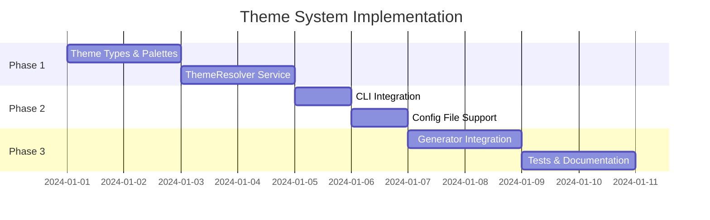

# Architecture Decision Records (ADRs)

## ADR Index

| ADR | Title | Status | Author |
|-----|-------|--------|--------|
| [ADR-001](./ADR-001-mermaid-theme-system.md) | Mermaid Theme System | 🟡 Proposed | ADR Architect Agent |

## Supporting Documents

| Document | Description | Status |
|----------|-------------|--------|
| [DDD Model](./DDD-theme-system.md) | Domain-Driven Design model with TypeScript interfaces | 🟡 In Progress |
| [Architecture](./ARCHITECTURE-theme-system.md) | Component diagrams and integration points | 🟡 In Progress |
| [Security Review](./SECURITY-theme-system.md) | Security considerations and mitigations | 🟡 In Progress |
| [Theme Examples](../agent-architecture/examples/theme-examples.md) | Visual examples of all 6 themes | ✅ Complete |

## Theme System Overview

### Problem Statement

Current AgentScope Mermaid diagrams use hardcoded light-mode colors:
- `fill:#e1f5fe` (light blue) with dark text
- Unreadable in dark mode (light backgrounds + white text)
- No accessibility options for colorblind users

### Proposed Solution

Implement a theme system with:
- 6 predefined themes (light, dark, high-contrast × 2, colorblind × 2)
- CLI flag: `--theme <name>`
- Config file: `agentscope.config.json`
- Mermaid `%%{init: {...}}%%` directive embedding

### Scope

```
┌─────────────────────────────────────────────────────────────────┐
│                     Theme System Scope                          │
├─────────────────────────────────────────────────────────────────┤
│  ✅ In Scope                    │  ❌ Out of Scope              │
│  ─────────────                  │  ──────────────               │
│  • 6 predefined themes          │  • Custom theme builder UI    │
│  • CLI --theme flag             │  • Runtime theme switching    │
│  • Config file support          │  • Browser-based preview      │
│  • Mermaid init directives      │  • Theme marketplace          │
│  • classDef color palettes      │  • SVG export theming         │
│  • GitHub/VS Code support       │  • PDF export theming         │
│  • Colorblind accessibility     │  • Animation/transition       │
│  • High contrast modes          │  • User preference storage    │
└─────────────────────────────────────────────────────────────────┘
```

### Implementation Phases



### Agents Involved in Planning

| Agent | Role | Output |
|-------|------|--------|
| 🔍 Researcher | Color palette research | Accessibility standards, Okabe-Ito palette |
| 📋 ADR Architect | Architecture Decision Record | ADR-001 document |
| 🏛️ DDD Domain Expert | Domain modeling | TypeScript interfaces, bounded contexts |
| 🔒 Security Architect | Security review | Input validation, injection prevention |
| 🏗️ System Architect | System design | Component diagrams, integration points |

### Quick Links

- [Theme Examples (Visual)](../agent-architecture/examples/theme-examples.md)
- [Multi-File Diagram Plan](../agent-architecture/examples/PLAN-multi-file-diagrams.md)
- [Dense Table Examples](../agent-architecture/examples/comparison-tables-example.md)

---

## ADR Template

For future ADRs, use this template:

```markdown
# ADR-XXX: Title

## Status
Proposed | Accepted | Deprecated | Superseded

## Context
What is the issue that we're seeing that motivates this decision?

## Decision
What is the change that we're proposing and/or doing?

## Consequences
What becomes easier or harder because of this change?
```

---

*Generated by AgentScope ADR System*
