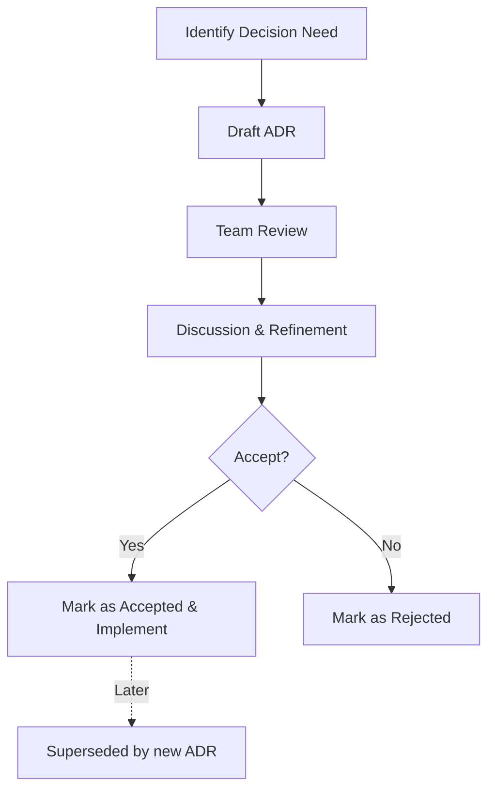

# Architecture Decision Records (ADRs)

## v1.2 DevContainer Architecture (NEW)

AgentScope v1.2 introduces comprehensive DevContainer scanning and documentation capabilities. **Start here** for the complete architecture overview:

📋 **[Summary: v1.2 DevContainer Architecture](./SUMMARY-v1.2-devcontainer-architecture.md)** ← **Read this first**

### Core v1.2 Documents

| Document | Purpose | Audience |
|----------|---------|----------|
| [DDD-002: DevContainer Domain Model](./DDD-002-devcontainer-domain.md) | 5 bounded contexts, 4 aggregates, complete domain model | Architects, Developers |
| [ADR-008: DevContainer Scanning System](./ADR-008-devcontainer-scanning.md) | 10 architectural decisions, implementation plan | Tech leads, Implementers |
| [ADR-009: Lifecycle Hooks Integration](./ADR-009-devcontainer-lifecycle-hooks.md) | Event-driven lifecycle integration with agent system | Integration engineers |
| [DevContainer Implementation Example](../../examples/devcontainer-implementation-example.md) | Practical code examples and usage patterns | Developers, Contributors |

**Key Features:**
- ✅ Parse and validate `.devcontainer/devcontainer.json`
- ✅ Security scanning (credential exposure, vulnerabilities)
- ✅ Feature dependency graph analysis
- ✅ Automated documentation generation
- ✅ Lifecycle hook integration with agent system

---

## Active ADRs

| ID | Title | Status | Date | Domain |
|----|-------|--------|------|--------|
| [ADR-001](./ADR-001-mermaid-theme-system.md) | Mermaid Theme System | Proposed | 2026-01-22 | Theme System |
| [ADR-002](./ADR-002-example-style-generators.md) | Example-Style Generators | Proposed | 2026-01-22 | Documentation |
| [ADR-003](./ADR-003-settings-scanner.md) | Settings Scanner Enhancement | Proposed | 2026-01-22 | Configuration |
| [ADR-004](./ADR-004-permission-parser.md) | Permission Parser | Proposed | 2026-01-22 | Security |
| [ADR-005](./ADR-005-plugin-parser.md) | Plugin Parser | Proposed | 2026-01-22 | Extensibility |
| [ADR-006](./ADR-006-hook-parser.md) | Hook Parser Enhancement | Proposed | 2026-01-22 | Lifecycle |
| [ADR-007](./ADR-007-export-import.md) | Export/Import System | Proposed | 2026-01-22 | Portability |
| **[ADR-008](./ADR-008-devcontainer-scanning.md)** | **DevContainer Scanning & Documentation** | **Proposed** | **2026-01-25** | **v1.2 Core** |
| **[ADR-009](./ADR-009-devcontainer-lifecycle-hooks.md)** | **DevContainer Lifecycle Hooks Integration** | **Proposed** | **2026-01-25** | **v1.2 Core** |

---

## Domain-Driven Design (DDD) Documents

| ID | Title | Status | Date | Version |
|----|-------|--------|------|---------|
| [DDD-001](./DDD-001-generator-domains.md) | Generator Enhancement Domain Model | Proposed | 2026-01-22 | v1.1 |
| **[DDD-002](./DDD-002-devcontainer-domain.md)** | **DevContainer Scanning & Documentation Domain Model** | **Proposed** | **2026-01-25** | **v1.2** |

---

## Supporting Architecture Documents

| Document | Description | Status |
|----------|-------------|--------|
| [Architecture: Theme System](./ARCHITECTURE-theme-system.md) | Theme system component architecture | Proposed |
| [DDD: Theme System](./DDD-theme-system.md) | Theme system domain model | Proposed |
| [Security: Theme System](./SECURITY-theme-system.md) | Theme security review | Proposed |
| [Design: Security Hooks](./DESIGN-001-security-hooks.md) | Security hooks design | Proposed |
| [Spec: Parser Enhancement](./SPEC-001-parser-enhancement.md) | Parser enhancement specification | Proposed |

---

## Document Types

This directory contains several types of architecture documents:

### 1. Architecture Decision Records (ADRs)
**Purpose:** Document key architectural decisions with context, alternatives, and consequences.

**Format:**
```markdown
# ADR-XXX: Title

## Status
Proposed | Accepted | Deprecated | Superseded

## Context
What problem are we solving?

## Decision
What are we doing?

## Consequences
What becomes easier or harder?
```

**When to Create:** When making decisions that:
- Affect system structure or component boundaries
- Impact performance, security, or maintainability
- Introduce new technologies or patterns
- Change user-facing behavior

### 2. Domain-Driven Design (DDD) Documents
**Purpose:** Define bounded contexts, aggregates, value objects, entities, and domain events.

**Key Sections:**
- Strategic Design (bounded contexts, context maps)
- Tactical Design (aggregates, entities, value objects)
- Ubiquitous Language
- Anti-Corruption Layers
- Domain Events

**When to Create:** When:
- Introducing new domain areas
- Refactoring existing domains
- Defining clear module boundaries
- Establishing team vocabulary

### 3. Architecture Documents (ARCHITECTURE-*)
**Purpose:** Component diagrams, system architecture, integration points.

### 4. Security Documents (SECURITY-*)
**Purpose:** Security reviews, threat models, mitigation strategies.

### 5. Design Documents (DESIGN-*)
**Purpose:** Detailed design specifications for specific features.

### 6. Specification Documents (SPEC-*)
**Purpose:** Formal specifications and requirements.

---

## ADR Decision Process



**Roles:**
- **Proposer:** Drafts the ADR
- **Reviewers:** Technical leads, domain experts
- **Deciders:** Architecture team, tech leads
- **Informed:** All contributors

---

## Quick Reference

### v1.2 DevContainer
- [Summary](./SUMMARY-v1.2-devcontainer-architecture.md) - Start here
- [Domain Model](./DDD-002-devcontainer-domain.md) - Bounded contexts & aggregates
- [Scanning ADR](./ADR-008-devcontainer-scanning.md) - Core decisions
- [Lifecycle ADR](./ADR-009-devcontainer-lifecycle-hooks.md) - Integration
- [Examples](../../examples/devcontainer-implementation-example.md) - Code samples

### v1.1 Theme System
- [ADR-001](./ADR-001-mermaid-theme-system.md) - Theme system decisions
- [DDD-001](./DDD-001-generator-domains.md) - Generator domain model
- [Theme Examples](../../examples/theme-examples.md) - Visual examples

---

## Contributing

### Creating a New ADR

1. **Choose ADR Number:** Find the next available ADR number
2. **Copy Template:** Use the template below
3. **Draft:** Write the ADR with context, decision, and consequences
4. **Review:** Request review from architecture team
5. **Merge:** After approval, merge with status "Accepted"

### ADR Template

```markdown
# ADR-XXX: Title

## Status

**Proposed**

| Field | Value |
|-------|-------|
| Date | YYYY-MM-DD |
| Author | Your Name |
| Deciders | Architecture Team |
| Consulted | Domain Experts |
| Informed | All Contributors |

---

## Context

### Problem Statement

What problem are we solving? What is the current state?

### Goals

What do we want to achieve?

---

## Decision

### Overview

What is the high-level decision?

### Detailed Design

How will this work?

---

## Consequences

### Positive

✅ What becomes easier?

### Negative

⚠️ What becomes harder?

### Mitigation Strategies

How do we address the negatives?

---

## Alternatives Considered

### Alternative 1: Name

**Pros:**
- Advantage 1

**Cons:**
- Disadvantage 1

**Decision:** ❌ Rejected - why?

---

## References

- Related ADRs
- External documentation
```

---

## Status Legend

- 🟡 **Proposed:** Under review
- 🟢 **Accepted:** Approved and being implemented
- 🔵 **Implemented:** Complete
- 🔴 **Deprecated:** No longer recommended
- ⚪ **Superseded:** Replaced by another ADR

---

*Last Updated: 2026-01-25*
*Document Version: 2.0*
