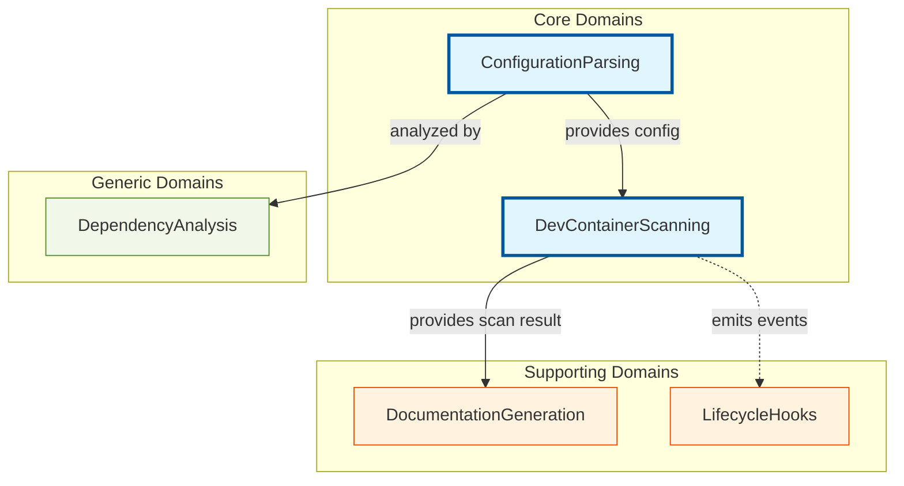
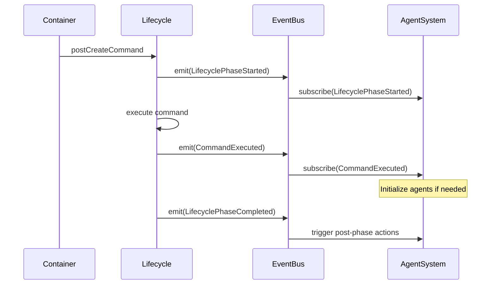
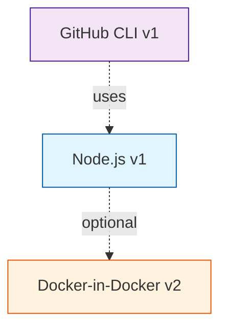

# AgentScope v1.2 DevContainer Architecture Summary

**Version:** 1.2.0
**Date:** 2026-01-25
**Status:** Proposed
**Architecture Style:** Domain-Driven Design (DDD)

---

## Executive Summary

AgentScope v1.2 introduces comprehensive DevContainer scanning, analysis, and documentation capabilities following Domain-Driven Design principles. This architecture enables:

- **Automated DevContainer Analysis**: Parse and validate `.devcontainer/devcontainer.json` configurations
- **Security Scanning**: Detect security issues, credential exposure, and vulnerabilities
- **Feature Dependency Analysis**: Build dependency graphs and detect circular dependencies
- **Documentation Generation**: Automatically generate comprehensive DevContainer documentation
- **Lifecycle Hook Integration**: Integrate container lifecycle with agent initialization

---

## Architecture Documents

### Core Documentation

| Document | Purpose | Key Decisions |
|----------|---------|---------------|
| [DDD-002: DevContainer Domain Model](./DDD-002-devcontainer-domain.md) | Complete domain model with bounded contexts, aggregates, value objects, entities, and domain events | 5 bounded contexts, 4 aggregate roots, ubiquitous language |
| [ADR-008: DevContainer Scanning System](./ADR-008-devcontainer-scanning.md) | Architectural decisions for scanning and documentation | 10 architectural decisions, implementation plan, success metrics |
| [ADR-009: Lifecycle Hooks Integration](./ADR-009-devcontainer-lifecycle-hooks.md) | Lifecycle command execution and agent system integration | Event-driven integration, retry logic, observability |

### Examples & Guides

| Document | Purpose | Audience |
|----------|---------|----------|
| [DevContainer Implementation Example](../../examples/devcontainer-implementation-example.md) | Practical code examples and usage patterns | Developers, Contributors |

---

## Domain Model Overview

### Bounded Contexts



### Context Relationships

| Upstream | Downstream | Pattern | Integration |
|----------|------------|---------|-------------|
| **ConfigurationParsing** | DevContainerScanning | Open Host Service | Exposes `DevContainerConfig` API |
| **DevContainerScanning** | DocumentationGeneration | Customer-Supplier | Provides `ScanResult` |
| **DevContainerScanning** | LifecycleHooks | Published Language | Emits domain events |
| ConfigurationParsing | DependencyAnalysis | Anti-Corruption Layer | Graph adapter |

---

## Key Architectural Decisions

### AD-1: Domain-Driven Design with Bounded Contexts

**Decision:** Use DDD with 5 bounded contexts for clear separation of concerns.

**Benefits:**
- Clear module boundaries
- Independent evolution
- Testable in isolation
- Aligned with business domains

**Bounded Contexts:**
1. **ConfigurationParsing** (Core): Parse devcontainer.json, validate schema
2. **DevContainerScanning** (Core): Analyze features, detect security issues
3. **DocumentationGeneration** (Supporting): Generate docs and diagrams
4. **LifecycleHooks** (Supporting): Execute and monitor lifecycle commands
5. **DependencyAnalysis** (Generic): Build dependency graphs

---

### AD-2: Aggregate Roots as Consistency Boundaries

**Decision:** Define 4 aggregate roots with explicit invariants.

| Aggregate | Context | Responsibility | Key Invariant |
|-----------|---------|----------------|---------------|
| `DevContainerConfig` | ConfigurationParsing | Configuration data | Must have image XOR build |
| `ScanResult` | DevContainerScanning | Scan output | Metrics must match config |
| `DevContainerDocument` | DocumentationGeneration | Generated docs | Links must be valid |
| `LifecycleExecution` | LifecycleHooks | Command execution | Commands execute in order |

**Example Invariant Enforcement:**

```typescript
class DevContainerConfig {
  constructor(
    readonly image?: string,
    readonly build?: BuildConfiguration
  ) {
    // Invariant: Must have image XOR build
    if (!image && !build) {
      throw new InvariantViolation('Must provide image or build');
    }
    if (image && build) {
      throw new InvariantViolation('Cannot provide both image and build');
    }
  }
}
```

---

### AD-3: Anti-Corruption Layers for External Dependencies

**Decision:** Use ACLs to protect domain from external schema changes.

```typescript
// External DevContainer schema (VS Code spec)
interface DevContainerSchema {
  name?: string;
  image?: string;
  features?: Record<string, unknown>;
}

// Internal domain model
interface DevContainerConfig {
  readonly id: ConfigurationId;
  readonly name?: string;
  readonly image?: string;
  readonly features: Feature[];
}

// ACL: Adapter
class DevContainerSchemaAdapter {
  toDomain(external: DevContainerSchema): DevContainerConfig {
    return {
      id: ConfigurationId.generate(),
      name: external.name,
      image: external.image,
      features: this.parseFeatures(external.features)
    };
  }
}
```

**Protected External Dependencies:**
- DevContainer JSON schema
- File system operations
- Command execution
- Diagram renderers (Mermaid, Graphviz)

---

### AD-4: Event-Driven Integration with Agent System

**Decision:** Use domain events for loose coupling between container lifecycle and agent system.

**Event Flow:**



**Key Events:**
- `LifecyclePhaseStarted`: When lifecycle phase begins
- `CommandExecuted`: When command completes successfully
- `CommandExecutionFailed`: When command fails
- `LifecyclePhaseCompleted`: When phase finishes

---

### AD-5: Security Scanning as First-Class Concern

**Decision:** Integrate security scanning into core scanning flow (not optional).

**Security Checks:**

| Category | Detection | Severity |
|----------|-----------|----------|
| Credential Exposure | Detect API keys, tokens in env vars | High |
| Insecure Features | Flag features with known vulnerabilities | Medium-High |
| Privilege Escalation | Detect `privileged: true`, unsafe capabilities | Critical |
| Network Exposure | Warn on excessive port forwarding | Low-Medium |
| Deprecated Features | Identify features with newer replacements | Low |

**Example Detection:**

```typescript
class SecurityScanner {
  detectCredentialExposure(env: EnvironmentVariables): SecurityIssue[] {
    const issues: SecurityIssue[] = [];
    for (const [key, value] of env.variables) {
      if (/^(sk-|ghp_|gho_|AKIA|AIza)/.test(value)) {
        issues.push({
          severity: 'high',
          category: 'credential-exposure',
          message: `Environment variable "${key}" contains a secret`,
          remediation: 'Use GitHub Codespace secrets or .env files'
        });
      }
    }
    return issues;
  }
}
```

---

### AD-6: Retry Logic with Exponential Backoff

**Decision:** Implement retry for transient failures with exponential backoff.

**Retry Policy:**
```typescript
const retryPolicy: RetryPolicy = {
  maxRetries: 3,
  initialDelayMs: 1000,      // 1 second
  maxDelayMs: 30000,         // 30 seconds max
  backoffMultiplier: 2,      // Double each time
  retryableExitCodes: [1, 137, 143]
};
```

**Retry Sequence:** 1s → 2s → 4s → fail

---

### AD-7: Feature Dependency Graph Analysis

**Decision:** Build dependency graph for features and analyze relationships.

**Graph Structure:**



**Analysis Capabilities:**
- Detect circular dependencies
- Calculate install order (topological sort)
- Identify unused features
- Find optimization opportunities

---

## Ubiquitous Language

### Core Terms

| Term | Definition | Context |
|------|------------|---------|
| **DevContainer** | A containerized development environment configuration | ConfigurationParsing |
| **Feature** | A reusable, installable component that adds capabilities | ConfigurationParsing |
| **Scan Result** | The output of analyzing a DevContainer configuration | DevContainerScanning |
| **Lifecycle Command** | A command executed at a specific container phase | LifecycleHooks |
| **Configuration Metrics** | Quantitative measurements of config complexity/quality | DevContainerScanning |

### Configuration Terms

| Term | Definition |
|------|------------|
| **Feature URI** | Unique identifier (e.g., `ghcr.io/devcontainers/features/node:1`) |
| **Feature Version** | Semantic version specifying exact feature release |
| **Feature Options** | Key-value configuration parameters for a feature |
| **Feature Provider** | The source/publisher of a feature (GitHub Container Registry) |
| **Customization** | Environment-specific configuration (VS Code settings) |

### Lifecycle Terms

| Term | Definition |
|------|------------|
| **Lifecycle Phase** | Specific stage in container initialization (postCreate, postStart) |
| **Command Execution** | The running instance of a lifecycle command |
| **Execution Status** | Current state (pending, running, completed, failed) |
| **Execution Context** | Environment and metadata for command execution |

---

## Implementation Structure

### Directory Layout

```
src/core/
  model/
    devcontainer/
      types.ts                       # Domain types
      aggregates.ts                  # Aggregate roots
      value-objects.ts               # Value objects
      events.ts                      # Domain events

  scanners/
    devcontainer/
      devcontainer-scanner.ts        # Main scanner service
      feature-extractor.ts           # Feature analysis
      customization-parser.ts        # VS Code customization parsing
      lifecycle-detector.ts          # Command lifecycle detection
      validators/
        schema-validator.ts          # JSON schema validation
        security-validator.ts        # Security checks

  parsers/
    devcontainer/
      json-parser.ts                 # JSON parsing with validation
      schema-mapper.ts               # Map to internal types
      version-detector.ts            # Detect schema version
      migration/
        v1-to-v2.ts                  # Schema migration strategies

  generators/
    devcontainer/
      doc-generator.ts               # Main documentation generator
      feature-diagram.ts             # Feature relationship diagrams
      summary-generator.ts           # Configuration summaries
      comparison-generator.ts        # Multi-config comparisons
      templates/
        readme-template.md
        architecture-template.md

  hooks/
    devcontainer/
      lifecycle-orchestrator.ts      # Main orchestration service
      command-executor.ts            # Command execution
      event-emitter.ts               # Domain event publishing
      handlers/
        post-create-handler.ts
        post-start-handler.ts
        post-attach-handler.ts

  analysis/
    devcontainer/
      dependency-analyzer.ts         # Graph-based analysis
      circular-detector.ts           # Circular dependency detection
      security-scanner.ts            # Vulnerability scanning
      optimizer.ts                   # Configuration optimization

  repositories/
    devcontainer/
      config-repository.ts           # Configuration persistence
      scan-result-repository.ts      # Scan result storage
      document-repository.ts         # Document management
```

---

## CLI Commands

### New Commands in v1.2

```bash
# Scan DevContainer configuration
agentscope scan-devcontainer [path]

# Generate documentation
agentscope devcontainer-docs [path] --output docs/

# Compare multiple configurations
agentscope compare-devcontainers <path1> <path2> <path3>

# Validate security
agentscope validate-devcontainer [path] --security-only
```

### Usage Examples

**1. Basic Scan:**
```bash
$ agentscope scan-devcontainer .devcontainer

✓ DevContainer Configuration Scanned
  Name: Claude Flow Dev
  Features: 3
  Security: 78/100 (Good)
  Complexity: 42/100 (Medium)
```

**2. Generate Documentation:**
```bash
$ agentscope devcontainer-docs .devcontainer --output docs/

✓ Generated documentation:
  ├── docs/devcontainer/README.md
  ├── docs/devcontainer/features.md
  └── docs/devcontainer/diagrams/
      ├── feature-dependencies.mermaid
      └── lifecycle-flow.mermaid
```

**3. Compare Configurations:**
```bash
$ agentscope compare-devcontainers project-a project-b

Common Features:
  ✓ node (both use lts)
  ✓ docker-in-docker (both use v2)

Differences:
  ⚠️ project-a has github-cli, project-b missing
```

---

## Success Metrics

| Metric | Target | Measurement |
|--------|--------|-------------|
| **Adoption** | 30% of users scan DevContainers | Analytics on CLI usage |
| **Security Issues Detected** | 5+ issues per 100 scans | Aggregated scan results |
| **Documentation Quality** | 80%+ user satisfaction | User survey |
| **Performance** | <500ms for typical scan | Benchmark suite |
| **Test Coverage** | 85%+ across all contexts | Coverage reports |

---

## Implementation Timeline

### Phase 1: Core Parsing (Week 1-2)
- [ ] ConfigurationParsing bounded context
- [ ] JSON schema validation
- [ ] DevContainerSchemaAdapter (ACL)
- [ ] Feature URI parsing
- [ ] Unit tests (90%+ coverage)

### Phase 2: Scanning & Analysis (Week 3-4)
- [ ] DevContainerScanning bounded context
- [ ] Feature extractor
- [ ] Security scanner
- [ ] Dependency graph builder
- [ ] Integration tests

### Phase 3: Documentation Generation (Week 5-6)
- [ ] DocumentationGeneration bounded context
- [ ] Feature diagram generator
- [ ] Summary generator
- [ ] Templates (README, architecture)
- [ ] E2E tests

### Phase 4: CLI Integration (Week 7)
- [ ] CLI commands (`scan-devcontainer`, `devcontainer-docs`, `compare`)
- [ ] Output formatting
- [ ] Error handling
- [ ] Help documentation

### Phase 5: Lifecycle Hooks (Week 8)
- [ ] LifecycleHooks bounded context
- [ ] Event emitter
- [ ] Command executor
- [ ] Integration with agent hooks
- [ ] Optional feature flag

### Phase 6: Polish & Documentation (Week 9-10)
- [ ] Comprehensive README
- [ ] API documentation
- [ ] Usage examples
- [ ] Video tutorial
- [ ] Blog post announcement

**Total Duration:** 10 weeks
**Release Target:** v1.2.0

---

## Testing Strategy

| Context | Test Type | Focus | Coverage Target |
|---------|-----------|-------|-----------------|
| ConfigurationParsing | Unit | Parser correctness, schema validation | 90%+ |
| DevContainerScanning | Unit + Integration | Feature extraction, security scanning | 85%+ |
| DocumentationGeneration | Unit + E2E | Document structure, diagram rendering | 80%+ |
| LifecycleHooks | Integration | Command execution, event emission | 75%+ |
| DependencyAnalysis | Unit | Graph algorithms, circular detection | 90%+ |

### Test Scenarios

```typescript
// Unit test example
describe('DevContainerParser', () => {
  it('should enforce image XOR build invariant', async () => {
    const json = `{
      "image": "node:20",
      "build": { "dockerfile": "Dockerfile" }
    }`;
    const result = await parser.parse(json);
    expect(result.isErr()).toBe(true);
    expect(result.unwrapErr().code).toBe('INVARIANT_VIOLATION');
  });
});

// Integration test example
describe('DevContainerScanner', () => {
  it('should detect credential exposure', async () => {
    const config = createTestConfig({
      containerEnv: { API_KEY: 'sk-1234567890' }
    });
    const result = await scanner.scan('/test/path');
    expect(result.securityIssues).toContainEqual(
      expect.objectContaining({
        category: 'credential-exposure',
        severity: 'high'
      })
    );
  });
});
```

---

## Future Enhancements (v1.3+)

### Dockerfile Analysis
Extend scanning to analyze `Dockerfile` when using `build` instead of `image`.

### Feature Recommendation Engine
Suggest features based on:
- Project type (Node.js → suggest node feature)
- Existing setup (detect missing common tools)
- Team standards (organization-wide policies)

### Visual Configuration Editor
Web UI for editing devcontainer.json with:
- Live preview
- Feature catalog browser
- Guided setup wizard

### CI/CD Integration
GitHub Action to:
- Scan DevContainers in PRs
- Block merge if critical security issues found
- Comment with analysis results

### Container Registry Integration
Fetch feature metadata from:
- GitHub Container Registry
- Docker Hub
- Custom registries

---

## Risk Assessment

### Technical Risks

| Risk | Probability | Impact | Mitigation |
|------|-------------|--------|------------|
| DevContainer spec changes | Medium | High | ACL protects domain, version detection |
| Performance issues with large configs | Low | Medium | Caching, lazy loading, background scanning |
| External tool dependencies | Medium | Medium | Graceful degradation, offline mode |
| Event bus overhead | Low | Low | In-memory implementation, minimal latency |

### Organizational Risks

| Risk | Probability | Impact | Mitigation |
|------|-------------|--------|------------|
| Low adoption | Medium | High | Clear documentation, examples, blog posts |
| Contributor complexity | Medium | Medium | Comprehensive onboarding, DDD training |
| Breaking changes | Low | Medium | Semantic versioning, migration guides |

---

## Related Documentation

### Architecture Documents
- [DDD-002: DevContainer Domain Model](./DDD-002-devcontainer-domain.md)
- [ADR-008: DevContainer Scanning System](./ADR-008-devcontainer-scanning.md)
- [ADR-009: DevContainer Lifecycle Hooks](./ADR-009-devcontainer-lifecycle-hooks.md)
- [DDD-001: Generator Domains](./DDD-001-generator-domains.md)
- [ADR-001: Mermaid Theme System](./ADR-001-mermaid-theme-system.md)

### Examples & Guides
- [DevContainer Implementation Example](../../examples/devcontainer-implementation-example.md)
- [README Example](../../examples/README-example.md)

### External References
- [DevContainer Specification](https://containers.dev/implementors/json_reference/)
- [DevContainer Features](https://containers.dev/features)
- [VS Code DevContainer Extension](https://code.visualstudio.com/docs/devcontainers/containers)
- [Domain-Driven Design (Evans, 2003)](https://www.domainlanguage.com/ddd/)

---

## Approval & Sign-off

| Role | Name | Date | Status |
|------|------|------|--------|
| **Architecture Lead** | TBD | - | Pending |
| **Tech Lead** | TBD | - | Pending |
| **Security Lead** | TBD | - | Pending |
| **Product Owner** | TBD | - | Pending |

---

## Revision History

| Version | Date | Author | Changes |
|---------|------|--------|---------|
| 1.0 | 2026-01-25 | V3 DDD Domain Expert | Initial architecture proposal |

---

*Generated by AgentScope Architecture Team*
*Last Updated: 2026-01-25*
*Domain Version: v1.2*
