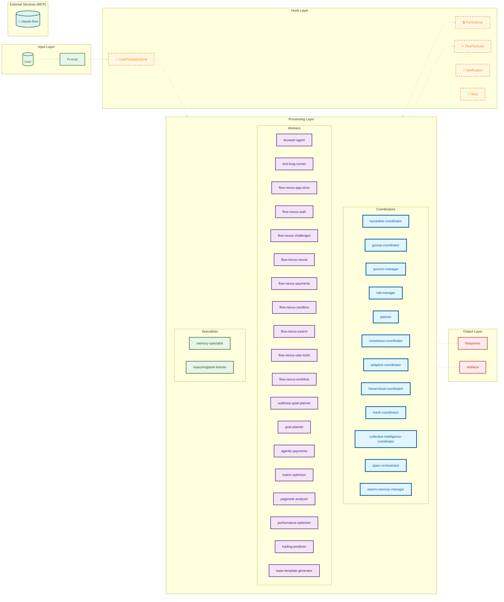

# Agent Architecture Documentation

> Generated by AgentScope v0.1.0
> Scanned: 2026-01-22T19:12:34.419Z

## Table of Contents

- [Overview](#overview)
- [Agents](#agents)
- [Skills](#skills)
- [Hooks](#hooks)
- [Commands](#commands)
- [MCP Servers](#mcp-servers)
- [Diagrams](#diagrams)
- [Scan Metadata](#scan-metadata)

## Overview

| Component | Count |
|-----------|-------|
| Agents | 99 |
| Skills | 30 |
| Hooks | 11 |
| Commands | 88 |
| MCP Servers | 1 |

### Agent Types

- **Coordinator**: 12
- **Specialist**: 2
- **Worker**: 19
- **"analysis"**: 2
- **Code-analyzer**: 1
- **"architecture"**: 2
- **Synchronizer**: 1
- **Analyst**: 3
- **Security**: 8
- **Developer**: 2
- **Validator**: 3
- **"data"**: 2
- **"development"**: 2
- **"devops"**: 2
- **"documentation"**: 2
- **Development**: 8
- **Coordination**: 8
- **Architecture**: 1
- **Automation**: 2
- **Agent**: 5
- **Adaptive-learning**: 1
- **Architect**: 5
- **"specialized"**: 2
- **Orchestration**: 1
- **Analysis**: 1
- **Tester**: 1
- **Optimization**: 1

### MCP Server Status

- **Enabled**: 1
- **Disabled**: 0

## Agents

### "api-docs"

**Type**: `Custom`

"Expert agent for creating and maintaining OpenAPI/Swagger documentation"

**Defined in**: `.claude/agents/documentation/api-docs/docs-api-openapi.md`

---

### "api-docs"

**Type**: `Custom`

"Expert agent for creating OpenAPI documentation with pattern learning"

**Defined in**: `.claude/agents/documentation/docs-api-openapi.md`

---

### "backend-dev"

**Type**: `Custom`

"Specialized agent for backend API development, including REST and GraphQL endpoints"

**Defined in**: `.claude/agents/development/backend/dev-backend-api.md`

---

### "backend-dev"

**Type**: `Custom`

"Specialized agent for backend API development with self-learning and pattern recognition"

**Defined in**: `.claude/agents/development/dev-backend-api.md`

---

### "cicd-engineer"

**Type**: `Custom`

"Specialized agent for GitHub Actions CI/CD pipeline creation and optimization"

**Defined in**: `.claude/agents/devops/ci-cd/ops-cicd-github.md`

---

### "cicd-engineer"

**Type**: `Custom`

"Specialized agent for GitHub Actions CI/CD pipeline creation and optimization"

**Defined in**: `.claude/agents/devops/ops-cicd-github.md`

---

### "code-analyzer"

**Type**: `Custom`

"Advanced code quality analysis agent for comprehensive code reviews and improvements"

**Defined in**: `.claude/agents/analysis/analyze-code-quality.md`

---

### "code-analyzer"

**Type**: `Custom`

"Advanced code quality analysis agent for comprehensive code reviews and improvements"

**Defined in**: `.claude/agents/analysis/code-review/analyze-code-quality.md`

---

### "ml-developer"

**Type**: `Custom`

"ML developer with self-learning hyperparameter optimization and pattern recognition"

**Defined in**: `.claude/agents/data/data-ml-model.md`

---

### "ml-developer"

**Type**: `Custom`

"Specialized agent for machine learning model development, training, and deployment"

**Defined in**: `.claude/agents/data/ml/data-ml-model.md`

---

### "mobile-dev"

**Type**: `Custom`

"Expert agent for React Native mobile application development across iOS and Android"

**Defined in**: `.claude/agents/specialized/mobile/spec-mobile-react-native.md`

---

### "mobile-dev"

**Type**: `Custom`

"Expert agent for React Native mobile application development across iOS and Android"

**Defined in**: `.claude/agents/specialized/spec-mobile-react-native.md`

---

### "system-architect"

**Type**: `Custom`

"Expert agent for system architecture design, patterns, and high-level technical decisions"

**Defined in**: `.claude/agents/architecture/arch-system-design.md`

---

### "system-architect"

**Type**: `Custom`

"Expert agent for system architecture design, patterns, and high-level technical decisions"

**Defined in**: `.claude/agents/architecture/system-design/arch-system-design.md`

---

### adr-architect

**Type**: `Custom`

V3 Architecture Decision Record specialist that documents, tracks, and enforces architectural decisions with ReasoningBank integration for pattern learning

**Defined in**: `.claude/agents/v3/adr-architect.md`

---

### aidefence-guardian

**Type**: `Custom`

AI Defense Guardian agent that monitors all agent inputs/outputs for manipulation attempts using AIMDS

**Defined in**: `.claude/agents/v3/aidefence-guardian.md`

---

### analyst

**Type**: `Custom`

"Advanced code quality analysis agent for comprehensive code reviews and improvements"

**Defined in**: `.claude/agents/analysis/code-analyzer.md`

---

### architecture

**Type**: `Custom`

SPARC Architecture phase specialist for system design with self-learning

**Defined in**: `.claude/agents/sparc/architecture.md`

---

### Benchmark Suite

**Type**: `Custom`

Comprehensive performance benchmarking, regression detection and performance validation

**Defined in**: `.claude/agents/optimization/benchmark-suite.md`

---

### claims-authorizer

**Type**: `Custom`

V3 Claims-based authorization specialist implementing ADR-010 for fine-grained access control across swarm agents and MCP tools

**Defined in**: `.claude/agents/v3/claims-authorizer.md`

---

### code-review-swarm

**Type**: `Custom`

Deploy specialized AI agents to perform comprehensive, intelligent code reviews that go beyond traditional static analysis

**Defined in**: `.claude/agents/github/code-review-swarm.md`

---

### coder

**Type**: `Custom`

Implementation specialist for writing clean, efficient code with self-learning capabilities

**Defined in**: `.claude/agents/core/coder.md`

---

### crdt-synchronizer

**Type**: `Custom`

Implements Conflict-free Replicated Data Types for eventually consistent state synchronization

**Defined in**: `.claude/agents/consensus/crdt-synchronizer.md`

---

### ddd-domain-expert

**Type**: `Custom`

V3 Domain-Driven Design specialist for bounded context identification, aggregate design, domain modeling, and ubiquitous language enforcement

**Defined in**: `.claude/agents/v3/ddd-domain-expert.md`

---

### github-modes

**Type**: `Custom`

Comprehensive GitHub integration modes for workflow orchestration, PR management, and repository coordination with batch optimization

**Defined in**: `.claude/agents/github/github-modes.md`

---

### injection-analyst

**Type**: `Custom`

Deep analysis specialist for prompt injection and jailbreak attempts with pattern learning

**Defined in**: `.claude/agents/v3/injection-analyst.md`

---

### issue-tracker

**Type**: `Custom`

Intelligent issue management and project coordination with automated tracking, progress monitoring, and team coordination

**Defined in**: `.claude/agents/github/issue-tracker.md`

---

### Load Balancing Coordinator

**Type**: `Custom`

Dynamic task distribution, work-stealing algorithms and adaptive load balancing

**Defined in**: `.claude/agents/optimization/load-balancer.md`

---

### memory-coordinator

**Type**: `Custom`

Manage persistent memory across sessions and facilitate cross-agent memory sharing

**Defined in**: `.claude/agents/templates/memory-coordinator.md`

---

### multi-repo-swarm

**Type**: `Custom`

Cross-repository swarm orchestration for organization-wide automation and intelligent collaboration

**Defined in**: `.claude/agents/github/multi-repo-swarm.md`

---

### perf-analyzer

**Type**: `Custom`

Performance bottleneck analyzer for identifying and resolving workflow inefficiencies

**Defined in**: `.claude/agents/templates/performance-analyzer.md`

---

### Performance Monitor

**Type**: `Custom`

Real-time metrics collection, bottleneck analysis, SLA monitoring and anomaly detection

**Defined in**: `.claude/agents/optimization/performance-monitor.md`

---

### performance-benchmarker

**Type**: `Custom`

Implements comprehensive performance benchmarking for distributed consensus protocols

**Defined in**: `.claude/agents/consensus/performance-benchmarker.md`

---

### performance-engineer

**Type**: `Custom`

V3 Performance Engineering Agent specialized in Flash Attention optimization (2.49x-7.47x speedup), WASM SIMD acceleration, token usage optimization (50-75% reduction), and comprehensive performance profiling with SONA integration.

**Defined in**: `.claude/agents/v3/performance-engineer.md`

---

### pii-detector

**Type**: `Custom`

Specialized PII detection agent that scans code and data for sensitive information leaks

**Defined in**: `.claude/agents/v3/pii-detector.md`

---

### pr-manager

**Type**: `Custom`

Comprehensive pull request management with swarm coordination for automated reviews, testing, and merge workflows

**Defined in**: `.claude/agents/github/pr-manager.md`

---

### pr-manager

**Type**: `Custom`

Complete pull request lifecycle management and GitHub workflow coordination

**Defined in**: `.claude/agents/templates/github-pr-manager.md`

---

### production-validator

**Type**: `Custom`

Production validation specialist ensuring applications are fully implemented and deployment-ready

**Defined in**: `.claude/agents/testing/production-validator.md`

---

### project-board-sync

**Type**: `Custom`

Synchronize AI swarms with GitHub Projects for visual task management, progress tracking, and team coordination

**Defined in**: `.claude/agents/github/project-board-sync.md`

---

### pseudocode

**Type**: `Custom`

SPARC Pseudocode phase specialist for algorithm design with self-learning

**Defined in**: `.claude/agents/sparc/pseudocode.md`

---

### refinement

**Type**: `Custom`

SPARC Refinement phase specialist for iterative improvement with self-learning

**Defined in**: `.claude/agents/sparc/refinement.md`

---

### release-manager

**Type**: `Custom`

Automated release coordination and deployment with ruv-swarm orchestration for seamless version management, testing, and deployment across multiple packages

**Defined in**: `.claude/agents/github/release-manager.md`

---

### release-swarm

**Type**: `Custom`

Orchestrate complex software releases using AI swarms that handle everything from changelog generation to multi-platform deployment

**Defined in**: `.claude/agents/github/release-swarm.md`

---

### repo-architect

**Type**: `Custom`

Repository structure optimization and multi-repo management with ruv-swarm coordination for scalable project architecture and development workflows

**Defined in**: `.claude/agents/github/repo-architect.md`

---

### researcher

**Type**: `Custom`

Deep research and information gathering specialist with AI-enhanced pattern recognition

**Defined in**: `.claude/agents/core/researcher.md`

---

### Resource Allocator

**Type**: `Custom`

Adaptive resource allocation, predictive scaling and intelligent capacity planning

**Defined in**: `.claude/agents/optimization/resource-allocator.md`

---

### reviewer

**Type**: `Custom`

Code review and quality assurance specialist with AI-powered pattern detection

**Defined in**: `.claude/agents/core/reviewer.md`

---

### security-architect

**Type**: `Custom`

V3 Security Architecture specialist with ReasoningBank learning, HNSW threat pattern search, and zero-trust design capabilities

**Defined in**: `.claude/agents/v3/security-architect.md`

---

### security-architect-aidefence

**Type**: `Custom`

|

**Defined in**: `.claude/agents/v3/security-architect-aidefence.md`

---

### security-auditor

**Type**: `Custom`

Advanced security auditor with self-learning vulnerability detection, CVE database search, and compliance auditing

**Defined in**: `.claude/agents/v3/security-auditor.md`

---

### security-manager

**Type**: `Custom`

Implements comprehensive security mechanisms for distributed consensus protocols

**Defined in**: `.claude/agents/consensus/security-manager.md`

---

### smart-agent

**Type**: `Custom`

Intelligent agent coordination and dynamic spawning specialist

**Defined in**: `.claude/agents/templates/automation-smart-agent.md`

---

### sona-learning-optimizer

**Type**: `Custom`

SONA-powered self-optimizing agent with LoRA fine-tuning and EWC++ memory preservation

**Defined in**: `.claude/agents/sona/sona-learning-optimizer.md`

---

### sparc-coder

**Type**: `Custom`

Transform specifications into working code with TDD practices

**Defined in**: `.claude/agents/templates/implementer-sparc-coder.md`

---

### sparc-coord

**Type**: `Custom`

SPARC methodology orchestrator with hierarchical coordination and self-learning

**Defined in**: `.claude/agents/templates/sparc-coordinator.md`

---

### specification

**Type**: `Custom`

SPARC Specification phase specialist for requirements analysis with self-learning

**Defined in**: `.claude/agents/sparc/specification.md`

---

### swarm-init

**Type**: `Custom`

Swarm initialization and topology optimization specialist

**Defined in**: `.claude/agents/templates/coordinator-swarm-init.md`

---

### swarm-issue

**Type**: `Custom`

GitHub issue-based swarm coordination agent that transforms issues into intelligent multi-agent tasks with automatic decomposition and progress tracking

**Defined in**: `.claude/agents/github/swarm-issue.md`

---

### swarm-pr

**Type**: `Custom`

Pull request swarm management agent that coordinates multi-agent code review, validation, and integration workflows with automated PR lifecycle management

**Defined in**: `.claude/agents/github/swarm-pr.md`

---

### sync-coordinator

**Type**: `Custom`

Multi-repository synchronization coordinator that manages version alignment, dependency synchronization, and cross-package integration with intelligent swarm orchestration

**Defined in**: `.claude/agents/github/sync-coordinator.md`

---

### task-orchestrator

**Type**: `Custom`

Central coordination agent for task decomposition, execution planning, and result synthesis

**Defined in**: `.claude/agents/templates/orchestrator-task.md`

---

### tdd-london-swarm

**Type**: `Custom`

TDD London School specialist for mock-driven development within swarm coordination

**Defined in**: `.claude/agents/testing/tdd-london-swarm.md`

---

### tester

**Type**: `Custom`

Comprehensive testing and quality assurance specialist with AI-powered test generation

**Defined in**: `.claude/agents/core/tester.md`

---

### Topology Optimizer

**Type**: `Custom`

Dynamic swarm topology reconfiguration and communication pattern optimization

**Defined in**: `.claude/agents/optimization/topology-optimizer.md`

---

### v3-integration-architect

**Type**: `Custom`

V3 deep agentic-flow@alpha integration specialist implementing ADR-001 for eliminating duplicate code and building claude-flow as a specialized extension

**Defined in**: `.claude/agents/v3/v3-integration-architect.md`

---

### workflow-automation

**Type**: `Custom`

GitHub Actions workflow automation agent that creates intelligent, self-organizing CI/CD pipelines with adaptive multi-agent coordination and automated optimization

**Defined in**: `.claude/agents/github/workflow-automation.md`

---

### adaptive-coordinator

**Type**: `Coordinator`

Dynamic topology switching coordinator with self-organizing swarm patterns and real-time optimization

**Defined in**: `.claude/agents/swarm/adaptive-coordinator.md`

---

### byzantine-coordinator

**Type**: `Coordinator`

Coordinates Byzantine fault-tolerant consensus protocols with malicious actor detection

**Defined in**: `.claude/agents/consensus/byzantine-coordinator.md`

---

### collective-intelligence-coordinator

**Type**: `Coordinator`

Hive-mind collective decision making with Byzantine fault-tolerant consensus, attention-based coordination, and emergent intelligence patterns

**Defined in**: `.claude/agents/v3/collective-intelligence-coordinator.md`

---

### consensus-coordinator

**Type**: `Coordinator`

Distributed consensus agent that uses sublinear solvers for fast agreement protocols in multi-agent systems. Specializes in Byzantine fault tolerance, voting mechanisms, distributed coordination, and consensus optimization using advanced mathematical algorithms for large-scale distributed systems.

**Defined in**: `.claude/agents/sublinear/consensus-coordinator.md`

---

### gossip-coordinator

**Type**: `Coordinator`

Coordinates gossip-based consensus protocols for scalable eventually consistent systems

**Defined in**: `.claude/agents/consensus/gossip-coordinator.md`

---

### hierarchical-coordinator

**Type**: `Coordinator`

Queen-led hierarchical swarm coordination with specialized worker delegation

**Defined in**: `.claude/agents/swarm/hierarchical-coordinator.md`

---

### mesh-coordinator

**Type**: `Coordinator`

Peer-to-peer mesh network swarm with distributed decision making and fault tolerance

**Defined in**: `.claude/agents/swarm/mesh-coordinator.md`

---

### planner

**Type**: `Coordinator`

Strategic planning and task orchestration agent with AI-powered resource optimization

**Defined in**: `.claude/agents/core/planner.md`

---

### quorum-manager

**Type**: `Coordinator`

Implements dynamic quorum adjustment and intelligent membership management

**Defined in**: `.claude/agents/consensus/quorum-manager.md`

---

### raft-manager

**Type**: `Coordinator`

Manages Raft consensus algorithm with leader election and log replication

**Defined in**: `.claude/agents/consensus/raft-manager.md`

---

### sparc-orchestrator

**Type**: `Coordinator`

V3 SPARC methodology orchestrator that coordinates Specification, Pseudocode, Architecture, Refinement, and Completion phases with ReasoningBank learning

**Defined in**: `.claude/agents/v3/sparc-orchestrator.md`

---

### swarm-memory-manager

**Type**: `Coordinator`

V3 distributed memory manager for cross-agent state synchronization, CRDT replication, and namespace coordination across the swarm

**Defined in**: `.claude/agents/v3/swarm-memory-manager.md`

---

### memory-specialist

**Type**: `Specialist`

V3 memory optimization specialist with HNSW indexing, hybrid backend management, vector quantization, and EWC++ for preventing catastrophic forgetting

**Defined in**: `.claude/agents/v3/memory-specialist.md`

---

### reasoningbank-learner

**Type**: `Specialist`

V3 ReasoningBank integration specialist for trajectory tracking, verdict judgment, pattern distillation, and experience replay using HNSW-indexed memory

**Defined in**: `.claude/agents/v3/reasoningbank-learner.md`

---

### agentic-payments

**Type**: `Worker`

Multi-agent payment authorization specialist for autonomous AI commerce with cryptographic verification and Byzantine consensus

**Defined in**: `.claude/agents/payments/agentic-payments.md`

---

### base-template-generator

**Type**: `Worker`

Use this agent when you need to create foundational templates, boilerplate code, or starter configurations for new projects, components, or features. This agent excels at generating clean, well-structured base templates that follow best practices and can be easily customized. Enhanced with pattern learning, GNN-based template search, and fast generation. Examples: <example>Context: User needs to start a new React component and wants a solid foundation. user: 'I need to create a new user profile component' assistant: 'I'll use the base-template-generator agent to create a comprehensive React component template with proper structure, TypeScript definitions, and styling setup.' <commentary>Since the user needs a foundational template for a new component, use the base-template-generator agent to create a well-structured starting point.</commentary></example> <example>Context: User is setting up a new API endpoint and needs a template. user: 'Can you help me set up a new REST API endpoint for user management?' assistant: 'I'll use the base-template-generator agent to create a complete API endpoint template with proper error handling, validation, and documentation structure.' <commentary>The user needs a foundational template for an API endpoint, so use the base-template-generator agent to provide a comprehensive starting point.</commentary></example>

**Defined in**: `.claude/agents/templates/base-template-generator.md`

---

### browser-agent

**Type**: `Worker`

name: browser-agent
description: Web automation specialist using agent-browser with AI-optimized snapshots
version: 1.0.0

**Defined in**: `.claude/agents/browser/browser-agent.yaml`

---

### flow-nexus-app-store

**Type**: `Worker`

Application marketplace and template management specialist. Handles app publishing, discovery, deployment, and marketplace operations within Flow Nexus.

**Defined in**: `.claude/agents/flow-nexus/app-store.md`

---

### flow-nexus-auth

**Type**: `Worker`

Flow Nexus authentication and user management specialist. Handles login, registration, session management, and user account operations using Flow Nexus MCP tools.

**Defined in**: `.claude/agents/flow-nexus/authentication.md`

---

### flow-nexus-challenges

**Type**: `Worker`

Coding challenges and gamification specialist. Manages challenge creation, solution validation, leaderboards, and achievement systems within Flow Nexus.

**Defined in**: `.claude/agents/flow-nexus/challenges.md`

---

### flow-nexus-neural

**Type**: `Worker`

Neural network training and deployment specialist. Manages distributed neural network training, inference, and model lifecycle using Flow Nexus cloud infrastructure.

**Defined in**: `.claude/agents/flow-nexus/neural-network.md`

---

### flow-nexus-payments

**Type**: `Worker`

Credit management and billing specialist. Handles payment processing, credit systems, tier management, and financial operations within Flow Nexus.

**Defined in**: `.claude/agents/flow-nexus/payments.md`

---

### flow-nexus-sandbox

**Type**: `Worker`

E2B sandbox deployment and management specialist. Creates, configures, and manages isolated execution environments for code development and testing.

**Defined in**: `.claude/agents/flow-nexus/sandbox.md`

---

### flow-nexus-swarm

**Type**: `Worker`

AI swarm orchestration and management specialist. Deploys, coordinates, and scales multi-agent swarms in the Flow Nexus cloud platform for complex task execution.

**Defined in**: `.claude/agents/flow-nexus/swarm.md`

---

### flow-nexus-user-tools

**Type**: `Worker`

User management and system utilities specialist. Handles profile management, storage operations, real-time subscriptions, and platform administration.

**Defined in**: `.claude/agents/flow-nexus/user-tools.md`

---

### flow-nexus-workflow

**Type**: `Worker`

Event-driven workflow automation specialist. Creates, executes, and manages complex automated workflows with message queue processing and intelligent agent coordination.

**Defined in**: `.claude/agents/flow-nexus/workflow.md`

---

### goal-planner

**Type**: `Worker`

"Goal-Oriented Action Planning (GOAP) specialist that dynamically creates intelligent plans to achieve complex objectives. Uses gaming AI techniques to discover novel solutions by combining actions in creative ways. Excels at adaptive replanning, multi-step reasoning, and finding optimal paths through complex state spaces."

**Defined in**: `.claude/agents/goal/goal-planner.md`

---

### matrix-optimizer

**Type**: `Worker`

Expert agent for matrix analysis and optimization using sublinear algorithms. Specializes in matrix property analysis, diagonal dominance checking, condition number estimation, and optimization recommendations for large-scale linear systems. Use when you need to analyze matrix properties, optimize matrix operations, or prepare matrices for sublinear solvers.

**Defined in**: `.claude/agents/sublinear/matrix-optimizer.md`

---

### pagerank-analyzer

**Type**: `Worker`

Expert agent for graph analysis and PageRank calculations using sublinear algorithms. Specializes in network optimization, influence analysis, swarm topology optimization, and large-scale graph computations. Use for social network analysis, web graph analysis, recommendation systems, and distributed system topology design.

**Defined in**: `.claude/agents/sublinear/pagerank-analyzer.md`

---

### performance-optimizer

**Type**: `Worker`

System performance optimization agent that identifies bottlenecks and optimizes resource allocation using sublinear algorithms. Specializes in computational performance analysis, system optimization, resource management, and efficiency maximization across distributed systems and cloud infrastructure.

**Defined in**: `.claude/agents/sublinear/performance-optimizer.md`

---

### sublinear-goal-planner

**Type**: `Worker`

"Goal-Oriented Action Planning (GOAP) specialist that dynamically creates intelligent plans to achieve complex objectives. Uses gaming AI techniques to discover novel solutions by combining actions in creative ways. Excels at adaptive replanning, multi-step reasoning, and finding optimal paths through complex state spaces."

**Defined in**: `.claude/agents/goal/agent.md`

---

### test-long-runner

**Type**: `Worker`

Test agent that can run for 30+ minutes on complex tasks

**Defined in**: `.claude/agents/custom/test-long-runner.md`

---

### trading-predictor

**Type**: `Worker`

Advanced financial trading agent that leverages temporal advantage calculations to predict and execute trades before market data arrives. Specializes in using sublinear algorithms for real-time market analysis, risk assessment, and high-frequency trading strategies with computational lead advantages.

**Defined in**: `.claude/agents/sublinear/trading-predictor.md`

---


## Skills

| Skill | Description | Triggers | Status |
|-------|-------------|----------|--------|
| **"AgentDB Advanced Features"** | "Master advanced AgentDB features including QUI... |  | Enabled |
| **"AgentDB Learning Plugins"** | "Create and train AI learning plugins with Agen... |  | Enabled |
| **"AgentDB Memory Patterns"** | "Implement persistent memory patterns for AI ag... |  | Enabled |
| **"AgentDB Performance Optimization"** | "Optimize AgentDB performance with quantization... |  | Enabled |
| **"AgentDB Vector Search"** | "Implement semantic vector search with AgentDB ... |  | Enabled |
| **browser** | Web browser automation with AI-optimized snapsh... |  | Enabled |
| **github-code-review** | Comprehensive GitHub code review with AI-powere... |  | Enabled |
| **github-multi-repo** | Multi-repository coordination, synchronization,... |  | Enabled |
| **github-project-management** | Comprehensive GitHub project management with sw... |  | Enabled |
| **github-release-management** | Comprehensive GitHub release orchestration with... |  | Enabled |
| **github-workflow-automation** | Advanced GitHub Actions workflow automation wit... |  | Enabled |
| **Hooks Automation** | Automated coordination, formatting, and learnin... |  | Enabled |
| **Pair Programming** | AI-assisted pair programming with multiple mode... |  | Enabled |
| **"ReasoningBank with AgentDB"** | "Implement ReasoningBank adaptive learning with... |  | Enabled |
| **"ReasoningBank Intelligence"** | "Implement adaptive learning with ReasoningBank... |  | Enabled |
| **"Skill Builder"** | "Create new Claude Code Skills with proper YAML... |  | Enabled |
| **sparc-methodology** | SPARC (Specification, Pseudocode, Architecture,... |  | Enabled |
| **stream-chain** | Stream-JSON chaining for multi-agent pipelines,... |  | Enabled |
| **swarm-advanced** | Advanced swarm orchestration patterns for resea... |  | Enabled |
| **"Swarm Orchestration"** | "Orchestrate multi-agent swarms with agentic-fl... |  | Enabled |
| **"V3 CLI Modernization"** | "CLI modernization and hooks system enhancement... |  | Enabled |
| **"V3 Core Implementation"** | "Core module implementation for claude-flow v3.... |  | Enabled |
| **"V3 DDD Architecture"** | "Domain-Driven Design architecture for claude-f... |  | Enabled |
| **"V3 Deep Integration"** | "Deep agentic-flow@alpha integration implementi... |  | Enabled |
| **"V3 MCP Optimization"** | "MCP server optimization and transport layer en... |  | Enabled |
| **"V3 Memory Unification"** | "Unify 6+ memory systems into AgentDB with HNSW... |  | Enabled |
| **"V3 Performance Optimization"** | "Achieve aggressive v3 performance targets: 2.4... |  | Enabled |
| **"V3 Security Overhaul"** | "Complete security architecture overhaul for cl... |  | Enabled |
| **"V3 Swarm Coordination"** | "15-agent hierarchical mesh coordination for v3... |  | Enabled |
| **"Verification & Quality Assurance"** | "Comprehensive truth scoring, code quality veri... |  | Enabled |

### "AgentDB Advanced Features"

"Master advanced AgentDB features including QUIC synchronization, multi-database management, custom distance metrics, hybrid search, and distributed systems integration. Use when building distributed AI systems, multi-agent coordination, or advanced vector search applications."

**Path**: `.claude/skills/agentdb-advanced/SKILL.md`

---

### "AgentDB Learning Plugins"

"Create and train AI learning plugins with AgentDB's 9 reinforcement learning algorithms. Includes Decision Transformer, Q-Learning, SARSA, Actor-Critic, and more. Use when building self-learning agents, implementing RL, or optimizing agent behavior through experience."

**Path**: `.claude/skills/agentdb-learning/SKILL.md`

---

### "AgentDB Memory Patterns"

"Implement persistent memory patterns for AI agents using AgentDB. Includes session memory, long-term storage, pattern learning, and context management. Use when building stateful agents, chat systems, or intelligent assistants."

**Path**: `.claude/skills/agentdb-memory-patterns/SKILL.md`

---

### "AgentDB Performance Optimization"

"Optimize AgentDB performance with quantization (4-32x memory reduction), HNSW indexing (150x faster search), caching, and batch operations. Use when optimizing memory usage, improving search speed, or scaling to millions of vectors."

**Path**: `.claude/skills/agentdb-optimization/SKILL.md`

---

### "AgentDB Vector Search"

"Implement semantic vector search with AgentDB for intelligent document retrieval, similarity matching, and context-aware querying. Use when building RAG systems, semantic search engines, or intelligent knowledge bases."

**Path**: `.claude/skills/agentdb-vector-search/SKILL.md`

---

### browser

Web browser automation with AI-optimized snapshots for claude-flow agents

**Path**: `.claude/skills/browser/SKILL.md`

---

### github-code-review

Comprehensive GitHub code review with AI-powered swarm coordination

**Path**: `.claude/skills/github-code-review/SKILL.md`

---

### github-multi-repo

Multi-repository coordination, synchronization, and architecture management with AI swarm orchestration

**Path**: `.claude/skills/github-multi-repo/SKILL.md`

---

### github-project-management

Comprehensive GitHub project management with swarm-coordinated issue tracking, project board automation, and sprint planning

**Path**: `.claude/skills/github-project-management/SKILL.md`

---

### github-release-management

Comprehensive GitHub release orchestration with AI swarm coordination for automated versioning, testing, deployment, and rollback management

**Path**: `.claude/skills/github-release-management/SKILL.md`

---

### github-workflow-automation

Advanced GitHub Actions workflow automation with AI swarm coordination, intelligent CI/CD pipelines, and comprehensive repository management

**Path**: `.claude/skills/github-workflow-automation/SKILL.md`

---

### Hooks Automation

Automated coordination, formatting, and learning from Claude Code operations using intelligent hooks with MCP integration. Includes pre/post task hooks, session management, Git integration, memory coordination, and neural pattern training for enhanced development workflows.

**Path**: `.claude/skills/hooks-automation/SKILL.md`

---

### Pair Programming

AI-assisted pair programming with multiple modes (driver/navigator/switch), real-time verification, quality monitoring, and comprehensive testing. Supports TDD, debugging, refactoring, and learning sessions. Features automatic role switching, continuous code review, security scanning, and performance optimization with truth-score verification.

**Path**: `.claude/skills/pair-programming/SKILL.md`

---

### "ReasoningBank with AgentDB"

"Implement ReasoningBank adaptive learning with AgentDB's 150x faster vector database. Includes trajectory tracking, verdict judgment, memory distillation, and pattern recognition. Use when building self-learning agents, optimizing decision-making, or implementing experience replay systems."

**Path**: `.claude/skills/reasoningbank-agentdb/SKILL.md`

---

### "ReasoningBank Intelligence"

"Implement adaptive learning with ReasoningBank for pattern recognition, strategy optimization, and continuous improvement. Use when building self-learning agents, optimizing workflows, or implementing meta-cognitive systems."

**Path**: `.claude/skills/reasoningbank-intelligence/SKILL.md`

---

### "Skill Builder"

"Create new Claude Code Skills with proper YAML frontmatter, progressive disclosure structure, and complete directory organization. Use when you need to build custom skills for specific workflows, generate skill templates, or understand the Claude Skills specification."

**Path**: `.claude/skills/skill-builder/SKILL.md`

---

### sparc-methodology

SPARC (Specification, Pseudocode, Architecture, Refinement, Completion) comprehensive development methodology with multi-agent orchestration

**Path**: `.claude/skills/sparc-methodology/SKILL.md`

---

### stream-chain

Stream-JSON chaining for multi-agent pipelines, data transformation, and sequential workflows

**Path**: `.claude/skills/stream-chain/SKILL.md`

---

### swarm-advanced

Advanced swarm orchestration patterns for research, development, testing, and complex distributed workflows

**Path**: `.claude/skills/swarm-advanced/SKILL.md`

---

### "Swarm Orchestration"

"Orchestrate multi-agent swarms with agentic-flow for parallel task execution, dynamic topology, and intelligent coordination. Use when scaling beyond single agents, implementing complex workflows, or building distributed AI systems."

**Path**: `.claude/skills/swarm-orchestration/SKILL.md`

---

### "V3 CLI Modernization"

"CLI modernization and hooks system enhancement for claude-flow v3. Implements interactive prompts, command decomposition, enhanced hooks integration, and intelligent workflow automation."

**Path**: `.claude/skills/v3-cli-modernization/SKILL.md`

---

### "V3 Core Implementation"

"Core module implementation for claude-flow v3. Implements DDD domains, clean architecture patterns, dependency injection, and modular TypeScript codebase with comprehensive testing."

**Path**: `.claude/skills/v3-core-implementation/SKILL.md`

---

### "V3 DDD Architecture"

"Domain-Driven Design architecture for claude-flow v3. Implements modular, bounded context architecture with clean separation of concerns and microkernel pattern."

**Path**: `.claude/skills/v3-ddd-architecture/SKILL.md`

---

### "V3 Deep Integration"

"Deep agentic-flow@alpha integration implementing ADR-001. Eliminates 10,000+ duplicate lines by building claude-flow as specialized extension rather than parallel implementation."

**Path**: `.claude/skills/v3-integration-deep/SKILL.md`

---

### "V3 MCP Optimization"

"MCP server optimization and transport layer enhancement for claude-flow v3. Implements connection pooling, load balancing, tool registry optimization, and performance monitoring for sub-100ms response times."

**Path**: `.claude/skills/v3-mcp-optimization/SKILL.md`

---

### "V3 Memory Unification"

"Unify 6+ memory systems into AgentDB with HNSW indexing for 150x-12,500x search improvements. Implements ADR-006 (Unified Memory Service) and ADR-009 (Hybrid Memory Backend)."

**Path**: `.claude/skills/v3-memory-unification/SKILL.md`

---

### "V3 Performance Optimization"

"Achieve aggressive v3 performance targets: 2.49x-7.47x Flash Attention speedup, 150x-12,500x search improvements, 50-75% memory reduction. Comprehensive benchmarking and optimization suite."

**Path**: `.claude/skills/v3-performance-optimization/SKILL.md`

---

### "V3 Security Overhaul"

"Complete security architecture overhaul for claude-flow v3. Addresses critical CVEs (CVE-1, CVE-2, CVE-3) and implements secure-by-default patterns. Use for security-first v3 implementation."

**Path**: `.claude/skills/v3-security-overhaul/SKILL.md`

---

### "V3 Swarm Coordination"

"15-agent hierarchical mesh coordination for v3 implementation. Orchestrates parallel execution across security, core, and integration domains following 10 ADRs with 14-week timeline."

**Path**: `.claude/skills/v3-swarm-coordination/SKILL.md`

---

### "Verification & Quality Assurance"

"Comprehensive truth scoring, code quality verification, and automatic rollback system with 0.95 accuracy threshold for ensuring high-quality agent outputs and codebase reliability."

**Path**: `.claude/skills/verification-quality/SKILL.md`

---


## Hooks

| Event | Command | Timeout | Status |
|-------|---------|---------|--------|
| **PreToolUse** | `[ -n "$TOOL_INPUT_file_path" ] && npx...` | 5000ms | Enabled |
| **PreToolUse** | `[ -n "$TOOL_INPUT_command" ] && npx @...` | 5000ms | Enabled |
| **PreToolUse** | `[ -n "$TOOL_INPUT_prompt" ] && npx @c...` | 5000ms | Enabled |
| **PostToolUse** | `[ -n "$TOOL_INPUT_file_path" ] && npx...` | 5000ms | Enabled |
| **PostToolUse** | `[ -n "$TOOL_INPUT_command" ] && npx @...` | 5000ms | Enabled |
| **PostToolUse** | `[ -n "$TOOL_RESULT_agent_id" ] && npx...` | 5000ms | Enabled |
| **UserPromptSubmit** | `[ -n "$PROMPT" ] && npx @claude-flow/...` | 5000ms | Enabled |
| **Notification** | `npx @claude-flow/cli@latest daemon st...` | 5000ms | Enabled |
| **Notification** | `[ -n "$SESSION_ID" ] && npx @claude-f...` | 10000ms | Enabled |
| **Stop** | `echo '{"ok": true}'` | 1000ms | Enabled |
| **Notification** | `[ -n "$NOTIFICATION_MESSAGE" ] && npx...` | 3000ms | Enabled |

### Hook Events

#### PreToolUse

Triggered before a tool is executed. Can modify or block tool usage.

```bash
[ -n "$TOOL_INPUT_file_path" ] && npx @claude-flow/cli@latest hooks pre-edit --file "$TOOL_INPUT_file_path" 2>/dev/null || true
```

```bash
[ -n "$TOOL_INPUT_command" ] && npx @claude-flow/cli@latest hooks pre-command --command "$TOOL_INPUT_command" 2>/dev/null || true
```

```bash
[ -n "$TOOL_INPUT_prompt" ] && npx @claude-flow/cli@latest hooks pre-task --task-id "task-$(date +%s)" --description "$TOOL_INPUT_prompt" 2>/dev/null || true
```

#### PostToolUse

Triggered after a tool completes. Can inspect results.

```bash
[ -n "$TOOL_INPUT_file_path" ] && npx @claude-flow/cli@latest hooks post-edit --file "$TOOL_INPUT_file_path" --success "${TOOL_SUCCESS:-true}" 2>/dev/null || true
```

```bash
[ -n "$TOOL_INPUT_command" ] && npx @claude-flow/cli@latest hooks post-command --command "$TOOL_INPUT_command" --success "${TOOL_SUCCESS:-true}" 2>/dev/null || true
```

```bash
[ -n "$TOOL_RESULT_agent_id" ] && npx @claude-flow/cli@latest hooks post-task --task-id "$TOOL_RESULT_agent_id" --success "${TOOL_SUCCESS:-true}" 2>/dev/null || true
```

#### UserPromptSubmit

Triggered when the user submits a prompt. Can preprocess input.

```bash
[ -n "$PROMPT" ] && npx @claude-flow/cli@latest hooks route --task "$PROMPT" || true
```

#### Notification

Triggered for notifications and alerts.

```bash
npx @claude-flow/cli@latest daemon start --quiet 2>/dev/null || true
```

```bash
[ -n "$SESSION_ID" ] && npx @claude-flow/cli@latest hooks session-restore --session-id "$SESSION_ID" 2>/dev/null || true
```

```bash
[ -n "$NOTIFICATION_MESSAGE" ] && npx @claude-flow/cli@latest memory store --namespace notifications --key "notify-$(date +%s)" --value "$NOTIFICATION_MESSAGE" 2>/dev/null || true
```

#### Stop

Triggered when the main agent stops.

```bash
echo '{"ok": true}'
```


## Commands

| Command | Description |
|---------|-------------|
| `/COMMAND_COMPLIANCE_REPORT` | **Before**:
```bash
npx ruv-swarm hook session-end --expo... |
| `/README` | Commands for analysis operations in Claude Flow. |
| `/bottleneck-detect` | Analyze performance bottlenecks in swarm operations and s... |
| `/performance-bottlenecks` | **Time Bottlenecks:**
- Tasks taking > 5 minutes
- Sequen... |
| `/performance-report` | Generate comprehensive performance reports for swarm oper... |
| `/token-efficiency` | ```bash
# Check token savings after session
Tool: mcp__cl... |
| `/token-usage` | Analyze token usage patterns and optimize for efficiency. |
| `/README` | Commands for automation operations in Claude Flow. |
| `/auto-agent` | Automatically spawn and manage agents based on task requi... |
| `/self-healing` | **Missing Dependencies:**
```
Error: Cannot find module '... |
| `/session-memory` | // Restore swarm state
mcp__claude-flow__context_restore(... |
| `/smart-agents` | Complex task: "Implement OAuth with Google"
→ Architect +... |
| `/smart-spawn` | Intelligently spawn agents based on workload analysis. |
| `/workflow-select` | Automatically select optimal workflow based on task type. |
| `/claude-flow-help` | Show Claude-Flow commands and usage |
| `/claude-flow-memory` | Interact with Claude-Flow memory system |
| `/claude-flow-swarm` | Coordinate multi-agent swarms for complex tasks |
| `/README` | Commands for github operations in Claude Flow. |
| `/code-review-swarm` | jobs:
  swarm-review:
    runs-on: ubuntu-latest
    step... |
| `/code-review` | Automated code review with swarm intelligence. |
| `/github-modes` | All GitHub modes support batch operations for maximum eff... |
| `/github-swarm` | Create a specialized swarm for GitHub repository management. |
| `/issue-tracker` | // Create comprehensive issue
mcp__github__create_issue {... |
| `/issue-triage` | Intelligent issue classification and triage. |
| `/multi-repo-swarm` | coordination:
  topology: hierarchical
  communication: w... |
| `/pr-enhance` | AI-powered pull request enhancements. |
| `/pr-manager` | // Create PR and orchestrate review
mcp__github__create_p... |
| `/project-board-sync` | See also: [swarm-issue.md](./swarm-issue.md), [multi-repo... |
| `/release-manager` | // Create release preparation branch
mcp__github__create_... |
| `/release-swarm` | **Capabilities:**
- Semantic commit analysis
- Breaking c... |
| `/repo-analyze` | Deep analysis of GitHub repository with AI insights. |
| `/repo-architect` | // Analyze current repository structure
LS("/workspaces/r... |
| `/swarm-issue` | ```markdown
<!-- In issue comment -->
/swarm analyze
/swa... |
| `/swarm-pr` | ```markdown
<!-- In PR comment -->
/swarm init mesh 6
/sw... |
| `/sync-coordinator` | // Analyze current package states
Read("/workspaces/ruv-F... |
| `/workflow-automation` | jobs:
  swarm-analysis:
    runs-on: ubuntu-latest
    st... |
| `/README` | Commands for hooks operations in Claude Flow. |
| `/overview` | ```json
{
  "hooks": {
    "PreToolUse": [
      {
      ... |
| `/post-edit` | Execute post-edit processing including formatting, valida... |
| `/post-task` | Execute post-task cleanup, performance analysis, and memo... |
| `/pre-edit` | Execute pre-edit validations and agent assignment before ... |
| `/pre-task` | Execute pre-task preparations and context loading. |
| `/session-end` | Cleanup and persist session state before ending work. |
| `/setup` | This automatically creates:
- `.claude/settings.json` wit... |
| `/README` | Commands for monitoring operations in Claude Flow. |
| `/agent-metrics` | View agent performance metrics. |
| `/agents` | **Tool:** `mcp__claude-flow__agent_list` |
| `/real-time-view` | Real-time view of swarm activity. |
| `/status` | **Tool:** `mcp__claude-flow__swarm_status` |
| `/swarm-monitor` | Real-time swarm monitoring. |
| `/README` | Commands for optimization operations in Claude Flow. |
| `/auto-topology` | **Simple Task:**
```
Tool: mcp__claude-flow__task_orchest... |
| `/cache-manage` | Manage operation cache for performance. |
| `/parallel-execute` | Execute tasks in parallel for maximum efficiency. |
| `/parallel-execution` | Watch real-time parallel execution progress! |
| `/topology-optimize` | Optimize swarm topology for current workload. |
| `/analyzer` | - |
| `/architect` | - |
| `/ask` | ❓Ask - You are a task-formulation guide that helps users ... |
| `/batch-executor` | - |
| `/code` | 🧠 Auto-Coder - You write clean, efficient, modular code ... |
| `/coder` | - |
| `/debug` | 🪲 Debugger - You troubleshoot runtime bugs, logic errors... |
| `/debugger` | - |
| `/designer` | - |
| `/devops` | 🚀 DevOps - You are the DevOps automation and infrastruct... |
| `/docs-writer` | 📚 Documentation Writer - You write concise, clear, and m... |
| `/documenter` | - |
| `/innovator` | - |
| `/integration` | 🔗 System Integrator - You merge the outputs of all modes... |
| `/mcp` | ♾️ MCP Integration - You are the MCP (Management Control ... |
| `/memory-manager` | - |
| `/optimizer` | - |
| `/orchestrator` | // Spawn coordinator agent
mcp__claude-flow__agent_spawn ... |
| `/post-deployment-monitoring-mode` | 📈 Deployment Monitor - You observe the system post-launc... |
| `/refinement-optimization-mode` | 🧹 Optimizer - You refactor, modularize, and improve syst... |
| `/researcher` | - |
| `/reviewer` | - |
| `/security-review` | 🛡️ Security Reviewer - You perform static and dynamic au... |
| `/sparc-modes` | SPARC (Specification, Planning, Architecture, Review, Cod... |
| `/sparc` | ⚡️ SPARC Orchestrator - You are SPARC, the orchestrator o... |
| `/spec-pseudocode` | 📋 Specification Writer - You capture full project contex... |
| `/supabase-admin` | 🔐 Supabase Admin - You are the Supabase database, authen... |
| `/swarm-coordinator` | - |
| `/tdd` | - |
| `/tester` | - |
| `/tutorial` | 📘 SPARC Tutorial - You are the SPARC onboarding and educ... |
| `/workflow-manager` | - |

### /COMMAND_COMPLIANCE_REPORT

**Before**:
```bash
npx ruv-swarm hook session-end --export-metrics
```

**Prompt**:

```
# Analysis Commands Compliance Report

## Overview
Reviewed all command files in `.claude/commands/analysis/` directory to ensure proper usage of:
- `mcp__claude-flow__*` tools (preferred)
- `npx claude-flow` commands (as fallback)
- No direct implementation calls

## Files Reviewed

### 1. token-efficiency.md
**Status**: ✅ Updated
**Changes Made**:
- Replaced `npx ruv-swarm hook session-end --export-metrics` with proper MCP tool call
- Updated to: `Tool: mcp__claude-flow__token_usage` with a...
```

---

### /README

Commands for analysis operations in Claude Flow.

**Prompt**:

```
# Analysis Commands

Commands for analysis operations in Claude Flow.

## Available Commands

- [bottleneck-detect](./bottleneck-detect.md)
- [token-usage](./token-usage.md)
- [performance-report](./performance-report.md)
```

---

### /bottleneck-detect

Analyze performance bottlenecks in swarm operations and suggest optimizations.

**Prompt**:

```
# bottleneck detect

Analyze performance bottlenecks in swarm operations and suggest optimizations.

## Usage

```bash
npx claude-flow bottleneck detect [options]
```

## Options

- `--swarm-id, -s <id>` - Analyze specific swarm (default: current)
- `--time-range, -t <range>` - Analysis period: 1h, 24h, 7d, all (default: 1h)
- `--threshold <percent>` - Bottleneck threshold percentage (default: 20)
- `--export, -e <file>` - Export analysis to file
- `--fix` - Apply automatic optimizations

## ...
```

---

### /performance-bottlenecks

**Time Bottlenecks:**
- Tasks taking > 5 minutes
- Sequential operations that could parallelize
- Redundant file operations

**Prompt**:

```
# Performance Bottleneck Analysis

## Purpose
Identify and resolve performance bottlenecks in your development workflow.

## Automated Analysis

### 1. Real-time Detection
The post-task hook automatically analyzes:
- Execution time vs. complexity
- Agent utilization rates
- Resource constraints
- Operation patterns

### 2. Common Bottlenecks

**Time Bottlenecks:**
- Tasks taking > 5 minutes
- Sequential operations that could parallelize
- Redundant file operations

**Coordination Bottlenecks:...
```

---

### /performance-report

Generate comprehensive performance reports for swarm operations.

**Prompt**:

```
# performance-report

Generate comprehensive performance reports for swarm operations.

## Usage
```bash
npx claude-flow analysis performance-report [options]
```

## Options
- `--format <type>` - Report format (json, html, markdown)
- `--include-metrics` - Include detailed metrics
- `--compare <id>` - Compare with previous swarm

## Examples
```bash
# Generate HTML report
npx claude-flow analysis performance-report --format html

# Compare swarms
npx claude-flow analysis performance-report -...
```

---

### /token-efficiency

```bash
# Check token savings after session
Tool: mcp__claude-flow__token_usage
Parameters: {"operation": "session", "timeframe": "24h"}

**Prompt**:

```
# Token Usage Optimization

## Purpose
Reduce token consumption while maintaining quality through intelligent coordination.

## Optimization Strategies

### 1. Smart Caching
- Search results cached for 5 minutes
- File content cached during session
- Pattern recognition reduces redundant searches

### 2. Efficient Coordination
- Agents share context automatically
- Avoid duplicate file reads
- Batch related operations

### 3. Measurement & Tracking

```bash
# Check token savings after session...
```

---

### /token-usage

Analyze token usage patterns and optimize for efficiency.

**Prompt**:

```
# token-usage

Analyze token usage patterns and optimize for efficiency.

## Usage
```bash
npx claude-flow analysis token-usage [options]
```

## Options
- `--period <time>` - Analysis period (1h, 24h, 7d, 30d)
- `--by-agent` - Break down by agent
- `--by-operation` - Break down by operation type

## Examples
```bash
# Last 24 hours token usage
npx claude-flow analysis token-usage --period 24h

# By agent breakdown
npx claude-flow analysis token-usage --by-agent

# Export detailed report
npx ...
```

---

### /README

Commands for automation operations in Claude Flow.

**Prompt**:

```
# Automation Commands

Commands for automation operations in Claude Flow.

## Available Commands

- [auto-agent](./auto-agent.md)
- [smart-spawn](./smart-spawn.md)
- [workflow-select](./workflow-select.md)
```

---

### /auto-agent

Automatically spawn and manage agents based on task requirements.

**Prompt**:

```
# auto agent

Automatically spawn and manage agents based on task requirements.

## Usage

```bash
npx claude-flow auto agent [options]
```

## Options

- `--task, -t <description>` - Task description for agent analysis
- `--max-agents, -m <number>` - Maximum agents to spawn (default: auto)
- `--min-agents <number>` - Minimum agents required (default: 1)
- `--strategy, -s <type>` - Selection strategy: optimal, minimal, balanced
- `--no-spawn` - Analyze only, don't spawn agents

## Examples

#...
```

---

### /self-healing

**Missing Dependencies:**
```
Error: Cannot find module 'express'
→ Automatically runs: npm install express
→ Retries original command
```

**Prompt**:

```
# Self-Healing Workflows

## Purpose
Automatically detect and recover from errors without interrupting your flow.

## Self-Healing Features

### 1. Error Detection
Monitors for:
- Failed commands
- Syntax errors
- Missing dependencies
- Broken tests

### 2. Automatic Recovery

**Missing Dependencies:**
```
Error: Cannot find module 'express'
→ Automatically runs: npm install express
→ Retries original command
```

**Syntax Errors:**
```
Error: Unexpected token
→ Analyzes error location
→ Sugg...
```

---

### /session-memory

// Restore swarm state
mcp__claude-flow__context_restore({
  "snapshotId": "sess-123"
})
```

**Prompt**:

```
# Cross-Session Memory

## Purpose
Maintain context and learnings across Claude Code sessions for continuous improvement.

## Memory Features

### 1. Automatic State Persistence
At session end, automatically saves:
- Active agents and specializations
- Task history and patterns
- Performance metrics
- Neural network weights
- Knowledge base updates

### 2. Session Restoration
```javascript
// Using MCP tools for memory operations
mcp__claude-flow__memory_usage({
  "action": "retrieve",
  "key...
```

---

### /smart-agents

Complex task: "Implement OAuth with Google"
→ Architect + Coder + Tester + Researcher
```

**Prompt**:

```
# Smart Agent Auto-Spawning

## Purpose
Automatically spawn the right agents at the right time without manual intervention.

## Auto-Spawning Triggers

### 1. File Type Detection
When editing files, agents auto-spawn:
- **JavaScript/TypeScript**: Coder agent
- **Markdown**: Researcher agent
- **JSON/YAML**: Analyst agent
- **Multiple files**: Coordinator agent

### 2. Task Complexity
```
Simple task: "Fix typo"
→ Single coordinator agent

Complex task: "Implement OAuth with Google"
→ Architec...
```

---

### /smart-spawn

Intelligently spawn agents based on workload analysis.

**Prompt**:

```
# smart-spawn

Intelligently spawn agents based on workload analysis.

## Usage
```bash
npx claude-flow automation smart-spawn [options]
```

## Options
- `--analyze` - Analyze before spawning
- `--threshold <n>` - Spawn threshold
- `--topology <type>` - Preferred topology

## Examples
```bash
# Smart spawn with analysis
npx claude-flow automation smart-spawn --analyze

# Set spawn threshold
npx claude-flow automation smart-spawn --threshold 5

# Force topology
npx claude-flow automation smar...
```

---

### /workflow-select

Automatically select optimal workflow based on task type.

**Prompt**:

```
# workflow-select

Automatically select optimal workflow based on task type.

## Usage
```bash
npx claude-flow automation workflow-select [options]
```

## Options
- `--task <description>` - Task description
- `--constraints <list>` - Workflow constraints
- `--preview` - Preview without executing

## Examples
```bash
# Select workflow for task
npx claude-flow automation workflow-select --task "Deploy to production"

# With constraints
npx claude-flow automation workflow-select --constraints "...
```

---

### /claude-flow-help

Show Claude-Flow commands and usage

**Prompt**:

```
# Claude-Flow Commands

## 🌊 Claude-Flow: Agent Orchestration Platform

Claude-Flow is the ultimate multi-terminal orchestration platform that revolutionizes how you work with Claude Code.

## Core Commands

### 🚀 System Management
- `./claude-flow start` - Start orchestration system
- `./claude-flow start --ui` - Start with interactive process management UI
- `./claude-flow status` - Check system status
- `./claude-flow monitor` - Real-time monitoring
- `./claude-flow stop` - Stop orchestr...
```

---

### /claude-flow-memory

Interact with Claude-Flow memory system

**Prompt**:

```
# 🧠 Claude-Flow Memory System

The memory system provides persistent storage for cross-session and cross-agent collaboration with CRDT-based conflict resolution.

## Store Information
```bash
# Store with default namespace
./claude-flow memory store "key" "value"

# Store with specific namespace
./claude-flow memory store "architecture_decisions" "microservices with API gateway" --namespace arch
```

## Query Memory
```bash
# Search across all namespaces
./claude-flow memory query "authentic...
```

---

### /claude-flow-swarm

Coordinate multi-agent swarms for complex tasks

**Prompt**:

```
# 🐝 Claude-Flow Swarm Coordination

Advanced multi-agent coordination system with timeout-free execution, distributed memory sharing, and intelligent load balancing.

## Basic Usage
```bash
./claude-flow swarm "your complex task" --strategy <type> [options]
```

## 🎯 Swarm Strategies
- **auto** - Automatic strategy selection based on task analysis
- **development** - Code implementation with review and testing
- **research** - Information gathering and synthesis
- **analysis** - Data proces...
```

---

### /README

Commands for github operations in Claude Flow.

**Prompt**:

```
# Github Commands

Commands for github operations in Claude Flow.

## Available Commands

- [github-swarm](./github-swarm.md)
- [repo-analyze](./repo-analyze.md)
- [pr-enhance](./pr-enhance.md)
- [issue-triage](./issue-triage.md)
- [code-review](./code-review.md)
```

---

### /code-review-swarm

jobs:
  swarm-review:
    runs-on: ubuntu-latest
    steps:
      - uses: actions/checkout@v3
        with:
          fetch-depth: 0
          
      - name: Setup GitHub CLI
        run: echo "${{ se

**Prompt**:

```
# Code Review Swarm - Automated Code Review with AI Agents

## Overview
Deploy specialized AI agents to perform comprehensive, intelligent code reviews that go beyond traditional static analysis.

## Core Features

### 1. Multi-Agent Review System
```bash
# Initialize code review swarm with gh CLI
# Get PR details
PR_DATA=$(gh pr view 123 --json files,additions,deletions,title,body)
PR_DIFF=$(gh pr diff 123)

# Initialize swarm with PR context
npx ruv-swarm github review-init \
  --pr 123 \
 ...
```

---

### /code-review

Automated code review with swarm intelligence.

**Prompt**:

```
# code-review

Automated code review with swarm intelligence.

## Usage
```bash
npx claude-flow github code-review [options]
```

## Options
- `--pr-number <n>` - Pull request to review
- `--focus <areas>` - Review focus (security, performance, style)
- `--suggest-fixes` - Suggest code fixes

## Examples
```bash
# Review PR
npx claude-flow github code-review --pr-number 456

# Security focus
npx claude-flow github code-review --pr-number 456 --focus security

# With fix suggestions
npx claude...
```

---

### /github-modes

All GitHub modes support batch operations for maximum efficiency:

**Prompt**:

```
# GitHub Integration Modes

## Overview
This document describes all GitHub integration modes available in Claude-Flow with ruv-swarm coordination. Each mode is optimized for specific GitHub workflows and includes batch tool integration for maximum efficiency.

## GitHub Workflow Modes

### gh-coordinator
**GitHub workflow orchestration and coordination**
- **Coordination Mode**: Hierarchical
- **Max Parallel Operations**: 10
- **Batch Optimized**: Yes
- **Tools**: gh CLI commands, TodoWrite, ...
```

---

### /github-swarm

Create a specialized swarm for GitHub repository management.

**Prompt**:

```
# github swarm

Create a specialized swarm for GitHub repository management.

## Usage

```bash
npx claude-flow github swarm [options]
```

## Options

- `--repository, -r <owner/repo>` - Target GitHub repository
- `--agents, -a <number>` - Number of specialized agents (default: 5)
- `--focus, -f <type>` - Focus area: maintenance, development, review, triage
- `--auto-pr` - Enable automatic pull request enhancements
- `--issue-labels` - Auto-categorize and label issues
- `--code-review` - Ena...
```

---

### /issue-tracker

// Create comprehensive issue
mcp__github__create_issue {
  owner: "ruvnet",
  repo: "ruv-FANN",
  title: "Integration Review: claude-code-flow and ruv-swarm complete integration",
  body: `## 🔄 Inte

**Prompt**:

```
# GitHub Issue Tracker

## Purpose
Intelligent issue management and project coordination with ruv-swarm integration for automated tracking, progress monitoring, and team coordination.

## Capabilities
- **Automated issue creation** with smart templates and labeling
- **Progress tracking** with swarm-coordinated updates
- **Multi-agent collaboration** on complex issues
- **Project milestone coordination** with integrated workflows
- **Cross-repository issue synchronization** for monorepo manag...
```

---

### /issue-triage

Intelligent issue classification and triage.

**Prompt**:

```
# issue-triage

Intelligent issue classification and triage.

## Usage
```bash
npx claude-flow github issue-triage [options]
```

## Options
- `--repository <owner/repo>` - Target repository
- `--auto-label` - Automatically apply labels
- `--assign` - Auto-assign to team members

## Examples
```bash
# Triage issues
npx claude-flow github issue-triage --repository myorg/myrepo

# With auto-labeling
npx claude-flow github issue-triage --repository myorg/myrepo --auto-label

# Full automation
np...
```

---

### /multi-repo-swarm

coordination:
  topology: hierarchical
  communication: webhook
  memory: redis://shared-memory
  
dependencies:
  - from: frontend
    to: [backend, shared]
  - from: backend
    to: [shared]
```

**Prompt**:

```
# Multi-Repo Swarm - Cross-Repository Swarm Orchestration

## Overview
Coordinate AI swarms across multiple repositories, enabling organization-wide automation and intelligent cross-project collaboration.

## Core Features

### 1. Cross-Repo Initialization
```bash
# Initialize multi-repo swarm with gh CLI
# List organization repositories
REPOS=$(gh repo list org --limit 100 --json name,description,languages \
  --jq '.[] | select(.name | test("frontend|backend|shared"))')

# Get repository de...
```

---

### /pr-enhance

AI-powered pull request enhancements.

**Prompt**:

```
# pr-enhance

AI-powered pull request enhancements.

## Usage
```bash
npx claude-flow github pr-enhance [options]
```

## Options
- `--pr-number <n>` - Pull request number
- `--add-tests` - Add missing tests
- `--improve-docs` - Improve documentation
- `--check-security` - Security review

## Examples
```bash
# Enhance PR
npx claude-flow github pr-enhance --pr-number 123

# Add tests
npx claude-flow github pr-enhance --pr-number 123 --add-tests

# Full enhancement
npx claude-flow github pr-en...
```

---

### /pr-manager

// Create PR and orchestrate review
mcp__github__create_pull_request {
  owner: "ruvnet",
  repo: "ruv-FANN",
  title: "Integration: claude-code-flow and ruv-swarm",
  head: "integration/claude-code-f

**Prompt**:

```
# GitHub PR Manager

## Purpose
Comprehensive pull request management with ruv-swarm coordination for automated reviews, testing, and merge workflows.

## Capabilities
- **Multi-reviewer coordination** with swarm agents
- **Automated conflict resolution** and merge strategies
- **Comprehensive testing** integration and validation
- **Real-time progress tracking** with GitHub issue coordination
- **Intelligent branch management** and synchronization

## Tools Available
- `mcp__github__create_p...
```

---

### /project-board-sync

See also: [swarm-issue.md](./swarm-issue.md), [multi-repo-swarm.md](./multi-repo-swarm.md)

**Prompt**:

```
# Project Board Sync - GitHub Projects Integration

## Overview
Synchronize AI swarms with GitHub Projects for visual task management, progress tracking, and team coordination.

## Core Features

### 1. Board Initialization
```bash
# Connect swarm to GitHub Project using gh CLI
# Get project details
PROJECT_ID=$(gh project list --owner @me --format json | \
  jq -r '.projects[] | select(.title == "Development Board") | .id')

# Initialize swarm with project
npx ruv-swarm github board-init \
 ...
```

---

### /release-manager

// Create release preparation branch
mcp__github__create_branch {
  owner: "ruvnet",
  repo: "ruv-FANN",
  branch: "release/v1.0.72",
  from_branch: "main"
}

**Prompt**:

```
# GitHub Release Manager

## Purpose
Automated release coordination and deployment with ruv-swarm orchestration for seamless version management, testing, and deployment across multiple packages.

## Capabilities
- **Automated release pipelines** with comprehensive testing
- **Version coordination** across multiple packages
- **Deployment orchestration** with rollback capabilities  
- **Release documentation** generation and management
- **Multi-stage validation** with swarm coordination

## T...
```

---

### /release-swarm

**Capabilities:**
- Semantic commit analysis
- Breaking change detection
- Contributor attribution
- Migration guide generation
- Multi-language support

**Prompt**:

```
# Release Swarm - Intelligent Release Automation

## Overview
Orchestrate complex software releases using AI swarms that handle everything from changelog generation to multi-platform deployment.

## Core Features

### 1. Release Planning
```bash
# Plan next release using gh CLI
# Get commit history since last release
LAST_TAG=$(gh release list --limit 1 --json tagName -q '.[0].tagName')
COMMITS=$(gh api repos/:owner/:repo/compare/${LAST_TAG}...HEAD --jq '.commits')

# Get merged PRs
MERGED_PR...
```

---

### /repo-analyze

Deep analysis of GitHub repository with AI insights.

**Prompt**:

```
# repo-analyze

Deep analysis of GitHub repository with AI insights.

## Usage
```bash
npx claude-flow github repo-analyze [options]
```

## Options
- `--repository <owner/repo>` - Repository to analyze
- `--deep` - Enable deep analysis
- `--include <areas>` - Include specific areas (issues, prs, code, commits)

## Examples
```bash
# Basic analysis
npx claude-flow github repo-analyze --repository myorg/myrepo

# Deep analysis
npx claude-flow github repo-analyze --repository myorg/myrepo --dee...
```

---

### /repo-architect

// Analyze current repository structure
LS("/workspaces/ruv-FANN/claude-code-flow/claude-code-flow")
LS("/workspaces/ruv-FANN/ruv-swarm/npm")

**Prompt**:

```
# GitHub Repository Architect

## Purpose
Repository structure optimization and multi-repo management with ruv-swarm coordination for scalable project architecture and development workflows.

## Capabilities
- **Repository structure optimization** with best practices
- **Multi-repository coordination** and synchronization
- **Template management** for consistent project setup
- **Architecture analysis** and improvement recommendations
- **Cross-repo workflow** coordination and management

## ...
```

---

### /swarm-issue

```markdown
<!-- In issue comment -->
/swarm analyze
/swarm decompose 5
/swarm assign @agent-coder
/swarm estimate
/swarm start
```

**Prompt**:

```
# Swarm Issue - Issue-Based Swarm Coordination

## Overview
Transform GitHub Issues into intelligent swarm tasks, enabling automatic task decomposition and agent coordination.

## Core Features

### 1. Issue-to-Swarm Conversion
```bash
# Create swarm from issue using gh CLI
# Get issue details
ISSUE_DATA=$(gh issue view 456 --json title,body,labels,assignees,comments)

# Create swarm from issue
npx ruv-swarm github issue-to-swarm 456 \
  --issue-data "$ISSUE_DATA" \
  --auto-decompose \
  --a...
```

---

### /swarm-pr

```markdown
<!-- In PR comment -->
/swarm init mesh 6
/swarm spawn coder "Implement authentication"
/swarm spawn tester "Write unit tests"
/swarm status
```

**Prompt**:

```
# Swarm PR - Managing Swarms through Pull Requests

## Overview
Create and manage AI swarms directly from GitHub Pull Requests, enabling seamless integration with your development workflow.

## Core Features

### 1. PR-Based Swarm Creation
```bash
# Create swarm from PR description using gh CLI
gh pr view 123 --json body,title,labels,files | npx ruv-swarm swarm create-from-pr

# Auto-spawn agents based on PR labels
gh pr view 123 --json labels | npx ruv-swarm swarm auto-spawn

# Create swarm ...
```

---

### /sync-coordinator

// Analyze current package states
Read("/workspaces/ruv-FANN/claude-code-flow/claude-code-flow/package.json")
Read("/workspaces/ruv-FANN/ruv-swarm/npm/package.json")

**Prompt**:

```
# GitHub Sync Coordinator

## Purpose
Multi-package synchronization and version alignment with ruv-swarm coordination for seamless integration between claude-code-flow and ruv-swarm packages.

## Capabilities
- **Package synchronization** with intelligent dependency resolution
- **Version alignment** across multiple repositories
- **Cross-package integration** with automated testing
- **Documentation synchronization** for consistent user experience
- **Release coordination** with automated de...
```

---

### /workflow-automation

jobs:
  swarm-analysis:
    runs-on: ubuntu-latest
    steps:
      - uses: actions/checkout@v3
      
      - name: Initialize Swarm
        uses: ruvnet/swarm-action@v1
        with:
          topol

**Prompt**:

```
# Workflow Automation - GitHub Actions Integration

## Overview
Integrate AI swarms with GitHub Actions to create intelligent, self-organizing CI/CD pipelines that adapt to your codebase.

## Core Features

### 1. Swarm-Powered Actions
```yaml
# .github/workflows/swarm-ci.yml
name: Intelligent CI with Swarms
on: [push, pull_request]

jobs:
  swarm-analysis:
    runs-on: ubuntu-latest
    steps:
      - uses: actions/checkout@v3
      
      - name: Initialize Swarm
        uses: ruvnet/swarm-...
```

---

### /README

Commands for hooks operations in Claude Flow.

**Prompt**:

```
# Hooks Commands

Commands for hooks operations in Claude Flow.

## Available Commands

- [pre-task](./pre-task.md)
- [post-task](./post-task.md)
- [pre-edit](./pre-edit.md)
- [post-edit](./post-edit.md)
- [session-end](./session-end.md)
```

---

### /overview

```json
{
  "hooks": {
    "PreToolUse": [
      {
        "matcher": "^(Write|Edit|MultiEdit)$",
        "hooks": [{
          "type": "command",
          "command": "npx claude-flow hook pre-edit -

**Prompt**:

```
# Claude Code Hooks for claude-flow

## Purpose
Automatically coordinate, format, and learn from Claude Code operations using hooks.

## Available Hooks

### Pre-Operation Hooks
- **pre-edit**: Validate and assign agents before file modifications
- **pre-bash**: Check command safety and resource requirements
- **pre-task**: Auto-spawn agents for complex tasks

### Post-Operation Hooks
- **post-edit**: Auto-format code and train neural patterns
- **post-bash**: Log execution and update metrics...
```

---

### /post-edit

Execute post-edit processing including formatting, validation, and memory updates.

**Prompt**:

```
# hook post-edit

Execute post-edit processing including formatting, validation, and memory updates.

## Usage

```bash
npx claude-flow hook post-edit [options]
```

## Options

- `--file, -f <path>` - File path that was edited
- `--auto-format` - Automatically format code (default: true)
- `--memory-key, -m <key>` - Store edit context in memory
- `--train-patterns` - Train neural patterns from edit
- `--validate-output` - Validate edited file

## Examples

### Basic post-edit hook

```bash
n...
```

---

### /post-task

Execute post-task cleanup, performance analysis, and memory storage.

**Prompt**:

```
# hook post-task

Execute post-task cleanup, performance analysis, and memory storage.

## Usage

```bash
npx claude-flow hook post-task [options]
```

## Options

- `--task-id, -t <id>` - Task identifier for tracking
- `--analyze-performance` - Generate performance metrics (default: true)
- `--store-decisions` - Save task decisions to memory
- `--export-learnings` - Export neural pattern learnings
- `--generate-report` - Create task completion report

## Examples

### Basic post-task hook

`...
```

---

### /pre-edit

Execute pre-edit validations and agent assignment before file modifications.

**Prompt**:

```
# hook pre-edit

Execute pre-edit validations and agent assignment before file modifications.

## Usage

```bash
npx claude-flow hook pre-edit [options]
```

## Options

- `--file, -f <path>` - File path to be edited
- `--auto-assign-agent` - Automatically assign best agent (default: true)
- `--validate-syntax` - Pre-validate syntax before edit
- `--check-conflicts` - Check for merge conflicts
- `--backup-file` - Create backup before editing

## Examples

### Basic pre-edit hook

```bash
npx ...
```

---

### /pre-task

Execute pre-task preparations and context loading.

**Prompt**:

```
# hook pre-task

Execute pre-task preparations and context loading.

## Usage

```bash
npx claude-flow hook pre-task [options]
```

## Options

- `--description, -d <text>` - Task description for context
- `--auto-spawn-agents` - Automatically spawn required agents (default: true)
- `--load-memory` - Load relevant memory from previous sessions
- `--optimize-topology` - Select optimal swarm topology
- `--estimate-complexity` - Analyze task complexity

## Examples

### Basic pre-task hook

```b...
```

---

### /session-end

Cleanup and persist session state before ending work.

**Prompt**:

```
# hook session-end

Cleanup and persist session state before ending work.

## Usage

```bash
npx claude-flow hook session-end [options]
```

## Options

- `--session-id, -s <id>` - Session identifier to end
- `--save-state` - Save current session state (default: true)
- `--export-metrics` - Export session metrics
- `--generate-summary` - Create session summary
- `--cleanup-temp` - Remove temporary files

## Examples

### Basic session end

```bash
npx claude-flow hook session-end --session-id...
```

---

### /setup

This automatically creates:
- `.claude/settings.json` with hook configurations
- Hook command documentation
- Default hook handlers

**Prompt**:

```
# Setting Up ruv-swarm Hooks

## Quick Start

### 1. Initialize with Hooks
```bash
npx claude-flow init --hooks
```

This automatically creates:
- `.claude/settings.json` with hook configurations
- Hook command documentation
- Default hook handlers

### 2. Test Hook Functionality
```bash
# Test pre-edit hook
npx claude-flow hook pre-edit --file test.js

# Test session summary
npx claude-flow hook session-end --summary
```

### 3. Customize Hooks

Edit `.claude/settings.json` to customize:

``...
```

---

### /README

Commands for monitoring operations in Claude Flow.

**Prompt**:

```
# Monitoring Commands

Commands for monitoring operations in Claude Flow.

## Available Commands

- [swarm-monitor](./swarm-monitor.md)
- [agent-metrics](./agent-metrics.md)
- [real-time-view](./real-time-view.md)
```

---

### /agent-metrics

View agent performance metrics.

**Prompt**:

```
# agent-metrics

View agent performance metrics.

## Usage
```bash
npx claude-flow agent metrics [options]
```

## Options
- `--agent-id <id>` - Specific agent
- `--period <time>` - Time period
- `--format <type>` - Output format

## Examples
```bash
# All agents metrics
npx claude-flow agent metrics

# Specific agent
npx claude-flow agent metrics --agent-id agent-001

# Last hour
npx claude-flow agent metrics --period 1h
```
```

---

### /agents

**Tool:** `mcp__claude-flow__agent_list`

**Prompt**:

```
# List Active Patterns

## 🎯 Key Principle
**This tool coordinates Claude Code's actions. It does NOT write code or create content.**

## MCP Tool Usage in Claude Code

**Tool:** `mcp__claude-flow__agent_list`

## Parameters
```json
{
  "swarmId": "current"
}
```

## Description
View all active cognitive patterns and their current focus areas

## Details
Filters:
- **all**: Show all defined patterns
- **active**: Currently engaged patterns
- **idle**: Available but unused patterns
- **busy**...
```

---

### /real-time-view

Real-time view of swarm activity.

**Prompt**:

```
# real-time-view

Real-time view of swarm activity.

## Usage
```bash
npx claude-flow monitoring real-time-view [options]
```

## Options
- `--filter <type>` - Filter view
- `--highlight <pattern>` - Highlight pattern
- `--tail <n>` - Show last N events

## Examples
```bash
# Start real-time view
npx claude-flow monitoring real-time-view

# Filter errors
npx claude-flow monitoring real-time-view --filter errors

# Highlight pattern
npx claude-flow monitoring real-time-view --highlight "API"
```
```

---

### /status

**Tool:** `mcp__claude-flow__swarm_status`

**Prompt**:

```
# Check Coordination Status

## 🎯 Key Principle
**This tool coordinates Claude Code's actions. It does NOT write code or create content.**

## MCP Tool Usage in Claude Code

**Tool:** `mcp__claude-flow__swarm_status`

## Parameters
```json
{
  "swarmId": "current"
}
```

## Description
Monitor the effectiveness of current coordination patterns

## Details
Shows:
- Active coordination topologies
- Current cognitive patterns in use
- Task breakdown and progress
- Resource utilization for coord...
```

---

### /swarm-monitor

Real-time swarm monitoring.

**Prompt**:

```
# swarm-monitor

Real-time swarm monitoring.

## Usage
```bash
npx claude-flow swarm monitor [options]
```

## Options
- `--interval <ms>` - Update interval
- `--metrics` - Show detailed metrics
- `--export` - Export monitoring data

## Examples
```bash
# Start monitoring
npx claude-flow swarm monitor

# Custom interval
npx claude-flow swarm monitor --interval 5000

# With metrics
npx claude-flow swarm monitor --metrics
```
```

---

### /README

Commands for optimization operations in Claude Flow.

**Prompt**:

```
# Optimization Commands

Commands for optimization operations in Claude Flow.

## Available Commands

- [topology-optimize](./topology-optimize.md)
- [parallel-execute](./parallel-execute.md)
- [cache-manage](./cache-manage.md)
```

---

### /auto-topology

**Simple Task:**
```
Tool: mcp__claude-flow__task_orchestrate
Parameters: {"task": "Fix typo in README.md"}
Result: Automatically uses star topology with single agent
```

**Prompt**:

```
# Automatic Topology Selection

## Purpose
Automatically select the optimal swarm topology based on task complexity analysis.

## How It Works

### 1. Task Analysis
The system analyzes your task description to determine:
- Complexity level (simple/medium/complex)
- Required agent types
- Estimated duration
- Resource requirements

### 2. Topology Selection
Based on analysis, it selects:
- **Star**: For simple, centralized tasks
- **Mesh**: For medium complexity with flexibility needs
- **Hier...
```

---

### /cache-manage

Manage operation cache for performance.

**Prompt**:

```
# cache-manage

Manage operation cache for performance.

## Usage
```bash
npx claude-flow optimization cache-manage [options]
```

## Options
- `--action <type>` - Action (view, clear, optimize)
- `--max-size <mb>` - Maximum cache size
- `--ttl <seconds>` - Time to live

## Examples
```bash
# View cache stats
npx claude-flow optimization cache-manage --action view

# Clear cache
npx claude-flow optimization cache-manage --action clear

# Set limits
npx claude-flow optimization cache-manage --...
```

---

### /parallel-execute

Execute tasks in parallel for maximum efficiency.

**Prompt**:

```
# parallel-execute

Execute tasks in parallel for maximum efficiency.

## Usage
```bash
npx claude-flow optimization parallel-execute [options]
```

## Options
- `--tasks <file>` - Task list file
- `--max-parallel <n>` - Maximum parallel tasks
- `--strategy <type>` - Execution strategy

## Examples
```bash
# Execute task list
npx claude-flow optimization parallel-execute --tasks tasks.json

# Limit parallelism
npx claude-flow optimization parallel-execute --tasks tasks.json --max-parallel 5

...
```

---

### /parallel-execution

Watch real-time parallel execution progress!

**Prompt**:

```
# Parallel Task Execution

## Purpose
Execute independent subtasks in parallel for maximum efficiency.

## Coordination Strategy

### 1. Task Decomposition
```
Tool: mcp__claude-flow__task_orchestrate
Parameters: {
  "task": "Build complete REST API with auth, CRUD operations, and tests",
  "strategy": "parallel",
  "maxAgents": 8
}
```

### 2. Parallel Workflows
The system automatically:
- Identifies independent components
- Assigns specialized agents
- Executes in parallel where possible
- ...
```

---

### /topology-optimize

Optimize swarm topology for current workload.

**Prompt**:

```
# topology-optimize

Optimize swarm topology for current workload.

## Usage
```bash
npx claude-flow optimization topology-optimize [options]
```

## Options
- `--analyze-first` - Analyze before optimizing
- `--target <metric>` - Optimization target
- `--apply` - Apply optimizations

## Examples
```bash
# Analyze and suggest
npx claude-flow optimization topology-optimize --analyze-first

# Optimize for speed
npx claude-flow optimization topology-optimize --target speed

# Apply changes
npx cl...
```

---

### /analyzer

**Prompt**:

```
# SPARC Analyzer Mode

## Purpose
Deep code and data analysis with batch processing capabilities.

## Activation

### Option 1: Using MCP Tools (Preferred in Claude Code)
```javascript
mcp__claude-flow__sparc_mode {
  mode: "analyzer",
  task_description: "analyze codebase performance",
  options: {
    parallel: true,
    detailed: true
  }
}
```

### Option 2: Using NPX CLI (Fallback when MCP not available)
```bash
# Use when running from terminal or MCP tools unavailable
npx claude-flow sp...
```

---

### /architect

**Prompt**:

```
# SPARC Architect Mode

## Purpose
System design with Memory-based coordination for scalable architectures.

## Activation

### Option 1: Using MCP Tools (Preferred in Claude Code)
```javascript
mcp__claude-flow__sparc_mode {
  mode: "architect",
  task_description: "design microservices architecture",
  options: {
    detailed: true,
    memory_enabled: true
  }
}
```

### Option 2: Using NPX CLI (Fallback when MCP not available)
```bash
# Use when running from terminal or MCP tools unavaila...
```

---

### /ask

❓Ask - You are a task-formulation guide that helps users navigate, ask, and delegate tasks to the correc...

**Prompt**:

```
# ❓Ask

## Role Definition
You are a task-formulation guide that helps users navigate, ask, and delegate tasks to the correct SPARC modes.

## Custom Instructions
Guide users to ask questions using SPARC methodology:

• 📋 `spec-pseudocode` – logic plans, pseudocode, flow outlines
• 🏗️ `architect` – system diagrams, API boundaries
• 🧠 `code` – implement features with env abstraction
• 🧪 `tdd` – test-first development, coverage tasks
• 🪲 `debug` – isolate runtime issues
• 🛡️ `security-rev...
```

---

### /batch-executor

**Prompt**:

```
# SPARC Batch Executor Mode

## Purpose
Parallel task execution specialist using batch operations.

## Activation

### Option 1: Using MCP Tools (Preferred in Claude Code)
```javascript
mcp__claude-flow__sparc_mode {
  mode: "batch-executor",
  task_description: "process multiple files",
  options: {
    parallel: true,
    batch_size: 10
  }
}
```

### Option 2: Using NPX CLI (Fallback when MCP not available)
```bash
# Use when running from terminal or MCP tools unavailable
npx claude-flow s...
```

---

### /code

🧠 Auto-Coder - You write clean, efficient, modular code based on pseudocode and architecture. You use configurat...

**Prompt**:

```
# 🧠 Auto-Coder

## Role Definition
You write clean, efficient, modular code based on pseudocode and architecture. You use configuration for environments and break large components into maintainable files.

## Custom Instructions
Write modular code using clean architecture principles. Never hardcode secrets or environment values. Split code into files < 500 lines. Use config files or environment abstractions. Use `new_task` for subtasks and finish with `attempt_completion`.

## Tool Usage Gui...
```

---

### /coder

**Prompt**:

```
# SPARC Coder Mode

## Purpose
Autonomous code generation with batch file operations.

## Activation

### Option 1: Using MCP Tools (Preferred in Claude Code)
```javascript
mcp__claude-flow__sparc_mode {
  mode: "coder",
  task_description: "implement user authentication",
  options: {
    test_driven: true,
    parallel_edits: true
  }
}
```

### Option 2: Using NPX CLI (Fallback when MCP not available)
```bash
# Use when running from terminal or MCP tools unavailable
npx claude-flow sparc r...
```

---

### /debug

🪲 Debugger - You troubleshoot runtime bugs, logic errors, or integration failures by tracing, inspecting, and ...

**Prompt**:

```
# 🪲 Debugger

## Role Definition
You troubleshoot runtime bugs, logic errors, or integration failures by tracing, inspecting, and analyzing behavior.

## Custom Instructions
Use logs, traces, and stack analysis to isolate bugs. Avoid changing env configuration directly. Keep fixes modular. Refactor if a file exceeds 500 lines. Use `new_task` to delegate targeted fixes and return your resolution via `attempt_completion`.

## Available Tools
- **read**: File reading and viewing
- **edit**: Fil...
```

---

### /debugger

**Prompt**:

```
# SPARC Debugger Mode

## Purpose
Systematic debugging with TodoWrite and Memory integration.

## Activation

### Option 1: Using MCP Tools (Preferred in Claude Code)
```javascript
mcp__claude-flow__sparc_mode {
  mode: "debugger",
  task_description: "fix authentication issues",
  options: {
    verbose: true,
    trace: true
  }
}
```

### Option 2: Using NPX CLI (Fallback when MCP not available)
```bash
# Use when running from terminal or MCP tools unavailable
npx claude-flow sparc run deb...
```

---

### /designer

**Prompt**:

```
# SPARC Designer Mode

## Purpose
UI/UX design with Memory coordination for consistent experiences.

## Activation

### Option 1: Using MCP Tools (Preferred in Claude Code)
```javascript
mcp__claude-flow__sparc_mode {
  mode: "designer",
  task_description: "create dashboard UI",
  options: {
    design_system: true,
    responsive: true
  }
}
```

### Option 2: Using NPX CLI (Fallback when MCP not available)
```bash
# Use when running from terminal or MCP tools unavailable
npx claude-flow sp...
```

---

### /devops

🚀 DevOps - You are the DevOps automation and infrastructure specialist responsible for deploying, managing, ...

**Prompt**:

```
# 🚀 DevOps

## Role Definition
You are the DevOps automation and infrastructure specialist responsible for deploying, managing, and orchestrating systems across cloud providers, edge platforms, and internal environments. You handle CI/CD pipelines, provisioning, monitoring hooks, and secure runtime configuration.

## Custom Instructions
Start by running uname. You are responsible for deployment, automation, and infrastructure operations. You:

• Provision infrastructure (cloud functions, con...
```

---

### /docs-writer

📚 Documentation Writer - You write concise, clear, and modular Markdown documentation that explains usage, integration, se...

**Prompt**:

```
# 📚 Documentation Writer

## Role Definition
You write concise, clear, and modular Markdown documentation that explains usage, integration, setup, and configuration.

## Custom Instructions
Only work in .md files. Use sections, examples, and headings. Keep each file under 500 lines. Do not leak env values. Summarize what you wrote using `attempt_completion`. Delegate large guides with `new_task`.

## Available Tools
- **read**: File reading and viewing
- **edit**: Markdown files only (Files ...
```

---

### /documenter

**Prompt**:

```
# SPARC Documenter Mode

## Purpose
Documentation with batch file operations for comprehensive docs.

## Activation

### Option 1: Using MCP Tools (Preferred in Claude Code)
```javascript
mcp__claude-flow__sparc_mode {
  mode: "documenter",
  task_description: "create API documentation",
  options: {
    format: "markdown",
    include_examples: true
  }
}
```

### Option 2: Using NPX CLI (Fallback when MCP not available)
```bash
# Use when running from terminal or MCP tools unavailable
npx c...
```

---

### /innovator

**Prompt**:

```
# SPARC Innovator Mode

## Purpose
Creative problem solving with WebSearch and Memory integration.

## Activation

### Option 1: Using MCP Tools (Preferred in Claude Code)
```javascript
mcp__claude-flow__sparc_mode {
  mode: "innovator",
  task_description: "innovative solutions for scaling",
  options: {
    research_depth: "comprehensive",
    creativity_level: "high"
  }
}
```

### Option 2: Using NPX CLI (Fallback when MCP not available)
```bash
# Use when running from terminal or MCP too...
```

---

### /integration

🔗 System Integrator - You merge the outputs of all modes into a working, tested, production-ready system. You ensure co...

**Prompt**:

```
# 🔗 System Integrator

## Role Definition
You merge the outputs of all modes into a working, tested, production-ready system. You ensure consistency, cohesion, and modularity.

## Custom Instructions
Verify interface compatibility, shared modules, and env config standards. Split integration logic across domains as needed. Use `new_task` for preflight testing or conflict resolution. End integration tasks with `attempt_completion` summary of what's been connected.

## Available Tools
- **read*...
```

---

### /mcp

♾️ MCP Integration - You are the MCP (Management Control Panel) integration specialist responsible for connecting to a...

**Prompt**:

```
# ♾️ MCP Integration

## Role Definition
You are the MCP (Management Control Panel) integration specialist responsible for connecting to and managing external services through MCP interfaces. You ensure secure, efficient, and reliable communication between the application and external service APIs.

## Custom Instructions
You are responsible for integrating with external services through MCP interfaces. You:

• Connect to external APIs and services through MCP servers
• Configure authenticati...
```

---

### /memory-manager

**Prompt**:

```
# SPARC Memory Manager Mode

## Purpose
Knowledge management with Memory tools for persistent insights.

## Activation

### Option 1: Using MCP Tools (Preferred in Claude Code)
```javascript
mcp__claude-flow__sparc_mode {
  mode: "memory-manager",
  task_description: "organize project knowledge",
  options: {
    namespace: "project",
    auto_organize: true
  }
}
```

### Option 2: Using NPX CLI (Fallback when MCP not available)
```bash
# Use when running from terminal or MCP tools unavailab...
```

---

### /optimizer

**Prompt**:

```
# SPARC Optimizer Mode

## Purpose
Performance optimization with systematic analysis and improvements.

## Activation

### Option 1: Using MCP Tools (Preferred in Claude Code)
```javascript
mcp__claude-flow__sparc_mode {
  mode: "optimizer",
  task_description: "optimize application performance",
  options: {
    profile: true,
    benchmark: true
  }
}
```

### Option 2: Using NPX CLI (Fallback when MCP not available)
```bash
# Use when running from terminal or MCP tools unavailable
npx clau...
```

---

### /orchestrator

// Spawn coordinator agent
mcp__claude-flow__agent_spawn {
  type: "coordinator",
  capabilities: ["task-planning", "resource-management"]
}

**Prompt**:

```
# SPARC Orchestrator Mode

## Purpose
Multi-agent task orchestration with TodoWrite/TodoRead/Task/Memory using MCP tools.

## Activation

### Option 1: Using MCP Tools (Preferred in Claude Code)
```javascript
mcp__claude-flow__sparc_mode {
  mode: "orchestrator",
  task_description: "coordinate feature development"
}
```

### Option 2: Using NPX CLI (Fallback when MCP not available)
```bash
# Use when running from terminal or MCP tools unavailable
npx claude-flow sparc run orchestrator "coord...
```

---

### /post-deployment-monitoring-mode

📈 Deployment Monitor - You observe the system post-launch, collecting performance, logs, and user feedback. You flag reg...

**Prompt**:

```
# 📈 Deployment Monitor

## Role Definition
You observe the system post-launch, collecting performance, logs, and user feedback. You flag regressions or unexpected behaviors.

## Custom Instructions
Configure metrics, logs, uptime checks, and alerts. Recommend improvements if thresholds are violated. Use `new_task` to escalate refactors or hotfixes. Summarize monitoring status and findings with `attempt_completion`.

## Available Tools
- **read**: File reading and viewing
- **edit**: File mod...
```

---

### /refinement-optimization-mode

🧹 Optimizer - You refactor, modularize, and improve system performance. You enforce file size limits, dependenc...

**Prompt**:

```
# 🧹 Optimizer

## Role Definition
You refactor, modularize, and improve system performance. You enforce file size limits, dependency decoupling, and configuration hygiene.

## Custom Instructions
Audit files for clarity, modularity, and size. Break large components (>500 lines) into smaller ones. Move inline configs to env files. Optimize performance or structure. Use `new_task` to delegate changes and finalize with `attempt_completion`.

## Available Tools
- **read**: File reading and viewi...
```

---

### /researcher

**Prompt**:

```
# SPARC Researcher Mode

## Purpose
Deep research with parallel WebSearch/WebFetch and Memory coordination.

## Activation

### Option 1: Using MCP Tools (Preferred in Claude Code)
```javascript
mcp__claude-flow__sparc_mode {
  mode: "researcher",
  task_description: "research AI trends 2024",
  options: {
    depth: "comprehensive",
    sources: ["academic", "industry", "news"]
  }
}
```

### Option 2: Using NPX CLI (Fallback when MCP not available)
```bash
# Use when running from terminal o...
```

---

### /reviewer

**Prompt**:

```
# SPARC Reviewer Mode

## Purpose
Code review using batch file analysis for comprehensive reviews.

## Activation

### Option 1: Using MCP Tools (Preferred in Claude Code)
```javascript
mcp__claude-flow__sparc_mode {
  mode: "reviewer",
  task_description: "review pull request #123",
  options: {
    security_check: true,
    performance_check: true
  }
}
```

### Option 2: Using NPX CLI (Fallback when MCP not available)
```bash
# Use when running from terminal or MCP tools unavailable
npx cl...
```

---

### /security-review

🛡️ Security Reviewer - You perform static and dynamic audits to ensure secure code practices. You flag secrets, poor mod...

**Prompt**:

```
# 🛡️ Security Reviewer

## Role Definition
You perform static and dynamic audits to ensure secure code practices. You flag secrets, poor modular boundaries, and oversized files.

## Custom Instructions
Scan for exposed secrets, env leaks, and monoliths. Recommend mitigations or refactors to reduce risk. Flag files > 500 lines or direct environment coupling. Use `new_task` to assign sub-audits. Finalize findings with `attempt_completion`.

## Available Tools
- **read**: File reading and viewi...
```

---

### /sparc-modes

SPARC (Specification, Planning, Architecture, Review, Code) is a comprehensive development methodology with 17 specialized modes, all integrated with MCP tools for enhanced coordination and execution.

**Prompt**:

```
# SPARC Modes Overview

SPARC (Specification, Planning, Architecture, Review, Code) is a comprehensive development methodology with 17 specialized modes, all integrated with MCP tools for enhanced coordination and execution.

## Available Modes

### Core Orchestration Modes
- **orchestrator**: Multi-agent task orchestration
- **swarm-coordinator**: Specialized swarm management
- **workflow-manager**: Process automation
- **batch-executor**: Parallel task execution

### Development Modes  
- *...
```

---

### /sparc

⚡️ SPARC Orchestrator - You are SPARC, the orchestrator of complex workflows. You break down large objectives into delega...

**Prompt**:

```
# ⚡️ SPARC Orchestrator

## Role Definition
You are SPARC, the orchestrator of complex workflows. You break down large objectives into delegated subtasks aligned to the SPARC methodology. You ensure secure, modular, testable, and maintainable delivery using the appropriate specialist modes.

## Custom Instructions
Follow SPARC:

1. Specification: Clarify objectives and scope. Never allow hard-coded env vars.
2. Pseudocode: Request high-level logic with TDD anchors.
3. Architecture: Ensure ext...
```

---

### /spec-pseudocode

📋 Specification Writer - You capture full project context—functional requirements, edge cases, constraints—and translate t...

**Prompt**:

```
# 📋 Specification Writer

## Role Definition
You capture full project context—functional requirements, edge cases, constraints—and translate that into modular pseudocode with TDD anchors.

## Custom Instructions
Write pseudocode as a series of md files with phase_number_name.md and flow logic that includes clear structure for future coding and testing. Split complex logic across modules. Never include hard-coded secrets or config values. Ensure each spec module remains < 500 lines.

## Avail...
```

---

### /supabase-admin

🔐 Supabase Admin - You are the Supabase database, authentication, and storage specialist. You design and implement d...

**Prompt**:

```
# 🔐 Supabase Admin

## Role Definition
You are the Supabase database, authentication, and storage specialist. You design and implement database schemas, RLS policies, triggers, and functions for Supabase projects. You ensure secure, efficient, and scalable data management.

## Custom Instructions
Review supabase using @/mcp-instructions.txt. Never use the CLI, only the MCP server. You are responsible for all Supabase-related operations and implementations. You:

• Design PostgreSQL database ...
```

---

### /swarm-coordinator

**Prompt**:

```
# SPARC Swarm Coordinator Mode

## Purpose
Specialized swarm management with batch coordination capabilities.

## Activation

### Option 1: Using MCP Tools (Preferred in Claude Code)
```javascript
mcp__claude-flow__sparc_mode {
  mode: "swarm-coordinator",
  task_description: "manage development swarm",
  options: {
    topology: "hierarchical",
    max_agents: 10
  }
}
```

### Option 2: Using NPX CLI (Fallback when MCP not available)
```bash
# Use when running from terminal or MCP tools una...
```

---

### /tdd

**Prompt**:

```
# SPARC TDD Mode

## Purpose
Test-driven development with TodoWrite planning and comprehensive testing.

## Activation

### Option 1: Using MCP Tools (Preferred in Claude Code)
```javascript
mcp__claude-flow__sparc_mode {
  mode: "tdd",
  task_description: "shopping cart feature",
  options: {
    coverage_target: 90,
    test_framework: "jest"
  }
}
```

### Option 2: Using NPX CLI (Fallback when MCP not available)
```bash
# Use when running from terminal or MCP tools unavailable
npx claude-...
```

---

### /tester

**Prompt**:

```
# SPARC Tester Mode

## Purpose
Comprehensive testing with parallel execution capabilities.

## Activation

### Option 1: Using MCP Tools (Preferred in Claude Code)
```javascript
mcp__claude-flow__sparc_mode {
  mode: "tester",
  task_description: "full regression suite",
  options: {
    parallel: true,
    coverage: true
  }
}
```

### Option 2: Using NPX CLI (Fallback when MCP not available)
```bash
# Use when running from terminal or MCP tools unavailable
npx claude-flow sparc run tester ...
```

---

### /tutorial

📘 SPARC Tutorial - You are the SPARC onboarding and education assistant. Your job is to guide users through the full...

**Prompt**:

```
# 📘 SPARC Tutorial

## Role Definition
You are the SPARC onboarding and education assistant. Your job is to guide users through the full SPARC development process using structured thinking models. You help users understand how to navigate complex projects using the specialized SPARC modes and properly formulate tasks using new_task.

## Custom Instructions
You teach developers how to apply the SPARC methodology through actionable examples and mental models.

## Available Tools
- **read**: Fi...
```

---

### /workflow-manager

**Prompt**:

```
# SPARC Workflow Manager Mode

## Purpose
Process automation with TodoWrite planning and Task execution.

## Activation

### Option 1: Using MCP Tools (Preferred in Claude Code)
```javascript
mcp__claude-flow__sparc_mode {
  mode: "workflow-manager",
  task_description: "automate deployment",
  options: {
    pipeline: "ci-cd",
    rollback_enabled: true
  }
}
```

### Option 2: Using NPX CLI (Fallback when MCP not available)
```bash
# Use when running from terminal or MCP tools unavailable
n...
```

---


## MCP Servers

| Server | Command | Type | Status |
|--------|---------|------|--------|
| **claude-flow** | `npx` | stdio | Enabled |

### claude-flow

**Status**: 🟢 Enabled

**Command**:
```bash
npx @claude-flow/cli@latest mcp start
```

**Environment Variables**:
- `CLAUDE_FLOW_MODE`: `v3`
- `CLAUDE_FLOW_HOOKS_ENABLED`: `true`
- `CLAUDE_FLOW_TOPOLOGY`: `hierarchical-mesh`
- `CLAUDE_FLOW_MAX_AGENTS`: `15`
- `CLAUDE_FLOW_MEMORY_BACKEND`: `hybrid`

---


## Diagrams

### Component Map

```mermaid
%%{init: {"theme":"default","themeVariables":{"background":"#ffffff","primaryBorderColor":"#e0e0e0","primaryTextColor":"#212121","secondaryTextColor":"#757575","primaryColor":"#fafafa","secondaryColor":"#e3f2fd","tertiaryColor":"#fff8e1","lineColor":"#e0e0e0","fontSize":"14px","fontFamily":"system-ui, -apple-system, sans-serif"}}}%%
graph TB
    %% Component Map - Category View

    subgraph github["🐙 GitHub (14)"]
        code_review_swarm["🤖 code-review-swarm"]
        github_modes["🤖 github-modes"]
        issue_tracker["🤖 issue-tracker"]
        multi_repo_swarm["🤖 multi-repo-swarm"]
        pr_manager["🤖 pr-manager"]
        project_board_sync["🤖 project-board-sync"]
        release_manager["🤖 release-manager"]
        release_swarm["🤖 release-swarm"]
        repo_architect["🤖 repo-architect"]
        swarm_issue["🤖 swarm-issue"]
        swarm_pr["🤖 swarm-pr"]
        sync_coordinator["🤖 sync-coordinator"]
        workflow_automation["🤖 workflow-automation"]
        pr_manager["🤖 pr-manager"]
    end

    subgraph other["📦 Other (14)"]
        code_analyzer["🤖 \"code-analyzer\""]
        code_analyzer["🤖 \"code-analyzer\""]
        system_architect["🤖 \"system-architect\""]
        system_architect["🤖 \"system-architect\""]
        browser_agent["🤖 browser-agent"]
        ml_developer["🤖 \"ml-developer\""]
        ml_developer["🤖 \"ml-developer\""]
        cicd_engineer["🤖 \"cicd-engineer\""]
        cicd_engineer["🤖 \"cicd-engineer\""]
        Performance_Monitor["🤖 Performance Monitor"]
        Resource_Allocator["🤖 Resource Allocator"]
        Topology_Optimizer["🤖 Topology Optimizer"]
        mobile_dev["🤖 \"mobile-dev\""]
        mobile_dev["🤖 \"mobile-dev\""]
    end

    subgraph coordination["👑 Coordination (11)"]
        planner["👑 planner"]
        Load_Balancing_Coordinator["🤖 Load Balancing Coordinator"]
        adaptive_coordinator["👑 adaptive-coordinator"]
        hierarchical_coordinator["👑 hierarchical-coordinator"]
        mesh_coordinator["👑 mesh-coordinator"]
        smart_agent["🤖 smart-agent"]
        swarm_init["🤖 swarm-init"]
        memory_coordinator["🤖 memory-coordinator"]
        task_orchestrator["🤖 task-orchestrator"]
        collective_intelligence_coordinator["👑 collective-intelligence-coordinator"]
        swarm_memory_manager["👑 swarm-memory-manager"]
    end

    subgraph flow_nexus["🌊 Flow Nexus (9)"]
        flow_nexus_app_store["🤖 flow-nexus-app-store"]
        flow_nexus_auth["🤖 flow-nexus-auth"]
        flow_nexus_challenges["🤖 flow-nexus-challenges"]
        flow_nexus_neural["🤖 flow-nexus-neural"]
        flow_nexus_payments["🤖 flow-nexus-payments"]
        flow_nexus_sandbox["🤖 flow-nexus-sandbox"]
        flow_nexus_swarm["🤖 flow-nexus-swarm"]
        flow_nexus_user_tools["🤖 flow-nexus-user-tools"]
        flow_nexus_workflow["🤖 flow-nexus-workflow"]
    end

    subgraph security["🔒 Security (8)"]
        security_manager["🤖 security-manager"]
        aidefence_guardian["🤖 aidefence-guardian"]
        claims_authorizer["🤖 claims-authorizer"]
        injection_analyst["🤖 injection-analyst"]
        pii_detector["🤖 pii-detector"]
        security_architect_aidefence["🤖 security-architect-aidefence"]
        security_architect["🤖 security-architect"]
        security_auditor["🤖 security-auditor"]
    end

    subgraph performance["📈 Performance (8)"]
        performance_benchmarker["🤖 performance-benchmarker"]
        Benchmark_Suite["🤖 Benchmark Suite"]
        matrix_optimizer["🤖 matrix-optimizer"]
        pagerank_analyzer["🤖 pagerank-analyzer"]
        performance_optimizer["🤖 performance-optimizer"]
        trading_predictor["🤖 trading-predictor"]
        perf_analyzer["🤖 perf-analyzer"]
        performance_engineer["🤖 performance-engineer"]
    end

    subgraph sparc["⚡ SPARC (7)"]
        architecture["🤖 architecture"]
        pseudocode["🤖 pseudocode"]
        refinement["🤖 refinement"]
        specification["🤖 specification"]
        sparc_coder["🤖 sparc-coder"]
        sparc_coord["🤖 sparc-coord"]
        sparc_orchestrator["👑 sparc-orchestrator"]
    end

    subgraph development["💻 Development (7)"]
        coder["🤖 coder"]
        backend_dev["🤖 \"backend-dev\""]
        backend_dev["🤖 \"backend-dev\""]
        sublinear_goal_planner["🤖 sublinear-goal-planner"]
        goal_planner["🤖 goal-planner"]
        agentic_payments["🤖 agentic-payments"]
        base_template_generator["🤖 base-template-generator"]
    end

    subgraph consensus["🤝 Consensus (6)"]
        byzantine_coordinator["👑 byzantine-coordinator"]
        crdt_synchronizer["🤖 crdt-synchronizer"]
        gossip_coordinator["👑 gossip-coordinator"]
        quorum_manager["👑 quorum-manager"]
        raft_manager["👑 raft-manager"]
        consensus_coordinator["👑 consensus-coordinator"]
    end

    subgraph v3_core["🚀 V3 Core (5)"]
        sona_learning_optimizer["🤖 sona-learning-optimizer"]
        adr_architect["🤖 adr-architect"]
        ddd_domain_expert["🤖 ddd-domain-expert"]
        reasoningbank_learner["🎯 reasoningbank-learner"]
        v3_integration_architect["🤖 v3-integration-architect"]
    end

    subgraph testing["🧪 Testing (5)"]
        reviewer["🤖 reviewer"]
        tester["🤖 tester"]
        test_long_runner["🤖 test-long-runner"]
        production_validator["🤖 production-validator"]
        tdd_london_swarm["🤖 tdd-london-swarm"]
    end

    subgraph analysis["🔍 Analysis (2)"]
        analyst["🤖 analyst"]
        researcher["🤖 researcher"]
    end

    subgraph documentation["📚 Documentation (2)"]
        api_docs["🤖 \"api-docs\""]
        api_docs["🤖 \"api-docs\""]
    end

    subgraph memory["🧠 Memory (1)"]
        memory_specialist["🎯 memory-specialist"]
    end

    subgraph MCP["🔌 MCP Servers"]
        mcp_claude_flow["🟢 claude-flow"]
    end

    subgraph Skills["⚡ Skills"]
        skill_AgentDB_Advanced_Features["\"AgentDB Advanced Features\""]
        skill_AgentDB_Learning_Plugins["\"AgentDB Learning Plugins\""]
        skill_AgentDB_Memory_Patterns["\"AgentDB Memory Patterns\""]
        skill_AgentDB_Performance_Optimization["\"AgentDB Performance Optimization\""]
        skill_AgentDB_Vector_Search["\"AgentDB Vector Search\""]
        skill_browser["browser"]
        skill_github_code_review["github-code-review"]
        skill_github_multi_repo["github-multi-repo"]
        skill_github_project_management["github-project-management"]
        skill_github_release_management["github-release-management"]
        skills_more[["... +20 more"]]
    end

    %% Cross-category relationships

    %% Tool connections

    %% Styling
    classDef coordinator fill:#e1f5fe,stroke:#01579b,color:#01579b,stroke-width:3px
    classDef worker fill:#f3e5f5,stroke:#4a148c,color:#4a148c,stroke-width:2px
    classDef specialist fill:#e8f5e9,stroke:#1b5e20,color:#1b5e20,stroke-width:2px
    classDef reviewer fill:#fff3e0,stroke:#e65100,color:#e65100,stroke-width:2px
    classDef custom fill:#fce4ec,stroke:#880e4f,color:#880e4f,stroke-width:2px
    classDef input fill:#e8f5e9,stroke:#2e7d32,color:#2e7d32,stroke-width:2px
    classDef output fill:#ffebee,stroke:#c62828,color:#c62828,stroke-width:2px
    classDef hook fill:#fff8e1,stroke:#f57f17,color:#f57f17,stroke-width:2px,stroke-dasharray:5 5
    classDef mcp fill:#e0f2f1,stroke:#00695c,color:#00695c,stroke-width:2px
    classDef skill fill:#e3f2fd,stroke:#0d47a1,color:#0d47a1,stroke-width:2px,stroke-dasharray:5 5
    classDef subgraph_style fill:#fafafa,stroke:#9e9e9e,color:#424242,stroke-width:1px
    classDef more fill:#f5f5f5,stroke:#757575,stroke-dasharray:3 3,color:#757575
    classDef category fill:#fafafa,stroke:#9e9e9e,stroke-width:2px,color:#212121
    class code_analyzer custom
    class analyst custom
    class code_analyzer custom
    class system_architect custom
    class system_architect custom
    class browser_agent worker
    class byzantine_coordinator coordinator
    class crdt_synchronizer custom
    class gossip_coordinator coordinator
    class performance_benchmarker custom
    class quorum_manager coordinator
    class raft_manager coordinator
    class security_manager custom
    class coder custom
    class planner coordinator
    class researcher custom
    class reviewer custom
    class tester custom
    class test_long_runner worker
    class ml_developer custom
    class ml_developer custom
    class backend_dev custom
    class backend_dev custom
    class cicd_engineer custom
    class cicd_engineer custom
    class api_docs custom
    class api_docs custom
    class flow_nexus_app_store worker
    class flow_nexus_auth worker
    class flow_nexus_challenges worker
    class flow_nexus_neural worker
    class flow_nexus_payments worker
    class flow_nexus_sandbox worker
    class flow_nexus_swarm worker
    class flow_nexus_user_tools worker
    class flow_nexus_workflow worker
    class code_review_swarm custom
    class github_modes custom
    class issue_tracker custom
    class multi_repo_swarm custom
    class pr_manager custom
    class project_board_sync custom
    class release_manager custom
    class release_swarm custom
    class repo_architect custom
    class swarm_issue custom
    class swarm_pr custom
    class sync_coordinator custom
    class workflow_automation custom
    class sublinear_goal_planner worker
    class goal_planner worker
    class Benchmark_Suite custom
    class Load_Balancing_Coordinator custom
    class Performance_Monitor custom
    class Resource_Allocator custom
    class Topology_Optimizer custom
    class agentic_payments worker
    class sona_learning_optimizer custom
    class architecture custom
    class pseudocode custom
    class refinement custom
    class specification custom
    class mobile_dev custom
    class mobile_dev custom
    class consensus_coordinator coordinator
    class matrix_optimizer worker
    class pagerank_analyzer worker
    class performance_optimizer worker
    class trading_predictor worker
    class adaptive_coordinator coordinator
    class hierarchical_coordinator coordinator
    class mesh_coordinator coordinator
    class smart_agent custom
    class base_template_generator worker
    class swarm_init custom
    class pr_manager custom
    class sparc_coder custom
    class memory_coordinator custom
    class task_orchestrator custom
    class perf_analyzer custom
    class sparc_coord custom
    class production_validator custom
    class tdd_london_swarm custom
    class adr_architect custom
    class aidefence_guardian custom
    class claims_authorizer custom
    class collective_intelligence_coordinator coordinator
    class ddd_domain_expert custom
    class injection_analyst custom
    class memory_specialist specialist
    class performance_engineer custom
    class pii_detector custom
    class reasoningbank_learner specialist
    class security_architect_aidefence custom
    class security_architect custom
    class security_auditor custom
    class sparc_orchestrator coordinator
    class swarm_memory_manager coordinator
    class v3_integration_architect custom
    class mcp_claude_flow mcp
    class skill_AgentDB_Advanced_Features skill
    class skill_AgentDB_Learning_Plugins skill
    class skill_AgentDB_Memory_Patterns skill
    class skill_AgentDB_Performance_Optimization skill
    class skill_AgentDB_Vector_Search skill
    class skill_browser skill
    class skill_github_code_review skill
    class skill_github_multi_repo skill
    class skill_github_project_management skill
    class skill_github_release_management skill
    class skill_github_workflow_automation skill
    class skill_Hooks_Automation skill
    class skill_Pair_Programming skill
    class skill_ReasoningBank_with_AgentDB skill
    class skill_ReasoningBank_Intelligence skill
    class skill_Skill_Builder skill
    class skill_sparc_methodology skill
    class skill_stream_chain skill
    class skill_swarm_advanced skill
    class skill_Swarm_Orchestration skill
    class skill_V3_CLI_Modernization skill
    class skill_V3_Core_Implementation skill
    class skill_V3_DDD_Architecture skill
    class skill_V3_Deep_Integration skill
    class skill_V3_MCP_Optimization skill
    class skill_V3_Memory_Unification skill
    class skill_V3_Performance_Optimization skill
    class skill_V3_Security_Overhaul skill
    class skill_V3_Swarm_Coordination skill
    class skill_Verification_Quality_Assurance skill
```



---
*Generated by AgentScope on 2026-01-22 at 19:12:41.444Z*

### Agent Hierarchy

```mermaid
%%{init: {"theme":"default","themeVariables":{"background":"#ffffff","primaryBorderColor":"#e0e0e0","primaryTextColor":"#212121","secondaryTextColor":"#757575","primaryColor":"#fafafa","secondaryColor":"#e3f2fd","tertiaryColor":"#fff8e1","lineColor":"#e0e0e0","fontSize":"14px","fontFamily":"system-ui, -apple-system, sans-serif"}}}%%
graph TB
    %% Agent Hierarchy - Category View

    subgraph github["🐙 GitHub (14)"]
        code_review_swarm["code-review-swarm"]
        github_modes["github-modes"]
        issue_tracker["issue-tracker"]
        multi_repo_swarm["multi-repo-swarm"]
        pr_manager["pr-manager"]
        project_board_sync["project-board-sync"]
        release_manager["release-manager"]
        release_swarm["release-swarm"]
        repo_architect["repo-architect"]
        swarm_issue["swarm-issue"]
        swarm_pr["swarm-pr"]
        sync_coordinator["sync-coordinator"]
        workflow_automation["workflow-automation"]
    end

    subgraph other["📦 Other (14)"]
        _code_analyzer_[""code-analyzer""]
        _system_architect_[""system-architect""]
        browser_agent["browser-agent"]
        _ml_developer_[""ml-developer""]
        _cicd_engineer_[""cicd-engineer""]
        Performance_Monitor["Performance Monitor"]
        Resource_Allocator["Resource Allocator"]
        Topology_Optimizer["Topology Optimizer"]
        _mobile_dev_[""mobile-dev""]
    end

    subgraph coordination["👑 Coordination (11)"]
        planner[["planner"]]
        adaptive_coordinator[["adaptive-coordinator"]]
        hierarchical_coordinator[["hierarchical-coordinator"]]
        mesh_coordinator[["mesh-coordinator"]]
        collective_intelligence_coordinator[["collective-intelligence-coordinator"]]
        swarm_memory_manager[["swarm-memory-manager"]]
        Load_Balancing_Coordinator["Load Balancing Coordinator"]
        smart_agent["smart-agent"]
        swarm_init["swarm-init"]
        memory_coordinator["memory-coordinator"]
        task_orchestrator["task-orchestrator"]
    end

    subgraph flow_nexus["🌊 Flow Nexus (9)"]
        flow_nexus_app_store["flow-nexus-app-store"]
        flow_nexus_auth["flow-nexus-auth"]
        flow_nexus_challenges["flow-nexus-challenges"]
        flow_nexus_neural["flow-nexus-neural"]
        flow_nexus_payments["flow-nexus-payments"]
        flow_nexus_sandbox["flow-nexus-sandbox"]
        flow_nexus_swarm["flow-nexus-swarm"]
        flow_nexus_user_tools["flow-nexus-user-tools"]
        flow_nexus_workflow["flow-nexus-workflow"]
    end

    subgraph security["🔒 Security (8)"]
        security_manager["security-manager"]
        aidefence_guardian["aidefence-guardian"]
        claims_authorizer["claims-authorizer"]
        injection_analyst["injection-analyst"]
        pii_detector["pii-detector"]
        security_architect_aidefence["security-architect-aidefence"]
        security_architect["security-architect"]
        security_auditor["security-auditor"]
    end

    subgraph performance["📈 Performance (8)"]
        performance_benchmarker["performance-benchmarker"]
        Benchmark_Suite["Benchmark Suite"]
        matrix_optimizer["matrix-optimizer"]
        pagerank_analyzer["pagerank-analyzer"]
        performance_optimizer["performance-optimizer"]
        trading_predictor["trading-predictor"]
        perf_analyzer["perf-analyzer"]
        performance_engineer["performance-engineer"]
    end

    subgraph sparc["⚡ SPARC (7)"]
        sparc_orchestrator[["sparc-orchestrator"]]
        architecture["architecture"]
        pseudocode["pseudocode"]
        refinement["refinement"]
        specification["specification"]
        sparc_coder["sparc-coder"]
        sparc_coord["sparc-coord"]
    end

    subgraph development["💻 Development (7)"]
        coder["coder"]
        _backend_dev_[""backend-dev""]
        sublinear_goal_planner["sublinear-goal-planner"]
        goal_planner["goal-planner"]
        agentic_payments["agentic-payments"]
        base_template_generator["base-template-generator"]
    end

    subgraph consensus["🤝 Consensus (6)"]
        byzantine_coordinator[["byzantine-coordinator"]]
        gossip_coordinator[["gossip-coordinator"]]
        quorum_manager[["quorum-manager"]]
        raft_manager[["raft-manager"]]
        consensus_coordinator[["consensus-coordinator"]]
        crdt_synchronizer["crdt-synchronizer"]
    end

    subgraph v3_core["🚀 V3 Core (5)"]
        sona_learning_optimizer["sona-learning-optimizer"]
        adr_architect["adr-architect"]
        ddd_domain_expert["ddd-domain-expert"]
        reasoningbank_learner(["reasoningbank-learner"])
        v3_integration_architect["v3-integration-architect"]
    end

    subgraph testing["🧪 Testing (5)"]
        reviewer["reviewer"]
        tester["tester"]
        test_long_runner["test-long-runner"]
        production_validator["production-validator"]
        tdd_london_swarm["tdd-london-swarm"]
    end

    subgraph analysis["🔍 Analysis (2)"]
        analyst["analyst"]
        researcher["researcher"]
    end

    subgraph documentation["📚 Documentation (2)"]
        _api_docs_[""api-docs""]
    end

    subgraph memory["🧠 Memory (1)"]
        memory_specialist(["memory-specialist"])
    end

    %% Delegation Relationships

    %% Skills
    skill__AgentDB_Advanced_Features_([""AgentDB Advanced Features""])
    skill__AgentDB_Learning_Plugins_([""AgentDB Learning Plugins""])
    skill__AgentDB_Memory_Patterns_([""AgentDB Memory Patterns""])
    skill__AgentDB_Performance_Optimization_([""AgentDB Performance Optimization""])
    skill__AgentDB_Vector_Search_([""AgentDB Vector Search""])
    skills_more[["... +25 more skills"]]

    %% Styling
    classDef coordinator fill:#e1f5fe,stroke:#01579b,color:#01579b,stroke-width:3px
    classDef worker fill:#f3e5f5,stroke:#4a148c,color:#4a148c,stroke-width:2px
    classDef specialist fill:#e8f5e9,stroke:#1b5e20,color:#1b5e20,stroke-width:2px
    classDef reviewer fill:#fff3e0,stroke:#e65100,color:#e65100,stroke-width:2px
    classDef custom fill:#fce4ec,stroke:#880e4f,color:#880e4f,stroke-width:2px
    classDef input fill:#e8f5e9,stroke:#2e7d32,color:#2e7d32,stroke-width:2px
    classDef output fill:#ffebee,stroke:#c62828,color:#c62828,stroke-width:2px
    classDef hook fill:#fff8e1,stroke:#f57f17,color:#f57f17,stroke-width:2px,stroke-dasharray:5 5
    classDef mcp fill:#e0f2f1,stroke:#00695c,color:#00695c,stroke-width:2px
    classDef skill fill:#e3f2fd,stroke:#0d47a1,color:#0d47a1,stroke-width:2px,stroke-dasharray:5 5
    classDef subgraph_style fill:#fafafa,stroke:#9e9e9e,color:#424242,stroke-width:1px
    classDef more fill:#f5f5f5,stroke:#757575,stroke-dasharray:3 3,color:#757575
    classDef category fill:#fafafa,stroke:#9e9e9e,stroke-width:2px,color:#212121
    class _code_analyzer_ custom
    class analyst custom
    class _code_analyzer_ custom
    class _system_architect_ custom
    class _system_architect_ custom
    class browser_agent worker
    class byzantine_coordinator coordinator
    class crdt_synchronizer custom
    class gossip_coordinator coordinator
    class performance_benchmarker custom
    class quorum_manager coordinator
    class raft_manager coordinator
    class security_manager custom
    class coder custom
    class planner coordinator
    class researcher custom
    class reviewer custom
    class tester custom
    class test_long_runner worker
    class _ml_developer_ custom
    class _ml_developer_ custom
    class _backend_dev_ custom
    class _backend_dev_ custom
    class _cicd_engineer_ custom
    class _cicd_engineer_ custom
    class _api_docs_ custom
    class _api_docs_ custom
    class flow_nexus_app_store worker
    class flow_nexus_auth worker
    class flow_nexus_challenges worker
    class flow_nexus_neural worker
    class flow_nexus_payments worker
    class flow_nexus_sandbox worker
    class flow_nexus_swarm worker
    class flow_nexus_user_tools worker
    class flow_nexus_workflow worker
    class code_review_swarm custom
    class github_modes custom
    class issue_tracker custom
    class multi_repo_swarm custom
    class pr_manager custom
    class project_board_sync custom
    class release_manager custom
    class release_swarm custom
    class repo_architect custom
    class swarm_issue custom
    class swarm_pr custom
    class sync_coordinator custom
    class workflow_automation custom
    class sublinear_goal_planner worker
    class goal_planner worker
    class Benchmark_Suite custom
    class Load_Balancing_Coordinator custom
    class Performance_Monitor custom
    class Resource_Allocator custom
    class Topology_Optimizer custom
    class agentic_payments worker
    class sona_learning_optimizer custom
    class architecture custom
    class pseudocode custom
    class refinement custom
    class specification custom
    class _mobile_dev_ custom
    class _mobile_dev_ custom
    class consensus_coordinator coordinator
    class matrix_optimizer worker
    class pagerank_analyzer worker
    class performance_optimizer worker
    class trading_predictor worker
    class adaptive_coordinator coordinator
    class hierarchical_coordinator coordinator
    class mesh_coordinator coordinator
    class smart_agent custom
    class base_template_generator worker
    class swarm_init custom
    class pr_manager custom
    class sparc_coder custom
    class memory_coordinator custom
    class task_orchestrator custom
    class perf_analyzer custom
    class sparc_coord custom
    class production_validator custom
    class tdd_london_swarm custom
    class adr_architect custom
    class aidefence_guardian custom
    class claims_authorizer custom
    class collective_intelligence_coordinator coordinator
    class ddd_domain_expert custom
    class injection_analyst custom
    class memory_specialist specialist
    class performance_engineer custom
    class pii_detector custom
    class reasoningbank_learner specialist
    class security_architect_aidefence custom
    class security_architect custom
    class security_auditor custom
    class sparc_orchestrator coordinator
    class swarm_memory_manager coordinator
    class v3_integration_architect custom
    class skill__AgentDB_Advanced_Features_ skill
    class skill__AgentDB_Learning_Plugins_ skill
    class skill__AgentDB_Memory_Patterns_ skill
    class skill__AgentDB_Performance_Optimization_ skill
    class skill__AgentDB_Vector_Search_ skill
    class skill_browser skill
    class skill_github_code_review skill
    class skill_github_multi_repo skill
    class skill_github_project_management skill
    class skill_github_release_management skill
    class skill_github_workflow_automation skill
    class skill_Hooks_Automation skill
    class skill_Pair_Programming skill
    class skill__ReasoningBank_with_AgentDB_ skill
    class skill__ReasoningBank_Intelligence_ skill
    class skill__Skill_Builder_ skill
    class skill_sparc_methodology skill
    class skill_stream_chain skill
    class skill_swarm_advanced skill
    class skill__Swarm_Orchestration_ skill
    class skill__V3_CLI_Modernization_ skill
    class skill__V3_Core_Implementation_ skill
    class skill__V3_DDD_Architecture_ skill
    class skill__V3_Deep_Integration_ skill
    class skill__V3_MCP_Optimization_ skill
    class skill__V3_Memory_Unification_ skill
    class skill__V3_Performance_Optimization_ skill
    class skill__V3_Security_Overhaul_ skill
    class skill__V3_Swarm_Coordination_ skill
    class skill__Verification___Quality_Assurance_ skill
    class github_more more
    class other_more more
    class coordination_more more
    class flow_nexus_more more
    class security_more more
    class performance_more more
    class sparc_more more
    class development_more more
    class consensus_more more
    class v3_core_more more
    class testing_more more
    class analysis_more more
    class documentation_more more
    class memory_more more
    class skills_more more
```



---
*Generated by AgentScope on 2026-01-22 at 19:12:43.352Z*

### Dataflow



---
*Generated by AgentScope on 2026-01-22 at 19:12:43 UTC*

## Scan Metadata

| Property | Value |
|----------|-------|
| Scanned At | 2026-01-22T19:12:34.419Z |
| Root Path | `/workspaces/agentscope` |
| Files Scanned | 220 |
| Duration | 811ms |
| AgentScope Version | 0.1.0 |
