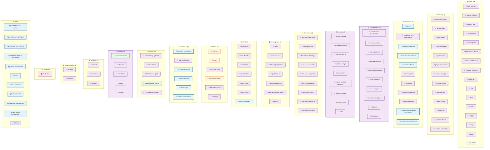

```mermaid
graph TB
    %% Agent Architecture Component Map - Category View

    subgraph other["📦 Other (59)"]
        _code_analyzer_["🤖 "code-analyzer""]
        _code_analyzer_["🤖 "code-analyzer""]
        _system_architect_["🤖 "system-architect""]
        _system_architect_["🤖 "system-architect""]
        browser_agent["🤖 browser-agent"]
        _ml_developer_["🤖 "ml-developer""]
        _ml_developer_["🤖 "ml-developer""]
        _cicd_engineer_["🤖 "cicd-engineer""]
        _cicd_engineer_["🤖 "cicd-engineer""]
        Performance_Monitor["🤖 Performance Monitor"]
        Resource_Allocator["🤖 Resource Allocator"]
        Topology_Optimizer["🤖 Topology Optimizer"]
        _mobile_dev_["🤖 "mobile-dev""]
        _mobile_dev_["🤖 "mobile-dev""]
        Tier["🤖 Tier"]
        Cost["🤖 Cost"]
        Haiku["🤖 Haiku"]
        Trigger["🤖 Trigger"]
        map["🤖 map"]
        Code["🤖 Code"]
        other_more[["... +39 more"]]
    end

    subgraph github["🐙 GitHub (14)"]
        code_review_swarm["🤖 code-review-swarm"]
        github_modes["🤖 github-modes"]
        issue_tracker["🤖 issue-tracker"]
        multi_repo_swarm["🤖 multi-repo-swarm"]
        pr_manager["🤖 pr-manager"]
        project_board_sync["🤖 project-board-sync"]
        release_manager["🤖 release-manager"]
        release_swarm["🤖 release-swarm"]
        repo_architect["🤖 repo-architect"]
        swarm_issue["🤖 swarm-issue"]
        swarm_pr["🤖 swarm-pr"]
        sync_coordinator["🤖 sync-coordinator"]
        workflow_automation["🤖 workflow-automation"]
        pr_manager["🤖 pr-manager"]
    end

    subgraph coordination["👑 Coordination (11)"]
        planner["👑 planner"]
        Load_Balancing_Coordinator["🤖 Load Balancing Coordinator"]
        adaptive_coordinator["👑 adaptive-coordinator"]
        hierarchical_coordinator["👑 hierarchical-coordinator"]
        mesh_coordinator["👑 mesh-coordinator"]
        smart_agent["🤖 smart-agent"]
        swarm_init["🤖 swarm-init"]
        memory_coordinator["🤖 memory-coordinator"]
        task_orchestrator["🤖 task-orchestrator"]
        collective_intelligence_coordinator["👑 collective-intelligence-coordinator"]
        swarm_memory_manager["👑 swarm-memory-manager"]
    end

    subgraph performance["📈 Performance (11)"]
        performance_benchmarker["🤖 performance-benchmarker"]
        Benchmark_Suite["🤖 Benchmark Suite"]
        matrix_optimizer["🤖 matrix-optimizer"]
        pagerank_analyzer["🤖 pagerank-analyzer"]
        performance_optimizer["🤖 performance-optimizer"]
        trading_predictor["🤖 trading-predictor"]
        perf_analyzer["🤖 perf-analyzer"]
        performance_engineer["🤖 performance-engineer"]
        optimize["🤖 optimize"]
        optimize["🤖 optimize"]
        benchmark["🤖 benchmark"]
    end

    subgraph security["🔒 Security (10)"]
        security_manager["🤖 security-manager"]
        aidefence_guardian["🤖 aidefence-guardian"]
        claims_authorizer["🤖 claims-authorizer"]
        injection_analyst["🤖 injection-analyst"]
        pii_detector["🤖 pii-detector"]
        security_architect_aidefence["🤖 security-architect-aidefence"]
        security_architect["🤖 security-architect"]
        security_auditor["🤖 security-auditor"]
        audit["🤖 audit"]
        audit["🤖 audit"]
    end

    subgraph flow_nexus["🌊 Flow Nexus (9)"]
        flow_nexus_app_store["🤖 flow-nexus-app-store"]
        flow_nexus_auth["🤖 flow-nexus-auth"]
        flow_nexus_challenges["🤖 flow-nexus-challenges"]
        flow_nexus_neural["🤖 flow-nexus-neural"]
        flow_nexus_payments["🤖 flow-nexus-payments"]
        flow_nexus_sandbox["🤖 flow-nexus-sandbox"]
        flow_nexus_swarm["🤖 flow-nexus-swarm"]
        flow_nexus_user_tools["🤖 flow-nexus-user-tools"]
        flow_nexus_workflow["🤖 flow-nexus-workflow"]
    end

    subgraph development["💻 Development (8)"]
        coder["🤖 coder"]
        _backend_dev_["🤖 "backend-dev""]
        _backend_dev_["🤖 "backend-dev""]
        sublinear_goal_planner["🤖 sublinear-goal-planner"]
        goal_planner["🤖 goal-planner"]
        agentic_payments["🤖 agentic-payments"]
        base_template_generator["🤖 base-template-generator"]
        refactor["🤖 refactor"]
    end

    subgraph sparc["⚡ SPARC (7)"]
        architecture["🤖 architecture"]
        pseudocode["🤖 pseudocode"]
        refinement["🤖 refinement"]
        specification["🤖 specification"]
        sparc_coder["🤖 sparc-coder"]
        sparc_coord["🤖 sparc-coord"]
        sparc_orchestrator["👑 sparc-orchestrator"]
    end

    subgraph testing["🧪 Testing (7)"]
        reviewer["🤖 reviewer"]
        tester["🤖 tester"]
        test_long_runner["🤖 test-long-runner"]
        production_validator["🤖 production-validator"]
        tdd_london_swarm["🤖 tdd-london-swarm"]
        testgaps["🤖 testgaps"]
        testgaps["🤖 testgaps"]
    end

    subgraph consensus["🤝 Consensus (6)"]
        byzantine_coordinator["👑 byzantine-coordinator"]
        crdt_synchronizer["🤖 crdt-synchronizer"]
        gossip_coordinator["👑 gossip-coordinator"]
        quorum_manager["👑 quorum-manager"]
        raft_manager["👑 raft-manager"]
        consensus_coordinator["👑 consensus-coordinator"]
    end

    subgraph v3_core["🚀 V3 Core (5)"]
        sona_learning_optimizer["🤖 sona-learning-optimizer"]
        adr_architect["🤖 adr-architect"]
        ddd_domain_expert["🤖 ddd-domain-expert"]
        reasoningbank_learner["🎯 reasoningbank-learner"]
        v3_integration_architect["🤖 v3-integration-architect"]
    end

    subgraph memory["🧠 Memory (5)"]
        memory_specialist["🎯 memory-specialist"]
        ultralearn["🤖 ultralearn"]
        consolidate["🤖 consolidate"]
        predict["🤖 predict"]
        preload["🤖 preload"]
    end

    subgraph analysis["🔍 Analysis (4)"]
        analyst["🤖 analyst"]
        researcher["🤖 researcher"]
        deepdive["🤖 deepdive"]
        deepdive["🤖 deepdive"]
    end

    subgraph documentation["📚 Documentation (4)"]
        _api_docs_["🤖 "api-docs""]
        _api_docs_["🤖 "api-docs""]
        document["🤖 document"]
        document["🤖 document"]
    end

    subgraph MCP["🔌 MCP Servers"]
        mcp_claude_flow["🟢 claude-flow"]
    end

    subgraph Skills["⚡ Skills"]
        skill__AgentDB_Advanced_Features_[""AgentDB Advanced Features""]
        skill__AgentDB_Learning_Plugins_[""AgentDB Learning Plugins""]
        skill__AgentDB_Memory_Patterns_[""AgentDB Memory Patterns""]
        skill__AgentDB_Performance_Optimization_[""AgentDB Performance Optimization""]
        skill__AgentDB_Vector_Search_[""AgentDB Vector Search""]
        skill_browser["browser"]
        skill_github_code_review["github-code-review"]
        skill_github_multi_repo["github-multi-repo"]
        skill_github_project_management["github-project-management"]
        skill_github_release_management["github-release-management"]
        skills_more[["... +20 more"]]
    end

    %% Cross-category relationships

    %% Tool connections

    %% Styling
    classDef coordinator fill:#e1f5fe,stroke:#01579b,stroke-width:2px
    classDef worker fill:#f3e5f5,stroke:#4a148c
    classDef reviewer fill:#fff3e0,stroke:#e65100
    classDef specialist fill:#e8f5e9,stroke:#1b5e20
    classDef disabled fill:#eeeeee,stroke:#9e9e9e,stroke-dasharray: 5 5
    classDef mcp fill:#fce4ec,stroke:#880e4f
    classDef skill fill:#e3f2fd,stroke:#0d47a1
    classDef more fill:#f5f5f5,stroke:#bdbdbd,stroke-dasharray: 3 3
    class _code_analyzer_ worker
    class analyst worker
    class _code_analyzer_ worker
    class _system_architect_ worker
    class _system_architect_ worker
    class browser_agent worker
    class byzantine_coordinator coordinator
    class crdt_synchronizer worker
    class gossip_coordinator coordinator
    class performance_benchmarker worker
    class quorum_manager coordinator
    class raft_manager coordinator
    class security_manager worker
    class coder worker
    class planner coordinator
    class researcher worker
    class reviewer reviewer
    class tester reviewer
    class test_long_runner worker
    class _ml_developer_ worker
    class _ml_developer_ worker
    class _backend_dev_ worker
    class _backend_dev_ worker
    class _cicd_engineer_ worker
    class _cicd_engineer_ worker
    class _api_docs_ worker
    class _api_docs_ worker
    class flow_nexus_app_store worker
    class flow_nexus_auth worker
    class flow_nexus_challenges worker
    class flow_nexus_neural worker
    class flow_nexus_payments worker
    class flow_nexus_sandbox worker
    class flow_nexus_swarm worker
    class flow_nexus_user_tools worker
    class flow_nexus_workflow worker
    class code_review_swarm worker
    class github_modes worker
    class issue_tracker worker
    class multi_repo_swarm worker
    class pr_manager worker
    class project_board_sync worker
    class release_manager worker
    class release_swarm worker
    class repo_architect worker
    class swarm_issue worker
    class swarm_pr worker
    class sync_coordinator worker
    class workflow_automation worker
    class sublinear_goal_planner worker
    class goal_planner worker
    class Benchmark_Suite worker
    class Load_Balancing_Coordinator worker
    class Performance_Monitor worker
    class Resource_Allocator worker
    class Topology_Optimizer worker
    class agentic_payments worker
    class sona_learning_optimizer worker
    class architecture worker
    class pseudocode worker
    class refinement worker
    class specification worker
    class _mobile_dev_ worker
    class _mobile_dev_ worker
    class consensus_coordinator coordinator
    class matrix_optimizer worker
    class pagerank_analyzer worker
    class performance_optimizer worker
    class trading_predictor worker
    class adaptive_coordinator coordinator
    class hierarchical_coordinator coordinator
    class mesh_coordinator coordinator
    class smart_agent worker
    class base_template_generator worker
    class swarm_init worker
    class pr_manager worker
    class sparc_coder worker
    class memory_coordinator worker
    class task_orchestrator worker
    class perf_analyzer worker
    class sparc_coord worker
    class production_validator reviewer
    class tdd_london_swarm worker
    class adr_architect worker
    class aidefence_guardian worker
    class claims_authorizer worker
    class collective_intelligence_coordinator coordinator
    class ddd_domain_expert worker
    class injection_analyst worker
    class memory_specialist specialist
    class performance_engineer worker
    class pii_detector worker
    class reasoningbank_learner specialist
    class security_architect_aidefence worker
    class security_architect worker
    class security_auditor worker
    class sparc_orchestrator coordinator
    class swarm_memory_manager coordinator
    class v3_integration_architect worker
    class Tier worker
    class Cost worker
    class Haiku worker
    class Trigger worker
    class optimize worker
    class testgaps worker
    class audit worker
    class document worker
    class map worker
    class deepdive worker
    class Code worker
    class Command worker
    class init worker
    class swarm worker
    class memory worker
    class mcp worker
    class task worker
    class session worker
    class config worker
    class status worker
    class workflow worker
    class hooks worker
    class Command worker
    class daemon worker
    class neural worker
    class security worker
    class performance worker
    class providers worker
    class plugins worker
    class deployment worker
    class embeddings worker
    class claims worker
    class migrate worker
    class doctor worker
    class completions worker
    class Hook worker
    class route worker
    class explain worker
    class pretrain worker
    class metrics worker
    class transfer worker
    class list worker
    class intelligence worker
    class worker worker
    class progress worker
    class statusline worker
    class Worker worker
    class ultralearn worker
    class optimize worker
    class consolidate worker
    class predict worker
    class audit worker
    class map worker
    class preload worker
    class deepdive worker
    class document worker
    class refactor worker
    class benchmark worker
    class testgaps worker
    class Metric worker
    class Condition worker
    class mcp_claude_flow mcp
    class skill__AgentDB_Advanced_Features_ skill
    class skill__AgentDB_Learning_Plugins_ skill
    class skill__AgentDB_Memory_Patterns_ skill
    class skill__AgentDB_Performance_Optimization_ skill
    class skill__AgentDB_Vector_Search_ skill
    class skill_browser skill
    class skill_github_code_review skill
    class skill_github_multi_repo skill
    class skill_github_project_management skill
    class skill_github_release_management skill
    class skill_github_workflow_automation skill
    class skill_Hooks_Automation skill
    class skill_Pair_Programming skill
    class skill__ReasoningBank_with_AgentDB_ skill
    class skill__ReasoningBank_Intelligence_ skill
    class skill__Skill_Builder_ skill
    class skill_sparc_methodology skill
    class skill_stream_chain skill
    class skill_swarm_advanced skill
    class skill__Swarm_Orchestration_ skill
    class skill__V3_CLI_Modernization_ skill
    class skill__V3_Core_Implementation_ skill
    class skill__V3_DDD_Architecture_ skill
    class skill__V3_Deep_Integration_ skill
    class skill__V3_MCP_Optimization_ skill
    class skill__V3_Memory_Unification_ skill
    class skill__V3_Performance_Optimization_ skill
    class skill__V3_Security_Overhaul_ skill
    class skill__V3_Swarm_Coordination_ skill
    class skill__Verification___Quality_Assurance_ skill
    class other_more more
```