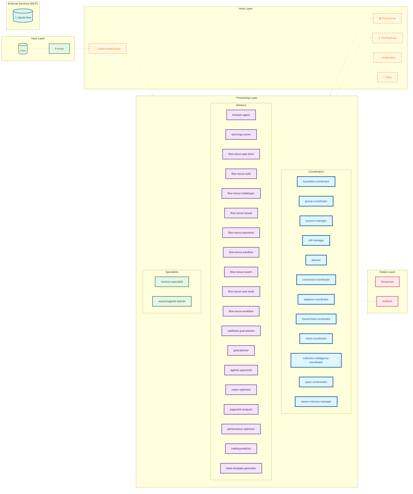

```mermaid
%%{init: {"theme":"default","themeVariables":{"background":"#ffffff","primaryBorderColor":"#e0e0e0","primaryTextColor":"#212121","secondaryTextColor":"#757575","primaryColor":"#fafafa","secondaryColor":"#e3f2fd","tertiaryColor":"#fff8e1","lineColor":"#e0e0e0","fontSize":"14px","fontFamily":"system-ui, -apple-system, sans-serif"}}}%%
flowchart LR
    %% Agent Dataflow

    subgraph Input["Input Layer"]
        USER[("User")]
        PROMPT["Prompt"]
    end

    subgraph Hooks["Hook Layer"]
        hook_PreToolUse["🔒 PreToolUse"]
        hook_PostToolUse["✅ PostToolUse"]
        hook_UserPromptSubmit["📝 UserPromptSubmit"]
        hook_Notification["🔔 Notification"]
        hook_Stop["🛑 Stop"]
    end

    subgraph Processing["Processing Layer"]
        subgraph Coordinators["Coordinators"]
            byzantine_coordinator["byzantine-coordinator"]
            gossip_coordinator["gossip-coordinator"]
            quorum_manager["quorum-manager"]
            raft_manager["raft-manager"]
            planner["planner"]
            consensus_coordinator["consensus-coordinator"]
            adaptive_coordinator["adaptive-coordinator"]
            hierarchical_coordinator["hierarchical-coordinator"]
            mesh_coordinator["mesh-coordinator"]
            collective_intelligence_coordinator["collective-intelligence-coordinator"]
            sparc_orchestrator["sparc-orchestrator"]
            swarm_memory_manager["swarm-memory-manager"]
        end
        subgraph Workers["Workers"]
            browser_agent["browser-agent"]
            test_long_runner["test-long-runner"]
            flow_nexus_app_store["flow-nexus-app-store"]
            flow_nexus_auth["flow-nexus-auth"]
            flow_nexus_challenges["flow-nexus-challenges"]
            flow_nexus_neural["flow-nexus-neural"]
            flow_nexus_payments["flow-nexus-payments"]
            flow_nexus_sandbox["flow-nexus-sandbox"]
            flow_nexus_swarm["flow-nexus-swarm"]
            flow_nexus_user_tools["flow-nexus-user-tools"]
            flow_nexus_workflow["flow-nexus-workflow"]
            sublinear_goal_planner["sublinear-goal-planner"]
            goal_planner["goal-planner"]
            agentic_payments["agentic-payments"]
            matrix_optimizer["matrix-optimizer"]
            pagerank_analyzer["pagerank-analyzer"]
            performance_optimizer["performance-optimizer"]
            trading_predictor["trading-predictor"]
            base_template_generator["base-template-generator"]
        end
        subgraph Specialists["Specialists"]
            memory_specialist["memory-specialist"]
            reasoningbank_learner["reasoningbank-learner"]
        end
    end

    subgraph External["External Services (MCP)"]
        mcp_claude_flow[("💾 claude-flow")]
    end

    subgraph Output["Output Layer"]
        RESPONSE["Response"]
        ARTIFACTS["Artifacts"]
    end

    %% Data Flow
    USER --> PROMPT
    PROMPT --> hook_UserPromptSubmit
    hook_UserPromptSubmit --> Processing
    Processing <--> hook_PreToolUse
    Processing --> hook_PostToolUse
    Processing --> RESPONSE
    Processing --> ARTIFACTS

    %% Styling
    classDef coordinator fill:#e1f5fe,stroke:#01579b,color:#01579b,stroke-width:3px
    classDef worker fill:#f3e5f5,stroke:#4a148c,color:#4a148c,stroke-width:2px
    classDef specialist fill:#e8f5e9,stroke:#1b5e20,color:#1b5e20,stroke-width:2px
    classDef reviewer fill:#fff3e0,stroke:#e65100,color:#e65100,stroke-width:2px
    classDef custom fill:#fce4ec,stroke:#880e4f,color:#880e4f,stroke-width:2px
    classDef input fill:#e8f5e9,stroke:#2e7d32,color:#2e7d32,stroke-width:2px
    classDef output fill:#ffebee,stroke:#c62828,color:#c62828,stroke-width:2px
    classDef hook fill:#fff8e1,stroke:#f57f17,color:#f57f17,stroke-width:2px,stroke-dasharray:5 5
    classDef mcp fill:#e0f2f1,stroke:#00695c,color:#00695c,stroke-width:2px
    classDef skill fill:#e3f2fd,stroke:#0d47a1,color:#0d47a1,stroke-width:2px,stroke-dasharray:5 5
    classDef subgraph_style fill:#fafafa,stroke:#9e9e9e,color:#424242,stroke-width:1px
    classDef more fill:#f5f5f5,stroke:#757575,stroke-dasharray:3 3,color:#757575
    classDef category fill:#fafafa,stroke:#9e9e9e,stroke-width:2px,color:#212121
    class USER,PROMPT input
    class RESPONSE,ARTIFACTS output
    class hook_PreToolUse hook
    class hook_PostToolUse hook
    class hook_UserPromptSubmit hook
    class hook_Notification hook
    class hook_Stop hook
    class _code_analyzer_ custom
    class analyst custom
    class _code_analyzer_ custom
    class _system_architect_ custom
    class _system_architect_ custom
    class browser_agent worker
    class byzantine_coordinator coordinator
    class crdt_synchronizer custom
    class gossip_coordinator coordinator
    class performance_benchmarker custom
    class quorum_manager coordinator
    class raft_manager coordinator
    class security_manager custom
    class coder custom
    class planner coordinator
    class researcher custom
    class reviewer custom
    class tester custom
    class test_long_runner worker
    class _ml_developer_ custom
    class _ml_developer_ custom
    class _backend_dev_ custom
    class _backend_dev_ custom
    class _cicd_engineer_ custom
    class _cicd_engineer_ custom
    class _api_docs_ custom
    class _api_docs_ custom
    class flow_nexus_app_store worker
    class flow_nexus_auth worker
    class flow_nexus_challenges worker
    class flow_nexus_neural worker
    class flow_nexus_payments worker
    class flow_nexus_sandbox worker
    class flow_nexus_swarm worker
    class flow_nexus_user_tools worker
    class flow_nexus_workflow worker
    class code_review_swarm custom
    class github_modes custom
    class issue_tracker custom
    class multi_repo_swarm custom
    class pr_manager custom
    class project_board_sync custom
    class release_manager custom
    class release_swarm custom
    class repo_architect custom
    class swarm_issue custom
    class swarm_pr custom
    class sync_coordinator custom
    class workflow_automation custom
    class sublinear_goal_planner worker
    class goal_planner worker
    class Benchmark_Suite custom
    class Load_Balancing_Coordinator custom
    class Performance_Monitor custom
    class Resource_Allocator custom
    class Topology_Optimizer custom
    class agentic_payments worker
    class sona_learning_optimizer custom
    class architecture custom
    class pseudocode custom
    class refinement custom
    class specification custom
    class _mobile_dev_ custom
    class _mobile_dev_ custom
    class consensus_coordinator coordinator
    class matrix_optimizer worker
    class pagerank_analyzer worker
    class performance_optimizer worker
    class trading_predictor worker
    class adaptive_coordinator coordinator
    class hierarchical_coordinator coordinator
    class mesh_coordinator coordinator
    class smart_agent custom
    class base_template_generator worker
    class swarm_init custom
    class pr_manager custom
    class sparc_coder custom
    class memory_coordinator custom
    class task_orchestrator custom
    class perf_analyzer custom
    class sparc_coord custom
    class production_validator custom
    class tdd_london_swarm custom
    class adr_architect custom
    class aidefence_guardian custom
    class claims_authorizer custom
    class collective_intelligence_coordinator coordinator
    class ddd_domain_expert custom
    class injection_analyst custom
    class memory_specialist specialist
    class performance_engineer custom
    class pii_detector custom
    class reasoningbank_learner specialist
    class security_architect_aidefence custom
    class security_architect custom
    class security_auditor custom
    class sparc_orchestrator coordinator
    class swarm_memory_manager coordinator
    class v3_integration_architect custom
    class mcp_claude_flow mcp
```

---
*Generated by AgentScope on 2026-01-22 at 19:12:39 UTC*