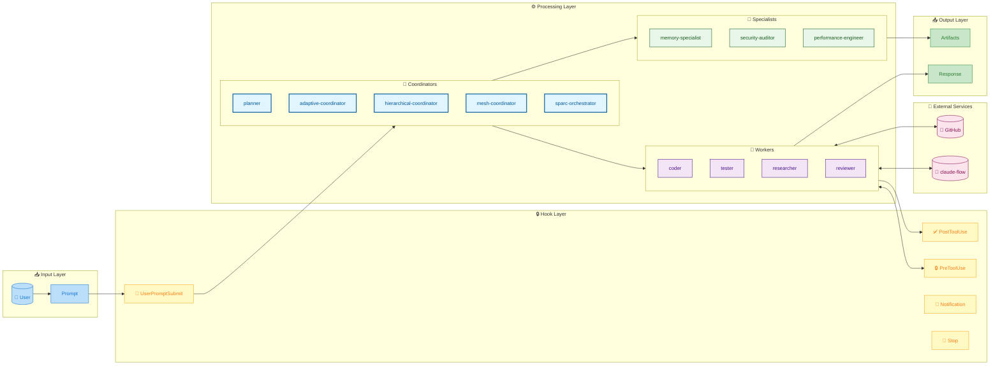

# Agent Dataflow

This diagram shows the data flow between agents, hooks, and external services.

```mermaid
%%{init: {"theme": "default", "themeVariables": {"fontSize": "14px"}}}%%
flowchart LR
    %% Agent Dataflow

    subgraph Input["📥 Input Layer"]
        USER[("👤 User")]
        PROMPT["Prompt"]
    end

    subgraph Hooks["🔒 Hook Layer"]
        hook_PreToolUse["🔒 PreToolUse"]
        hook_PostToolUse["✅ PostToolUse"]
        hook_UserPromptSubmit["📝 UserPromptSubmit"]
        hook_Notification["🔔 Notification"]
        hook_Stop["🛑 Stop"]
    end

    subgraph Processing["⚙️ Processing Layer"]
        subgraph Coordinators["👑 Coordinators"]
            planner["planner"]
            adaptive_coordinator["adaptive-coordinator"]
            hierarchical_coordinator["hierarchical-coordinator"]
            mesh_coordinator["mesh-coordinator"]
            sparc_orchestrator["sparc-orchestrator"]
        end
        subgraph Workers["🔧 Workers"]
            coder["coder"]
            tester["tester"]
            researcher["researcher"]
            reviewer["reviewer"]
        end
        subgraph Specialists["🎯 Specialists"]
            memory_specialist["memory-specialist"]
            security_auditor["security-auditor"]
            performance_engineer["performance-engineer"]
        end
    end

    subgraph External["🔌 External Services"]
        mcp_claude_flow[("💾 claude-flow")]
        mcp_github[("🐙 GitHub")]
    end

    subgraph Output["📤 Output Layer"]
        RESPONSE["Response"]
        ARTIFACTS["Artifacts"]
    end

    %% Data Flow
    USER --> PROMPT
    PROMPT --> hook_UserPromptSubmit
    hook_UserPromptSubmit --> Coordinators
    Coordinators --> Workers
    Coordinators --> Specialists
    Workers <--> hook_PreToolUse
    Workers --> hook_PostToolUse
    Workers <--> mcp_claude_flow
    Workers <--> mcp_github
    Workers --> RESPONSE
    Specialists --> ARTIFACTS

    %% Styling
    classDef input fill:#bbdefb,stroke:#1976d2,color:#1976d2
    classDef hook fill:#fff9c4,stroke:#f9a825,color:#f57f17
    classDef coordinator fill:#e1f5fe,stroke:#01579b,stroke-width:2px,color:#01579b
    classDef worker fill:#f3e5f5,stroke:#4a148c,color:#4a148c
    classDef specialist fill:#e8f5e9,stroke:#1b5e20,color:#1b5e20
    classDef mcp fill:#fce4ec,stroke:#880e4f,color:#880e4f
    classDef output fill:#c8e6c9,stroke:#388e3c,color:#2e7d32

    class USER,PROMPT input
    class RESPONSE,ARTIFACTS output
    class hook_PreToolUse,hook_PostToolUse,hook_UserPromptSubmit,hook_Notification,hook_Stop hook
    class planner,adaptive_coordinator,hierarchical_coordinator,mesh_coordinator,sparc_orchestrator coordinator
    class coder,tester,researcher,reviewer worker
    class memory_specialist,security_auditor,performance_engineer specialist
    class mcp_claude_flow,mcp_github mcp
```

---

Generated by [AgentScope](https://github.com/vipasane/agentscope)
