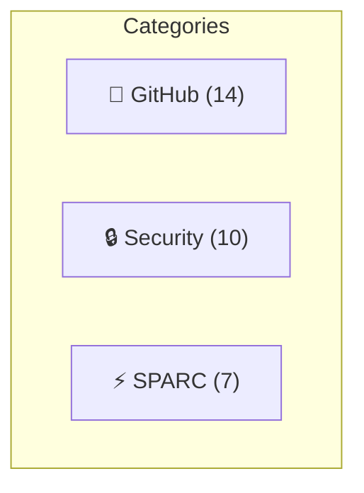
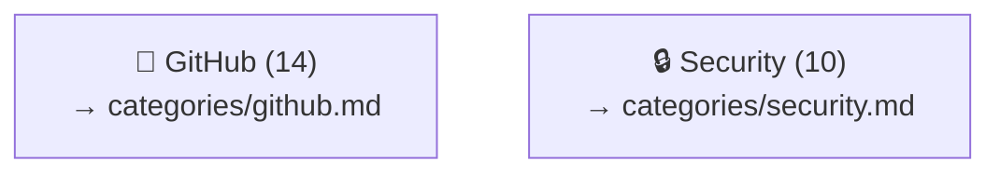

# Plan: Multi-File Diagrams with Bidirectional Linking

## Research Summary

### Mermaid Click/Link Capabilities

Mermaid supports clickable nodes with two approaches:

```mermaid
%% URL Link (opens in browser)
click nodeId "https://url.com" "Tooltip"
click nodeId "https://url.com" _blank

%% JavaScript callback
click nodeId callback "Tooltip"
click nodeId call myFunction()
```

**Limitation**: Requires `securityLevel='loose'` in Mermaid config. GitHub renders Mermaid in strict mode, so **click events don't work on GitHub**.

### Workaround for GitHub

Use **markdown links below the diagram** that reference anchors or files:

```markdown
[🔍 View GitHub Agents →](./categories/github.md)
```

---

## Proposed Multi-File Structure

```
docs/agent-architecture/
├── README.md                    # Main index with summary diagram + dense tables
├── component-map.md             # Full component map (current)
├── hierarchy.md                 # Full hierarchy (current)
├── categories/                  # Per-category detail files
│   ├── github.md               # GitHub agents detail + sub-diagram
│   ├── security.md             # Security agents detail
│   ├── consensus.md            # Consensus agents detail
│   ├── sparc.md                # SPARC agents detail
│   └── ...
├── agents/                      # Individual agent detail (optional)
│   ├── pr-manager.md
│   └── ...
└── comparisons/                 # Dense comparison tables
    ├── agents-by-type.md
    ├── agents-by-category.md
    └── capabilities-matrix.md
```

---

## Bidirectional Linking Pattern

### Parent → Child (in README.md)

```markdown
## Categories

| Category | Agents | View Details |
|----------|--------|--------------|
| 🐙 GitHub | 14 | [→ github.md](./categories/github.md) |
| 🔒 Security | 10 | [→ security.md](./categories/security.md) |
```

### Child → Parent (in categories/github.md)

```markdown
# 🐙 GitHub Agents

[← Back to Overview](../README.md) | [↑ Component Map](../component-map.md)

... category content ...
```

---

## Dense Table Designs

### Current (Verbose) - 8 lines per agent

```markdown
### "pr-manager"

**Type**: `Custom`

"Complete pull request lifecycle management"

**Defined in**: `.claude/agents/github/pr-manager.md`

---
```

### Proposed Dense Table - 1 line per agent

```markdown
| Agent | Type | Category | Description | Path |
|-------|------|----------|-------------|------|
| pr-manager | coordinator | GitHub | PR lifecycle management | [→](../../../.claude/agents/github/pr-manager.md) |
| code-review-swarm | worker | GitHub | Multi-agent code review | [→](../../../.claude/agents/github/code-review-swarm.md) |
```

### Ultra-Dense Comparison Matrix

```markdown
| Agent | 👑 | 🔧 | 🧪 | 📚 | 🔒 | Description |
|-------|:--:|:--:|:--:|:--:|:--:|-------------|
| pr-manager | ✓ | | | | | PR lifecycle |
| coder | | ✓ | | | | Code implementation |
| tester | | | ✓ | | | Test writing |
| security-auditor | | | | | ✓ | Security scanning |

Legend: 👑=Coordinator 🔧=Worker 🧪=Testing 📚=Docs 🔒=Security
```

---

## Implementation Options

### Option A: Mermaid with Markdown Link Table



**Drill-down links:**
| Category | Details |
|----------|---------|
| 🐙 GitHub | [View 14 agents →](./categories/github.md) |
| 🔒 Security | [View 10 agents →](./categories/security.md) |

### Option B: ASCII Art Links in Diagram



### Option C: HTML in Markdown (GitHub supports)

```html
<details>
<summary>🐙 GitHub (14 agents)</summary>

| Agent | Type | Description |
|-------|------|-------------|
| pr-manager | coordinator | PR lifecycle |
| ... | ... | ... |

</details>
```

---

## Recommendation

**Hybrid approach:**

1. **README.md** - Summary diagram + dense comparison tables + links to categories
2. **categories/*.md** - Per-category detail with sub-diagrams + back-links
3. **Use `<details>` collapse** for optional expansion inline
4. **Dense tables** (1 row per agent) instead of sections

---

## Sources

- [Mermaid Flowchart Syntax](https://mermaid.js.org/syntax/flowchart.html)
- [GitHub Issue #4059 - Web links in diagrams](https://github.com/mermaid-js/mermaid/issues/4059)
- [Mermaid Chart - Sharable diagram links](https://docs.mermaidchart.com/blog/posts/mermaid-chart-officially-launched-with-sharable-diagram-links-and-presentation-mode)
