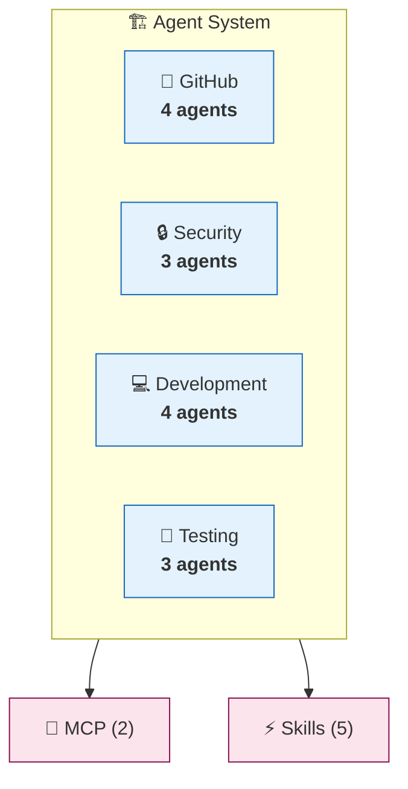
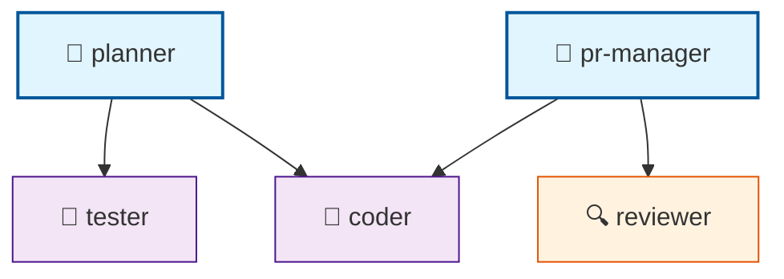

# Agent Architecture Documentation

> Generated by AgentScope v0.1.0 | [Full Diagram](./component-map-example.md) | [Hierarchy](./hierarchy-example.md)

## Quick Stats

| Component | Count | Details |
|-----------|------:|---------|
| Agents | 14 | [View all →](#agents-comparison) |
| Skills | 5 | [View all →](#skills) |
| MCP Servers | 2 | [View all →](#mcp-servers) |

---

## System Overview

**Drill into categories:**

| Category | Agents | Coordinators | Workers | Details |
|----------|-------:|-------------:|--------:|---------|
| 🐙 GitHub | 4 | 1 | 3 | [→ github.md](./categories/github-example.md) |
| 🔒 Security | 3 | 0 | 3 | [→ security.md](./categories/security-example.md) |
| 💻 Development | 4 | 1 | 3 | [→ development.md](#) |
| 🧪 Testing | 3 | 0 | 3 | [→ testing.md](#) |

---

## Agents Comparison

### Dense Table (All Agents)

| Agent | Cat | Type | Delegates To | Tools | Description |
|-------|-----|------|--------------|-------|-------------|
| pr-manager | 🐙 | 👑 | reviewer, coder | github | PR lifecycle management |
| code-review-swarm | 🐙 | 🤖 | — | github | Multi-agent code review |
| issue-tracker | 🐙 | 🤖 | — | github | Issue management |
| release-manager | 🐙 | 🤖 | — | github | Release automation |
| security-auditor | 🔒 | 🤖 | — | — | Security scanning |
| pii-detector | 🔒 | 🤖 | — | — | PII detection |
| claims-authorizer | 🔒 | 🤖 | — | — | Access control |
| coder | 💻 | 🤖 | — | filesystem | Code implementation |
| planner | 💻 | 👑 | coder, tester | — | Task planning |
| backend-dev | 💻 | 🤖 | — | — | API development |
| ml-developer | 💻 | 🤖 | — | — | ML model development |
| tester | 🧪 | 🤖 | — | — | Test writing |
| reviewer | 🧪 | 🔍 | — | — | Code review |
| production-validator | 🧪 | 🤖 | — | — | Production readiness |

**Legend:** 👑 Coordinator | 🤖 Worker | 🔍 Reviewer | 🎯 Specialist

---

### Capabilities Matrix

| Agent | Writes Code | Reviews | Tests | Deploys | Security |
|-------|:-----------:|:-------:|:-----:|:-------:|:--------:|
| pr-manager | | ✓ | | ✓ | |
| coder | ✓ | | | | |
| tester | | | ✓ | | |
| reviewer | | ✓ | | | |
| security-auditor | | ✓ | | | ✓ |
| backend-dev | ✓ | | | | |
| release-manager | | | | ✓ | |

---

### Delegation Hierarchy

📊 Click to expand hierarchy

---

## Skills

| Skill | Category | Agents Using | Description |
|-------|----------|--------------|-------------|
| github-code-review | GitHub | reviewer, pr-manager | Code review automation |
| sparc-methodology | SPARC | planner | Structured development |
| pair-programming | Development | coder | Collaborative coding |
| verification-quality | Testing | tester, reviewer | Quality assurance |
| browser | Automation | — | Browser automation |

---

## MCP Servers

| Server | Status | Command | Tools Provided |
|--------|:------:|---------|----------------|
| claude-flow | 🟢 | `npx @claude-flow/cli` | swarm, memory, agents |
| github | 🟢 | `npx @github/mcp` | issues, prs, repos |

---

## Quick Navigation

| Section | Description | Link |
|---------|-------------|------|
| 📊 Full Component Map | All agents with relationships | [→ component-map.md](./component-map-example.md) |
| 🏛️ Hierarchy Diagram | Delegation chains | [→ hierarchy.md](./hierarchy-example.md) |
| 🐙 GitHub Category | 4 GitHub-related agents | [→ categories/github.md](./categories/github-example.md) |
| 🔒 Security Category | 3 security agents | [→ categories/security.md](./categories/security-example.md) |
| 📦 Export Data | Raw JSON config | [→ config.json](#) |
