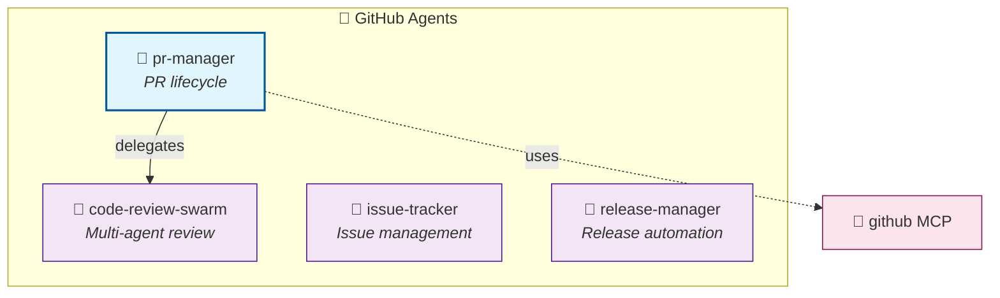

# 🐙 GitHub Agents

[← Back to Overview](../README-example.md) | [↑ Component Map](../component-map-example.md) | [→ Security](./security-example.md)

---

## Summary

| Metric | Value |
|--------|------:|
| Total Agents | 4 |
| Coordinators | 1 |
| Workers | 3 |

---

## Category Diagram

---

## Agents Detail

| Agent | Type | Delegates To | MCP Tools | Defined In |
|-------|------|--------------|-----------|------------|
| pr-manager | 👑 Coordinator | code-review-swarm | github | [→](.claude/agents/github/pr-manager.md) |
| code-review-swarm | 🤖 Worker | — | github | [→](.claude/agents/github/code-review-swarm.md) |
| issue-tracker | 🤖 Worker | — | github | [→](.claude/agents/github/issue-tracker.md) |
| release-manager | 🤖 Worker | — | github | [→](.claude/agents/github/release-manager.md) |

---

## Relationships

### Incoming (delegated from other categories)

| From Agent | From Category | Relationship |
|------------|---------------|--------------|
| planner | 💻 Development | delegates to pr-manager |

### Outgoing (delegates to other categories)

| To Agent | To Category | Relationship |
|----------|-------------|--------------|
| coder | 💻 Development | pr-manager delegates |
| reviewer | 🧪 Testing | pr-manager delegates |

---

## Related Skills

| Skill | Used By |
|-------|---------|
| [github-code-review](../skills/github-code-review.md) | pr-manager, code-review-swarm |

---

## Cross-References

| Related Categories | Link |
|--------------------|------|
| 🔒 Security (audits PRs) | [→ security.md](./security-example.md) |
| 💻 Development (creates PRs) | [→ development.md](#) |
| 🧪 Testing (validates PRs) | [→ testing.md](#) |

---

[← Back to Overview](../README-example.md)
