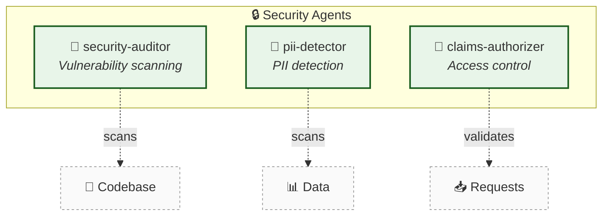

# 🔒 Security Agents

[← Back to Overview](../README-example.md) | [↑ Component Map](../component-map-example.md) | [← GitHub](./github-example.md)

---

## Summary

| Metric | Value |
|--------|------:|
| Total Agents | 3 |
| Coordinators | 0 |
| Specialists | 3 |

---

## Category Diagram

---

## Agents Detail

| Agent | Type | Specialization | Scans | Defined In |
|-------|------|----------------|-------|------------|
| security-auditor | 🎯 Specialist | CVE, OWASP | Code, deps | [→](.claude/agents/security/security-auditor.md) |
| pii-detector | 🎯 Specialist | PII, secrets | Strings, files | [→](.claude/agents/security/pii-detector.md) |
| claims-authorizer | 🎯 Specialist | RBAC, claims | API requests | [→](.claude/agents/security/claims-authorizer.md) |

---

## Capabilities Comparison

| Agent | CVE | OWASP | PII | Secrets | RBAC | Runtime |
|-------|:---:|:-----:|:---:|:-------:|:----:|:-------:|
| security-auditor | ✓ | ✓ | | | | |
| pii-detector | | | ✓ | ✓ | | |
| claims-authorizer | | | | | ✓ | ✓ |

---

## Integration Points

### Triggers Security Scan

| Trigger Event | Agent Invoked | Description |
|---------------|---------------|-------------|
| PR created | security-auditor | Scan changed files |
| Pre-commit | pii-detector | Check for secrets |
| API request | claims-authorizer | Validate permissions |

### Reports To

| Agent | Reports To | Format |
|-------|------------|--------|
| security-auditor | pr-manager | PR comment |
| pii-detector | console | Warning log |
| claims-authorizer | API | 403 response |

---

## Cross-References

| Related Categories | Interaction | Link |
|--------------------|-------------|------|
| 🐙 GitHub | Audits PRs | [→ github.md](./github-example.md) |
| 💻 Development | Scans code | [→ development.md](#) |
| 🧪 Testing | Validates tests | [→ testing.md](#) |

---

[← Back to Overview](../README-example.md)
