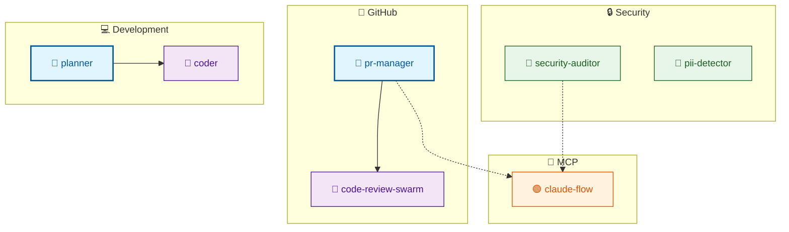
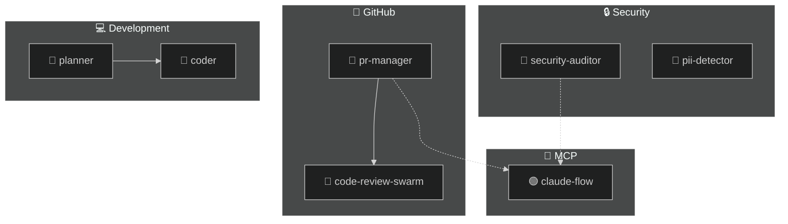
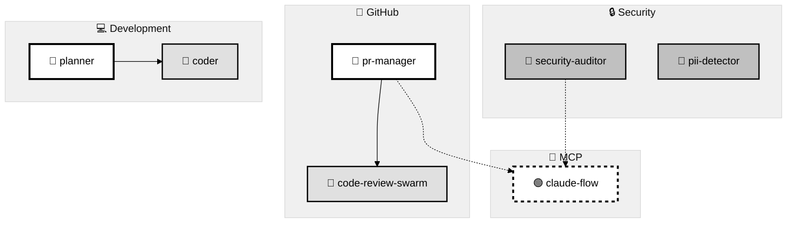
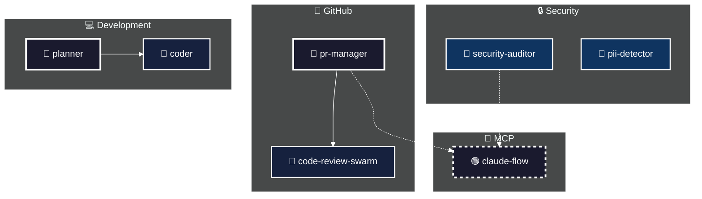
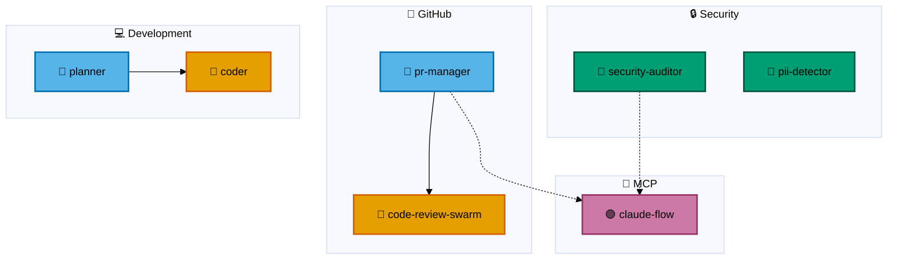
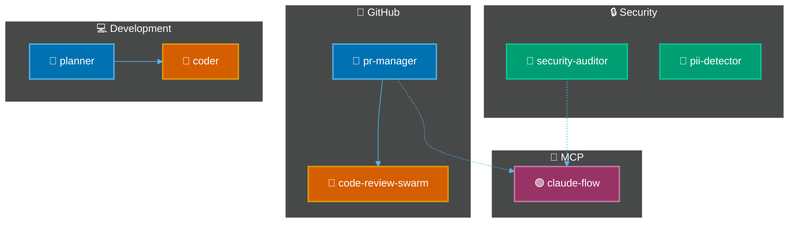

# Mermaid Theme Examples

All 6 theme variants showing the same agent architecture diagram.

---

## Theme 1: Light (Default)

Standard light theme - good for light mode interfaces.



---

## Theme 2: Dark

Dark theme using Mermaid's dark2 - good for dark mode interfaces.



---

## Theme 3: High Contrast Light

WCAG AAA compliant - high contrast on light background.



---

## Theme 4: High Contrast Dark

WCAG AAA compliant - high contrast on dark background.



---

## Theme 5: Colorblind-Safe Light

Okabe-Ito palette - safe for deuteranopia and protanopia.



---

## Theme 6: Colorblind-Safe Dark

Okabe-Ito palette adapted for dark backgrounds.



---

## Theme Comparison Table

| Theme | Background | Text | Coordinator | Worker | Specialist | MCP |
|-------|------------|------|-------------|--------|------------|-----|
| Light | White | Dark | `#e1f5fe` | `#f3e5f5` | `#e8f5e9` | `#fff3e0` |
| Dark | Dark | Light | Mermaid dark | Mermaid dark | Mermaid dark | Mermaid dark |
| HC Light | White | Black | `#ffffff` | `#e0e0e0` | `#c0c0c0` | `#ffffff` dashed |
| HC Dark | `#1a1a2e` | White | `#1a1a2e` | `#16213e` | `#0f3460` | `#1a1a2e` dashed |
| CB Light | White | Dark | `#56B4E9` | `#E69F00` | `#009E73` | `#CC79A7` |
| CB Dark | Dark | Light | `#0072B2` | `#D55E00` | `#009E73` | `#993366` |

---

## Color Palettes Reference

### Okabe-Ito Colorblind-Safe Palette

| Name | Hex | Swatch | Use |
|------|-----|--------|-----|
| Orange | `#E69F00` | 🟧 | Workers |
| Sky Blue | `#56B4E9` | 🔵 | Coordinators |
| Bluish Green | `#009E73` | 🟢 | Specialists |
| Yellow | `#F0E442` | 🟡 | Highlights |
| Blue | `#0072B2` | 🔷 | Borders |
| Vermillion | `#D55E00` | 🟠 | Alerts |
| Reddish Purple | `#CC79A7` | 🟣 | MCP/External |
| Black | `#000000` | ⬛ | Text |

### Material Design Colors (Light Theme)

| Type | Fill | Border | Text |
|------|------|--------|------|
| Coordinator | `#e1f5fe` | `#01579b` | `#01579b` |
| Worker | `#f3e5f5` | `#4a148c` | `#4a148c` |
| Specialist | `#e8f5e9` | `#1b5e20` | `#1b5e20` |
| Reviewer | `#fff3e0` | `#e65100` | `#e65100` |
| MCP Server | `#fce4ec` | `#880e4f` | `#880e4f` |
| Skill | `#e3f2fd` | `#0d47a1` | `#0d47a1` |
| Disabled | `#eeeeee` | `#9e9e9e` | `#9e9e9e` |

---

## Usage

```bash
# Generate with specific theme
agentscope scan --theme dark
agentscope scan --theme colorblind-light
agentscope scan --theme high-contrast-dark

# Set default in config
echo '{"theme": "dark"}' > agentscope.config.json
```

---

## Platform Rendering Notes

| Platform | Auto Dark Mode | Custom Themes | Click Events |
|----------|:--------------:|:-------------:|:------------:|
| GitHub | ✅ | ✅ | ❌ (strict) |
| VS Code | ✅ | ✅ | ⚠️ (depends) |
| Obsidian | ✅ | ✅ | ✅ |
| Docusaurus | ✅ | ✅ | ✅ |

---

[← Back to Examples](./README-example.md)
