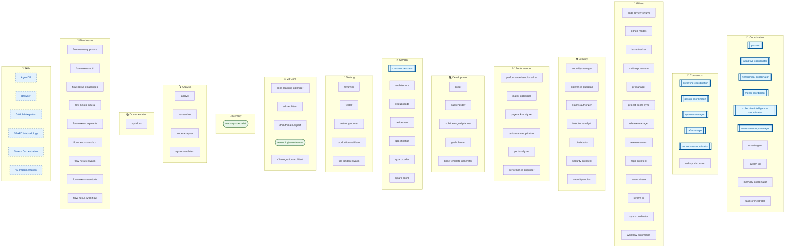

# Agent Hierarchy

This diagram shows the agent hierarchy organized by category.

```mermaid
%%{init: {"theme": "default", "themeVariables": {"fontSize": "14px"}}}%%
graph TB
    %% Agent Hierarchy - Category View

    subgraph coordination["👑 Coordination"]
        planner[["planner"]]
        adaptive_coordinator[["adaptive-coordinator"]]
        hierarchical_coordinator[["hierarchical-coordinator"]]
        mesh_coordinator[["mesh-coordinator"]]
        collective_intelligence_coordinator[["collective-intelligence-coordinator"]]
        swarm_memory_manager[["swarm-memory-manager"]]
        smart_agent["smart-agent"]
        swarm_init["swarm-init"]
        memory_coordinator["memory-coordinator"]
        task_orchestrator["task-orchestrator"]
    end

    subgraph consensus["🤝 Consensus"]
        byzantine_coordinator[["byzantine-coordinator"]]
        gossip_coordinator[["gossip-coordinator"]]
        quorum_manager[["quorum-manager"]]
        raft_manager[["raft-manager"]]
        consensus_coordinator[["consensus-coordinator"]]
        crdt_synchronizer["crdt-synchronizer"]
    end

    subgraph github["🐙 GitHub"]
        code_review_swarm["code-review-swarm"]
        github_modes["github-modes"]
        issue_tracker["issue-tracker"]
        multi_repo_swarm["multi-repo-swarm"]
        pr_manager["pr-manager"]
        project_board_sync["project-board-sync"]
        release_manager["release-manager"]
        release_swarm["release-swarm"]
        repo_architect["repo-architect"]
        swarm_issue["swarm-issue"]
        swarm_pr["swarm-pr"]
        sync_coordinator["sync-coordinator"]
        workflow_automation["workflow-automation"]
    end

    subgraph security["🔒 Security"]
        security_manager["security-manager"]
        aidefence_guardian["aidefence-guardian"]
        claims_authorizer["claims-authorizer"]
        injection_analyst["injection-analyst"]
        pii_detector["pii-detector"]
        security_architect["security-architect"]
        security_auditor["security-auditor"]
    end

    subgraph performance["📈 Performance"]
        performance_benchmarker["performance-benchmarker"]
        matrix_optimizer["matrix-optimizer"]
        pagerank_analyzer["pagerank-analyzer"]
        performance_optimizer["performance-optimizer"]
        perf_analyzer["perf-analyzer"]
        performance_engineer["performance-engineer"]
    end

    subgraph development["💻 Development"]
        coder["coder"]
        backend_dev["backend-dev"]
        sublinear_goal_planner["sublinear-goal-planner"]
        goal_planner["goal-planner"]
        base_template_generator["base-template-generator"]
    end

    subgraph sparc["⚡ SPARC"]
        sparc_orchestrator[["sparc-orchestrator"]]
        sparc_architecture["architecture"]
        sparc_pseudocode["pseudocode"]
        sparc_refinement["refinement"]
        sparc_specification["specification"]
        sparc_coder["sparc-coder"]
        sparc_coord["sparc-coord"]
    end

    subgraph testing["🧪 Testing"]
        reviewer["reviewer"]
        tester["tester"]
        test_long_runner["test-long-runner"]
        production_validator["production-validator"]
        tdd_london_swarm["tdd-london-swarm"]
    end

    subgraph v3_core["🚀 V3 Core"]
        sona_learning_optimizer["sona-learning-optimizer"]
        adr_architect["adr-architect"]
        ddd_domain_expert["ddd-domain-expert"]
        reasoningbank_learner(["reasoningbank-learner"])
        v3_integration_architect["v3-integration-architect"]
    end

    subgraph memory["🧠 Memory"]
        memory_specialist(["memory-specialist"])
    end

    subgraph analysis["🔍 Analysis"]
        analyst["analyst"]
        researcher["researcher"]
        code_analyzer["code-analyzer"]
        system_architect["system-architect"]
    end

    subgraph documentation["📚 Documentation"]
        api_docs["api-docs"]
    end

    subgraph flow_nexus["🌊 Flow Nexus"]
        flow_nexus_app_store["flow-nexus-app-store"]
        flow_nexus_auth["flow-nexus-auth"]
        flow_nexus_challenges["flow-nexus-challenges"]
        flow_nexus_neural["flow-nexus-neural"]
        flow_nexus_payments["flow-nexus-payments"]
        flow_nexus_sandbox["flow-nexus-sandbox"]
        flow_nexus_swarm["flow-nexus-swarm"]
        flow_nexus_user_tools["flow-nexus-user-tools"]
        flow_nexus_workflow["flow-nexus-workflow"]
    end

    %% Skills
    subgraph skills["🎯 Skills"]
        skill_agentdb["AgentDB"]
        skill_browser["Browser"]
        skill_github["GitHub Integration"]
        skill_sparc["SPARC Methodology"]
        skill_swarm["Swarm Orchestration"]
        skill_v3["V3 Implementation"]
    end

    %% Styling
    classDef coordinator fill:#e1f5fe,stroke:#01579b,stroke-width:3px,color:#01579b
    classDef worker fill:#f3e5f5,stroke:#4a148c,color:#4a148c
    classDef specialist fill:#e8f5e9,stroke:#1b5e20,color:#1b5e20
    classDef skill fill:#e3f2fd,stroke:#0d47a1,stroke-dasharray:5 5,color:#0d47a1

    class planner,adaptive_coordinator,hierarchical_coordinator,mesh_coordinator coordinator
    class collective_intelligence_coordinator,swarm_memory_manager,sparc_orchestrator coordinator
    class byzantine_coordinator,gossip_coordinator,quorum_manager,raft_manager,consensus_coordinator coordinator
    class memory_specialist,reasoningbank_learner specialist
    class skill_agentdb,skill_browser,skill_github,skill_sparc,skill_swarm,skill_v3 skill
```

---

Generated by [AgentScope](https://github.com/vipasane/agentscope)
