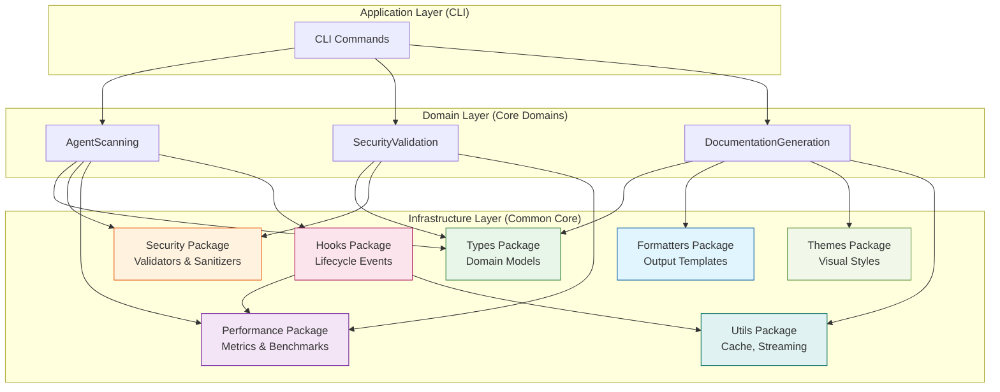
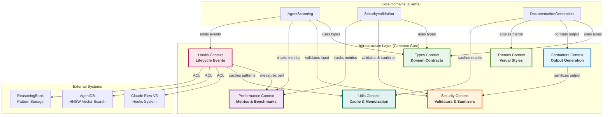

# DDD-004: Common Core Packages - JSDoc Domain Model

**Status:** Proposed
**Created:** 2026-01-26
**Author:** DDD Domain Expert Agent
**Domain:** JSDoc Documentation for Common Core Infrastructure
**Related:** [DDD-003: Learning-Enhanced Domain Model](../adr/DDD-003-learning-enhanced-domain-model.md)

---

## Executive Summary

This document defines the Domain-Driven Design specification for AgentScope's **8 common core packages**, focusing on how JSDoc documentation enhances domain understanding and developer experience. These packages form the foundational infrastructure layer that all core domains depend upon.

**Key Innovation**: JSDoc is not just documentation - it's the **ubiquitous language** encoded in TypeScript types, serving as executable domain contracts that enforce consistency across 73 TypeScript modules.

---

## Table of Contents

1. [Strategic Overview](#1-strategic-overview)
2. [Bounded Contexts (8 Packages)](#2-bounded-contexts-8-packages)
3. [Context Map](#3-context-map)
4. [Domain Model](#4-domain-model)
5. [Ubiquitous Language (JSDoc Standards)](#5-ubiquitous-language-jsdoc-standards)
6. [Value Objects](#6-value-objects)
7. [Integration Events](#7-integration-events)
8. [Anti-Corruption Layer](#8-anti-corruption-layer)
9. [JSDoc Best Practices](#9-jsdoc-best-practices)
10. [Implementation Guidelines](#10-implementation-guidelines)

---

## 1. Strategic Overview

### 1.1 Package Classification

| Package | Type | Purpose | JSDoc Focus |
|---------|------|---------|-------------|
| **Types** | Generic | Core type definitions | Type contracts, constraints |
| **Security** | Supporting | Input validation, sanitization | Security contracts, threat models |
| **Performance** | Supporting | Metrics, benchmarking, caching | Performance targets, SLAs |
| **CLI** | Generic | Command-line interface framework | Command contracts, help text |
| **Formatters** | Supporting | Output formatting, templates | Formatting contracts, examples |
| **Hooks** | Supporting | Lifecycle hooks, learning triggers | Hook protocols, event contracts |
| **Themes** | Supporting | Visual styling system | Theme contracts, palettes |
| **Utils** | Generic | Shared utilities (cache, streaming) | Utility contracts, usage patterns |

### 1.2 Infrastructure Layer Position



---

## 2. Bounded Contexts (8 Packages)

### 2.1 Types Context (Generic Domain)

**Purpose:** Define shared type contracts for all domains.

**Responsibilities:**
- Core domain entity types (Agent, Skill, Hook, Command, McpServer, Plugin, Permission)
- Value object types (ErrorSeverity, AgentType, HookEvent)
- Configuration types (AgentScopeConfig, ScanOptions, GeneratorOptions)
- Metadata types (ScanMetadata, ScanError)

**Key Types:**

```typescript
/**
 * Types Context - Core Domain Contracts
 *
 * @module core/model/types
 * @domain Types
 * @boundedContext Infrastructure Layer
 */

/**
 * Agent Entity
 *
 * Represents an AI agent with capabilities and relationships.
 *
 * @invariant name must be unique within configuration
 * @invariant delegatesTo references must exist in agents array
 * @invariant path must be valid file system path
 *
 * @example
 * ```typescript
 * const agent: Agent = {
 *   name: "coordinator",
 *   path: "/skills/coordinator.md",
 *   description: "Orchestrates multi-agent workflows",
 *   tools: ["bash", "task"],
 *   delegatesTo: ["coder", "tester"],
 *   type: "coordinator",
 *   category: "coordination"
 * };
 * ```
 */
export interface Agent {
  /** Unique identifier for the agent */
  name: string;
  /** File path where the agent is defined */
  path: string;
  /** Human-readable description */
  description?: string;
  /** Tools/capabilities available to this agent */
  tools?: string[];
  /** Other agents this agent can delegate to */
  delegatesTo?: string[];
  /** Agent type classification */
  type?: AgentType;
  /** Category for multi-file organization (v1.2) */
  category?: string;
  /** Custom metadata */
  metadata?: Record<string, unknown>;
}

/**
 * Aggregate Root: AgentScopeConfiguration
 *
 * Central aggregate containing all scanned entities.
 *
 * @invariant All agent names must be unique
 * @invariant All delegation targets must reference existing agents
 * @invariant All MCP server URLs must be secure (https://)
 * @invariant Hook commands must not contain shell injection patterns
 *
 * @example
 * ```typescript
 * const config: AgentScopeConfig = {
 *   agents: [coordinatorAgent, coderAgent],
 *   skills: [commitSkill, prSkill],
 *   hooks: [preEditHook, postTaskHook],
 *   commands: [scanCommand, validateCommand],
 *   mcpServers: [claudeFlowServer],
 *   plugins: [githubPlugin],
 *   permissions: [bashPermission],
 *   metadata: {
 *     scannedAt: new Date(),
 *     rootPath: "/workspaces/project",
 *     version: "0.1.0",
 *     duration: 234,
 *     filesScanned: 12,
 *     errors: []
 *   }
 * };
 * ```
 */
export interface AgentScopeConfig {
  agents: Agent[];
  skills: Skill[];
  hooks: Hook[];
  commands: Command[];
  mcpServers: McpServer[];
  plugins: Plugin[];
  permissions: Permission[];
  metadata: ScanMetadata;
}
```

**Ubiquitous Language:**
- **Entity**: Object with identity (Agent, Skill, Hook)
- **Value Object**: Immutable descriptor (ErrorSeverity, AgentType)
- **Aggregate Root**: Consistency boundary (AgentScopeConfig)
- **Invariant**: Business rule that must always be true

---

### 2.2 Security Context (Supporting Domain)

**Purpose:** Protect against injection attacks, path traversal, and malicious input.

**Responsibilities:**
- Input validation (theme names, colors, agent counts, patterns)
- Output sanitization (IDs, labels, paths, markdown)
- Entity validation (hooks, plugins, permissions, commands)
- Entity sanitization (shell commands, file paths, sensitive data)

**Key Services:**

```typescript
/**
 * Security Context - Input Validation & Output Sanitization
 *
 * @module core/security
 * @domain Security
 * @boundedContext Supporting Domain
 * @threat-model Prompt Injection, Path Traversal, Command Injection
 */

/**
 * Validate theme name against allowlist
 *
 * Prevents Mermaid injection via malicious theme names.
 *
 * @param theme - Theme name to validate
 * @returns Validation result with security score
 *
 * @security-contract Must reject themes not in THEME_ALLOWLIST
 * @security-contract Must reject themes containing Mermaid directives
 *
 * @example
 * ```typescript
 * // Valid theme
 * validateThemeName("default"); // { valid: true, score: 1.0 }
 *
 * // Invalid theme (injection attempt)
 * validateThemeName("default%%{init: {'flowchart': {'htmlLabels': false}}}%%");
 * // { valid: false, score: 0.0, issues: [...] }
 * ```
 */
export function validateThemeName(
  theme: string
): ValidationResult;

/**
 * Sanitize node label for Mermaid diagram
 *
 * Removes control characters, limits length, escapes special chars.
 *
 * @param label - Raw label text
 * @param maxLength - Maximum length (default: 50)
 * @returns Sanitized label safe for Mermaid
 *
 * @security-contract Must remove control characters (\n, \r, \t)
 * @security-contract Must escape Mermaid special chars (", %, [, ])
 * @security-contract Must truncate to maxLength
 *
 * @example
 * ```typescript
 * sanitizeNodeLabel("User\nInput"); // "User Input"
 * sanitizeNodeLabel('Evil"Quote'); // "Evil\\"Quote"
 * sanitizeNodeLabel("A".repeat(100), 50); // "AAAA...AA (truncated)"
 * ```
 */
export function sanitizeNodeLabel(
  label: string,
  maxLength?: number
): string;

/**
 * Validate hook configuration
 *
 * Checks for command injection, path traversal, and dangerous tools.
 *
 * @param hook - Hook configuration to validate
 * @returns Validation result with issues
 *
 * @security-contract Must detect command injection patterns (;, &&, |, $())
 * @security-contract Must detect path traversal patterns (../, ..\)
 * @security-contract Must flag dangerous tools (rm, curl, wget, eval)
 * @security-contract Must enforce timeout bounds (1000ms - 300000ms)
 *
 * @example
 * ```typescript
 * const hook: Hook = {
 *   event: "pre-edit",
 *   command: "rm -rf / && echo hacked"
 * };
 *
 * const result = validateHook(hook);
 * // {
 * //   valid: false,
 * //   errors: [{ severity: "critical", message: "Command injection detected" }]
 * // }
 * ```
 */
export function validateHook(
  hook: Hook
): ValidationResult;
```

**Security Value Objects:**

```typescript
/**
 * Validation Result
 *
 * @valueobject Immutable validation outcome
 */
export interface ValidationResult {
  valid: boolean;
  securityScore: number;
  errors: ValidationError[];
  warnings: ValidationWarning[];
}

/**
 * Validation Error
 *
 * @valueobject Immutable error descriptor
 */
export interface ValidationError {
  severity: 'critical' | 'warning' | 'info';
  code: string;
  message: string;
  location?: string;
  remediation?: string;
}
```

---

### 2.3 Performance Context (Supporting Domain)

**Purpose:** Measure, track, and optimize execution performance.

**Responsibilities:**
- Execution time measurement (async and sync)
- Memory usage tracking
- Benchmarking with statistical analysis
- Caching with hit rate tracking
- Performance target validation

**Key Services:**

```typescript
/**
 * Performance Context - Metrics, Benchmarks, Targets
 *
 * @module utils/performance
 * @domain Performance
 * @boundedContext Supporting Domain
 * @sla Scan: <5s for <50 components, Memory: <100MB, Diagrams: <1s
 */

/**
 * Performance Targets from PRD
 *
 * @constant
 * @sla These are contractual obligations, not guidelines
 */
export const PERFORMANCE_TARGETS = {
  /** Scan should complete in <5s for <50 components */
  SCAN_MAX_MS: 5000,
  SCAN_MAX_COMPONENTS: 50,

  /** Memory usage should be <100MB for typical projects */
  MEMORY_MAX_BYTES: 100 * 1024 * 1024,

  /** Diagram generation should be <1s per diagram */
  DIAGRAM_MAX_MS: 1000,
} as const;

/**
 * Measure execution time and memory usage
 *
 * @template T - Return type of measured function
 * @param operation - Human-readable operation name
 * @param fn - Async function to measure
 * @returns Result and performance metrics
 *
 * @performance Forces garbage collection before measurement
 * @performance Tracks heap memory delta
 *
 * @example
 * ```typescript
 * const { result, metrics } = await measurePerformance(
 *   "scan-project",
 *   async () => await scan({ rootPath: "/project" })
 * );
 *
 * console.log(`Scan took ${metrics.durationMs}ms`);
 * console.log(`Memory used: ${metrics.memoryDeltaBytes / 1024 / 1024}MB`);
 * ```
 */
export async function measurePerformance<T>(
  operation: string,
  fn: () => Promise<T>
): Promise<{ result: T; metrics: PerformanceMetrics }>;

/**
 * Benchmark a function with statistical analysis
 *
 * Runs warmup iterations, then measures multiple runs.
 *
 * @template T - Return type of benchmarked function
 * @param name - Benchmark name
 * @param fn - Function to benchmark
 * @param options - Benchmark configuration
 * @returns Statistical summary (min, max, avg, p95, p99)
 *
 * @performance Warmup runs prevent JIT bias
 * @performance Multiple iterations provide statistical significance
 *
 * @example
 * ```typescript
 * const result = await benchmark(
 *   "diagram-generation",
 *   async () => await generateComponentMap(config),
 *   { iterations: 100, warmupIterations: 10, targetMaxMs: 1000 }
 * );
 *
 * console.log(`P95 latency: ${result.summary.p95Ms}ms`);
 * console.log(`Target passed: ${result.target.passed}`);
 * ```
 */
export async function benchmark<T>(
  name: string,
  fn: () => Promise<T>,
  options?: {
    iterations?: number;
    warmupIterations?: number;
    targetMaxMs?: number;
  }
): Promise<BenchmarkResult>;

/**
 * LRU Cache with performance tracking
 *
 * Automatically evicts oldest entries when max size reached.
 *
 * @template K - Key type
 * @template V - Value type
 *
 * @performance O(1) get and set operations
 * @performance Tracks hit rate for optimization
 *
 * @example
 * ```typescript
 * const cache = new PerformanceCache<string, Agent>(1000);
 *
 * cache.set("coordinator", coordinatorAgent);
 * const agent = cache.get("coordinator"); // Hit
 *
 * const stats = cache.getStats();
 * console.log(`Hit rate: ${stats.hitRate * 100}%`);
 * ```
 */
export class PerformanceCache<K, V> {
  constructor(maxSize?: number);
  get(key: K): V | undefined;
  set(key: K, value: V): void;
  has(key: K): boolean;
  clear(): void;
  getStats(): CacheStats;
}
```

**Performance Value Objects:**

```typescript
/**
 * Performance Metrics
 *
 * @valueobject Immutable performance measurement
 */
export interface PerformanceMetrics {
  operation: string;
  startTime: number;
  endTime: number;
  durationMs: number;
  memoryUsedBytes: number;
  memoryDeltaBytes: number;
}

/**
 * Benchmark Result
 *
 * @valueobject Immutable statistical summary
 */
export interface BenchmarkResult {
  name: string;
  metrics: PerformanceMetrics[];
  summary: {
    minMs: number;
    maxMs: number;
    avgMs: number;
    medianMs: number;
    p95Ms: number;
    p99Ms: number;
    stdDevMs: number;
    iterations: number;
  };
  target: {
    maxMs: number;
    passed: boolean;
  };
}

/**
 * Cache Statistics
 *
 * @valueobject Immutable cache performance snapshot
 */
export interface CacheStats {
  hits: number;
  misses: number;
  hitRate: number;
  size: number;
  maxSize: number;
  evictions: number;
  predictiveHits?: number;
  hotKeys?: Array<{ key: any; count: number }>;
}
```

---

### 2.4 CLI Context (Generic Domain)

**Purpose:** Command-line interface framework for user interaction.

**Responsibilities:**
- Command registration and parsing
- Help text generation
- Colored output formatting
- Error handling and user feedback

**Key Types:**

```typescript
/**
 * CLI Context - Command Framework
 *
 * @module cli
 * @domain CLI
 * @boundedContext Generic Infrastructure
 */

/**
 * CLI Command Registration
 *
 * @example
 * ```typescript
 * program
 *   .command('scan [path]')
 *   .description('Scan project for agent configurations')
 *   .option('-o, --output <dir>', 'Output directory')
 *   .option('--format <type>', 'Output format (markdown|json)')
 *   .action(async (path, options) => {
 *     const result = await scanAndGenerate({ rootPath: path });
 *     console.log(chalk.green('✓ Scan complete'));
 *   });
 * ```
 */
```

---

### 2.5 Formatters Context (Supporting Domain)

**Purpose:** Generate formatted output (markdown, tables, diagrams).

**Responsibilities:**
- Document building (sections, navigation, TOC)
- Legend generation (standard, compact, category-filtered)
- Relationship analysis (delegations, tool usage, circular dependencies)
- Section formatters (agents, skills, servers, hooks, commands, plugins, permissions)
- Sanitization utilities (escape, truncate, anchor IDs)

**Key Services:**

```typescript
/**
 * Formatters Context - Output Generation
 *
 * @module core/formatters
 * @domain Formatters
 * @boundedContext Supporting Domain
 */

/**
 * Document Builder
 *
 * Fluent API for building structured markdown documents.
 *
 * @example
 * ```typescript
 * const doc = new DocumentBuilder({ includeTimestamp: true })
 *   .addTitle("Agent Architecture")
 *   .addSection({
 *     id: "quick-stats",
 *     title: "Quick Stats",
 *     content: formatQuickStats({
 *       agents: config.agents,
 *       skills: config.skills,
 *       servers: config.mcpServers
 *     }),
 *     level: 2
 *   })
 *   .addSection({
 *     id: "agents",
 *     title: "Agents",
 *     content: formatAgentsComparisonTable(config.agents),
 *     level: 2
 *   })
 *   .build();
 * ```
 */
export class DocumentBuilder {
  constructor(options?: DocumentBuilderOptions);
  addTitle(title: string): this;
  addSection(section: DocumentSection): this;
  addSeparator(): this;
  build(): string;
}

/**
 * Format hooks section with matcher, type, and details
 *
 * @param hooks - Array of hook configurations
 * @param options - Formatting options
 * @returns Markdown table with hook details
 *
 * @example
 * ```typescript
 * const markdown = formatHooksSection(config.hooks, {
 *   includeDisabled: false,
 *   maxCommandLength: 80
 * });
 *
 * // | Event | Type | Matcher | Command | Timeout |
 * // |-------|------|---------|---------|---------|
 * // | pre-edit | command | *.ts | eslint --fix | 30s |
 * ```
 */
export function formatHooksSection(
  hooks: Hook[],
  options?: FormatterOptions
): string;

/**
 * Generate delegation chain list
 *
 * Shows hierarchical delegation relationships.
 *
 * @param config - Full configuration
 * @returns Markdown list of delegation chains
 *
 * @example
 * ```typescript
 * const chains = generateDelegationChainList(config);
 *
 * // - coordinator → coder → tester
 * // - coordinator → reviewer
 * // - sparc-coord → architect → designer
 * ```
 */
export function generateDelegationChainList(
  config: AgentScopeConfig
): string;

/**
 * Find circular delegations (potential deadlocks)
 *
 * @param config - Full configuration
 * @returns Array of circular delegation chains
 *
 * @example
 * ```typescript
 * const circular = findCircularDelegations(config);
 * // [
 * //   ["agent-a", "agent-b", "agent-a"],
 * //   ["coordinator", "worker", "coordinator"]
 * // ]
 * ```
 */
export function findCircularDelegations(
  config: AgentScopeConfig
): string[][];

/**
 * Sanitize text for safe markdown/Mermaid output
 *
 * @param text - Raw text
 * @param maxLength - Max length before truncation
 * @returns Sanitized text
 *
 * @security Removes control characters
 * @security Escapes special characters
 * @security Truncates to prevent diagram overflow
 *
 * @example
 * ```typescript
 * sanitize("User\nInput"); // "User Input"
 * sanitize("Very long text...", 20); // "Very long text... (truncated)"
 * ```
 */
export function sanitize(
  text: string,
  maxLength?: number
): string;

/**
 * Convert text to valid anchor ID
 *
 * @param text - Section title
 * @returns URL-safe anchor ID
 *
 * @example
 * ```typescript
 * toAnchorId("Quick Stats"); // "quick-stats"
 * toAnchorId("Agent Categories (v1.2)"); // "agent-categories-v12"
 * ```
 */
export function toAnchorId(text: string): string;
```

**Formatter Value Objects:**

```typescript
/**
 * Document Section
 *
 * @valueobject Immutable section descriptor
 */
export interface DocumentSection {
  id: string;
  title: string;
  content: string;
  anchor?: string;
  level?: number;
}

/**
 * Navigation Item
 *
 * @valueobject Immutable TOC entry
 */
export interface NavigationItem {
  label: string;
  anchor: string;
  level: number;
  children?: NavigationItem[];
}

/**
 * Legend Entry
 *
 * @valueobject Immutable symbol descriptor
 */
export interface LegendEntry {
  symbol: string;
  meaning: string;
  category: 'agent' | 'server' | 'connection' | 'other';
}
```

---

### 2.6 Hooks Context (Supporting Domain)

**Purpose:** Lifecycle hooks for learning and coordination.

**Responsibilities:**
- Pre-generate validation and caching
- Post-generate pattern storage and learning
- Security validation scoring
- Quality metrics calculation
- Adaptive zoom level suggestions

**Key Types:**

```typescript
/**
 * Hooks Context - Lifecycle Events & Learning
 *
 * @module core/hooks
 * @domain Hooks
 * @boundedContext Supporting Domain
 * @integration Claude Flow V3 Hooks, AgentDB, ReasoningBank
 */

/**
 * Pre-Generate Hook Input
 *
 * Executed before diagram generation for validation and optimization.
 *
 * @valueobject Immutable input context
 *
 * @example
 * ```typescript
 * const input: PreGenerateHookInput = {
 *   config: agentScopeConfig,
 *   options: { level: "category", theme: "default" },
 *   requestId: "gen-123",
 *   context: {
 *     timestamp: Date.now(),
 *     caller: "CLI",
 *     version: "0.1.0"
 *   }
 * };
 * ```
 */
export interface PreGenerateHookInput {
  config: AgentScopeConfig;
  options: ComponentMapOptions;
  requestId: string;
  context: {
    timestamp: number;
    caller: string;
    version: string;
  };
}

/**
 * Pre-Generate Hook Output
 *
 * Validation result and optimization suggestions.
 *
 * @valueobject Immutable validation result
 *
 * @example
 * ```typescript
 * const output: PreGenerateHookOutput = {
 *   validated: true,
 *   securityScore: 0.95,
 *   cachedResult: undefined, // Cache miss
 *   suggestedLevel: "category", // AI suggestion
 *   sanitizedOptions: { ...sanitizedOpts },
 *   warnings: []
 * };
 * ```
 */
export interface PreGenerateHookOutput {
  validated: boolean;
  securityScore: number;
  cachedResult?: string;
  suggestedLevel?: ZoomLevel;
  sanitizedOptions: ComponentMapOptions;
  warnings: string[];
}

/**
 * Post-Generate Hook Input
 *
 * Executed after diagram generation for learning and storage.
 *
 * @valueobject Immutable generation result
 *
 * @example
 * ```typescript
 * const input: PostGenerateHookInput = {
 *   requestId: "gen-123",
 *   input: preGenerateInput,
 *   output: {
 *     diagram: "graph TB\n  ...",
 *     generationTimeMs: 234,
 *     nodeCount: 42,
 *     edgeCount: 38
 *   },
 *   success: true
 * };
 * ```
 */
export interface PostGenerateHookInput {
  requestId: string;
  input: PreGenerateHookInput;
  output: {
    diagram: string;
    generationTimeMs: number;
    nodeCount: number;
    edgeCount: number;
  };
  success: boolean;
  error?: Error;
}

/**
 * Post-Generate Hook Output
 *
 * Learning feedback and pattern storage result.
 *
 * @valueobject Immutable learning result
 *
 * @example
 * ```typescript
 * const output: PostGenerateHookOutput = {
 *   stored: true,
 *   patternId: "pattern-abc123",
 *   qualityScore: 0.87,
 *   learningFeedback: {
 *     shouldCache: true,
 *     suggestedOptimizations: [
 *       "Consider 'compact' mode for >50 agents",
 *       "Category view optimal for this distribution"
 *     ]
 *   }
 * };
 * ```
 */
export interface PostGenerateHookOutput {
  stored: boolean;
  patternId?: string;
  qualityScore: number;
  learningFeedback: {
    shouldCache: boolean;
    suggestedOptimizations: string[];
  };
}

/**
 * Generation Pattern (Learning Memory)
 *
 * Stored pattern for future optimization.
 *
 * @entity Has identity (id), tracks usage over time
 *
 * @example
 * ```typescript
 * const pattern: GenerationPattern = {
 *   id: "pattern-abc123",
 *   inputSignature: {
 *     agentCount: 42,
 *     categoryDistribution: { coordination: 5, development: 20, testing: 10 },
 *     level: "category",
 *     theme: "default"
 *   },
 *   outputMetrics: {
 *     lineCount: 156,
 *     nodeCount: 42,
 *     edgeCount: 38,
 *     generationTimeMs: 234
 *   },
 *   qualityScore: 0.87,
 *   successRate: 0.95,
 *   usageCount: 12,
 *   lastUsed: Date.now()
 * };
 * ```
 */
export interface GenerationPattern {
  id: string;
  inputSignature: {
    agentCount: number;
    categoryDistribution: Record<string, number>;
    level: ZoomLevel;
    theme: string;
  };
  outputMetrics: {
    lineCount: number;
    nodeCount: number;
    edgeCount: number;
    generationTimeMs: number;
  };
  qualityScore: number;
  successRate: number;
  usageCount: number;
  lastUsed: number;
}
```

---

### 2.7 Themes Context (Supporting Domain)

**Purpose:** Visual styling for generated diagrams.

**Responsibilities:**
- Theme palette management (light, dark, high-contrast, colorblind)
- Theme registry and loader
- Mermaid theme generation
- Accessibility compliance

**Key Services:**

```typescript
/**
 * Themes Context - Visual Styling System
 *
 * @module core/themes
 * @domain Themes
 * @boundedContext Supporting Domain
 * @accessibility WCAG 2.1 AA compliant
 */

/**
 * Theme Palette
 *
 * @valueobject Immutable color scheme
 *
 * @example
 * ```typescript
 * const lightTheme: ThemePalette = {
 *   name: "light",
 *   displayName: "Light",
 *   primary: "#1976d2",
 *   secondary: "#dc004e",
 *   background: "#ffffff",
 *   text: "#000000",
 *   agent: "#90caf9",
 *   server: "#ffb74d",
 *   skill: "#81c784",
 *   accent: "#9575cd",
 *   accessibility: {
 *     level: "AA",
 *     contrastRatio: 4.5
 *   }
 * };
 * ```
 */
export interface ThemePalette {
  name: ThemeName;
  displayName: string;
  primary: string;
  secondary: string;
  background: string;
  text: string;
  agent: string;
  server: string;
  skill: string;
  accent: string;
  accessibility: {
    level: 'AA' | 'AAA';
    contrastRatio: number;
  };
}

/**
 * Generate Mermaid initialization script
 *
 * @param palette - Theme palette
 * @returns Mermaid %%init%% directive
 *
 * @example
 * ```typescript
 * const init = generateMermaidInit(lightTheme);
 * // %%{init: {'theme':'base','themeVariables':{...}}}%%
 * ```
 */
export function generateMermaidInit(
  palette: ThemePalette
): string;

/**
 * Resolve theme from name or file path
 *
 * @param theme - Theme name or file path
 * @param themePath - Optional custom theme path
 * @returns Resolved theme palette
 *
 * @example
 * ```typescript
 * const palette = await resolveTheme("dark"); // Built-in
 * const custom = await resolveTheme(undefined, "./custom-theme.json");
 * ```
 */
export async function resolveTheme(
  theme?: string,
  themePath?: string
): Promise<ThemePalette>;
```

**Built-in Themes:**
- `default` / `light` - Standard light theme (WCAG AA)
- `dark` - Dark mode theme (WCAG AA)
- `high-contrast-light` - High contrast light (WCAG AAA)
- `high-contrast-dark` - High contrast dark (WCAG AAA)
- `colorblind-light` - Colorblind-friendly light (deuteranopia/protanopia)
- `colorblind-dark` - Colorblind-friendly dark

---

### 2.8 Utils Context (Generic Domain)

**Purpose:** Shared utility functions for caching, streaming, and performance.

**Responsibilities:**
- LRU cache implementation
- TTL cache with expiration
- File cache with mtime tracking
- Computation cache with hash keys
- Memoization decorators

**Key Services:**

```typescript
/**
 * Utils Context - Shared Utilities
 *
 * @module utils
 * @domain Utils
 * @boundedContext Generic Infrastructure
 */

/**
 * LRU Cache
 *
 * Least Recently Used cache with automatic eviction.
 *
 * @template K - Key type
 * @template V - Value type
 *
 * @performance O(1) get and set operations
 *
 * @example
 * ```typescript
 * const cache = new LRUCache<string, Agent>(1000);
 *
 * cache.set("coordinator", coordinatorAgent);
 * const agent = cache.get("coordinator"); // Hit
 * const missing = cache.get("unknown"); // Miss, returns undefined
 *
 * const stats = cache.getStats();
 * console.log(`Hit rate: ${stats.hitRate * 100}%`);
 * console.log(`Evictions: ${stats.evictions}`);
 * ```
 */
export class LRUCache<K, V> {
  constructor(maxSize?: number);
  get(key: K): V | undefined;
  set(key: K, value: V): void;
  has(key: K): boolean;
  delete(key: K): boolean;
  clear(): void;
  getStats(): CacheStats;
  resetStats(): void;
}

/**
 * File Cache with modification time tracking
 *
 * Only re-reads files that have been modified.
 *
 * @example
 * ```typescript
 * const cache = new FileCache();
 *
 * const content1 = await cache.get("CLAUDE.md"); // Read from disk
 * const content2 = await cache.get("CLAUDE.md"); // Cache hit (same mtime)
 *
 * // File modified externally
 * const content3 = await cache.get("CLAUDE.md"); // Re-read from disk
 *
 * const stats = cache.getStats();
 * console.log(`Hit rate: ${stats.hitRate * 100}%`);
 * ```
 */
export class FileCache {
  async get(filePath: string): Promise<string | null>;
  getSync(filePath: string): string | null;
  invalidate(filePath: string): void;
  invalidateDirectory(dirPath: string): void;
  clear(): void;
  getStats(): { hits: number; misses: number; reads: number; errors: number; hitRate: number };
}

/**
 * Memoization decorator
 *
 * Caches function results based on arguments.
 *
 * @template T - Function type
 * @param fn - Function to memoize
 * @param maxSize - Max cache entries
 * @returns Memoized function with cache
 *
 * @example
 * ```typescript
 * const expensiveCalc = memoize((a: number, b: number) => {
 *   console.log("Computing...");
 *   return a + b;
 * }, 100);
 *
 * expensiveCalc(2, 3); // "Computing..." → 5
 * expensiveCalc(2, 3); // (cached) → 5
 *
 * expensiveCalc.clearCache();
 * ```
 */
export function memoize<T extends (...args: Parameters<T>) => ReturnType<T>>(
  fn: T,
  maxSize?: number
): T & { cache: LRUCache<string, ReturnType<T>>; clearCache: () => void };

/**
 * Async memoization decorator
 *
 * Caches promise results, deduplicates concurrent requests.
 *
 * @template T - Async function type
 * @param fn - Async function to memoize
 * @param maxSize - Max cache entries
 * @returns Memoized async function with cache
 *
 * @example
 * ```typescript
 * const fetchData = memoizeAsync(async (id: string) => {
 *   const response = await fetch(`/api/${id}`);
 *   return response.json();
 * }, 50);
 *
 * // Both requests deduplicated to single fetch
 * const [result1, result2] = await Promise.all([
 *   fetchData("123"),
 *   fetchData("123")
 * ]);
 * ```
 */
export function memoizeAsync<T extends (...args: Parameters<T>) => Promise<Awaited<ReturnType<T>>>>(
  fn: T,
  maxSize?: number
): T & { cache: LRUCache<string, Awaited<ReturnType<T>>>; clearCache: () => void };
```

---

## 3. Context Map



**Context Relationships:**

| Upstream Context | Downstream Context | Relationship Pattern |
|------------------|-------------------|---------------------|
| Types | All contexts | **Published Language** - Defines shared vocabulary |
| Security | AgentScanning, SecurityValidation, Formatters | **Open Host Service** - Provides validation API |
| Performance | All contexts | **Open Host Service** - Provides measurement API |
| Formatters | DocumentationGeneration | **Customer-Supplier** - Formats docs on demand |
| Themes | DocumentationGeneration | **Conformist** - DG conforms to theme contracts |
| Hooks | External Learning Systems | **Anti-Corruption Layer** - Shields from external APIs |
| Utils | All contexts | **Shared Kernel** - Common utilities |

---

## 4. Domain Model

### 4.1 Entities

**Entities have identity and lifecycle:**

```typescript
/**
 * Agent Entity
 *
 * @entity Identity: name (unique within configuration)
 * @invariant name must be unique
 * @invariant delegatesTo references must exist
 */
interface Agent {
  name: string; // Identity
  path: string;
  description?: string;
  tools?: string[];
  delegatesTo?: string[];
  type?: AgentType;
  category?: string;
  metadata?: Record<string, unknown>;
}

/**
 * Skill Entity
 *
 * @entity Identity: name (unique within configuration)
 * @invariant name must be unique
 */
interface Skill {
  name: string; // Identity
  path: string;
  description?: string;
  triggers?: string[];
  dependencies?: string[];
  enabled?: boolean;
}

/**
 * Hook Entity
 *
 * @entity Identity: (event, path) pair
 * @invariant No duplicate (event, path) pairs
 * @invariant Command must not contain injection patterns
 */
interface Hook {
  event: HookEvent; // Part of identity
  path: string;     // Part of identity
  command?: string;
  workingDirectory?: string;
  timeout?: number;
  enabled?: boolean;
  metadata?: HookMetadata;
}

/**
 * Generation Pattern Entity
 *
 * @entity Identity: id (UUID)
 * @invariant usageCount monotonically increasing
 * @invariant successRate between 0.0 and 1.0
 */
interface GenerationPattern {
  id: string; // Identity (UUID)
  inputSignature: InputSignature;
  outputMetrics: OutputMetrics;
  qualityScore: number;
  successRate: number;
  usageCount: number;
  lastUsed: number;
}
```

### 4.2 Value Objects

**Value Objects are immutable and defined by attributes:**

```typescript
/**
 * Error Severity Value Object
 *
 * @valueobject Immutable severity level
 */
type ErrorSeverity = 'fatal' | 'warning' | 'info';

/**
 * Agent Type Value Object
 *
 * @valueobject Immutable agent classification
 */
type AgentType = 'coordinator' | 'worker' | 'specialist' | 'reviewer' | 'custom' | string;

/**
 * Zoom Level Value Object
 *
 * @valueobject Immutable detail level
 */
type ZoomLevel = 'summary' | 'category' | 'detail';

/**
 * Theme Name Value Object
 *
 * @valueobject Immutable theme identifier
 */
type ThemeName =
  | 'default' | 'light' | 'dark'
  | 'high-contrast-light' | 'high-contrast-dark'
  | 'colorblind-light' | 'colorblind-dark';

/**
 * Validation Result Value Object
 *
 * @valueobject Immutable validation outcome
 */
interface ValidationResult {
  readonly valid: boolean;
  readonly securityScore: number;
  readonly errors: readonly ValidationError[];
  readonly warnings: readonly ValidationWarning[];
}

/**
 * Performance Metrics Value Object
 *
 * @valueobject Immutable measurement snapshot
 */
interface PerformanceMetrics {
  readonly operation: string;
  readonly startTime: number;
  readonly endTime: number;
  readonly durationMs: number;
  readonly memoryUsedBytes: number;
  readonly memoryDeltaBytes: number;
}

/**
 * Cache Statistics Value Object
 *
 * @valueobject Immutable cache state snapshot
 */
interface CacheStats {
  readonly hits: number;
  readonly misses: number;
  readonly hitRate: number;
  readonly size: number;
  readonly maxSize: number;
  readonly evictions: number;
}

/**
 * Document Section Value Object
 *
 * @valueobject Immutable section descriptor
 */
interface DocumentSection {
  readonly id: string;
  readonly title: string;
  readonly content: string;
  readonly anchor?: string;
  readonly level?: number;
}

/**
 * Legend Entry Value Object
 *
 * @valueobject Immutable symbol descriptor
 */
interface LegendEntry {
  readonly symbol: string;
  readonly meaning: string;
  readonly category: 'agent' | 'server' | 'connection' | 'other';
}
```

### 4.3 Aggregate Roots

**Aggregate Root: AgentScopeConfiguration**

```typescript
/**
 * Aggregate Root: AgentScopeConfiguration
 *
 * Central consistency boundary for all scanned entities.
 *
 * @aggregateroot Controls access to all entities
 * @invariant All agent names unique
 * @invariant All delegation targets exist
 * @invariant All MCP URLs secure (https://)
 * @invariant Hook commands safe (no injection)
 */
interface AgentScopeConfiguration {
  // Entities
  readonly agents: Agent[];
  readonly skills: Skill[];
  readonly hooks: Hook[];
  readonly commands: Command[];
  readonly mcpServers: McpServer[];
  readonly plugins: Plugin[];
  readonly permissions: Permission[];

  // Value Objects
  readonly metadata: ScanMetadata;

  // Aggregate behaviors
  findAgentByName(name: string): Agent | undefined;
  validateDelegations(): ValidationResult;
  getAgentsByCategory(category: string): Agent[];
  getCircularDelegations(): string[][];
  calculateRelationships(): RelationshipSummary;
}
```

---

## 5. Ubiquitous Language (JSDoc Standards)

### 5.1 Core Terminology

| Term | JSDoc Tag | Meaning | Example |
|------|-----------|---------|---------|
| **Entity** | `@entity` | Object with identity | Agent, Skill, Hook |
| **Value Object** | `@valueobject` | Immutable descriptor | ErrorSeverity, ValidationResult |
| **Aggregate Root** | `@aggregateroot` | Consistency boundary | AgentScopeConfiguration |
| **Invariant** | `@invariant` | Business rule | "Agent names must be unique" |
| **Domain** | `@domain` | Bounded context | Security, Performance, Formatters |
| **Bounded Context** | `@boundedcontext` | Strategic boundary | Core, Supporting, Generic |

### 5.2 Security Terminology

| Term | JSDoc Tag | Meaning |
|------|-----------|---------|
| **Threat Model** | `@threat-model` | Attack vectors to defend against |
| **Security Contract** | `@security-contract` | Security guarantee provided |
| **Validation** | `@validation` | Input checking before processing |
| **Sanitization** | `@sanitization` | Output cleaning before display |

### 5.3 Performance Terminology

| Term | JSDoc Tag | Meaning |
|------|-----------|---------|
| **SLA** | `@sla` | Service Level Agreement (contractual) |
| **Performance Contract** | `@performance` | Performance guarantee |
| **Benchmark** | `@benchmark` | Repeatable performance test |
| **Target** | `@target` | Performance goal to achieve |

### 5.4 Documentation Terminology

| Term | JSDoc Tag | Meaning |
|------|-----------|---------|
| **Example** | `@example` | Code usage example |
| **Param** | `@param` | Function parameter |
| **Returns** | `@returns` | Function return value |
| **Template** | `@template` | Generic type parameter |
| **Module** | `@module` | Package/module identifier |

### 5.5 JSDoc Standard Template

```typescript
/**
 * [Brief one-line description]
 *
 * [Detailed multi-line explanation of purpose, behavior, and usage]
 *
 * @module [package/module-path]
 * @domain [Domain name]
 * @boundedcontext [Core/Supporting/Generic]
 *
 * @entity | @valueobject | @aggregateroot | @service
 * @invariant [Business rule that must always be true]
 * @invariant [Additional invariant]
 *
 * @security-contract [Security guarantee provided]
 * @performance [Performance characteristic]
 * @sla [Service level agreement]
 *
 * @template T - [Generic type description]
 * @param name - [Parameter description]
 * @returns [Return value description]
 * @throws [Exception type] [When thrown]
 *
 * @example
 * ```typescript
 * // Clear, executable code example
 * const result = doSomething({ option: true });
 * console.log(result); // Expected output
 * ```
 *
 * @see [Related types/functions]
 * @since [Version added]
 * @deprecated [Use alternative instead]
 */
```

---

## 6. Value Objects

### 6.1 Immutability Contract

All value objects must be:
1. **Immutable** - No setters, all fields readonly
2. **Self-validating** - Constructor validates invariants
3. **Equality by value** - Two VOs with same attributes are equal
4. **Side-effect free** - Methods return new instances

### 6.2 Value Object Examples

```typescript
/**
 * Error Severity Value Object
 *
 * @valueobject Immutable severity level
 * @invariant Must be one of: fatal, warning, info
 */
type ErrorSeverity = 'fatal' | 'warning' | 'info';

/**
 * Scan Error Value Object
 *
 * @valueobject Immutable error descriptor
 * @invariant message must not be empty
 * @invariant severity must be valid ErrorSeverity
 *
 * @example
 * ```typescript
 * const error: ScanError = {
 *   severity: 'warning',
 *   code: 'MISSING_DESCRIPTION',
 *   message: 'Agent "coordinator" missing description',
 *   file: '/skills/coordinator.md',
 *   line: 1,
 *   suggestion: 'Add a description field to the agent definition'
 * };
 * ```
 */
interface ScanError {
  readonly severity: ErrorSeverity;
  readonly code: string;
  readonly message: string;
  readonly file?: string;
  readonly line?: number;
  readonly suggestion?: string;
}

/**
 * Performance Targets Value Object
 *
 * @valueobject Immutable performance SLAs
 * @sla Scan: <5s for <50 components
 * @sla Memory: <100MB for typical projects
 * @sla Diagrams: <1s per diagram
 */
const PERFORMANCE_TARGETS = {
  SCAN_MAX_MS: 5000,
  SCAN_MAX_COMPONENTS: 50,
  MEMORY_MAX_BYTES: 100 * 1024 * 1024,
  DIAGRAM_MAX_MS: 1000,
} as const; // Immutable via 'as const'

/**
 * Theme Palette Value Object
 *
 * @valueobject Immutable color scheme
 * @invariant All colors must be valid hex codes
 * @invariant Contrast ratio must meet accessibility level
 *
 * @example
 * ```typescript
 * const lightTheme: ThemePalette = {
 *   name: "light",
 *   displayName: "Light",
 *   primary: "#1976d2",
 *   secondary: "#dc004e",
 *   background: "#ffffff",
 *   text: "#000000",
 *   agent: "#90caf9",
 *   server: "#ffb74d",
 *   skill: "#81c784",
 *   accent: "#9575cd",
 *   accessibility: {
 *     level: "AA",
 *     contrastRatio: 4.5
 *   }
 * };
 * ```
 */
interface ThemePalette {
  readonly name: ThemeName;
  readonly displayName: string;
  readonly primary: string;
  readonly secondary: string;
  readonly background: string;
  readonly text: string;
  readonly agent: string;
  readonly server: string;
  readonly skill: string;
  readonly accent: string;
  readonly accessibility: {
    readonly level: 'AA' | 'AAA';
    readonly contrastRatio: number;
  };
}
```

---

## 7. Integration Events

### 7.1 Pre-Generate Event

**Published by:** DocumentationGeneration
**Consumed by:** Hooks Context → Claude Flow V3

```typescript
/**
 * Pre-Generate Event
 *
 * @event Published before diagram generation
 * @integration Claude Flow V3 Hooks
 *
 * @example
 * ```bash
 * npx @claude-flow/cli@latest hooks pre-task --description "Generate component map"
 * # Returns: { validated: true, securityScore: 0.95, suggestedLevel: "category" }
 * ```
 */
interface PreGenerateEvent {
  type: 'PreGenerate';
  requestId: string;
  config: AgentScopeConfig;
  options: ComponentMapOptions;
  timestamp: number;
}
```

### 7.2 Post-Generate Event

**Published by:** DocumentationGeneration
**Consumed by:** Hooks Context → AgentDB, ReasoningBank

```typescript
/**
 * Post-Generate Event
 *
 * @event Published after successful diagram generation
 * @integration AgentDB (pattern storage), ReasoningBank (learning)
 *
 * @example
 * ```bash
 * npx @claude-flow/cli@latest hooks post-task \
 *   --task-id "gen-123" \
 *   --success true \
 *   --store-results true
 * # Stores pattern in AgentDB with HNSW indexing
 * ```
 */
interface PostGenerateEvent {
  type: 'PostGenerate';
  requestId: string;
  diagram: string;
  metrics: {
    generationTimeMs: number;
    nodeCount: number;
    edgeCount: number;
  };
  success: boolean;
  timestamp: number;
}
```

### 7.3 Pattern Storage Event

**Published by:** Hooks Context
**Consumed by:** AgentDB

```typescript
/**
 * Pattern Storage Event
 *
 * @event Store successful generation pattern for future optimization
 * @integration AgentDB HNSW vector search
 *
 * @example
 * ```bash
 * npx @claude-flow/cli@latest memory store \
 *   --namespace patterns \
 *   --key "gen-pattern-abc123" \
 *   --value '{"inputSignature": {...}, "outputMetrics": {...}}'
 * ```
 */
interface PatternStorageEvent {
  type: 'PatternStorage';
  patternId: string;
  pattern: GenerationPattern;
  timestamp: number;
}
```

### 7.4 Security Validation Event

**Published by:** Security Context
**Consumed by:** AgentScanning, SecurityValidation

```typescript
/**
 * Security Validation Event
 *
 * @event Published when validation completes
 * @security Reports validation results
 *
 * @example
 * ```typescript
 * const event: SecurityValidationEvent = {
 *   type: 'SecurityValidation',
 *   target: { type: 'hook', id: 'pre-edit-hook' },
 *   result: {
 *     valid: false,
 *     securityScore: 0.3,
 *     errors: [{ severity: 'critical', message: 'Command injection detected' }],
 *     warnings: []
 *   },
 *   timestamp: Date.now()
 * };
 * ```
 */
interface SecurityValidationEvent {
  type: 'SecurityValidation';
  target: { type: string; id: string };
  result: ValidationResult;
  timestamp: number;
}
```

---

## 8. Anti-Corruption Layer

### 8.1 Hooks Context ACL

The Hooks Context acts as an Anti-Corruption Layer between AgentScope and external learning systems.

```typescript
/**
 * Claude Flow Adapter
 *
 * @service Anti-Corruption Layer for Claude Flow V3 Hooks
 * @integration Translates AgentScope events to CLI commands
 *
 * @example
 * ```typescript
 * const adapter = new ClaudeFlowAdapter();
 *
 * // Internal event
 * const event: PreGenerateEvent = { ... };
 *
 * // Translated to external CLI call
 * const result = await adapter.executePreTask({
 *   description: `Generate ${event.options.level} diagram`,
 *   coordinateSwarm: false
 * });
 * ```
 */
class ClaudeFlowAdapter {
  async executePreTask(input: {
    description: string;
    coordinateSwarm?: boolean;
  }): Promise<PreGenerateHookOutput>;

  async executePostTask(input: {
    taskId: string;
    success: boolean;
    storeResults?: boolean;
  }): Promise<PostGenerateHookOutput>;
}

/**
 * AgentDB Adapter
 *
 * @service Anti-Corruption Layer for AgentDB
 * @integration Translates patterns to memory storage
 *
 * @example
 * ```typescript
 * const adapter = new AgentDBAdapter();
 *
 * // Internal pattern
 * const pattern: GenerationPattern = { ... };
 *
 * // Translated to AgentDB storage
 * await adapter.storePattern({
 *   namespace: 'patterns',
 *   key: pattern.id,
 *   value: pattern,
 *   tags: ['generation', 'diagram']
 * });
 * ```
 */
class AgentDBAdapter {
  async storePattern(input: {
    namespace: string;
    key: string;
    value: GenerationPattern;
    tags?: string[];
  }): Promise<{ stored: boolean; patternId: string }>;

  async searchPatterns(input: {
    query: string;
    namespace?: string;
    limit?: number;
  }): Promise<GenerationPattern[]>;
}

/**
 * ReasoningBank Adapter
 *
 * @service Anti-Corruption Layer for ReasoningBank
 * @integration Translates outcomes to trajectories
 *
 * @example
 * ```typescript
 * const adapter = new ReasoningBankAdapter();
 *
 * // Internal generation result
 * const result: PostGenerateEvent = { ... };
 *
 * // Translated to trajectory
 * await adapter.recordTrajectory({
 *   action: 'generate-diagram',
 *   verdict: result.success ? 'success' : 'failure',
 *   metadata: result.metrics
 * });
 * ```
 */
class ReasoningBankAdapter {
  async recordTrajectory(input: {
    action: string;
    verdict: 'success' | 'failure';
    metadata: Record<string, any>;
  }): Promise<{ stored: boolean; trajectoryId: string }>;
}
```

### 8.2 Security Context ACL

The Security Context shields the domain from unsafe external input.

```typescript
/**
 * Input Validation Service
 *
 * @service Anti-Corruption Layer for external input
 * @security Validates and sanitizes all external data
 *
 * @security-contract All external input must pass validation
 * @security-contract All output must be sanitized
 *
 * @example
 * ```typescript
 * const service = new InputValidationService();
 *
 * // External input (unsafe)
 * const userTheme = req.query.theme;
 *
 * // Validated input (safe)
 * const result = service.validateTheme(userTheme);
 * if (!result.valid) {
 *   throw new SecurityError("Invalid theme name");
 * }
 *
 * // Use sanitized value
 * const theme = result.sanitizedValue;
 * ```
 */
class InputValidationService {
  validateTheme(theme: string): ValidationResult & { sanitizedValue: string };
  validateAgentCount(count: number): ValidationResult & { sanitizedValue: number };
  validatePattern(pattern: string): ValidationResult & { sanitizedValue: string };
  validateHook(hook: Hook): ValidationResult;
  validatePlugin(plugin: Plugin): ValidationResult;
  validateCommand(command: Command): ValidationResult;
}

/**
 * Output Sanitization Service
 *
 * @service Anti-Corruption Layer for external output
 * @security Sanitizes all data before display
 *
 * @security-contract All output must be sanitized
 * @security-contract No control characters in output
 * @security-contract No shell metacharacters in output
 *
 * @example
 * ```typescript
 * const service = new OutputSanitizationService();
 *
 * // Internal data (potentially unsafe)
 * const label = agent.description;
 *
 * // Sanitized output (safe)
 * const safeLabel = service.sanitizeNodeLabel(label);
 * const safePath = service.sanitizePath(agent.path);
 * ```
 */
class OutputSanitizationService {
  sanitizeNodeLabel(label: string, maxLength?: number): string;
  sanitizePath(path: string): string;
  sanitizeMarkdown(markdown: string): string;
  sanitizeId(id: string): string;
}
```

---

## 9. JSDoc Best Practices

### 9.1 Documentation Hierarchy

```
1. Module-level JSDoc (@module, @domain, @boundedcontext)
   └── 2. Type-level JSDoc (@entity, @valueobject, @aggregateroot)
       └── 3. Property-level JSDoc (@param, @returns, @invariant)
           └── 4. Examples (@example with executable code)
```

### 9.2 Required JSDoc Tags

| Element | Required Tags | Optional Tags |
|---------|---------------|---------------|
| **Module** | `@module`, `@domain` | `@boundedcontext`, `@integration`, `@sla` |
| **Entity** | `@entity`, `@invariant` | `@example`, `@see` |
| **Value Object** | `@valueobject`, `@invariant` | `@example`, `@immutable` |
| **Aggregate Root** | `@aggregateroot`, `@invariant` | `@consistency-boundary` |
| **Function** | `@param`, `@returns` | `@example`, `@throws`, `@performance` |
| **Security Function** | `@security-contract` | `@threat-model`, `@cve` |
| **Performance Function** | `@performance` | `@sla`, `@benchmark` |

### 9.3 JSDoc Examples Quality

**Good Example:**
```typescript
/**
 * Validate hook configuration
 *
 * @example
 * ```typescript
 * const hook: Hook = {
 *   event: "pre-edit",
 *   command: "eslint --fix"
 * };
 *
 * const result = validateHook(hook);
 * if (result.valid) {
 *   console.log("Hook is safe");
 * } else {
 *   console.error("Security issues:", result.errors);
 * }
 * ```
 */
```

**Bad Example:**
```typescript
/**
 * Validates hook
 *
 * @example
 * ```typescript
 * validateHook(hook); // Just call it
 * ```
 */
```

### 9.4 Invariant Documentation

All invariants must be documented with `@invariant`:

```typescript
/**
 * Agent Entity
 *
 * @entity
 * @invariant name must be unique within configuration
 * @invariant delegatesTo references must exist in agents array
 * @invariant path must be valid file system path (not URL)
 * @invariant tools must be from ALLOWED_TOOLS list
 */
interface Agent { ... }
```

### 9.5 Security Contract Documentation

All security-sensitive functions must document contracts:

```typescript
/**
 * Sanitize node label for Mermaid diagram
 *
 * @security-contract Must remove control characters (\n, \r, \t)
 * @security-contract Must escape Mermaid special chars (", %, [, ])
 * @security-contract Must truncate to maxLength
 * @security-contract Must not allow directive injection (%%{init:...}%%)
 *
 * @threat-model Prevents Mermaid injection attacks
 */
function sanitizeNodeLabel(label: string, maxLength?: number): string { ... }
```

---

## 10. Implementation Guidelines

### 10.1 Package Structure

```
src/
├── core/
│   ├── model/
│   │   └── types.ts           # Types Context
│   ├── security/
│   │   ├── validators.ts      # Security Context - Validation
│   │   ├── sanitizers.ts      # Security Context - Sanitization
│   │   ├── entity-validators.ts
│   │   └── entity-sanitizers.ts
│   ├── formatters/
│   │   ├── types.ts           # Formatter Value Objects
│   │   └── output/
│   │       ├── document-builder.ts
│   │       ├── legend.ts
│   │       ├── navigation.ts
│   │       ├── relationship-summary.ts
│   │       └── section-formatters.ts
│   ├── hooks/
│   │   ├── types.ts           # Hook Value Objects
│   │   ├── generator-hooks.ts # Hook Services
│   │   └── cache.ts           # Pattern Cache
│   └── themes/
│       ├── types.ts           # Theme Value Objects
│       ├── registry.ts        # Theme Repository
│       ├── loader.ts          # Theme Loader Service
│       ├── generator.ts       # Mermaid Generator Service
│       └── palettes/
│           ├── light.ts
│           ├── dark.ts
│           ├── high-contrast.ts
│           └── colorblind.ts
├── utils/
│   ├── performance.ts         # Performance Context
│   ├── cache.ts               # Utils Context - Caching
│   └── streaming.ts           # Utils Context - Streaming
├── cli/
│   └── index.ts               # CLI Context
└── performance/
    ├── index.ts               # Performance Package Entry
    └── types.ts               # Performance Value Objects
```

### 10.2 Dependency Rules

**Layered Architecture Rules:**
1. **Application Layer** (CLI) → **Domain Layer** (Core Domains)
2. **Domain Layer** → **Infrastructure Layer** (Common Core)
3. **Infrastructure Layer** → External Systems (via ACL)

**Forbidden Dependencies:**
- Infrastructure → Domain (would couple infrastructure to business logic)
- External Systems → Domain (would leak external APIs into domain)
- Value Objects → Entities (VOs should be self-contained)

### 10.3 JSDoc Generation

```bash
# Generate JSDoc documentation
npm run docs:generate

# Output: docs/api/ with full API documentation
```

### 10.4 Testing Strategy

**Value Object Tests:**
```typescript
describe('ValidationResult Value Object', () => {
  it('should be immutable', () => {
    const result: ValidationResult = {
      valid: true,
      securityScore: 0.95,
      errors: [],
      warnings: []
    };

    // Should not compile (readonly)
    // result.valid = false;
  });

  it('should enforce invariants', () => {
    expect(() => {
      const result: ValidationResult = {
        valid: true,
        securityScore: 1.5, // Invalid: > 1.0
        errors: [],
        warnings: []
      };
    }).toThrow('Security score must be between 0 and 1');
  });
});
```

**Security Contract Tests:**
```typescript
describe('sanitizeNodeLabel Security Contract', () => {
  it('must remove control characters', () => {
    expect(sanitizeNodeLabel('User\nInput')).toBe('User Input');
    expect(sanitizeNodeLabel('Tab\tSeparated')).toBe('Tab Separated');
  });

  it('must escape Mermaid special chars', () => {
    expect(sanitizeNodeLabel('Quote"Test')).toBe('Quote\\"Test');
    expect(sanitizeNodeLabel('Percent%Test')).toBe('Percent\\%Test');
  });

  it('must prevent directive injection', () => {
    const injection = '%%{init: {"flowchart": {"htmlLabels": false}}}%%';
    expect(sanitizeNodeLabel(injection)).not.toContain('%%{init:');
  });
});
```

**Performance Contract Tests:**
```typescript
describe('measurePerformance Performance Contract', () => {
  it('should complete within SLA', async () => {
    const { metrics } = await measurePerformance('test-op', async () => {
      await new Promise(resolve => setTimeout(resolve, 100));
    });

    expect(metrics.durationMs).toBeLessThan(150); // 50ms margin
  });

  it('should track memory delta', async () => {
    const { metrics } = await measurePerformance('test-op', async () => {
      const bigArray = new Array(1000000).fill(0);
    });

    expect(metrics.memoryDeltaBytes).toBeGreaterThan(0);
  });
});
```

### 10.5 Migration Path

**Phase 1: Add JSDoc to existing code**
1. Add module-level `@module`, `@domain`, `@boundedcontext`
2. Add type-level `@entity`, `@valueobject` tags
3. Add `@invariant` documentation

**Phase 2: Enforce contracts**
1. Add `@security-contract` to security functions
2. Add `@performance` to performance-critical functions
3. Add `@sla` to performance targets

**Phase 3: Generate documentation**
1. Set up TypeDoc or JSDoc tooling
2. Generate HTML documentation
3. Integrate into CI/CD pipeline

---

## Summary

This DDD specification defines AgentScope's **8 common core packages** as the Infrastructure Layer supporting all Core Domains:

1. **Types Context** - Domain contracts via TypeScript types
2. **Security Context** - Input validation and output sanitization
3. **Performance Context** - Metrics, benchmarking, and optimization
4. **CLI Context** - Command-line interface framework
5. **Formatters Context** - Output generation and templates
6. **Hooks Context** - Lifecycle events and learning integration
7. **Themes Context** - Visual styling system
8. **Utils Context** - Shared utilities (cache, streaming)

**JSDoc is the ubiquitous language** - it encodes domain knowledge in executable type contracts, ensuring consistency across 73 TypeScript modules and 10,000+ lines of infrastructure code.

**Next Steps:**
1. Implement ACL adapters (ClaudeFlowAdapter, AgentDBAdapter, ReasoningBankAdapter)
2. Add comprehensive JSDoc to all packages (module, type, function levels)
3. Generate HTML documentation via TypeDoc
4. Write integration tests for ACL boundaries
5. Establish JSDoc review process in CI/CD pipeline

---

**Related Documents:**
- [DDD-003: Learning-Enhanced Domain Model](../adr/DDD-003-learning-enhanced-domain-model.md)
- [DDD v1.2 Context Map](./ddd-v12-context-map.md)
- [Agent Security Architecture](./agent-security-architecture.md)
