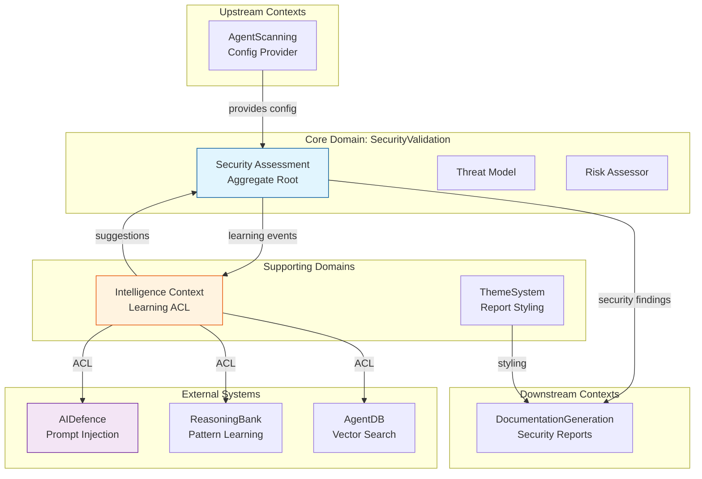
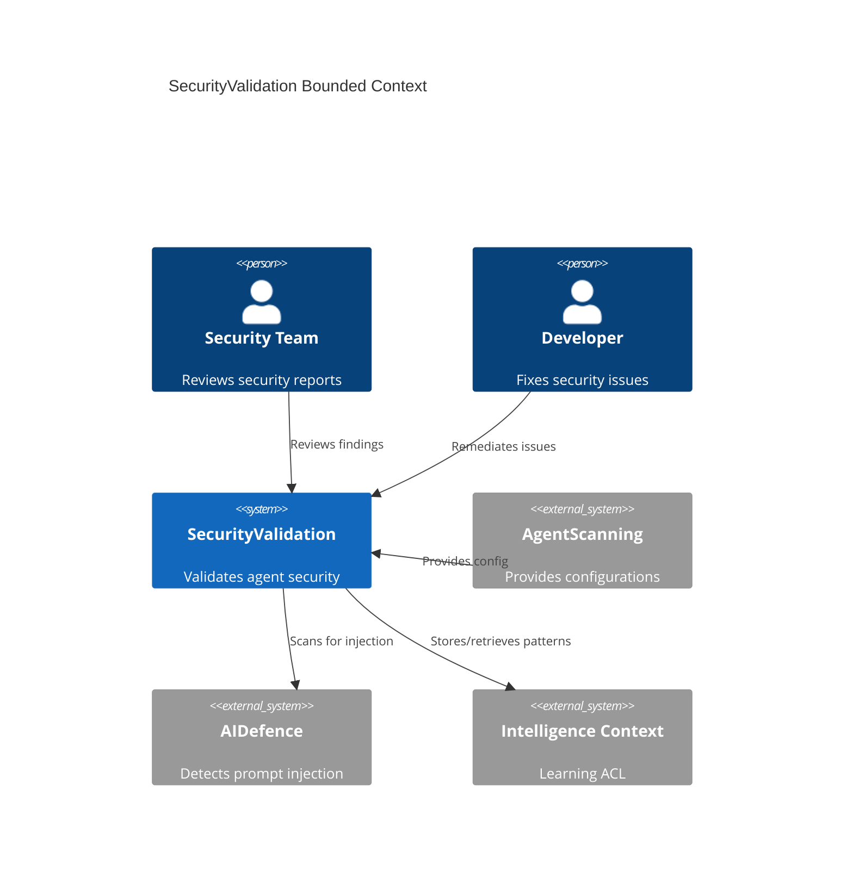
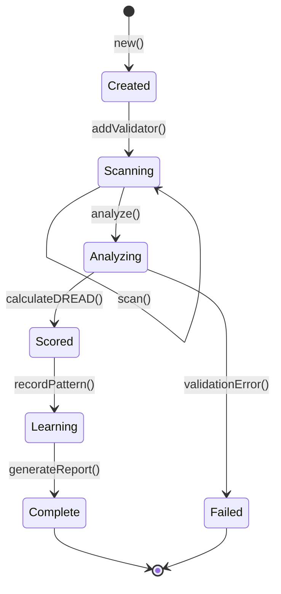
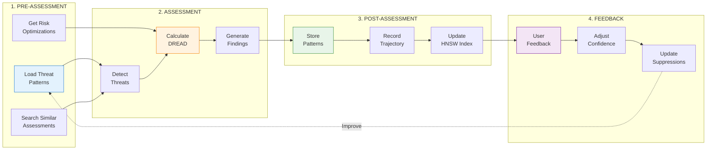
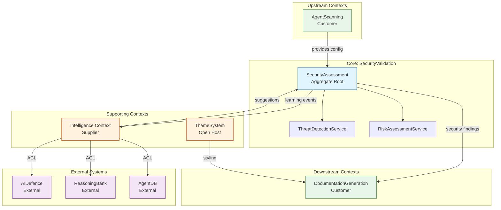

# DDD-005: Security Domain Model for AgentScope v1.2

**Status:** Proposed
**Created:** 2026-01-26
**Author:** DDD Domain Expert Agent
**Domain:** Security Validation with Learning-Enhanced Threat Detection
**Related:** DDD-003, ADR-012, ADR-016, ADR-017, ADR-018

---

## Executive Summary

This document defines the comprehensive Domain-Driven Design specification for the **Security domain** in AgentScope v1.2. The security domain focuses exclusively on validating Claude Code and coding agent configurations, detecting threats, and learning from patterns to reduce false positives over time.

**Key Innovation**: Security is not just static validation - it's an adaptive system that learns from threats, user feedback, and historical patterns to continuously improve detection accuracy.

---

## Table of Contents

1. [Strategic Design](#1-strategic-design)
2. [Bounded Context: SecurityValidation](#2-bounded-context-securityvalidation)
3. [Aggregate Roots](#3-aggregate-roots)
4. [Domain Entities](#4-domain-entities)
5. [Value Objects](#5-value-objects)
6. [Domain Events](#6-domain-events)
7. [Domain Services](#7-domain-services)
8. [Learning Integration](#8-learning-integration)
9. [Context Map](#9-context-map)
10. [Ubiquitous Language](#10-ubiquitous-language)
11. [Implementation Guidelines](#11-implementation-guidelines)

---

## 1. Strategic Design

### 1.1 Domain Classification

| Domain | Type | Strategic Importance |
|--------|------|---------------------|
| **SecurityValidation** | Core | Validates agent configuration security |

**Why Core Domain?**
- Critical differentiator for AgentScope
- Requires deep domain expertise (DREAD scoring, prompt injection)
- High business value (prevents security breaches)
- Not easily outsourced or commoditized

### 1.2 Domain Scope

**In Scope:**
- Claude Code settings validation (`.claude/settings.json`)
- CLAUDE.md prompt injection detection
- MCP server security validation
- Hook command injection detection
- Secret exposure detection
- Path traversal prevention
- DREAD risk scoring
- Learning-enhanced threat detection

**Out of Scope:**
- DevContainer security (separate domain - see DDD-002)
- Runtime application security
- Network security monitoring
- Host-level security
- User authentication/authorization

### 1.3 Strategic Context Map



---

## 2. Bounded Context: SecurityValidation

### 2.1 Context Overview

**Purpose:** Validate security posture of agent configurations and learn from patterns.

**Core Responsibilities:**
1. Validate Claude Code settings for insecure configurations
2. Detect prompt injection in CLAUDE.md and skill prompts
3. Validate MCP server endpoints (protocol, domain, security)
4. Detect command injection in hooks
5. Detect secrets in agent configurations
6. Calculate DREAD risk scores
7. Learn from threat patterns and false positives
8. Generate security reports with mitigation guidance

**Boundaries:**
- **Upstream:** Receives `AgentScopeConfiguration` from AgentScanning context
- **Downstream:** Provides `SecurityAssessment` to DocumentationGeneration context
- **External:** Integrates with AIDefence, ReasoningBank, AgentDB via Intelligence Context ACL

### 2.2 Context Diagram



---

## 3. Aggregate Roots

### 3.1 SecurityAssessment (Aggregate Root)

**Purpose:** Complete security evaluation of an agent configuration with DREAD risk scoring and learning capabilities.

**Invariants:**
1. All findings must have valid DREAD scores (0-10 for each dimension)
2. Overall risk score must be recalculated when findings change
3. Critical findings must have mitigation steps
4. Confidence scores must be 0-1
5. At least one validation category must be assessed

**Lifecycle:**


**Aggregate Definition:**

```typescript
/**
 * Aggregate Root: SecurityAssessment
 *
 * Represents a complete security evaluation of an agent configuration.
 * Enforces invariants around DREAD scoring, finding validation, and
 * learning integration.
 */
interface SecurityAssessment {
  // Identity
  readonly id: AssessmentId;
  readonly configId: ConfigurationId;
  readonly timestamp: Date;

  // Aggregate state
  readonly findings: SecurityFinding[];
  readonly overallScore: DREADScore;
  readonly validationCategories: ValidationCategory[];
  readonly metadata: AssessmentMetadata;

  // Aggregate behavior
  addFinding(finding: SecurityFinding): void;
  removeFinding(findingId: FindingId): void;
  calculateOverallScore(): DREADScore;
  getFindingsByCategory(category: ThreatCategory): SecurityFinding[];
  getCriticalFindings(): SecurityFinding[];
  getHighConfidenceFindings(threshold: number): SecurityFinding[];

  // Risk assessment
  assessRisk(): RiskLevel;
  prioritizeFindings(): SecurityFinding[];
  generateRemediations(): Remediation[];

  // Learning-enhanced behavior
  recordThreatPattern(pattern: ThreatPattern): Promise<void>;
  applyRiskScoreOptimizations(optimizations: RiskOptimization[]): void;
  learnFromFalsePositives(falsePositives: FalsePositive[]): Promise<void>;
  adjustConfidence(feedback: SecurityFeedback): Promise<void>;

  // Validation
  validate(): ValidationResult;
  isComplete(): boolean;
}

/**
 * Aggregate Root Implementation
 */
class SecurityAssessmentImpl implements SecurityAssessment {
  private findings: Map<string, SecurityFinding> = new Map();
  private validationCache: Map<string, boolean> = new Map();

  constructor(
    public readonly id: AssessmentId,
    public readonly configId: ConfigurationId,
    public readonly timestamp: Date
  ) {}

  addFinding(finding: SecurityFinding): void {
    // Invariant: DREAD scores must be valid
    if (!this.isValidDREADScore(finding.dreadScore)) {
      throw new InvalidDREADScoreError(finding.dreadScore);
    }

    // Invariant: Critical findings must have mitigation
    if (finding.dreadScore.severity === 'Critical' && !finding.mitigation) {
      throw new MissingMitigationError(finding.id);
    }

    this.findings.set(finding.id, finding);
    this.invalidateCache();

    // Domain event
    this.raiseEvent({
      type: 'SecurityFindingAdded',
      timestamp: new Date(),
      assessmentId: this.id,
      findingId: finding.id,
      category: finding.category,
      severity: finding.dreadScore.severity
    });
  }

  calculateOverallScore(): DREADScore {
    if (this.findings.size === 0) {
      return this.getEmptyScore();
    }

    // Aggregate DREAD dimensions across all findings
    const scores = Array.from(this.findings.values()).map(f => f.dreadScore);

    const damage = Math.max(...scores.map(s => s.damage));
    const reproducibility = Math.max(...scores.map(s => s.reproducibility));
    const exploitability = Math.max(...scores.map(s => s.exploitability));
    const affectedUsers = Math.max(...scores.map(s => s.affectedUsers));
    const discoverability = Math.max(...scores.map(s => s.discoverability));

    const total = damage + reproducibility + exploitability +
                  affectedUsers + discoverability;

    const severity = this.determineSeverity(total);

    // Calculate confidence (weighted average)
    const confidences = scores.map(s => s.confidence);
    const confidence = confidences.reduce((a, b) => a + b, 0) / confidences.length;

    return {
      damage,
      reproducibility,
      exploitability,
      affectedUsers,
      discoverability,
      total,
      severity,
      confidence
    };
  }

  async recordThreatPattern(pattern: ThreatPattern): Promise<void> {
    const intelligence = IntelligenceCoordinator.getInstance();

    await intelligence.storePattern({
      type: 'ThreatPatternLearned',
      timestamp: new Date(),
      assessmentId: this.id,
      pattern
    });
  }

  async learnFromFalsePositives(falsePositives: FalsePositive[]): Promise<void> {
    for (const fp of falsePositives) {
      // Remove finding from current assessment
      this.findings.delete(fp.findingId);

      // Store false positive pattern for future suppression
      const intelligence = IntelligenceCoordinator.getInstance();

      await intelligence.storePattern({
        type: 'FalsePositiveReported',
        timestamp: new Date(),
        assessmentId: this.id,
        findingId: fp.findingId,
        reason: fp.reason,
        suppressionRule: fp.suppressionRule
      });

      // Adjust confidence for similar patterns
      await this.adjustConfidence({
        patternId: fp.relatedPattern,
        wasCorrect: false,
        adjustmentFactor: -0.1
      });
    }

    this.invalidateCache();
  }

  private isValidDREADScore(score: DREADScore): boolean {
    return (
      score.damage >= 0 && score.damage <= 10 &&
      score.reproducibility >= 0 && score.reproducibility <= 10 &&
      score.exploitability >= 0 && score.exploitability <= 10 &&
      score.affectedUsers >= 0 && score.affectedUsers <= 10 &&
      score.discoverability >= 0 && score.discoverability <= 10 &&
      score.confidence >= 0 && score.confidence <= 1
    );
  }

  private determineSeverity(totalScore: number): Severity {
    if (totalScore >= 40) return 'Critical';
    if (totalScore >= 30) return 'High';
    if (totalScore >= 15) return 'Medium';
    if (totalScore >= 5) return 'Low';
    return 'Info';
  }

  private invalidateCache(): void {
    this.validationCache.clear();
  }
}
```

---

## 4. Domain Entities

### 4.1 SecurityFinding (Entity)

**Purpose:** Individual security issue discovered during assessment.

**Identity:** Unique `FindingId` (UUID)

**Lifecycle:** Created → Analyzed → Scored → Reported

```typescript
/**
 * Entity: SecurityFinding
 *
 * Represents a single security issue with DREAD risk scoring.
 */
interface SecurityFinding {
  // Identity
  readonly id: FindingId;

  // Attributes
  readonly category: ThreatCategory;
  readonly title: string;
  readonly description: string;
  readonly location: SourceLocation;
  readonly dreadScore: DREADScore;
  readonly mitigation: string;
  readonly cveReference?: string;
  readonly confidence: number;

  // Behavior
  updateScore(newScore: DREADScore): SecurityFinding;
  addEvidence(evidence: Evidence): SecurityFinding;
  markAsFalsePositive(reason: string): SecurityFinding;
}

/**
 * Source Location (Value Object)
 */
interface SourceLocation {
  readonly file: string;
  readonly line?: number;
  readonly column?: number;
  readonly context?: string; // Surrounding code
}

/**
 * Evidence (Value Object)
 */
interface Evidence {
  readonly type: 'regex-match' | 'aidefence-scan' | 'hnsw-similarity';
  readonly data: unknown;
  readonly confidence: number;
}
```

### 4.2 ThreatDetector (Entity Collection)

**Purpose:** Collection of specialized threat detection strategies.

```typescript
/**
 * Entity Collection: ThreatDetector
 *
 * Manages multiple detection strategies with priority and confidence.
 */
interface ThreatDetectorCollection {
  readonly detectors: ThreatDetector[];

  addDetector(detector: ThreatDetector): void;
  removeDetector(detectorId: string): void;
  scan(target: ScanTarget): Promise<SecurityFinding[]>;
  getDetectorsByPriority(): ThreatDetector[];
}

interface ThreatDetector {
  readonly id: string;
  readonly category: ThreatCategory;
  readonly priority: DetectorPriority;

  detect(target: ScanTarget): Promise<SecurityFinding[]>;
  getConfidence(): number;
}

type DetectorPriority = 'critical' | 'high' | 'normal' | 'low';
```

---

## 5. Value Objects

### 5.1 DREADScore (Value Object)

**Purpose:** DREAD risk scoring model for quantitative risk assessment.

```typescript
/**
 * Value Object: DREADScore
 *
 * Immutable risk score following DREAD methodology:
 * - Damage: How bad would an attack be?
 * - Reproducibility: How easy is it to reproduce?
 * - Exploitability: How much work is required?
 * - Affected Users: How many users affected?
 * - Discoverability: How easy is it to discover?
 */
interface DREADScore {
  readonly damage: number;           // 0-10
  readonly reproducibility: number;  // 0-10
  readonly exploitability: number;   // 0-10
  readonly affectedUsers: number;    // 0-10
  readonly discoverability: number;  // 0-10
  readonly total: number;            // sum (0-50)
  readonly severity: Severity;       // derived from total
  readonly confidence: number;       // 0-1 (learned)
}

type Severity = 'Critical' | 'High' | 'Medium' | 'Low' | 'Info';

/**
 * Factory method for creating DREAD scores
 */
class DREADScoreFactory {
  static create(
    damage: number,
    reproducibility: number,
    exploitability: number,
    affectedUsers: number,
    discoverability: number,
    confidence: number = 1.0
  ): DREADScore {
    // Validation
    this.validateDimension(damage, 'damage');
    this.validateDimension(reproducibility, 'reproducibility');
    this.validateDimension(exploitability, 'exploitability');
    this.validateDimension(affectedUsers, 'affectedUsers');
    this.validateDimension(discoverability, 'discoverability');
    this.validateConfidence(confidence);

    const total = damage + reproducibility + exploitability +
                  affectedUsers + discoverability;

    const severity = this.determineSeverity(total);

    return {
      damage,
      reproducibility,
      exploitability,
      affectedUsers,
      discoverability,
      total,
      severity,
      confidence
    };
  }

  private static validateDimension(value: number, name: string): void {
    if (value < 0 || value > 10) {
      throw new Error(`${name} must be 0-10, got ${value}`);
    }
  }

  private static validateConfidence(value: number): void {
    if (value < 0 || value > 1) {
      throw new Error(`confidence must be 0-1, got ${value}`);
    }
  }

  private static determineSeverity(total: number): Severity {
    if (total >= 40) return 'Critical';
    if (total >= 30) return 'High';
    if (total >= 15) return 'Medium';
    if (total >= 5) return 'Low';
    return 'Info';
  }
}
```

### 5.2 ThreatPattern (Value Object)

**Purpose:** Learned threat detection pattern with confidence score.

```typescript
/**
 * Value Object: ThreatPattern
 *
 * Represents a learned pattern for detecting threats.
 */
interface ThreatPattern {
  readonly signature: string;            // Pattern signature (hash)
  readonly regex: string;                // Detection regex
  readonly severity: Severity;
  readonly falsePositiveRate: number;    // 0-1 (learned)
  readonly confidence: number;           // 0-1 (learned)
  readonly lastUpdated: Date;
  readonly usageCount: number;
  readonly successRate: number;          // 0-1 (learned)
}

/**
 * Factory for creating threat patterns
 */
class ThreatPatternFactory {
  static fromRegex(
    regex: string,
    severity: Severity,
    confidence: number = 0.8
  ): ThreatPattern {
    return {
      signature: this.computeSignature(regex),
      regex,
      severity,
      falsePositiveRate: 0.0,
      confidence,
      lastUpdated: new Date(),
      usageCount: 0,
      successRate: 1.0
    };
  }

  static fromLearning(
    regex: string,
    severity: Severity,
    historicalData: HistoricalThreatData
  ): ThreatPattern {
    return {
      signature: this.computeSignature(regex),
      regex,
      severity,
      falsePositiveRate: historicalData.falsePositiveRate,
      confidence: historicalData.confidence,
      lastUpdated: new Date(),
      usageCount: historicalData.usageCount,
      successRate: historicalData.successRate
    };
  }

  private static computeSignature(regex: string): string {
    // SHA-256 hash of regex pattern
    return crypto.createHash('sha256').update(regex).digest('hex');
  }
}
```

### 5.3 ThreatCategory (Value Object)

**Purpose:** Enumeration of threat categories.

```typescript
/**
 * Value Object: ThreatCategory
 *
 * Categorizes security findings by threat type.
 */
type ThreatCategory =
  | 'PromptInjection'
  | 'CommandInjection'
  | 'SecretExposure'
  | 'PathTraversal'
  | 'InsecureSettings'
  | 'InsecureEndpoint'
  | 'ExcessivePermissions'
  | 'CircularDelegation'
  | 'UnvalidatedInput'
  | 'InsecureTransport';

/**
 * Threat Category Metadata
 */
interface ThreatCategoryInfo {
  readonly name: ThreatCategory;
  readonly description: string;
  readonly defaultSeverity: Severity;
  readonly cweReference?: string;
  readonly mitigationGuide: string;
}

const THREAT_CATEGORIES: Record<ThreatCategory, ThreatCategoryInfo> = {
  PromptInjection: {
    name: 'PromptInjection',
    description: 'Malicious input designed to manipulate agent behavior',
    defaultSeverity: 'Critical',
    cweReference: 'CWE-94',
    mitigationGuide: 'Use input validation, prompt templates, and AIDefence scanning'
  },
  CommandInjection: {
    name: 'CommandInjection',
    description: 'Shell command injection in hooks or MCP servers',
    defaultSeverity: 'Critical',
    cweReference: 'CWE-78',
    mitigationGuide: 'Use command whitelisting and safe execution wrappers'
  },
  SecretExposure: {
    name: 'SecretExposure',
    description: 'API keys, tokens, or credentials in configuration',
    defaultSeverity: 'High',
    cweReference: 'CWE-798',
    mitigationGuide: 'Use environment variables and secret managers'
  },
  PathTraversal: {
    name: 'PathTraversal',
    description: 'Directory traversal via file paths',
    defaultSeverity: 'High',
    cweReference: 'CWE-22',
    mitigationGuide: 'Use path sanitization and allowlists'
  },
  InsecureSettings: {
    name: 'InsecureSettings',
    description: 'Overly permissive Claude Code settings',
    defaultSeverity: 'Medium',
    mitigationGuide: 'Follow principle of least privilege'
  },
  InsecureEndpoint: {
    name: 'InsecureEndpoint',
    description: 'Unencrypted MCP server endpoints',
    defaultSeverity: 'Medium',
    cweReference: 'CWE-319',
    mitigationGuide: 'Use HTTPS/WSS for all MCP servers'
  },
  ExcessivePermissions: {
    name: 'ExcessivePermissions',
    description: 'Agent has more permissions than needed',
    defaultSeverity: 'Low',
    mitigationGuide: 'Review and restrict agent permissions'
  },
  CircularDelegation: {
    name: 'CircularDelegation',
    description: 'Circular delegation between agents',
    defaultSeverity: 'Low',
    mitigationGuide: 'Review delegation hierarchy'
  },
  UnvalidatedInput: {
    name: 'UnvalidatedInput',
    description: 'Input not validated before use',
    defaultSeverity: 'Medium',
    cweReference: 'CWE-20',
    mitigationGuide: 'Add Zod schema validation'
  },
  InsecureTransport: {
    name: 'InsecureTransport',
    description: 'Data transmitted over insecure channels',
    defaultSeverity: 'High',
    cweReference: 'CWE-319',
    mitigationGuide: 'Use TLS 1.3 for all network communication'
  }
};
```

### 5.4 RiskOptimization (Value Object)

**Purpose:** Learned adjustments to risk scoring based on historical data.

```typescript
/**
 * Value Object: RiskOptimization
 *
 * Contains learned adjustments to DREAD scoring.
 */
interface RiskOptimization {
  readonly threatType: ThreatCategory;
  readonly adjustedWeight: number;       // Learned DREAD weight adjustment
  readonly suppressionRules: string[];   // Known false positive patterns
  readonly enhancementRules: string[];   // Known true positive patterns
  readonly confidence: number;           // 0-1
  readonly sampleSize: number;           // # of samples used for learning
}
```

---

## 6. Domain Events

### 6.1 Assessment Events

```typescript
/**
 * Domain Event: SecurityAssessmentStarted
 */
interface SecurityAssessmentStarted {
  type: 'SecurityAssessmentStarted';
  timestamp: Date;
  assessmentId: string;
  configId: string;
  validationCategories: ValidationCategory[];
}

/**
 * Domain Event: SecurityAssessmentCompleted
 */
interface SecurityAssessmentCompleted {
  type: 'SecurityAssessmentCompleted';
  timestamp: Date;
  assessmentId: string;
  findingCount: number;
  overallScore: DREADScore;
  duration: number;
}

/**
 * Domain Event: SecurityFindingAdded
 */
interface SecurityFindingAdded {
  type: 'SecurityFindingAdded';
  timestamp: Date;
  assessmentId: string;
  findingId: string;
  category: ThreatCategory;
  severity: Severity;
}
```

### 6.2 Learning Events

```typescript
/**
 * Domain Event: ThreatPatternLearned
 */
interface ThreatPatternLearned {
  type: 'ThreatPatternLearned';
  timestamp: Date;
  patternId: string;
  threatType: ThreatCategory;
  confidence: number;
  falsePositiveRate: number;
}

/**
 * Domain Event: FalsePositiveReported
 */
interface FalsePositiveReported {
  type: 'FalsePositiveReported';
  timestamp: Date;
  findingId: string;
  assessmentId: string;
  reason: string;
  suppressionRule: string;
}

/**
 * Domain Event: RiskScoreAdjusted
 */
interface RiskScoreAdjusted {
  type: 'RiskScoreAdjusted';
  timestamp: Date;
  assessmentId: string;
  findingId: string;
  oldScore: DREADScore;
  newScore: DREADScore;
  reason: string;
}
```

---

## 7. Domain Services

### 7.1 ThreatDetectionService

**Purpose:** Coordinate multiple threat detection strategies.

```typescript
/**
 * Domain Service: ThreatDetectionService
 *
 * Orchestrates threat detection using deterministic, learned, and AI strategies.
 */
interface ThreatDetectionService {
  detect(
    config: AgentScopeConfiguration,
    optimizations: ThreatOptimization[]
  ): Promise<SecurityFinding[]>;

  detectPromptInjection(content: string): Promise<SecurityFinding[]>;
  detectCommandInjection(command: string): Promise<SecurityFinding[]>;
  detectSecretExposure(content: string): Promise<SecurityFinding[]>;
  detectPathTraversal(path: string): Promise<SecurityFinding[]>;
}

/**
 * Implementation with 3-tier detection
 */
class ThreatDetectionServiceImpl implements ThreatDetectionService {
  constructor(
    private regexDetector: RegexThreatDetector,
    private hnswDetector: HNSWThreatDetector,
    private aiDefenceDetector: AIDefenceThreatDetector
  ) {}

  async detect(
    config: AgentScopeConfiguration,
    optimizations: ThreatOptimization[]
  ): Promise<SecurityFinding[]> {
    const findings: SecurityFinding[] = [];

    // Tier 1: Deterministic (regex)
    const regexFindings = await this.regexDetector.detect(config);
    findings.push(...regexFindings);

    // Tier 2: Learned patterns (HNSW)
    const learnedFindings = await this.hnswDetector.detect(config, optimizations);
    findings.push(...learnedFindings);

    // Tier 3: AI-powered (AIDefence) - only for high-confidence suspicion
    const suspiciousContent = this.filterSuspicious(config, findings);
    if (suspiciousContent.length > 0) {
      const aiFindings = await this.aiDefenceDetector.detect(suspiciousContent);
      findings.push(...aiFindings);
    }

    return this.deduplicateFindings(findings);
  }

  private filterSuspicious(
    config: AgentScopeConfiguration,
    existingFindings: SecurityFinding[]
  ): string[] {
    // Only scan with AIDefence if:
    // 1. No high-confidence findings yet
    // 2. Content has suspicious keywords
    // 3. Not previously scanned and cached

    const hasHighConfidenceFindings = existingFindings.some(
      f => f.confidence > 0.9
    );

    if (hasHighConfidenceFindings) {
      return []; // Skip expensive AI scan
    }

    return this.extractSuspiciousContent(config);
  }

  private extractSuspiciousContent(config: AgentScopeConfiguration): string[] {
    const suspicious: string[] = [];

    // Check CLAUDE.md for suspicious patterns
    if (config.claudeMd) {
      const keywords = ['ignore', 'system:', 'sudo', 'eval', 'exec'];
      const hasSuspicious = keywords.some(k =>
        config.claudeMd!.toLowerCase().includes(k)
      );

      if (hasSuspicious) {
        suspicious.push(config.claudeMd);
      }
    }

    return suspicious;
  }

  private deduplicateFindings(findings: SecurityFinding[]): SecurityFinding[] {
    const seen = new Set<string>();
    const unique: SecurityFinding[] = [];

    for (const finding of findings) {
      const key = `${finding.category}:${finding.location.file}:${finding.location.line}`;
      if (!seen.has(key)) {
        seen.add(key);
        unique.push(finding);
      }
    }

    return unique;
  }
}
```

### 7.2 RiskAssessmentService

**Purpose:** Calculate DREAD scores with learned adjustments.

```typescript
/**
 * Domain Service: RiskAssessmentService
 *
 * Calculates DREAD risk scores with adaptive learning.
 */
interface RiskAssessmentService {
  assessRisk(finding: SecurityFinding): DREADScore;
  applyOptimizations(score: DREADScore, opts: RiskOptimization[]): DREADScore;
  adjustForFeedback(score: DREADScore, feedback: SecurityFeedback): DREADScore;
}

/**
 * Implementation with adaptive DREAD scoring
 */
class RiskAssessmentServiceImpl implements RiskAssessmentService {
  private baselineScores: Map<ThreatCategory, DREADScore> = new Map([
    ['PromptInjection', { damage: 9, reproducibility: 8, exploitability: 7, affectedUsers: 8, discoverability: 6, total: 38, severity: 'Critical', confidence: 0.9 }],
    ['CommandInjection', { damage: 10, reproducibility: 9, exploitability: 8, affectedUsers: 9, discoverability: 7, total: 43, severity: 'Critical', confidence: 0.95 }],
    ['SecretExposure', { damage: 8, reproducibility: 10, exploitability: 5, affectedUsers: 7, discoverability: 8, total: 38, severity: 'Critical', confidence: 0.85 }],
    ['PathTraversal', { damage: 7, reproducibility: 7, exploitability: 6, affectedUsers: 6, discoverability: 5, total: 31, severity: 'High', confidence: 0.8 }],
    ['InsecureSettings', { damage: 5, reproducibility: 8, exploitability: 4, affectedUsers: 5, discoverability: 6, total: 28, severity: 'Medium', confidence: 0.75 }],
  ]);

  assessRisk(finding: SecurityFinding): DREADScore {
    const baseline = this.baselineScores.get(finding.category);
    if (!baseline) {
      throw new Error(`No baseline score for category: ${finding.category}`);
    }

    // Apply context-specific adjustments
    return this.adjustForContext(baseline, finding);
  }

  applyOptimizations(
    score: DREADScore,
    opts: RiskOptimization[]
  ): DREADScore {
    let adjusted = { ...score };

    for (const opt of opts) {
      // Apply learned weight adjustments
      adjusted = {
        ...adjusted,
        damage: adjusted.damage * opt.adjustedWeight,
        confidence: Math.min(adjusted.confidence, opt.confidence)
      };
    }

    // Recalculate total and severity
    adjusted.total = adjusted.damage + adjusted.reproducibility +
                     adjusted.exploitability + adjusted.affectedUsers +
                     adjusted.discoverability;

    adjusted.severity = this.determineSeverity(adjusted.total);

    return adjusted;
  }

  adjustForFeedback(
    score: DREADScore,
    feedback: SecurityFeedback
  ): DREADScore {
    if (feedback.wasCorrect) {
      // True positive - increase confidence
      return {
        ...score,
        confidence: Math.min(1.0, score.confidence + 0.05)
      };
    } else {
      // False positive - decrease confidence
      return {
        ...score,
        confidence: Math.max(0.0, score.confidence - 0.1)
      };
    }
  }

  private adjustForContext(
    baseline: DREADScore,
    finding: SecurityFinding
  ): DREADScore {
    // Context-specific adjustments based on location, evidence, etc.
    let adjusted = { ...baseline };

    // Example: Reduce severity if in test files
    if (finding.location.file.includes('test/')) {
      adjusted.affectedUsers = Math.max(0, adjusted.affectedUsers - 3);
      adjusted.total = adjusted.damage + adjusted.reproducibility +
                       adjusted.exploitability + adjusted.affectedUsers +
                       adjusted.discoverability;
      adjusted.severity = this.determineSeverity(adjusted.total);
    }

    return adjusted;
  }

  private determineSeverity(total: number): Severity {
    if (total >= 40) return 'Critical';
    if (total >= 30) return 'High';
    if (total >= 15) return 'Medium';
    if (total >= 5) return 'Low';
    return 'Info';
  }
}
```

---

## 8. Learning Integration

### 8.1 Learning Cycle



### 8.2 Intelligence Context Integration

```typescript
/**
 * Learning integration via Intelligence Context ACL
 */
class SecurityLearningCoordinator {
  constructor(
    private intelligenceContext: IntelligenceCoordinator
  ) {}

  /**
   * 1. PRE-ASSESSMENT: Get learned optimizations
   */
  async getOptimizations(
    configSignature: ConfigSignature
  ): Promise<RiskOptimization[]> {
    return this.intelligenceContext.searchSimilarPatterns({
      type: 'threat',
      context: configSignature
    }, 10);
  }

  /**
   * 2. ASSESSMENT: (no learning integration during assessment)
   */

  /**
   * 3. POST-ASSESSMENT: Store patterns
   */
  async recordAssessment(
    assessment: SecurityAssessment
  ): Promise<void> {
    await this.intelligenceContext.storePattern({
      type: 'SecurityAssessmentCompleted',
      timestamp: new Date(),
      assessmentId: assessment.id,
      findingCount: assessment.findings.length,
      overallScore: assessment.overallScore
    });

    // Store each threat pattern
    for (const finding of assessment.findings) {
      await this.recordThreatPattern(finding);
    }
  }

  /**
   * 4. FEEDBACK: Learn from user corrections
   */
  async recordFeedback(
    finding: SecurityFinding,
    feedback: SecurityFeedback
  ): Promise<void> {
    const reward = feedback.wasCorrect ? 1.0 : 0.0;

    await this.intelligenceContext.storePattern({
      type: 'FalsePositiveReported',
      timestamp: new Date(),
      findingId: finding.id,
      reason: feedback.reason,
      suppressionRule: feedback.suppressionRule
    });

    // Adjust confidence for similar patterns
    if (!feedback.wasCorrect) {
      await this.intelligenceContext.adjustPatternConfidence(
        finding.category,
        -0.1
      );
    }
  }

  private async recordThreatPattern(
    finding: SecurityFinding
  ): Promise<void> {
    const pattern: ThreatPattern = {
      signature: this.computeSignature(finding),
      regex: this.extractPattern(finding),
      severity: finding.dreadScore.severity,
      falsePositiveRate: 0.0,
      confidence: finding.confidence,
      lastUpdated: new Date(),
      usageCount: 1,
      successRate: 1.0
    };

    await this.intelligenceContext.storePattern({
      type: 'ThreatPatternLearned',
      timestamp: new Date(),
      patternId: pattern.signature,
      threatType: finding.category,
      confidence: pattern.confidence,
      falsePositiveRate: pattern.falsePositiveRate
    });
  }

  private computeSignature(finding: SecurityFinding): string {
    return crypto.createHash('sha256')
      .update(finding.category + finding.description)
      .digest('hex');
  }

  private extractPattern(finding: SecurityFinding): string {
    // Extract regex pattern from finding description
    // This would use more sophisticated pattern extraction
    return finding.description;
  }
}
```

---

## 9. Context Map

### 9.1 Relationships with Other Contexts



### 9.2 Context Mapping Patterns

| Upstream | Downstream | Pattern | Description |
|----------|------------|---------|-------------|
| AgentScanning | SecurityValidation | Customer-Supplier | Config provides data for validation |
| SecurityValidation | DocumentationGeneration | Customer-Supplier | Findings included in docs |
| SecurityValidation | Intelligence Context | Published Events | Learning events |
| Intelligence Context | SecurityValidation | Published Events | Suggestions |
| Intelligence Context | External Systems | Anti-Corruption Layer | Protected domain model |
| ThemeSystem | DocumentationGeneration | Open Host Service | Standard palette API |

---

## 10. Ubiquitous Language

### 10.1 Core Security Terms

| Term | Definition | Context |
|------|------------|---------|
| **Assessment** | Complete security evaluation with DREAD scores | SecurityValidation |
| **Finding** | Individual security issue discovered | SecurityValidation |
| **DREAD** | Damage, Reproducibility, Exploitability, Affected Users, Discoverability | SecurityValidation |
| **Threat Pattern** | Learned detection pattern with confidence | SecurityValidation |
| **False Positive** | Incorrect finding that was marked as safe | SecurityValidation |
| **Mitigation** | Remediation steps for a security finding | SecurityValidation |
| **Confidence** | Pattern reliability score (0-1) | SecurityValidation |

### 10.2 Threat Category Terms

| Term | Definition | CWE |
|------|------------|-----|
| **Prompt Injection** | Malicious input to manipulate agent behavior | CWE-94 |
| **Command Injection** | Shell command injection in hooks/MCP | CWE-78 |
| **Secret Exposure** | API keys/tokens in configuration | CWE-798 |
| **Path Traversal** | Directory traversal via file paths | CWE-22 |
| **Insecure Transport** | Data over unencrypted channels | CWE-319 |

### 10.3 Learning Terms

| Term | Definition | Context |
|------|------------|---------|
| **Optimization** | Learned improvement suggestion | Intelligence |
| **Trajectory** | Sequence of operations with verdict | Intelligence |
| **HNSW** | Hierarchical Navigable Small World (fast vector search) | Intelligence |
| **Verdict** | Success/failure judgment for learning | Intelligence |
| **Reward** | Numeric signal for reinforcement learning | Intelligence |

---

## 11. Implementation Guidelines

### 11.1 Directory Structure

```
src/core/security/                   # SecurityValidation Context
  security-assessment.ts             # Aggregate root
  security-finding.ts                # Entity
  threat-pattern.ts                  # Learning value object
  dread-score.ts                     # Value object
  threat-category.ts                 # Value object

  validators/                        # Domain services
    claude-settings-validator.ts
    prompt-injection-detector.ts
    command-injection-detector.ts
    secret-detector.ts
    mcp-endpoint-validator.ts
    path-traversal-detector.ts

  services/
    threat-detection-service.ts      # Domain service
    risk-assessment-service.ts       # Domain service
    security-learning-coordinator.ts # Learning integration

  detectors/                         # Detection strategies
    regex-threat-detector.ts
    hnsw-threat-detector.ts
    aidefence-threat-detector.ts

  events/                            # Domain events
    assessment-events.ts
    learning-events.ts
```

### 11.2 Testing Strategy

| Layer | Test Type | Coverage Target | Focus |
|-------|-----------|-----------------|-------|
| Aggregate Roots | Unit | 95%+ | Invariants, business logic |
| Domain Services | Unit | 90%+ | Detection algorithms |
| Learning Integration | Integration | 85%+ | Pattern storage/retrieval |
| End-to-End | Integration | 80%+ | Full assessment workflow |

**Example Tests:**

```typescript
describe('SecurityAssessment (Aggregate Root)', () => {
  it('should enforce DREAD score invariants', () => {
    const assessment = new SecurityAssessmentImpl(id, configId, new Date());

    const invalidFinding = {
      id: 'finding-1',
      category: 'PromptInjection',
      dreadScore: { damage: 15 } // Invalid: >10
    };

    expect(() => assessment.addFinding(invalidFinding))
      .toThrow(InvalidDREADScoreError);
  });

  it('should require mitigation for critical findings', () => {
    const assessment = new SecurityAssessmentImpl(id, configId, new Date());

    const criticalFinding = {
      id: 'finding-1',
      category: 'CommandInjection',
      dreadScore: { total: 43, severity: 'Critical' },
      mitigation: undefined // Missing!
    };

    expect(() => assessment.addFinding(criticalFinding))
      .toThrow(MissingMitigationError);
  });

  it('should learn from false positives', async () => {
    const assessment = new SecurityAssessmentImpl(id, configId, new Date());
    assessment.addFinding(finding);

    await assessment.learnFromFalsePositives([{
      findingId: finding.id,
      reason: 'Safe pattern',
      suppressionRule: 'suppress-pattern-X'
    }]);

    expect(assessment.findings).not.toContain(finding);
  });
});

describe('ThreatDetectionService', () => {
  it('should use 3-tier detection strategy', async () => {
    const service = new ThreatDetectionServiceImpl(
      regexDetector,
      hnswDetector,
      aiDefenceDetector
    );

    const findings = await service.detect(config, []);

    // Verify all tiers were used
    expect(regexDetector.detect).toHaveBeenCalled();
    expect(hnswDetector.detect).toHaveBeenCalled();
    expect(aiDefenceDetector.detect).toHaveBeenCalledIf(
      suspiciousContentDetected
    );
  });

  it('should skip AIDefence if high confidence from regex', async () => {
    const service = new ThreatDetectionServiceImpl(
      regexDetector,
      hnswDetector,
      aiDefenceDetector
    );

    // Setup: regex finds high-confidence threat
    regexDetector.detect.mockResolvedValue([
      { confidence: 0.95, category: 'CommandInjection' }
    ]);

    await service.detect(config, []);

    // AIDefence should be skipped (expensive)
    expect(aiDefenceDetector.detect).not.toHaveBeenCalled();
  });
});

describe('RiskAssessmentService', () => {
  it('should adjust DREAD scores based on feedback', () => {
    const service = new RiskAssessmentServiceImpl();

    const score = { damage: 9, confidence: 0.8 };
    const feedback = { wasCorrect: true };

    const adjusted = service.adjustForFeedback(score, feedback);

    expect(adjusted.confidence).toBeGreaterThan(score.confidence);
  });

  it('should apply learned optimizations', () => {
    const service = new RiskAssessmentServiceImpl();

    const score = { damage: 9, total: 38, severity: 'Critical' };
    const optimizations = [
      { adjustedWeight: 0.8, confidence: 0.9 }
    ];

    const adjusted = service.applyOptimizations(score, optimizations);

    expect(adjusted.damage).toBe(9 * 0.8);
    expect(adjusted.confidence).toBeLessThanOrEqual(0.9);
  });
});
```

### 11.3 Architecture Enforcement

```typescript
describe('DDD Architecture Compliance (Security Context)', () => {
  it('should not import external systems directly', () => {
    const securityImports = findImports('./src/core/security');

    const externalImports = securityImports.filter(imp =>
      imp.includes('aidefence') ||
      imp.includes('agentdb') ||
      imp.includes('reasoning-bank')
    );

    expect(externalImports).toHaveLength(0);
  });

  it('should only access learning via Intelligence Context', () => {
    const learningCalls = findFunctionCalls(
      './src/core/security',
      ['storePattern', 'searchSimilar', 'recordTrajectory']
    );

    const directCalls = learningCalls.filter(call =>
      !call.through('IntelligenceCoordinator')
    );

    expect(directCalls).toHaveLength(0);
  });

  it('should respect aggregate boundaries', () => {
    const violations = checkAggregateBoundaries('./src/core/security');
    expect(violations).toHaveLength(0);
  });
});
```

---

## References

- **DDD-003**: Learning-Enhanced Domain Model (parent ADR)
- **ADR-012**: Agent Security Architecture
- **ADR-016**: Claude Code Security Validation
- **ADR-017**: CLAUDE.md Prompt Injection Detection
- **ADR-018**: MCP Server Security Scanning
- **DREAD Methodology**: [Microsoft Security Development Lifecycle](https://learn.microsoft.com/en-us/windows/security/threat-protection/security-policy-settings/security-policy-settings)
- **Domain-Driven Design**: [Eric Evans - DDD Reference](https://domainlanguage.com/ddd/)

---

*Generated by AgentScope DDD Expert*
*Last Updated: 2026-01-26*
