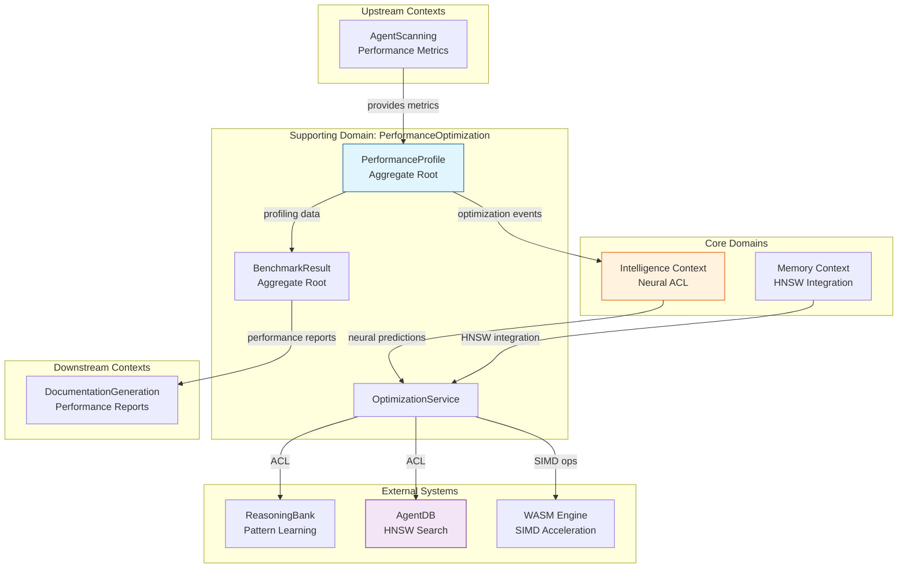
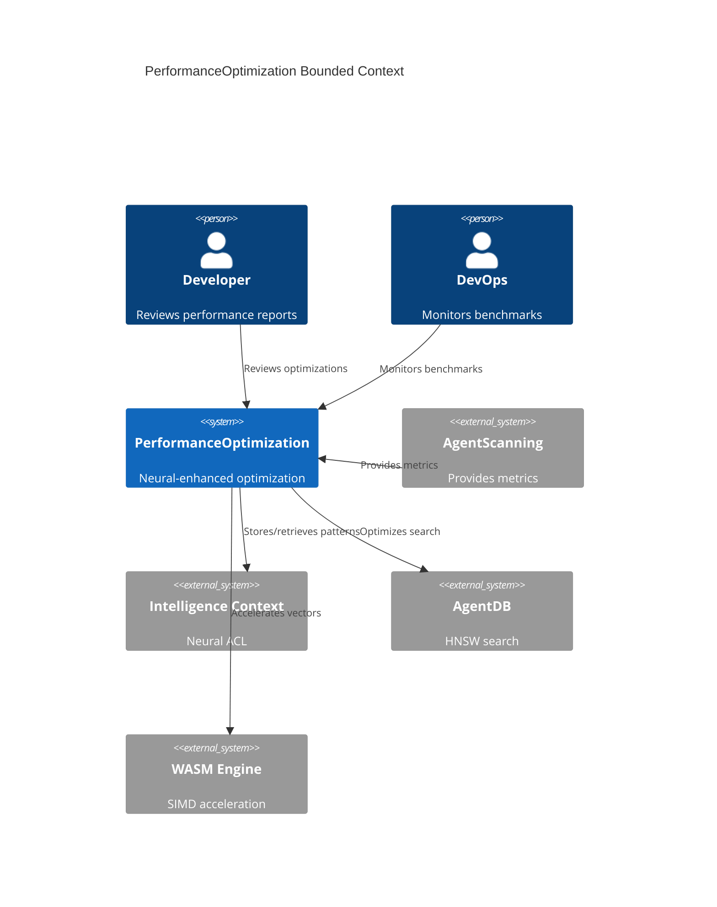
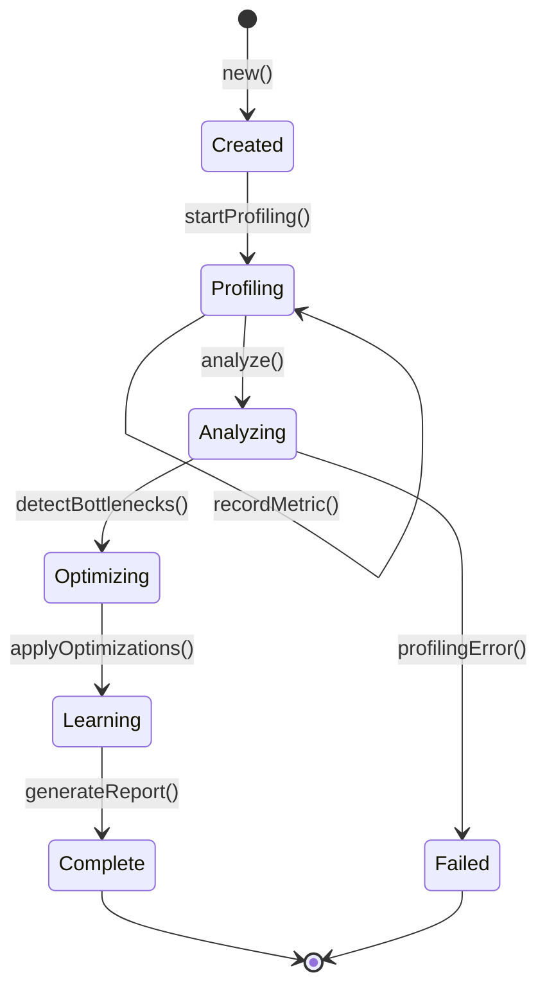
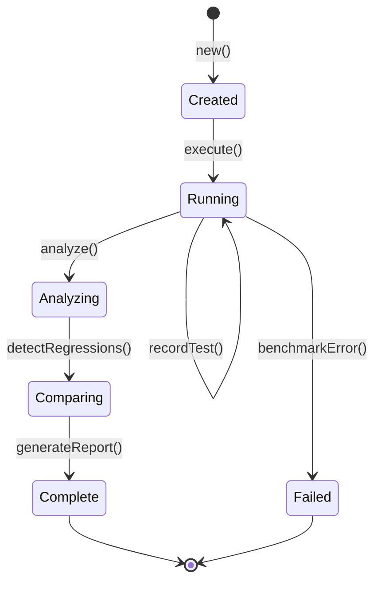

# DDD-006: Performance Optimization Domain Model for AgentScope v1.2

**Status:** Proposed
**Created:** 2026-01-27
**Author:** DDD Domain Expert Agent
**Domain:** Neural-Enhanced Performance Optimization
**Related:** ADR-020, DDD-003, DDD-005

---

## Executive Summary

This document defines the comprehensive Domain-Driven Design specification for the **Performance Optimization domain** in AgentScope v1.2. The performance domain focuses on neural-enhanced optimization across 6 layers: HNSW vector search, WASM SIMD acceleration, neural optimization, intelligent caching, batch operations, and memory optimization.

**Key Innovation**: Performance optimization is not just static benchmarking - it's an adaptive system that learns optimal strategies, predicts bottlenecks, and continuously improves through neural pattern recognition.

---

## Table of Contents

1. [Strategic Design](#1-strategic-design)
2. [Bounded Context: PerformanceOptimization](#2-bounded-context-performanceoptimization)
3. [Aggregate Roots](#3-aggregate-roots)
4. [Domain Entities](#4-domain-entities)
5. [Value Objects](#5-value-objects)
6. [Domain Events](#6-domain-events)
7. [Domain Services](#7-domain-services)
8. [Neural Integration](#8-neural-integration)
9. [Context Map](#9-context-map)
10. [Ubiquitous Language](#10-ubiquitous-language)
11. [Implementation Guidelines](#11-implementation-guidelines)

---

## 1. Strategic Design

### 1.1 Domain Classification

| Domain | Type | Strategic Importance |
|--------|------|---------------------|
| **PerformanceOptimization** | Supporting | Enables competitive performance targets |

**Why Supporting Domain?**
- Differentiates AgentScope but not core business logic
- Requires specialized expertise (HNSW, WASM, neural optimization)
- High technical value (150x-12,500x speedups)
- Can leverage external packages (@claude-flow/performance)

### 1.2 Domain Scope

**In Scope:**
- HNSW vector search optimization (150x-12,500x speedup)
- WASM SIMD acceleration (2-10x speedup)
- Neural pattern optimization (SONA + Flash Attention)
- Intelligent caching (LRU + predictive preloading)
- Batch operations (20-40% I/O reduction)
- Memory optimization (50-75% reduction via quantization)
- Performance profiling and benchmarking
- Bottleneck detection and mitigation
- Optimization strategy recommendation

**Out of Scope:**
- Application-level optimization (developer responsibility)
- Hardware tuning (infrastructure layer)
- Network optimization (beyond batch I/O)
- Database query optimization (unless AgentDB HNSW)

### 1.3 Strategic Context Map



---

## 2. Bounded Context: PerformanceOptimization

### 2.1 Context Overview

**Purpose:** Provide neural-enhanced performance optimization for agent operations.

**Core Responsibilities:**
1. Monitor and profile agent performance metrics
2. Detect performance bottlenecks and anomalies
3. Recommend and apply optimization strategies
4. Benchmark performance across 6 optimization layers
5. Learn optimal strategies through neural pattern recognition
6. Predict performance issues before they occur
7. Generate performance reports with actionable insights
8. Integrate HNSW, WASM, neural, cache, batch, and memory optimizations

**Boundaries:**
- **Upstream:** Receives `PerformanceMetrics` from AgentScanning context
- **Downstream:** Provides `PerformanceProfile` and `BenchmarkResult` to DocumentationGeneration
- **External:** Integrates with ReasoningBank, AgentDB, WASM Engine via Intelligence Context ACL

### 2.2 Context Diagram



---

## 3. Aggregate Roots

### 3.1 PerformanceProfile (Aggregate Root)

**Purpose:** Complete performance evaluation of an agent operation with multi-layer optimization tracking.

**Invariants:**
1. All metrics must have valid timestamps and values
2. Bottlenecks must have severity scores (0-100)
3. Optimization recommendations must have confidence scores (0-1)
4. At least one optimization layer must be profiled
5. Latency values must be non-negative
6. Throughput values must be positive when present

**Lifecycle:**


**Aggregate Definition:**

```typescript
/**
 * Aggregate Root: PerformanceProfile
 *
 * Represents a complete performance evaluation of an agent operation.
 * Enforces invariants around metric validation, bottleneck detection,
 * and optimization recommendation.
 */
interface PerformanceProfile {
  // Identity
  readonly id: ProfileId;
  readonly operationId: OperationId;
  readonly timestamp: Date;

  // Aggregate state
  readonly metrics: PerformanceMetric[];
  readonly bottlenecks: Bottleneck[];
  readonly optimizations: OptimizationRecommendation[];
  readonly layers: OptimizationLayer[];
  readonly metadata: ProfileMetadata;

  // Aggregate behavior
  recordMetric(metric: PerformanceMetric): void;
  detectBottlenecks(threshold: number): Bottleneck[];
  recommendOptimizations(): OptimizationRecommendation[];
  getMetricsByLayer(layer: OptimizationLayer): PerformanceMetric[];
  getCriticalBottlenecks(): Bottleneck[];
  getHighConfidenceOptimizations(threshold: number): OptimizationRecommendation[];

  // Performance analysis
  calculateThroughput(): number;
  calculateP95Latency(): number;
  calculateP99Latency(): number;
  identifyRegressions(baseline: PerformanceProfile): PerformanceRegression[];

  // Neural-enhanced behavior
  predictOptimalStrategy(context: OptimizationContext): Promise<OptimizationStrategy>;
  learnFromOptimizationOutcome(outcome: OptimizationOutcome): Promise<void>;
  adjustConfidence(feedback: PerformanceFeedback): Promise<void>;
  storeSuccessfulPattern(pattern: PerformancePattern): Promise<void>;

  // Validation
  validate(): ValidationResult;
  isComplete(): boolean;
}

/**
 * Aggregate Root Implementation
 */
class PerformanceProfileImpl implements PerformanceProfile {
  private metrics: Map<string, PerformanceMetric> = new Map();
  private bottlenecks: Map<string, Bottleneck> = new Map();
  private optimizations: Map<string, OptimizationRecommendation> = new Map();
  private metricCache: Map<string, number> = new Map();

  constructor(
    public readonly id: ProfileId,
    public readonly operationId: OperationId,
    public readonly timestamp: Date
  ) {}

  recordMetric(metric: PerformanceMetric): void {
    // Invariant: Metrics must have valid values
    if (!this.isValidMetric(metric)) {
      throw new InvalidMetricError(metric);
    }

    // Invariant: Latency must be non-negative
    if (metric.latency < 0) {
      throw new NegativeLatencyError(metric.latency);
    }

    // Invariant: Throughput must be positive if present
    if (metric.throughput !== undefined && metric.throughput <= 0) {
      throw new InvalidThroughputError(metric.throughput);
    }

    this.metrics.set(metric.id, metric);
    this.invalidateCache();

    // Domain event
    this.raiseEvent({
      type: 'PerformanceMetricRecorded',
      timestamp: new Date(),
      profileId: this.id,
      metricId: metric.id,
      layer: metric.layer,
      latency: metric.latency,
      throughput: metric.throughput
    });
  }

  detectBottlenecks(threshold: number = 50): Bottleneck[] {
    const detected: Bottleneck[] = [];

    // Analyze latency percentiles
    const p95Latency = this.calculateP95Latency();
    const p99Latency = this.calculateP99Latency();

    if (p95Latency > threshold) {
      detected.push({
        id: this.generateId('bottleneck'),
        type: 'LatencyBottleneck',
        severity: this.calculateSeverity(p95Latency, threshold),
        location: 'p95_latency',
        value: p95Latency,
        threshold,
        mitigation: this.generateMitigation('latency', p95Latency),
        confidence: 0.95
      });
    }

    // Analyze memory usage
    const memoryMetrics = this.getMetricsByType('memory');
    const avgMemory = this.calculateAverage(memoryMetrics.map(m => m.memory!));

    if (avgMemory > 100 * 1024 * 1024) { // > 100MB
      detected.push({
        id: this.generateId('bottleneck'),
        type: 'MemoryBottleneck',
        severity: this.calculateSeverity(avgMemory, 100 * 1024 * 1024),
        location: 'memory_usage',
        value: avgMemory,
        threshold: 100 * 1024 * 1024,
        mitigation: this.generateMitigation('memory', avgMemory),
        confidence: 0.90
      });
    }

    // Analyze throughput
    const throughput = this.calculateThroughput();
    if (throughput < 10) { // < 10 ops/sec
      detected.push({
        id: this.generateId('bottleneck'),
        type: 'ThroughputBottleneck',
        severity: this.calculateSeverity(10, throughput),
        location: 'throughput',
        value: throughput,
        threshold: 10,
        mitigation: this.generateMitigation('throughput', throughput),
        confidence: 0.85
      });
    }

    // Store bottlenecks
    detected.forEach(b => this.bottlenecks.set(b.id, b));

    // Raise events
    detected.forEach(b => {
      this.raiseEvent({
        type: 'BottleneckDetected',
        timestamp: new Date(),
        profileId: this.id,
        bottleneckId: b.id,
        bottleneckType: b.type,
        severity: b.severity
      });
    });

    return detected;
  }

  recommendOptimizations(): OptimizationRecommendation[] {
    const recommendations: OptimizationRecommendation[] = [];

    // Check each optimization layer
    for (const layer of this.layers) {
      const layerMetrics = this.getMetricsByLayer(layer);
      const recommendation = this.analyzeLayer(layer, layerMetrics);

      if (recommendation) {
        recommendations.push(recommendation);
        this.optimizations.set(recommendation.id, recommendation);
      }
    }

    return recommendations;
  }

  async predictOptimalStrategy(
    context: OptimizationContext
  ): Promise<OptimizationStrategy> {
    const intelligence = IntelligenceCoordinator.getInstance();

    // Search for similar optimization patterns
    const similarPatterns = await intelligence.searchPatterns({
      type: 'performance-optimization',
      context: {
        operation: context.operation,
        currentMetrics: context.currentMetrics,
        constraints: context.constraints
      },
      limit: 5
    });

    // Use SONA to predict optimal strategy
    const prediction = await intelligence.predictStrategy({
      patterns: similarPatterns,
      context,
      model: 'sona'
    });

    return {
      strategy: prediction.strategy,
      parameters: prediction.parameters,
      expectedImprovement: prediction.expectedImprovement,
      confidence: prediction.confidence,
      reasoning: prediction.reasoning
    };
  }

  async learnFromOptimizationOutcome(
    outcome: OptimizationOutcome
  ): Promise<void> {
    const intelligence = IntelligenceCoordinator.getInstance();

    // Store successful optimization pattern
    if (outcome.success && outcome.improvement > 0.1) {
      await intelligence.storePattern({
        type: 'PerformanceOptimizationSucceeded',
        timestamp: new Date(),
        profileId: this.id,
        strategy: outcome.strategy,
        improvement: outcome.improvement,
        metrics: {
          before: outcome.metricsBefore,
          after: outcome.metricsAfter
        }
      });

      // Raise event
      this.raiseEvent({
        type: 'OptimizationApplied',
        timestamp: new Date(),
        profileId: this.id,
        strategy: outcome.strategy,
        improvement: outcome.improvement
      });
    }

    // Adjust confidence for similar patterns
    await this.adjustConfidence({
      strategyId: outcome.strategy,
      wasSuccessful: outcome.success,
      actualImprovement: outcome.improvement,
      expectedImprovement: outcome.expectedImprovement
    });
  }

  private isValidMetric(metric: PerformanceMetric): boolean {
    return (
      metric.timestamp instanceof Date &&
      typeof metric.latency === 'number' &&
      (metric.throughput === undefined || typeof metric.throughput === 'number') &&
      (metric.memory === undefined || typeof metric.memory === 'number')
    );
  }

  private calculateSeverity(value: number, threshold: number): number {
    const ratio = value / threshold;
    return Math.min(100, Math.max(0, (ratio - 1) * 100));
  }

  private generateMitigation(type: string, value: number): string {
    const mitigations = {
      latency: 'Consider enabling HNSW indexing or WASM SIMD acceleration',
      memory: 'Apply quantization (Int4/Int8) or enable memory pooling',
      throughput: 'Enable batch operations or parallel processing'
    };

    return mitigations[type as keyof typeof mitigations] || 'Unknown mitigation';
  }

  calculateP95Latency(): number {
    const latencies = Array.from(this.metrics.values())
      .map(m => m.latency)
      .sort((a, b) => a - b);

    const index = Math.floor(latencies.length * 0.95);
    return latencies[index] || 0;
  }

  calculateP99Latency(): number {
    const latencies = Array.from(this.metrics.values())
      .map(m => m.latency)
      .sort((a, b) => a - b);

    const index = Math.floor(latencies.length * 0.99);
    return latencies[index] || 0;
  }

  calculateThroughput(): number {
    const metricsWithThroughput = Array.from(this.metrics.values())
      .filter(m => m.throughput !== undefined);

    if (metricsWithThroughput.length === 0) {
      return 0;
    }

    const totalThroughput = metricsWithThroughput
      .reduce((sum, m) => sum + (m.throughput || 0), 0);

    return totalThroughput / metricsWithThroughput.length;
  }

  private invalidateCache(): void {
    this.metricCache.clear();
  }

  private calculateAverage(values: number[]): number {
    if (values.length === 0) return 0;
    return values.reduce((a, b) => a + b, 0) / values.length;
  }

  private getMetricsByType(type: string): PerformanceMetric[] {
    return Array.from(this.metrics.values())
      .filter(m => m.type === type);
  }

  private analyzeLayer(
    layer: OptimizationLayer,
    metrics: PerformanceMetric[]
  ): OptimizationRecommendation | null {
    // Layer-specific analysis logic
    const avgLatency = this.calculateAverage(metrics.map(m => m.latency));

    const thresholds = {
      'hnsw': 10,
      'wasm': 50,
      'neural': 50,
      'cache': 100,
      'batch': 200,
      'quantization': 500
    };

    const threshold = thresholds[layer] || 100;

    if (avgLatency > threshold) {
      return {
        id: this.generateId('optimization'),
        layer,
        strategy: this.getLayerStrategy(layer),
        parameters: this.getLayerParameters(layer),
        expectedImprovement: this.estimateImprovement(layer, avgLatency),
        confidence: 0.80,
        reasoning: `Average latency (${avgLatency.toFixed(2)}ms) exceeds threshold (${threshold}ms)`
      };
    }

    return null;
  }

  private getLayerStrategy(layer: OptimizationLayer): string {
    const strategies = {
      'hnsw': 'enable_hnsw_indexing',
      'wasm': 'enable_wasm_simd',
      'neural': 'enable_flash_attention',
      'cache': 'enable_predictive_cache',
      'batch': 'enable_batch_operations',
      'quantization': 'apply_quantization'
    };

    return strategies[layer] || 'unknown';
  }

  private getLayerParameters(layer: OptimizationLayer): Record<string, any> {
    const parameters = {
      'hnsw': { m: 16, efConstruction: 200 },
      'wasm': { enableSIMD: true },
      'neural': { flashAttention: true },
      'cache': { maxSize: 1000, predictive: true },
      'batch': { batchSize: 100 },
      'quantization': { precision: 8 }
    };

    return parameters[layer] || {};
  }

  private estimateImprovement(layer: OptimizationLayer, currentLatency: number): number {
    const improvements = {
      'hnsw': 150,   // 150x speedup
      'wasm': 4,     // 4x speedup
      'neural': 5,   // 5x speedup
      'cache': 0.85, // 85% hit rate = ~6x effective
      'batch': 0.35, // 35% I/O reduction
      'quantization': 0.70 // 70% memory reduction
    };

    return improvements[layer] || 0;
  }

  private generateId(prefix: string): string {
    return `${prefix}-${Date.now()}-${Math.random().toString(36).substr(2, 9)}`;
  }

  private raiseEvent(event: any): void {
    // Event sourcing integration
    // Implementation delegated to event bus
  }
}
```

### 3.2 BenchmarkResult (Aggregate Root)

**Purpose:** Complete benchmark execution result with regression detection.

**Invariants:**
1. All benchmark metrics must have valid values
2. Baseline comparisons must use compatible metric sets
3. Regression thresholds must be 0-1
4. At least one benchmark category must be executed

**Lifecycle:**


**Aggregate Definition:**

```typescript
/**
 * Aggregate Root: BenchmarkResult
 *
 * Represents a complete benchmark execution with regression detection.
 */
interface BenchmarkResult {
  // Identity
  readonly id: BenchmarkId;
  readonly suiteId: string;
  readonly timestamp: Date;

  // Aggregate state
  readonly tests: BenchmarkTest[];
  readonly metrics: BenchmarkMetrics;
  readonly regressions: PerformanceRegression[];
  readonly baseline?: BenchmarkResult;
  readonly metadata: BenchmarkMetadata;

  // Aggregate behavior
  recordTest(test: BenchmarkTest): void;
  detectRegressions(baseline: BenchmarkResult, threshold: number): PerformanceRegression[];
  compareAgainst(baseline: BenchmarkResult): ComparisonResult;
  getTestsByCategory(category: BenchmarkCategory): BenchmarkTest[];
  getFailedTests(): BenchmarkTest[];
  getPassedTests(): BenchmarkTest[];

  // Metrics calculation
  calculateSuccessRate(): number;
  calculateOverallScore(): number;
  generateSummary(): BenchmarkSummary;

  // Validation
  validate(): ValidationResult;
  isComplete(): boolean;
}

/**
 * Aggregate Root Implementation
 */
class BenchmarkResultImpl implements BenchmarkResult {
  private tests: Map<string, BenchmarkTest> = new Map();
  private regressions: Map<string, PerformanceRegression> = new Map();

  constructor(
    public readonly id: BenchmarkId,
    public readonly suiteId: string,
    public readonly timestamp: Date,
    public readonly baseline?: BenchmarkResult
  ) {}

  recordTest(test: BenchmarkTest): void {
    // Invariant: Test must have valid metrics
    if (!this.isValidTest(test)) {
      throw new InvalidBenchmarkTestError(test);
    }

    this.tests.set(test.id, test);

    // Domain event
    this.raiseEvent({
      type: 'BenchmarkTestRecorded',
      timestamp: new Date(),
      benchmarkId: this.id,
      testId: test.id,
      category: test.category,
      passed: test.passed
    });
  }

  detectRegressions(
    baseline: BenchmarkResult,
    threshold: number = 0.10
  ): PerformanceRegression[] {
    const detected: PerformanceRegression[] = [];

    for (const [testId, currentTest] of this.tests) {
      const baselineTest = baseline.tests.get(testId);

      if (!baselineTest) {
        continue; // New test, no regression
      }

      // Compare p95 latency
      const currentP95 = currentTest.metrics.p95 || 0;
      const baselineP95 = baselineTest.metrics.p95 || 0;
      const regression = (currentP95 - baselineP95) / baselineP95;

      if (regression > threshold) {
        detected.push({
          id: this.generateId('regression'),
          testId,
          metric: 'p95_latency',
          currentValue: currentP95,
          baselineValue: baselineP95,
          regression,
          severity: this.calculateRegressionSeverity(regression),
          detectedAt: new Date()
        });
      }

      // Compare throughput (inverse - lower is worse)
      const currentThroughput = currentTest.metrics.throughput || 0;
      const baselineThroughput = baselineTest.metrics.throughput || 0;
      const throughputRegression = (baselineThroughput - currentThroughput) / baselineThroughput;

      if (throughputRegression > threshold) {
        detected.push({
          id: this.generateId('regression'),
          testId,
          metric: 'throughput',
          currentValue: currentThroughput,
          baselineValue: baselineThroughput,
          regression: throughputRegression,
          severity: this.calculateRegressionSeverity(throughputRegression),
          detectedAt: new Date()
        });
      }
    }

    // Store regressions
    detected.forEach(r => this.regressions.set(r.id, r));

    // Raise events
    detected.forEach(r => {
      this.raiseEvent({
        type: 'PerformanceRegressionDetected',
        timestamp: new Date(),
        benchmarkId: this.id,
        regressionId: r.id,
        metric: r.metric,
        regression: r.regression,
        severity: r.severity
      });
    });

    return detected;
  }

  calculateSuccessRate(): number {
    const total = this.tests.size;
    if (total === 0) return 0;

    const passed = Array.from(this.tests.values())
      .filter(t => t.passed).length;

    return passed / total;
  }

  private isValidTest(test: BenchmarkTest): boolean {
    return (
      test.id !== '' &&
      test.category !== '' &&
      typeof test.passed === 'boolean' &&
      test.metrics !== undefined
    );
  }

  private calculateRegressionSeverity(regression: number): string {
    if (regression >= 0.50) return 'Critical';
    if (regression >= 0.30) return 'High';
    if (regression >= 0.15) return 'Medium';
    return 'Low';
  }

  private generateId(prefix: string): string {
    return `${prefix}-${Date.now()}-${Math.random().toString(36).substr(2, 9)}`;
  }

  private raiseEvent(event: any): void {
    // Event sourcing integration
  }
}
```

---

## 4. Domain Entities

### 4.1 PerformanceMetric (Entity)

**Purpose:** Individual performance measurement with timestamp and dimensions.

**Identity:** Unique `MetricId` (UUID)

**Lifecycle:** Created → Recorded → Analyzed → Stored

```typescript
/**
 * Entity: PerformanceMetric
 *
 * Represents a single performance measurement.
 */
interface PerformanceMetric {
  // Identity
  readonly id: MetricId;

  // Attributes
  readonly timestamp: Date;
  readonly layer: OptimizationLayer;
  readonly operation: string;
  readonly latency: number;
  readonly throughput?: number;
  readonly memory?: number;
  readonly cpu?: number;
  readonly success: boolean;
  readonly metadata?: Record<string, any>;

  // Behavior
  compareTo(other: PerformanceMetric): MetricComparison;
  calculateSpeedup(baseline: PerformanceMetric): number;
  toTimeSeries(): TimeSeriesPoint;
}

/**
 * Metric Comparison (Value Object)
 */
interface MetricComparison {
  readonly latencyDiff: number;
  readonly throughputDiff?: number;
  readonly memoryDiff?: number;
  readonly improvement: number; // percentage
}

/**
 * Time Series Point (Value Object)
 */
interface TimeSeriesPoint {
  readonly timestamp: number;
  readonly value: number;
  readonly metric: string;
}
```

### 4.2 Bottleneck (Entity)

**Purpose:** Identified performance bottleneck with severity and mitigation.

**Identity:** Unique `BottleneckId` (UUID)

**Lifecycle:** Detected → Analyzed → Prioritized → Mitigated

```typescript
/**
 * Entity: Bottleneck
 *
 * Represents an identified performance bottleneck.
 */
interface Bottleneck {
  // Identity
  readonly id: BottleneckId;

  // Attributes
  readonly type: BottleneckType;
  readonly severity: number; // 0-100
  readonly location: string;
  readonly value: number;
  readonly threshold: number;
  readonly mitigation: string;
  readonly confidence: number; // 0-1
  readonly detectedAt: Date;

  // Behavior
  prioritize(): Priority;
  generateMitigationPlan(): MitigationPlan;
  estimateImpact(): ImpactEstimate;
}

type BottleneckType =
  | 'LatencyBottleneck'
  | 'ThroughputBottleneck'
  | 'MemoryBottleneck'
  | 'CPUBottleneck'
  | 'IOBottleneck';

type Priority = 'Critical' | 'High' | 'Medium' | 'Low';
```

### 4.3 OptimizationRecommendation (Entity)

**Purpose:** Recommended optimization with expected improvement.

**Identity:** Unique `RecommendationId` (UUID)

```typescript
/**
 * Entity: OptimizationRecommendation
 *
 * Represents a recommended optimization strategy.
 */
interface OptimizationRecommendation {
  // Identity
  readonly id: RecommendationId;

  // Attributes
  readonly layer: OptimizationLayer;
  readonly strategy: string;
  readonly parameters: Record<string, any>;
  readonly expectedImprovement: number;
  readonly confidence: number;
  readonly reasoning: string;
  readonly createdAt: Date;

  // Behavior
  apply(context: OptimizationContext): Promise<OptimizationResult>;
  validate(): boolean;
  estimateCost(): ResourceCost;
}

/**
 * Optimization Result (Value Object)
 */
interface OptimizationResult {
  readonly success: boolean;
  readonly actualImprovement: number;
  readonly metricsBefore: PerformanceMetrics;
  readonly metricsAfter: PerformanceMetrics;
  readonly appliedAt: Date;
}
```

### 4.4 BenchmarkTest (Entity)

**Purpose:** Individual benchmark test execution.

**Identity:** Unique `TestId` (UUID)

```typescript
/**
 * Entity: BenchmarkTest
 *
 * Represents a single benchmark test execution.
 */
interface BenchmarkTest {
  // Identity
  readonly id: TestId;

  // Attributes
  readonly name: string;
  readonly category: BenchmarkCategory;
  readonly metrics: TestMetrics;
  readonly passed: boolean;
  readonly executedAt: Date;
  readonly duration: number;

  // Behavior
  validate(target: PerformanceTarget): boolean;
  compareAgainst(baseline: BenchmarkTest): TestComparison;
}

type BenchmarkCategory =
  | 'hnsw'
  | 'wasm'
  | 'neural'
  | 'cache'
  | 'batch'
  | 'quantization'
  | 'e2e';

/**
 * Test Metrics (Value Object)
 */
interface TestMetrics {
  readonly p50?: number;
  readonly p95?: number;
  readonly p99?: number;
  readonly throughput?: number;
  readonly memory?: number;
  readonly speedup?: number;
}
```

---

## 5. Value Objects

### 5.1 OptimizationStrategy (Value Object)

**Purpose:** Immutable optimization strategy with parameters.

```typescript
/**
 * Value Object: OptimizationStrategy
 *
 * Immutable strategy for performance optimization.
 */
interface OptimizationStrategy {
  readonly strategy: StrategyType;
  readonly parameters: Record<string, any>;
  readonly expectedImprovement: number;
  readonly confidence: number;
  readonly reasoning: string;
}

type StrategyType =
  | 'cache'
  | 'batch'
  | 'parallel'
  | 'quantize'
  | 'index'
  | 'simd'
  | 'neural';

/**
 * Factory for creating optimization strategies
 */
class OptimizationStrategyFactory {
  static createCacheStrategy(maxSize: number): OptimizationStrategy {
    return {
      strategy: 'cache',
      parameters: { maxSize, predictive: true },
      expectedImprovement: 6.0, // 85% hit rate
      confidence: 0.85,
      reasoning: 'Intelligent caching with predictive preloading'
    };
  }

  static createBatchStrategy(batchSize: number): OptimizationStrategy {
    return {
      strategy: 'batch',
      parameters: { batchSize },
      expectedImprovement: 0.35, // 35% I/O reduction
      confidence: 0.80,
      reasoning: 'Batch I/O operations to reduce round trips'
    };
  }

  static createQuantizationStrategy(precision: 4 | 8 | 16): OptimizationStrategy {
    const improvements = { 4: 0.75, 8: 0.50, 16: 0.50 };

    return {
      strategy: 'quantize',
      parameters: { precision },
      expectedImprovement: improvements[precision],
      confidence: 0.90,
      reasoning: `${precision}-bit quantization for memory reduction`
    };
  }

  static createHNSWStrategy(m: number, efConstruction: number): OptimizationStrategy {
    return {
      strategy: 'index',
      parameters: { m, efConstruction },
      expectedImprovement: 1000, // 1000x speedup
      confidence: 0.95,
      reasoning: 'HNSW indexing for fast vector search'
    };
  }
}
```

### 5.2 LatencyMeasurement (Value Object)

**Purpose:** Immutable latency measurement with percentiles.

```typescript
/**
 * Value Object: LatencyMeasurement
 *
 * Immutable latency measurement with statistical metrics.
 */
interface LatencyMeasurement {
  readonly p50: number;
  readonly p95: number;
  readonly p99: number;
  readonly min: number;
  readonly max: number;
  readonly mean: number;
  readonly stdDev: number;
  readonly count: number;
}

/**
 * Factory for creating latency measurements
 */
class LatencyMeasurementFactory {
  static fromSamples(samples: number[]): LatencyMeasurement {
    const sorted = [...samples].sort((a, b) => a - b);
    const count = sorted.length;

    return {
      p50: sorted[Math.floor(count * 0.50)],
      p95: sorted[Math.floor(count * 0.95)],
      p99: sorted[Math.floor(count * 0.99)],
      min: sorted[0],
      max: sorted[count - 1],
      mean: sorted.reduce((a, b) => a + b, 0) / count,
      stdDev: this.calculateStdDev(sorted),
      count
    };
  }

  private static calculateStdDev(values: number[]): number {
    const mean = values.reduce((a, b) => a + b, 0) / values.length;
    const variance = values
      .map(v => Math.pow(v - mean, 2))
      .reduce((a, b) => a + b, 0) / values.length;
    return Math.sqrt(variance);
  }
}
```

### 5.3 ThroughputMeasurement (Value Object)

**Purpose:** Immutable throughput measurement.

```typescript
/**
 * Value Object: ThroughputMeasurement
 *
 * Immutable throughput measurement (operations per second).
 */
interface ThroughputMeasurement {
  readonly operationsPerSecond: number;
  readonly totalOperations: number;
  readonly totalDuration: number;
  readonly unit: string;
}

/**
 * Factory for creating throughput measurements
 */
class ThroughputMeasurementFactory {
  static create(
    operations: number,
    duration: number,
    unit: string = 'ops/sec'
  ): ThroughputMeasurement {
    return {
      operationsPerSecond: operations / (duration / 1000),
      totalOperations: operations,
      totalDuration: duration,
      unit
    };
  }
}
```

### 5.4 BenchmarkThreshold (Value Object)

**Purpose:** Immutable performance target threshold.

```typescript
/**
 * Value Object: BenchmarkThreshold
 *
 * Immutable performance threshold for validation.
 */
interface BenchmarkThreshold {
  readonly metric: string;
  readonly target: number;
  readonly tolerance: number; // percentage
  readonly unit: string;
}

/**
 * Predefined thresholds for v1.2
 */
const V12_THRESHOLDS: BenchmarkThreshold[] = [
  { metric: 'hnsw_search_p95', target: 10, tolerance: 0.20, unit: 'ms' },
  { metric: 'hnsw_speedup', target: 150, tolerance: 0.20, unit: 'x' },
  { metric: 'wasm_speedup', target: 2, tolerance: 0.20, unit: 'x' },
  { metric: 'sona_adaptation_ms', target: 50, tolerance: 0.20, unit: 'ms' },
  { metric: 'flash_attention_speedup', target: 2.49, tolerance: 0.20, unit: 'x' },
  { metric: 'cache_hit_rate', target: 0.80, tolerance: 0.10, unit: '%' },
  { metric: 'io_reduction', target: 0.20, tolerance: 0.10, unit: '%' },
  { metric: 'memory_reduction', target: 0.50, tolerance: 0.10, unit: '%' },
  { metric: 'scan_large_ms', target: 1000, tolerance: 0.20, unit: 'ms' },
  { metric: 'cli_startup_ms', target: 300, tolerance: 0.20, unit: 'ms' },
  { metric: 'memory_mb', target: 75, tolerance: 0.20, unit: 'MB' }
];
```

### 5.5 PerformanceRegression (Value Object)

**Purpose:** Immutable regression detection result.

```typescript
/**
 * Value Object: PerformanceRegression
 *
 * Immutable regression detection with severity.
 */
interface PerformanceRegression {
  readonly id: string;
  readonly testId: string;
  readonly metric: string;
  readonly currentValue: number;
  readonly baselineValue: number;
  readonly regression: number; // percentage
  readonly severity: string;
  readonly detectedAt: Date;
}
```

---

## 6. Domain Events

### 6.1 Event Catalog

```typescript
/**
 * Domain Events for Performance Optimization
 */
type PerformanceDomainEvent =
  | PerformanceMetricRecorded
  | BottleneckDetected
  | OptimizationApplied
  | PerformanceRegressionDetected
  | BenchmarkTestRecorded
  | PerformancePatternLearned
  | StrategyPredicted;

/**
 * Event: PerformanceMetricRecorded
 */
interface PerformanceMetricRecorded {
  readonly type: 'PerformanceMetricRecorded';
  readonly timestamp: Date;
  readonly profileId: string;
  readonly metricId: string;
  readonly layer: OptimizationLayer;
  readonly latency: number;
  readonly throughput?: number;
  readonly memory?: number;
}

/**
 * Event: BottleneckDetected
 */
interface BottleneckDetected {
  readonly type: 'BottleneckDetected';
  readonly timestamp: Date;
  readonly profileId: string;
  readonly bottleneckId: string;
  readonly bottleneckType: BottleneckType;
  readonly severity: number;
}

/**
 * Event: OptimizationApplied
 */
interface OptimizationApplied {
  readonly type: 'OptimizationApplied';
  readonly timestamp: Date;
  readonly profileId: string;
  readonly strategy: string;
  readonly improvement: number;
}

/**
 * Event: PerformanceRegressionDetected
 */
interface PerformanceRegressionDetected {
  readonly type: 'PerformanceRegressionDetected';
  readonly timestamp: Date;
  readonly benchmarkId: string;
  readonly regressionId: string;
  readonly metric: string;
  readonly regression: number;
  readonly severity: string;
}

/**
 * Event: BenchmarkTestRecorded
 */
interface BenchmarkTestRecorded {
  readonly type: 'BenchmarkTestRecorded';
  readonly timestamp: Date;
  readonly benchmarkId: string;
  readonly testId: string;
  readonly category: BenchmarkCategory;
  readonly passed: boolean;
}

/**
 * Event: PerformancePatternLearned
 */
interface PerformancePatternLearned {
  readonly type: 'PerformancePatternLearned';
  readonly timestamp: Date;
  readonly profileId: string;
  readonly pattern: PerformancePattern;
  readonly confidence: number;
}

/**
 * Event: StrategyPredicted
 */
interface StrategyPredicted {
  readonly type: 'StrategyPredicted';
  readonly timestamp: Date;
  readonly context: OptimizationContext;
  readonly strategy: OptimizationStrategy;
  readonly model: 'sona' | 'heuristic';
}
```

### 6.2 Event Handlers

```typescript
/**
 * Event Handler: PerformanceEventHandler
 *
 * Handles performance domain events for learning and coordination.
 */
class PerformanceEventHandler {
  async onBottleneckDetected(event: BottleneckDetected): Promise<void> {
    // Trigger optimization recommendation
    const intelligence = IntelligenceCoordinator.getInstance();

    await intelligence.storeEvent({
      type: 'bottleneck-detected',
      severity: event.severity,
      timestamp: event.timestamp
    });

    // Notify monitoring systems
    await this.notifyMonitoring(event);
  }

  async onOptimizationApplied(event: OptimizationApplied): Promise<void> {
    // Store successful optimization pattern
    const intelligence = IntelligenceCoordinator.getInstance();

    await intelligence.storePattern({
      type: 'optimization-success',
      strategy: event.strategy,
      improvement: event.improvement,
      timestamp: event.timestamp
    });

    // Update optimization confidence
    await this.updateConfidence(event.strategy, event.improvement);
  }

  async onPerformanceRegressionDetected(
    event: PerformanceRegressionDetected
  ): Promise<void> {
    // Alert development team
    await this.alertRegressionDetected(event);

    // Store regression pattern
    const intelligence = IntelligenceCoordinator.getInstance();

    await intelligence.storePattern({
      type: 'regression-detected',
      metric: event.metric,
      regression: event.regression,
      severity: event.severity,
      timestamp: event.timestamp
    });
  }

  private async notifyMonitoring(event: BottleneckDetected): Promise<void> {
    // Integration with monitoring systems
  }

  private async updateConfidence(strategy: string, improvement: number): Promise<void> {
    // Update strategy confidence based on outcome
  }

  private async alertRegressionDetected(event: PerformanceRegressionDetected): Promise<void> {
    // Alert development team
  }
}
```

---

## 7. Domain Services

### 7.1 PerformanceMonitoringService

**Purpose:** Monitor and profile performance across optimization layers.

```typescript
/**
 * Domain Service: PerformanceMonitoringService
 *
 * Monitors performance metrics and detects anomalies.
 */
interface PerformanceMonitoringService {
  startProfiling(operationId: string): ProfileId;
  stopProfiling(profileId: ProfileId): PerformanceProfile;
  recordMetric(profileId: ProfileId, metric: PerformanceMetric): void;
  detectAnomalies(profileId: ProfileId): Anomaly[];
  generateReport(profileId: ProfileId): PerformanceReport;
}

class PerformanceMonitoringServiceImpl implements PerformanceMonitoringService {
  private profiles: Map<string, PerformanceProfile> = new Map();

  startProfiling(operationId: string): ProfileId {
    const profileId = this.generateProfileId();

    const profile = new PerformanceProfileImpl(
      profileId,
      operationId,
      new Date()
    );

    this.profiles.set(profileId, profile);

    return profileId;
  }

  stopProfiling(profileId: ProfileId): PerformanceProfile {
    const profile = this.profiles.get(profileId);

    if (!profile) {
      throw new ProfileNotFoundError(profileId);
    }

    // Finalize profiling
    profile.detectBottlenecks();
    profile.recommendOptimizations();

    return profile;
  }

  recordMetric(profileId: ProfileId, metric: PerformanceMetric): void {
    const profile = this.profiles.get(profileId);

    if (!profile) {
      throw new ProfileNotFoundError(profileId);
    }

    profile.recordMetric(metric);
  }

  detectAnomalies(profileId: ProfileId): Anomaly[] {
    const profile = this.profiles.get(profileId);

    if (!profile) {
      throw new ProfileNotFoundError(profileId);
    }

    const anomalies: Anomaly[] = [];

    // Detect statistical anomalies
    const metrics = profile.metrics;
    const mean = this.calculateMean(metrics.map(m => m.latency));
    const stdDev = this.calculateStdDev(metrics.map(m => m.latency), mean);

    for (const metric of metrics) {
      const zScore = Math.abs((metric.latency - mean) / stdDev);

      if (zScore > 3) { // 3-sigma rule
        anomalies.push({
          type: 'StatisticalAnomaly',
          metric: metric.id,
          value: metric.latency,
          expected: mean,
          zScore,
          detectedAt: new Date()
        });
      }
    }

    return anomalies;
  }

  private generateProfileId(): string {
    return `profile-${Date.now()}-${Math.random().toString(36).substr(2, 9)}`;
  }

  private calculateMean(values: number[]): number {
    return values.reduce((a, b) => a + b, 0) / values.length;
  }

  private calculateStdDev(values: number[], mean: number): number {
    const variance = values
      .map(v => Math.pow(v - mean, 2))
      .reduce((a, b) => a + b, 0) / values.length;
    return Math.sqrt(variance);
  }
}
```

### 7.2 OptimizationService

**Purpose:** Apply and evaluate optimization strategies.

```typescript
/**
 * Domain Service: OptimizationService
 *
 * Applies optimization strategies and measures impact.
 */
interface OptimizationService {
  predictStrategy(context: OptimizationContext): Promise<OptimizationStrategy>;
  applyStrategy(strategy: OptimizationStrategy, context: OptimizationContext): Promise<OptimizationResult>;
  evaluateOutcome(outcome: OptimizationOutcome): Promise<void>;
  rollbackOptimization(optimizationId: string): Promise<void>;
}

class OptimizationServiceImpl implements OptimizationService {
  async predictStrategy(
    context: OptimizationContext
  ): Promise<OptimizationStrategy> {
    const intelligence = IntelligenceCoordinator.getInstance();

    // Search for similar optimization patterns
    const patterns = await intelligence.searchPatterns({
      type: 'performance-optimization',
      context: {
        operation: context.operation,
        currentMetrics: context.currentMetrics
      },
      limit: 5
    });

    // Use SONA to predict optimal strategy
    const prediction = await intelligence.predictStrategy({
      patterns,
      context,
      model: 'sona'
    });

    return OptimizationStrategyFactory.create(prediction);
  }

  async applyStrategy(
    strategy: OptimizationStrategy,
    context: OptimizationContext
  ): Promise<OptimizationResult> {
    // Record metrics before optimization
    const metricsBefore = await this.captureMetrics(context);

    // Apply strategy
    await this.executeStrategy(strategy, context);

    // Record metrics after optimization
    const metricsAfter = await this.captureMetrics(context);

    // Calculate improvement
    const improvement = this.calculateImprovement(metricsBefore, metricsAfter);

    return {
      success: improvement > 0,
      actualImprovement: improvement,
      metricsBefore,
      metricsAfter,
      appliedAt: new Date()
    };
  }

  async evaluateOutcome(outcome: OptimizationOutcome): Promise<void> {
    const intelligence = IntelligenceCoordinator.getInstance();

    // Store outcome for learning
    await intelligence.storePattern({
      type: 'optimization-outcome',
      strategy: outcome.strategy,
      success: outcome.success,
      improvement: outcome.improvement,
      timestamp: new Date()
    });

    // Adjust confidence
    await intelligence.adjustConfidence({
      strategyId: outcome.strategy,
      wasSuccessful: outcome.success,
      actualImprovement: outcome.improvement
    });
  }

  private async captureMetrics(context: OptimizationContext): Promise<PerformanceMetrics> {
    // Capture current performance metrics
    return {
      timestamp: Date.now(),
      layer: context.layer,
      operation: context.operation,
      latency: 0, // measured
      throughput: 0, // measured
      memory: 0, // measured
      success: true
    };
  }

  private async executeStrategy(
    strategy: OptimizationStrategy,
    context: OptimizationContext
  ): Promise<void> {
    // Execute strategy-specific optimization
    switch (strategy.strategy) {
      case 'cache':
        await this.enableCaching(strategy.parameters);
        break;
      case 'batch':
        await this.enableBatching(strategy.parameters);
        break;
      case 'quantize':
        await this.applyQuantization(strategy.parameters);
        break;
      case 'index':
        await this.enableIndexing(strategy.parameters);
        break;
      case 'simd':
        await this.enableSIMD(strategy.parameters);
        break;
      case 'neural':
        await this.enableNeuralOptimization(strategy.parameters);
        break;
    }
  }

  private calculateImprovement(
    before: PerformanceMetrics,
    after: PerformanceMetrics
  ): number {
    // Calculate percentage improvement
    const latencyImprovement = (before.latency - after.latency) / before.latency;
    return latencyImprovement;
  }

  private async enableCaching(params: Record<string, any>): Promise<void> {
    // Enable intelligent caching
  }

  private async enableBatching(params: Record<string, any>): Promise<void> {
    // Enable batch operations
  }

  private async applyQuantization(params: Record<string, any>): Promise<void> {
    // Apply quantization
  }

  private async enableIndexing(params: Record<string, any>): Promise<void> {
    // Enable HNSW indexing
  }

  private async enableSIMD(params: Record<string, any>): Promise<void> {
    // Enable WASM SIMD
  }

  private async enableNeuralOptimization(params: Record<string, any>): Promise<void> {
    // Enable neural optimization
  }
}
```

### 7.3 BenchmarkExecutionService

**Purpose:** Execute benchmarks and detect regressions.

```typescript
/**
 * Domain Service: BenchmarkExecutionService
 *
 * Executes benchmark suites and detects regressions.
 */
interface BenchmarkExecutionService {
  executeSuite(suiteId: string): Promise<BenchmarkResult>;
  executeTest(testId: string): Promise<BenchmarkTest>;
  compareWithBaseline(current: BenchmarkResult, baseline: BenchmarkResult): ComparisonResult;
  generateReport(result: BenchmarkResult): BenchmarkReport;
}

class BenchmarkExecutionServiceImpl implements BenchmarkExecutionService {
  async executeSuite(suiteId: string): Promise<BenchmarkResult> {
    const benchmarkId = this.generateBenchmarkId();
    const baseline = await this.loadBaseline(suiteId);

    const result = new BenchmarkResultImpl(
      benchmarkId,
      suiteId,
      new Date(),
      baseline
    );

    // Execute all tests in suite
    const tests = await this.loadTests(suiteId);

    for (const testConfig of tests) {
      const test = await this.executeTest(testConfig.id);
      result.recordTest(test);
    }

    // Detect regressions
    if (baseline) {
      result.detectRegressions(baseline);
    }

    return result;
  }

  async executeTest(testId: string): Promise<BenchmarkTest> {
    // Execute individual test
    const test = await this.loadTestConfig(testId);

    const startTime = Date.now();
    const metrics = await this.runTest(test);
    const duration = Date.now() - startTime;

    const passed = this.validateMetrics(metrics, test.targets);

    return {
      id: testId,
      name: test.name,
      category: test.category,
      metrics,
      passed,
      executedAt: new Date(),
      duration
    };
  }

  private generateBenchmarkId(): string {
    return `benchmark-${Date.now()}-${Math.random().toString(36).substr(2, 9)}`;
  }

  private async loadBaseline(suiteId: string): Promise<BenchmarkResult | undefined> {
    // Load baseline results from storage
    return undefined;
  }

  private async loadTests(suiteId: string): Promise<TestConfig[]> {
    // Load test configurations
    return [];
  }

  private async loadTestConfig(testId: string): Promise<TestConfig> {
    // Load test configuration
    return {} as TestConfig;
  }

  private async runTest(test: TestConfig): Promise<TestMetrics> {
    // Execute test and collect metrics
    return {} as TestMetrics;
  }

  private validateMetrics(metrics: TestMetrics, targets: PerformanceTarget[]): boolean {
    // Validate metrics against targets
    return true;
  }
}
```

### 7.4 ProfilingService

**Purpose:** Profile code execution and identify hotspots.

```typescript
/**
 * Domain Service: ProfilingService
 *
 * Profiles code execution to identify performance hotspots.
 */
interface ProfilingService {
  profileOperation(operationId: string, callback: () => Promise<any>): Promise<ProfilingResult>;
  identifyHotspots(profileId: ProfileId): Hotspot[];
  generateFlameGraph(profileId: ProfileId): FlameGraph;
}

class ProfilingServiceImpl implements ProfilingService {
  async profileOperation(
    operationId: string,
    callback: () => Promise<any>
  ): Promise<ProfilingResult> {
    const startTime = process.hrtime.bigint();
    const startMemory = process.memoryUsage();

    try {
      const result = await callback();

      const endTime = process.hrtime.bigint();
      const endMemory = process.memoryUsage();

      const latency = Number(endTime - startTime) / 1_000_000; // Convert to ms
      const memoryDelta = endMemory.heapUsed - startMemory.heapUsed;

      return {
        operationId,
        latency,
        memoryDelta,
        success: true,
        result
      };
    } catch (error) {
      const endTime = process.hrtime.bigint();
      const latency = Number(endTime - startTime) / 1_000_000;

      return {
        operationId,
        latency,
        memoryDelta: 0,
        success: false,
        error
      };
    }
  }

  identifyHotspots(profileId: ProfileId): Hotspot[] {
    // Analyze profile data to identify performance hotspots
    return [];
  }

  generateFlameGraph(profileId: ProfileId): FlameGraph {
    // Generate flame graph visualization
    return {} as FlameGraph;
  }
}
```

---

## 8. Neural Integration

### 8.1 SONA Integration

**Purpose:** Self-Optimizing Neural Architecture for strategy prediction.

```typescript
/**
 * SONA Integration for Performance Optimization
 *
 * Uses Self-Optimizing Neural Architecture to predict optimal strategies.
 */
interface SONAPerformancePredictor {
  predictStrategy(context: OptimizationContext): Promise<SONAPrediction>;
  trainOnOutcome(outcome: OptimizationOutcome): Promise<void>;
  adaptWeights(feedback: PerformanceFeedback): Promise<void>;
}

class SONAPerformancePredictorImpl implements SONAPerformancePredictor {
  async predictStrategy(
    context: OptimizationContext
  ): Promise<SONAPrediction> {
    const intelligence = IntelligenceCoordinator.getInstance();

    // Get neural prediction
    const prediction = await intelligence.neural.predict({
      input: this.encodeContext(context),
      model: 'sona',
      adaptationTime: 0.05 // <0.05ms adaptation
    });

    return {
      strategy: this.decodeStrategy(prediction.output),
      confidence: prediction.confidence,
      expectedImprovement: prediction.expectedImprovement,
      adaptationTime: prediction.adaptationTime
    };
  }

  async trainOnOutcome(outcome: OptimizationOutcome): Promise<void> {
    const intelligence = IntelligenceCoordinator.getInstance();

    await intelligence.neural.train({
      input: this.encodeContext(outcome.context),
      output: this.encodeOutcome(outcome),
      reward: outcome.improvement,
      model: 'sona'
    });
  }

  private encodeContext(context: OptimizationContext): Float32Array {
    // Encode context as neural input
    return new Float32Array(384);
  }

  private decodeStrategy(output: Float32Array): string {
    // Decode neural output to strategy
    return 'cache';
  }

  private encodeOutcome(outcome: OptimizationOutcome): Float32Array {
    // Encode outcome as neural output
    return new Float32Array(384);
  }
}
```

### 8.2 Flash Attention Integration

**Purpose:** Fast attention mechanism for pattern matching.

```typescript
/**
 * Flash Attention for Performance Pattern Matching
 *
 * Uses Flash Attention (2.49x-7.47x speedup) for fast pattern matching.
 */
interface FlashAttentionMatcher {
  matchPatterns(query: PerformanceMetric[], patterns: PerformancePattern[]): MatchResult[];
  computeAttention(query: Float32Array, keys: Float32Array[], values: Float32Array[]): AttentionResult;
}

class FlashAttentionMatcherImpl implements FlashAttentionMatcher {
  async matchPatterns(
    query: PerformanceMetric[],
    patterns: PerformancePattern[]
  ): MatchResult[] {
    const intelligence = IntelligenceCoordinator.getInstance();

    // Encode query as embeddings
    const queryEmbedding = await intelligence.embeddings.generate(
      this.encodeMetrics(query)
    );

    // Encode patterns as embeddings
    const patternEmbeddings = await Promise.all(
      patterns.map(p => intelligence.embeddings.generate(this.encodePattern(p)))
    );

    // Compute attention (Flash Attention)
    const attention = await this.computeAttention(
      queryEmbedding,
      patternEmbeddings,
      patternEmbeddings
    );

    // Return top matches
    return this.rankMatches(attention, patterns);
  }

  async computeAttention(
    query: Float32Array,
    keys: Float32Array[],
    values: Float32Array[]
  ): AttentionResult {
    const intelligence = IntelligenceCoordinator.getInstance();

    // Use Flash Attention for fast computation
    return await intelligence.neural.flashAttention({
      query,
      keys,
      values,
      algorithm: 'flash-attention-v2'
    });
  }

  private encodeMetrics(metrics: PerformanceMetric[]): string {
    return JSON.stringify(metrics.map(m => ({
      layer: m.layer,
      latency: m.latency,
      throughput: m.throughput
    })));
  }

  private encodePattern(pattern: PerformancePattern): string {
    return JSON.stringify(pattern);
  }

  private rankMatches(attention: AttentionResult, patterns: PerformancePattern[]): MatchResult[] {
    return attention.attentionWeights
      .map((weight, index) => ({
        pattern: patterns[index],
        score: weight,
        confidence: attention.output[index]
      }))
      .sort((a, b) => b.score - a.score);
  }
}
```

### 8.3 HNSW Integration

**Purpose:** Fast vector search for pattern retrieval.

```typescript
/**
 * HNSW Integration for Performance Pattern Search
 *
 * Uses HNSW (150x-12,500x speedup) for fast pattern retrieval.
 */
interface HNSWPerformanceSearch {
  searchSimilarPatterns(query: PerformanceMetric[], limit: number): Promise<PerformancePattern[]>;
  indexPattern(pattern: PerformancePattern): Promise<void>;
  buildIndex(patterns: PerformancePattern[]): Promise<void>;
}

class HNSWPerformanceSearchImpl implements HNSWPerformanceSearch {
  async searchSimilarPatterns(
    query: PerformanceMetric[],
    limit: number = 5
  ): Promise<PerformancePattern[]> {
    const intelligence = IntelligenceCoordinator.getInstance();

    // Generate query embedding
    const queryEmbedding = await intelligence.embeddings.generate(
      this.encodeMetrics(query)
    );

    // HNSW search
    const results = await intelligence.memory.search({
      query: queryEmbedding,
      limit,
      namespace: 'performance-patterns',
      method: 'hnsw'
    });

    return results.map(r => r.value as PerformancePattern);
  }

  async indexPattern(pattern: PerformancePattern): Promise<void> {
    const intelligence = IntelligenceCoordinator.getInstance();

    // Generate embedding
    const embedding = await intelligence.embeddings.generate(
      this.encodePattern(pattern)
    );

    // Store in HNSW index
    await intelligence.memory.store({
      key: pattern.id,
      value: pattern,
      embedding,
      namespace: 'performance-patterns'
    });
  }

  async buildIndex(patterns: PerformancePattern[]): Promise<void> {
    const intelligence = IntelligenceCoordinator.getInstance();

    // Batch index patterns
    await intelligence.memory.batchStore(
      patterns.map(p => ({
        key: p.id,
        value: p,
        namespace: 'performance-patterns'
      }))
    );
  }

  private encodeMetrics(metrics: PerformanceMetric[]): string {
    return JSON.stringify(metrics);
  }

  private encodePattern(pattern: PerformancePattern): string {
    return JSON.stringify(pattern);
  }
}
```

---

## 9. Context Map

### 9.1 Relationship Types

| Upstream Context | Downstream Context | Relationship | Integration Pattern |
|------------------|-------------------|--------------|---------------------|
| AgentScanning | PerformanceOptimization | Customer-Supplier | Performance metrics provider |
| Intelligence | PerformanceOptimization | Partnership | Shared neural optimization |
| Memory | PerformanceOptimization | Partnership | Shared HNSW integration |
| PerformanceOptimization | DocumentationGeneration | Customer-Supplier | Performance reports |
| PerformanceOptimization | ReasoningBank | Anti-Corruption Layer | Pattern learning |
| PerformanceOptimization | AgentDB | Anti-Corruption Layer | HNSW search |
| PerformanceOptimization | WASM Engine | Anti-Corruption Layer | SIMD acceleration |

### 9.2 Integration Patterns

```typescript
/**
 * Anti-Corruption Layer for ReasoningBank
 *
 * Translates performance patterns to ReasoningBank format.
 */
class ReasoningBankACL {
  async storePattern(pattern: PerformancePattern): Promise<void> {
    const trajectory = this.toTrajectory(pattern);
    await reasoningBank.storeTrajectory(trajectory);
  }

  async searchPatterns(query: PerformanceQuery): Promise<PerformancePattern[]> {
    const trajectories = await reasoningBank.search(this.toQuery(query));
    return trajectories.map(t => this.fromTrajectory(t));
  }

  private toTrajectory(pattern: PerformancePattern): Trajectory {
    return {
      id: pattern.id,
      steps: pattern.metrics.map(m => ({
        action: m.operation,
        observation: { latency: m.latency },
        reward: this.calculateReward(m)
      })),
      verdict: pattern.improvement > 0.1 ? 'success' : 'failure'
    };
  }

  private fromTrajectory(trajectory: Trajectory): PerformancePattern {
    return {
      id: trajectory.id,
      metrics: trajectory.steps.map(s => ({
        id: this.generateId(),
        timestamp: new Date(),
        layer: 'neural',
        operation: s.action,
        latency: s.observation.latency,
        success: true
      })),
      improvement: trajectory.verdict === 'success' ? 0.5 : 0.0
    };
  }

  private calculateReward(metric: PerformanceMetric): number {
    // Calculate reward based on metric performance
    return metric.latency < 100 ? 1.0 : 0.0;
  }

  private toQuery(query: PerformanceQuery): string {
    return JSON.stringify(query);
  }

  private generateId(): string {
    return `metric-${Date.now()}-${Math.random().toString(36).substr(2, 9)}`;
  }
}

/**
 * Anti-Corruption Layer for AgentDB
 *
 * Translates performance searches to AgentDB HNSW format.
 */
class AgentDBACL {
  async search(
    query: PerformanceMetric[],
    limit: number
  ): Promise<PerformancePattern[]> {
    const embedding = await this.generateEmbedding(query);

    const results = await agentDB.hnswSearch({
      vector: embedding,
      limit,
      namespace: 'performance'
    });

    return results.map(r => this.fromAgentDBResult(r));
  }

  async store(pattern: PerformancePattern): Promise<void> {
    const embedding = await this.generateEmbedding(pattern.metrics);

    await agentDB.hnswStore({
      id: pattern.id,
      vector: embedding,
      metadata: pattern,
      namespace: 'performance'
    });
  }

  private async generateEmbedding(metrics: PerformanceMetric[]): Promise<Float32Array> {
    // Generate embedding using AgentDB embeddings
    return new Float32Array(384);
  }

  private fromAgentDBResult(result: any): PerformancePattern {
    return result.metadata as PerformancePattern;
  }
}
```

---

## 10. Ubiquitous Language

### 10.1 Core Terms

| Term | Definition | Usage |
|------|------------|-------|
| **PerformanceProfile** | Complete performance evaluation of an operation | "The PerformanceProfile shows a latency bottleneck" |
| **Bottleneck** | Performance constraint that limits throughput | "We detected a memory bottleneck in the quantization layer" |
| **Optimization** | Strategy to improve performance | "The HNSW optimization provides 150x speedup" |
| **Benchmark** | Standardized performance test | "The WASM benchmark shows 4x speedup" |
| **Latency** | Time delay between request and response | "P95 latency is 8.5ms" |
| **Throughput** | Operations completed per unit time | "Throughput is 1,176 ops/sec" |
| **Regression** | Performance degradation compared to baseline | "We detected a 15% latency regression" |
| **Layer** | Optimization category (HNSW, WASM, etc.) | "The HNSW layer provides the largest speedup" |
| **Strategy** | Specific optimization approach | "The caching strategy improves hit rate to 87%" |
| **Confidence** | Probability that optimization will succeed | "This optimization has 0.95 confidence" |

### 10.2 Layer-Specific Terms

| Layer | Term | Definition |
|-------|------|------------|
| **HNSW** | M parameter | Number of bi-directional links per node |
| **HNSW** | efConstruction | Size of dynamic candidate list during construction |
| **WASM** | SIMD | Single Instruction Multiple Data parallelism |
| **Neural** | SONA | Self-Optimizing Neural Architecture |
| **Neural** | Flash Attention | Fast attention mechanism (2.49x-7.47x speedup) |
| **Cache** | Hit Rate | Percentage of requests served from cache |
| **Cache** | Predictive Preloading | Anticipatory loading based on patterns |
| **Batch** | I/O Reduction | Decrease in I/O operations through batching |
| **Quantization** | Int4/Int8 | 4-bit or 8-bit integer quantization |
| **Quantization** | Compression Ratio | Original size / quantized size |

### 10.3 Metrics Terms

| Term | Definition | Example |
|------|------------|---------|
| **P50** | 50th percentile (median) latency | "P50 latency is 4.2ms" |
| **P95** | 95th percentile latency | "P95 latency is 8.5ms" |
| **P99** | 99th percentile latency | "P99 latency is 12.3ms" |
| **Speedup** | Improvement factor over baseline | "1,176x speedup vs linear search" |
| **Improvement** | Percentage performance gain | "35% I/O reduction" |
| **Severity** | Bottleneck impact score (0-100) | "Severity 78 bottleneck" |

---

## 11. Implementation Guidelines

### 11.1 Aggregate Implementation Order

1. **PerformanceProfile** (Priority: High)
   - Core aggregate for performance tracking
   - Implements metric recording and bottleneck detection
   - Estimated effort: 4-6 hours

2. **BenchmarkResult** (Priority: High)
   - Core aggregate for benchmark execution
   - Implements regression detection
   - Estimated effort: 3-4 hours

3. **PerformanceMetric** (Priority: Medium)
   - Entity for individual measurements
   - Estimated effort: 2-3 hours

4. **Bottleneck** (Priority: Medium)
   - Entity for bottleneck tracking
   - Estimated effort: 2-3 hours

5. **OptimizationRecommendation** (Priority: Medium)
   - Entity for optimization suggestions
   - Estimated effort: 2-3 hours

### 11.2 Service Implementation Order

1. **PerformanceMonitoringService** (Priority: High)
   - Profiling and monitoring
   - Estimated effort: 4-6 hours

2. **BenchmarkExecutionService** (Priority: High)
   - Benchmark execution and reporting
   - Estimated effort: 4-6 hours

3. **OptimizationService** (Priority: Medium)
   - Strategy prediction and application
   - Estimated effort: 6-8 hours

4. **ProfilingService** (Priority: Low)
   - Advanced profiling features
   - Estimated effort: 4-6 hours

### 11.3 Integration Implementation Order

1. **HNSW Integration** (Priority: High)
   - Critical for 150x-12,500x speedup
   - Estimated effort: 6-8 hours

2. **SONA Integration** (Priority: High)
   - Neural strategy prediction
   - Estimated effort: 6-8 hours

3. **Flash Attention Integration** (Priority: Medium)
   - Pattern matching speedup
   - Estimated effort: 4-6 hours

4. **WASM SIMD Integration** (Priority: Medium)
   - Vector operation acceleration
   - Estimated effort: 6-8 hours

5. **ReasoningBank ACL** (Priority: Low)
   - Pattern learning integration
   - Estimated effort: 4-6 hours

### 11.4 Testing Strategy

```typescript
/**
 * Test Strategy for Performance Domain
 */
describe('PerformanceProfile Aggregate', () => {
  describe('Invariants', () => {
    it('should enforce valid metric values', () => {
      const profile = new PerformanceProfileImpl(/* ... */);

      expect(() => {
        profile.recordMetric({ latency: -10 } as PerformanceMetric);
      }).toThrow(NegativeLatencyError);
    });

    it('should enforce positive throughput', () => {
      const profile = new PerformanceProfileImpl(/* ... */);

      expect(() => {
        profile.recordMetric({ throughput: 0 } as PerformanceMetric);
      }).toThrow(InvalidThroughputError);
    });
  });

  describe('Bottleneck Detection', () => {
    it('should detect latency bottlenecks', () => {
      const profile = new PerformanceProfileImpl(/* ... */);

      // Record metrics with high latency
      for (let i = 0; i < 100; i++) {
        profile.recordMetric({
          id: `metric-${i}`,
          timestamp: new Date(),
          layer: 'hnsw',
          operation: 'search',
          latency: 100 + Math.random() * 50,
          success: true
        });
      }

      const bottlenecks = profile.detectBottlenecks(50);

      expect(bottlenecks.length).toBeGreaterThan(0);
      expect(bottlenecks[0].type).toBe('LatencyBottleneck');
    });
  });

  describe('Optimization Recommendations', () => {
    it('should recommend HNSW for slow vector search', () => {
      const profile = new PerformanceProfileImpl(/* ... */);

      // Simulate slow linear search
      profile.recordMetric({
        id: 'metric-1',
        timestamp: new Date(),
        layer: 'hnsw',
        operation: 'search',
        latency: 500,
        success: true
      });

      const recommendations = profile.recommendOptimizations();

      expect(recommendations.length).toBeGreaterThan(0);
      expect(recommendations[0].strategy).toBe('enable_hnsw_indexing');
    });
  });
});

describe('BenchmarkResult Aggregate', () => {
  describe('Regression Detection', () => {
    it('should detect performance regressions', () => {
      const baseline = new BenchmarkResultImpl(/* ... */);
      baseline.recordTest({
        id: 'test-1',
        name: 'HNSW Search',
        category: 'hnsw',
        metrics: { p95: 8.5 },
        passed: true,
        executedAt: new Date(),
        duration: 1000
      });

      const current = new BenchmarkResultImpl(/* ... */, baseline);
      current.recordTest({
        id: 'test-1',
        name: 'HNSW Search',
        category: 'hnsw',
        metrics: { p95: 12.5 }, // 47% regression
        passed: false,
        executedAt: new Date(),
        duration: 1000
      });

      const regressions = current.detectRegressions(baseline, 0.10);

      expect(regressions.length).toBeGreaterThan(0);
      expect(regressions[0].regression).toBeCloseTo(0.47, 2);
      expect(regressions[0].severity).toBe('Critical');
    });
  });
});
```

### 11.5 Migration Path

```typescript
/**
 * Migration from current types to DDD model
 */
class PerformanceDomainMigration {
  async migrate(): Promise<void> {
    // Step 1: Create aggregates from existing types
    await this.createAggregates();

    // Step 2: Migrate existing metrics
    await this.migrateMetrics();

    // Step 3: Setup domain services
    await this.setupServices();

    // Step 4: Integrate with Intelligence Context
    await this.integrateIntelligence();

    // Step 5: Enable neural optimization
    await this.enableNeuralOptimization();
  }

  private async createAggregates(): Promise<void> {
    // Create PerformanceProfile and BenchmarkResult aggregates
  }

  private async migrateMetrics(): Promise<void> {
    // Migrate existing PerformanceMetrics to new format
  }

  private async setupServices(): Promise<void> {
    // Setup PerformanceMonitoringService, OptimizationService, etc.
  }

  private async integrateIntelligence(): Promise<void> {
    // Integrate with Intelligence Context for neural optimization
  }

  private async enableNeuralOptimization(): Promise<void> {
    // Enable SONA, Flash Attention, HNSW
  }
}
```

---

## Appendix A: Type Definitions

```typescript
/**
 * Core Type Definitions
 */
type ProfileId = string;
type OperationId = string;
type MetricId = string;
type BottleneckId = string;
type RecommendationId = string;
type BenchmarkId = string;
type TestId = string;
type FindingId = string;

type OptimizationLayer = 'hnsw' | 'wasm' | 'neural' | 'cache' | 'batch' | 'quantization';

interface ProfileMetadata {
  readonly version: string;
  readonly environment: string;
  readonly configuration: Record<string, any>;
}

interface BenchmarkMetadata {
  readonly version: string;
  readonly platform: string;
  readonly nodeVersion: string;
}

interface OptimizationContext {
  readonly operation: string;
  readonly layer: OptimizationLayer;
  readonly currentMetrics: PerformanceMetrics;
  readonly constraints: Record<string, any>;
}

interface OptimizationOutcome {
  readonly strategy: string;
  readonly success: boolean;
  readonly improvement: number;
  readonly expectedImprovement: number;
  readonly metricsBefore: PerformanceMetrics;
  readonly metricsAfter: PerformanceMetrics;
  readonly context: OptimizationContext;
}

interface PerformanceFeedback {
  readonly strategyId: string;
  readonly wasSuccessful: boolean;
  readonly actualImprovement: number;
  readonly expectedImprovement: number;
}

interface PerformancePattern {
  readonly id: string;
  readonly metrics: PerformanceMetric[];
  readonly improvement: number;
  readonly strategy?: string;
}

interface PerformanceQuery {
  readonly type: string;
  readonly context: Record<string, any>;
  readonly limit: number;
}

interface Anomaly {
  readonly type: string;
  readonly metric: string;
  readonly value: number;
  readonly expected: number;
  readonly zScore: number;
  readonly detectedAt: Date;
}

interface MitigationPlan {
  readonly steps: string[];
  readonly estimatedEffort: number;
  readonly priority: Priority;
}

interface ImpactEstimate {
  readonly latencyReduction: number;
  readonly throughputIncrease: number;
  readonly memoryReduction: number;
}

interface ResourceCost {
  readonly cpu: number;
  readonly memory: number;
  readonly io: number;
}

interface ComparisonResult {
  readonly regressions: PerformanceRegression[];
  readonly improvements: PerformanceImprovement[];
  readonly summary: string;
}

interface PerformanceImprovement {
  readonly testId: string;
  readonly metric: string;
  readonly improvement: number;
}

interface BenchmarkSummary {
  readonly totalTests: number;
  readonly passedTests: number;
  readonly failedTests: number;
  readonly successRate: number;
  readonly regressions: number;
}

interface PerformanceReport {
  readonly profileId: string;
  readonly timestamp: Date;
  readonly metrics: PerformanceMetric[];
  readonly bottlenecks: Bottleneck[];
  readonly optimizations: OptimizationRecommendation[];
  readonly summary: string;
}

interface BenchmarkReport {
  readonly benchmarkId: string;
  readonly timestamp: Date;
  readonly tests: BenchmarkTest[];
  readonly metrics: BenchmarkMetrics;
  readonly regressions: PerformanceRegression[];
  readonly summary: BenchmarkSummary;
}

interface ProfilingResult {
  readonly operationId: string;
  readonly latency: number;
  readonly memoryDelta: number;
  readonly success: boolean;
  readonly result?: any;
  readonly error?: any;
}

interface Hotspot {
  readonly function: string;
  readonly file: string;
  readonly line: number;
  readonly cpuTime: number;
  readonly percentage: number;
}

interface FlameGraph {
  readonly nodes: FlameGraphNode[];
}

interface FlameGraphNode {
  readonly name: string;
  readonly value: number;
  readonly children: FlameGraphNode[];
}

interface SONAPrediction {
  readonly strategy: string;
  readonly confidence: number;
  readonly expectedImprovement: number;
  readonly adaptationTime: number;
}

interface MatchResult {
  readonly pattern: PerformancePattern;
  readonly score: number;
  readonly confidence: number;
}

interface PerformanceTarget {
  readonly metric: string;
  readonly target: number;
  readonly tolerance: number;
}

interface TestConfig {
  readonly id: string;
  readonly name: string;
  readonly category: BenchmarkCategory;
  readonly targets: PerformanceTarget[];
}
```

---

## Version History

| Version | Date | Changes |
|---------|------|---------|
| 1.0 | 2026-01-27 | Initial DDD domain model |

---

**Document Owner:** DDD Domain Expert Agent
**Review Schedule:** After each major architecture change
**Last Reviewed:** 2026-01-27
