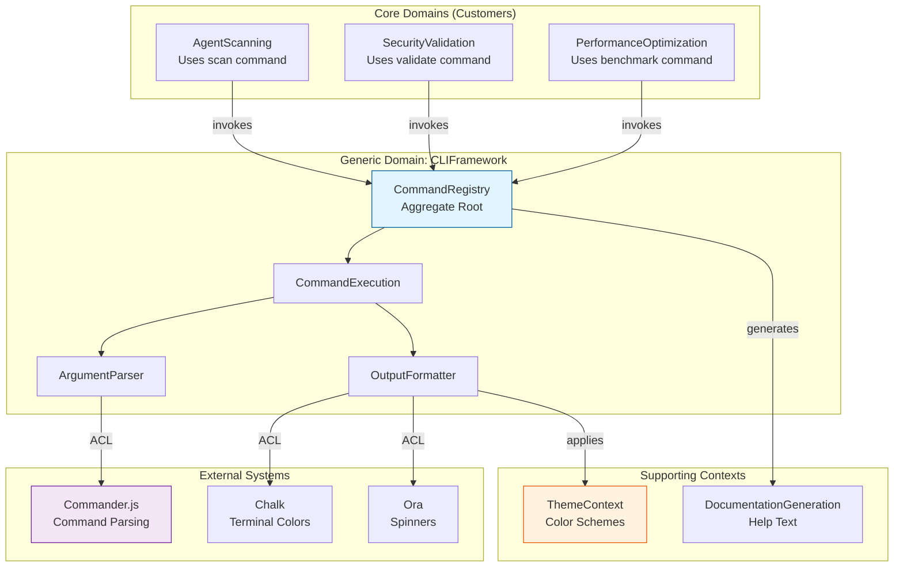
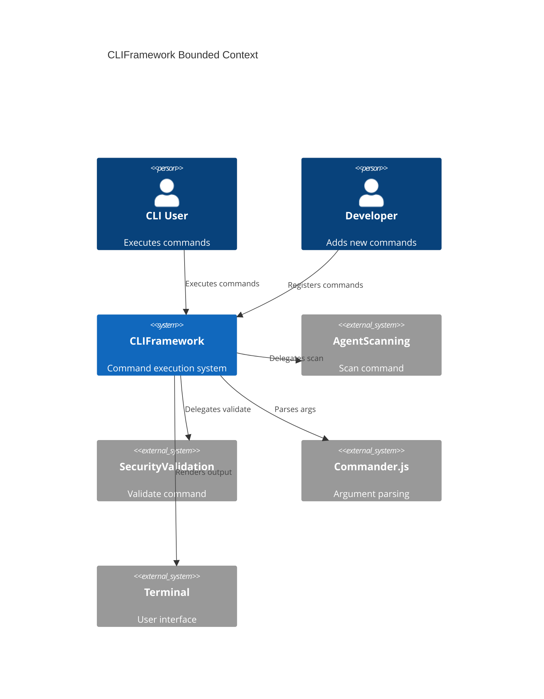
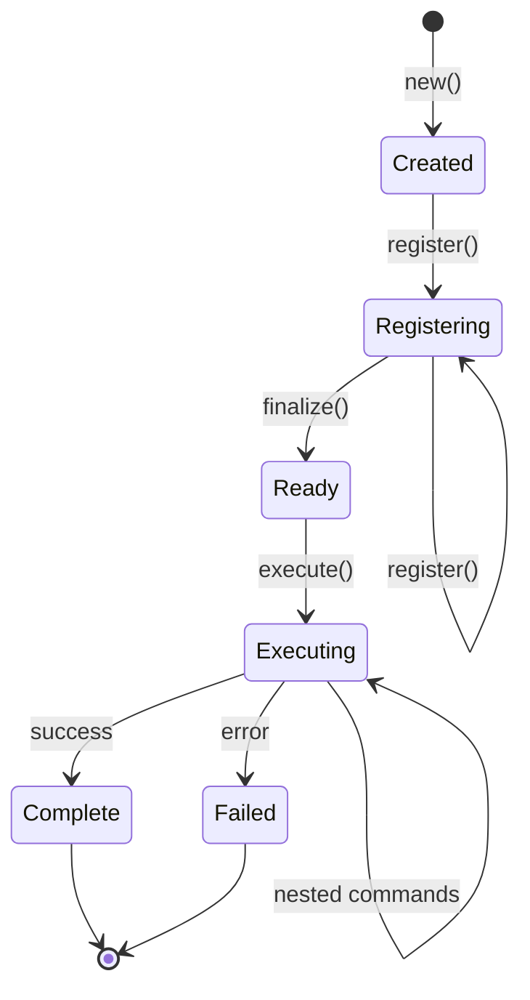
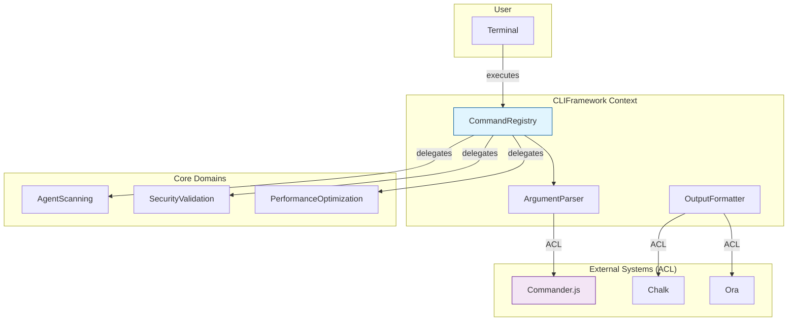

# DDD-007: CLI Framework Domain Model for AgentScope v1.2

**Status:** Proposed
**Created:** 2026-01-27
**Author:** DDD Domain Expert Agent
**Domain:** CLI Framework with Command Orchestration and Interactive UX
**Related:** ADR-008, ADR-025 (pending), DDD-005, DDD-006
**Package:** `@claude-flow/cli-framework`

---

## Executive Summary

This document defines the comprehensive Domain-Driven Design specification for the **CLI Framework domain** in AgentScope v1.2. The CLI Framework domain focuses on building a robust, extensible command-line interface with interactive features, argument parsing, output formatting, and plugin architecture.

**Key Innovation**: CLI Framework is not just command execution - it's an adaptive system that provides terminal-native UX, auto-completion, interactive prompts, progress tracking, and multi-format output generation.

---

## Table of Contents

1. [Strategic Design](#1-strategic-design)
2. [Bounded Context: CLIFramework](#2-bounded-context-cliframework)
3. [Aggregate Roots](#3-aggregate-roots)
4. [Domain Entities](#4-domain-entities)
5. [Value Objects](#5-value-objects)
6. [Domain Events](#6-domain-events)
7. [Domain Services](#7-domain-services)
8. [Integration Points](#8-integration-points)
9. [Context Map](#9-context-map)
10. [Ubiquitous Language](#10-ubiquitous-language)
11. [Implementation Guidelines](#11-implementation-guidelines)

---

## 1. Strategic Design

### 1.1 Domain Classification

| Domain | Type | Strategic Importance |
|--------|------|---------------------|
| **CLIFramework** | Generic | Enables user interaction with AgentScope features |

**Why Generic Domain?**
- Not core business differentiator
- Reusable across multiple projects
- Can leverage external packages (Commander.js, chalk, ora)
- Standardized CLI patterns exist
- Focus is on integration, not innovation

### 1.2 Domain Scope

**In Scope:**
- Command registration and execution
- Argument parsing (flags, options, positional args)
- Interactive prompts (text, confirmation, selection)
- Progress indication (spinners, bars, multi-progress)
- Output formatting (text, JSON, YAML, tables)
- Bash/Zsh completion generation
- Help text generation
- Color and styling support
- Validation and error handling
- Plugin architecture

**Out of Scope:**
- Business logic (delegated to core domains)
- File system operations (belongs to application layer)
- Network requests (belongs to infrastructure)
- Configuration management (separate concern)
- Security validation (belongs to Security domain)

### 1.3 Strategic Context Map



---

## 2. Bounded Context: CLIFramework

### 2.1 Context Overview

**Purpose:** Provide a rich command-line interface for AgentScope operations.

**Core Responsibilities:**
1. Register and organize commands with metadata
2. Parse command-line arguments and validate inputs
3. Execute command actions with proper error handling
4. Format and display output (text, tables, JSON, YAML)
5. Provide interactive prompts for user input
6. Show progress indicators for long operations
7. Generate help text and bash completions
8. Apply terminal colors and styling
9. Handle exit codes and error reporting

**Boundaries:**
- **Upstream:** Receives command requests from users via terminal
- **Downstream:** Delegates to core domains (AgentScanning, SecurityValidation, etc.)
- **External:** Integrates with Commander.js, chalk, ora via Anti-Corruption Layer

### 2.2 Context Diagram



---

## 3. Aggregate Roots

### 3.1 CommandRegistry (Aggregate Root)

**Purpose:** Central registry for all CLI commands with execution orchestration.

**Invariants:**
1. Command names must be unique (no duplicates)
2. At least one command must be registered
3. Commands must have valid action handlers
4. Help text must be generated for all commands
5. Exit codes must be 0 (success), 1 (error), or 2 (usage error)
6. Arguments must have valid types and constraints

**Lifecycle:**


**Aggregate Definition:**

```typescript
/**
 * Aggregate Root: CommandRegistry
 *
 * Represents the complete command registry with execution orchestration.
 * Enforces invariants around command uniqueness, validation, and execution.
 */
interface CommandRegistry {
  // Identity
  readonly id: RegistryId;
  readonly version: string;

  // Aggregate state
  readonly commands: Map<string, CommandDefinition>;
  readonly globalOptions: OptionDefinition[];
  readonly metadata: RegistryMetadata;

  // Aggregate behavior
  register(command: CommandDefinition): void;
  get(name: string): CommandDefinition | undefined;
  getByAlias(alias: string): CommandDefinition | undefined;
  getAll(): CommandDefinition[];
  execute(argv: string[]): Promise<ExecutionResult>;

  // Help generation
  generateHelp(): string;
  generateCommandHelp(commandName: string): string;
  generateBashCompletion(): string;
  generateZshCompletion(): string;

  // Validation
  validate(): ValidationResult;
  isComplete(): boolean;
}

/**
 * Aggregate Root Implementation
 */
class CommandRegistryImpl implements CommandRegistry {
  private commands: Map<string, CommandDefinition> = new Map();
  private aliases: Map<string, string> = new Map();
  private globalOptions: OptionDefinition[] = [];

  constructor(
    public readonly id: RegistryId,
    public readonly version: string
  ) {}

  register(command: CommandDefinition): void {
    // Invariant: Command names must be unique
    if (this.commands.has(command.name)) {
      throw new DuplicateCommandError(command.name);
    }

    // Invariant: Commands must have valid action handlers
    if (!command.action) {
      throw new InvalidCommandError('Command must have an action handler');
    }

    // Invariant: Arguments must have valid types
    for (const arg of command.arguments) {
      if (!this.isValidArgumentType(arg.type)) {
        throw new InvalidArgumentTypeError(arg.type);
      }
    }

    this.commands.set(command.name, command);

    // Register aliases
    if (command.aliases) {
      for (const alias of command.aliases) {
        if (this.aliases.has(alias)) {
          throw new DuplicateAliasError(alias);
        }
        this.aliases.set(alias, command.name);
      }
    }

    // Domain event
    this.raiseEvent({
      type: 'CommandRegistered',
      timestamp: new Date(),
      registryId: this.id,
      commandName: command.name,
      aliases: command.aliases || []
    });
  }

  async execute(argv: string[]): Promise<ExecutionResult> {
    const startTime = Date.now();

    try {
      // Parse arguments
      const parsed = await this.parseArguments(argv);

      // Get command
      const command = this.commands.get(parsed.commandName);
      if (!command) {
        throw new CommandNotFoundError(parsed.commandName);
      }

      // Validate arguments
      const validationResult = await this.validateArguments(
        command,
        parsed.arguments
      );

      if (!validationResult.valid) {
        throw new ArgumentValidationError(validationResult.errors);
      }

      // Execute command
      const result = await command.action(parsed.arguments, parsed.options);

      const duration = Date.now() - startTime;

      // Domain event
      this.raiseEvent({
        type: 'CommandExecuted',
        timestamp: new Date(),
        registryId: this.id,
        commandName: command.name,
        duration,
        exitCode: 0
      });

      return {
        success: true,
        exitCode: 0,
        duration,
        output: result
      };

    } catch (error) {
      const duration = Date.now() - startTime;
      const exitCode = this.determineExitCode(error);

      // Domain event
      this.raiseEvent({
        type: 'CommandFailed',
        timestamp: new Date(),
        registryId: this.id,
        error: error.message,
        exitCode,
        duration
      });

      return {
        success: false,
        exitCode,
        duration,
        error
      };
    }
  }

  generateHelp(): string {
    const lines: string[] = [];

    lines.push(`Usage: ${this.metadata.programName} <command> [options]`);
    lines.push('');
    lines.push('Commands:');

    // Sort commands alphabetically
    const sortedCommands = Array.from(this.commands.values())
      .sort((a, b) => a.name.localeCompare(b.name));

    const maxNameLength = Math.max(
      ...sortedCommands.map(c => c.name.length)
    );

    for (const command of sortedCommands) {
      const padding = ' '.repeat(maxNameLength - command.name.length + 2);
      lines.push(`  ${command.name}${padding}${command.description}`);

      if (command.aliases && command.aliases.length > 0) {
        lines.push(`    Aliases: ${command.aliases.join(', ')}`);
      }
    }

    lines.push('');
    lines.push('Global Options:');

    for (const option of this.globalOptions) {
      const flags = this.formatOptionFlags(option);
      const padding = ' '.repeat(20 - flags.length);
      lines.push(`  ${flags}${padding}${option.description}`);
    }

    lines.push('');
    lines.push(`Run '${this.metadata.programName} <command> --help' for more information on a command.`);

    return lines.join('\n');
  }

  generateBashCompletion(): string {
    const commandNames = Array.from(this.commands.keys());
    const aliases = Array.from(this.aliases.keys());
    const allCommands = [...commandNames, ...aliases];

    return `
_${this.metadata.programName}_completions() {
  local cur prev opts
  COMPREPLY=()
  cur="\${COMP_WORDS[COMP_CWORD]}"
  prev="\${COMP_WORDS[COMP_CWORD-1]}"
  opts="${allCommands.join(' ')}"

  if [[ \${COMP_CWORD} -eq 1 ]]; then
    COMPREPLY=( $(compgen -W "\${opts}" -- \${cur}) )
    return 0
  fi

  case "\${prev}" in
    ${this.generateOptionCompletions()}
  esac
}

complete -F _${this.metadata.programName}_completions ${this.metadata.programName}
    `.trim();
  }

  private isValidArgumentType(type: ArgumentType): boolean {
    const validTypes = ['string', 'number', 'boolean', 'array'];
    return validTypes.includes(type);
  }

  private determineExitCode(error: Error): number {
    if (error instanceof ArgumentValidationError) return 2;
    if (error instanceof CommandNotFoundError) return 2;
    return 1;
  }

  private formatOptionFlags(option: OptionDefinition): string {
    const parts: string[] = [];

    if (option.short) {
      parts.push(`-${option.short}`);
    }

    if (option.long) {
      parts.push(`--${option.long}`);
    }

    if (option.argument) {
      parts.push(`<${option.argument}>`);
    }

    return parts.join(', ');
  }

  private generateOptionCompletions(): string {
    const completions: string[] = [];

    for (const [name, command] of this.commands) {
      for (const option of command.options) {
        if (option.choices) {
          completions.push(`    --${option.long})`);
          completions.push(`      COMPREPLY=( $(compgen -W "${option.choices.join(' ')}" -- \${cur}) )`);
          completions.push(`      return 0`);
          completions.push(`      ;;`);
        }
      }
    }

    return completions.join('\n');
  }

  private raiseEvent(event: any): void {
    // Event sourcing integration
  }

  private async parseArguments(argv: string[]): Promise<ParsedArguments> {
    // Delegate to ArgumentParser service
    return {} as ParsedArguments;
  }

  private async validateArguments(
    command: CommandDefinition,
    args: Record<string, any>
  ): Promise<ValidationResult> {
    // Delegate to validation service
    return { valid: true, errors: [] };
  }
}
```

---

## 4. Domain Entities

### 4.1 CommandDefinition (Entity)

**Purpose:** Individual command with arguments, options, and execution logic.

**Identity:** Unique `CommandName` (string)

**Lifecycle:** Created → Registered → Executed → Completed

```typescript
/**
 * Entity: CommandDefinition
 *
 * Represents a single CLI command with all its configuration.
 */
interface CommandDefinition {
  // Identity
  readonly name: string;

  // Attributes
  readonly description: string;
  readonly aliases?: string[];
  readonly arguments: ArgumentDefinition[];
  readonly options: OptionDefinition[];
  readonly action: CommandAction;
  readonly examples?: CommandExample[];
  readonly category?: string;
  readonly hidden?: boolean;

  // Behavior
  execute(args: Record<string, any>, opts: Record<string, any>): Promise<any>;
  generateHelp(): string;
  validate(): ValidationResult;
}

/**
 * Command Action Handler
 */
type CommandAction = (
  args: Record<string, any>,
  opts: Record<string, any>
) => Promise<void> | void;

/**
 * Command Example (Value Object)
 */
interface CommandExample {
  readonly description: string;
  readonly command: string;
  readonly output?: string;
}
```

### 4.2 ArgumentDefinition (Entity)

**Purpose:** Positional argument with type and validation.

**Identity:** Unique `ArgumentName` within command

```typescript
/**
 * Entity: ArgumentDefinition
 *
 * Represents a positional argument for a command.
 */
interface ArgumentDefinition {
  // Identity
  readonly name: string;

  // Attributes
  readonly description: string;
  readonly type: ArgumentType;
  readonly required: boolean;
  readonly variadic?: boolean;
  readonly defaultValue?: any;
  readonly validator?: ArgumentValidator;
  readonly transformer?: ArgumentTransformer;

  // Behavior
  parse(value: string): any;
  validate(value: any): ValidationResult;
  transform(value: any): any;
}

type ArgumentType = 'string' | 'number' | 'boolean' | 'array';

type ArgumentValidator = (value: any) => boolean | string;

type ArgumentTransformer = (value: any) => any;
```

### 4.3 OptionDefinition (Entity)

**Purpose:** Named option (flag) with type and validation.

**Identity:** Unique `OptionName` within command

```typescript
/**
 * Entity: OptionDefinition
 *
 * Represents a named option (flag) for a command.
 */
interface OptionDefinition {
  // Identity
  readonly long: string;

  // Attributes
  readonly short?: string;
  readonly description: string;
  readonly type: OptionType;
  readonly argument?: string;
  readonly required?: boolean;
  readonly defaultValue?: any;
  readonly choices?: string[];
  readonly validator?: OptionValidator;
  readonly conflicts?: string[];
  readonly requires?: string[];

  // Behavior
  parse(value: string): any;
  validate(value: any): ValidationResult;
}

type OptionType = 'boolean' | 'string' | 'number' | 'array';

type OptionValidator = (value: any) => boolean | string;
```

### 4.4 InteractivePrompt (Entity)

**Purpose:** Interactive user input with validation.

**Identity:** Unique `PromptId`

```typescript
/**
 * Entity: InteractivePrompt
 *
 * Represents an interactive prompt for user input.
 */
interface InteractivePrompt {
  // Identity
  readonly id: PromptId;

  // Attributes
  readonly type: PromptType;
  readonly message: string;
  readonly defaultValue?: any;
  readonly choices?: PromptChoice[];
  readonly validator?: PromptValidator;
  readonly transformer?: PromptTransformer;
  readonly mask?: string;

  // Behavior
  ask(): Promise<any>;
  validate(value: any): ValidationResult;
  transform(value: any): any;
}

type PromptType =
  | 'text'
  | 'password'
  | 'confirmation'
  | 'select'
  | 'multiSelect'
  | 'number'
  | 'email'
  | 'url';

interface PromptChoice {
  readonly name: string;
  readonly value: any;
  readonly description?: string;
  readonly disabled?: boolean;
}

type PromptValidator = (value: any) => boolean | string | Promise<boolean | string>;

type PromptTransformer = (value: any) => any;
```

---

## 5. Value Objects

### 5.1 OutputFormat (Value Object)

**Purpose:** Immutable output format specification.

```typescript
/**
 * Value Object: OutputFormat
 *
 * Immutable specification for output formatting.
 */
interface OutputFormat {
  readonly format: FormatType;
  readonly colorize: boolean;
  readonly compact?: boolean;
  readonly indent?: number;
  readonly borders?: boolean;
}

type FormatType = 'text' | 'json' | 'yaml' | 'table';

/**
 * Factory for creating output formats
 */
class OutputFormatFactory {
  static createText(colorize: boolean = true): OutputFormat {
    return {
      format: 'text',
      colorize
    };
  }

  static createJSON(compact: boolean = false): OutputFormat {
    return {
      format: 'json',
      colorize: false,
      compact,
      indent: compact ? 0 : 2
    };
  }

  static createTable(borders: boolean = true): OutputFormat {
    return {
      format: 'table',
      colorize: true,
      borders
    };
  }

  static createYAML(): OutputFormat {
    return {
      format: 'yaml',
      colorize: false,
      indent: 2
    };
  }
}
```

### 5.2 ExitCode (Value Object)

**Purpose:** Immutable exit code with semantic meaning.

```typescript
/**
 * Value Object: ExitCode
 *
 * Immutable exit code following POSIX conventions.
 */
interface ExitCode {
  readonly code: number;
  readonly meaning: string;
  readonly category: ExitCategory;
}

type ExitCategory = 'success' | 'error' | 'usage';

/**
 * Standard exit codes
 */
const EXIT_CODES = {
  SUCCESS: { code: 0, meaning: 'Success', category: 'success' as const },
  ERROR: { code: 1, meaning: 'General error', category: 'error' as const },
  USAGE: { code: 2, meaning: 'Usage error', category: 'usage' as const }
};

/**
 * Factory for creating exit codes
 */
class ExitCodeFactory {
  static success(): ExitCode {
    return EXIT_CODES.SUCCESS;
  }

  static error(meaning: string = 'General error'): ExitCode {
    return {
      code: 1,
      meaning,
      category: 'error'
    };
  }

  static usage(meaning: string = 'Usage error'): ExitCode {
    return {
      code: 2,
      meaning,
      category: 'usage'
    };
  }
}
```

### 5.3 ProgressIndicator (Value Object)

**Purpose:** Immutable progress indicator configuration.

```typescript
/**
 * Value Object: ProgressIndicator
 *
 * Immutable configuration for progress display.
 */
interface ProgressIndicator {
  readonly type: ProgressType;
  readonly message: string;
  readonly total?: number;
  readonly current?: number;
  readonly showPercentage?: boolean;
  readonly showETA?: boolean;
  readonly spinner?: SpinnerType;
}

type ProgressType = 'spinner' | 'bar' | 'multi';

type SpinnerType = 'dots' | 'line' | 'circle' | 'arrow';

/**
 * Factory for creating progress indicators
 */
class ProgressIndicatorFactory {
  static createSpinner(
    message: string,
    spinner: SpinnerType = 'dots'
  ): ProgressIndicator {
    return {
      type: 'spinner',
      message,
      spinner
    };
  }

  static createBar(
    message: string,
    total: number,
    current: number = 0
  ): ProgressIndicator {
    return {
      type: 'bar',
      message,
      total,
      current,
      showPercentage: true,
      showETA: true
    };
  }

  static createMulti(message: string): ProgressIndicator {
    return {
      type: 'multi',
      message
    };
  }
}
```

### 5.4 ColorScheme (Value Object)

**Purpose:** Immutable color scheme for terminal output.

```typescript
/**
 * Value Object: ColorScheme
 *
 * Immutable color scheme using ANSI codes.
 */
interface ColorScheme {
  readonly error: string;
  readonly warning: string;
  readonly success: string;
  readonly info: string;
  readonly muted: string;
  readonly highlight: string;
}

/**
 * Predefined color schemes
 */
const COLOR_SCHEMES = {
  DEFAULT: {
    error: '\x1b[31m',      // Red
    warning: '\x1b[33m',    // Yellow
    success: '\x1b[32m',    // Green
    info: '\x1b[34m',       // Blue
    muted: '\x1b[90m',      // Gray
    highlight: '\x1b[36m'   // Cyan
  },
  NO_COLOR: {
    error: '',
    warning: '',
    success: '',
    info: '',
    muted: '',
    highlight: ''
  }
};

/**
 * Factory for creating color schemes
 */
class ColorSchemeFactory {
  static create(noColor: boolean = false): ColorScheme {
    return noColor ? COLOR_SCHEMES.NO_COLOR : COLOR_SCHEMES.DEFAULT;
  }

  static fromEnvironment(): ColorScheme {
    const noColor = process.env.NO_COLOR !== undefined ||
                    process.env.TERM === 'dumb';

    return this.create(noColor);
  }
}
```

---

## 6. Domain Events

### 6.1 Event Catalog

```typescript
/**
 * Domain Events for CLI Framework
 */
type CLIDomainEvent =
  | CommandRegistered
  | CommandExecuted
  | CommandFailed
  | ArgumentParsed
  | PromptDisplayed
  | PromptAnswered
  | OutputFormatted
  | ProgressUpdated;

/**
 * Event: CommandRegistered
 */
interface CommandRegistered {
  readonly type: 'CommandRegistered';
  readonly timestamp: Date;
  readonly registryId: string;
  readonly commandName: string;
  readonly aliases: string[];
}

/**
 * Event: CommandExecuted
 */
interface CommandExecuted {
  readonly type: 'CommandExecuted';
  readonly timestamp: Date;
  readonly registryId: string;
  readonly commandName: string;
  readonly duration: number;
  readonly exitCode: number;
}

/**
 * Event: CommandFailed
 */
interface CommandFailed {
  readonly type: 'CommandFailed';
  readonly timestamp: Date;
  readonly registryId: string;
  readonly error: string;
  readonly exitCode: number;
  readonly duration: number;
}

/**
 * Event: ArgumentParsed
 */
interface ArgumentParsed {
  readonly type: 'ArgumentParsed';
  readonly timestamp: Date;
  readonly commandName: string;
  readonly arguments: Record<string, any>;
  readonly options: Record<string, any>;
}

/**
 * Event: PromptDisplayed
 */
interface PromptDisplayed {
  readonly type: 'PromptDisplayed';
  readonly timestamp: Date;
  readonly promptId: string;
  readonly promptType: PromptType;
  readonly message: string;
}

/**
 * Event: PromptAnswered
 */
interface PromptAnswered {
  readonly type: 'PromptAnswered';
  readonly timestamp: Date;
  readonly promptId: string;
  readonly value: any;
  readonly valid: boolean;
}

/**
 * Event: OutputFormatted
 */
interface OutputFormatted {
  readonly type: 'OutputFormatted';
  readonly timestamp: Date;
  readonly format: FormatType;
  readonly size: number;
}

/**
 * Event: ProgressUpdated
 */
interface ProgressUpdated {
  readonly type: 'ProgressUpdated';
  readonly timestamp: Date;
  readonly progressType: ProgressType;
  readonly current: number;
  readonly total: number;
}
```

---

## 7. Domain Services

### 7.1 ArgumentParsingService

**Purpose:** Parse and validate command-line arguments.

```typescript
/**
 * Domain Service: ArgumentParsingService
 *
 * Parses and validates command-line arguments.
 */
interface ArgumentParsingService {
  parse(argv: string[], command: CommandDefinition): Promise<ParsedArguments>;
  validate(parsed: ParsedArguments, command: CommandDefinition): Promise<ValidationResult>;
  applyDefaults(parsed: ParsedArguments, command: CommandDefinition): ParsedArguments;
}

/**
 * Parsed Arguments (Value Object)
 */
interface ParsedArguments {
  readonly commandName: string;
  readonly arguments: Record<string, any>;
  readonly options: Record<string, any>;
  readonly flags: string[];
  readonly unknown: string[];
}

/**
 * Implementation with Commander.js ACL
 */
class ArgumentParsingServiceImpl implements ArgumentParsingService {
  async parse(
    argv: string[],
    command: CommandDefinition
  ): Promise<ParsedArguments> {
    // Use Commander.js via ACL
    const program = this.createProgram(command);

    try {
      program.parse(argv);

      return {
        commandName: command.name,
        arguments: this.extractArguments(program),
        options: this.extractOptions(program),
        flags: this.extractFlags(program),
        unknown: program.args
      };
    } catch (error) {
      throw new ArgumentParseError(error.message);
    }
  }

  async validate(
    parsed: ParsedArguments,
    command: CommandDefinition
  ): Promise<ValidationResult> {
    const errors: ValidationError[] = [];

    // Validate required arguments
    for (const arg of command.arguments) {
      if (arg.required && !(arg.name in parsed.arguments)) {
        errors.push({
          field: arg.name,
          message: `Required argument <${arg.name}> is missing`
        });
      }

      // Validate argument value
      if (arg.name in parsed.arguments && arg.validator) {
        const value = parsed.arguments[arg.name];
        const result = arg.validator(value);

        if (typeof result === 'string') {
          errors.push({
            field: arg.name,
            message: result
          });
        } else if (result === false) {
          errors.push({
            field: arg.name,
            message: `Invalid value for argument <${arg.name}>`
          });
        }
      }
    }

    // Validate required options
    for (const opt of command.options) {
      if (opt.required && !(opt.long in parsed.options)) {
        errors.push({
          field: opt.long,
          message: `Required option --${opt.long} is missing`
        });
      }

      // Validate option value
      if (opt.long in parsed.options && opt.validator) {
        const value = parsed.options[opt.long];
        const result = opt.validator(value);

        if (typeof result === 'string') {
          errors.push({
            field: opt.long,
            message: result
          });
        } else if (result === false) {
          errors.push({
            field: opt.long,
            message: `Invalid value for option --${opt.long}`
          });
        }
      }

      // Validate choices
      if (opt.choices && opt.long in parsed.options) {
        const value = parsed.options[opt.long];

        if (!opt.choices.includes(value)) {
          errors.push({
            field: opt.long,
            message: `Invalid choice for --${opt.long}. Expected one of: ${opt.choices.join(', ')}`
          });
        }
      }
    }

    // Validate conflicts
    for (const opt of command.options) {
      if (opt.conflicts && opt.long in parsed.options) {
        for (const conflictingOption of opt.conflicts) {
          if (conflictingOption in parsed.options) {
            errors.push({
              field: opt.long,
              message: `Option --${opt.long} conflicts with --${conflictingOption}`
            });
          }
        }
      }
    }

    // Validate requirements
    for (const opt of command.options) {
      if (opt.requires && opt.long in parsed.options) {
        for (const requiredOption of opt.requires) {
          if (!(requiredOption in parsed.options)) {
            errors.push({
              field: opt.long,
              message: `Option --${opt.long} requires --${requiredOption}`
            });
          }
        }
      }
    }

    return {
      valid: errors.length === 0,
      errors
    };
  }

  applyDefaults(
    parsed: ParsedArguments,
    command: CommandDefinition
  ): ParsedArguments {
    const argumentsWithDefaults = { ...parsed.arguments };
    const optionsWithDefaults = { ...parsed.options };

    // Apply argument defaults
    for (const arg of command.arguments) {
      if (arg.defaultValue !== undefined && !(arg.name in argumentsWithDefaults)) {
        argumentsWithDefaults[arg.name] = arg.defaultValue;
      }
    }

    // Apply option defaults
    for (const opt of command.options) {
      if (opt.defaultValue !== undefined && !(opt.long in optionsWithDefaults)) {
        optionsWithDefaults[opt.long] = opt.defaultValue;
      }
    }

    return {
      ...parsed,
      arguments: argumentsWithDefaults,
      options: optionsWithDefaults
    };
  }

  private createProgram(command: CommandDefinition): any {
    // Create Commander.js program (ACL)
    return {};
  }

  private extractArguments(program: any): Record<string, any> {
    // Extract arguments from Commander.js
    return {};
  }

  private extractOptions(program: any): Record<string, any> {
    // Extract options from Commander.js
    return {};
  }

  private extractFlags(program: any): string[] {
    // Extract boolean flags from Commander.js
    return [];
  }
}
```

### 7.2 OutputFormattingService

**Purpose:** Format and display output in multiple formats.

```typescript
/**
 * Domain Service: OutputFormattingService
 *
 * Formats output in text, JSON, YAML, or table format.
 */
interface OutputFormattingService {
  formatText(data: any, colorize: boolean): string;
  formatJSON(data: any, compact: boolean): string;
  formatYAML(data: any): string;
  formatTable(data: any[], headers: string[], borders: boolean): string;
  display(data: any, format: OutputFormat): void;
}

/**
 * Implementation with chalk and ora ACL
 */
class OutputFormattingServiceImpl implements OutputFormattingService {
  formatText(data: any, colorize: boolean = true): string {
    const scheme = ColorSchemeFactory.create(!colorize);

    if (typeof data === 'string') {
      return data;
    }

    if (typeof data === 'object') {
      return this.formatObjectAsText(data, scheme);
    }

    return String(data);
  }

  formatJSON(data: any, compact: boolean = false): string {
    const indent = compact ? 0 : 2;
    return JSON.stringify(data, null, indent);
  }

  formatYAML(data: any): string {
    // Use yaml library via ACL
    return this.toYAML(data);
  }

  formatTable(
    data: any[],
    headers: string[],
    borders: boolean = true
  ): string {
    const rows: string[][] = [];

    // Add header row
    rows.push(headers);

    // Add data rows
    for (const item of data) {
      const row: string[] = [];

      for (const header of headers) {
        const value = item[header];
        row.push(this.formatCellValue(value));
      }

      rows.push(row);
    }

    return this.renderTable(rows, borders);
  }

  display(data: any, format: OutputFormat): void {
    let output: string;

    switch (format.format) {
      case 'text':
        output = this.formatText(data, format.colorize);
        break;
      case 'json':
        output = this.formatJSON(data, format.compact || false);
        break;
      case 'yaml':
        output = this.formatYAML(data);
        break;
      case 'table':
        if (Array.isArray(data)) {
          const headers = Object.keys(data[0] || {});
          output = this.formatTable(data, headers, format.borders || true);
        } else {
          throw new Error('Table format requires array data');
        }
        break;
    }

    console.log(output);
  }

  private formatObjectAsText(obj: any, scheme: ColorScheme): string {
    const lines: string[] = [];

    for (const [key, value] of Object.entries(obj)) {
      const formattedKey = `${scheme.highlight}${key}${scheme.muted}:`;
      const formattedValue = this.formatValue(value, scheme);

      lines.push(`${formattedKey} ${formattedValue}`);
    }

    return lines.join('\n');
  }

  private formatValue(value: any, scheme: ColorScheme): string {
    if (typeof value === 'boolean') {
      return value ? `${scheme.success}true` : `${scheme.error}false`;
    }

    if (typeof value === 'number') {
      return `${scheme.info}${value}`;
    }

    if (typeof value === 'string') {
      return value;
    }

    if (Array.isArray(value)) {
      return value.map(v => this.formatValue(v, scheme)).join(', ');
    }

    return String(value);
  }

  private formatCellValue(value: any): string {
    if (value === null || value === undefined) {
      return '';
    }

    if (typeof value === 'boolean') {
      return value ? '✓' : '✗';
    }

    return String(value);
  }

  private renderTable(rows: string[][], borders: boolean): string {
    // Calculate column widths
    const colWidths = this.calculateColumnWidths(rows);

    const lines: string[] = [];

    // Top border
    if (borders) {
      lines.push(this.renderBorder(colWidths, '┌', '┬', '┐'));
    }

    // Header row
    lines.push(this.renderRow(rows[0], colWidths, borders));

    // Header separator
    if (borders) {
      lines.push(this.renderBorder(colWidths, '├', '┼', '┤'));
    }

    // Data rows
    for (let i = 1; i < rows.length; i++) {
      lines.push(this.renderRow(rows[i], colWidths, borders));
    }

    // Bottom border
    if (borders) {
      lines.push(this.renderBorder(colWidths, '└', '┴', '┘'));
    }

    return lines.join('\n');
  }

  private calculateColumnWidths(rows: string[][]): number[] {
    const widths: number[] = [];

    for (const row of rows) {
      for (let i = 0; i < row.length; i++) {
        const width = row[i].length;

        if (widths[i] === undefined || width > widths[i]) {
          widths[i] = width;
        }
      }
    }

    return widths;
  }

  private renderRow(row: string[], widths: number[], borders: boolean): string {
    const cells = row.map((cell, i) => {
      const padding = ' '.repeat(widths[i] - cell.length);
      return ` ${cell}${padding} `;
    });

    if (borders) {
      return `│${cells.join('│')}│`;
    } else {
      return cells.join('  ');
    }
  }

  private renderBorder(
    widths: number[],
    left: string,
    middle: string,
    right: string
  ): string {
    const segments = widths.map(w => '─'.repeat(w + 2));
    return `${left}${segments.join(middle)}${right}`;
  }

  private toYAML(data: any): string {
    // YAML conversion (simplified)
    return JSON.stringify(data, null, 2);
  }
}
```

### 7.3 InteractivePromptService

**Purpose:** Display interactive prompts and collect user input.

```typescript
/**
 * Domain Service: InteractivePromptService
 *
 * Displays interactive prompts for user input.
 */
interface InteractivePromptService {
  askText(prompt: InteractivePrompt): Promise<string>;
  askPassword(prompt: InteractivePrompt): Promise<string>;
  askConfirmation(prompt: InteractivePrompt): Promise<boolean>;
  askSelect(prompt: InteractivePrompt): Promise<any>;
  askMultiSelect(prompt: InteractivePrompt): Promise<any[]>;
  askNumber(prompt: InteractivePrompt): Promise<number>;
}

/**
 * Implementation with inquirer ACL
 */
class InteractivePromptServiceImpl implements InteractivePromptService {
  async askText(prompt: InteractivePrompt): Promise<string> {
    const answer = await this.prompt({
      type: 'input',
      message: prompt.message,
      default: prompt.defaultValue,
      validate: prompt.validator,
      transformer: prompt.transformer
    });

    return answer;
  }

  async askPassword(prompt: InteractivePrompt): Promise<string> {
    const answer = await this.prompt({
      type: 'password',
      message: prompt.message,
      mask: prompt.mask || '*',
      validate: prompt.validator
    });

    return answer;
  }

  async askConfirmation(prompt: InteractivePrompt): Promise<boolean> {
    const answer = await this.prompt({
      type: 'confirm',
      message: prompt.message,
      default: prompt.defaultValue ?? true
    });

    return answer;
  }

  async askSelect(prompt: InteractivePrompt): Promise<any> {
    if (!prompt.choices || prompt.choices.length === 0) {
      throw new Error('Select prompt requires choices');
    }

    const answer = await this.prompt({
      type: 'list',
      message: prompt.message,
      choices: prompt.choices.map(c => ({
        name: c.description ? `${c.name} - ${c.description}` : c.name,
        value: c.value,
        disabled: c.disabled
      })),
      default: prompt.defaultValue
    });

    return answer;
  }

  async askMultiSelect(prompt: InteractivePrompt): Promise<any[]> {
    if (!prompt.choices || prompt.choices.length === 0) {
      throw new Error('Multi-select prompt requires choices');
    }

    const answer = await this.prompt({
      type: 'checkbox',
      message: prompt.message,
      choices: prompt.choices.map(c => ({
        name: c.description ? `${c.name} - ${c.description}` : c.name,
        value: c.value,
        checked: false,
        disabled: c.disabled
      })),
      validate: (selected: any[]) => {
        if (selected.length === 0) {
          return 'You must select at least one option';
        }
        return true;
      }
    });

    return answer;
  }

  async askNumber(prompt: InteractivePrompt): Promise<number> {
    const answer = await this.prompt({
      type: 'number',
      message: prompt.message,
      default: prompt.defaultValue,
      validate: (value: any) => {
        if (isNaN(value)) {
          return 'Please enter a valid number';
        }

        if (prompt.validator) {
          return prompt.validator(value);
        }

        return true;
      }
    });

    return answer;
  }

  private async prompt(config: any): Promise<any> {
    // Use inquirer library via ACL
    return {};
  }
}
```

### 7.4 ProgressDisplayService

**Purpose:** Display progress indicators (spinners, bars).

```typescript
/**
 * Domain Service: ProgressDisplayService
 *
 * Displays progress indicators for long-running operations.
 */
interface ProgressDisplayService {
  startSpinner(message: string): ProgressHandle;
  startProgressBar(message: string, total: number): ProgressHandle;
  startMultiProgress(message: string): MultiProgressHandle;
}

/**
 * Progress Handle
 */
interface ProgressHandle {
  update(current: number): void;
  updateMessage(message: string): void;
  succeed(message?: string): void;
  fail(message?: string): void;
  stop(): void;
}

/**
 * Multi Progress Handle
 */
interface MultiProgressHandle {
  addBar(message: string, total: number): ProgressHandle;
  remove(handle: ProgressHandle): void;
  stop(): void;
}

/**
 * Implementation with ora and cli-progress ACL
 */
class ProgressDisplayServiceImpl implements ProgressDisplayService {
  startSpinner(message: string): ProgressHandle {
    const spinner = this.createSpinner(message);

    spinner.start();

    return {
      update: (current: number) => {
        // Spinners don't show progress
      },
      updateMessage: (msg: string) => {
        spinner.text = msg;
      },
      succeed: (msg?: string) => {
        spinner.succeed(msg);
      },
      fail: (msg?: string) => {
        spinner.fail(msg);
      },
      stop: () => {
        spinner.stop();
      }
    };
  }

  startProgressBar(message: string, total: number): ProgressHandle {
    const bar = this.createProgressBar(message, total);

    return {
      update: (current: number) => {
        bar.update(current);
      },
      updateMessage: (msg: string) => {
        // Progress bars don't support message updates
      },
      succeed: (msg?: string) => {
        bar.update(total);
        bar.stop();
      },
      fail: (msg?: string) => {
        bar.stop();
      },
      stop: () => {
        bar.stop();
      }
    };
  }

  startMultiProgress(message: string): MultiProgressHandle {
    const multi = this.createMultiBar();

    return {
      addBar: (msg: string, total: number) => {
        const bar = multi.create(total, 0);

        return {
          update: (current: number) => {
            bar.update(current);
          },
          updateMessage: (message: string) => {
            // Not supported
          },
          succeed: (message?: string) => {
            bar.update(total);
          },
          fail: (message?: string) => {
            bar.stop();
          },
          stop: () => {
            bar.stop();
          }
        };
      },
      remove: (handle: ProgressHandle) => {
        // Not directly supported
      },
      stop: () => {
        multi.stop();
      }
    };
  }

  private createSpinner(message: string): any {
    // Create ora spinner (ACL)
    return {};
  }

  private createProgressBar(message: string, total: number): any {
    // Create cli-progress bar (ACL)
    return {};
  }

  private createMultiBar(): any {
    // Create cli-progress multi-bar (ACL)
    return {};
  }
}
```

---

## 8. Integration Points

### 8.1 With Core Domains

**AgentScanning Domain:**
```typescript
/**
 * Integration: AgentScanning uses CLI Framework
 */
const scanCommand: CommandDefinition = {
  name: 'scan',
  description: 'Scan agent configs and generate documentation',
  arguments: [],
  options: [
    {
      long: 'output',
      short: 'o',
      description: 'Output directory',
      type: 'string',
      argument: 'dir',
      defaultValue: 'docs/agent-architecture'
    },
    {
      long: 'theme',
      short: 't',
      description: 'Theme name',
      type: 'string',
      argument: 'name',
      defaultValue: 'light',
      choices: ['light', 'dark', 'high-contrast-light', 'high-contrast-dark']
    }
  ],
  action: async (args, opts) => {
    // Delegate to AgentScanning domain
    const scanner = new AgentScanner();
    const result = await scanner.scan({
      outputDir: opts.output,
      theme: opts.theme
    });

    console.log(`✓ Generated documentation in ${opts.output}`);
  }
};
```

**SecurityValidation Domain:**
```typescript
/**
 * Integration: SecurityValidation uses CLI Framework
 */
const validateCommand: CommandDefinition = {
  name: 'validate',
  description: 'Validate agent configuration security',
  arguments: [],
  options: [
    {
      long: 'strict',
      short: 's',
      description: 'Strict validation mode',
      type: 'boolean',
      defaultValue: false
    }
  ],
  action: async (args, opts) => {
    // Delegate to SecurityValidation domain
    const validator = new SecurityValidator();
    const result = await validator.validate({
      strict: opts.strict
    });

    if (result.passed) {
      console.log('✓ Validation passed');
    } else {
      console.error('✗ Validation failed');
      process.exit(1);
    }
  }
};
```

### 8.2 With External Systems

**Commander.js ACL:**
```typescript
/**
 * Anti-Corruption Layer for Commander.js
 */
class CommanderACL {
  createProgram(registry: CommandRegistry): any {
    const { Command } = require('commander');
    const program = new Command();

    program
      .name(registry.metadata.programName)
      .version(registry.version);

    for (const command of registry.getAll()) {
      const cmd = program
        .command(command.name)
        .description(command.description);

      // Add aliases
      if (command.aliases) {
        cmd.aliases(command.aliases);
      }

      // Add arguments
      for (const arg of command.arguments) {
        const argSpec = arg.required
          ? `<${arg.name}>`
          : `[${arg.name}]`;

        cmd.argument(argSpec, arg.description);
      }

      // Add options
      for (const opt of command.options) {
        const flags = opt.short
          ? `-${opt.short}, --${opt.long}`
          : `--${opt.long}`;

        const optSpec = opt.argument
          ? `${flags} <${opt.argument}>`
          : flags;

        cmd.option(optSpec, opt.description, opt.defaultValue);
      }

      // Add action
      cmd.action(command.action);
    }

    return program;
  }
}
```

**Chalk ACL:**
```typescript
/**
 * Anti-Corruption Layer for Chalk
 */
class ChalkACL {
  private chalk: any;

  constructor() {
    this.chalk = require('chalk');
  }

  error(text: string): string {
    return this.chalk.red(text);
  }

  warning(text: string): string {
    return this.chalk.yellow(text);
  }

  success(text: string): string {
    return this.chalk.green(text);
  }

  info(text: string): string {
    return this.chalk.blue(text);
  }

  muted(text: string): string {
    return this.chalk.gray(text);
  }

  highlight(text: string): string {
    return this.chalk.cyan(text);
  }

  stripColors(text: string): string {
    return text.replace(/\x1b\[\d+m/g, '');
  }
}
```

---

## 9. Context Map

### 9.1 Relationship Types

| Upstream Context | Downstream Context | Relationship | Integration Pattern |
|------------------|-------------------|--------------|---------------------|
| User | CLIFramework | Customer | Command execution |
| CLIFramework | AgentScanning | Supplier | Command delegation |
| CLIFramework | SecurityValidation | Supplier | Command delegation |
| CLIFramework | PerformanceOptimization | Supplier | Command delegation |
| CLIFramework | ThemeContext | Partnership | Color scheme sharing |
| CLIFramework | Commander.js | Anti-Corruption Layer | Argument parsing |
| CLIFramework | Chalk | Anti-Corruption Layer | Terminal colors |
| CLIFramework | Ora | Anti-Corruption Layer | Progress spinners |

### 9.2 Integration Patterns



---

## 10. Ubiquitous Language

### 10.1 Core Terms

| Term | Definition | Usage |
|------|------------|-------|
| **Command** | User-invocable CLI operation | "The scan command generates documentation" |
| **Argument** | Positional parameter for command | "The name argument is required" |
| **Option** | Named parameter with flag | "Use the --output option to specify directory" |
| **Flag** | Boolean option (no value) | "The --verbose flag enables detailed output" |
| **Prompt** | Interactive user input request | "The prompt asks for confirmation" |
| **Format** | Output representation type | "Use JSON format for scripting" |
| **Progress** | Visual indicator for operations | "The progress bar shows completion" |
| **Exit Code** | Process termination status | "Exit code 0 indicates success" |
| **Completion** | Shell auto-completion script | "Install bash completion for suggestions" |
| **Help Text** | Auto-generated usage documentation | "Run --help to see available options" |

### 10.2 Command-Specific Terms

| Term | Definition | Example |
|------|------------|---------|
| **Alias** | Alternative command name | "validate has alias 'v'" |
| **Subcommand** | Nested command under parent | "git commit is a subcommand" |
| **Variadic** | Accepts multiple values | "files... accepts any number of files" |
| **Validator** | Input validation function | "Validator ensures email format" |
| **Transformer** | Input transformation function | "Transformer converts to uppercase" |
| **Choice** | Valid option value | "Theme choices: light, dark" |
| **Conflict** | Mutually exclusive options | "--json conflicts with --yaml" |
| **Requirement** | Dependent option | "--theme requires --output" |

### 10.3 Output Terms

| Term | Definition | Example |
|------|------------|---------|
| **Colorize** | Apply ANSI color codes | "Colorize errors in red" |
| **Spinner** | Animated progress indicator | "Spinner shows loading state" |
| **Bar** | Linear progress indicator | "Progress bar shows 75%" |
| **Table** | Tabular data display | "Table with borders and headers" |
| **YAML** | Human-readable data format | "Export config as YAML" |
| **Compact** | Minimal formatting | "Compact JSON without spaces" |
| **Border** | Table border characters | "Table with Unicode borders" |

---

## 11. Implementation Guidelines

### 11.1 Directory Structure

```
src/cli-framework/                  # CLIFramework Context
  command-registry.ts               # Aggregate root
  command-definition.ts             # Entity
  argument-definition.ts            # Entity
  option-definition.ts              # Entity
  interactive-prompt.ts             # Entity

  values/                           # Value objects
    output-format.ts
    exit-code.ts
    progress-indicator.ts
    color-scheme.ts

  services/
    argument-parsing-service.ts     # Domain service
    output-formatting-service.ts    # Domain service
    interactive-prompt-service.ts   # Domain service
    progress-display-service.ts     # Domain service

  acl/                              # Anti-Corruption Layers
    commander-acl.ts
    chalk-acl.ts
    ora-acl.ts
    inquirer-acl.ts

  events/                           # Domain events
    command-events.ts
    prompt-events.ts
    output-events.ts
```

### 11.2 Testing Strategy

| Layer | Test Type | Coverage Target | Focus |
|-------|-----------|-----------------|-------|
| Aggregate Roots | Unit | 95%+ | Invariants, command execution |
| Domain Services | Unit | 90%+ | Argument parsing, output formatting |
| ACL Integration | Integration | 85%+ | External library integration |
| End-to-End | Integration | 80%+ | Full command execution |

**Example Tests:**

```typescript
describe('CommandRegistry (Aggregate Root)', () => {
  it('should enforce unique command names', () => {
    const registry = new CommandRegistryImpl('registry-1', '1.0.0');

    const command: CommandDefinition = {
      name: 'test',
      description: 'Test command',
      arguments: [],
      options: [],
      action: async () => {}
    };

    registry.register(command);

    expect(() => registry.register(command))
      .toThrow(DuplicateCommandError);
  });

  it('should require action handler', () => {
    const registry = new CommandRegistryImpl('registry-1', '1.0.0');

    const command: CommandDefinition = {
      name: 'test',
      description: 'Test command',
      arguments: [],
      options: [],
      action: undefined as any
    };

    expect(() => registry.register(command))
      .toThrow(InvalidCommandError);
  });

  it('should execute command successfully', async () => {
    const registry = new CommandRegistryImpl('registry-1', '1.0.0');

    let executed = false;

    const command: CommandDefinition = {
      name: 'test',
      description: 'Test command',
      arguments: [],
      options: [],
      action: async () => {
        executed = true;
      }
    };

    registry.register(command);

    const result = await registry.execute(['test']);

    expect(result.success).toBe(true);
    expect(result.exitCode).toBe(0);
    expect(executed).toBe(true);
  });

  it('should return exit code 2 for usage errors', async () => {
    const registry = new CommandRegistryImpl('registry-1', '1.0.0');

    const result = await registry.execute(['nonexistent']);

    expect(result.success).toBe(false);
    expect(result.exitCode).toBe(2);
  });
});

describe('ArgumentParsingService', () => {
  it('should parse required arguments', async () => {
    const service = new ArgumentParsingServiceImpl();

    const command: CommandDefinition = {
      name: 'greet',
      description: 'Greet user',
      arguments: [
        {
          name: 'name',
          description: 'User name',
          type: 'string',
          required: true
        }
      ],
      options: [],
      action: async () => {}
    };

    const parsed = await service.parse(['greet', 'Alice'], command);

    expect(parsed.arguments.name).toBe('Alice');
  });

  it('should validate required arguments', async () => {
    const service = new ArgumentParsingServiceImpl();

    const command: CommandDefinition = {
      name: 'greet',
      description: 'Greet user',
      arguments: [
        {
          name: 'name',
          description: 'User name',
          type: 'string',
          required: true
        }
      ],
      options: [],
      action: async () => {}
    };

    const parsed = await service.parse(['greet'], command);
    const validation = await service.validate(parsed, command);

    expect(validation.valid).toBe(false);
    expect(validation.errors.length).toBeGreaterThan(0);
  });
});

describe('OutputFormattingService', () => {
  it('should format JSON output', () => {
    const service = new OutputFormattingServiceImpl();

    const data = { name: 'Alice', age: 30 };

    const output = service.formatJSON(data, false);

    expect(output).toBe(JSON.stringify(data, null, 2));
  });

  it('should format table with borders', () => {
    const service = new OutputFormattingServiceImpl();

    const data = [
      { name: 'Alice', age: 30 },
      { name: 'Bob', age: 25 }
    ];

    const output = service.formatTable(data, ['name', 'age'], true);

    expect(output).toContain('┌');
    expect(output).toContain('│');
    expect(output).toContain('└');
  });
});
```

### 11.3 Architecture Enforcement

```typescript
describe('DDD Architecture Compliance (CLI Framework)', () => {
  it('should not import core domains directly', () => {
    const cliImports = findImports('./src/cli-framework');

    const coreImports = cliImports.filter(imp =>
      imp.includes('agent-scanning') ||
      imp.includes('security-validation') ||
      imp.includes('performance-optimization')
    );

    expect(coreImports).toHaveLength(0);
  });

  it('should access external libraries via ACL', () => {
    const commanderUsage = findDirectUsage(
      './src/cli-framework',
      'commander'
    );

    const directUsage = commanderUsage.filter(usage =>
      !usage.through('CommanderACL')
    );

    expect(directUsage).toHaveLength(0);
  });

  it('should respect aggregate boundaries', () => {
    const violations = checkAggregateBoundaries('./src/cli-framework');
    expect(violations).toHaveLength(0);
  });
});
```

### 11.4 Migration Path

```typescript
/**
 * Migration from ADR-008 to DDD model
 */
class CLIFrameworkMigration {
  async migrate(): Promise<void> {
    // Step 1: Create CommandRegistry aggregate
    await this.createAggregates();

    // Step 2: Migrate existing commands
    await this.migrateCommands();

    // Step 3: Setup domain services
    await this.setupServices();

    // Step 4: Create ACLs for external libraries
    await this.createACLs();

    // Step 5: Update command handlers to delegate to core domains
    await this.updateCommandHandlers();
  }

  private async createAggregates(): Promise<void> {
    // Create CommandRegistry aggregate
  }

  private async migrateCommands(): Promise<void> {
    // Migrate scan, validate, export, import commands
  }

  private async setupServices(): Promise<void> {
    // Setup ArgumentParsingService, OutputFormattingService, etc.
  }

  private async createACLs(): Promise<void> {
    // Create ACLs for Commander.js, chalk, ora, inquirer
  }

  private async updateCommandHandlers(): Promise<void> {
    // Update command actions to delegate to core domains
  }
}
```

---

## Appendix A: Type Definitions

```typescript
/**
 * Core Type Definitions
 */
type RegistryId = string;
type PromptId = string;

interface RegistryMetadata {
  readonly programName: string;
  readonly description: string;
  readonly version: string;
  readonly author?: string;
  readonly license?: string;
}

interface ExecutionResult {
  readonly success: boolean;
  readonly exitCode: number;
  readonly duration: number;
  readonly output?: any;
  readonly error?: Error;
}

interface ValidationResult {
  readonly valid: boolean;
  readonly errors: ValidationError[];
}

interface ValidationError {
  readonly field: string;
  readonly message: string;
}

class DuplicateCommandError extends Error {
  constructor(commandName: string) {
    super(`Command '${commandName}' is already registered`);
  }
}

class DuplicateAliasError extends Error {
  constructor(alias: string) {
    super(`Alias '${alias}' is already in use`);
  }
}

class InvalidCommandError extends Error {
  constructor(message: string) {
    super(message);
  }
}

class InvalidArgumentTypeError extends Error {
  constructor(type: string) {
    super(`Invalid argument type: ${type}`);
  }
}

class CommandNotFoundError extends Error {
  constructor(commandName: string) {
    super(`Command '${commandName}' not found`);
  }
}

class ArgumentValidationError extends Error {
  constructor(errors: ValidationError[]) {
    super(`Argument validation failed: ${errors.map(e => e.message).join(', ')}`);
  }
}

class ArgumentParseError extends Error {
  constructor(message: string) {
    super(`Failed to parse arguments: ${message}`);
  }
}
```

---

## Version History

| Version | Date | Changes |
|---------|------|---------|
| 1.0 | 2026-01-27 | Initial DDD domain model |

---

## References

- **ADR-008**: CLI Framework - Commander.js
- **ADR-025** (pending): CLI Framework Package Architecture
- **DDD-005**: Security Domain Model (structural reference)
- **DDD-006**: Performance Optimization Domain Model (structural reference)
- **Commander.js**: [GitHub](https://github.com/tj/commander.js)
- **Domain-Driven Design**: [Eric Evans - DDD Reference](https://domainlanguage.com/ddd/)

---

**Document Owner:** DDD Domain Expert Agent
**Review Schedule:** After each major architecture change
**Last Reviewed:** 2026-01-27

---

**NOTE:** This DDD model was created before CLI-FRAMEWORK-RESEARCH.md and ADR-025 were completed. Once those documents are available, this model should be reviewed and updated to incorporate their findings and decisions.
