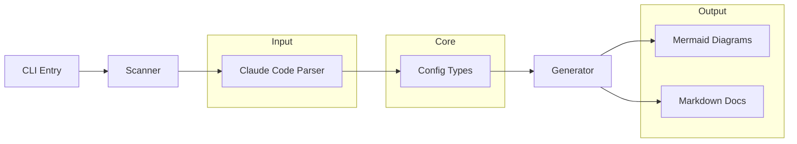
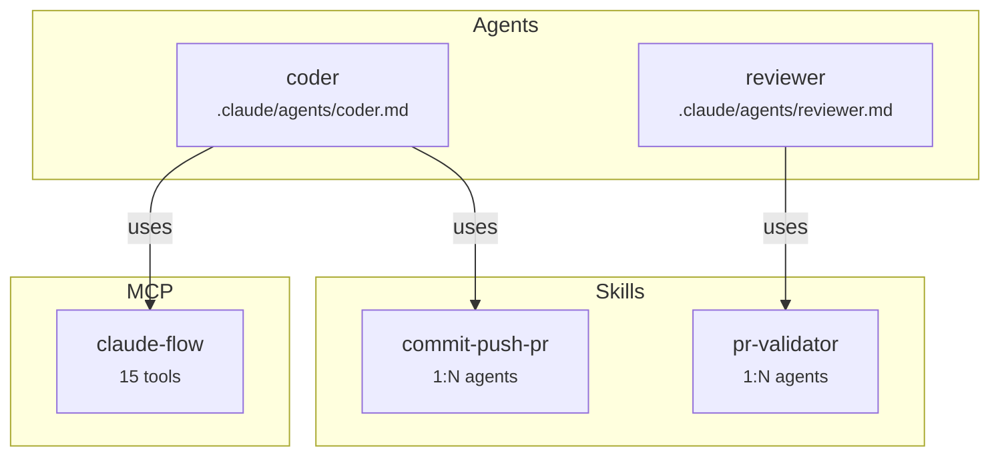

# AgentScope v1.0 - Simple Architecture

> **Status**: MVP Implementation Guide
> **Scope**: Claude Code only
> **Target**: Ship in 1-2 days

---

## 1. Module Diagram



---

## 2. File Structure

```
src/
├── index.ts              # CLI entry (commander.js)
├── scanner/
│   └── claude-code.ts    # Parse .claude/ directory
├── types.ts              # TypeScript interfaces
├── generator/
│   ├── mermaid.ts        # Generate diagrams
│   └── markdown.ts       # Generate docs with links
└── utils/
    └── path.ts           # Path validation (10 lines)
```

**Total: 6 files** (not 40+ from DDD plan)

---

## 3. Core Types

```typescript
// src/types.ts - All types in ONE file (~50 lines)

export interface AgentScopeConfig {
  projectPath: string;
  agents: AgentRef[];
  skills: SkillRef[];
  hooks: HookRef[];
  commands: CommandRef[];
  mcpServers: MCPServerRef[];
}

// References link to source files instead of duplicating content
export interface AgentRef {
  name: string;
  sourcePath: string;        // e.g., ".claude/agents/coder.md"
  description?: string;      // First line only
  skills: string[];          // Names only (links)
  tools: string[];           // Names only
}

export interface SkillRef {
  name: string;
  sourcePath: string;        // e.g., ".claude/skills/commit/SKILL.md"
  description?: string;
  triggers: string[];        // Slash commands
}

export interface HookRef {
  name: string;
  sourcePath: string;
  event: string;             // pre-edit, post-task, etc.
}

export interface CommandRef {
  name: string;
  sourcePath: string;
  description?: string;
}

export interface MCPServerRef {
  name: string;
  command: string;
  tools: string[];           // Tool names only
}

// Cardinality for relationships
export interface Relationship {
  from: string;
  to: string;
  type: 'uses' | 'triggers' | 'provides';
  cardinality: '1:1' | '1:N' | 'N:N';
}
```

---

## 4. Output Format

### 4.1 Component Map (Mermaid)

Shows dependencies and cardinality - **links to source files, doesn't duplicate**:



### 4.2 Markdown Output

**AGENTS.md** - Links to sources, shows relationships:

```markdown
# Agent Inventory

## Agents (98 total)

| Name | Source | Skills | Tools |
|------|--------|--------|-------|
| [coder](.claude/agents/coder.md) | core | 5 | 12 |
| [reviewer](.claude/agents/reviewer.md) | core | 3 | 8 |

## Skills (31 total)

| Name | Source | Used By |
|------|--------|---------|
| [commit-push-pr](.claude/skills/commit-push-pr/SKILL.md) | 15 agents |
| [pr-validator](.claude/skills/pr-validator/SKILL.md) | 8 agents |

## Relationships

| From | To | Type | Cardinality |
|------|-----|------|-------------|
| coder | commit-push-pr | uses | 1:N |
| reviewer | pr-validator | uses | 1:N |
```

**Key principle**: Data lives in source files. Output shows **structure and relationships** with links back.

---

## 5. CLI Commands

```bash
# Scan and generate (smart defaults)
agentscope scan

# Output to specific directory
agentscope scan --output ./docs/agents/

# JSON output (for tooling - deferred to v1.1)
# agentscope scan --format json
```

---

## 6. Implementation Checklist

### Phase 1: Scanner (4 hours)

- [ ] Parse `.claude/agents/*.md` - extract name, description, skills
- [ ] Parse `.claude/skills/*/SKILL.md` - extract name, triggers
- [ ] Parse `.claude/hooks/*.md` - extract event type
- [ ] Parse `.claude/commands/**/*.md` - extract name, description
- [ ] Parse `.mcp.json` - extract server names and tools
- [ ] Build `AgentScopeConfig` object

### Phase 2: Generator (4 hours)

- [ ] Generate component map (Mermaid flowchart)
- [ ] Generate workflow sequence (Mermaid sequence)
- [ ] Generate AGENTS.md with tables and links
- [ ] Calculate relationships and cardinality

### Phase 3: CLI (2 hours)

- [ ] Setup commander.js with `scan` command
- [ ] Add `--output` option
- [ ] Add progress output
- [ ] Handle errors gracefully

### Phase 4: Polish (2 hours)

- [ ] Path validation (prevent traversal)
- [ ] Test with real configs
- [ ] Update README with usage

**Total: ~12 hours (1.5 days)**

---

## 7. What's NOT in v1.0

| Feature | Reason | When |
|---------|--------|------|
| Multiple frameworks | Focus on Claude Code first | v1.1+ |
| JSON export | Mermaid + Markdown sufficient | v1.1 |
| Bidirectional export | Complex, needs validation | v2.0+ |
| DDD architecture | Overkill for CLI | Never |
| Memory/learning | Not needed for scanning | v2.0+ |
| Watch mode | Ship basic first | v1.1 |
| VS Code extension | CLI validates concept | v1.2+ |

---

## 8. Key Decisions

| Decision | Choice | Rationale |
|----------|--------|-----------|
| Architecture | Simple modules | CLI doesn't need DDD |
| Framework scope | Claude Code only | Validate before expanding |
| Output format | Links, not duplication | Source files are truth |
| Diagrams | 2 types (component, workflow) | Smart defaults per PRD |
| Type system | TypeScript interfaces | No value objects needed |
| Testing | Integration tests | Small codebase, high coverage |

---

## 9. References

- [PRD v2](../AgentScope-PRD-v2.md) - Product requirements
- [Critical Analysis](../research/01-critical-analysis.md) - Risk assessment
- [Plan Review](./PLAN-CRITICAL-REVIEW.md) - Simplification rationale
- [V2 Roadmap](./v2-roadmap/) - Deferred architecture docs

---

*Architecture simplified per critical review. Ship fast, iterate based on feedback.*
