# Agent Security Architecture

**Status**: Proposed
**Version**: 2.0 (Agent-Focused)
**Date**: 2026-01-25

---

## Overview

AgentScope's security architecture focuses exclusively on **Claude Code and coding agent configurations**, providing comprehensive threat detection and risk assessment for:

- Claude Code settings (`.claude/settings.json`)
- Agent instructions (`CLAUDE.md`)
- Hook configurations
- MCP server security
- Permission models
- Plugin validation

---

## System Architecture (C4 Level 2)

### Context Diagram

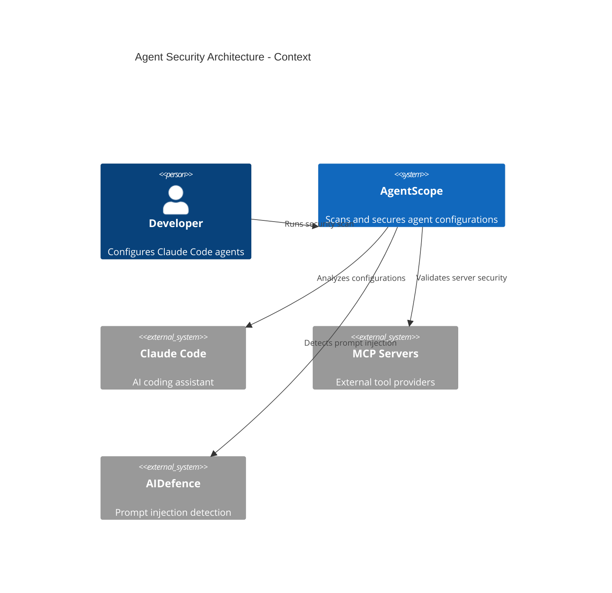

### Container Diagram

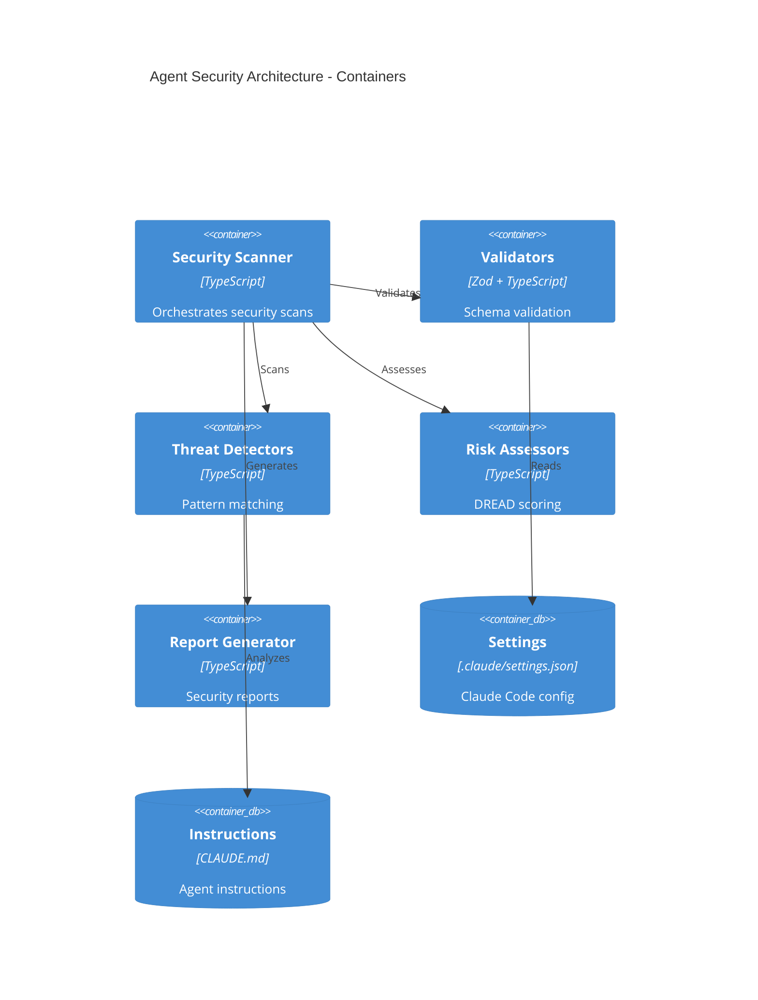

### Component Diagram

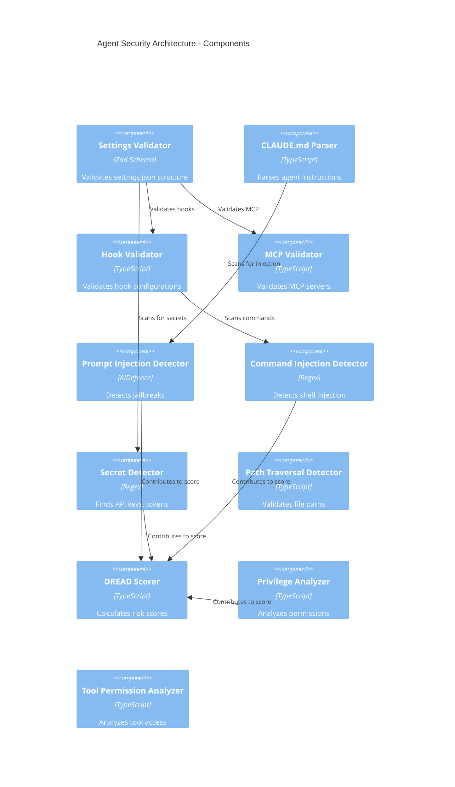

---

## Data Flow Diagram

### Security Scanning Flow

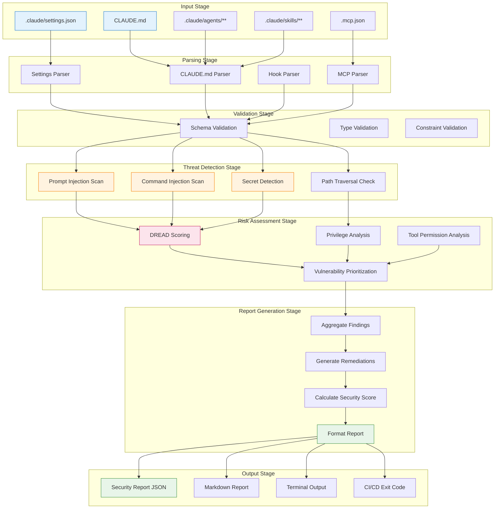

---

## Component Interactions

### Settings Validation Flow

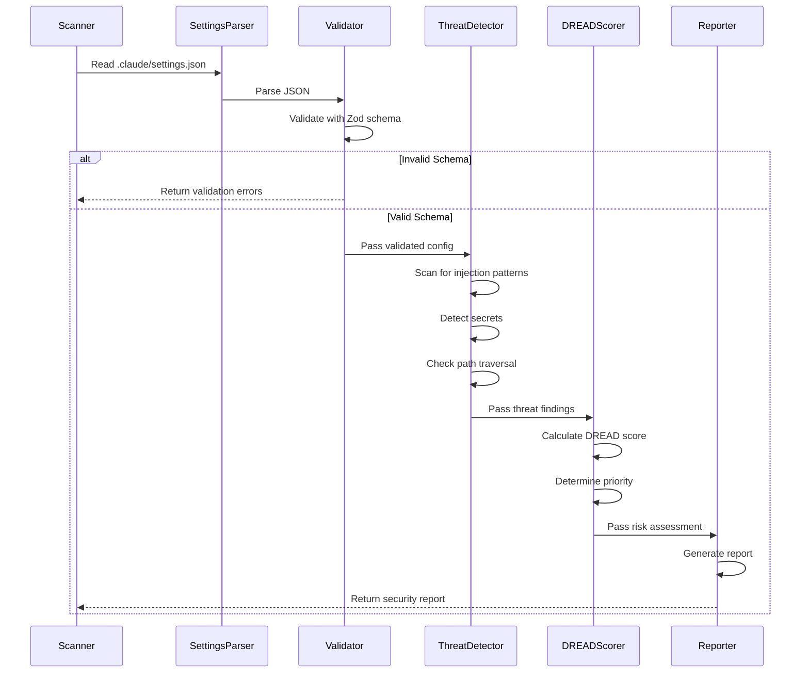

### Prompt Injection Detection Flow

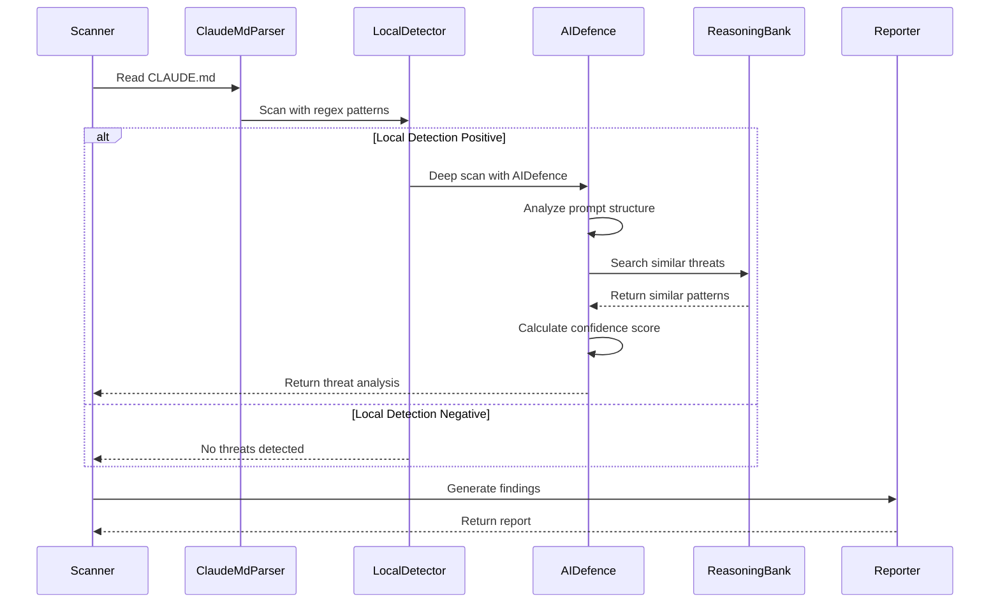

### MCP Server Security Validation Flow

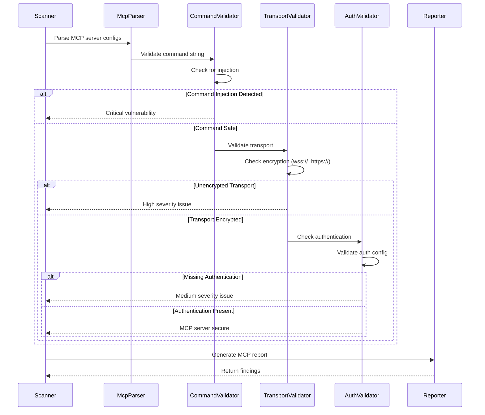

---

## Security Boundaries

### Trust Boundaries

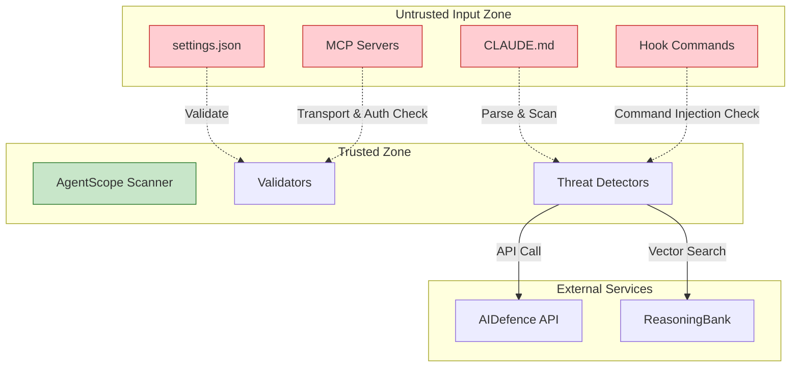

### Data Flow Security

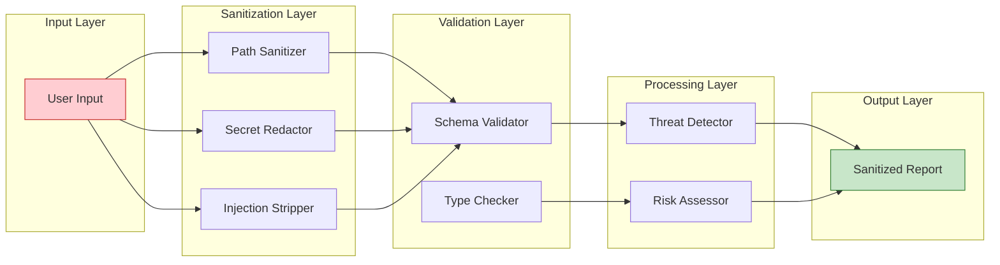

---

## Deployment Architecture

### Standalone CLI

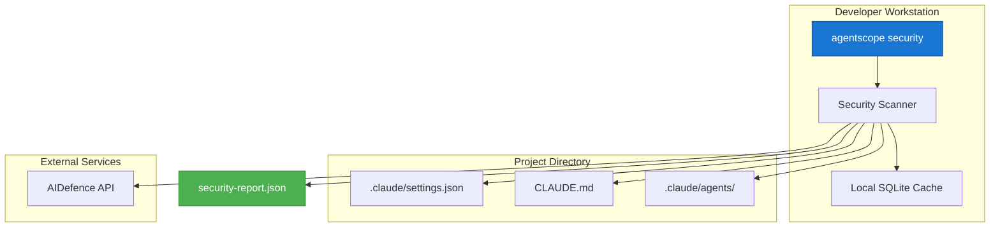

### CI/CD Integration

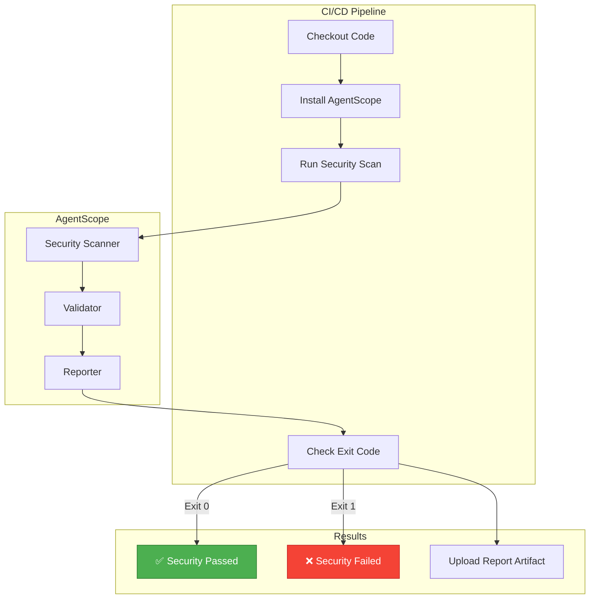

---

## Quality Attributes

### Security

| Quality | Target | Measurement |
|---------|--------|-------------|
| **Threat Detection Rate** | >95% | % of known threats detected |
| **False Positive Rate** | <5% | % of safe configs flagged |
| **DREAD Accuracy** | >90% | Alignment with manual assessment |
| **Scan Time** | <5s | Time to scan typical project |

### Reliability

| Quality | Target | Measurement |
|---------|--------|-------------|
| **Uptime** | 99.9% | % time scanner available |
| **Error Rate** | <0.1% | % scans that crash |
| **Recovery Time** | <1s | Time to recover from error |

### Performance

| Quality | Target | Measurement |
|---------|--------|-------------|
| **Throughput** | 100 scans/min | Scans processed per minute |
| **Latency** | <500ms p95 | 95th percentile scan time |
| **Memory** | <100MB | Peak memory usage |

---

## Technology Stack

### Core Technologies

| Layer | Technology | Purpose |
|-------|------------|---------|
| **Validation** | Zod | Type-safe schema validation |
| **Parsing** | TypeScript | Configuration parsing |
| **Threat Detection** | Regex + AIDefence | Pattern matching & ML detection |
| **Risk Scoring** | DREAD Algorithm | Quantitative risk assessment |
| **Reporting** | TypeScript | Report generation |

### External Integrations

| Service | Purpose | API |
|---------|---------|-----|
| **AIDefence** | Prompt injection detection | REST API |
| **ReasoningBank** | Pattern similarity search | Vector DB |
| **@claude-flow/security** | Input validation | npm package |

---

## Security Controls

### Preventive Controls

| Control | Type | Description |
|---------|------|-------------|
| **Schema Validation** | Input | Zod schemas reject malformed configs |
| **Path Sanitization** | Input | Prevent directory traversal |
| **Secret Redaction** | Output | Remove secrets from reports |
| **Command Whitelisting** | Execution | Only allow safe hook commands |

### Detective Controls

| Control | Type | Description |
|---------|------|-------------|
| **Prompt Injection Scan** | Detection | AIDefence-powered scanning |
| **Command Injection Scan** | Detection | Regex pattern matching |
| **Secret Detection** | Detection | API key/token patterns |
| **DREAD Scoring** | Risk | Quantitative risk assessment |

### Corrective Controls

| Control | Type | Description |
|---------|------|-------------|
| **Remediation Suggestions** | Guidance | Automated fix recommendations |
| **CI/CD Blocking** | Enforcement | Fail builds on critical issues |
| **Report Generation** | Audit | Detailed vulnerability reports |

---

## Threat Model

### Threat Actors

| Actor | Motivation | Capability |
|-------|------------|------------|
| **Malicious Plugin Author** | Data exfiltration | Craft malicious hook commands |
| **Insider Threat** | Privilege escalation | Modify settings.json |
| **Supply Chain Attack** | Code injection | Compromise MCP server |
| **Accidental Misconfiguration** | None | Overly permissive settings |

### Attack Vectors

| Vector | Entry Point | Impact |
|--------|-------------|--------|
| **Prompt Injection** | CLAUDE.md, skill prompts | Agent behavior manipulation |
| **Command Injection** | Hook commands, MCP servers | Arbitrary code execution |
| **Secret Exposure** | settings.json, env vars | Credential theft |
| **Path Traversal** | File permissions, mounts | Unauthorized file access |

### Mitigations

| Threat | Mitigation | Effectiveness |
|--------|------------|---------------|
| **Prompt Injection** | AIDefence scanning + pattern matching | High |
| **Command Injection** | Command validation + sandboxing | High |
| **Secret Exposure** | Secret detection + redaction | Medium |
| **Path Traversal** | Path sanitization + allowlists | High |

---

## References

- [ADR-012: Agent Security Architecture](../adr/ADR-012-agent-security-architecture.md)
- [ADR-009: Security Model](./decisions/ADR-009-security-model.md)
- [@claude-flow/security](https://github.com/ruvnet/claude-flow/tree/main/packages/security)
- [OWASP AI Security Guide](https://owasp.org/www-project-ai-security-and-privacy-guide/)
- [DREAD Risk Assessment](https://en.wikipedia.org/wiki/DREAD_(risk_assessment_model))

---

**Last Updated**: 2026-01-25
**Version**: 2.0 (Agent-Focused)
**Status**: Proposed
