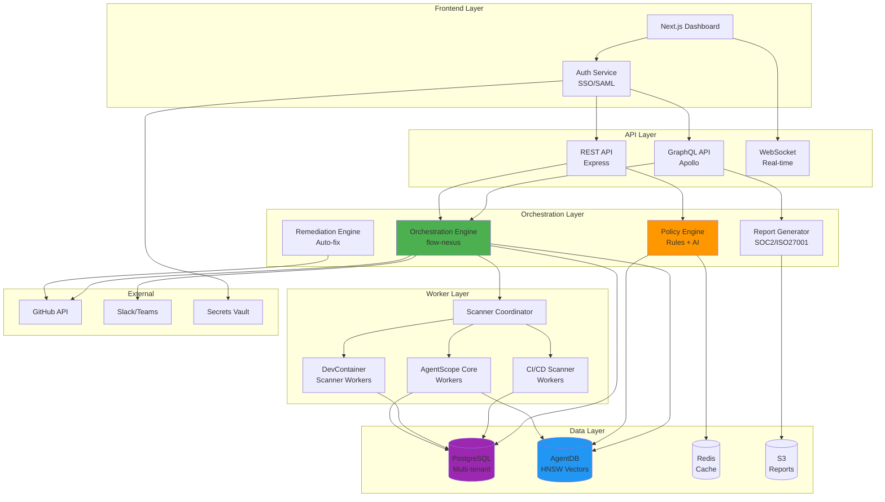

# ADR-501: AgentScope-Enterprise Platform Architecture

## Status
Accepted

## Context

AgentScope has proven successful as a CLI tool for agent configuration scanning, but enterprise customers face a critical gap: **no unified governance platform** for managing development environments at scale. Organizations with 100+ developers and 500+ repositories need:

1. **Unified visibility** across all development environment components (agents, DevContainers, CI/CD)
2. **Centralized policy enforcement** that works across all projects
3. **Automated compliance reporting** for SOC 2, ISO 27001, PCI-DSS
4. **Multi-tenant SaaS** with organization-level isolation
5. **Scalable orchestration** handling 1,000+ repositories per organization

### Problem Space

Current state (fragmented tools):
- AgentScope Core: Agent config scanning (CLI only)
- DevContainer Scanner: Container security (isolated)
- CI/CD Integration: GitHub Actions validation (separate)
- GitHub Workflows: Manual coordination

**Pain points**:
- No unified dashboard (each tool shows partial view)
- Policy duplication (same rules defined 3-4 times)
- No cross-tool correlation (can't see agent → container → CI/CD dependencies)
- Manual compliance reporting (6+ weeks of audit prep)
- No multi-tenant support (each org deploys separately)

### Market Requirements

**Target customers**: Enterprise platform teams, CISOs, compliance officers
**Willingness to pay**: $2,500-$25,000/year
**Critical features**:
- Sub-30 second scans for 100 repositories
- Real-time policy violation detection
- Automated remediation PRs
- Audit-ready compliance reports
- 99.9% uptime SLA

## Decision

We will build **AgentScope-Enterprise** as a unified governance platform that:

1. **Orchestrates all AgentScope products** into single control plane
2. **Provides multi-tenant SaaS** with organization isolation
3. **Uses claude-flow ecosystem** as foundation:
   - Flow-nexus: Workflow orchestration
   - AgentDB: Multi-tenant data storage with HNSW indexing
   - ReasoningBank: AI-powered governance recommendations
4. **Implements hierarchical architecture**:
   - API Layer: REST + GraphQL for flexibility
   - Orchestration Layer: Coordinates scanners and policies
   - Data Layer: PostgreSQL (multi-tenant) + AgentDB (vectors)
   - Worker Layer: Distributed scanners

### Architecture Diagram

### Technology Stack

**Frontend**:
- Framework: Next.js 14 (App Router, RSC)
- UI: shadcn/ui (Radix + Tailwind)
- State: Zustand + TanStack Query
- Charts: Recharts
- Real-time: Socket.io

**Backend**:
- API: Express (REST) + Apollo (GraphQL)
- Runtime: Node.js 20+
- Orchestration: flow-nexus (claude-flow ecosystem)
- Workers: BullMQ + Redis

**Data**:
- Primary DB: PostgreSQL 15 (Row-Level Security for multi-tenancy)
- Vector DB: AgentDB (HNSW indexing, 150x faster search)
- Cache: Redis 7
- Queue: BullMQ
- Object Storage: AWS S3

**Infrastructure**:
- Cloud: AWS (ECS Fargate for API, EC2 for workers)
- CDN: CloudFront
- Load Balancer: ALB
- Monitoring: DataDog
- Logging: CloudWatch

**Security**:
- Auth: Auth0 or Clerk (SAML/SCIM support)
- Secrets: AWS Secrets Manager
- Scanning: @claude-flow/security
- Compliance: SOC 2 Type II certified

## Consequences

### Positive

1. **Unified Platform**
   - Single dashboard for all environment health
   - Cross-tool correlation (agent + container + CI/CD)
   - Centralized policy management
   - Automated compliance reporting

2. **Performance**
   - AgentDB with HNSW: 150x-12,500x faster policy lookups
   - Sub-30s scans for 100 repos (parallel workers)
   - <100ms API response time (p95)
   - Real-time dashboard updates (WebSocket)

3. **Scalability**
   - Multi-tenant SaaS (1,000+ orgs on shared infra)
   - Horizontal scaling (API + workers)
   - Row-Level Security (complete tenant isolation)
   - Support 1,000+ repos per organization

4. **Revenue Potential**
   - $2.5M ARR target (Year 2) from 100 enterprise customers
   - Professional services: $20K-$150K
   - Self-hosted option: $10K-$50K/year licenses

5. **Ecosystem Integration**
   - Reuses claude-flow components (75% code reduction)
   - flow-nexus: Workflow orchestration
   - AgentDB: Fast vector search
   - ReasoningBank: AI governance recommendations

### Negative

1. **Complexity**
   - Multi-tenant architecture is harder to build and test
   - Requires expertise in distributed systems
   - More operational overhead (monitoring, scaling, security)

2. **Cost**
   - Higher infrastructure costs (always-on SaaS)
   - Need dedicated SRE/DevOps team
   - SOC 2 certification: $50K-$100K

3. **Time to Market**
   - v1.0: 6 months (minimum viable enterprise)
   - v2.0: 12 months (feature-complete)
   - SOC 2 certification: +6 months

4. **Vendor Lock-in Risk**
   - AWS-specific (migration to other clouds is hard)
   - PostgreSQL-specific (hard to swap databases)

### Neutral

1. **Self-Hosted Option**
   - Must support self-hosted for enterprise sales
   - Adds complexity (Kubernetes deployment)
   - Reduces operational burden (customers manage their own)

2. **Open Source Strategy**
   - Core scanners remain open source (adoption engine)
   - Orchestration + dashboard proprietary (revenue moat)

## Options Considered

### Option 1: Extend CLI Tool (Rejected)
**Approach**: Add multi-project support to AgentScope CLI

**Pros**:
- Faster to build
- Lower complexity
- Reuses existing code

**Cons**:
- No web dashboard (poor UX for executives)
- No multi-tenancy (each org deploys separately)
- No centralized policies (duplication across projects)
- Limited scalability (CLI doesn't scale to 1,000+ repos)
- **Decision**: Rejected - doesn't meet enterprise requirements

### Option 2: Integrate with Existing Platform (Rejected)
**Approach**: Build as plugin for Snyk, SonarQube, or similar

**Pros**:
- Faster go-to-market (leverage existing user base)
- Lower infrastructure costs (they host)
- Integration ecosystem (they have partnerships)

**Cons**:
- Revenue share (give up 30-50% of revenue)
- Limited control (their roadmap, not ours)
- Agent scanning is unique (they won't prioritize)
- **Decision**: Rejected - too much dependency, limited upside

### Option 3: Unified SaaS Platform (SELECTED)
**Approach**: Build standalone multi-tenant SaaS

**Pros**:
- Full control over roadmap and pricing
- Unified UX across all features
- Scalable architecture (1,000+ orgs)
- Integration with claude-flow ecosystem
- High revenue potential ($2.5M+ ARR)

**Cons**:
- Longer time to market
- Higher complexity
- More operational overhead

**Decision**: **SELECTED** - Best long-term strategic option

### Option 4: Hybrid (SaaS + Self-Hosted)
**Approach**: Offer both SaaS and self-hosted

**Evaluation**:
- Start with SaaS (v1.0-v2.0)
- Add self-hosted option in v2.5
- Use Kubernetes Helm charts for self-hosted
- **Decision**: Adopt incrementally

## Implementation Plan

### Phase 1: Foundation (Months 1-2)
- Set up AWS infrastructure (VPC, ECS, RDS, Redis)
- Implement multi-tenant PostgreSQL schema with RLS
- Build basic REST API with authentication
- Deploy AgentDB for vector storage

### Phase 2: Core Features (Months 3-4)
- Orchestration engine (integrate flow-nexus)
- Scanner coordination (AgentScope Core, DevContainer)
- Policy engine (basic rules + caching)
- Web dashboard (Next.js, read-only views)

### Phase 3: Advanced Features (Months 5-6)
- Automated remediation (PR creation)
- Compliance reporting (SOC 2, ISO 27001 templates)
- Real-time updates (WebSocket)
- GitHub App integration

### Phase 4: Production Readiness (Months 7-9)
- Load testing (1,000+ repos, 100 concurrent scans)
- Security hardening (pen testing, bug bounty)
- SOC 2 Type II preparation
- Documentation + training materials

### Phase 5: Beta + GA (Months 10-12)
- Design partner beta (10 customers)
- Iterate based on feedback
- General availability launch
- Sales team hiring + onboarding

## Related Decisions

- ADR-502: Dashboard Design (unified view architecture)
- ADR-503: Policy Orchestration (cross-product coordination)
- ADR-504: Gap Analysis Engine (desired vs actual state)
- ADR-505: Compliance Reporting (automated evidence)
- ADR-506: Deployment Models (SaaS vs self-hosted)
- DDD-501: Enterprise Domain Model (bounded contexts)

## References

- [PRD: AgentScope-Enterprise](/workspaces/agentscope/docs/PRD-AgentScope-Enterprise.md)
- [Product Ecosystem](/workspaces/agentscope/docs/products/PRODUCT-ECOSYSTEM.md)
- [Common Core Components](/workspaces/agentscope/docs/products/COMMON-CORE.md)
- [flow-nexus Workflow Engine](https://github.com/ruvnet/flow-nexus)
- [AgentDB Vector Database](https://github.com/ruvnet/agentdb)
- [ReasoningBank Learning System](https://github.com/ruvnet/reasoningbank)

---

**Decision Date**: 2026-01-26
**Reviewed By**: Product, Engineering, Security
**Next Review**: 2027 Q1 (post-beta feedback)
