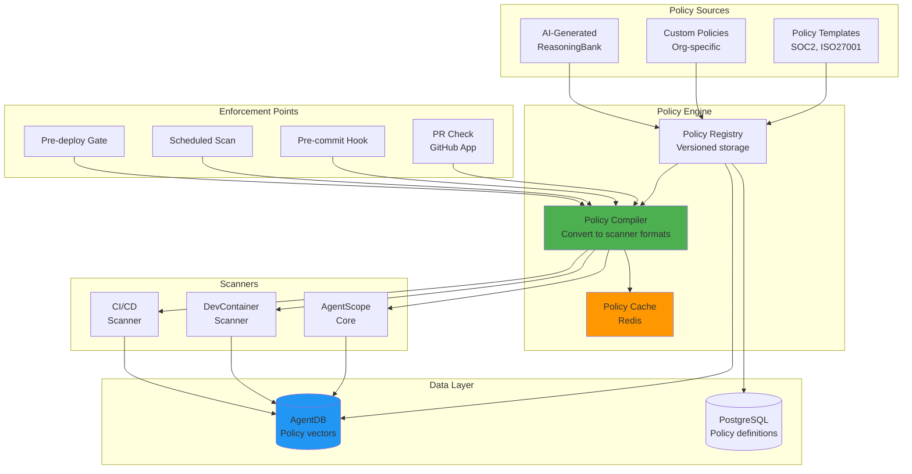

# ADR-503: Cross-Product Policy Orchestration

## Status
Accepted

## Context

AgentScope-Enterprise must enforce policies across **multiple product scanners** (AgentScope Core, DevContainer Scanner, CI/CD Integration) with:

1. **Policy Consistency**: Same policy definition works across all scanners
2. **Cross-Tool Correlation**: Detect violations that span multiple tools (e.g., agent with Bash + privileged container)
3. **Performance**: Evaluate 10,000+ policies/second across 1,000 repos
4. **Flexibility**: Support custom policies, built-in templates, and AI-generated policies
5. **Real-Time Enforcement**: Block PRs, commits, deployments on violation

### Current Fragmentation

**Problem**: Each scanner has its own policy format

```yaml
# AgentScope Core policy
agentscope:
  rules:
    - no-hardcoded-secrets
    - mcp-allowlist

# DevContainer Scanner policy
devcontainer:
  security:
    - no-privileged
    - no-host-mounts

# CI/CD Scanner policy
cicd:
  github-actions:
    - no-secrets-in-env
    - require-codeql
```

**Result**: 3× duplication, no cross-tool policies, hard to maintain

## Decision

We will implement a **unified policy orchestration engine** with:

### 1. Universal Policy Schema

```typescript
// Unified policy definition works across all scanners
interface UnifiedPolicy {
  id: string;
  name: string;
  description: string;
  category: 'security' | 'compliance' | 'best-practices';
  severity: 'critical' | 'high' | 'medium' | 'low';

  // Multi-tool conditions
  conditions: {
    agent?: AgentCondition;
    devcontainer?: DevContainerCondition;
    cicd?: CICDCondition;

    // Cross-tool correlation
    correlations?: Correlation[];
  };

  // Enforcement
  enforcement: {
    mode: 'block' | 'warn' | 'audit';
    enforcementPoints: EnforcementPoint[];
    autoRemediate: boolean;
    remediationSteps?: string[];
  };

  // Compliance mapping
  compliance: {
    frameworks: ('SOC2' | 'ISO27001' | 'PCI-DSS' | 'HIPAA')[];
    controls: string[]; // e.g., ['CC6.1', 'A.9.4.1']
  };

  // AI enhancement
  ai?: {
    useReasoningBank: boolean; // Query ReasoningBank for similar violations
    autoSuggestFixes: boolean; // Use AI to suggest remediation
  };

  // Metadata
  tags: string[];
  version: string;
  createdAt: Date;
  updatedAt: Date;
  createdBy: string;
}
```

### 2. Policy Orchestration Architecture



### 3. Cross-Tool Correlation Engine

```typescript
// Detect violations that span multiple tools
interface Correlation {
  type: 'AND' | 'OR' | 'IMPLIES';
  conditions: {
    agent?: AgentCondition;
    devcontainer?: DevContainerCondition;
    cicd?: CICDCondition;
  };
  severity: 'critical' | 'high' | 'medium' | 'low';
  description: string;
}

// Example: Agent with Bash + privileged container = critical risk
const dangerousComboPolicy: UnifiedPolicy = {
  id: 'pol-corr-001',
  name: 'Dangerous Agent + Container Combination',
  description: 'Agent with Bash permission in privileged container poses container escape risk',
  category: 'security',
  severity: 'critical',

  conditions: {
    correlations: [
      {
        type: 'AND',
        conditions: {
          agent: {
            hasPermission: 'Bash',
            patterns: ['rm -rf', 'sudo', 'exec']
          },
          devcontainer: {
            privileged: true
          }
        },
        severity: 'critical',
        description: 'Agent can execute arbitrary commands in privileged container'
      }
    ]
  },

  enforcement: {
    mode: 'block',
    enforcementPoints: ['pr-check', 'pre-deploy'],
    autoRemediate: true,
    remediationSteps: [
      'Remove Bash permission from agent config',
      'OR disable privileged mode in DevContainer',
      'OR add command filtering in CLAUDE.md'
    ]
  },

  compliance: {
    frameworks: ['SOC2', 'ISO27001'],
    controls: ['CC6.1', 'A.9.4.1']
  },

  ai: {
    useReasoningBank: true,
    autoSuggestFixes: true
  },

  tags: ['container-escape', 'privilege-escalation'],
  version: '1.0.0',
  createdAt: new Date(),
  updatedAt: new Date(),
  createdBy: 'security@company.com'
};
```

### 4. Policy Compilation Strategy

```typescript
// Compiler converts unified policy to scanner-specific formats
class PolicyCompiler {
  // Compile to AgentScope Core format
  compileForAgentScope(policy: UnifiedPolicy): AgentScopePolicy {
    if (!policy.conditions.agent) return null;

    return {
      id: policy.id,
      severity: policy.severity,
      checks: {
        secretPatterns: policy.conditions.agent.scanFor === 'secrets'
          ? policy.conditions.agent.patterns
          : [],
        permissionChecks: policy.conditions.agent.hasPermission
          ? [policy.conditions.agent.hasPermission]
          : [],
        forbiddenPatterns: policy.conditions.agent.forbiddenPatterns || []
      }
    };
  }

  // Compile to DevContainer Scanner format
  compileForDevContainer(policy: UnifiedPolicy): DevContainerPolicy {
    if (!policy.conditions.devcontainer) return null;

    return {
      id: policy.id,
      severity: policy.severity,
      checks: {
        privileged: policy.conditions.devcontainer.privileged === false,
        capabilities: policy.conditions.devcontainer.capabilities || [],
        mounts: policy.conditions.devcontainer.mounts || []
      }
    };
  }

  // Compile to CI/CD Scanner format
  compileForCICD(policy: UnifiedPolicy): CICDPolicy {
    if (!policy.conditions.cicd) return null;

    return {
      id: policy.id,
      severity: policy.severity,
      checks: {
        requireCodeQL: policy.conditions.cicd.requireCodeQL || false,
        secretsInEnv: policy.conditions.cicd.noSecretsInEnv || false,
        allowedActions: policy.conditions.cicd.allowedActions || []
      }
    };
  }

  // Handle cross-tool correlations
  async evaluateCorrelations(
    policy: UnifiedPolicy,
    projectData: ProjectData
  ): Promise<CorrelationResult[]> {
    const results: CorrelationResult[] = [];

    for (const correlation of policy.conditions.correlations || []) {
      const agentMatch = correlation.conditions.agent
        ? this.checkAgentCondition(correlation.conditions.agent, projectData.agentConfig)
        : true;

      const devcontainerMatch = correlation.conditions.devcontainer
        ? this.checkDevContainerCondition(correlation.conditions.devcontainer, projectData.devcontainer)
        : true;

      const cicdMatch = correlation.conditions.cicd
        ? this.checkCICDCondition(correlation.conditions.cicd, projectData.cicd)
        : true;

      const matches = correlation.type === 'AND'
        ? agentMatch && devcontainerMatch && cicdMatch
        : agentMatch || devcontainerMatch || cicdMatch;

      if (matches) {
        results.push({
          policyId: policy.id,
          correlation,
          severity: correlation.severity,
          description: correlation.description,
          evidence: {
            agent: agentMatch ? projectData.agentConfig : null,
            devcontainer: devcontainerMatch ? projectData.devcontainer : null,
            cicd: cicdMatch ? projectData.cicd : null
          }
        });
      }
    }

    return results;
  }
}
```

### 5. Performance Optimization with AgentDB

```typescript
// Use HNSW indexing for fast policy lookup
class PolicyEngine {
  constructor(
    private agentDB: VectorDatabase,
    private compiler: PolicyCompiler
  ) {}

  // Index policies by semantic similarity
  async indexPolicy(policy: UnifiedPolicy): Promise<void> {
    const embedding = await this.generatePolicyEmbedding(policy);

    await this.agentDB.insert(policy.id, embedding, {
      policy,
      category: policy.category,
      severity: policy.severity,
      tags: policy.tags
    });
  }

  // Find similar policies (for AI recommendations)
  async findSimilarPolicies(
    description: string,
    k = 5
  ): Promise<UnifiedPolicy[]> {
    const queryEmbedding = await this.generateQueryEmbedding(description);
    const results = await this.agentDB.search(queryEmbedding, k);

    return results.map(r => r.metadata.policy as UnifiedPolicy);
  }

  // Evaluate all policies for a project (fast with HNSW)
  async evaluateProject(
    project: Project,
    policies: UnifiedPolicy[]
  ): Promise<PolicyViolation[]> {
    const violations: PolicyViolation[] = [];

    // Compile policies once, cache in Redis
    const cacheKey = `policies:compiled:${project.id}`;
    let compiled = await this.cache.get(cacheKey);

    if (!compiled) {
      compiled = {
        agentScope: policies.map(p => this.compiler.compileForAgentScope(p)).filter(Boolean),
        devContainer: policies.map(p => this.compiler.compileForDevContainer(p)).filter(Boolean),
        cicd: policies.map(p => this.compiler.compileForCICD(p)).filter(Boolean)
      };
      await this.cache.set(cacheKey, compiled, { ttl: 300 }); // 5 min cache
    }

    // Run scanners in parallel
    const [agentViolations, devContainerViolations, cicdViolations] = await Promise.all([
      this.scanAgentConfig(project, compiled.agentScope),
      this.scanDevContainer(project, compiled.devContainer),
      this.scanCICD(project, compiled.cicd)
    ]);

    violations.push(...agentViolations, ...devContainerViolations, ...cicdViolations);

    // Check cross-tool correlations
    const correlationViolations = await this.evaluateCorrelations(policies, project);
    violations.push(...correlationViolations);

    return violations;
  }

  private async generatePolicyEmbedding(policy: UnifiedPolicy): Promise<Float32Array> {
    // Use claude-flow embeddings package
    const text = `${policy.name} ${policy.description} ${policy.tags.join(' ')}`;
    // Embedding generation logic
    return new Float32Array(384); // Placeholder
  }
}
```

### 6. AI-Enhanced Policy Management

```typescript
// Use ReasoningBank to suggest policies based on past violations
class AIPolicyAssistant {
  constructor(
    private reasoningBank: ReasoningBank,
    private policyEngine: PolicyEngine
  ) {}

  // Suggest policies based on violation history
  async suggestPolicies(orgId: string): Promise<UnifiedPolicy[]> {
    // Retrieve past violations from ReasoningBank
    const violations = await this.reasoningBank.searchPatterns(
      'policy violations',
      { onlyFailures: true, k: 100 }
    );

    // Cluster violations to find common patterns
    const clusters = this.clusterViolations(violations);

    // Generate policy suggestions
    const suggestions: UnifiedPolicy[] = [];
    for (const cluster of clusters) {
      const policy = await this.generatePolicyFromCluster(cluster);
      suggestions.push(policy);
    }

    return suggestions;
  }

  // Auto-suggest remediation using AI
  async suggestRemediation(
    violation: PolicyViolation
  ): Promise<string[]> {
    // Query ReasoningBank for similar violations
    const similar = await this.reasoningBank.retrieve(
      `Policy violation: ${violation.policy.name}`,
      5
    );

    // Extract successful remediations
    const remediations = similar
      .filter(p => p.success)
      .flatMap(p => p.critique.split('\n'))
      .filter(line => line.includes('fix') || line.includes('remediation'));

    return [...new Set(remediations)]; // Deduplicate
  }

  private clusterViolations(violations: Pattern[]): ViolationCluster[] {
    // K-means clustering on violation embeddings
    // Return clusters of similar violations
    return [];
  }

  private async generatePolicyFromCluster(
    cluster: ViolationCluster
  ): Promise<UnifiedPolicy> {
    // Use LLM to generate policy definition from examples
    return {} as UnifiedPolicy;
  }
}
```

### 7. Enforcement Point Integration

```typescript
// GitHub App PR check
app.on('pull_request.opened', async (context) => {
  const { owner, repo, pull_number } = context.pullRequest();

  // Fetch project data
  const project = await fetchProjectData(owner, repo);

  // Evaluate policies
  const violations = await policyEngine.evaluateProject(
    project,
    await fetchOrgPolicies(project.orgId)
  );

  // Filter by enforcement mode
  const blockingViolations = violations.filter(
    v => v.policy.enforcement.mode === 'block'
  );

  if (blockingViolations.length > 0) {
    // Add PR comment with violations
    await context.octokit.issues.createComment({
      owner,
      repo,
      issue_number: pull_number,
      body: formatViolationsComment(blockingViolations)
    });

    // Set status check to failure
    await context.octokit.checks.create({
      owner,
      repo,
      name: 'AgentScope Enterprise - Policy Check',
      head_sha: context.payload.pull_request.head.sha,
      status: 'completed',
      conclusion: 'failure',
      output: {
        title: `${blockingViolations.length} policy violation(s)`,
        summary: formatViolationsSummary(blockingViolations)
      }
    });
  } else {
    // All checks passed
    await context.octokit.checks.create({
      owner,
      repo,
      name: 'AgentScope Enterprise - Policy Check',
      head_sha: context.payload.pull_request.head.sha,
      status: 'completed',
      conclusion: 'success'
    });
  }
});
```

## Consequences

### Positive

1. **Unified Policy Model**
   - Write once, enforce everywhere
   - Reduced duplication (3× → 1×)
   - Easier to maintain (single source of truth)

2. **Cross-Tool Correlation**
   - Detect complex violations (agent + container + CI/CD)
   - Better risk assessment
   - Compliance evidence (show holistic coverage)

3. **Performance**
   - AgentDB HNSW indexing: 150x-12,500x faster policy lookup
   - Redis caching: <10ms policy evaluation
   - Parallel scanner execution

4. **AI Enhancement**
   - Auto-suggest policies from violation patterns
   - ReasoningBank-powered remediation
   - Continuous improvement (learn from successes)

5. **Flexibility**
   - Support templates, custom, AI-generated policies
   - Multiple enforcement modes (block, warn, audit)
   - Per-policy configuration

### Negative

1. **Compilation Complexity**
   - Must compile to 3+ scanner formats
   - Breaking changes in scanners require compiler updates
   - Testing burden (cross-tool integration tests)

2. **Performance Overhead**
   - Cross-tool correlation adds latency
   - Caching required for acceptable performance
   - HNSW indexing has memory cost

3. **AI Dependency**
   - ReasoningBank required for AI features
   - LLM costs for policy suggestions
   - May generate incorrect policies (requires human review)

### Neutral

1. **Policy Versioning**
   - Need version control for policies
   - Rollback mechanism for bad policies
   - Audit trail for policy changes

2. **Custom Policy Language**
   - May need DSL for complex policies
   - Learning curve for policy authors
   - Balance simplicity vs expressiveness

## Related Decisions

- ADR-501: Enterprise Architecture (overall platform)
- ADR-502: Dashboard Design (policy violation display)
- ADR-504: Gap Analysis Engine (uses policies for comparison)
- ADR-505: Compliance Reporting (policy → compliance mapping)

## References

- [AgentDB HNSW Indexing](https://github.com/ruvnet/agentdb)
- [ReasoningBank Learning System](https://github.com/ruvnet/reasoningbank)
- [flow-nexus Orchestration](https://github.com/ruvnet/flow-nexus)
- [GitHub Checks API](https://docs.github.com/en/rest/checks)

---

**Decision Date**: 2026-01-26
**Reviewed By**: Security, Engineering, Product
**Next Review**: After v1.0 release (2027 Q2)
