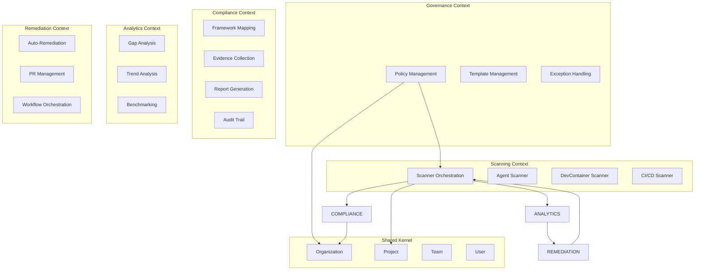
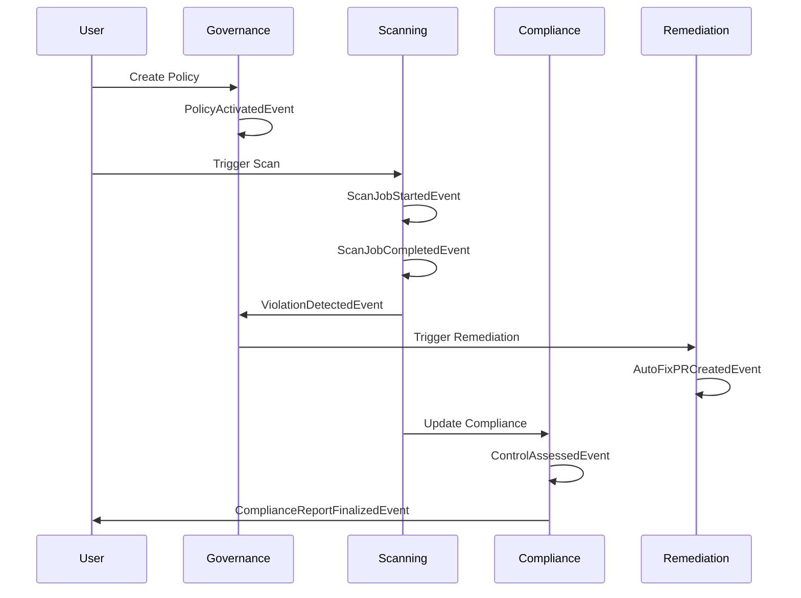

# DDD-501: AgentScope-Enterprise Domain Model

## Status
Accepted

## Context

AgentScope-Enterprise is a complex platform spanning governance, compliance, and orchestration. We need a **Domain-Driven Design** approach to:

1. **Identify bounded contexts** (independent domains)
2. **Define ubiquitous language** (shared terminology)
3. **Model aggregates** (consistency boundaries)
4. **Specify domain events** (cross-context communication)

## Bounded Contexts



## Core Domains

### 1. Governance Context

**Purpose**: Centralized policy and template management

**Aggregates**:

```typescript
// Policy Aggregate Root
class Policy {
  private id: PolicyId;
  private name: string;
  private conditions: PolicyConditions;
  private enforcement: EnforcementConfig;
  private compliance: ComplianceMapping;
  private version: number;
  private status: 'draft' | 'active' | 'deprecated';

  // Domain methods
  activate(): void {
    if (this.status === 'draft') {
      this.status = 'active';
      this.publishEvent(new PolicyActivatedEvent(this.id));
    }
  }

  deprecate(replacementPolicyId?: PolicyId): void {
    this.status = 'deprecated';
    this.publishEvent(new PolicyDeprecatedEvent(this.id, replacementPolicyId));
  }

  evaluateProject(project: Project): PolicyViolation[] {
    // Evaluate policy conditions against project
  }
}

// Template Aggregate Root
class GoldenPathTemplate {
  private id: TemplateId;
  private name: string;
  private spec: TemplateSpec;
  private compliance: ComplianceRequirements;
  private version: number;

  applyToProject(project: Project): GapAnalysisReport {
    // Compare template to project
  }

  generateRemediationPlan(gaps: Gap[]): RemediationPlan {
    // Create prioritized remediation steps
  }
}

// Exception Aggregate Root
class PolicyException {
  private id: ExceptionId;
  private policyId: PolicyId;
  private projectId: ProjectId;
  private justification: string;
  private approvedBy: UserId;
  private expiresAt: Date;
  private status: 'pending' | 'approved' | 'denied' | 'expired';

  approve(approverId: UserId): void {
    if (this.status === 'pending') {
      this.status = 'approved';
      this.approvedBy = approverId;
      this.publishEvent(new ExceptionApprovedEvent(this.id));
    }
  }

  checkExpiration(): void {
    if (this.expiresAt < new Date()) {
      this.status = 'expired';
      this.publishEvent(new ExceptionExpiredEvent(this.id));
    }
  }
}
```

**Domain Events**:
- `PolicyActivatedEvent`
- `PolicyDeprecatedEvent`
- `TemplateAppliedEvent`
- `ExceptionApprovedEvent`
- `ExceptionExpiredEvent`

### 2. Scanning Context

**Purpose**: Orchestrate distributed scanners across projects

**Aggregates**:

```typescript
// ScanJob Aggregate Root
class ScanJob {
  private id: ScanJobId;
  private projectId: ProjectId;
  private scanners: ScannerType[];
  private status: 'pending' | 'running' | 'completed' | 'failed';
  private results: ScanResult[];
  private startedAt: Date;
  private completedAt?: Date;

  start(): void {
    this.status = 'running';
    this.startedAt = new Date();
    this.publishEvent(new ScanJobStartedEvent(this.id, this.projectId));
  }

  addResult(scanner: ScannerType, result: ScanResult): void {
    this.results.push({ scanner, result });

    // Check if all scanners completed
    if (this.results.length === this.scanners.length) {
      this.complete();
    }
  }

  private complete(): void {
    this.status = 'completed';
    this.completedAt = new Date();
    this.publishEvent(new ScanJobCompletedEvent(this.id, this.results));
  }

  fail(error: Error): void {
    this.status = 'failed';
    this.publishEvent(new ScanJobFailedEvent(this.id, error));
  }
}

// ScanResult Value Object
interface ScanResult {
  scanner: ScannerType;
  violations: PolicyViolation[];
  metadata: {
    duration: number;
    filesScanned: number;
    timestamp: Date;
  };
}
```

**Domain Events**:
- `ScanJobStartedEvent`
- `ScanJobCompletedEvent`
- `ScanJobFailedEvent`
- `ViolationDetectedEvent`

### 3. Compliance Context

**Purpose**: Map scans to compliance frameworks and generate reports

**Aggregates**:

```typescript
// ComplianceReport Aggregate Root
class ComplianceReport {
  private id: ReportId;
  private orgId: OrganizationId;
  private framework: 'SOC2' | 'ISO27001' | 'PCI-DSS';
  private period: DateRange;
  private controls: ControlStatus[];
  private evidence: Evidence[];
  private status: 'draft' | 'final' | 'submitted';

  assessControl(controlId: string, policies: Policy[], scanResults: ScanResult[]): void {
    // Evaluate control compliance
    const controlStatus = this.evaluateControl(controlId, policies, scanResults);
    this.controls.push(controlStatus);
  }

  collectEvidence(control: ControlStatus, scanResults: ScanResult[]): void {
    const evidence = this.extractEvidence(control, scanResults);
    this.evidence.push(evidence);
  }

  finalize(): void {
    if (this.status === 'draft') {
      this.status = 'final';
      this.publishEvent(new ComplianceReportFinalizedEvent(this.id));
    }
  }

  export(format: 'pdf' | 'json' | 'csv'): Buffer {
    // Export report in requested format
  }
}

// ControlStatus Value Object
interface ControlStatus {
  controlId: string;
  name: string;
  status: 'pass' | 'fail' | 'partial';
  coverage: number; // 0-100
  evidenceIds: string[];
  exceptions: Exception[];
}
```

**Domain Events**:
- `ComplianceReportFinalizedEvent`
- `ControlAssessedEvent`
- `EvidenceCollectedEvent`

### 4. Analytics Context

**Purpose**: Analyze trends, gaps, and benchmarks

**Aggregates**:

```typescript
// GapAnalysisReport Aggregate Root
class GapAnalysisReport {
  private id: ReportId;
  private projectId: ProjectId;
  private templateId: TemplateId;
  private gaps: Gap[];
  private complianceScore: number;
  private estimatedRemediationTime: number;

  prioritizeGaps(): Gap[] {
    // Sort by risk/effort ratio
    return this.gaps.sort((a, b) =>
      (b.riskScore / b.effortHours) - (a.riskScore / a.effortHours)
    );
  }

  generateRemediationPlan(): RemediationPlan {
    const prioritized = this.prioritizeGaps();
    return new RemediationPlan(this.projectId, prioritized);
  }
}

// TrendAnalysis Aggregate Root
class TrendAnalysis {
  private projectId: ProjectId;
  private metrics: TimeSeriesMetric[];

  addDataPoint(metric: string, value: number, timestamp: Date): void {
    this.metrics.push({ metric, value, timestamp });
  }

  detectRegression(): boolean {
    // Detect if metrics are degrading
    const recentAvg = this.calculateRecentAverage();
    const historicalAvg = this.calculateHistoricalAverage();
    return recentAvg < historicalAvg * 0.9; // 10% degradation
  }
}
```

**Domain Events**:
- `GapAnalysisCompletedEvent`
- `TrendRegressionDetectedEvent`

### 5. Remediation Context

**Purpose**: Automated and manual remediation workflows

**Aggregates**:

```typescript
// RemediationPlan Aggregate Root
class RemediationPlan {
  private id: PlanId;
  private projectId: ProjectId;
  private gaps: Gap[];
  private actions: RemediationAction[];
  private status: 'draft' | 'in-progress' | 'completed';

  executeAction(actionId: ActionId): Promise<void> {
    const action = this.actions.find(a => a.id === actionId);
    if (!action) throw new Error('Action not found');

    if (action.type === 'auto-fix') {
      await this.applyAutoFix(action);
    } else {
      // Manual fix - create issue/ticket
      await this.createManualTask(action);
    }

    action.status = 'completed';
    this.publishEvent(new RemediationActionCompletedEvent(actionId));

    if (this.allActionsCompleted()) {
      this.complete();
    }
  }

  private async applyAutoFix(action: RemediationAction): Promise<void> {
    // Create PR with fix
    const pr = await this.createPullRequest(action);
    this.publishEvent(new AutoFixPRCreatedEvent(pr.id));
  }

  private complete(): void {
    this.status = 'completed';
    this.publishEvent(new RemediationPlanCompletedEvent(this.id));
  }
}
```

**Domain Events**:
- `RemediationActionCompletedEvent`
- `AutoFixPRCreatedEvent`
- `RemediationPlanCompletedEvent`

## Shared Kernel

**Purpose**: Core entities shared across all contexts

```typescript
// Organization Aggregate Root
class Organization {
  private id: OrganizationId;
  private name: string;
  private teams: Team[];
  private settings: OrganizationSettings;

  addTeam(name: string): Team {
    const team = new Team(name, this.id);
    this.teams.push(team);
    this.publishEvent(new TeamCreatedEvent(team.id));
    return team;
  }
}

// Project Entity
class Project {
  private id: ProjectId;
  private name: string;
  private orgId: OrganizationId;
  private teamId: TeamId;
  private repository: RepositoryInfo;
  private healthScore: number;
  private riskLevel: 'low' | 'medium' | 'high' | 'critical';

  updateHealthScore(score: number): void {
    const oldScore = this.healthScore;
    this.healthScore = score;

    if (score < oldScore * 0.9) {
      // 10% degradation
      this.publishEvent(new HealthScoreDegradedEvent(this.id, oldScore, score));
    }
  }
}

// Team Entity
class Team {
  private id: TeamId;
  private name: string;
  private orgId: OrganizationId;
  private members: UserId[];
  private projects: ProjectId[];

  addMember(userId: UserId): void {
    this.members.push(userId);
  }

  addProject(projectId: ProjectId): void {
    this.projects.push(projectId);
  }
}
```

## Domain Services

```typescript
// Cross-context coordination
class PolicyEvaluationService {
  constructor(
    private policyRepository: PolicyRepository,
    private scanJobRepository: ScanJobRepository
  ) {}

  async evaluateProjectAgainstPolicies(
    projectId: ProjectId,
    orgId: OrganizationId
  ): Promise<PolicyViolation[]> {
    // Fetch org policies
    const policies = await this.policyRepository.findByOrgId(orgId);

    // Trigger scan job
    const scanJob = new ScanJob(projectId, ['agent', 'devcontainer', 'cicd']);
    scanJob.start();
    await this.scanJobRepository.save(scanJob);

    // Wait for completion and evaluate policies
    const results = await this.waitForScanCompletion(scanJob.id);
    const violations: PolicyViolation[] = [];

    for (const policy of policies) {
      violations.push(...policy.evaluateProject(results));
    }

    return violations;
  }
}

// Gap Analysis Service
class GapAnalysisService {
  async analyzeProject(
    projectId: ProjectId,
    templateId: TemplateId
  ): Promise<GapAnalysisReport> {
    const template = await this.templateRepository.findById(templateId);
    const project = await this.projectRepository.findById(projectId);

    // Deep comparison
    const gaps = template.compareToProject(project);

    // Create report
    const report = new GapAnalysisReport(projectId, templateId, gaps);
    await this.reportRepository.save(report);

    // Publish event
    this.eventBus.publish(new GapAnalysisCompletedEvent(report.id));

    return report;
  }
}
```

## Ubiquitous Language

| Term | Definition |
|------|------------|
| **Policy** | Governance rule enforced across projects |
| **Template** | Golden path configuration (desired state) |
| **Gap** | Deviation from template |
| **Violation** | Policy non-compliance |
| **Scan Job** | Coordinated execution of multiple scanners |
| **Control** | Compliance framework requirement |
| **Evidence** | Proof of compliance (scan results, logs) |
| **Remediation** | Automated or manual fix for violations/gaps |
| **Health Score** | Aggregate metric (0-100) of project quality |

## Event Storming



## Consequences

### Positive
- **Clear boundaries**: Each context is independent
- **Scalability**: Contexts can scale separately
- **Team alignment**: Ubiquitous language improves communication
- **Event-driven**: Loose coupling via domain events

### Negative
- **Complexity**: More contexts = more coordination
- **Eventual consistency**: Events may arrive out-of-order
- **Learning curve**: DDD requires team training

## References
- Domain-Driven Design (Eric Evans)
- Implementing Domain-Driven Design (Vaughn Vernon)

---

**Decision Date**: 2026-01-26
